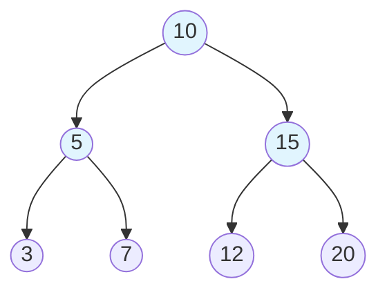
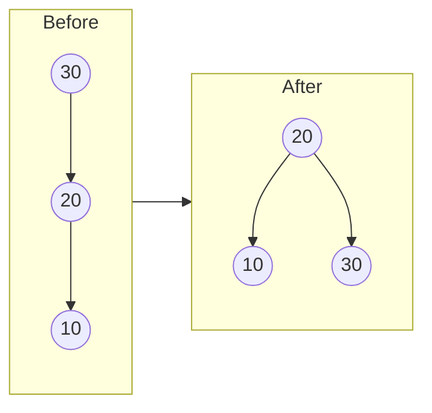
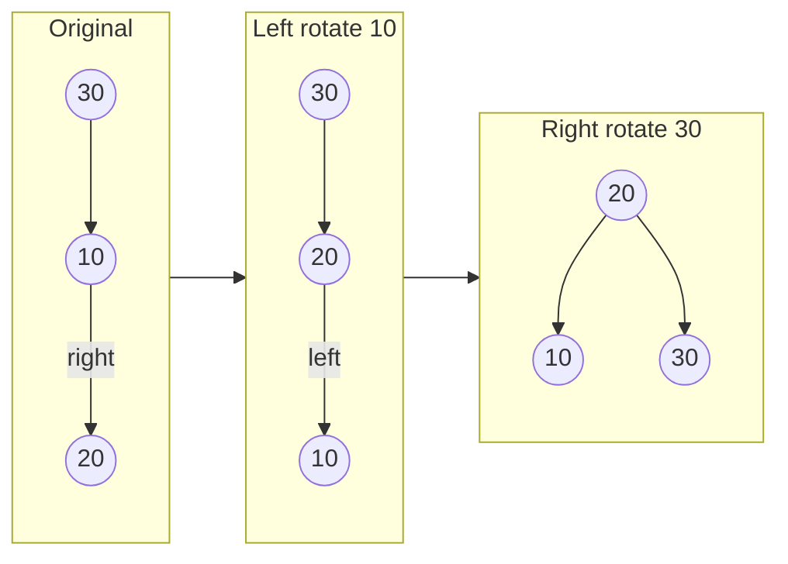

# AVL Tree - C++ Implementation

## Why AVL Trees?

### The Problem It Solves

Imagine you have a contact list on your phone with thousands of names. When you search for "Sarah," you do not want to check every single contact one by one. You want to jump directly to roughly where "S" names should be, then narrow down quickly.

A **Binary Search Tree (BST)** promises exactly this fast lookup. By organizing data so that smaller values go left and larger values go right, you can find any element by making a series of left/right decisions, eliminating half the remaining options at each step. With 1,000 contacts, you would need at most about 10 comparisons instead of 1,000.

But there is a catch. If you insert already-sorted data into a BST, something terrible happens:

```
Insert: 1, 2, 3, 4, 5

        1
         \
          2
           \
            3
             \
              4
               \
                5
```

This "tree" is actually just a linked list. Searching for 5 requires checking every single node. Your O(log n) dream has become O(n) reality. This is called a **degenerate tree**.

The **AVL tree** solves this problem by automatically rebalancing itself after every insert and delete. No matter what order you add elements, the tree stays balanced, guaranteeing O(log n) operations.

### Real-World Analogies

**Library Card Catalog**: Picture an old library with filing cabinets of index cards. A good librarian keeps the drawers evenly distributed. If drawer A-F has 500 cards while G-Z has only 50, finding "Martinez" takes forever. The librarian periodically redistributes cards to keep things balanced. An AVL tree does this automatically.

**Tournament Brackets**: In a balanced tournament bracket with 16 teams, every team plays exactly 4 games to reach the final. If the bracket were lopsided (team 1 plays team 2, winner plays team 3, winner plays team 4...), one unfortunate team might play 15 games. AVL trees ensure "fair brackets" for your data.

**Organizational Hierarchy**: A flat hierarchy where everyone reports to one manager is inefficient. A balanced org chart where each manager has a similar number of reports lets decisions flow efficiently. AVL trees maintain this balance.

### When to Use It

- **Use an AVL tree when you need** guaranteed O(log n) search, insert, and delete
- **Use it when data arrives in unpredictable order**, especially potentially sorted or nearly-sorted sequences
- **Use it for in-memory databases** or indexes where lookup speed is critical
- **Prefer AVL over Red-Black trees** when you have more lookups than modifications (AVL is more strictly balanced, so searches are slightly faster)
- **Avoid AVL trees** when you only need insertion at ends (use a deque) or when data is static (use a sorted array with binary search)

---

## Core Concept

### First: Understanding Binary Search Trees

Before we can understand AVL trees, we need to understand the **Binary Search Tree (BST) property**:

> For every node in the tree:
> - All values in its left subtree are smaller
> - All values in its right subtree are larger

This single rule enables fast searching. Here is a BST with values 3, 7, 10, 15, 20:

```
        10
       /  \
      7    15
     /       \
    3        20
```

To find 20:
1. Start at root (10). Is 20 > 10? Yes, go right.
2. At 15. Is 20 > 15? Yes, go right.
3. At 20. Found it!

We only checked 3 nodes out of 5. With a million nodes in a balanced tree, we would check about 20.

### The Balance Problem

The BST property says nothing about shape. These are all valid BSTs containing 1, 2, 3, 4, 5:

**Balanced:**
```
        3
       / \
      2   4
     /     \
    1       5
```

**Degenerate (linked list):**
```
    1
     \
      2
       \
        3
         \
          4
           \
            5
```

Both satisfy the BST property. But searching for 5 takes 2 steps in the first tree and 5 steps in the second.

### The AVL Solution: Balance Factor

AVL trees (named after inventors **A**delson-**V**elsky and **L**andis) add one constraint:

> For every node, the heights of its left and right subtrees differ by at most 1.

We define **balance factor** = height(left subtree) - height(right subtree).

A node is **balanced** if its balance factor is -1, 0, or 1.

```
       10 (bf=0)         10 (bf=1)         10 (bf=2) <- UNBALANCED!
       /  \              /  \              /
      5    15           5    15           5
                       /                 /
                      3                 3
                                       /
                                      1
```

When an insertion or deletion causes any node's balance factor to become -2 or +2, we perform **rotations** to restore balance.

### Visual Representation

Here is a balanced AVL tree:



Every node has balance factor of -1, 0, or 1. The height is 3 (counting from 1 at leaves), which is the minimum possible height for 7 nodes. A degenerate tree with 7 nodes would have height 7.

### Key Terminology

- **Height**: The number of edges on the longest path from a node to a leaf. A leaf has height 0. In this implementation, height is stored as 1 for a leaf (counting nodes, not edges).
- **Balance Factor**: left subtree height minus right subtree height. Must be -1, 0, or 1 for an AVL tree.
- **Rotation**: A local restructuring operation that changes parent-child relationships while preserving BST order.
- **Left-heavy**: A node with balance factor > 0 (left subtree is taller).
- **Right-heavy**: A node with balance factor < 0 (right subtree is taller).

---

## How It Works: Step-by-Step

### Operation 1: Insert

**What it does**: Adds a new value to the tree while maintaining both BST order and AVL balance.

**The algorithm**:
1. Use standard BST insertion (go left if smaller, right if larger)
2. After inserting, walk back up the tree updating heights
3. At each ancestor, check the balance factor
4. If unbalanced (bf = -2 or +2), perform the appropriate rotation

**Step-by-step walkthrough of inserting 3 into this tree**:

Starting state:
```
        10 (h=2, bf=0)
       /  \
      5    15
   (h=1)  (h=1)
```

Step 1: Search for insertion point. 3 < 10, go left. 3 < 5, go left. Insert as left child of 5.
```
        10
       /  \
      5    15
     /
    3
```

Step 2: Update heights walking back up. Node 5's height becomes 2. Node 10's height becomes 3.
```
        10 (h=3)
       /  \
      5    15 (h=1)
   (h=2)
     /
    3 (h=1)
```

Step 3: Check balance factors.
- Node 3: bf = 0 (no children)
- Node 5: bf = 1 - 0 = 1 (ok)
- Node 10: bf = 2 - 1 = 1 (ok)

All balanced! No rotation needed.

### The Four Rotation Cases

When balance factor becomes +2 or -2, we must rotate. There are exactly four cases, each with a specific fix.

#### Case 1: Left-Left (LL) - Right Rotation

**When it happens**: Node is left-heavy (+2), and its left child is also left-heavy or balanced.

**The problem**:
```
        30 (bf=+2)
       /
      20 (bf=+1 or 0)
     /
    10
```

**The fix**: Single right rotation around 30.

```
Before:                 After:
        30                    20
       /                     /  \
      20          -->      10    30
     /
    10
```

**Step-by-step**:
1. Let x = 30's left child (20)
2. 30's left becomes x's right (nothing here)
3. x's right becomes 30
4. Update heights: first 30, then 20
5. Return x (20) as the new subtree root



#### Case 2: Right-Right (RR) - Left Rotation

**When it happens**: Node is right-heavy (-2), and its right child is also right-heavy or balanced.

**The problem**:
```
    10 (bf=-2)
      \
       20 (bf=-1 or 0)
         \
          30
```

**The fix**: Single left rotation around 10.

```
Before:                 After:
    10                        20
      \                      /  \
       20         -->      10    30
         \
          30
```

**Step-by-step**:
1. Let y = 10's right child (20)
2. 10's right becomes y's left (nothing here)
3. y's left becomes 10
4. Update heights: first 10, then 20
5. Return y (20) as the new subtree root

#### Case 3: Left-Right (LR) - Double Rotation

**When it happens**: Node is left-heavy (+2), but its left child is right-heavy.

**The problem**:
```
        30 (bf=+2)
       /
      10 (bf=-1)
        \
         20
```

A single right rotation would not fix this! The 20 would still be in the wrong place.

**The fix**: First left-rotate around 10, then right-rotate around 30.

```
Before:           After left          After right
                  rotate(10):         rotate(30):
      30              30                   20
     /               /                    /  \
   10       -->    20          -->      10    30
     \            /
      20        10
```

**Step-by-step**:
1. Left-rotate the left child (10): now 20 is the left child of 30
2. Right-rotate the root (30): now 20 is the root



#### Case 4: Right-Left (RL) - Double Rotation

**When it happens**: Node is right-heavy (-2), but its right child is left-heavy.

**The problem**:
```
    10 (bf=-2)
      \
       30 (bf=+1)
      /
    20
```

**The fix**: First right-rotate around 30, then left-rotate around 10.

```
Before:           After right         After left
                  rotate(30):         rotate(10):
    10                10                   20
      \                 \                 /  \
       30     -->        20      -->    10    30
      /                    \
    20                      30
```

### Summary of Rotation Cases

| Case | Condition | Fix |
|------|-----------|-----|
| LL | bf(node) = +2, bf(left) >= 0 | Right rotate |
| LR | bf(node) = +2, bf(left) < 0 | Left rotate left child, then right rotate |
| RR | bf(node) = -2, bf(right) <= 0 | Left rotate |
| RL | bf(node) = -2, bf(right) > 0 | Right rotate right child, then left rotate |

### Operation 2: Remove

**What it does**: Removes a value from the tree while maintaining BST order and AVL balance.

**The algorithm**:
1. Find the node to remove (standard BST search)
2. Handle three cases:
   - **Leaf node**: Just delete it
   - **One child**: Replace node with its child
   - **Two children**: Replace value with in-order successor, then delete successor
3. Walk back up, updating heights and rebalancing as needed

**Removing a node with two children (the tricky case)**:

To remove 10 from this tree:
```
        10
       /  \
      5    15
     /    /  \
    3   12    20
```

Step 1: Find in-order successor (smallest value in right subtree). That is 12.

Step 2: Copy successor's value to the node being removed.
```
        12          <- value changed from 10
       /  \
      5    15
     /    /  \
    3   12    20     <- this 12 will be removed
```

Step 3: Recursively delete the successor (12) from the right subtree.
```
        12
       /  \
      5    15
     /       \
    3        20
```

Step 4: Rebalance on the way back up.

### Worked Example: Complete Sequence

Let us trace through inserting the sequence 10, 20, 30, 25, 5, 3 to see rotations in action.

**Insert 10:**
```
    10
    (h=1, bf=0)
```

**Insert 20:** (20 > 10, goes right)
```
    10 (h=2, bf=-1)
      \
       20 (h=1)
```
Balance factor is -1. No rotation needed.

**Insert 30:** (30 > 10, go right; 30 > 20, go right)
```
    10 (h=3, bf=-2) <- UNBALANCED!
      \
       20 (h=2, bf=-1)
         \
          30 (h=1)
```

Node 10 has bf = -2 (right-heavy). Its right child (20) has bf = -1 (also right-heavy).
This is the **RR case**: single left rotation around 10.

```
After left rotation:
        20 (h=2, bf=0)
       /  \
     10    30
   (h=1)  (h=1)
```

**Insert 25:** (25 > 20, go right; 25 < 30, go left)
```
        20 (h=3, bf=-1)
       /  \
     10    30 (h=2, bf=+1)
          /
        25 (h=1)
```

Node 30 has bf = +1. Node 20 has bf = -1. All balanced.

**Insert 5:** (5 < 20, go left; 5 < 10, go left)
```
        20 (h=3, bf=0)
       /  \
     10    30 (h=2)
    /     /
   5    25
```

All balanced (bf at root is now 0).

**Insert 3:** (3 < 20, go left; 3 < 10, go left; 3 < 5, go left)
```
        20 (bf=+1)
       /  \
     10    30
    /     /
   5    25
  /
 3
```

Let us check all balance factors:
- Node 3: bf = 0
- Node 5: bf = +1 (left child 3, no right child)
- Node 10: bf = 2 - 0 = +2 <- UNBALANCED!

Node 10 has bf = +2 (left-heavy). Its left child (5) has bf = +1 (also left-heavy).
This is the **LL case**: single right rotation around 10.

```
Before:                After:
     10                     5
    /                      / \
   5          -->         3   10
  /
 3
```

Final tree:
```
          20 (bf=0)
         /  \
        5    30
       / \   /
      3  10 25
```

---

## From Concept to Code

### The Data Structure

Before looking at code, let us think about what we need to track:

1. **The value stored**: Whatever type T the user wants to store
2. **Pointers to children**: Left and right child nodes
3. **Height**: So we can compute balance factor in O(1) time
4. **Tree metadata**: Root pointer and total size

**Why store height in each node?**

Computing height recursively takes O(n) time (must visit every node in subtree). If we stored balance factor directly, we would need to recompute heights anyway during rebalancing. By storing height, we can compute balance factor in O(1): just subtract the two stored heights.

### C++ Implementation

```cpp
template <typename T>
class AVLTree {
private:
    struct Node {
        T value;
        Node* left;
        Node* right;
        size_type height;

        explicit Node(const T& v)
            : value(v), left(nullptr), right(nullptr), height(1) {}
    };

    Node* root_;
    size_type size_;
```

**Line-by-line breakdown**:

- `template <typename T>`: This class works with any type T. When you write `AVLTree<int>`, the compiler generates a version specifically for integers.
- `struct Node`: A node stores the value plus tree structure. Being inside the class, it is private by default.
- `T value`: The actual data stored at this node.
- `Node* left, * right`: Raw pointers to children. We manage their memory manually.
- `size_type height`: Height of the subtree rooted at this node. A newly created node (a leaf) has height 1.
- `explicit Node(const T& v)`: Constructor that initializes a leaf node. The `explicit` keyword prevents accidental implicit conversions.

### Computing Height and Balance Factor

```cpp
static size_type node_height(Node* node) {
    return node == nullptr ? 0 : node->height;
}

static void update_height(Node* node) {
    size_type left_h = node_height(node->left);
    size_type right_h = node_height(node->right);
    node->height = 1 + (left_h > right_h ? left_h : right_h);
}

static int balance_factor(Node* node) {
    if (node == nullptr)
        return 0;
    return static_cast<int>(node_height(node->left)) -
           static_cast<int>(node_height(node->right));
}
```

**Understanding the code**:

- `node_height`: Returns 0 for null pointers, otherwise the stored height. This handles the "empty subtree" case gracefully.
- `update_height`: Sets height to 1 plus the maximum of children's heights. The ternary operator `? :` acts like a compact if-else.
- `balance_factor`: Returns left height minus right height. The `static_cast<int>` is crucial: `size_type` is unsigned, so subtracting two unsigned values that should give a negative result would wrap around to a huge positive number. Casting to `int` first gives the correct negative result.

### Implementing Left and Right Rotation

```cpp
static Node* right_rotate(Node* y) {
    Node* x = y->left;
    Node* b = x->right;
    x->right = y;
    y->left = b;
    update_height(y);
    update_height(x);
    return x;
}

static Node* left_rotate(Node* x) {
    Node* y = x->right;
    Node* b = y->left;
    y->left = x;
    x->right = b;
    update_height(x);
    update_height(y);
    return y;
}
```

**Right rotation visualized**:

```
Before:                   After:
      y                      x
     / \                    / \
    x   c        -->       a   y
   / \                        / \
  a   b                      b   c
```

The code does exactly this:
1. Save y's left child as x
2. Save x's right child as b
3. x's right becomes y (y becomes right child of x)
4. y's left becomes b (b moves from x's right to y's left)
5. Update heights bottom-up: y first (it is now lower), then x
6. Return x as the new root of this subtree

**Why static?** These functions operate only on the nodes passed to them. They do not need access to `root_` or `size_`, so they can be static (no `this` pointer needed).

### Implementing Rebalance

```cpp
static Node* rebalance(Node* node) {
    update_height(node);
    int balance = balance_factor(node);

    if (balance > 1) {
        if (balance_factor(node->left) < 0)
            node->left = left_rotate(node->left);  // LR case: first rotation
        return right_rotate(node);                 // LL or LR: final rotation
    }

    if (balance < -1) {
        if (balance_factor(node->right) > 0)
            node->right = right_rotate(node->right);  // RL case: first rotation
        return left_rotate(node);                     // RR or RL: final rotation
    }

    return node;  // Already balanced
}
```

**Understanding the logic**:

This handles all four cases in a compact way:

1. `balance > 1`: Node is left-heavy (+2)
   - If left child is right-heavy (`balance_factor(node->left) < 0`), this is LR case. Do left rotation on left child first.
   - Then do right rotation on node (works for both LL and LR).

2. `balance < -1`: Node is right-heavy (-2)
   - If right child is left-heavy (`balance_factor(node->right) > 0`), this is RL case. Do right rotation on right child first.
   - Then do left rotation on node (works for both RR and RL).

3. Otherwise: Node is balanced, return unchanged.

### Implementing Insert

```cpp
Node* insert_node(Node* node, const T& value) {
    if (node == nullptr) {
        ++size_;
        return new Node(value);
    }

    if (value < node->value)
        node->left = insert_node(node->left, value);
    else if (node->value < value)
        node->right = insert_node(node->right, value);
    else
        return node;  // Duplicate, do nothing

    return rebalance(node);
}
```

**Understanding the recursion**:

This function demonstrates a beautiful pattern: recursion handles both descent and ascent.

1. **Base case**: If we have reached a null pointer, we have found the insertion spot. Create a new node and return it.

2. **Recursive case**: Go left or right based on comparison. The assignment `node->left = insert_node(...)` is key: the recursive call returns the (possibly new or rebalanced) root of that subtree.

3. **After recursion returns**: The `rebalance(node)` call happens on the way back up. Each ancestor gets a chance to rebalance.

**Why only use `<` for comparisons?** The code uses `value < node->value` and `node->value < value`. If both are false, the values are equal. This requires only operator< to be defined for type T, making the class usable with more types.

### Implementing Remove

```cpp
Node* remove_node(Node* node, const T& value) {
    if (node == nullptr)
        return nullptr;  // Value not found

    if (value < node->value) {
        node->left = remove_node(node->left, value);
    } else if (node->value < value) {
        node->right = remove_node(node->right, value);
    } else {
        // Found the node to remove
        if (node->left == nullptr) {
            Node* right = node->right;
            delete node;
            --size_;
            return right;
        }
        if (node->right == nullptr) {
            Node* left = node->left;
            delete node;
            --size_;
            return left;
        }
        // Two children: replace with in-order successor
        Node* successor = find_min(node->right);
        node->value = successor->value;
        node->right = remove_node(node->right, successor->value);
    }

    return rebalance(node);
}
```

**Understanding the three deletion cases**:

1. **No left child**: Return right child (which becomes the parent's new child). Even if right is null, this works correctly.

2. **No right child**: Return left child (which becomes the parent's new child).

3. **Two children**: We cannot just delete this node. Instead:
   - Find the in-order successor (smallest value in right subtree)
   - Copy the successor's value to this node
   - Recursively delete the successor from the right subtree
   - The successor is guaranteed to have at most one child (no left child), so its deletion is simpler

**Memory management**: Note the explicit `delete node` and `--size_` when actually removing a node. The successor case does not delete the current node - it only changes its value.

### Memory Management: Rule of Five

C++ requires manual memory management. This implementation follows the "Rule of Five":

```cpp
// Destructor
~AVLTree() { clear(); }

// Copy constructor
AVLTree(const AVLTree& other) : root_(nullptr), size_(0) {
    copy_tree(other.root_);
}

// Move constructor
AVLTree(AVLTree&& other) noexcept
    : root_(other.root_), size_(other.size_) {
    other.root_ = nullptr;
    other.size_ = 0;
}

// Copy assignment (copy-and-swap idiom)
AVLTree& operator=(const AVLTree& other) {
    if (this != &other) {
        AVLTree temp(other);
        swap(temp);
    }
    return *this;
}

// Move assignment
AVLTree& operator=(AVLTree&& other) noexcept {
    if (this != &other) {
        clear();
        root_ = other.root_;
        size_ = other.size_;
        other.root_ = nullptr;
        other.size_ = 0;
    }
    return *this;
}
```

**Why all five?**

- **Destructor**: When an AVLTree goes out of scope, all allocated nodes must be deleted. `destroy_tree` does a post-order traversal, deleting children before parents.

- **Copy constructor**: Creates an independent copy. `copy_tree` inserts each value from the source tree, ensuring proper structure.

- **Move constructor**: Transfers ownership without copying. The source tree is left empty. `noexcept` tells the compiler this will not throw, enabling optimizations.

- **Copy assignment**: Uses copy-and-swap idiom. First create a copy, then swap contents. If copying fails, the original is unchanged (strong exception safety).

- **Move assignment**: Like move construction but for existing objects. First clear current contents, then take ownership of source's data.

---

## Complexity Analysis

### Time Complexity

| Operation | Best | Average | Worst | Why |
|-----------|------|---------|-------|-----|
| insert | O(log n) | O(log n) | O(log n) | Tree height is always O(log n); at most one rebalance path |
| remove | O(log n) | O(log n) | O(log n) | Same as insert; successor finding is O(log n) |
| contains | O(1) | O(log n) | O(log n) | Best case: root; otherwise follows one path down |
| min/max | O(log n) | O(log n) | O(log n) | Follow left/right pointers to the end |
| height | O(1) | O(1) | O(1) | Stored in root node |
| is_balanced | O(n) | O(n) | O(n) | Must check every node |
| clear | O(n) | O(n) | O(n) | Must delete every node |

**Why O(log n) is guaranteed**:

The AVL balance condition ensures that an AVL tree with n nodes has height at most 1.44 * log2(n). This is because the sparsest possible AVL tree (minimum nodes for a given height) follows a Fibonacci-like recurrence, and Fibonacci numbers grow exponentially.

In contrast, a regular BST can degenerate to height n (a linked list).

### Space Complexity

- **Overall structure**: O(n) for n nodes
- **Per node overhead**: One extra `size_type` for height (typically 8 bytes on 64-bit systems)
- **Per operation**: O(log n) stack space for recursive operations

### Why Store Height Instead of Balance Factor?

This implementation stores height rather than balance factor. Trade-offs:

**Storing height (this implementation)**:
- Pros: Can query tree height in O(1); computing balance factor is simple subtraction
- Cons: Uses `size_type` (8 bytes) instead of a small int (could use 2 bits for -1, 0, +1)

**Storing balance factor**:
- Pros: Less memory (could fit in 2 bits)
- Cons: Computing tree height requires O(n) traversal; must carefully update balance factors

For most applications, the memory difference is negligible, and storing height is simpler to implement correctly.

---

## Common Mistakes and Pitfalls

### Mistake 1: Forgetting to Update Heights

```cpp
// WRONG: Missing height update after rotation
static Node* right_rotate(Node* y) {
    Node* x = y->left;
    Node* b = x->right;
    x->right = y;
    y->left = b;
    // Forgot update_height(y) and update_height(x)!
    return x;
}

// RIGHT: Update heights in correct order
static Node* right_rotate(Node* y) {
    Node* x = y->left;
    Node* b = x->right;
    x->right = y;
    y->left = b;
    update_height(y);  // y is now lower, update first
    update_height(x);  // x is now root, update second
    return x;
}
```

**Why this matters**: If heights are not updated, balance factors will be wrong, and the tree will not stay balanced. The order matters too: y is now a child of x, so y's height must be updated before x's.

### Mistake 2: Incorrect Balance Factor Calculation with Unsigned Types

```cpp
// WRONG: Unsigned subtraction can wrap around
int balance_factor(Node* node) {
    return node_height(node->left) - node_height(node->right);
    // If left=1 and right=3, this gives a huge positive number, not -2!
}

// RIGHT: Cast to signed before subtraction
int balance_factor(Node* node) {
    return static_cast<int>(node_height(node->left)) -
           static_cast<int>(node_height(node->right));
}
```

**Why this matters**: If `size_type` is `unsigned`, subtracting a larger value from a smaller one wraps around to a huge positive number instead of giving a negative result. This would cause the tree to rotate in the wrong direction.

### Mistake 3: Not Handling the Return Value of Recursive Calls

```cpp
// WRONG: Ignoring the return value
void insert_node(Node* node, const T& value) {
    if (node == nullptr) {
        node = new Node(value);  // This only changes the local variable!
        return;
    }
    if (value < node->value)
        insert_node(node->left, value);  // Not updating node->left
    // ...
}

// RIGHT: Capture and propagate the return value
Node* insert_node(Node* node, const T& value) {
    if (node == nullptr) {
        return new Node(value);
    }
    if (value < node->value)
        node->left = insert_node(node->left, value);
    // ...
    return rebalance(node);
}
```

**Why this matters**: The recursive pattern relies on return values to update parent pointers after rotations. The newly balanced subtree root must be linked back into the tree.

### Mistake 4: Memory Leak When Removing Nodes

```cpp
// WRONG: Returning child without deleting current node
Node* remove_node(Node* node, const T& value) {
    // ...
    if (node->left == nullptr) {
        return node->right;  // node is never deleted!
    }
    // ...
}

// RIGHT: Delete the node before returning its replacement
Node* remove_node(Node* node, const T& value) {
    // ...
    if (node->left == nullptr) {
        Node* right = node->right;
        delete node;  // Free the memory
        --size_;
        return right;
    }
    // ...
}
```

**Why this matters**: Every `new` needs a matching `delete`. If you return a replacement node without deleting the old one, that memory is lost forever.

### Mistake 5: Incorrect Double Rotation Order

```cpp
// WRONG: Wrong rotation for LR case
if (balance > 1) {
    if (balance_factor(node->left) < 0)
        return left_rotate(node);  // Should rotate left child first!
    return right_rotate(node);
}

// RIGHT: Rotate left child, then rotate node
if (balance > 1) {
    if (balance_factor(node->left) < 0)
        node->left = left_rotate(node->left);  // Fix the zig-zag first
    return right_rotate(node);
}
```

**Why this matters**: In the LR case, the imbalance creates a "zig-zag" pattern. A single right rotation would just shift the problem. You must first straighten the zig-zag by rotating the left child.

---

## Practice Problems

To solidify your understanding, try these exercises:

1. **Implement level-order traversal**: Return elements level by level, left to right. This requires a queue, not recursion.

2. **Add a `kth_smallest(k)` method**: Return the kth smallest element in O(log n) time. Hint: you will need to store subtree sizes.

3. **Implement range query**: Return all elements between a lower and upper bound. The challenge is to do this efficiently without checking every node.

4. **Delete a range**: Remove all elements between a lower and upper bound. Think about how many rebalances this might trigger.

5. **Implement AVL tree with parent pointers**: This allows iterative traversal but requires updating parent pointers during rotations.

---

## Summary

### Key Takeaways

- **BST property enables fast search** by eliminating half the tree at each step, but only if the tree is balanced
- **Degenerate trees** occur when insertions are ordered, causing O(n) operations
- **AVL trees maintain balance** by ensuring every node's subtree heights differ by at most 1
- **Four rotation cases** (LL, RR, LR, RL) handle all possible imbalances
- **Recursion naturally handles rebalancing** because it processes nodes on the way back up
- **Storing height (not balance factor)** simplifies implementation and enables O(1) tree height queries

### Quick Reference

```
AVL Tree - Self-balancing BST guaranteeing O(log n) operations
|-- insert(value): O(log n) - Add value, rebalance path to root
|-- remove(value): O(log n) - Remove value, rebalance path to root
|-- contains(value): O(log n) - Check if value exists
|-- min() / max(): O(log n) - Find smallest / largest value
|-- height(): O(1) - Return tree height (stored in root)
|-- is_balanced(): O(n) - Verify AVL property (for testing)
|-- clear(): O(n) - Remove all elements

Balance Factor = height(left) - height(right)
Must be -1, 0, or +1 for every node

Rotation Cases:
|-- LL (bf=+2, left.bf >= 0): Right rotate
|-- LR (bf=+2, left.bf < 0): Left rotate left child, then right rotate
|-- RR (bf=-2, right.bf <= 0): Left rotate
|-- RL (bf=-2, right.bf > 0): Right rotate right child, then left rotate

Best for: Databases, in-memory indexes, any workload with many lookups
Avoid when: Data is static (sorted array is simpler), only need FIFO/LIFO (use queue/stack)
```
