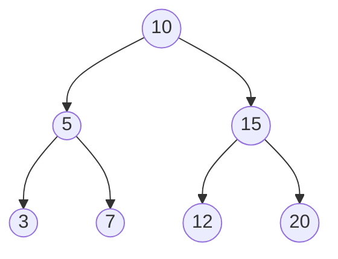
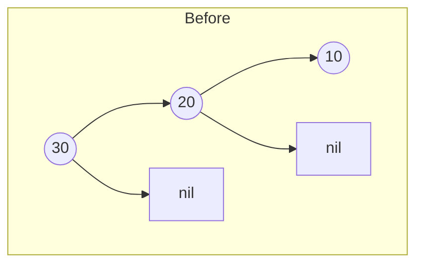
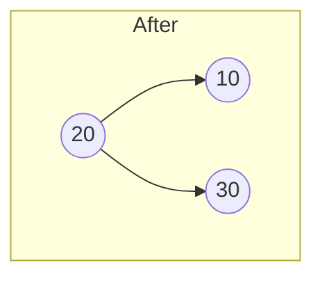
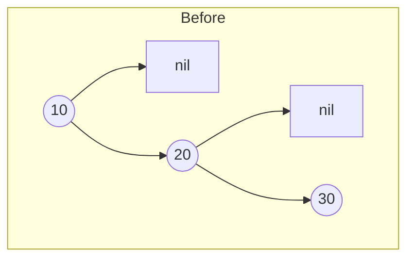
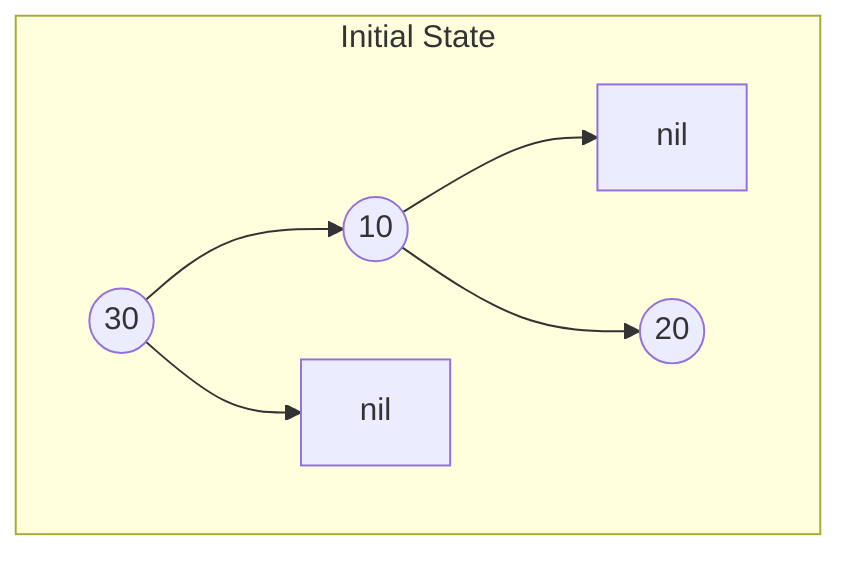
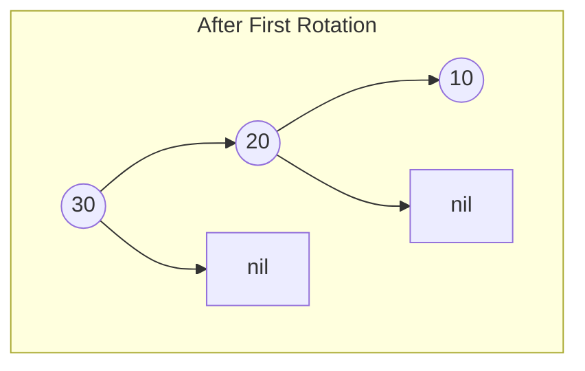
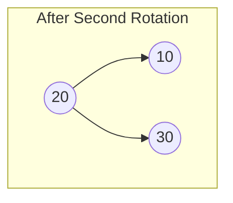
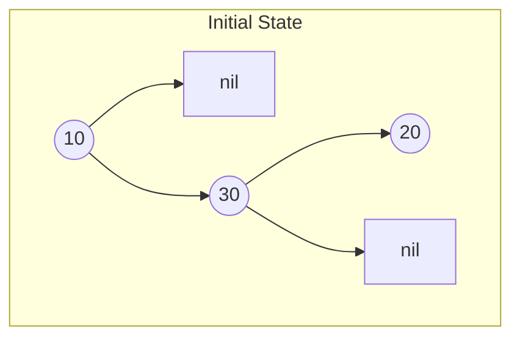
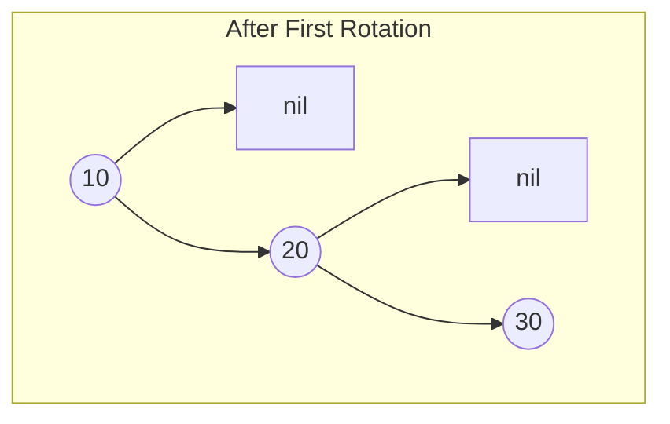
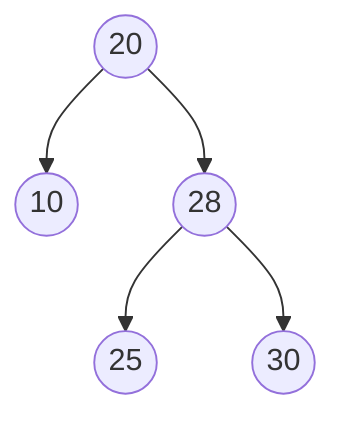

# AVL Tree — Go Implementation

## Why AVL Trees?

### The Problem It Solves

Imagine you have a phone book app where users can add contacts and search for them by name. You need fast lookups, but also fast insertions since users add contacts frequently.

A sorted array gives you fast binary search (O(log n)), but inserting a new contact means shifting everything after it—painfully slow at O(n). A linked list gives fast insertion at O(1), but searching requires walking through every node—O(n) again.

Binary Search Trees (BSTs) promise the best of both worlds: O(log n) for both search and insert. But there's a catch. If you insert sorted data into a BST, you get a "degenerate" tree that's really just a linked list:

```
Insert: 1, 2, 3, 4, 5

    1
     \
      2
       \
        3
         \
          4
           \
            5

This is O(n) for everything!
```

**AVL trees solve this problem.** Named after inventors Adelson-Velsky and Landis (1962), they automatically rebalance themselves after every insertion or deletion, guaranteeing O(log n) operations no matter what order you insert data.

### Real-World Analogies

1. **A well-organized library**: Imagine a library where books are arranged on shelves by call number. A good librarian periodically reorganizes shelves so no section gets too tall or too short. This keeps browsing time roughly equal no matter which section you visit. AVL trees work the same way—they reorganize (rotate) to keep all paths roughly the same length.

2. **A balanced mobile sculpture**: Think of a hanging mobile where each arm must stay balanced. If you add weight to one side, you need to adjust the structure to restore balance. AVL trees detect imbalance and "rotate" nodes to restore equilibrium.

3. **Load balancing in a warehouse**: If one storage aisle gets overloaded while others are empty, workers move items around to distribute the load evenly. AVL trees redistribute nodes when one subtree grows too tall relative to its sibling.

### When to Use It

- **Use an AVL tree when you need:**
  - Guaranteed O(log n) search, insert, and delete (never degrades to O(n))
  - Sorted order (in-order traversal gives sorted elements)
  - Finding minimum/maximum efficiently
  - Range queries ("all values between X and Y")

- **Unlike a regular BST**: AVL gives you worst-case guarantees, not just average-case hopes
- **Unlike a hash map**: AVL maintains sorted order and supports range operations
- **Unlike a Red-Black tree**: AVL is more strictly balanced, so searches are slightly faster (but insertions require more rotations)

---

## Core Concept

### The Big Idea

An AVL tree is a Binary Search Tree with one additional constraint: **for every node, the heights of its left and right subtrees differ by at most 1**. This difference is called the "balance factor."

When an insertion or deletion violates this constraint, the tree performs one or two "rotations"—local restructuring operations that restore balance while preserving the BST ordering property.

### Understanding Binary Search Trees First

Before diving into AVL specifics, let's make sure the BST foundation is solid.

**The BST Property**: For every node N:
- All values in N's **left subtree** are **less than** N's value
- All values in N's **right subtree** are **greater than** N's value

This property enables binary search: at each node, you know which half of the tree to explore.



In this BST:
- Everything in 10's left subtree (5, 3, 7) is less than 10
- Everything in 10's right subtree (15, 12, 20) is greater than 10
- The same property holds recursively at every node

### The AVL Balance Factor

The **height** of a node is the longest path from that node to any leaf (empty nodes have height 0).

The **balance factor** of a node is: `height(left subtree) - height(right subtree)`

A node is **balanced** if its balance factor is -1, 0, or +1.

```
        10 (balance: 0)
       /  \
      5    15
     / \     \
    3   7    20

Heights:
- Node 3: height = 1 (leaf)
- Node 7: height = 1 (leaf)
- Node 5: height = 2
- Node 20: height = 1
- Node 15: height = 2
- Node 10: height = 3

Balance factors:
- Node 3: 0 - 0 = 0 (balanced)
- Node 7: 0 - 0 = 0 (balanced)
- Node 5: 1 - 1 = 0 (balanced)
- Node 20: 0 - 0 = 0 (balanced)
- Node 15: 0 - 1 = -1 (balanced, right-heavy)
- Node 10: 2 - 2 = 0 (balanced)
```

### Key Terminology

- **Height**: The longest path from a node down to a leaf. Leaves have height 1, nil has height 0.
- **Balance Factor**: Left height minus right height. Valid values are -1, 0, +1.
- **Rotation**: A local tree restructuring that changes parent-child relationships while preserving BST order.
- **Left-heavy**: Balance factor > 0 (left subtree is taller)
- **Right-heavy**: Balance factor < 0 (right subtree is taller)
- **Unbalanced**: |balance factor| > 1, requiring rotation(s)

---

## How It Works: Step-by-Step

### Operation 1: Search (Contains)

**What it does**: Determines whether a value exists in the tree.

Search in an AVL tree works exactly like a regular BST—the balancing doesn't change the search algorithm.

**Step-by-step walkthrough**:

Starting tree:
```
        10
       /  \
      5    15
     / \   / \
    3   7 12  20
```

Search for 7:

```
Step 1: Compare 7 with root (10)
        7 < 10, go left

        10  <-- current
       /
      5
     / \
    3   7

Step 2: Compare 7 with 5
        7 > 5, go right

      5  <-- current
       \
        7

Step 3: Compare 7 with 7
        7 == 7, FOUND!
```

**Why this approach?** Each comparison eliminates half the remaining tree. With balanced height, this takes O(log n) steps.

### Operation 2: Insert

**What it does**: Adds a new value to the tree, then rebalances if necessary.

**Step-by-step walkthrough**:

Starting with an empty tree, let's insert: 10, 5, 3

```
Insert 10:
        10 (height=1, balance=0)

        Tree is balanced.

Insert 5:
        10 (height=2, balance=1)
       /
      5 (height=1, balance=0)

        Tree is balanced (balance factor of 10 is +1, which is fine).

Insert 3:
        10 (height=3, balance=2)  <-- UNBALANCED! balance > 1
       /
      5 (height=2, balance=1)
     /
    3 (height=1, balance=0)

        Node 10 has balance factor 2 - this violates AVL property!
        Need to rotate.
```

After right rotation at 10:
```
      5 (height=2, balance=0)
     / \
    3   10

    Tree is now balanced!
```

**Why this approach?** After standard BST insertion, we walk back up the tree, updating heights and checking balance. When we find an unbalanced node, rotations fix it.

### Operation 3: Delete

**What it does**: Removes a value from the tree, then rebalances if necessary.

Deletion has three cases based on the node being removed:

**Case 1: Leaf node (no children)**
Simply remove it.

**Case 2: One child**
Replace the node with its child.

**Case 3: Two children**
Find the in-order successor (smallest node in right subtree), copy its value to the node being deleted, then delete the successor.

After deletion, rebalance walking back up.

---

## The Four Rotation Cases

When a node becomes unbalanced (|balance factor| > 1), we need rotations to fix it. There are exactly four cases:

### Case 1: Left-Left (LL) — Single Right Rotation

**When it happens**: Node is left-heavy (balance > 1) AND left child is left-heavy or balanced (balance >= 0).

**The problem**: A chain of left children creates imbalance.

```
Before:
        30 (balance=2)
       /
      20 (balance=1)
     /
    10

After right rotation at 30:
      20 (balance=0)
     /  \
    10   30
```

**Visual step-by-step**:



```
Step 1: Identify the rotation
        - Node 30 has balance factor +2 (left-heavy)
        - Node 30's left child (20) has balance factor +1 (left-heavy)
        - This is Left-Left case: single right rotation

Step 2: Perform right rotation at 30
        - 20 becomes the new root of this subtree
        - 30 becomes 20's right child
        - 20's original right child (if any) becomes 30's left child
```



### Case 2: Right-Right (RR) — Single Left Rotation

**When it happens**: Node is right-heavy (balance < -1) AND right child is right-heavy or balanced (balance <= 0).

**The problem**: A chain of right children creates imbalance.

```
Before:
    10 (balance=-2)
      \
       20 (balance=-1)
         \
          30

After left rotation at 10:
      20 (balance=0)
     /  \
    10   30
```

**Visual step-by-step**:



```
Step 1: Identify the rotation
        - Node 10 has balance factor -2 (right-heavy)
        - Node 10's right child (20) has balance factor -1 (right-heavy)
        - This is Right-Right case: single left rotation

Step 2: Perform left rotation at 10
        - 20 becomes the new root of this subtree
        - 10 becomes 20's left child
        - 20's original left child (if any) becomes 10's right child
```


### Case 3: Left-Right (LR) — Double Rotation

**When it happens**: Node is left-heavy (balance > 1) AND left child is right-heavy (balance < 0).

**The problem**: The imbalance zigzags left then right.

```
Before:
        30 (balance=2)
       /
      10 (balance=-1)
        \
         20

This needs TWO rotations:
1. Left rotation at 10
2. Right rotation at 30
```

**Visual step-by-step**:



```
Step 1: Left rotate at 10 (the left child)

        30
       /
      20
     /
    10
```



```
Step 2: Right rotate at 30 (the original unbalanced node)

      20
     /  \
    10   30
```



### Case 4: Right-Left (RL) — Double Rotation

**When it happens**: Node is right-heavy (balance < -1) AND right child is left-heavy (balance > 0).

**The problem**: The imbalance zigzags right then left.

```
Before:
    10 (balance=-2)
      \
       30 (balance=1)
      /
     20

This needs TWO rotations:
1. Right rotation at 30
2. Left rotation at 10
```

**Visual step-by-step**:



```
Step 1: Right rotate at 30 (the right child)

    10
      \
       20
         \
          30
```



```
Step 2: Left rotate at 10 (the original unbalanced node)

      20
     /  \
    10   30
```


### Rotation Decision Summary

```
if balance > 1 (left-heavy):
    if left child's balance >= 0:
        Right Rotation (LL case)
    else:
        Left-Right Rotation (LR case)

if balance < -1 (right-heavy):
    if right child's balance <= 0:
        Left Rotation (RR case)
    else:
        Right-Left Rotation (RL case)
```

---

## Worked Example: Complete Sequence

Let's trace through inserting: 50, 25, 75, 10, 30, 60, 80, 5, 15, 27, 55

```
Operation 1: Insert 50
        50 (h=1, b=0)

        Balanced.

Operation 2: Insert 25
        50 (h=2, b=1)
       /
      25 (h=1, b=0)

        Balanced.

Operation 3: Insert 75
        50 (h=2, b=0)
       /  \
      25   75

        Balanced.

Operation 4: Insert 10
          50 (h=3, b=1)
         /  \
        25   75
       /
      10

        Balanced.

Operation 5: Insert 30
          50 (h=3, b=1)
         /  \
        25   75
       /  \
      10   30

        Balanced.

Operation 6: Insert 60
          50 (h=3, b=0)
         /  \
        25   75
       / \   /
      10 30 60

        Balanced.

Operation 7: Insert 80
          50 (h=3, b=0)
         /  \
        25   75
       / \   / \
      10 30 60 80

        Balanced.

Operation 8: Insert 5
            50 (h=4, b=1)
           /  \
          25   75
         / \   / \
        10 30 60 80
       /
      5

        Balanced (root has b=1, still valid).

Operation 9: Insert 15
            50 (h=4, b=1)
           /  \
          25   75
         / \   / \
        10 30 60 80
       / \
      5  15

        Balanced.

Operation 10: Insert 27
            50 (h=4, b=1)
           /  \
          25   75
         / \   / \
        10 30 60 80
       / \ /
      5 15 27

        Balanced.

Operation 11: Insert 55
            50 (h=4, b=1)
           /  \
          25   75
         / \   / \
        10 30 60 80
       / \ /  /
      5 15 27 55

        Balanced!
```

This sequence was well-ordered and didn't require any rotations. Let's try a sequence that does.

### Sequence Requiring Rotations

Insert: 30, 20, 10, 25, 28

```
Insert 30:
        30

Insert 20:
        30
       /
      20

Insert 10:
        30 (b=2) <-- UNBALANCED!
       /
      20 (b=1)
     /
    10

    LL case: Right rotate at 30

    After rotation:
        20 (b=0)
       /  \
      10   30

Insert 25:
        20 (b=-1)
       /  \
      10   30
          /
         25

    Balanced.

Insert 28:
        20 (b=-2) <-- UNBALANCED!
       /  \
      10   30 (b=1)
          /
         25 (b=-1)
           \
            28

    Node 30 has b=1, but let's check 20...
    Actually, let's recalculate:

    After inserting 28:
    - Node 28: h=1, b=0
    - Node 25: h=2, b=-1
    - Node 30: h=3, b=2 (left=2, right=0) <-- Wait, that's wrong.

    Let me recalculate:
    - Node 30's left subtree (25->28) has height 2
    - Node 30's right subtree (nil) has height 0
    - Node 30: b = 2 - 0 = 2 <-- UNBALANCED at 30!

    Node 30 is left-heavy (b=2)
    Node 25 is right-heavy (b=-1)
    This is LR case!

    Step 1: Left rotate at 25
            30
           /
          28
         /
        25

    Step 2: Right rotate at 30
          28
         /  \
        25   30

    Now attach back to tree:
        20 (b=0)
       /  \
      10   28
          /  \
         25   30
```

Final tree after all insertions:


---

## From Concept to Code

### The Data Structure

Before looking at the code, let's understand what we need to track:

1. **Each node needs:**
   - `value`: The data stored at this node
   - `left`, `right`: Pointers to child nodes (nil if no child)
   - `height`: Used to calculate balance factor quickly

2. **The tree needs:**
   - `root`: Pointer to the root node
   - `size`: Number of elements (avoids O(n) counting)

### Go Implementation

```go
type node[T cmp.Ordered] struct {
    value  T
    left   *node[T]
    right  *node[T]
    height int
}

type AVLTree[T cmp.Ordered] struct {
    root *node[T]
    size int
}
```

**Understanding the Go-specific parts:**

- **`[T cmp.Ordered]`**: This is Go's generics syntax. `T` is a type parameter that can be any type satisfying the `cmp.Ordered` constraint (integers, floats, strings—anything you can use `<` and `>` with).

- **`*node[T]`**: A pointer to a node. In Go, pointers can be `nil`, which represents "no node here." This is how we represent empty children.

- **Lowercase `node`**: In Go, lowercase names are unexported (private). The `node` type is an implementation detail; only `AVLTree` is part of the public API.

- **Zero values**: When you create an `AVLTree`, Go initializes `root` to `nil` and `size` to `0` automatically. No constructor needed for the empty case.

### Constructor

```go
func New[T cmp.Ordered]() *AVLTree[T] {
    return &AVLTree[T]{}
}
```

This creates a new empty tree. The `&AVLTree[T]{}` syntax creates a zero-initialized struct and returns a pointer to it.

### Helper Functions: Height and Balance

```go
func getHeight[T cmp.Ordered](n *node[T]) int {
    if n == nil {
        return 0
    }
    return n.height
}

func updateHeight[T cmp.Ordered](n *node[T]) {
    n.height = 1 + max(getHeight(n.left), getHeight(n.right))
}

func balanceFactor[T cmp.Ordered](n *node[T]) int {
    if n == nil {
        return 0
    }
    return getHeight(n.left) - getHeight(n.right)
}
```

**Understanding these functions:**

- **`getHeight`**: Returns 0 for nil nodes, otherwise the stored height. We check for nil because we often call this on children that might not exist.

- **`updateHeight`**: Sets a node's height to 1 plus the maximum of its children's heights. The `max` function is built into Go 1.21+.

- **`balanceFactor`**: Left height minus right height. Positive means left-heavy, negative means right-heavy.

**Why package-level functions instead of methods?**

These are helper functions that operate on individual nodes, not on the tree as a whole. In Go, it's idiomatic to make these package-level generic functions rather than methods. They don't need access to the tree's `root` or `size`.

### Implementing Rotations

```go
func rotateRight[T cmp.Ordered](y *node[T]) *node[T] {
    x := y.left
    b := x.right
    x.right = y
    y.left = b
    updateHeight(y)
    updateHeight(x)
    return x
}
```

**Step-by-step breakdown:**

```
Before:
      y
     / \
    x   C
   / \
  A   b

Let me trace through the code:

1. x := y.left        // x is y's left child
2. b := x.right       // b is x's right subtree (might be nil)
3. x.right = y        // y becomes x's right child
4. y.left = b         // b becomes y's left child
5. updateHeight(y)    // y is now lower, update first
6. updateHeight(x)    // x is now higher, update after y
7. return x           // x is the new root of this subtree

After:
      x
     / \
    A   y
       / \
      b   C
```

The left rotation is the mirror image:

```go
func rotateLeft[T cmp.Ordered](x *node[T]) *node[T] {
    y := x.right
    b := y.left
    y.left = x
    x.right = b
    updateHeight(x)
    updateHeight(y)
    return y
}
```

**Why do we return the new root?**

After a rotation, the root of the subtree changes. The caller needs to update their pointer to point to the new root. This is why recursive functions return the (possibly new) node.

### Implementing Rebalance

```go
func rebalance[T cmp.Ordered](n *node[T]) *node[T] {
    updateHeight(n)
    balance := balanceFactor(n)

    if balance > 1 {
        if balanceFactor(n.left) < 0 {
            n.left = rotateLeft(n.left)
        }
        return rotateRight(n)
    }

    if balance < -1 {
        if balanceFactor(n.right) > 0 {
            n.right = rotateRight(n.right)
        }
        return rotateLeft(n)
    }

    return n
}
```

**Tracing through the four cases:**

1. **`balance > 1`**: Left-heavy
   - If `balanceFactor(n.left) < 0`: Left child is right-heavy, so we have LR case. First rotate left on the left child, then fall through to rotate right on n.
   - Otherwise: LL case. Just rotate right on n.

2. **`balance < -1`**: Right-heavy
   - If `balanceFactor(n.right) > 0`: Right child is left-heavy, so we have RL case. First rotate right on the right child, then fall through to rotate left on n.
   - Otherwise: RR case. Just rotate left on n.

3. **Otherwise**: Already balanced, return unchanged.

### Implementing Insert

```go
func (t *AVLTree[T]) Insert(value T) {
    t.root = insertNode(t.root, value, &t.size)
}

func insertNode[T cmp.Ordered](n *node[T], value T, size *int) *node[T] {
    if n == nil {
        *size++
        return &node[T]{value: value, height: 1}
    }
    if value < n.value {
        n.left = insertNode(n.left, value, size)
    } else if value > n.value {
        n.right = insertNode(n.right, value, size)
    } else {
        return n
    }
    return rebalance(n)
}
```

**Understanding the algorithm:**

1. **Base case (`n == nil`)**: We've found where to insert. Create a new node with height 1, increment size through the pointer, return the new node.

2. **Recursive case**: Compare value with current node:
   - If smaller, recursively insert into left subtree
   - If larger, recursively insert into right subtree
   - If equal, do nothing (no duplicates)

3. **After recursion returns**: Call `rebalance(n)` to fix any imbalance caused by the insertion, then return the (possibly new) subtree root.

**Why `*int` for size?**

Go doesn't have reference parameters like C++. To modify the tree's size counter from within a recursive function, we pass a pointer to it (`&t.size`). Inside `insertNode`, we dereference it (`*size++`) to increment the actual counter.

### Implementing Remove

```go
func (t *AVLTree[T]) Remove(value T) {
    t.root = removeNode(t.root, value, &t.size)
}

func removeNode[T cmp.Ordered](n *node[T], value T, size *int) *node[T] {
    if n == nil {
        return nil
    }

    if value < n.value {
        n.left = removeNode(n.left, value, size)
    } else if value > n.value {
        n.right = removeNode(n.right, value, size)
    } else {
        *size--
        if n.left == nil {
            return n.right
        }
        if n.right == nil {
            return n.left
        }
        *size++
        successor := findMin(n.right)
        n.value = successor.value
        n.right = removeNode(n.right, successor.value, size)
    }
    return rebalance(n)
}
```

**Understanding the deletion logic:**

1. **Not found (`n == nil`)**: Value doesn't exist, return nil.

2. **Search phase**: If value is less/greater than current node, recursively search left/right.

3. **Found the node to delete**:
   - Decrement size immediately (`*size--`)
   - **No left child**: Replace with right child
   - **No right child**: Replace with left child
   - **Two children**: Find in-order successor (smallest in right subtree), copy its value to current node, then recursively delete the successor. The `*size++` before recursive delete compensates for the double-decrement (we decremented here, and the recursive call will decrement again).

4. **After deletion**: Rebalance walking back up.

**The size increment trick:**

When deleting a node with two children, we're really deleting the successor, not the current node. We copy the successor's value and delete the successor. The `*size--` at the start and `*size++` before the recursive call cancel out, so the recursive delete's `*size--` is the only one that sticks.

### Implementing Contains (Search)

```go
func (t *AVLTree[T]) Contains(value T) bool {
    return findNode(t.root, value) != nil
}

func findNode[T cmp.Ordered](n *node[T], value T) *node[T] {
    for n != nil {
        if value < n.value {
            n = n.left
        } else if value > n.value {
            n = n.right
        } else {
            return n
        }
    }
    return nil
}
```

**Understanding the iterative approach:**

Unlike insert and remove, search doesn't modify the tree, so it doesn't need recursion. We use a simple loop:
- Compare value with current node
- Move left or right accordingly
- Return the node if found, nil if we fall off the tree

This is O(log n) because the tree is balanced—we eliminate half the remaining nodes at each step.

### Min and Max

```go
func (t *AVLTree[T]) Min() (T, error) {
    var zero T
    if t.root == nil {
        return zero, ErrEmptyTree
    }
    return findMin(t.root).value, nil
}

func findMin[T cmp.Ordered](n *node[T]) *node[T] {
    for n.left != nil {
        n = n.left
    }
    return n
}
```

**Understanding error handling in Go:**

Go doesn't have exceptions. Instead, functions return `(value, error)` pairs. Callers check the error:

```go
min, err := tree.Min()
if err != nil {
    // handle error (tree is empty)
}
// use min
```

The sentinel error `ErrEmptyTree` is exported (capitalized) so callers can check for it specifically:

```go
if errors.Is(err, avl.ErrEmptyTree) {
    // tree was empty
}
```

The `var zero T` creates a zero value of type T (0 for ints, "" for strings, etc.) to return alongside the error.

---

## Complexity Analysis

### Time Complexity

| Operation | Best | Average | Worst | Why |
|-----------|------|---------|-------|-----|
| Insert    | O(log n) | O(log n) | O(log n) | Tree height is always O(log n) due to balancing |
| Remove    | O(log n) | O(log n) | O(log n) | Same as insert—search + rotations on path |
| Contains  | O(1) | O(log n) | O(log n) | Best case: value is at root. Otherwise: balanced tree guarantees log height |
| Min/Max   | O(log n) | O(log n) | O(log n) | Walk down one edge of tree |
| Height    | O(1) | O(1) | O(1) | Stored in root node |
| InOrder   | O(n) | O(n) | O(n) | Must visit every node |
| Clone     | O(n log n) | O(n log n) | O(n log n) | n insertions, each O(log n) |
| IsBalanced| O(n) | O(n) | O(n) | Must check every node |

**Understanding "Why":**

- **O(log n) for insert/remove/search**: The AVL property guarantees tree height is at most ~1.44 * log2(n). Every operation follows a root-to-leaf path.

- **O(1) for rotations**: Each rotation only changes a few pointers—constant work regardless of tree size.

- **O(n log n) for Clone**: We insert n elements, and each insertion takes O(log n). A more clever O(n) clone is possible by deep-copying the structure directly, but the insert-based approach is simpler and guarantees proper balance.

### Space Complexity

- **Overall structure**: O(n) — we store one node per element
- **Per operation**: O(log n) — recursive calls use stack space proportional to tree height
- **Traversals returning slices**: O(n) — the result slice holds all n elements

### Why AVL Trees Stay Balanced

The strict balance condition (|balance factor| <= 1 at every node) guarantees that the tree height never exceeds approximately 1.44 * log2(n). This is proven mathematically—AVL trees cannot become degenerate linked lists no matter what order you insert data.

---

## Common Mistakes & Pitfalls

### Mistake 1: Forgetting to Return the New Root After Rotation

```go
// Wrong:
func (t *AVLTree[T]) Insert(value T) {
    insertNode(t.root, value, &t.size)  // Ignores return value!
}

// Right:
func (t *AVLTree[T]) Insert(value T) {
    t.root = insertNode(t.root, value, &t.size)  // Update root!
}
```

**Why this matters**: Rotations change which node is the root of a subtree. If you don't update the pointer, you lose the rotated structure and your tree becomes corrupted.

### Mistake 2: Updating Height in Wrong Order After Rotation

```go
// Wrong:
func rotateRight[T cmp.Ordered](y *node[T]) *node[T] {
    x := y.left
    b := x.right
    x.right = y
    y.left = b
    updateHeight(x)  // Wrong order!
    updateHeight(y)  // x's height depends on y, must update y first
    return x
}

// Right:
func rotateRight[T cmp.Ordered](y *node[T]) *node[T] {
    x := y.left
    b := x.right
    x.right = y
    y.left = b
    updateHeight(y)  // y is now below x, update y first
    updateHeight(x)  // now x's height calculation is correct
    return x
}
```

**Why this matters**: After rotation, the former root (y) is now a child of the new root (x). The child's height must be updated before the parent's, since parent height depends on children heights.

### Mistake 3: Not Handling Nil Nodes in Balance Factor

```go
// Wrong (crashes on nil):
func balanceFactor[T cmp.Ordered](n *node[T]) int {
    return n.left.height - n.right.height  // nil pointer dereference!
}

// Right:
func balanceFactor[T cmp.Ordered](n *node[T]) int {
    if n == nil {
        return 0
    }
    return getHeight(n.left) - getHeight(n.right)  // getHeight handles nil
}
```

**Why this matters**: Leaf nodes have nil children. Accessing `.height` on nil causes a panic. Always use the `getHeight` helper which returns 0 for nil.

### Mistake 4: Wrong Rotation Case Detection

```go
// Wrong (only checks root's balance):
func rebalance[T cmp.Ordered](n *node[T]) *node[T] {
    balance := balanceFactor(n)
    if balance > 1 {
        return rotateRight(n)  // Doesn't check for LR case!
    }
    // ...
}

// Right:
func rebalance[T cmp.Ordered](n *node[T]) *node[T] {
    balance := balanceFactor(n)
    if balance > 1 {
        if balanceFactor(n.left) < 0 {  // Check child's balance!
            n.left = rotateLeft(n.left)  // LR case: double rotation
        }
        return rotateRight(n)
    }
    // ...
}
```

**Why this matters**: The LR and RL cases require checking the child's balance factor. A single rotation on a zigzag pattern doesn't fix the imbalance—you need the double rotation.

### Mistake 5: Forgetting to Rebalance After Deletion

```go
// Wrong:
func removeNode[T cmp.Ordered](n *node[T], value T, size *int) *node[T] {
    // ... deletion logic ...
    return n  // Forgot to rebalance!
}

// Right:
func removeNode[T cmp.Ordered](n *node[T], value T, size *int) *node[T] {
    // ... deletion logic ...
    return rebalance(n)  // Always rebalance on way back up
}
```

**Why this matters**: Deletion can create imbalance just like insertion. Every recursive return must go through rebalance.

---

## Practice Problems

To solidify your understanding, try implementing:

1. **RangeSearch(low, high T) []T**: Return all values between low and high (inclusive). Hint: use the BST property to prune branches you don't need to explore.

2. **Successor(value T) (T, error)**: Return the smallest value greater than the given value. This is useful for iteration.

3. **Predecessor(value T) (T, error)**: Return the largest value less than the given value.

4. **LevelOrderTraversal() [][]T**: Return values level by level (breadth-first). This requires a queue.

5. **Rank(value T) int**: Return how many elements are smaller than the given value. Hint: augment nodes with subtree size.

---

## Summary

### Key Takeaways

- AVL trees are BSTs with automatic balancing, guaranteeing O(log n) operations
- Balance is maintained by keeping |height(left) - height(right)| <= 1 at every node
- Four rotation cases (LL, RR, LR, RL) handle all possible imbalances
- Insert and delete both follow the pattern: BST operation, then rebalance walking back up
- In Go, recursive tree operations return the (possibly new) node to handle pointer updates

### Quick Reference

```
AVLTree[T] — Self-balancing binary search tree
├── Insert(value):   O(log n) — Add element, rebalance
├── Remove(value):   O(log n) — Remove element, rebalance
├── Contains(value): O(log n) — Check existence
├── Min():           O(log n) — Smallest element
├── Max():           O(log n) — Largest element
├── Height():        O(1)     — Tree height
├── Size():          O(1)     — Element count
├── InOrder():       O(n)     — Sorted traversal
└── Clone():         O(n log n) — Deep copy

Best for: Sorted data with frequent insertions/deletions, range queries
Avoid when: You only need key-value lookup (use hash map),
            or data is read-mostly (sorted array might suffice)

Go-specific:
- Uses cmp.Ordered constraint for comparable types
- Returns (T, error) for operations that can fail
- ErrEmptyTree sentinel error for empty tree operations
- Package-level generic helpers for node operations
```
