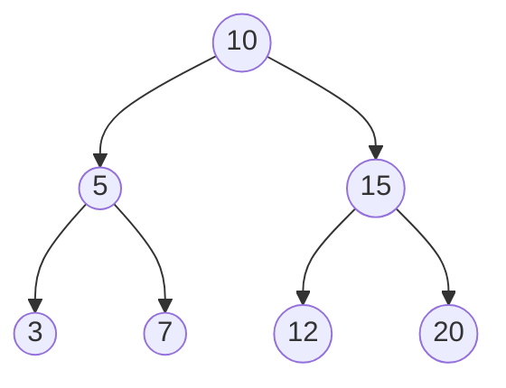
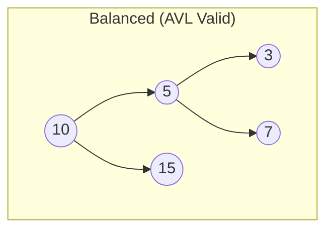
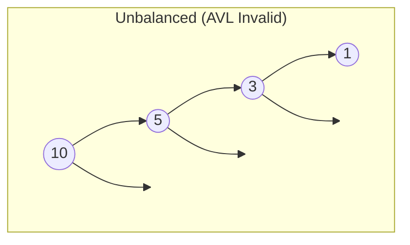
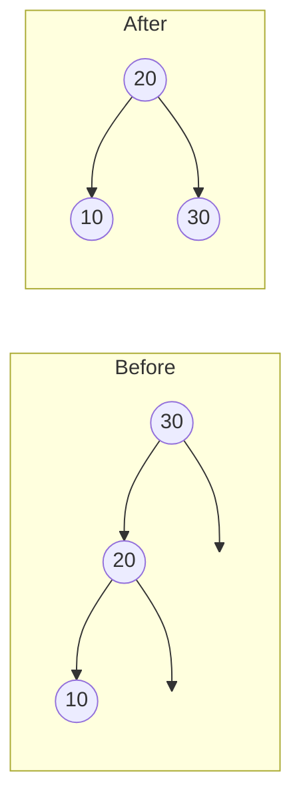
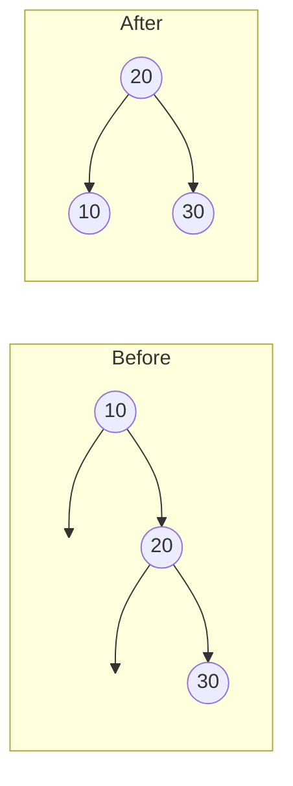
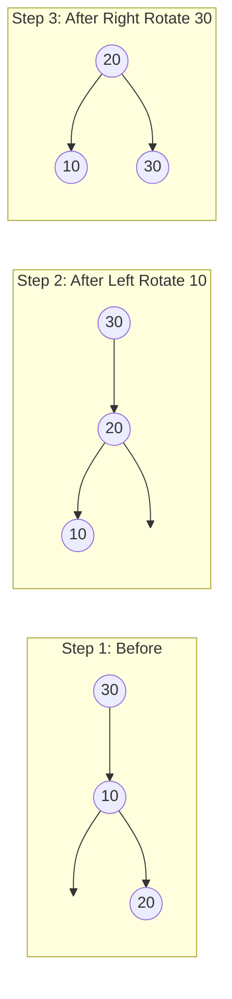
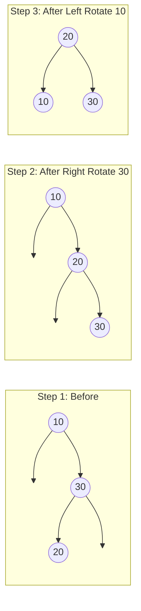

# AVL Tree — Python Implementation

## Why AVL Trees?

### The Problem It Solves

Imagine you're building a phone book application. You need to store millions of names and quickly look up any contact. You learned about Binary Search Trees (BSTs) in your algorithms class, and they promise O(log n) lookups — with a million entries, that's only about 20 comparisons!

But here's the catch: when you load names from a file that happens to be alphabetically sorted (Adams, Baker, Chen, Davis...), your "efficient" BST degenerates into a linked list:

```
Adams
    \
     Baker
         \
          Chen
              \
               Davis
                   \
                    ...
```

Now your O(log n) promise is broken — every lookup takes O(n) time. With a million names, that's a million comparisons instead of 20.

The AVL tree solves this problem by **automatically rebalancing** after every insertion or deletion. Named after its inventors Adelson-Velsky and Landis (1962), it was the first self-balancing BST ever invented.

### Real-World Analogies

**A balanced filing system**: Imagine a large office filing cabinet. If you always add new folders at the end, you'll have a very deep, narrow organization where finding anything means digging through everything. A good office manager periodically reorganizes the cabinet so no section gets too deep — that's what AVL rotation does.

**A balanced binary decision tree**: Think of the game "20 Questions." If your questions are well-balanced ("Is it bigger than a breadbox?"), you can identify any of a million objects in 20 questions. But if your questions are poorly ordered ("Is it an aardvark?"), you might need a million questions. AVL trees ensure your "questions" (comparisons) are always well-balanced.

### When to Use It

- **Frequent lookups with occasional modifications**: Databases, dictionaries, symbol tables
- **When you need guaranteed O(log n) worst-case**: Unlike hash tables (O(1) average but O(n) worst), AVL trees never degrade
- **When you need sorted traversal**: In-order traversal gives elements in sorted order
- **When you need range queries**: "Find all values between 100 and 200"

**Compared to alternatives**:
- Unlike **arrays**, insertion/deletion is O(log n) instead of O(n)
- Unlike **hash tables**, you get sorted order and can do range queries
- Unlike **unbalanced BSTs**, performance is guaranteed regardless of insertion order
- Compared to **Red-Black trees**, AVL trees are more strictly balanced (faster lookups, slower insertions)

---

## Core Concept

### What is a Binary Search Tree?

Before understanding AVL trees, you must understand the Binary Search Tree (BST) property:

> **BST Property**: For every node, all values in its left subtree are smaller, and all values in its right subtree are larger.

This property is what makes searching efficient — at each node, you know which half of the tree to explore.



In this tree:
- Looking for 7? Go left from 10 (7 < 10), go right from 5 (7 > 5), found!
- Looking for 12? Go right from 10 (12 > 10), go left from 15 (12 < 15), found!

Each comparison eliminates half the remaining nodes.

### The Big Idea: Balance

An AVL tree adds one crucial property to the BST:

> **AVL Property**: For every node, the heights of its left and right subtrees differ by at most 1.

This difference is called the **balance factor**:

```
Balance Factor = Height(left subtree) - Height(right subtree)
```

A node is balanced if its balance factor is -1, 0, or +1.

### Visual Representation



```
Balance factors:
- Node 10: height(left)=2, height(right)=1, BF=+1 (valid)
- Node 5:  height(left)=1, height(right)=1, BF=0  (valid)
- Node 15: height(left)=0, height(right)=0, BF=0  (valid)
```



```
Balance factors:
- Node 10: height(left)=3, height(right)=0, BF=+3 (INVALID!)
```

### Key Terminology

- **Height**: The number of edges on the longest path from a node to a leaf. A leaf has height 1, an empty tree has height 0.
- **Balance Factor (BF)**: `height(left) - height(right)`. Must be -1, 0, or +1 for AVL validity.
- **Rotation**: A local restructuring operation that preserves the BST property while changing heights.
- **Left-heavy**: A node with balance factor > 0 (left subtree is taller).
- **Right-heavy**: A node with balance factor < 0 (right subtree is taller).

---

## How It Works: Step-by-Step

### Operation 1: Search (contains)

**What it does**: Determines if a value exists in the tree.

**Step-by-step walkthrough**:

Searching for 7 in this tree:

```
        10
       /  \
      5    15
     / \   / \
    3   7 12  20
```

Step 1: Start at root (10). Is 7 < 10? Yes, go left.
```
        10  <-- current
       /
      5
     / \
    3   7
```

Step 2: At node 5. Is 7 < 5? No. Is 7 > 5? Yes, go right.
```
      5  <-- current
       \
        7
```

Step 3: At node 7. Is 7 == 7? Yes, found!

**Why this approach?** The BST property guarantees that if 7 exists, it must be in this exact path. We eliminate half the tree at each step, giving O(log n) time.

### Operation 2: Insert

**What it does**: Adds a new value while maintaining both BST and AVL properties.

**Step-by-step walkthrough**:

Inserting 6 into this tree:

Initial state:
```
        10
       /  \
      5    15
     / \
    3   7
```

Step 1: Find the correct position (same as search). 6 < 10, go left. 6 > 5, go right. 6 < 7, go left.
```
        10
       /  \
      5    15
     / \
    3   7
       /
      6  <-- new node
```

Step 2: Update heights and check balance factors going back up.
```
Node 7:  BF = 1 - 0 = +1 (valid)
Node 5:  BF = 1 - 2 = -1 (valid)
Node 10: BF = 3 - 1 = +2 (INVALID!)
```

Wait, this example stays balanced. Let's try inserting in a way that causes imbalance.

**Example that requires rotation**: Insert 1, 2, 3 in sequence.

Insert 1:
```
    1
```

Insert 2:
```
    1
     \
      2
```

Insert 3:
```
    1       Balance factors:
     \      Node 1: BF = 0 - 2 = -2 (INVALID!)
      2
       \
        3
```

This requires a **left rotation** at node 1. After rotation:
```
      2
     / \
    1   3
```

Now all balance factors are 0. Perfect balance!

### The Four Rotation Cases

When a node becomes unbalanced (BF = +2 or -2), we fix it with rotations. There are exactly four cases:

#### Case 1: Left-Left (LL) — Right Rotation

The imbalance is in the **left child's left subtree**.

```
Before:                 After right rotation at 30:
        30 (BF=+2)              20
       /                       /  \
      20 (BF=+1)             10    30
     /
    10
```



**When it happens**: Parent BF = +2, Left child BF >= 0

#### Case 2: Right-Right (RR) — Left Rotation

The imbalance is in the **right child's right subtree**.

```
Before:                 After left rotation at 10:
    10 (BF=-2)                  20
      \                        /  \
       20 (BF=-1)            10    30
         \
          30
```



**When it happens**: Parent BF = -2, Right child BF <= 0

#### Case 3: Left-Right (LR) — Left-Right Double Rotation

The imbalance is in the **left child's right subtree**. This requires two rotations.

```
Before:                 After left rotation    After right rotation
    30 (BF=+2)          at 10:                 at 30:
   /                        30                      20
  10 (BF=-1)               /                       /  \
    \                     20                     10    30
     20                  /
                       10
```



**When it happens**: Parent BF = +2, Left child BF < 0

#### Case 4: Right-Left (RL) — Right-Left Double Rotation

The imbalance is in the **right child's left subtree**. This requires two rotations.

```
Before:                 After right rotation   After left rotation
    10 (BF=-2)          at 30:                 at 10:
      \                     10                      20
       30 (BF=+1)            \                     /  \
      /                       20                 10    30
     20                         \
                                 30
```



**When it happens**: Parent BF = -2, Right child BF > 0

### Operation 3: Remove

**What it does**: Removes a value while maintaining both BST and AVL properties.

Removal has three sub-cases based on the node being removed:

1. **Leaf node**: Simply remove it
2. **One child**: Replace with the child
3. **Two children**: Replace with in-order successor (smallest in right subtree), then remove that successor

After removal, we check balance factors going up and rotate if needed.

### Worked Example: Complete Sequence

Let's build an AVL tree by inserting: 50, 25, 75, 10, 30, 60, 80, 5, 15, 27, 55

**Insert 50**:
```
    50
```

**Insert 25**:
```
      50
     /
    25
```

**Insert 75**:
```
      50
     /  \
    25   75
```

**Insert 10**:
```
        50
       /  \
      25   75
     /
    10
```

**Insert 30**:
```
        50
       /  \
      25   75
     /  \
    10   30
```

**Insert 60**:
```
        50
       /  \
      25   75
     /  \  /
    10  30 60
```

**Insert 80**:
```
        50
       /  \
      25   75
     /  \  / \
    10  30 60 80
```

**Insert 5**:
```
          50
         /  \
        25   75
       /  \  / \
      10  30 60 80
     /
    5
```

**Insert 15**:
```
          50
         /  \
        25   75
       /  \  / \
      10  30 60 80
     /  \
    5   15
```

**Insert 27**:
```
           50
          /  \
        25    75
       /  \   / \
      10  30 60 80
     /  \ /
    5  15 27
```

**Insert 55**: This triggers a rotation!
```
Before inserting 55:
           50
          /  \
        25    75
       /  \   / \
      10  30 60 80
     /  \ /
    5  15 27

After inserting 55:
           50
          /  \
        25    75
       /  \   / \
      10  30 60 80
     /  \ /  /
    5  15 27 55

Check balance at 60: BF = 1 - 0 = +1 (OK)
Check balance at 75: BF = 2 - 1 = +1 (OK)
Check balance at 50: BF = 3 - 2 = +1 (OK)

No rotation needed! The tree stays balanced.
```

**Now let's remove 80 and then 75**:

Remove 80 (leaf node):
```
           50
          /  \
        25    75
       /  \   /
      10  30 60
     /  \ /  /
    5  15 27 55
```

Remove 75 (one child):
```
           50
          /  \
        25    60
       /  \   /
      10  30 55
     /  \ /
    5  15 27

Check balance at 60: BF = 1 - 0 = +1 (OK)
Check balance at 50: BF = 3 - 2 = +1 (OK)

Still balanced!
```

---

## From Concept to Code

### The Data Structure

Before looking at code, let's understand what we need to track:

1. **Value**: The data stored at each node
2. **Left and Right children**: References to subtrees
3. **Height**: Needed to compute balance factors efficiently
4. **Root**: The entry point to the tree
5. **Size**: Number of elements (for O(1) `len()`)

### Python Implementation

```python
from typing import TypeVar, Generic, List, Iterator, Optional

T = TypeVar('T')

class AVLTree(Generic[T]):
    class Node:
        def __init__(self, value: T) -> None:
            self.value: T = value
            self.left: Optional['AVLTree.Node'] = None
            self.right: Optional['AVLTree.Node'] = None
            self.height: int = 1

    def __init__(self) -> None:
        self._root: Optional[AVLTree.Node] = None
        self._size: int = 0
```

**Line-by-line breakdown**:

- `T = TypeVar('T')`: Creates a type variable for generics. This lets the tree hold any type.
- `Generic[T]`: Makes `AVLTree` a generic class. You can write `AVLTree[int]` or `AVLTree[str]`.
- `class Node`: Nested class — nodes are an implementation detail, not part of the public API.
- `self.height: int = 1`: A new leaf has height 1. An empty tree (None) has height 0.
- `Optional['AVLTree.Node']`: The string quote is a "forward reference" because we're inside the class definition.
- `self._root`: The underscore prefix signals "private" (by convention, not enforced).

### Implementing Height and Balance Factor

```python
def _get_height(self, node: Optional[Node]) -> int:
    if node is None:
        return 0
    return node.height

def _update_height(self, node: Node) -> None:
    node.height = 1 + max(self._get_height(node.left), self._get_height(node.right))

def _get_balance(self, node: Optional[Node]) -> int:
    if node is None:
        return 0
    return self._get_height(node.left) - self._get_height(node.right)
```

**Why store height instead of computing it?** Computing height recursively is O(n). By storing and updating it incrementally, we get O(1) balance factor calculation.

### Implementing Rotations

**Right Rotation** (for Left-Left case):

```python
def _right_rotate(self, y: Node) -> Node:
    x = y.left
    assert x is not None
    t2 = x.right

    x.right = y
    y.left = t2

    self._update_height(y)
    self._update_height(x)

    return x
```

Visual representation:
```
Before:         After:
    y             x
   / \           / \
  x   C   -->   A   y
 / \               / \
A   t2           t2   C
```

**Understanding the tricky parts**:
- `assert x is not None`: We only call right_rotate when we know left child exists. The assert satisfies the type checker and catches bugs.
- We update `y`'s height first because `x`'s height depends on `y`'s new height.
- Returns the new root of this subtree (`x`), which the caller must use to update the parent's pointer.

**Left Rotation** (for Right-Right case):

```python
def _left_rotate(self, x: Node) -> Node:
    y = x.right
    assert y is not None
    t2 = y.left

    y.left = x
    x.right = t2

    self._update_height(x)
    self._update_height(y)

    return y
```

Visual representation:
```
Before:         After:
  x               y
 / \             / \
A   y    -->    x   C
   / \         / \
  t2  C       A   t2
```

### Implementing Rebalance

This is the heart of the AVL tree:

```python
def _rebalance(self, node: Node) -> Node:
    self._update_height(node)
    balance = self._get_balance(node)

    # Left-heavy
    if balance > 1:
        # Left-Right case: rotate left child first
        if self._get_balance(node.left) < 0:
            assert node.left is not None
            node.left = self._left_rotate(node.left)
        # Left-Left case (or after LR preprocessing)
        return self._right_rotate(node)

    # Right-heavy
    if balance < -1:
        # Right-Left case: rotate right child first
        if self._get_balance(node.right) > 0:
            assert node.right is not None
            node.right = self._right_rotate(node.right)
        # Right-Right case (or after RL preprocessing)
        return self._left_rotate(node)

    return node
```

**Understanding the logic**:

1. `balance > 1` means left subtree is too tall (Left-heavy)
2. If the left child is right-heavy (`_get_balance(node.left) < 0`), it's an LR case — we need to rotate the left child first
3. Then we do a right rotation on the node
4. Mirror logic for right-heavy cases

**Why check the child's balance?** This tells us whether it's a single or double rotation case:
- LL: Parent is left-heavy, left child is left-heavy or balanced
- LR: Parent is left-heavy, left child is right-heavy
- RR: Parent is right-heavy, right child is right-heavy or balanced
- RL: Parent is right-heavy, right child is left-heavy

### Implementing Insert

```python
def _insert(self, node: Optional[Node], value: T) -> Node:
    if node is None:
        self._size += 1
        return AVLTree.Node(value)

    if value < node.value:
        node.left = self._insert(node.left, value)
    elif value > node.value:
        node.right = self._insert(node.right, value)
    else:
        return node  # Duplicate, do nothing

    return self._rebalance(node)

def insert(self, value: T) -> None:
    self._root = self._insert(self._root, value)
```

**The algorithm in plain English**:
1. If we've reached an empty spot, create a new node here
2. If the value is smaller, recursively insert into the left subtree
3. If the value is larger, recursively insert into the right subtree
4. If the value equals the current node, it's a duplicate (ignore it)
5. On the way back up (as recursion unwinds), rebalance each node

**Why recursion?** The key insight is that `_rebalance` is called for every ancestor of the new node, going from bottom to top. This is exactly what we need — imbalance can only occur along the insertion path.

### Implementing Remove

```python
def _find_min_node(self, node: Node) -> Node:
    while node.left is not None:
        node = node.left
    return node

def _remove(self, node: Optional[Node], value: T) -> Optional[Node]:
    if node is None:
        return None

    if value < node.value:
        node.left = self._remove(node.left, value)
    elif value > node.value:
        node.right = self._remove(node.right, value)
    else:
        # Found the node to remove
        if node.left is None:
            self._size -= 1
            return node.right
        elif node.right is None:
            self._size -= 1
            return node.left
        else:
            # Two children: replace with in-order successor
            successor = self._find_min_node(node.right)
            node.value = successor.value
            node.right = self._remove(node.right, successor.value)

    return self._rebalance(node)

def remove(self, value: T) -> None:
    self._root = self._remove(self._root, value)
```

**Understanding the two-children case**:

When removing a node with two children, we can't just delete it — we need to fill the gap. We find the **in-order successor** (the smallest value in the right subtree), copy its value to the current node, then recursively delete the successor (which has at most one child).

Why the in-order successor? It's the smallest value that's larger than the deleted node, so it maintains the BST property.

---

## Complexity Analysis

### Time Complexity

| Operation | Best | Average | Worst | Why |
|-----------|------|---------|-------|-----|
| insert    | O(log n) | O(log n) | O(log n) | Tree height is always O(log n) due to balancing |
| remove    | O(log n) | O(log n) | O(log n) | Same reason — guaranteed balanced |
| contains  | O(1) | O(log n) | O(log n) | Best: root is the target; worst: leaf node |
| min/max   | O(log n) | O(log n) | O(log n) | Must traverse to leftmost/rightmost |
| height    | O(1) | O(1) | O(1) | Stored at root, not computed |
| in_order  | O(n) | O(n) | O(n) | Must visit every node |

**Understanding the "Why" column**:

The key insight is that AVL balancing guarantees the tree height is at most ~1.44 * log2(n). This comes from the fact that the minimum number of nodes in an AVL tree of height h is the Fibonacci number F(h+2) - 1.

For practical purposes: a tree with 1 million nodes has height at most 29.

### Space Complexity

- **Overall structure**: O(n) — we store one node per element
- **Per insert/remove**: O(log n) — recursion stack depth equals tree height
- **Per traversal**: O(n) for the result list, O(h) for the stack

### Why Recursion Depth Matters in Python

Python has a default recursion limit of ~1000. For a balanced tree, this limits us to about 2^1000 nodes (effectively unlimited). But the implementation uses iterative traversals to be safe:

```python
def in_order(self) -> List[T]:
    result: List[T] = []
    stack: List[AVLTree.Node] = []
    node = self._root
    while stack or node is not None:
        while node is not None:
            stack.append(node)
            node = node.left
        node = stack.pop()
        result.append(node.value)
        node = node.right
    return result
```

This iterative approach avoids `RecursionError` even for very deep trees.

---

## Common Mistakes & Pitfalls

### Mistake 1: Forgetting to Update Heights After Rotation

```python
# Wrong:
def _right_rotate(self, y: Node) -> Node:
    x = y.left
    t2 = x.right
    x.right = y
    y.left = t2
    return x  # Heights not updated!

# Right:
def _right_rotate(self, y: Node) -> Node:
    x = y.left
    assert x is not None
    t2 = x.right
    x.right = y
    y.left = t2
    self._update_height(y)  # Update y first!
    self._update_height(x)  # Then x (depends on y)
    return x
```

**Why this matters**: Without height updates, future balance factor calculations will be wrong, leading to incorrect or missing rotations. The tree silently becomes unbalanced.

### Mistake 2: Wrong Order of Height Updates

```python
# Wrong:
self._update_height(x)  # x depends on y's new height!
self._update_height(y)

# Right:
self._update_height(y)  # Update child first
self._update_height(x)  # Then parent
```

**Why this matters**: After rotation, `x` becomes the parent of `y`. The height of `x` depends on the heights of its children, including `y`. We must update `y` first.

### Mistake 3: Not Returning the New Root After Rotation

```python
# Wrong:
def _insert(self, node: Optional[Node], value: T) -> Node:
    # ... insertion logic ...
    self._rebalance(node)  # Result ignored!
    return node  # Returns old root, not new one after rotation

# Right:
def _insert(self, node: Optional[Node], value: T) -> Node:
    # ... insertion logic ...
    return self._rebalance(node)  # Return the new subtree root
```

**Why this matters**: Rotations change which node is the root of a subtree. If you don't capture and return this, the parent's child pointer won't be updated, and the rotated nodes become orphaned.

### Mistake 4: Checking Wrong Balance Factor for Double Rotation

```python
# Wrong: Using absolute value or wrong comparison
if balance > 1:
    if abs(self._get_balance(node.left)) > 0:  # Wrong!
        node.left = self._left_rotate(node.left)
    return self._right_rotate(node)

# Right: Check if left child is right-heavy (LR case)
if balance > 1:
    if self._get_balance(node.left) < 0:  # Correct: strictly negative
        node.left = self._left_rotate(node.left)
    return self._right_rotate(node)
```

**Why this matters**: The sign of the child's balance factor tells us whether the imbalance is on the "same side" (single rotation) or "zigzag" (double rotation). Getting this wrong leads to incorrect rotations that don't fix the imbalance.

### Mistake 5: Modifying Size Incorrectly in Remove

```python
# Wrong: Always decrementing size
def _remove(self, node: Optional[Node], value: T) -> Optional[Node]:
    if node is None:
        self._size -= 1  # Wrong! Value wasn't found
        return None
    # ...

# Right: Only decrement when actually removing a node
def _remove(self, node: Optional[Node], value: T) -> Optional[Node]:
    if node is None:
        return None  # Value not found, size unchanged
    # ...
    if node.left is None:
        self._size -= 1  # Correct: node is being removed
        return node.right
```

**Why this matters**: If you decrement size when the value doesn't exist, `len(tree)` becomes incorrect, potentially going negative.

---

## Practice Problems

To solidify your understanding, try implementing:

1. **`floor(value)` and `ceil(value)`**: Return the largest element <= value (floor) or smallest element >= value (ceil). Useful for range queries.

2. **`rank(value)`**: Return how many elements in the tree are smaller than the given value. Hint: you'll need to augment nodes with subtree sizes.

3. **`select(k)`**: Return the k-th smallest element. The inverse of rank. Also requires subtree size augmentation.

4. **`range_query(low, high)`**: Return all elements in the range [low, high]. Should be more efficient than filtering an in-order traversal.

5. **Delete all elements in a range**: Remove all elements between low and high efficiently.

---

## Summary

### Key Takeaways

- AVL trees are BSTs that maintain balance through rotations
- Balance factor = height(left) - height(right), must be -1, 0, or +1
- Four rotation cases: LL (right rotate), RR (left rotate), LR (left-right), RL (right-left)
- Rotations are O(1) local operations that preserve BST property
- All operations guaranteed O(log n) due to height bound

### Quick Reference

```
AVL Tree — Self-balancing BST with guaranteed O(log n) operations
├── insert(value): O(log n) — Add element, rebalance ancestors
├── remove(value): O(log n) — Remove element, rebalance ancestors
├── contains(value): O(log n) — Check if element exists
├── min() / max(): O(log n) — Find smallest/largest element
├── height(): O(1) — Tree height (stored at root)
├── in_order(): O(n) — Return sorted list of all elements
└── is_balanced(): O(n) — Verify AVL property (for testing)

Best for: Ordered data with frequent lookups, range queries, guaranteed performance
Avoid when: You only need O(1) average lookup (use hash table), or you're doing mostly insertions (Red-Black tree has lower constant factor)
```

### Python-Specific Features Used

| Feature | What It Enables |
|---------|-----------------|
| `Generic[T]` | Type-safe generic tree |
| `Optional[Node]` | Explicit nullable types |
| `__len__` | `len(tree)` syntax |
| `__contains__` | `value in tree` syntax |
| `__iter__` | `for v in tree` syntax |
| Nested class | Encapsulates Node as implementation detail |
| Iterative traversals | Avoids recursion limit issues |
