# AVL Tree — Rust Implementation

## Why AVL Trees?

### The Problem It Solves

Imagine you're building a phone book application. You need to store millions of contacts and quickly find any contact by name. A simple list would require checking potentially every entry (O(n))—way too slow.

A **Binary Search Tree (BST)** seems perfect: you can find any contact in O(log n) time by comparing and going left or right. But there's a catch. If you insert contacts in alphabetical order (Aaron, Bob, Carol, David...), your tree becomes a linked list:

```
Aaron
    \
    Bob
      \
      Carol
        \
        David
```

Now searching for "Zoe" requires checking every single name—we're back to O(n).

**AVL trees solve this by guaranteeing balance.** After every insertion or deletion, the tree automatically restructures itself so that the left and right subtrees of every node differ in height by at most 1. This ensures O(log n) operations no matter what order you insert elements.

### Real-World Analogies

1. **A librarian organizing a card catalog**: If the librarian always kept the catalog balanced (roughly equal cards on left and right of any divider), finding any card would be fast. If they just appended cards to the end, finding a specific card could take forever.

2. **A company org chart**: An AVL tree is like an org chart where no manager has significantly more levels of reports on one side than the other. This keeps the chain of command short—you can reach anyone in the company quickly.

3. **A tournament bracket that reseeds**: Imagine a sports bracket that automatically rearranges itself so no path from start to final is much longer than any other. Everyone has roughly the same number of games to the championship.

### When to Use It

- **Use an AVL tree when you need guaranteed O(log n) lookups, insertions, and deletions**
- Ideal for databases, in-memory indexes, and any sorted data that changes frequently
- Better than a regular BST when data might arrive in sorted or nearly-sorted order
- Prefer over Red-Black trees when you need faster lookups (AVL is more strictly balanced)

**Trade-offs**:
- Unlike a hash map, AVL trees maintain sorted order (you can iterate in order, find min/max, do range queries)
- Slower than hash maps for pure key lookup (O(log n) vs O(1) average)
- More complex than a regular BST due to rotation logic

---

## Core Concept

### Part 1: Binary Search Trees (BST) — The Foundation

Before we can understand AVL trees, we need to understand Binary Search Trees.

**The BST Property**: For every node in the tree:
- All values in the **left subtree** are **less than** the node's value
- All values in the **right subtree** are **greater than** the node's value

This simple rule enables binary search on tree-structured data.

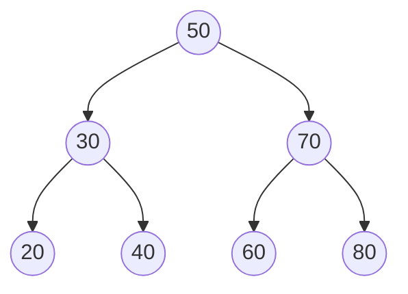

In this tree:
- 50 is the root
- Everything left of 50 (30, 20, 40) is less than 50
- Everything right of 50 (70, 60, 80) is greater than 50
- This property holds recursively at every node

**Searching in a BST**: To find 40:
1. Start at 50: Is 40 < 50? Yes, go left
2. At 30: Is 40 < 30? No, Is 40 > 30? Yes, go right
3. At 40: Found it!

Only 3 comparisons to find an element in a 7-node tree.

### Part 2: The Balance Problem

BSTs have a fatal flaw: their performance depends on the shape of the tree.

Insert 1, 2, 3, 4, 5 in order:

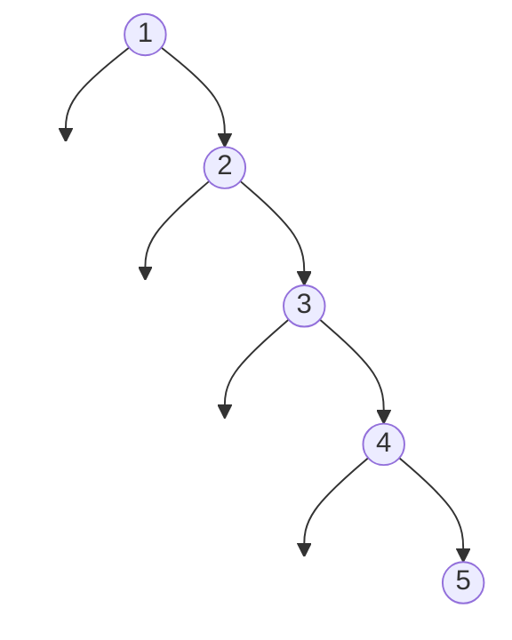

This "degenerate" tree is actually a linked list! Searching for 5 requires checking all 5 nodes.

### Part 3: AVL Trees — Self-Balancing BSTs

An AVL tree is a BST that maintains the **AVL property**:

> For every node, the heights of its left and right subtrees differ by at most 1.

The **height** of a node is the length of the longest path from that node to a leaf (empty nodes have height 0, leaves have height 1).

The **balance factor** of a node = (height of left subtree) - (height of right subtree)

A node is balanced if its balance factor is -1, 0, or +1.

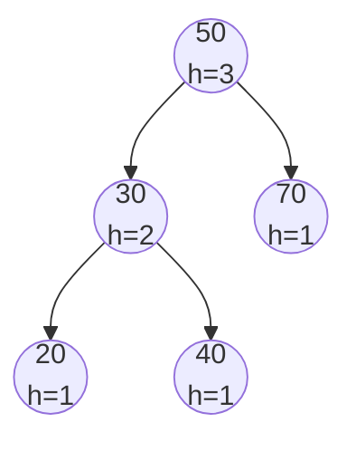

Balance factors:
- Node 50: left height 2, right height 1, balance = +1 (OK)
- Node 30: left height 1, right height 1, balance = 0 (OK)
- Node 70: left height 0, right height 0, balance = 0 (OK)

### Key Terminology

- **Height**: Number of edges on the longest path from a node to a leaf. A single node has height 1; empty tree has height 0.
- **Balance Factor**: `height(left) - height(right)`. Valid values: -1, 0, +1.
- **Rotation**: A local restructuring operation that restores balance while preserving BST property.
- **Left-heavy**: Balance factor > 0 (left subtree is taller)
- **Right-heavy**: Balance factor < 0 (right subtree is taller)

---

## How It Works: Step-by-Step

### Operation 1: Insertion

**What it does**: Adds a new value to the tree while maintaining both BST and AVL properties.

**The algorithm**:
1. Insert like a normal BST (find the right position based on comparisons)
2. Walk back up to the root, updating heights
3. If any node becomes unbalanced (balance factor is -2 or +2), perform rotations to fix it

**Step-by-step walkthrough — Inserting 10 into a tree**:

Starting state (balanced tree):
```
       30 (h=2)
      /  \
   20(h=1) 40(h=1)
```

Step 1: Find insertion position for 10
- Compare 10 < 30, go left
- Compare 10 < 20, go left (null, insert here)

After insertion (before rebalancing):
```
       30 (h=3)         balance = 2 (UNBALANCED!)
      /  \
   20(h=2) 40(h=1)
   /
 10(h=1)
```

The tree is now left-heavy at node 30 (balance factor = 2).

Step 2: Detect imbalance and determine rotation type
- Balance factor of 30 is +2 (left-heavy)
- Balance factor of 20 is +1 (left-heavy child)
- This is a "Left-Left" case: requires a single right rotation

Step 3: Perform right rotation around 30

After rotation (balanced):
```
       20 (h=2)
      /  \
   10(h=1) 30(h=1)
            \
           40(h=1)
```

Wait, that's not right. Let me show the correct result:

```
       20 (h=2)
      /  \
   10(h=1) 30(h=1)
              \
             40(h=1)
```

Actually, 40 was the right child of 30 originally, and stays attached:

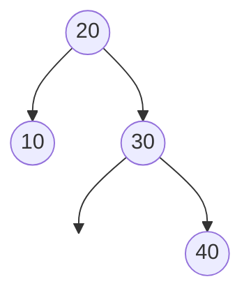

Tree is now balanced with height 2 instead of 3.

### The Four Rotation Cases

When a node becomes unbalanced (balance factor of +2 or -2), one of four cases applies:

#### Case 1: Left-Left (LL) — Single Right Rotation

**When it occurs**: Node is left-heavy (+2) AND its left child is left-heavy or balanced (+1 or 0)

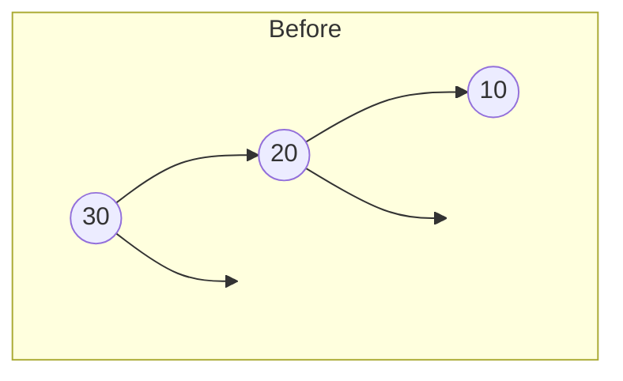

```
    30 (+2)                  20 (0)
   /                        /  \
  20 (+1)      ------>    10    30
 /
10
```

**Right Rotation around 30**:

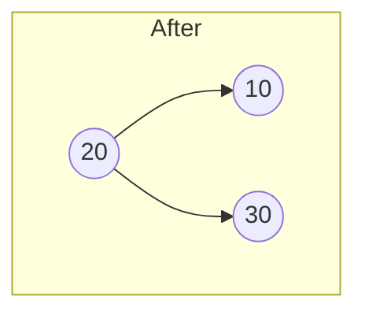

Node 20 becomes the new root. Node 30 becomes its right child.

#### Case 2: Right-Right (RR) — Single Left Rotation

**When it occurs**: Node is right-heavy (-2) AND its right child is right-heavy or balanced (-1 or 0)

```
10 (-2)                      20 (0)
  \                         /  \
  20 (-1)     ------>     10    30
    \
    30
```

**Left Rotation around 10**:

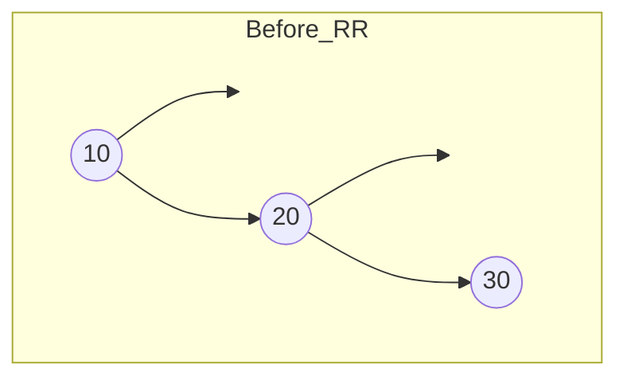

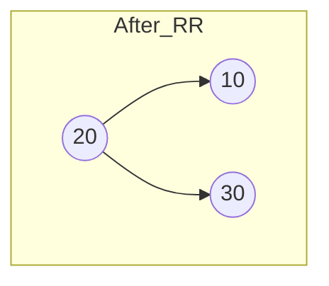

Node 20 becomes the new root. Node 10 becomes its left child.

#### Case 3: Left-Right (LR) — Double Rotation (Left then Right)

**When it occurs**: Node is left-heavy (+2) AND its left child is right-heavy (-1)

This case is tricky. A single rotation won't fix it:

```
    30 (+2)
   /
  10 (-1)
    \
    20
```

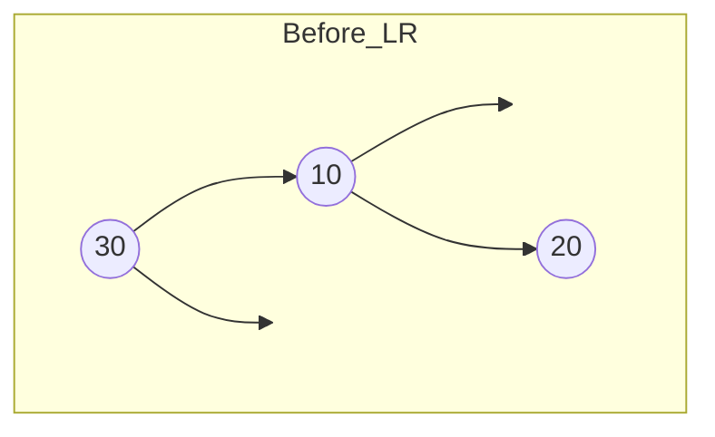

**Step 1**: Left rotation around 10 (the left child)
```
    30 (+2)
   /
  20 (+1)
 /
10
```

**Step 2**: Right rotation around 30
```
    20 (0)
   /  \
 10    30
```

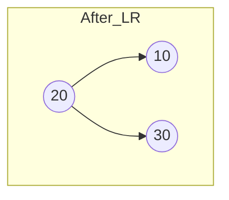

#### Case 4: Right-Left (RL) — Double Rotation (Right then Left)

**When it occurs**: Node is right-heavy (-2) AND its right child is left-heavy (+1)

```
10 (-2)
  \
  30 (+1)
  /
20
```

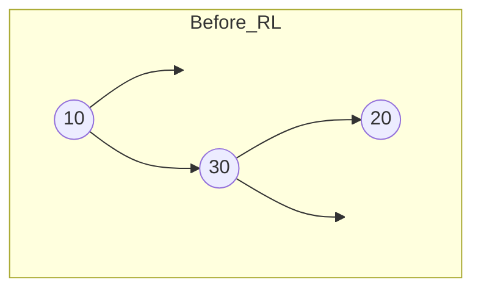

**Step 1**: Right rotation around 30 (the right child)
```
10 (-2)
  \
  20 (-1)
    \
    30
```

**Step 2**: Left rotation around 10
```
    20 (0)
   /  \
 10    30
```


### Operation 2: Deletion

**What it does**: Removes a value from the tree while maintaining both BST and AVL properties.

**The algorithm**:
1. Find the node to delete (standard BST search)
2. Remove it using BST deletion rules (3 cases below)
3. Walk back up to the root, rebalancing as needed

**BST Deletion Cases**:

**Case A: Node has no children (leaf)**
Simply remove it.

**Case B: Node has one child**
Replace the node with its child.

**Case C: Node has two children**
Find the in-order successor (minimum value in right subtree), replace the node's value with it, then delete the successor from the right subtree.

**Step-by-step walkthrough — Deleting 50 from a tree**:

Starting state:
```
       50
      /  \
    30    70
   /  \
  20  40
```

Step 1: Find node 50 (root)
Step 2: It has two children, so find its in-order successor
- Go right to 70
- 70 has no left child, so 70 is the successor

Step 3: Replace 50's value with 70, delete 70 from right subtree

After deletion (balanced):
```
       70
      /  \
    30   (empty)
   /  \
  20  40
```

Step 4: Check balance at 70: left height 2, right height 0, balance = +2 (UNBALANCED!)

Step 5: Left child (30) has balance 0, so this is LL case. Right rotation around 70:

```
       30
      /  \
    20    70
         /
       40
```

Tree is balanced again.

### Worked Example: Complete Sequence

Let's build an AVL tree by inserting 50, 30, 70, 20, 40, 10:

```
Operation 1: insert(50)
    50
Tree height: 1, balanced

Operation 2: insert(30)
    50
   /
  30
Tree height: 2, balanced (balance factor at 50 = +1)

Operation 3: insert(70)
      50
     /  \
   30    70
Tree height: 2, balanced (balance factor at 50 = 0)

Operation 4: insert(20)
      50
     /  \
   30    70
   /
  20
Tree height: 3, balanced (balance factor at 30 = +1, at 50 = +1)

Operation 5: insert(40)
      50
     /  \
   30    70
   / \
  20  40
Tree height: 3, balanced (balance factor at 30 = 0, at 50 = +1)

Operation 6: insert(10)
      50
     /  \
   30    70
   / \
  20  40
  /
 10

Before rebalancing: balance factor at 20 = +1, at 30 = +2 (UNBALANCED!)

This is LL case at node 30. Right rotation around 30:

      50
     /  \
   20    70
   / \
  10  30
       \
       40

Tree height: 3, balanced
```

Final tree:
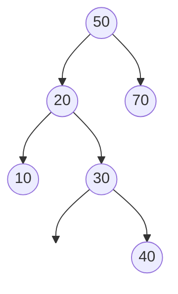

---

## From Concept to Code

### The Data Structure

Before we look at code, let's understand what we need to track:

1. **The value stored at each node** — generic type `T`
2. **Left and right children** — these might not exist (null in other languages)
3. **Height of each node** — needed to compute balance factors efficiently
4. **Size of the tree** — for the `size()` method

In Rust, "might not exist" is represented by `Option<T>`, and heap-allocated data uses `Box<T>`. For tree nodes, we combine them: `Option<Box<Node<T>>>`.

### Understanding Rust's Types for Trees

#### `Box<T>` — Heap Allocation with Ownership

A `Box<T>` is a pointer to heap-allocated memory that Rust automatically frees when the Box goes out of scope. Think of it as "I own this data, and it lives on the heap."

**Why do we need `Box` for tree nodes?**

Without `Box`, Rust can't compute the size of `Node<T>`:

```rust
// This won't compile!
struct Node<T> {
    value: T,
    left: Option<Node<T>>,  // ERROR: recursive type has infinite size
    right: Option<Node<T>>,
}
```

A `Node` contains a `Node` which contains a `Node`... infinite recursion. Rust needs to know the exact size of every type at compile time.

With `Box`, the size is known: a `Box<Node<T>>` is just a pointer (8 bytes on 64-bit systems), regardless of what it points to.

#### `Option<T>` — Nullable Values Without Null

Rust has no `null`. Instead, `Option<T>` explicitly represents "might not exist":
- `Some(value)` — the value exists
- `None` — no value (like null, but type-safe)

This forces you to handle the "nothing" case—you can't accidentally dereference null.

#### `Option<Box<Node<T>>>` — Putting It Together

This type means: "an optional pointer to a heap-allocated node."

- `None` — no child (like a null pointer)
- `Some(Box::new(node))` — there's a child, and we own it

### Rust Implementation

```rust
use std::cmp::Ordering;

#[derive(Debug)]
struct Node<T> {
    value: T,
    left: Option<Box<Node<T>>>,
    right: Option<Box<Node<T>>>,
    height: usize,
}

impl<T> Node<T> {
    fn new(value: T) -> Self {
        Node {
            value,
            left: None,
            right: None,
            height: 1,
        }
    }
}

#[derive(Debug)]
pub struct AVLTree<T> {
    root: Option<Box<Node<T>>>,
    size: usize,
}
```

**Line-by-line breakdown**:

- `#[derive(Debug)]` — Automatically implement debug printing (useful for testing)
- `struct Node<T>` — A generic node that can hold any type `T`
- `value: T` — The data stored in this node
- `left: Option<Box<Node<T>>>` — Optional pointer to left child
- `right: Option<Box<Node<T>>>` — Optional pointer to right child
- `height: usize` — Cached height for O(1) balance factor computation
- `height: 1` — New nodes are leaves with height 1

### Implementing Rotation: The Heart of AVL

Rotations are where Rust's ownership system becomes interesting. Let's trace through a right rotation in detail.

#### Right Rotation — Conceptual

```
      y                x
     / \              / \
    x   C    --->    A   y
   / \                  / \
  A   B                B   C
```

Node `x` becomes the new root. Node `y` becomes `x`'s right child. Subtree `B` (which was `x`'s right child) becomes `y`'s left child.

#### Right Rotation — The Ownership Challenge

In languages with garbage collection, you might write:

```python
def rotate_right(y):
    x = y.left
    y.left = x.right  # B moves to y's left
    x.right = y       # y becomes x's right child
    return x
```

Simple! But in Rust, ownership rules make this trickier:

1. `y` owns `y.left` (which is `x`)
2. If we move `x` out of `y.left`, `y.left` becomes invalid
3. We can't have `x.right = y` because that would create a cycle where `x` owns `y` and `y` owns `x`

#### Right Rotation — The Rust Way with `take()`

The `take()` method is crucial. It:
- Replaces an `Option<T>` with `None`
- Returns the original value

This lets us "extract" ownership without leaving the struct in an invalid state.

```rust
fn rotate_right(mut y: Box<Node<T>>) -> Box<Node<T>> {
    // Step 1: Take ownership of x from y.left
    // y.left becomes None, we now own x
    let mut x = y.left.take().unwrap();

    // Step 2: Move B from x.right to y.left
    // x.right becomes None, y.left gets B
    y.left = x.right.take();

    // Step 3: Update y's height (its children changed)
    Self::update_height(&mut y);

    // Step 4: Make y the right child of x
    x.right = Some(y);

    // Step 5: Update x's height (its children changed)
    Self::update_height(&mut x);

    // Step 6: Return x as the new subtree root
    x
}
```

**Tracing ownership through the rotation**:

```
Initial state (y owns everything):
    y (owned by function parameter)
    ├── y.left: Some(x)  ← y owns x
    │   ├── x.left: Some(A)  ← x owns A
    │   └── x.right: Some(B)  ← x owns B
    └── y.right: Some(C)  ← y owns C

After: let mut x = y.left.take().unwrap();
    y (owned by function parameter)
    ├── y.left: None  ← emptied by take()
    └── y.right: Some(C)

    x (owned by local variable)
    ├── x.left: Some(A)
    └── x.right: Some(B)

After: y.left = x.right.take();
    y
    ├── y.left: Some(B)  ← B moved here
    └── y.right: Some(C)

    x
    ├── x.left: Some(A)
    └── x.right: None  ← emptied by take()

After: x.right = Some(y);
    x (owned by local variable)
    ├── x.left: Some(A)
    └── x.right: Some(y)  ← y moved here
        ├── y.left: Some(B)
        └── y.right: Some(C)

Return x → ownership transfers to caller
```

No data is copied. No memory is leaked. No double-frees. The ownership system guarantees correctness at compile time.

#### Left Rotation

The left rotation is symmetric:

```rust
fn rotate_left(mut x: Box<Node<T>>) -> Box<Node<T>> {
    let mut y = x.right.take().unwrap();
    x.right = y.left.take();
    Self::update_height(&mut x);
    y.left = Some(x);
    Self::update_height(&mut y);
    y
}
```

### Implementing Rebalance

After any insert or delete, we check if the node needs rebalancing:

```rust
fn rebalance(mut node: Box<Node<T>>) -> Box<Node<T>> {
    Self::update_height(&mut node);
    let balance = Self::balance_factor(&node);

    // Left-heavy (balance > 1)
    if balance > 1 {
        // Check if left child is right-heavy (LR case)
        if Self::balance_factor(node.left.as_ref().unwrap()) < 0 {
            // First rotate left on the left child
            node.left = Some(Self::rotate_left(node.left.take().unwrap()));
        }
        // Then rotate right on this node (handles both LL and LR)
        return Self::rotate_right(node);
    }

    // Right-heavy (balance < -1)
    if balance < -1 {
        // Check if right child is left-heavy (RL case)
        if Self::balance_factor(node.right.as_ref().unwrap()) > 0 {
            // First rotate right on the right child
            node.right = Some(Self::rotate_right(node.right.take().unwrap()));
        }
        // Then rotate left on this node (handles both RR and RL)
        return Self::rotate_left(node);
    }

    // Already balanced
    node
}
```

**Understanding the pattern**:

- `node.left.as_ref().unwrap()` — Borrow the left child to check its balance factor
- `node.left.take().unwrap()` — Take ownership of left child for rotation
- `Some(Self::rotate_left(...))` — Wrap the rotated subtree back into an Option

### Implementing Insert

Insertion is recursive, threading through a mutable size counter:

```rust
fn insert_node(
    node: Option<Box<Node<T>>>,
    value: T,
    size: &mut usize
) -> Option<Box<Node<T>>> {
    match node {
        None => {
            // Base case: empty spot found, create new node
            *size += 1;
            Some(Box::new(Node::new(value)))
        }
        Some(mut n) => {
            // Recursive case: navigate to correct position
            match value.cmp(&n.value) {
                Ordering::Less => {
                    n.left = Self::insert_node(n.left.take(), value, size);
                }
                Ordering::Greater => {
                    n.right = Self::insert_node(n.right.take(), value, size);
                }
                Ordering::Equal => {
                    // Duplicate: don't insert, return node unchanged
                    return Some(n);
                }
            }
            // Rebalance on the way back up
            Some(Self::rebalance(n))
        }
    }
}
```

**Key insight**: The function takes `Option<Box<Node<T>>>` by value and returns a new `Option<Box<Node<T>>>`. The caller assigns the result back:

```rust
pub fn insert(&mut self, value: T) {
    self.root = Self::insert_node(self.root.take(), value, &mut self.size);
}
```

This "take and reassign" pattern is how Rust handles tree modifications without unsafe code.

### Implementing Remove

Deletion is more complex due to the three cases:

```rust
fn remove_node(
    node: Option<Box<Node<T>>>,
    value: &T,
    size: &mut usize
) -> Option<Box<Node<T>>> {
    match node {
        None => None,  // Value not found
        Some(mut n) => match value.cmp(&n.value) {
            Ordering::Less => {
                n.left = Self::remove_node(n.left.take(), value, size);
                Some(Self::rebalance(n))
            }
            Ordering::Greater => {
                n.right = Self::remove_node(n.right.take(), value, size);
                Some(Self::rebalance(n))
            }
            Ordering::Equal => {
                *size -= 1;
                match (n.left.take(), n.right.take()) {
                    // Case 1: No children
                    (None, None) => None,
                    // Case 2: One child
                    (Some(left), None) => Some(left),
                    (None, Some(right)) => Some(right),
                    // Case 3: Two children
                    (Some(left), Some(right)) => {
                        *size += 1;  // Successor removal will decrement
                        let (new_right, successor_value) =
                            Self::remove_min_node(right, size);
                        let new_node = Box::new(Node {
                            value: successor_value,
                            left: Some(left),
                            right: new_right,
                            height: 1,  // Will be corrected by rebalance
                        });
                        Some(Self::rebalance(new_node))
                    }
                }
            }
        },
    }
}
```

The two-children case deserves special attention. We need to:
1. Find and remove the minimum value from the right subtree (the "successor")
2. Create a new node with the successor's value
3. Rebalance

The `remove_min_node` helper returns both the modified subtree AND the extracted value:

```rust
fn remove_min_node(
    node: Box<Node<T>>,
    size: &mut usize
) -> (Option<Box<Node<T>>>, T) {
    let mut n = node;
    if n.left.is_none() {
        // This is the minimum
        *size -= 1;
        (n.right.take(), n.value)  // Return right child and value
    } else {
        // Keep going left
        let (new_left, min_value) =
            Self::remove_min_node(n.left.take().unwrap(), size);
        n.left = new_left;
        (Some(Self::rebalance(n)), min_value)
    }
}
```

**Why return a tuple?**

This allows us to move the value out of the removed node rather than cloning it. This is critical for types that don't implement `Clone`.

---

## Complexity Analysis

### Time Complexity

| Operation | Best | Average | Worst | Why |
|-----------|------|---------|-------|-----|
| insert    | O(log n) | O(log n) | O(log n) | Tree height is guaranteed O(log n) |
| remove    | O(log n) | O(log n) | O(log n) | Same height guarantee |
| contains  | O(1) | O(log n) | O(log n) | O(1) if value is at root |
| min/max   | O(log n) | O(log n) | O(log n) | Must traverse to leftmost/rightmost |
| height    | O(1) | O(1) | O(1) | Cached in each node |

**Why O(log n)?**

The AVL property guarantees that for any node with `n` descendants, the height is at most `1.44 * log2(n)`. Since all operations descend through the tree (at most once per level), they're bounded by the height.

**Why are rotations O(1)?**

Rotations only modify a constant number of pointers (at most 3 nodes are restructured). Height updates are also O(1) per node.

### Space Complexity

- **Overall structure**: O(n) for n elements
- **Per node overhead**: ~32 bytes on 64-bit (value, two pointers, height, padding)
- **Stack space during operations**: O(log n) due to recursion depth

### Height Guarantee

An AVL tree with n nodes has height at most `1.44 * log2(n)`. For 1,000,000 nodes:
- Maximum height: ~29 levels
- A regular BST with sorted input: 1,000,000 levels!

---

## Common Mistakes & Pitfalls

### Mistake 1: Forgetting to Take Before Recursing

```rust
// WRONG: This doesn't compile
fn insert_node(node: Option<Box<Node<T>>>, value: T) -> Option<Box<Node<T>>> {
    match node {
        Some(mut n) => {
            n.left = Self::insert_node(n.left, value, size);  // Error!
            //                         ^^^^^^ cannot move out of borrowed content
        }
    }
}

// RIGHT: Use take() to extract ownership
fn insert_node(node: Option<Box<Node<T>>>, value: T) -> Option<Box<Node<T>>> {
    match node {
        Some(mut n) => {
            n.left = Self::insert_node(n.left.take(), value, size);  // OK
            //                              ^^^^^^^ take() moves the value out
        }
    }
}
```

**Why this matters**: Rust's ownership rules prevent you from moving a value while something else might still reference it. `take()` explicitly moves the value out and leaves `None` behind, satisfying the borrow checker.

### Mistake 2: Unwrapping Without Checking Balance Factor

```rust
// WRONG: Might panic if assumptions are violated
fn rotate_right(mut y: Box<Node<T>>) -> Box<Node<T>> {
    let x = y.left.unwrap();  // Panics if y.left is None!
    // ...
}

// RIGHT: Only call rotation when balance factor guarantees child exists
fn rebalance(mut node: Box<Node<T>>) -> Box<Node<T>> {
    let balance = Self::balance_factor(&node);

    if balance > 1 {  // Left-heavy means left child definitely exists
        return Self::rotate_right(node);  // Safe to unwrap inside
    }
    // ...
}
```

**Why this matters**: The `unwrap()` calls in rotation functions are safe because we only call rotations when the balance factor guarantees the child exists. But calling `rotate_right` on a node with no left child would panic. The encapsulation of `rebalance` ensures this never happens.

### Mistake 3: Not Updating Heights After Structural Changes

```rust
// WRONG: Heights not updated
fn rotate_right(mut y: Box<Node<T>>) -> Box<Node<T>> {
    let mut x = y.left.take().unwrap();
    y.left = x.right.take();
    x.right = Some(y);
    x  // Heights are now incorrect!
}

// RIGHT: Update heights immediately after structure changes
fn rotate_right(mut y: Box<Node<T>>) -> Box<Node<T>> {
    let mut x = y.left.take().unwrap();
    y.left = x.right.take();
    Self::update_height(&mut y);  // y's children changed
    x.right = Some(y);
    Self::update_height(&mut x);  // x's children changed
    x
}
```

**Why this matters**: The balance factor computation relies on accurate heights. If heights are stale, the tree might not rebalance correctly, breaking the O(log n) guarantee.

### Mistake 4: Modifying Through Shared References

```rust
// WRONG: Can't modify through &self
pub fn insert(&self, value: T) {  // &self is immutable
    self.root = Self::insert_node(self.root.take(), value);  // Error!
    //          ^^^^^^^^^^^^^^^^ cannot mutate immutable field
}

// RIGHT: Use &mut self for modifications
pub fn insert(&mut self, value: T) {
    self.root = Self::insert_node(self.root.take(), value, &mut self.size);
}
```

**Why this matters**: Rust distinguishes between shared references (`&T`) and mutable references (`&mut T`). Tree modifications require exclusive mutable access.

### Mistake 5: Forgetting to Handle the Empty Tree Case

```rust
// WRONG: Panics on empty tree
pub fn min(&self) -> &T {
    Self::find_min(self.root.as_ref().unwrap())  // Panics if empty!
}

// RIGHT: Return Option for potentially missing value
pub fn min(&self) -> Option<&T> {
    self.root.as_deref().map(|n| &Self::find_min(n).value)
}
```

**Why this matters**: Returning `Option` forces callers to handle the empty case. This is idiomatic Rust and prevents runtime panics.

---

## Practice Problems

To solidify your understanding, try implementing:

1. **Successor/Predecessor**: Given a value, find the next larger (or next smaller) value in the tree. This requires understanding in-order traversal.

2. **Range Query**: Return all values in the tree between a minimum and maximum bound. Use the BST property to prune branches that can't contain valid values.

3. **Rank Query**: Given a value, return how many values in the tree are smaller than it. This requires augmenting each node with subtree size.

4. **Serialize/Deserialize**: Convert the tree to a string representation and back. Consider using pre-order traversal with null markers.

5. **Iterator Without Collecting**: Implement `Iterator` that traverses in-order without collecting all values into a `Vec` first. This requires maintaining a stack of nodes to visit.

---

## Summary

### Key Takeaways

- **AVL trees are self-balancing BSTs** that guarantee O(log n) operations by keeping subtree heights within 1 of each other
- **Four rotation cases** handle all imbalance scenarios: LL, RR, LR, RL
- **Rust's ownership system** requires the `take()` pattern to safely modify tree structure
- **`Option<Box<Node<T>>>`** represents nullable pointers safely without garbage collection
- **Height caching** makes balance factor computation O(1)
- **The "take and reassign" pattern** enables safe tree modifications without unsafe code

### Quick Reference

```
AVL Tree — Self-balancing binary search tree with O(log n) operations
├── insert(value): O(log n) — Add value, rebalance if needed
├── remove(value): O(log n) — Remove value, rebalance if needed
├── contains(value): O(log n) — Check if value exists
├── min(): O(log n) — Find smallest value
├── max(): O(log n) — Find largest value
├── height(): O(1) — Current tree height (cached)
├── in_order(): O(n) — Sorted traversal
└── is_balanced(): O(n) — Verify AVL property

Best for:
- Sorted data storage with frequent insertions/deletions
- Range queries and ordered iteration
- When worst-case O(log n) is required (not just average)

Avoid when:
- Only need key lookup (use a hash map instead)
- Data is static after initial load (sorted array might suffice)
- Memory is extremely constrained (nodes have pointer overhead)
```

### Rust-Specific Patterns Used

| Pattern | What It Does | When to Use |
|---------|--------------|-------------|
| `Option<Box<Node<T>>>` | Nullable heap pointer | Recursive data structures |
| `.take()` | Extract value, leave None | Tree modifications |
| `.as_ref()` | Borrow Option contents | Read without moving |
| `.as_deref()` | `&Option<Box<T>>` to `Option<&T>` | Returning references |
| `match value.cmp(&other)` | Three-way comparison | BST navigation |
| `&mut self` | Mutable borrow | Methods that modify state |
