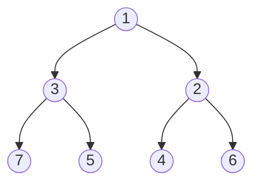
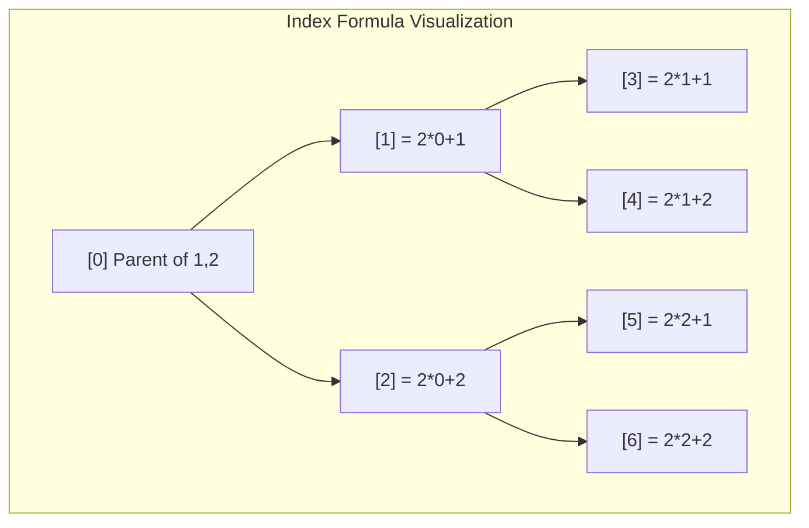

# Binary Heap - C++ Implementation

## Why Binary Heap?

### The Problem It Solves

Imagine you're managing an emergency room. Patients arrive throughout the day, but you can't treat them in the order they arrived. A heart attack patient who just walked in needs treatment before someone with a sprained ankle who's been waiting for an hour. You need a system that always gives you the most urgent case instantly, while still being fast at adding new patients.

A regular sorted list seems appealing, but inserting into a sorted list is O(n) - you have to shift elements to make room. A regular array lets you add quickly, but finding the minimum requires scanning everything - also O(n).

A binary heap solves both problems: it gives you the minimum in O(1) and lets you insert or remove in O(log n). It's the backbone of priority queues, task schedulers, and algorithms like Dijkstra's shortest path.

### Real-World Analogies

**Hospital Triage**: Patients are prioritized by severity. The most critical patient is always seen first. When a new patient arrives, a triage nurse quickly places them in the right priority level - they don't need to compare against every other patient, just make a few comparisons to find the right spot.

**Airport Boarding by Zone**: Passengers board by priority (first class, business, zone 1, zone 2...). The gate agent doesn't need to sort everyone - they just call the highest priority group that still has passengers waiting.

**Hot Potato with Priority**: Imagine a game where the "hottest" potato always floats to the top. When you add a new potato, it bubbles up based on its temperature. When you remove the hottest one, a potato from the bottom takes its place and sinks down to where it belongs.

### When to Use It

- **Priority queues**: When you need to process items by priority, not arrival order
- **Scheduling algorithms**: OS task schedulers, job queues, event-driven simulations
- **Graph algorithms**: Dijkstra's shortest path, Prim's minimum spanning tree
- **K-th element problems**: Finding the k largest/smallest elements in a stream
- **Merge operations**: Merging k sorted lists efficiently

**Unlike a sorted array**: Heaps trade perfect sorting for speed - you only know the minimum, not the second-smallest or third-smallest, but that's enough for most use cases and makes operations much faster.

---

## Core Concept

### The Big Idea

A binary heap is a **complete binary tree** stored in an **array** where every parent is smaller than (or equal to) its children. This property - called the **heap property** - means the smallest element is always at the root, ready to be retrieved in O(1).

The genius is in the array representation: a complete binary tree maps perfectly to an array with no wasted space, and parent-child relationships become simple arithmetic.

### Visual Representation

Here's a min-heap containing the values [1, 3, 2, 7, 5, 4, 6]:



And here's how that same tree is stored in memory as an array:

```
Array representation:
+-----+-----+-----+-----+-----+-----+-----+
|  1  |  3  |  2  |  7  |  5  |  4  |  6  |
+-----+-----+-----+-----+-----+-----+-----+
  [0]   [1]   [2]   [3]   [4]   [5]   [6]

Tree relationships in the array:
- Index 0 (value 1): root, no parent
- Index 1 (value 3): parent at 0, children at 3,4
- Index 2 (value 2): parent at 0, children at 5,6
- Index 3 (value 7): parent at 1, no children (leaf)
- Index 4 (value 5): parent at 1, no children (leaf)
- Index 5 (value 4): parent at 2, no children (leaf)
- Index 6 (value 6): parent at 2, no children (leaf)
```

### The Index Formulas

The magic that makes the array representation work:

```
For a node at index i:
  - Parent index:      (i - 1) / 2
  - Left child index:  2 * i + 1
  - Right child index: 2 * i + 2
```

Let's verify with index 2 (value 2):
- Parent: (2 - 1) / 2 = 0 (value 1) - Correct!
- Left child: 2 * 2 + 1 = 5 (value 4) - Correct!
- Right child: 2 * 2 + 2 = 6 (value 6) - Correct!



### Key Terminology

- **Min-heap**: A heap where parents are smaller than children. The minimum is at the root.
- **Max-heap**: A heap where parents are larger than children. The maximum is at the root.
- **Heap property**: The invariant that every parent relates correctly to its children (smaller for min-heap).
- **Complete binary tree**: Every level is fully filled except possibly the last, which is filled left-to-right.
- **Sift-up (bubble up)**: Moving a node upward by swapping with its parent until the heap property is restored.
- **Sift-down (bubble down)**: Moving a node downward by swapping with its smallest child until the heap property is restored.
- **Heapify**: Converting an arbitrary array into a valid heap in O(n) time.

---

## How It Works: Step-by-Step

### Operation 1: Push (Insert)

**What it does**: Adds a new element to the heap while maintaining the heap property.

**The algorithm**:
1. Place the new element at the end of the array (next available position)
2. Sift it up: compare with parent, swap if smaller, repeat

**Step-by-step walkthrough**:

Let's insert the value **2** into this heap:

Starting state:
```
Tree View:                    Array View:
      5                       [5, 8, 6, 9]
     / \                       0  1  2  3
    8   6
   /
  9
```

Step 1: Place 2 at the end (index 4)
```
Tree View:                    Array View:
      5                       [5, 8, 6, 9, 2]
     / \                       0  1  2  3  4
    8   6
   / \
  9   2
```

Step 2: Compare 2 with its parent at index (4-1)/2 = 1 (value 8)
2 < 8, so swap them:
```
Tree View:                    Array View:
      5                       [5, 2, 6, 9, 8]
     / \                       0  1  2  3  4
    2   6
   / \
  9   8
```

Step 3: Compare 2 with its new parent at index (1-1)/2 = 0 (value 5)
2 < 5, so swap them:
```
Tree View:                    Array View:
      2                       [2, 5, 6, 9, 8]
     / \                       0  1  2  3  4
    5   6
   / \
  9   8
```

Step 4: Index is 0 (root), no more parents. Done!

**Why this approach?** By always inserting at the end, we maintain the complete tree property. By sifting up, we fix any heap property violations with at most O(log n) swaps (the height of the tree).

### Operation 2: Pop (Extract Minimum)

**What it does**: Removes and returns the minimum element (the root).

**The algorithm**:
1. Save the root value (the minimum)
2. Move the last element to the root position
3. Decrease size by 1
4. Sift down from the root: compare with children, swap with smaller child if needed, repeat

**Step-by-step walkthrough**:

Let's pop from this heap:

Starting state:
```
Tree View:                    Array View:
      2                       [2, 5, 6, 9, 8]
     / \                       0  1  2  3  4
    5   6
   / \
  9   8
```

Step 1: Save root value (2) to return later

Step 2: Move last element (8) to root, decrease size:
```
Tree View:                    Array View:
      8                       [8, 5, 6, 9]
     / \                       0  1  2  3
    5   6                     (size = 4)
   /
  9
```

Step 3: Sift down - compare 8 with children at indices 1 (value 5) and 2 (value 6)
Smallest child is 5 at index 1. 8 > 5, so swap:
```
Tree View:                    Array View:
      5                       [5, 8, 6, 9]
     / \                       0  1  2  3
    8   6
   /
  9
```

Step 4: Continue from index 1. Children are at indices 3 (value 9) and 4 (out of bounds)
Only one child: 9. 8 < 9, so no swap needed. Done!

Return the saved value: **2**

**Why this approach?** We can't just remove the root and leave a hole. By moving the last element to the root, we maintain the complete tree structure. The last element is likely large (it was a leaf), so it needs to sink down to its proper position.

### Operation 3: Heapify (Build Heap from Array)

**What it does**: Transforms an arbitrary array into a valid heap in O(n) time.

**The naive approach (O(n log n))**: Insert elements one by one. Each insert is O(log n), so n inserts = O(n log n).

**Floyd's algorithm (O(n))**: Start from the last non-leaf node and sift down each node, working backwards to the root.

**Why start from non-leaf nodes?** Leaf nodes are already valid heaps of size 1. We only need to fix nodes that have children.

**Step-by-step walkthrough**:

Let's heapify the array [7, 3, 9, 1, 5, 2]:

Starting state (interpreted as a tree, but NOT a valid heap):
```
Tree View:                    Array View:
      7                       [7, 3, 9, 1, 5, 2]
     / \                       0  1  2  3  4  5
    3   9
   / \   \
  1   5   2

Last non-leaf: index (n/2) - 1 = 2
```

Step 1: Sift down from index 2 (value 9)
Children: index 5 (value 2). No right child.
9 > 2, swap:
```
Tree View:                    Array View:
      7                       [7, 3, 2, 1, 5, 9]
     / \                       0  1  2  3  4  5
    3   2
   / \   \
  1   5   9
```

Step 2: Sift down from index 1 (value 3)
Children: index 3 (value 1), index 4 (value 5)
Smallest child is 1. 3 > 1, swap:
```
Tree View:                    Array View:
      7                       [7, 1, 2, 3, 5, 9]
     / \                       0  1  2  3  4  5
    1   2
   / \   \
  3   5   9
```

Continue from index 3: no children (leaf). Done with this subtree.

Step 3: Sift down from index 0 (value 7)
Children: index 1 (value 1), index 2 (value 2)
Smallest child is 1. 7 > 1, swap:
```
Tree View:                    Array View:
      1                       [1, 7, 2, 3, 5, 9]
     / \                       0  1  2  3  4  5
    7   2
   / \   \
  3   5   9
```

Continue from index 1 (value 7):
Children: index 3 (value 3), index 4 (value 5)
Smallest child is 3. 7 > 3, swap:
```
Tree View:                    Array View:
      1                       [1, 3, 2, 7, 5, 9]
     / \                       0  1  2  3  4  5
    3   2
   / \   \
  7   5   9
```

Continue from index 3: no children. Done!

Final valid heap: [1, 3, 2, 7, 5, 9]

**Why O(n) instead of O(n log n)?**

It seems like we do O(log n) work per node, times n nodes = O(n log n). But this overcounts!

- Nodes at the bottom level (half of all nodes) do 0 swaps
- Nodes at second-to-bottom do at most 1 swap
- Nodes at third-to-bottom do at most 2 swaps
- Only the root does up to log(n) swaps

The sum is: n/2 * 0 + n/4 * 1 + n/8 * 2 + ... = O(n)

This is because most nodes are near the bottom and do very little work.

### Worked Example: Complete Sequence

Let's trace through a realistic sequence of operations on an initially empty heap:

```
Operation 1: push(5)
Tree: [5]
       5

Operation 2: push(3)
Insert at end: [5, 3]
Sift up: 3 < 5, swap
Result: [3, 5]
       3
      /
     5

Operation 3: push(8)
Insert at end: [3, 5, 8]
Sift up: 8 > 3, done
Result: [3, 5, 8]
       3
      / \
     5   8

Operation 4: push(1)
Insert at end: [3, 5, 8, 1]
Sift up: 1 < 5 (parent), swap -> [3, 1, 8, 5]
Sift up: 1 < 3 (parent), swap -> [1, 3, 8, 5]
Result: [1, 3, 8, 5]
       1
      / \
     3   8
    /
   5

Operation 5: pop()
Save minimum: 1
Move last to root: [5, 3, 8]
Sift down: 5 vs children 3, 8. Smallest is 3. 5 > 3, swap -> [3, 5, 8]
Result: [3, 5, 8], returned 1
       3
      / \
     5   8

Operation 6: push(2)
Insert at end: [3, 5, 8, 2]
Sift up: 2 < 5, swap -> [3, 2, 8, 5]
Sift up: 2 < 3, swap -> [2, 3, 8, 5]
Result: [2, 3, 8, 5]
       2
      / \
     3   8
    /
   5

Operation 7: peek()
Returns 2 (no modification)
Result: [2, 3, 8, 5]

Operation 8: pop()
Save minimum: 2
Move last to root: [5, 3, 8]
Sift down: 5 vs children 3, 8. Smallest is 3. 5 > 3, swap -> [3, 5, 8]
Result: [3, 5, 8], returned 2
       3
      / \
     5   8
```

---

## From Concept to Code

### The Data Structure

Before looking at code, let's understand what we need to track:

1. **The data array**: Stores heap elements in level-order
2. **Size**: How many elements are currently in the heap
3. **Capacity**: How much space is allocated (to avoid reallocating on every push)

We need capacity separate from size because:
- Allocating memory is expensive
- We use a "doubling" strategy: when full, allocate 2x the space
- This gives amortized O(1) push operations

### C++ Implementation

```cpp
template <typename T>
class BinaryHeap {
public:
    using value_type = T;
    using size_type = std::size_t;

    BinaryHeap() : data_(nullptr), size_(0), capacity_(0) {}

    // ... methods ...

private:
    T* data_;
    size_type size_;
    size_type capacity_;
};
```

**Line-by-line breakdown**:

- `template <typename T>`: This heap works with any type T. When you write `BinaryHeap<int>`, the compiler generates a version specifically for integers.

- `using value_type = T;`: Type alias following STL conventions. Code that uses the heap can write `BinaryHeap<int>::value_type` to get `int`.

- `using size_type = std::size_t;`: The type for sizes/indices. `std::size_t` is an unsigned integer guaranteed to hold any array index.

- `T* data_;`: Raw pointer to the dynamically allocated array. We manage this memory ourselves (allocate with `new[]`, deallocate with `delete[]`).

- `size_type size_;`: Number of elements currently stored.

- `size_type capacity_;`: Total allocated space. Always `size_ <= capacity_`.

### Implementing Push

**The algorithm in plain English**:
1. If the array is full, double its capacity
2. Place the new element at index `size_` (the first empty slot)
3. Sift it up to restore the heap property
4. Increment size

**The code**:

```cpp
void push(const T& value) {
    if (size_ == capacity_)
        reserve(capacity_ == 0 ? 1 : capacity_ * 2);
    data_[size_] = value;
    sift_up(size_);
    ++size_;
}

void push(T&& value) {
    if (size_ == capacity_)
        reserve(capacity_ == 0 ? 1 : capacity_ * 2);
    data_[size_] = std::move(value);
    sift_up(size_);
    ++size_;
}
```

**Understanding the tricky parts**:

- **Two overloads**: The first takes `const T&` (a reference to a value we'll copy). The second takes `T&&` (an rvalue reference - a value we can steal from). This optimization matters when T is expensive to copy (like a `std::string`).

- **`std::move(value)`**: Tells the compiler "I'm done with this value, you can cannibalize its contents." For a string, this might transfer ownership of the internal character buffer instead of copying all characters.

- **`capacity_ == 0 ? 1 : capacity_ * 2`**: Special case for empty heap. Start with capacity 1, then double each time.

- **Why increment size_ last?**: The sift_up operation needs to compare against existing elements. If we incremented first, it might try to compare against uninitialized memory.

### Implementing Pop

**The algorithm in plain English**:
1. If empty, throw an exception
2. Save the root element (the minimum)
3. Decrement size
4. If there are remaining elements, move the last element to root and sift down
5. Return the saved minimum

**The code**:

```cpp
T pop() {
    if (size_ == 0)
        throw std::out_of_range("BinaryHeap::pop: heap is empty");
    T result = std::move(data_[0]);
    --size_;
    if (size_ > 0) {
        data_[0] = std::move(data_[size_]);
        sift_down(0);
    }
    return result;
}
```

**Understanding the tricky parts**:

- **Returns by value**: We return `T`, not `T&`. The element is being removed, so we can't return a reference to something that conceptually no longer exists.

- **`std::move(data_[0])`**: We're removing this element, so we can move from it instead of copying.

- **`data_[0] = std::move(data_[size_])`**: After decrementing size, `data_[size_]` is the "former last element." We move it to the root.

- **`if (size_ > 0)`**: If we just removed the only element, there's nothing to sift down.

### Implementing Sift-Up

**The algorithm in plain English**:
1. While not at root:
   a. Calculate parent index: (index - 1) / 2
   b. If current element is not smaller than parent, we're done
   c. Otherwise, swap with parent and continue from parent's position

**The code**:

```cpp
void sift_up(size_type index) {
    while (index > 0) {
        size_type parent = (index - 1) / 2;
        if (!(data_[index] < data_[parent]))
            break;
        std::swap(data_[index], data_[parent]);
        index = parent;
    }
}
```

**Understanding the tricky parts**:

- **`!(data_[index] < data_[parent])`**: Why not `data_[index] >= data_[parent]`? Because we only require type T to implement `operator<`. By using negation of `<`, we don't need `>=` to be defined. This is a common C++ idiom.

- **Integer division for parent**: `(index - 1) / 2` uses integer division, which automatically floors. For index 3: (3-1)/2 = 1. For index 4: (4-1)/2 = 1. Both are children of index 1, as expected.

### Implementing Sift-Down

**The algorithm in plain English**:
1. Loop forever (we'll break when done):
   a. Assume current index has the smallest value
   b. Calculate left child: 2 * index + 1
   c. Calculate right child: 2 * index + 2
   d. If left child exists and is smaller, update smallest
   e. If right child exists and is smaller, update smallest
   f. If smallest is still the current index, we're done
   g. Otherwise, swap with smallest and continue from that position

**The code**:

```cpp
void sift_down(size_type index) {
    while (true) {
        size_type smallest = index;
        size_type left = 2 * index + 1;
        size_type right = 2 * index + 2;

        if (left < size_ && data_[left] < data_[smallest])
            smallest = left;
        if (right < size_ && data_[right] < data_[smallest])
            smallest = right;

        if (smallest == index)
            break;

        std::swap(data_[index], data_[smallest]);
        index = smallest;
    }
}
```

**Understanding the tricky parts**:

- **`left < size_`**: Bounds check. If left child index is >= size, the child doesn't exist.

- **Check both children separately**: We need to find the smallest of three values (current, left child, right child). By checking each child against current best, we find the minimum.

- **`smallest == index`**: If after checking both children, the current node is still smallest, the heap property is satisfied - we're done.

### Implementing Heapify (from_array)

**The algorithm in plain English**:
1. Copy the input array into the heap's storage
2. Starting from the last node that has children (index n/2 - 1), sift down
3. Work backwards to the root, sifting down each node

**The code**:

```cpp
static BinaryHeap from_array(const T* arr, size_type n) {
    BinaryHeap heap;
    if (n == 0)
        return heap;
    heap.capacity_ = n;
    heap.size_ = n;
    heap.data_ = new T[n];
    for (size_type i = 0; i < n; ++i)
        heap.data_[i] = arr[i];
    // Heapify: start from last non-leaf and sift down
    for (size_type i = n / 2; i > 0; --i)
        heap.sift_down(i - 1);
    return heap;
}
```

**Understanding the tricky parts**:

- **`static`**: This is a factory method, not an instance method. You call it as `BinaryHeap<int>::from_array(...)`.

- **`for (size_type i = n / 2; i > 0; --i)` then `sift_down(i - 1)`**: This is a clever way to iterate from index n/2-1 down to 0 using an unsigned type. We can't write `for (size_type i = n/2 - 1; i >= 0; --i)` because size_type is unsigned, so `i >= 0` is always true!

- **Why n/2?**: In a complete binary tree, the last n/2 nodes are leaves (they have no children). The first node with children is at index n/2 - 1.

### Implementing Rule of Five

C++ requires us to handle copying, moving, and destruction explicitly when we manage raw memory.

**The code**:

```cpp
// Destructor - clean up memory
~BinaryHeap() { delete[] data_; }

// Copy constructor - create independent copy
BinaryHeap(const BinaryHeap& other)
    : data_(other.capacity_ > 0 ? new T[other.capacity_] : nullptr),
      size_(other.size_),
      capacity_(other.capacity_) {
    for (size_type i = 0; i < size_; ++i)
        data_[i] = other.data_[i];
}

// Move constructor - steal resources
BinaryHeap(BinaryHeap&& other) noexcept
    : data_(other.data_), size_(other.size_), capacity_(other.capacity_) {
    other.data_ = nullptr;
    other.size_ = 0;
    other.capacity_ = 0;
}

// Copy assignment - copy-and-swap idiom
BinaryHeap& operator=(const BinaryHeap& other) {
    BinaryHeap temp(other);
    swap(temp);
    return *this;
}

// Move assignment - take ownership
BinaryHeap& operator=(BinaryHeap&& other) noexcept {
    if (this != &other) {
        delete[] data_;
        data_ = other.data_;
        size_ = other.size_;
        capacity_ = other.capacity_;
        other.data_ = nullptr;
        other.size_ = 0;
        other.capacity_ = 0;
    }
    return *this;
}
```

**Understanding the tricky parts**:

- **Destructor**: `delete[]` matches `new[]`. Never mix `delete` with `new[]` or vice versa.

- **Copy constructor initialization list**: We allocate the new array in the initializer list, then copy elements in the body. If capacity is 0, we set `data_` to nullptr.

- **Move constructor `noexcept`**: Promises this won't throw exceptions. Important for STL containers that use move operations.

- **Move constructor nullifies source**: After stealing `other.data_`, we set `other.data_ = nullptr` so other's destructor won't delete our data.

- **Copy assignment uses copy-and-swap**: Create a temporary copy, swap with it, let the temporary's destructor clean up our old data. This is exception-safe.

- **Move assignment self-check**: `if (this != &other)` prevents `heap = std::move(heap)` from deleting its own data.

---

## Complexity Analysis

### Time Complexity

| Operation | Best | Average | Worst | Why |
|-----------|------|---------|-------|-----|
| push | O(1) | O(log n) | O(n) | Best: element belongs at leaf. Average: sifts up half the tree. Worst: resize triggers O(n) copy. |
| pop | O(1) | O(log n) | O(log n) | Best: replacement element stays at root. Average/Worst: sifts down the full height. |
| peek | O(1) | O(1) | O(1) | Always returns root - no traversal needed. |
| from_array | O(n) | O(n) | O(n) | Floyd's algorithm: most nodes near bottom do little work. |
| size/empty | O(1) | O(1) | O(1) | Just returning a stored value. |

**Understanding the "Why" column**:

**Push is O(log n) amortized**: Most pushes don't trigger a resize. When they do, the doubling strategy means we copy n elements, but then the next n pushes are cheap. Cost spreads out to O(1) amortized per push, plus O(log n) for sift-up.

**Pop is always O(log n)**: Unlike push, there's no resizing. The sift-down might get lucky (replacement element is small), but in the worst case, it travels root to leaf.

**from_array is O(n), not O(n log n)**: This surprises people. The key insight: half the nodes are leaves (0 work), a quarter do 1 swap, an eighth do 2 swaps, etc. The sum converges to O(n).

### Space Complexity

- **Overall structure**: O(n) for n elements
- **Per operation**: O(1) - push, pop, sift operations use only a few local variables
- **from_array**: O(n) - creates a new array of size n

### Why Amortized O(1) for Push Resize

Consider pushing n elements starting from empty:

1. Push 1: allocate capacity 1
2. Push 2: allocate capacity 2, copy 1 element
3. Push 3: allocate capacity 4, copy 2 elements
4. Push 4: no resize
5. Push 5: allocate capacity 8, copy 4 elements
...

Total copies: 1 + 2 + 4 + 8 + ... + n/2 = n - 1

So n pushes cause n-1 copies total. That's less than 1 copy per push on average - O(1) amortized!

---

## Common Mistakes and Pitfalls

### Mistake 1: Off-by-One in Parent/Child Formulas

```cpp
// Wrong: forgetting 0-based indexing
size_type parent = index / 2;           // Works for 1-based, not 0-based!
size_type left = 2 * index;             // Wrong

// Right: correct formulas for 0-based indexing
size_type parent = (index - 1) / 2;
size_type left = 2 * index + 1;
size_type right = 2 * index + 2;
```

**Why this matters**: Using 1-based formulas with 0-based arrays gives wrong relationships. Index 1's parent would be calculated as 0, which is accidentally correct. But index 2's parent would be 1, when it should be 0. Your heap will be silently corrupted.

### Mistake 2: Forgetting to Check Bounds in Sift-Down

```cpp
// Wrong: assuming children exist
void sift_down_broken(size_type index) {
    size_type left = 2 * index + 1;
    size_type right = 2 * index + 2;

    // CRASH: accessing data_[left] when left >= size_
    if (data_[left] < data_[index]) { ... }
}

// Right: check bounds first
void sift_down(size_type index) {
    size_type left = 2 * index + 1;
    size_type right = 2 * index + 2;

    if (left < size_ && data_[left] < data_[smallest])
        smallest = left;
}
```

**Why this matters**: Leaf nodes have no children. Accessing out-of-bounds memory is undefined behavior - it might crash, might silently corrupt data, might seem to work until it doesn't.

### Mistake 3: Incrementing Size Before Sift-Up

```cpp
// Wrong: size already incremented
void push_broken(const T& value) {
    data_[size_] = value;
    ++size_;              // Incremented too early!
    sift_up(size_ - 1);   // Now we have to use size_ - 1
}

// Right: increment after sift
void push(const T& value) {
    data_[size_] = value;
    sift_up(size_);       // Use size_ directly as the index
    ++size_;              // Increment after sift completes
}
```

**Why this matters**: If you increment first, `sift_up(size_ - 1)` is confusing and error-prone. It's cleaner to let `size_` represent "the index where the next element goes" until after the element is fully inserted.

### Mistake 4: Using `>=` Instead of Negating `<`

```cpp
// Wrong: requires operator>= to be defined
if (data_[index] >= data_[parent])
    break;

// Right: only requires operator<
if (!(data_[index] < data_[parent]))
    break;
```

**Why this matters**: C++ convention is to only require `operator<` for ordered containers. If someone creates a custom type with only `<` defined, your heap should still work. Using `>=` would cause a compilation error.

### Mistake 5: Memory Leak in Assignment Operator

```cpp
// Wrong: leaks old memory
BinaryHeap& operator=(const BinaryHeap& other) {
    data_ = new T[other.capacity_];  // Old data_ leaked!
    // ...
}

// Right: use copy-and-swap
BinaryHeap& operator=(const BinaryHeap& other) {
    BinaryHeap temp(other);
    swap(temp);   // temp now holds our old data
    return *this; // temp destructor cleans up old data
}
```

**Why this matters**: Every `new` needs a matching `delete`. If you assign to `data_` without first deleting the old array, that memory is lost forever. The copy-and-swap idiom handles this elegantly and is also exception-safe.

---

## Practice Problems

To solidify your understanding, try implementing:

1. **Max-heap**: Modify the comparison logic so the maximum is at the root instead of the minimum. (Hint: just flip the `<` comparisons)

2. **Heap with custom comparator**: Add a template parameter for a comparison function, allowing users to create min-heaps, max-heaps, or custom orderings.

3. **Heap sort**: Use a heap to sort an array in O(n log n) time. Build a max-heap, then repeatedly extract the maximum and place it at the end.

4. **Decrease-key operation**: Add a method to decrease the value at a given index and restore the heap property. This is needed for Dijkstra's algorithm.

5. **Merge two heaps**: Given two heaps, create a new heap containing all elements from both. Can you do better than O(n + m) by being clever about which heap to merge into?

---

## Summary

### Key Takeaways

- A binary heap is a complete binary tree stored in an array where every parent is smaller than its children (for a min-heap)
- The array representation uses simple formulas: parent = (i-1)/2, left child = 2i+1, right child = 2i+2
- Push adds at the end and sifts up; pop moves last to root and sifts down
- Floyd's heapify algorithm builds a heap in O(n) by sifting down from the last non-leaf
- C++ implementation requires Rule of Five for proper memory management
- Use `operator<` for comparisons to support any ordered type

### Quick Reference

```
BinaryHeap<T> - Min-heap with smallest element at root
|-- push(value):  O(log n) amortized - Add element and sift up
|-- pop():        O(log n)           - Remove minimum and sift down
|-- peek():       O(1)               - View minimum without removing
|-- from_array(): O(n)               - Build heap using Floyd's algorithm
|-- size():       O(1)               - Number of elements
+-- empty():      O(1)               - Check if heap is empty

Best for: Priority queues, scheduling, graph algorithms, finding extremes
Avoid when: You need arbitrary access, searching, or sorted iteration
```

### Tree-Array Duality Reference

```
        Tree View                 Array View
           (0)                   [0, 1, 2, 3, 4, 5, 6]
          /   \
        (1)   (2)         Parent of i:     (i - 1) / 2
        / \   / \         Left child of i:  2 * i + 1
      (3)(4)(5)(6)        Right child of i: 2 * i + 2
```
