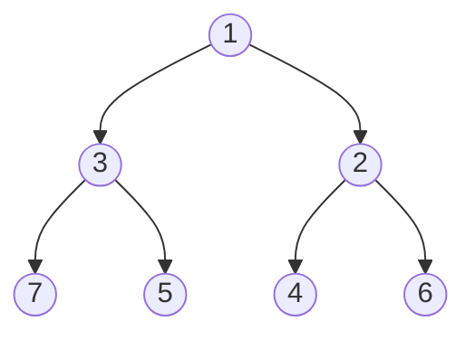

# Binary Heap - Go Implementation

## Why Binary Heap?

### The Problem It Solves

Imagine you're building a hospital emergency room system. Patients arrive throughout the day, but you can't treat them in the order they arrived. A patient with a heart attack must be seen before someone with a sprained ankle, regardless of who walked in first.

You need a data structure that:
1. Lets you quickly add new patients with their priority
2. Always tells you who the highest-priority patient is
3. Efficiently removes that patient when they're being treated

A simple sorted list would work, but inserting a new patient means shifting potentially hundreds of records. An unsorted list makes finding the highest priority patient require scanning everything.

A binary heap gives you the best of both worlds: fast insertion AND fast access to the highest-priority element.

### Real-World Analogies

**Hospital Triage Board**: Patients are organized so the most critical case is always at the top. When a new patient arrives, they're quickly slotted into the right position. When the top patient is treated, the board reorganizes itself so the next most critical is now on top.

**Corporate Escalation Chain**: Issues bubble up through management. The most urgent problem always reaches the CEO first. Less urgent issues stay lower in the hierarchy until more pressing matters are resolved.

**Task Priority Queue**: Your computer's operating system uses heaps to decide which process runs next. The highest-priority task is always ready to execute, while lower-priority background tasks wait their turn.

### When to Use It

- **Use a binary heap when you need** to repeatedly find and remove the minimum (or maximum) element
- **Priority queues** are the classic use case (task scheduling, event-driven simulation)
- **Finding the k smallest/largest elements** in a stream of data
- **Graph algorithms** like Dijkstra's shortest path and Prim's minimum spanning tree
- **Median maintenance** using two heaps (one min, one max)

**Unlike an array**, a heap gives you O(log n) insertion while maintaining quick access to the minimum. Unlike a sorted array, you don't pay O(n) for every insertion.

**Unlike a binary search tree**, a heap uses a simple array with no pointer overhead, better cache locality, and guaranteed O(log n) operations (no balancing needed).

---

## Core Concept

### The Big Idea

A binary heap is a **complete binary tree** stored in an **array** where every parent is smaller than (or equal to) its children. This property is called the **heap property** or **heap invariant**.

"Complete binary tree" means every level is fully filled except possibly the last, which is filled from left to right. This structure is what allows us to use a simple array instead of nodes with pointers.

The minimum element is always at the root (index 0). We don't care about the relative order of siblings or cousins - only that parents are smaller than children.

### Visual Representation

A min-heap with elements [1, 3, 2, 7, 5, 4, 6]:



This same tree is stored in memory as a flat array:

```
Array: [ 1 | 3 | 2 | 7 | 5 | 4 | 6 ]
Index:   0   1   2   3   4   5   6
```

The magic is in how we navigate between parent and child using simple arithmetic on indices.

### Key Terminology

- **Heap Property**: Every parent node is smaller than or equal to its children (for a min-heap). This ensures the minimum is always at the root.

- **Complete Binary Tree**: A binary tree where all levels except possibly the last are completely filled, and the last level has nodes as far left as possible. This allows array storage without gaps.

- **Heapify Up (Sift Up)**: After inserting at the bottom, move the element up by swapping with its parent until the heap property is restored.

- **Heapify Down (Sift Down)**: After removing the root, move the replacement element down by swapping with its smaller child until the heap property is restored.

- **Min-Heap vs Max-Heap**: In a min-heap, the smallest element is at the root. In a max-heap, the largest is at the root. This implementation is a min-heap.

### Index Formulas

The array storage works because of these relationships:

```
For an element at index i:
  Parent:      (i - 1) / 2
  Left child:  2*i + 1
  Right child: 2*i + 2
```

Let's verify with index 1 (value 3):
- Parent: (1 - 1) / 2 = 0 (value 1) - correct, 1 is parent of 3
- Left child: 2*1 + 1 = 3 (value 7) - correct
- Right child: 2*1 + 2 = 4 (value 5) - correct

---

## How It Works: Step-by-Step

### Operation 1: Push (Insert)

**What it does**: Adds a new element to the heap while maintaining the heap property.

**Step-by-step walkthrough**:

Starting state (inserting 0 into our heap):
```
Array: [ 1 | 3 | 2 | 7 | 5 | 4 | 6 ]

Tree:
        1
       / \
      3   2
     / \ / \
    7  5 4  6
```

Step 1: Append the new element at the end (first available position in complete tree)
```
Array: [ 1 | 3 | 2 | 7 | 5 | 4 | 6 | 0 ]
                                     ^
                                  index 7

Tree:
        1
       / \
      3   2
     / \ / \
    7  5 4  6
   /
  0  <-- new element at index 7
```

Step 2: Compare with parent. Index 7's parent is (7-1)/2 = 3. Compare: 0 < 7? Yes, swap.
```
Array: [ 1 | 3 | 2 | 0 | 5 | 4 | 6 | 7 ]

Tree:
        1
       / \
      3   2
     / \ / \
    0  5 4  6
   /
  7
```

Step 3: Compare with new parent. Index 3's parent is (3-1)/2 = 1. Compare: 0 < 3? Yes, swap.
```
Array: [ 1 | 0 | 2 | 3 | 5 | 4 | 6 | 7 ]

Tree:
        1
       / \
      0   2
     / \ / \
    3  5 4  6
   /
  7
```

Step 4: Compare with new parent. Index 1's parent is (1-1)/2 = 0. Compare: 0 < 1? Yes, swap.
```
Array: [ 0 | 1 | 2 | 3 | 5 | 4 | 6 | 7 ]

Tree:
        0
       / \
      1   2
     / \ / \
    3  5 4  6
   /
  7
```

Step 5: Index is now 0, no more parent. Done!

**Why this approach?** By adding at the end and bubbling up, we maintain the complete tree structure. We only need to traverse the height of the tree (log n levels), making this O(log n).

### Operation 2: Pop (Extract Minimum)

**What it does**: Removes and returns the minimum element (the root), then restores the heap property.

**Step-by-step walkthrough**:

Starting state:
```
Array: [ 0 | 1 | 2 | 3 | 5 | 4 | 6 | 7 ]

Tree:
        0  <-- we want to remove this
       / \
      1   2
     / \ / \
    3  5 4  6
   /
  7
```

Step 1: Save the root (0) to return later. Move the last element to the root position.
```
Saved: 0
Array: [ 7 | 1 | 2 | 3 | 5 | 4 | 6 ]
        ^
        last element moved here

Tree:
        7  <-- wrong position!
       / \
      1   2
     / \ / \
    3  5 4  6
```

Step 2: Heapify down. Compare 7 with children at indices 1 and 2. Left=1, Right=2. Smaller child is 1 (at index 1). Is 7 > 1? Yes, swap.
```
Array: [ 1 | 7 | 2 | 3 | 5 | 4 | 6 ]

Tree:
        1
       / \
      7   2
     / \ / \
    3  5 4  6
```

Step 3: Continue from index 1. Children are at indices 3 and 4. Left=3, Right=5. Smaller child is 3 (at index 3). Is 7 > 3? Yes, swap.
```
Array: [ 1 | 3 | 2 | 7 | 5 | 4 | 6 ]

Tree:
        1
       / \
      3   2
     / \ / \
    7  5 4  6
```

Step 4: Continue from index 3. Left child would be at index 7, but our array only has 7 elements (indices 0-6). No children exist, so we're done.

Return the saved minimum: 0

**Why this approach?** By moving the last element to the root and sinking it down, we maintain the complete tree structure. The last element is unlikely to be the new minimum, but heapify-down efficiently finds its correct position in O(log n) time.

### Worked Example: Complete Sequence

Let's trace through building a heap from scratch:

```
Operation 1: Push(5)
Array: [5]
Tree:  5
Heap is valid (single element).

Operation 2: Push(3)
Array: [5, 3]
3 < 5? Yes, swap.
Array: [3, 5]
Tree:  3
      /
     5

Operation 3: Push(8)
Array: [3, 5, 8]
8 < 5? No, done.
Tree:   3
       / \
      5   8

Operation 4: Push(1)
Array: [3, 5, 8, 1]
1 < 5? Yes, swap with parent at index 1.
Array: [3, 1, 8, 5]
1 < 3? Yes, swap with parent at index 0.
Array: [1, 3, 8, 5]
Tree:   1
       / \
      3   8
     /
    5

Operation 5: Push(2)
Array: [1, 3, 8, 5, 2]
2 < 3? Yes, swap.
Array: [1, 2, 8, 5, 3]
2 < 1? No, done.
Tree:   1
       / \
      2   8
     / \
    5   3

Operation 6: Pop() -> returns 1
Move last element (3) to root.
Array: [3, 2, 8, 5]
Heapify down: 3 vs children 2 and 8. 2 is smaller, 3 > 2, swap.
Array: [2, 3, 8, 5]
Heapify down from index 1: child is 5 at index 3. 3 < 5? Yes! Done.
Tree:   2
       / \
      3   8
     /
    5
Returned: 1

Operation 7: Peek() -> returns 2
No modification, just return h.data[0].

Operation 8: Pop() -> returns 2
Move last (5) to root.
Array: [5, 3, 8]
5 > 3? Yes, swap.
Array: [3, 5, 8]
Tree:  3
      / \
     5   8
Returned: 2
```

---

## From Concept to Code

### The Data Structure

Before looking at code, let's think about what we need to store:

1. **The elements themselves** - stored in a slice (Go's dynamic array)
2. **Nothing else!** - the size is tracked by the slice's length, and the tree structure is implicit in the array indices

This simplicity is one of the heap's great advantages. No node objects, no pointers, just a flat array.

### Go Implementation

```go
package binaryheap

import (
    "cmp"
    "errors"
)

var ErrEmptyHeap = errors.New("BinaryHeap: heap is empty")

type BinaryHeap[T cmp.Ordered] struct {
    data []T
}
```

**Understanding the Go-specific parts**:

- **`[T cmp.Ordered]`**: This is Go's generics syntax (added in Go 1.18). `T` is a type parameter, and `cmp.Ordered` is a constraint meaning "any type that supports the `<`, `>`, and `==` operators". This includes all integer types, float types, and strings.

- **`cmp.Ordered` constraint**: This is stricter than `any`. It guarantees we can compare elements, which is essential for maintaining heap order. Types like slices or structs don't satisfy this constraint.

- **`var ErrEmptyHeap = ...`**: This is a sentinel error pattern in Go. By exporting a specific error variable, callers can check for this exact error using `errors.Is(err, binaryheap.ErrEmptyHeap)`.

- **`data []T`**: A slice is Go's dynamic array. It tracks length and capacity internally, grows automatically when needed, and is garbage collected when no longer referenced.

### Implementing Push

**The algorithm in plain English**:
1. Append the new element to the end of the slice
2. "Bubble up" the element: repeatedly compare with parent and swap if smaller
3. Stop when the element is larger than its parent or reaches the root

**The code**:
```go
func (h *BinaryHeap[T]) Push(value T) {
    h.data = append(h.data, value)
    h.heapifyUp(len(h.data) - 1)
}

func (h *BinaryHeap[T]) heapifyUp(i int) {
    for i > 0 {
        parent := (i - 1) / 2
        if h.data[i] >= h.data[parent] {
            break
        }
        h.data[i], h.data[parent] = h.data[parent], h.data[i]
        i = parent
    }
}
```

**Understanding the tricky parts**:

- **`(h *BinaryHeap[T])`**: This is a pointer receiver. The `*` means we receive a pointer to the heap, not a copy. This is essential because `Push` modifies the heap. Without the pointer, changes would be lost.

- **`append(h.data, value)`**: Go's `append` returns a new slice. If there's capacity, it reuses the backing array. If not, it allocates a larger array and copies. We must reassign `h.data` to capture potential reallocation.

- **`len(h.data) - 1`**: After appending, the new element is at the last index.

- **`(i - 1) / 2`**: Integer division in Go truncates toward zero. This gives us the parent index. For i=1 or i=2, parent is 0. For i=3 or i=4, parent is 1.

- **`h.data[i] >= h.data[parent]`**: If the current element is greater than or equal to its parent, the heap property is satisfied. We use `>=` rather than `>` because equal elements can stay in either order.

- **`h.data[i], h.data[parent] = h.data[parent], h.data[i]`**: Go's multiple assignment enables clean swap syntax without a temporary variable.

### Implementing Pop

**The algorithm in plain English**:
1. Check if heap is empty; if so, return an error
2. Save the root element (the minimum) to return later
3. Move the last element to the root position
4. Shrink the slice by one
5. "Sink down" the new root: repeatedly swap with the smaller child until heap property is restored
6. Return the saved minimum

**The code**:
```go
func (h *BinaryHeap[T]) Pop() (T, error) {
    var zero T
    if len(h.data) == 0 {
        return zero, ErrEmptyHeap
    }
    min := h.data[0]
    last := len(h.data) - 1
    h.data[0] = h.data[last]
    h.data = h.data[:last]
    if len(h.data) > 0 {
        h.heapifyDown(0)
    }
    return min, nil
}

func (h *BinaryHeap[T]) heapifyDown(i int) {
    n := len(h.data)
    for {
        smallest := i
        left := 2*i + 1
        right := 2*i + 2

        if left < n && h.data[left] < h.data[smallest] {
            smallest = left
        }
        if right < n && h.data[right] < h.data[smallest] {
            smallest = right
        }
        if smallest == i {
            break
        }
        h.data[i], h.data[smallest] = h.data[smallest], h.data[i]
        i = smallest
    }
}
```

**Understanding the tricky parts**:

- **`var zero T`**: Go's zero value declaration. For any type T, `var zero T` gives you the zero value (0 for numbers, "" for strings, nil for pointers). We need this to return something when the heap is empty.

- **`return zero, ErrEmptyHeap`**: Go's idiomatic error handling. The function returns both a value and an error. Callers check `if err != nil` before using the value.

- **`h.data = h.data[:last]`**: Slice reslicing. This creates a new slice header pointing to the same backing array but with a smaller length. The last element becomes inaccessible (and eventually garbage collected if it was a pointer type).

- **`if len(h.data) > 0`**: After removing an element, we might have an empty heap. Heapifying an empty heap would be pointless (and the function handles it, but this is clearer).

- **`smallest := i`**: We start by assuming the current element is in the right place.

- **`left < n`**: Bounds checking. The left child might not exist if we're at or near the bottom of the tree.

- **`h.data[left] < h.data[smallest]`**: We want the smallest among current, left child, and right child. We update `smallest` whenever we find something smaller.

- **`smallest == i`**: If we didn't find any child smaller than the current element, the heap property is satisfied and we can stop.

### Implementing FromSlice (Heapify)

**The algorithm in plain English**:
1. Copy the input slice (to avoid modifying the original)
2. Starting from the last non-leaf node, heapify down each node
3. Work backwards to the root

This is called Floyd's heap construction algorithm and runs in O(n) time, faster than pushing each element individually (which would be O(n log n)).

**The code**:
```go
func FromSlice[T cmp.Ordered](arr []T) *BinaryHeap[T] {
    h := &BinaryHeap[T]{
        data: make([]T, len(arr)),
    }
    copy(h.data, arr)
    for i := len(h.data)/2 - 1; i >= 0; i-- {
        h.heapifyDown(i)
    }
    return h
}
```

**Understanding the tricky parts**:

- **`FromSlice[T cmp.Ordered]`**: This is a package-level generic function, not a method. We can't call methods on nil, so constructors in Go are typically standalone functions.

- **`make([]T, len(arr))`**: Allocates a slice with the specified length. All elements start at their zero values.

- **`copy(h.data, arr)`**: Copies elements from `arr` to `h.data`. This is defensive programming - we don't want callers to be able to corrupt our heap by modifying their original slice.

- **`len(h.data)/2 - 1`**: This gives us the last non-leaf node. Why? Leaves have no children to heapify, so we can skip them. In a complete binary tree with n nodes, the leaves are at indices n/2 through n-1. So the last non-leaf is at index n/2 - 1.

- **`i >= 0; i--`**: We work backwards from the last non-leaf to the root. Each heapifyDown ensures the subtree rooted at i is a valid heap.

**Why is this O(n) and not O(n log n)?** The key insight is that most nodes are near the bottom and don't need to sink far. Half the nodes are leaves (0 swaps needed). A quarter are one level up (at most 1 swap). Only one node (the root) might need log n swaps. The math works out to O(n) total operations.

### Other Methods

```go
func (h *BinaryHeap[T]) Peek() (T, error) {
    var zero T
    if len(h.data) == 0 {
        return zero, ErrEmptyHeap
    }
    return h.data[0], nil
}

func (h *BinaryHeap[T]) Size() int {
    return len(h.data)
}

func (h *BinaryHeap[T]) IsEmpty() bool {
    return len(h.data) == 0
}

func (h *BinaryHeap[T]) Clear() {
    h.data = h.data[:0]
}

func (h *BinaryHeap[T]) Clone() *BinaryHeap[T] {
    clone := &BinaryHeap[T]{
        data: make([]T, len(h.data)),
    }
    copy(clone.data, h.data)
    return clone
}
```

**Notes on Clear**:
- `h.data[:0]` creates a zero-length slice but keeps the backing array
- This is memory-efficient if you plan to reuse the heap
- For immediate memory reclamation, you could use `h.data = nil` instead

**Notes on Clone**:
- Creates a completely independent copy
- Changes to the clone don't affect the original
- Essential when you need to iterate destructively (via repeated Pop) while preserving the original

---

## Complexity Analysis

### Time Complexity

| Operation | Best | Average | Worst | Why |
|-----------|------|---------|-------|-----|
| Push | O(1) | O(log n) | O(log n) | Best: element belongs at bottom. Worst: element bubbles all the way to root, traversing tree height |
| Pop | O(1) | O(log n) | O(log n) | Best: last element happens to be valid root. Worst: element sinks to bottom leaf, traversing tree height |
| Peek | O(1) | O(1) | O(1) | Direct array access to index 0 |
| FromSlice | O(n) | O(n) | O(n) | Floyd's algorithm - most nodes sink very few levels |
| Size | O(1) | O(1) | O(1) | Slice tracks its own length |
| IsEmpty | O(1) | O(1) | O(1) | Compare length to zero |
| Clone | O(n) | O(n) | O(n) | Must copy every element |

**Understanding why Push/Pop are O(log n)**: A binary heap is a complete binary tree. With n elements, the tree has approximately log2(n) levels. In the worst case, an element travels from root to leaf (or vice versa), visiting each level once.

**Understanding why FromSlice is O(n)**: This is surprising since we call heapifyDown n/2 times, and each heapifyDown is O(log n). But most heapifyDown calls operate on nodes near the bottom with few levels below them. The mathematical analysis shows the total work is bounded by O(n).

### Space Complexity

- **Overall structure**: O(n) - we store n elements in the slice
- **Per operation**: O(1) - all operations use a constant amount of extra space (just a few index variables)

### Amortized Analysis

**What is amortization?** When the cost of operations varies, we can average over a sequence. If most operations are cheap and expensive ones are rare, the "amortized" (averaged) cost is low.

**Push amortization**: Go slices grow by doubling capacity when full. A resize copies all n elements (O(n)), but this happens only after n cheap pushes. So n+1 pushes cost O(n) for copies plus O((n+1) log n) for heapify operations. Divided by n+1 operations, each push is O(log n) amortized.

---

## Common Mistakes & Pitfalls

### Mistake 1: Forgetting to check for empty heap

```go
// Wrong:
func badPeek(h *BinaryHeap[int]) int {
    return h.data[0]  // Panics if heap is empty!
}

// Right:
func goodPeek(h *BinaryHeap[int]) (int, error) {
    if h.IsEmpty() {
        return 0, ErrEmptyHeap
    }
    return h.data[0], nil
}
```

**Why this matters**: Accessing index 0 of an empty slice causes a runtime panic. Always check `IsEmpty()` or handle the returned error.

### Mistake 2: Using the wrong index formula

```go
// Wrong:
parent := i / 2        // Off by one for 0-indexed arrays
left := 2 * i          // Wrong!
right := 2 * i + 1     // Wrong!

// Right:
parent := (i - 1) / 2
left := 2*i + 1
right := 2*i + 2
```

**Why this matters**: The formulas above assume 1-indexed arrays (common in textbooks). For 0-indexed arrays (used in Go, and most languages), you need the adjusted formulas. Getting this wrong corrupts the heap structure silently.

### Mistake 3: Modifying the slice passed to FromSlice

```go
// Dangerous assumption:
nums := []int{5, 3, 8, 1}
heap := FromSlice(nums)
nums[0] = 999  // Does this break the heap?

// Answer: No! FromSlice copies the slice.
// But if you wrote your own version without copying, it would break.
```

**Why this matters**: The implementation defensively copies the input, but if you're implementing your own heap, forgetting to copy means external code can corrupt your heap. Always copy, or document that you're taking ownership.

### Mistake 4: Assuming Pop returns elements in sorted order

```go
// This DOES work:
heap := FromSlice([]int{5, 3, 8, 1, 9})
for !heap.IsEmpty() {
    val, _ := heap.Pop()
    fmt.Println(val)  // Prints: 1, 3, 5, 8, 9
}

// But the internal array is NOT sorted:
// After FromSlice, data might be [1, 3, 8, 5, 9]
// Only the root is guaranteed to be minimum
```

**Why this matters**: A heap is not a sorted array. Only the root is guaranteed to be the minimum. The array `[1, 3, 8, 5, 9]` is a valid heap even though it's not sorted. This is by design - maintaining only the heap property is what makes operations efficient.

### Mistake 5: Using value receiver instead of pointer receiver

```go
// Wrong:
func (h BinaryHeap[T]) Push(value T) {  // Value receiver - gets a COPY
    h.data = append(h.data, value)
    h.heapifyUp(len(h.data) - 1)
    // Changes are lost when this function returns!
}

// Right:
func (h *BinaryHeap[T]) Push(value T) {  // Pointer receiver
    h.data = append(h.data, value)
    h.heapifyUp(len(h.data) - 1)
}
```

**Why this matters**: In Go, methods with value receivers work on a copy of the struct. Any modifications are lost. Always use pointer receivers for methods that modify state.

---

## Practice Problems

To solidify your understanding, try implementing:

1. **MaxHeap**: Modify the implementation to keep the maximum element at the root instead of the minimum. (Hint: just change the comparison operators)

2. **HeapSort**: Use a heap to sort an array in O(n log n) time. Build a heap from the array, then repeatedly extract the minimum.

3. **Merge K Sorted Lists**: Given k sorted slices, merge them into one sorted slice using a heap. (Hint: push the first element of each list with its list index, then repeatedly pop and push the next element from that list)

4. **Running Median**: Maintain the median of a stream of numbers using two heaps - a max-heap for the lower half and a min-heap for the upper half.

5. **Priority Queue with Update**: Extend the heap to support decreasing the priority of an existing element. This requires tracking element positions. (Used in Dijkstra's algorithm)

---

## Summary

### Key Takeaways

- A binary heap is a complete binary tree stored as an array, where every parent is smaller than its children (min-heap)
- The minimum element is always at index 0, accessible in O(1) time
- Push and Pop both run in O(log n) by maintaining the heap property through bubbling up or sinking down
- Building a heap from an array takes only O(n) using Floyd's algorithm
- The array representation eliminates pointer overhead and provides excellent cache locality

### Quick Reference

```
BinaryHeap[T] - Priority queue with O(log n) insert and O(1) min access
|-- New[T]()              : O(1) - Create empty heap
|-- FromSlice[T](arr)     : O(n) - Build heap from slice (Floyd's algorithm)
|-- Push(value)           : O(log n) - Insert element
|-- Pop() (T, error)      : O(log n) - Remove and return minimum
|-- Peek() (T, error)     : O(1) - Return minimum without removing
|-- Size()                : O(1) - Number of elements
|-- IsEmpty()             : O(1) - Check if empty
|-- Clear()               : O(1) - Remove all elements
|-- Clone()               : O(n) - Create independent copy

Best for: Priority queues, finding k smallest/largest, graph algorithms
Avoid when: You need sorted iteration, searching for arbitrary elements,
            or types that don't satisfy cmp.Ordered
```
