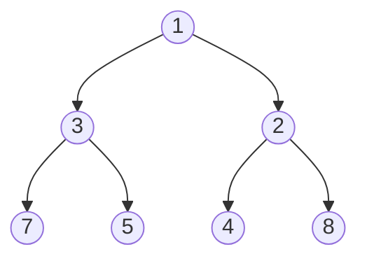

# Binary Heap - Python Implementation

## Why Binary Heap?

### The Problem It Solves

Imagine you're building a hospital emergency room system. Patients arrive throughout the day, but you can't treat them in order of arrival. A patient with a heart attack must be seen before someone with a sprained ankle, regardless of who arrived first.

You need a data structure that can:
1. Accept new items (patients) at any time
2. Always give you the highest-priority item (most urgent patient) instantly
3. Do both operations efficiently, even with thousands of items

A regular list fails here. Finding the minimum in an unsorted list is O(n). Keeping the list sorted makes insertion O(n). Neither scales well.

A **binary heap** solves this elegantly: both insertion and removal of the minimum are O(log n), and peeking at the minimum is O(1).

### Real-World Analogies

**The Impatient Queue**: Think of a line where the most important person always moves to the front. Unlike a regular queue (first in, first out), a heap is a "priority queue" where importance determines who gets served next.

**A Tournament Bracket (Inverted)**: In a sports tournament, the winner bubbles up to the top. A min-heap is the opposite: the smallest value always sits at the top, and larger values fill the levels below. When you remove the champion (minimum), a new tournament determines who takes the crown.

**A Company Org Chart**: The CEO (minimum) sits at the top. Every manager (parent) is more senior (smaller) than their direct reports (children). When the CEO leaves, someone from below must be promoted, and the hierarchy reshuffles.

### When to Use It

- **Priority queues**: Task scheduling, event-driven simulations, Dijkstra's algorithm
- **Finding k smallest/largest elements**: Heap makes this O(n + k log n)
- **Median maintenance**: Two heaps (min and max) can track a running median
- **Merge k sorted lists**: Pop minimum from k heaps to merge efficiently

**Unlike an array**: Heap gives O(log n) insertion with O(1) access to minimum. A sorted array gives O(1) minimum access but O(n) insertion.

**Unlike a balanced BST**: Heap is simpler and uses less memory (array-backed). But BST allows O(log n) search for any element; heap only efficiently accesses the minimum.

---

## Core Concept

### The Big Idea

A binary heap is a **complete binary tree** stored in an **array**, where every parent is smaller than (or equal to) its children. This is called the **heap property**.

"Complete" means the tree is filled level by level, left to right, with no gaps. This lets us store it in a flat array without any pointers.

The magic: by maintaining just this one rule (parent <= children), the minimum is always at the root (index 0). We don't need to keep the entire array sorted.

### Visual Representation: Tree View



This tree satisfies the heap property: 1 < 3 and 1 < 2, 3 < 7 and 3 < 5, 2 < 4 and 2 < 8.

### Visual Representation: Array View

The same heap stored as an array:

```
Index:   0   1   2   3   4   5   6
Value: [ 1 , 3 , 2 , 7 , 5 , 4 , 8 ]
         ^
       root (minimum)
```

### The Array-Tree Mapping

This is the key insight that makes heaps efficient. For any element at index `i`:

| Relationship | Formula | Example (i=1, value=3) |
|--------------|---------|------------------------|
| Parent | `(i - 1) // 2` | Parent at index 0 (value 1) |
| Left Child | `2 * i + 1` | Left child at index 3 (value 7) |
| Right Child | `2 * i + 2` | Right child at index 4 (value 5) |

```
Array: [ 1 , 3 , 2 , 7 , 5 , 4 , 8 ]
Index:   0   1   2   3   4   5   6

         1           <- index 0
       /   \
      3     2        <- indices 1, 2
     / \   / \
    7   5 4   8      <- indices 3, 4, 5, 6
```

No pointers needed! We navigate parent/child relationships with simple arithmetic.

### Key Terminology

- **Min-heap**: Every parent <= its children. Minimum at root. (This implementation)
- **Max-heap**: Every parent >= its children. Maximum at root.
- **Heap property**: The rule that makes it a heap (parent vs child relationship)
- **Complete binary tree**: Every level filled except possibly the last, which fills left-to-right
- **Sift-up**: Move an element upward to restore heap property (used after insertion)
- **Sift-down**: Move an element downward to restore heap property (used after removal)
- **Heapify**: Convert an arbitrary array into a valid heap

---

## How It Works: Step-by-Step

### Operation 1: Push (Insert)

**What it does**: Adds a new element while maintaining the heap property.

**The algorithm**:
1. Append the new element at the end (maintains completeness)
2. "Sift up": compare with parent, swap if smaller, repeat until heap property restored

**Step-by-step walkthrough**:

Starting with heap `[1, 3, 2, 7, 5]`, let's push `0`:

```
Initial state:
[ 1 , 3 , 2 , 7 , 5 ]
  0   1   2   3   4

Tree view:
       1
      / \
     3   2
    / \
   7   5
```

Step 1: Append 0 at index 5
```
[ 1 , 3 , 2 , 7 , 5 , 0 ]
  0   1   2   3   4   5
                      ^
                    new element

Tree view:
       1
      / \
     3   2
    / \ /
   7  5 0   <- 0 added as left child of 2
```

Step 2: Sift up - compare 0 with parent (index 2, value 2)
```
0 < 2, so swap them

[ 1 , 3 , 0 , 7 , 5 , 2 ]
  0   1   2   3   4   5

Tree view:
       1
      / \
     3   0   <- 0 moved up
    / \ /
   7  5 2    <- 2 moved down
```

Step 3: Sift up - compare 0 with parent (index 0, value 1)
```
0 < 1, so swap them

[ 0 , 3 , 1 , 7 , 5 , 2 ]
  0   1   2   3   4   5

Tree view:
       0       <- 0 is now the root (minimum)
      / \
     3   1
    / \ /
   7  5 2
```

Step 4: Index 0 has no parent. Done!

**Why this approach?** By inserting at the end and bubbling up, we only fix violations along one path from leaf to root. The tree has height log(n), so at most log(n) swaps.

### Operation 2: Pop (Extract Minimum)

**What it does**: Removes and returns the minimum element (the root).

**The algorithm**:
1. Save the root value (the minimum we'll return)
2. Move the last element to the root position
3. "Sift down": compare with children, swap with smaller child if needed, repeat

**Step-by-step walkthrough**:

Starting with heap `[1, 3, 2, 7, 5, 4]`, let's pop:

```
Initial state:
[ 1 , 3 , 2 , 7 , 5 , 4 ]
  0   1   2   3   4   5

Tree view:
       1       <- this is what we want to remove
      / \
     3   2
    / \ /
   7  5 4
```

Step 1: Save root value (1), move last element (4) to root
```
[ 4 , 3 , 2 , 7 , 5 ]
  0   1   2   3   4

Tree view:
       4       <- 4 is in the wrong place!
      / \
     3   2
    / \
   7   5
```

Step 2: Sift down - compare 4 with children (3 and 2)
```
Smallest child is 2 (at index 2)
4 > 2, so swap them

[ 2 , 3 , 4 , 7 , 5 ]
  0   1   2   3   4

Tree view:
       2       <- 2 bubbled up
      / \
     3   4     <- 4 moved down
    / \
   7   5
```

Step 3: Sift down - compare 4 with children
```
4 has no children (indices 5 and 6 are out of bounds)
Done!

Final heap: [ 2 , 3 , 4 , 7 , 5 ]

Tree view:
       2
      / \
     3   4
    / \
   7   5
```

Return value: 1

**Why this approach?** We can't just remove the root (it would leave a hole). By swapping with the last element, we maintain completeness. The misplaced element sifts down, visiting at most log(n) levels.

### Operation 3: Heapify (Build from Array)

**What it does**: Converts an arbitrary array into a valid heap in O(n) time.

**The naive approach (slow)**: Insert elements one by one. Each insertion is O(log n), so total is O(n log n).

**The clever approach (Floyd's algorithm)**: Start from the last non-leaf node and sift down each node. Why is this O(n)? Most nodes are near the bottom and sift down only a little.

**Step-by-step walkthrough**:

Convert `[5, 3, 8, 1, 2]` into a heap:

```
Initial (not a heap):
[ 5 , 3 , 8 , 1 , 2 ]
  0   1   2   3   4

Tree view:
       5
      / \
     3   8
    / \
   1   2
```

Last non-leaf index = `len // 2 - 1` = `5 // 2 - 1` = `1`

We process indices 1, 0 (backwards from last non-leaf to root).

Step 1: Sift down index 1 (value 3)
```
Children of 3: index 3 (value 1), index 4 (value 2)
Smallest child is 1
3 > 1, swap them

[ 5 , 1 , 8 , 3 , 2 ]
  0   1   2   3   4

Tree view:
       5
      / \
     1   8     <- 1 and 3 swapped
    / \
   3   2
```

Step 2: Sift down index 0 (value 5)
```
Children of 5: index 1 (value 1), index 2 (value 8)
Smallest child is 1
5 > 1, swap them

[ 1 , 5 , 8 , 3 , 2 ]
  0   1   2   3   4

Tree view:
       1       <- 1 bubbled to top
      / \
     5   8
    / \
   3   2
```

Continue sifting 5 down:
```
Children of 5: index 3 (value 3), index 4 (value 2)
Smallest child is 2
5 > 2, swap them

[ 1 , 2 , 8 , 3 , 5 ]
  0   1   2   3   4

Tree view:
       1
      / \
     2   8
    / \
   3   5

Done! Valid min-heap.
```

**Why O(n)?** Nodes near the bottom (half the nodes) have height 0-1 and sift down barely at all. Only the root sifts down log(n) levels. The math works out to O(n) total.

### Worked Example: Complete Sequence

Let's trace through building and using a task priority queue (lower number = higher priority):

```
Operation 1: heap = BinaryHeap()
State: []
Tree: (empty)

Operation 2: heap.push(5)  # Task with priority 5
State: [5]
Tree:    5

Operation 3: heap.push(3)  # Task with priority 3
State: [3, 5]    # 3 sifted up past 5
Tree:    3
        /
       5

Operation 4: heap.push(7)  # Task with priority 7
State: [3, 5, 7]  # 7 stays in place (7 > 3)
Tree:    3
        / \
       5   7

Operation 5: heap.push(1)  # Urgent task, priority 1
State: [1, 3, 7, 5]  # 1 sifted all the way to root
Tree:    1
        / \
       3   7
      /
     5

Operation 6: heap.peek()
Returns: 1 (the minimum)
State unchanged: [1, 3, 7, 5]

Operation 7: heap.pop()  # Process most urgent task
Returns: 1
State: [3, 5, 7]  # 5 moved to root, sifted down
Tree:    3
        / \
       5   7

Operation 8: heap.pop()
Returns: 3
State: [5, 7]
Tree:    5
        /
       7

Operation 9: heap.push(2)
State: [2, 7, 5]  # 2 sifted up to root
Tree:    2
        / \
       7   5
```

---

## From Concept to Code

### The Data Structure

Before looking at code, let's understand what we need to track:

1. **The elements themselves**: Stored in a Python list
2. **That's it!**: No explicit size tracking (use `len()`), no capacity management (Python lists handle it)

The simplicity is intentional. Python's list already provides:
- Dynamic resizing (O(1) amortized append)
- O(1) index access
- Automatic memory management

### Python Implementation

```python
from typing import TypeVar, Generic, List, Iterator

T = TypeVar('T')

class BinaryHeap(Generic[T]):
    def __init__(self) -> None:
        self._data: List[T] = []
```

**Line-by-line breakdown**:
- `TypeVar('T')`: Creates a generic type variable. This heap works with any type.
- `Generic[T]`: Makes the class generic, so type checkers understand `BinaryHeap[int]` vs `BinaryHeap[str]`.
- `self._data: List[T] = []`: The underlying list. The underscore prefix is Python convention for "private" (though not enforced).

### Implementing Push

**The algorithm in plain English**:
1. Add the new value at the end of the list
2. Sift it up until it finds its correct position

**The code**:

```python
def push(self, value: T) -> None:
    self._data.append(value)
    self._sift_up(len(self._data) - 1)
```

**Understanding the code**:
- `self._data.append(value)`: Adds to the end. Python lists handle resizing.
- `len(self._data) - 1`: The index of the element we just added.
- `self._sift_up(...)`: Restores heap property by moving the element up.

### Implementing Sift-Up

**The algorithm in plain English**:
1. While we're not at the root:
   - Calculate parent's index
   - If we're smaller than parent, swap and move up
   - Otherwise, stop (heap property satisfied)

**The code**:

```python
def _sift_up(self, index: int) -> None:
    while index > 0:
        parent = (index - 1) // 2
        if self._data[index] < self._data[parent]:
            self._data[index], self._data[parent] = self._data[parent], self._data[index]
            index = parent
        else:
            break
```

**Understanding the tricky parts**:
- `(index - 1) // 2`: Integer division to find parent index. For index 5: (5-1)//2 = 2.
- Tuple swap `a, b = b, a`: Python idiom that swaps without a temporary variable. Clean and readable.
- `index = parent`: Move up the tree by updating our position to where we just swapped to.
- `break` when `self._data[index] >= self._data[parent]`: We found our spot. The heap property is satisfied for this path.

### Implementing Pop

**The algorithm in plain English**:
1. If empty, raise an error
2. If only one element, just remove and return it
3. Otherwise: save the root, replace it with the last element, sift down, return saved value

**The code**:

```python
def pop(self) -> T:
    if not self._data:
        raise IndexError("pop from empty heap")
    if len(self._data) == 1:
        return self._data.pop()
    result = self._data[0]
    self._data[0] = self._data.pop()
    self._sift_down(0)
    return result
```

**Understanding the tricky parts**:
- `if not self._data`: Empty list is falsy in Python.
- Single-element optimization: `self._data.pop()` returns and removes the last element. No sifting needed.
- `self._data.pop()`: Removes the last element AND returns it. We immediately assign it to position 0.
- `self._sift_down(0)`: The new root is likely in the wrong place. Sift it down.

### Implementing Sift-Down

**The algorithm in plain English**:
1. Loop forever (we'll break when done):
   - Find the smallest among: current node, left child, right child
   - If current is already smallest, we're done
   - Otherwise, swap with the smallest child and continue from that position

**The code**:

```python
def _sift_down(self, index: int) -> None:
    size = len(self._data)
    while True:
        smallest = index
        left = 2 * index + 1
        right = 2 * index + 2
        if left < size and self._data[left] < self._data[smallest]:
            smallest = left
        if right < size and self._data[right] < self._data[smallest]:
            smallest = right
        if smallest == index:
            break
        self._data[index], self._data[smallest] = self._data[smallest], self._data[index]
        index = smallest
```

**Understanding the tricky parts**:
- `smallest = index`: Assume current is smallest, then check children.
- `left < size`: Child might not exist. Check bounds before accessing.
- Two separate `if` statements (not `elif`): We check BOTH children. Either could be smaller than current.
- `if smallest == index`: If neither child was smaller, we're done.
- `index = smallest`: Move down to where we swapped. Continue checking from there.

### Implementing Heapify (from_array)

**The algorithm in plain English**:
1. Copy the input array
2. Starting from the last non-leaf node, sift down each node
3. Process nodes in reverse order (bottom-up)

**The code**:

```python
@staticmethod
def from_array(arr: List[T]) -> 'BinaryHeap[T]':
    heap: BinaryHeap[T] = BinaryHeap()
    heap._data = list(arr)
    for i in range(len(heap._data) // 2 - 1, -1, -1):
        heap._sift_down(i)
    return heap
```

**Understanding the tricky parts**:
- `@staticmethod`: This is a factory method. No `self` parameter; it creates and returns a new instance.
- `list(arr)`: Makes a copy. We don't want to modify the original array.
- `len(heap._data) // 2 - 1`: Index of the last node that has at least one child. Nodes after this are all leaves.
- `range(..., -1, -1)`: Count backwards to -1 (exclusive), i.e., down to 0 (inclusive).
- Why bottom-up? When we sift down a node, its subtrees are already valid heaps. This invariant makes the algorithm work.

### Implementing Iteration

The implementation provides a **destructive-copy iterator**: it copies the heap, then repeatedly pops from the copy.

```python
def __iter__(self) -> Iterator[T]:
    heap_copy = self.copy()
    while not heap_copy.is_empty():
        yield heap_copy.pop()
```

**Understanding the approach**:
- `self.copy()`: We don't want iteration to destroy the original heap.
- `yield heap_copy.pop()`: Generator function. Returns elements in sorted order (smallest first).
- This is O(n log n) to iterate through all elements.

---

## Complexity Analysis

### Time Complexity

| Operation | Best | Average | Worst | Why |
|-----------|------|---------|-------|-----|
| push | O(1) | O(log n) | O(log n) | Best: element belongs at bottom. Worst: sifts to root (tree height). |
| pop | O(1) | O(log n) | O(log n) | Best: single element. Worst: replacement sifts to bottom. |
| peek | O(1) | O(1) | O(1) | Direct array access at index 0. |
| from_array | O(n) | O(n) | O(n) | Floyd's heapify. Most nodes near bottom sift only a little. |
| size/is_empty | O(1) | O(1) | O(1) | Just checks list length. |
| copy | O(n) | O(n) | O(n) | Copies the entire underlying list. |

**Understanding the "Why" column**:

For `push` and `pop`, the O(log n) comes from the tree height. A complete binary tree with n elements has height floor(log2(n)). We traverse at most one path from leaf to root (sift-up) or root to leaf (sift-down).

For `from_array`, the O(n) is surprising. Intuition: half the nodes are leaves (no sifting). Quarter of the nodes sift down at most 1 level. Eighth sift down at most 2 levels. The sum converges to O(n).

### Space Complexity

- **Overall structure**: O(n) for storing n elements
- **Per operation**: O(1) - all operations work in-place
- **Iteration**: O(n) because it creates a copy of the heap

### A Note on Amortized Analysis

Python lists use amortized O(1) for `append()`. When the list needs to grow, it allocates extra space (typically 2x). Most appends are O(1), occasional resizes are O(n), averaging to O(1).

This doesn't change heap complexity because the sifting dominates: O(log n) > O(1).

---

## Common Mistakes & Pitfalls

### Mistake 1: Wrong Parent/Child Index Formula

```python
# Wrong - these formulas are for 1-indexed arrays:
parent = index // 2
left_child = 2 * index
right_child = 2 * index + 1

# Right - for 0-indexed arrays:
parent = (index - 1) // 2
left_child = 2 * index + 1
right_child = 2 * index + 2
```

**Why this matters**: Off-by-one errors corrupt the heap structure. A heap built with wrong formulas won't maintain the heap property, and you'll get incorrect minimum values.

### Mistake 2: Forgetting Bounds Checks in Sift-Down

```python
# Wrong - crashes on IndexError:
def _sift_down(self, index: int) -> None:
    while True:
        left = 2 * index + 1
        right = 2 * index + 2
        if self._data[left] < self._data[index]:  # Boom! left might not exist
            ...

# Right - check bounds first:
def _sift_down(self, index: int) -> None:
    size = len(self._data)
    while True:
        left = 2 * index + 1
        right = 2 * index + 2
        smallest = index
        if left < size and self._data[left] < self._data[smallest]:
            smallest = left
        ...
```

**Why this matters**: Not all nodes have two children. The last level may be partially filled, and any node might have zero, one, or two children.

### Mistake 3: Using elif Instead of Separate if Statements

```python
# Wrong - might miss the smaller child:
if left < size and self._data[left] < self._data[smallest]:
    smallest = left
elif right < size and self._data[right] < self._data[smallest]:
    smallest = right

# Right - check both children independently:
if left < size and self._data[left] < self._data[smallest]:
    smallest = left
if right < size and self._data[right] < self._data[smallest]:
    smallest = right
```

**Why this matters**: With `elif`, if left child is smaller than current, we never check right child. But right child might be even smaller than left! We need to find the smallest among all three.

### Mistake 4: Modifying During Iteration

```python
# Wrong - unpredictable behavior:
for item in heap:
    if item > 10:
        heap.push(item * 2)  # Don't modify during iteration!

# Right - collect modifications, apply after:
to_add = []
for item in heap:
    if item > 10:
        to_add.append(item * 2)
for item in to_add:
    heap.push(item)
```

**Why this matters**: The iterator creates a copy, so this specific implementation won't crash. But it's confusing and error-prone. The items pushed won't appear in the current iteration.

### Mistake 5: Assuming Heap is Sorted

```python
# Wrong assumption:
heap = BinaryHeap.from_array([3, 1, 4, 1, 5])
print(heap._data[1])  # "This must be the second smallest, right?" NO!

# Right understanding:
# heap._data might be [1, 1, 4, 3, 5]
# Only _data[0] is guaranteed to be the minimum
# To get sorted order, pop repeatedly:
sorted_items = [heap.pop() for _ in range(len(heap))]
```

**Why this matters**: The heap property only guarantees parent <= children. Siblings have no ordering relationship. `_data[1]` and `_data[2]` could be in any order relative to each other.

---

## Practice Problems

To solidify your understanding, try implementing:

1. **Max-heap**: Modify the comparison to create a max-heap where the largest element is at the root. (Hint: just flip the `<` to `>` in sift operations.)

2. **Heap with custom comparator**: Allow users to pass a key function, like `BinaryHeap(key=lambda x: -x)` for a max-heap or `BinaryHeap(key=lambda task: task.priority)` for custom objects.

3. **K largest elements**: Given a stream of numbers, maintain only the k largest seen so far. (Hint: use a min-heap of size k.)

4. **Merge k sorted lists**: Given k sorted lists, merge them into one sorted list using a heap. (Hint: push (value, list_index, element_index) tuples.)

5. **Heap sort**: Implement a sorting algorithm using a heap. Build a heap from the array, then pop all elements.

---

## Summary

### Key Takeaways

- A binary heap is a complete binary tree stored in an array, where every parent is smaller than its children (min-heap).
- The array representation eliminates pointer overhead: parent and children are found via simple index arithmetic.
- `push` appends and sifts up: O(log n)
- `pop` replaces root with last element and sifts down: O(log n)
- `peek` is O(1) because the minimum is always at index 0
- Building a heap from an array is O(n) using bottom-up heapify, not O(n log n) from repeated insertions.
- Heaps are not fully sorted. Only the root is guaranteed to be the minimum.

### Quick Reference

```
BinaryHeap - Array-backed min-heap for priority queue operations

Methods:
  push(value)     O(log n) - Add element, maintain heap property
  pop()           O(log n) - Remove and return minimum
  peek()          O(1)     - View minimum without removing
  from_array(arr) O(n)     - Build heap from existing array
  size()          O(1)     - Number of elements
  is_empty()      O(1)     - Check if empty
  copy()          O(n)     - Create independent copy
  clear()         O(1)     - Remove all elements

Parent/Child Formulas (0-indexed):
  parent(i)      = (i - 1) // 2
  left_child(i)  = 2 * i + 1
  right_child(i) = 2 * i + 2

Best for:
  - Priority queues
  - Finding min/max repeatedly
  - Dijkstra's algorithm
  - Event-driven simulation

Avoid when:
  - You need to search for arbitrary elements (use BST)
  - You need sorted iteration without destroying the heap
  - You need to update priorities of existing elements (use indexed heap)
```
