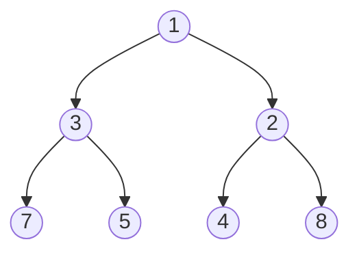

# Binary Heap - Rust Implementation

## Why Binary Heap?

### The Problem It Solves

Imagine you are building a system that processes tasks by priority. New tasks arrive constantly, and you always need to work on the most urgent one first. Using a sorted list would mean spending O(n) time inserting each new task in the right position. Using an unsorted list would mean spending O(n) time finding the minimum every time you need the next task.

A binary heap solves this elegantly: both inserting a new element and removing the minimum take only O(log n) time. When you have millions of tasks, the difference between O(n) and O(log n) is the difference between seconds and microseconds.

### Real-World Analogies

**Hospital Emergency Room**: Patients are not seen in arrival order but by severity. A heap lets you quickly identify the most critical patient (the minimum in our priority system) while efficiently handling new arrivals. When a patient arrives or is treated, the system reorganizes in logarithmic time.

**Task Scheduler**: Operating systems use heaps to decide which process runs next. The process with the highest priority (lowest priority number) gets CPU time. New processes can be added and the next one selected efficiently.

**Merging Sorted Files**: When merging many sorted files into one, you repeatedly need "the smallest element among all current file positions." A heap of file pointers gives you this minimum instantly.

### When to Use It

- **Use a binary heap when you need to**:
  - Repeatedly extract the minimum (or maximum) element
  - Insert elements in arbitrary order and always access the extreme value
  - Implement a priority queue
  - Perform heap sort (sort n elements in O(n log n) with O(1) extra space)
  - Find the k smallest or largest elements in a stream

- **Unlike a sorted array**, a heap gives O(log n) insertion instead of O(n)
- **Unlike an unsorted array**, a heap gives O(log n) minimum extraction instead of O(n)
- **Unlike a balanced BST**, a heap is simpler (array-based) and has better cache locality

---

## Core Concept

### The Big Idea

A binary heap is a **complete binary tree** stored in an **array**, where every parent is smaller than or equal to its children (for a min-heap). "Complete" means the tree is filled level by level from left to right, with no gaps. This completeness property is what allows the elegant array representation: no pointers needed, just index arithmetic.

The **heap property** guarantees that the minimum element is always at the root (index 0). When we insert or remove elements, we restore this property with simple "bubble up" or "sink down" operations that take at most O(log n) steps (the height of the tree).

### Visual Representation

A heap can be viewed as both a tree and an array. Here is how the same heap looks in both forms:

**Tree View:**


**Array View:**
```
Index:  0   1   2   3   4   5   6
Value: [1] [3] [2] [7] [5] [4] [8]
        ^   ^   ^   ^   ^   ^   ^
       root |   |   |   |   |   |
            +---+   |   |   |   |
         children   +---+   |   |
           of 0   children  +---+
                    of 1  children
                           of 2
```

The magic is in the index formulas that connect tree positions to array positions:

```
For element at index i:
  - Parent:      (i - 1) / 2
  - Left child:  2 * i + 1
  - Right child: 2 * i + 2
```

Example: Node with value 3 is at index 1.
- Its parent is at (1-1)/2 = 0, which contains 1. Correct.
- Its left child is at 2*1+1 = 3, which contains 7. Correct.
- Its right child is at 2*1+2 = 4, which contains 5. Correct.

### Key Terminology

- **Heap property**: Every parent is less than or equal to its children (min-heap)
- **Complete binary tree**: All levels are fully filled except possibly the last, which is filled left to right
- **Sift up (bubble up)**: Move a node upward by swapping with its parent until the heap property is restored
- **Sift down (sink down)**: Move a node downward by swapping with its smaller child until the heap property is restored
- **Heapify**: Convert an arbitrary array into a valid heap in O(n) time

---

## How It Works: Step-by-Step

### Operation 1: Push (Insert)

**What it does**: Adds a new element to the heap while maintaining the heap property.

**Step-by-step walkthrough**:

Let us insert the value 2 into an existing heap:

Starting state:
```
Array: [1, 5, 4, 7, 6]

Tree:      1
         /   \
        5     4
       / \
      7   6
```

Step 1: Add the new element at the end of the array (next available position in the complete tree)
```
Array: [1, 5, 4, 7, 6, 2]
                       ^ new element at index 5

Tree:      1
         /   \
        5     4
       / \   /
      7   6 2   <-- new element
```

Step 2: Sift up - Compare 2 with its parent (index (5-1)/2 = 2, value 4). Since 2 < 4, swap them.
```
Array: [1, 5, 2, 7, 6, 4]

Tree:      1
         /   \
        5     2   <-- moved up
       / \   /
      7   6 4
```

Step 3: Continue sifting up - Compare 2 with its new parent (index (2-1)/2 = 0, value 1). Since 2 > 1, stop. Heap property restored.

Final state:
```
Array: [1, 5, 2, 7, 6, 4]

Tree:      1
         /   \
        5     2
       / \   /
      7   6 4
```

**Why this approach?** By always adding at the end and bubbling up, we maintain the complete tree property (no gaps) and restore the heap property with at most O(log n) swaps (height of tree).

### Operation 2: Pop (Extract Minimum)

**What it does**: Removes and returns the smallest element (the root), then restores the heap property.

**Step-by-step walkthrough**:

Starting state:
```
Array: [1, 3, 2, 7, 5, 4, 8]

Tree:      1      <-- this is the minimum we want to extract
         /   \
        3     2
       / \   / \
      7   5 4   8
```

Step 1: Swap the root with the last element
```
Array: [8, 3, 2, 7, 5, 4, 1]
        ^                 ^
     swapped          swapped

Tree:      8      <-- wrong element at root now
         /   \
        3     2
       / \   / \
      7   5 4   1
```

Step 2: Remove the last element (our original minimum)
```
Array: [8, 3, 2, 7, 5, 4]  --> returns 1

Tree:      8      <-- need to fix this
         /   \
        3     2
       / \   /
      7   5 4
```

Step 3: Sift down - Compare 8 with its children (3 and 2). The smaller child is 2. Since 8 > 2, swap them.
```
Array: [2, 3, 8, 7, 5, 4]

Tree:      2
         /   \
        3     8   <-- 8 moved down
       / \   /
      7   5 4
```

Step 4: Continue sifting down - Compare 8 with its children (only 4 exists at index 5). Since 8 > 4, swap them.
```
Array: [2, 3, 4, 7, 5, 8]

Tree:      2
         /   \
        3     4
       / \   /
      7   5 8   <-- 8 in its final position
```

Step 5: 8 has no more children. Heap property restored.

**Why this approach?** We cannot just remove the root and leave a hole. By swapping with the last element, we maintain completeness. The swap-then-pop pattern is O(1) for the removal itself. The sift-down is O(log n). This is much better than shifting all elements.

### Operation 3: Heapify (Build Heap from Array)

**What it does**: Converts an arbitrary array into a valid heap in O(n) time.

**The insight**: Instead of inserting elements one by one (O(n log n)), we can fix the heap property from bottom to top. Leaf nodes are already valid heaps of size 1. We only need to fix nodes that have children.

**Step-by-step walkthrough**:

Starting with unsorted array:
```
Array: [5, 3, 8, 1, 9, 2]

Tree:      5
         /   \
        3     8
       / \   /
      1   9 2
```

Step 1: Find the last non-leaf node. With 6 elements (indices 0-5), the last parent is at (6-2)/2 = 2.

Step 2: Sift down from index 2 (value 8). Children are only 2. Since 8 > 2, swap.
```
Array: [5, 3, 2, 1, 9, 8]

Tree:      5
         /   \
        3     2
       / \   /
      1   9 8
```

Step 3: Sift down from index 1 (value 3). Children are 1 and 9. Smaller is 1. Since 3 > 1, swap.
```
Array: [5, 1, 2, 3, 9, 8]

Tree:      5
         /   \
        1     2
       / \   /
      3   9 8
```

Step 4: Sift down from index 0 (value 5). Children are 1 and 2. Smaller is 1. Since 5 > 1, swap.
```
Array: [1, 5, 2, 3, 9, 8]

Tree:      1
         /   \
        5     2
       / \   /
      3   9 8
```

Step 5: Continue sifting 5 down. Children are 3 and 9. Smaller is 3. Since 5 > 3, swap.
```
Array: [1, 3, 2, 5, 9, 8]

Tree:      1
         /   \
        3     2
       / \   /
      5   9 8
```

Done. Valid min-heap.

**Why O(n) instead of O(n log n)?** Most nodes are near the bottom of the tree. Leaf nodes (about half the nodes) need zero work. Nodes one level up need at most 1 swap. Only the root might need log(n) swaps. The math works out to O(n) total.

### Worked Example: Complete Sequence

Let us trace through a realistic sequence of operations:

```
Operation 1: push(5)
Array: [5]
Tree:  5
Heap is valid (single element).

Operation 2: push(3)
Array: [3, 5]  (3 sifted up past 5)
Tree:    3
        /
       5
Minimum is 3.

Operation 3: push(8)
Array: [3, 5, 8]  (8 is larger than parent 3, stays put)
Tree:    3
        / \
       5   8

Operation 4: push(1)
Array: [3, 5, 8, 1]  -> sift up
       [3, 1, 8, 5]  -> sift up
       [1, 3, 8, 5]  done
Tree:    1
        / \
       3   8
      /
     5
Minimum is now 1.

Operation 5: pop() -> returns 1
Swap first and last: [5, 3, 8, 1]
Remove last:         [5, 3, 8]  -> returned 1
Sift down 5: children are 3 and 8, smaller is 3
Swap:                [3, 5, 8]
Tree:    3
        / \
       5   8
Returned 1, new minimum is 3.

Operation 6: push(2)
Array: [3, 5, 8, 2]  -> sift up
       [3, 2, 8, 5]  -> sift up
       [2, 3, 8, 5]  done
Tree:    2
        / \
       3   8
      /
     5
Minimum is now 2.

Operation 7: pop() -> returns 2
Swap: [5, 3, 8, 2]
Remove: [5, 3, 8]
Sift down: 5 > 3, swap -> [3, 5, 8]
Tree:    3
        / \
       5   8
Returned 2.

Operation 8: peek() -> returns &3
No modification. Minimum is 3.
```

---

## From Concept to Code

### The Data Structure

Before showing code, let us understand what we need to track:

1. **The elements**: We need storage for the heap elements themselves
2. **That is it**: Because we use an array, the structure (parent-child relationships) is implicit in the indices. No explicit pointers or metadata needed.

This is the beauty of the array-based heap. The complete tree property means position in the array encodes position in the tree.

### Rust Implementation

```rust
#[derive(Debug)]
pub struct BinaryHeap<T> {
    data: Vec<T>,
}
```

**Line-by-line breakdown**:

- `#[derive(Debug)]`: Automatically implements the `Debug` trait, allowing `println!("{:?}", heap)` to work. Useful for debugging.

- `pub struct BinaryHeap<T>`: We define a generic struct. The `<T>` means this heap can hold any type. The `pub` makes it accessible outside the module.

- `data: Vec<T>`: A vector holds our elements. `Vec` handles memory allocation, growth, and cleanup automatically. We do not need to manually allocate or free memory.

**Why `Vec<T>` and not a raw array?**

In Rust, arrays have fixed size at compile time (`[T; N]`). We need dynamic size. `Vec<T>` is Rust's growable array that:
- Automatically allocates heap memory
- Grows when capacity is exceeded (typically doubling)
- Deallocates memory when dropped
- Provides bounds-checked indexing

### The Ord Trait Bound

```rust
impl<T: Ord> BinaryHeap<T> {
```

This line says: "These methods only exist when `T` implements `Ord`."

**What is `Ord`?** The `Ord` trait represents types with a total ordering. Unlike `PartialOrd`, it guarantees:
1. Every two values can be compared (no NaN-like values)
2. Comparison is transitive: if a < b and b < c, then a < c
3. Comparison is antisymmetric: if a < b, then b > a
4. Comparison is reflexive: a == a

**Why require `Ord` instead of `PartialOrd`?**

Floating point numbers (`f32`, `f64`) implement `PartialOrd` but not `Ord` because of `NaN` (Not a Number). `NaN` compared to anything is false, breaking total ordering. Heaps need total ordering to function correctly. If we allowed `PartialOrd`, comparing with `NaN` could cause undefined behavior in our heap.

If you need a heap of floats, wrap them in a type that implements `Ord`:
```rust
use std::cmp::Ordering;

#[derive(PartialEq, PartialOrd)]
struct OrderedFloat(f64);

impl Eq for OrderedFloat {}

impl Ord for OrderedFloat {
    fn cmp(&self, other: &Self) -> Ordering {
        self.partial_cmp(other).unwrap_or(Ordering::Equal)
    }
}
```

### Implementing Push

**The algorithm in plain English**:
1. Add the new element at the end of the vector
2. Sift it up: while it is smaller than its parent, swap them

**The code**:

```rust
pub fn push(&mut self, value: T) {
    self.data.push(value);
    self.sift_up(self.data.len() - 1);
}

fn sift_up(&mut self, mut idx: usize) {
    while idx > 0 {
        let parent = (idx - 1) / 2;
        if self.data[idx] < self.data[parent] {
            self.data.swap(idx, parent);
            idx = parent;
        } else {
            break;
        }
    }
}
```

**Understanding the tricky parts**:

- `&mut self`: We need mutable access because we are modifying the heap. This is Rust's way of saying "this method changes the struct."

- `self.data.push(value)`: The `value` is moved into the vector. After this line, the caller no longer owns `value`. This is Rust's ownership in action.

- `mut idx: usize`: The `mut` makes `idx` mutable so we can update it in the loop. `usize` is the type for array indices in Rust (unsigned, pointer-sized).

- `self.data[idx] < self.data[parent]`: This comparison uses the `<` operator, which is provided by the `Ord` trait. Rust calls `self.data[idx].cmp(&self.data[parent])` under the hood.

- `self.data.swap(idx, parent)`: `Vec::swap` exchanges two elements in place. This is safe even though we are borrowing two elements from the same vector because `swap` is implemented carefully to avoid aliasing issues.

**Why does `swap` work?** You might wonder how we can swap two elements when Rust normally forbids multiple mutable borrows. `Vec::swap` is a method that takes `&mut self` and two indices. Internally, it uses unsafe code that Rust's standard library has verified to be safe. We get a safe, convenient API.

### Implementing Pop

**The algorithm in plain English**:
1. If empty, return `None`
2. Swap the first (minimum) and last elements
3. Remove the last element (our minimum)
4. Sift down the new root to restore heap property
5. Return the removed minimum

**The code**:

```rust
pub fn pop(&mut self) -> Option<T> {
    if self.data.is_empty() {
        return None;
    }
    let last_idx = self.data.len() - 1;
    self.data.swap(0, last_idx);
    let min = self.data.pop();
    if !self.data.is_empty() {
        self.sift_down(0);
    }
    min
}

fn sift_down(&mut self, mut idx: usize) {
    loop {
        let left = 2 * idx + 1;
        let right = 2 * idx + 2;
        let mut smallest = idx;

        if left < self.data.len() && self.data[left] < self.data[smallest] {
            smallest = left;
        }
        if right < self.data.len() && self.data[right] < self.data[smallest] {
            smallest = right;
        }

        if smallest != idx {
            self.data.swap(idx, smallest);
            idx = smallest;
        } else {
            break;
        }
    }
}
```

**Understanding the tricky parts**:

- `Option<T>`: Rust has no null. Instead, `Option<T>` explicitly represents "might not exist." `Some(value)` means we have a value; `None` means we do not. This forces callers to handle the empty case.

- `self.data.pop()`: Returns `Option<T>`. After the swap, the minimum is at the last position. `pop()` removes and returns it, giving us `Some(minimum)`.

- `let min = self.data.pop()`: The removed element is moved out of the vector and into `min`. The vector no longer owns it.

- `left < self.data.len()`: Bounds checking. A node might not have children (it is a leaf) or might have only a left child.

- The three-way minimum finding: We start assuming the current node is smallest, then check if either child is smaller. This handles all cases: no children, only left child, or both children.

### Implementing Heapify (from_vec)

**The algorithm in plain English**:
1. Take ownership of the vector
2. Find the last node that has children
3. For each node from there to the root, sift down
4. Return the heap

**The code**:

```rust
pub fn from_vec(vec: Vec<T>) -> Self {
    let mut heap = BinaryHeap { data: vec };
    heap.heapify();
    heap
}

fn heapify(&mut self) {
    if self.data.len() <= 1 {
        return;
    }
    let last_parent = (self.data.len() - 2) / 2;
    for i in (0..=last_parent).rev() {
        self.sift_down(i);
    }
}
```

**Understanding the tricky parts**:

- `from_vec(vec: Vec<T>) -> Self`: Takes ownership of `vec`. The vector is not copied; ownership is transferred. After calling `from_vec(my_vec)`, you cannot use `my_vec` anymore.

- `(self.data.len() - 2) / 2`: Finds the parent of the last element. If there are `n` elements, the last has index `n-1`, and its parent is at `(n-1-1)/2 = (n-2)/2`.

- `(0..=last_parent).rev()`: Creates a range from 0 to last_parent inclusive, then reverses it. We process nodes from bottom to top. The `..=` is Rust's inclusive range syntax.

- **Why bottom to top?** When we sift down a node, we assume its subtrees are already valid heaps. By starting from the bottom, we ensure this invariant.

### Implementing Traits

The implementation includes several trait implementations that make `BinaryHeap` feel like a native Rust type:

```rust
impl<T: Ord> Default for BinaryHeap<T> {
    fn default() -> Self {
        Self::new()
    }
}
```

**Default**: Allows `BinaryHeap::default()` which creates an empty heap. Useful in contexts that expect a `Default` type.

```rust
impl<T: Ord + Clone> Clone for BinaryHeap<T> {
    fn clone(&self) -> Self {
        BinaryHeap {
            data: self.data.clone(),
        }
    }
}
```

**Clone**: Creates an independent copy. Note the `T: Ord + Clone` bound. We only require `Clone` for this impl, not for the struct itself. Non-cloneable types can still use heaps; they just cannot clone the heap.

```rust
impl<T: Ord> FromIterator<T> for BinaryHeap<T> {
    fn from_iter<I: IntoIterator<Item = T>>(iter: I) -> Self {
        let vec: Vec<T> = iter.into_iter().collect();
        BinaryHeap::from_vec(vec)
    }
}
```

**FromIterator**: Enables `some_iter.collect::<BinaryHeap<_>>()`. Collects into a vector first, then heapifies. This is O(n) total because heapify is O(n).

```rust
impl<T: Ord> Extend<T> for BinaryHeap<T> {
    fn extend<I: IntoIterator<Item = T>>(&mut self, iter: I) {
        for item in iter {
            self.push(item);
        }
    }
}
```

**Extend**: Allows `heap.extend(some_iter)`. Each element is pushed individually. Unlike `FromIterator`, this is O(k log n) for k new elements because each push is O(log n).

---

## Complexity Analysis

### Time Complexity

| Operation | Best | Average | Worst | Why |
|-----------|------|---------|-------|-----|
| push | O(1) | O(log n) | O(log n)* | Best: element is larger than parent (no sifting). Worst: sift up entire height. *Plus O(n) if Vec needs to grow. |
| pop | O(1) | O(log n) | O(log n) | Best: single element heap. Worst: sift down entire height. |
| peek | O(1) | O(1) | O(1) | Direct array access at index 0. |
| from_vec | O(n) | O(n) | O(n) | Floyd's heapify. Most nodes are near bottom and need few swaps. |
| size/is_empty | O(1) | O(1) | O(1) | Vec stores its length. |

**Understanding the "Why" column**:

- **Push worst case**: A new minimum must sift up from the bottom to the root. The height of a complete binary tree with n nodes is floor(log2(n)), so at most O(log n) swaps. If the vector is full, it needs to reallocate and copy all elements (O(n)), but this happens rarely enough that the amortized cost is O(1).

- **Pop worst case**: After swapping the last element to the root, it might need to sink all the way down. Again, O(log n) swaps for height.

- **Heapify O(n)**: This is subtle. Naive analysis says O(n log n) because we do O(n) sift-downs, each O(log n). But most nodes are near the bottom! Half the nodes are leaves (0 swaps), a quarter are one level up (at most 1 swap), etc. The sum is O(n).

### Space Complexity

- **Overall structure**: O(n) where n is the number of elements. Just the vector storage.
- **Per operation**: O(1). All operations work in place with only a few temporary variables.
- **from_vec**: O(1) additional. Takes ownership, does not copy.
- **clone**: O(n). Creates a new vector with copies of all elements.

### Amortized Analysis for Push

"Amortized" means averaged over many operations. A single push might take O(n) time if the vector needs to resize, but this is rare.

When `Vec` is full:
1. Allocate new memory (typically 2x the current capacity)
2. Copy all elements to new memory
3. Deallocate old memory

If we start with capacity 1 and push n elements:
- Resize at 1, 2, 4, 8, 16, ... elements
- Total copy operations: 1 + 2 + 4 + 8 + ... + n/2 = n - 1

So n pushes cause at most n-1 extra copy operations. Average cost per push: less than 2 operations. This is O(1) amortized.

The sift-up is still O(log n), so total amortized cost for push is O(log n).

---

## Common Mistakes and Pitfalls

### Mistake 1: Forgetting the Ord Bound

```rust
// Wrong: Compiler error because no ordering guarantee
pub struct BadHeap<T> {
    data: Vec<T>,
}

impl<T> BadHeap<T> {
    fn push(&mut self, value: T) {
        self.data.push(value);
        // ERROR: cannot compare T values without Ord
        if self.data[idx] < self.data[parent] { ... }
    }
}

// Right: Require Ord on the impl block
impl<T: Ord> BinaryHeap<T> {
    fn push(&mut self, value: T) {
        // Now comparison works
    }
}
```

**Why this matters**: Rust's type system catches this at compile time. You cannot accidentally create a heap of things that cannot be compared. This prevents runtime errors that could occur in languages with duck typing.

### Mistake 2: Off-by-One in Index Formulas

```rust
// Wrong: Using 1-based formulas with 0-based array
fn parent(idx: usize) -> usize {
    idx / 2  // Wrong! For idx=1, gives 0 (correct). For idx=2, gives 1 (wrong, should be 0)
}

fn left_child(idx: usize) -> usize {
    2 * idx  // Wrong! For idx=0, gives 0 (should be 1)
}

// Right: Formulas for 0-based indexing
fn parent(idx: usize) -> usize {
    (idx - 1) / 2
}

fn left_child(idx: usize) -> usize {
    2 * idx + 1
}

fn right_child(idx: usize) -> usize {
    2 * idx + 2
}
```

**Why this matters**: Many textbooks use 1-based indexing (starting array at index 1) which gives cleaner formulas: parent = i/2, left = 2i, right = 2i+1. But Rust arrays are 0-based. Using 1-based formulas with 0-based arrays corrupts the heap structure silently.

### Mistake 3: Not Checking Bounds in Sift-Down

```rust
// Wrong: Assumes children exist
fn sift_down_bad(&mut self, mut idx: usize) {
    loop {
        let left = 2 * idx + 1;
        let right = 2 * idx + 2;
        // PANIC: index out of bounds if left >= len
        if self.data[left] < self.data[idx] {
            // ...
        }
    }
}

// Right: Check bounds before accessing
fn sift_down(&mut self, mut idx: usize) {
    loop {
        let left = 2 * idx + 1;
        let right = 2 * idx + 2;
        let mut smallest = idx;

        // Only access left if it exists
        if left < self.data.len() && self.data[left] < self.data[smallest] {
            smallest = left;
        }
        // Only access right if it exists
        if right < self.data.len() && self.data[right] < self.data[smallest] {
            smallest = right;
        }
        // ...
    }
}
```

**Why this matters**: Leaf nodes have no children. Nodes at the second-to-last level might have only a left child. Always check bounds before array access. Rust will panic on out-of-bounds access, which is safer than silent memory corruption but still crashes your program.

### Mistake 4: Returning Reference Instead of Value from Pop

```rust
// Wrong: Tries to return reference to removed element
pub fn pop_bad(&mut self) -> Option<&T> {
    // ...
    let min = &self.data[self.data.len() - 1];  // reference
    self.data.pop();  // removes the element
    Some(min)  // ERROR: min references deleted data
}

// Right: Return owned value
pub fn pop(&mut self) -> Option<T> {
    // ...
    let min = self.data.pop();  // pop() returns Option<T>, taking ownership
    // ...
    min  // Return the owned value
}
```

**Why this matters**: When we pop, we remove the element from the vector. If we returned a reference to it, that reference would dangle (point to freed memory). Rust's borrow checker prevents this at compile time. We must return the owned value, transferring ownership to the caller.

### Mistake 5: Using PartialOrd for Floats

```rust
// Wrong: f64 does not implement Ord due to NaN
let mut heap: BinaryHeap<f64> = BinaryHeap::new();  // Compiler error

// Right: Wrap floats in a type that implements Ord
use std::cmp::Ordering;

#[derive(PartialEq)]
struct OrdF64(f64);

impl Eq for OrdF64 {}

impl PartialOrd for OrdF64 {
    fn partial_cmp(&self, other: &Self) -> Option<Ordering> {
        Some(self.cmp(other))
    }
}

impl Ord for OrdF64 {
    fn cmp(&self, other: &Self) -> Ordering {
        self.0.partial_cmp(&other.0).unwrap_or(Ordering::Equal)
    }
}

let mut heap: BinaryHeap<OrdF64> = BinaryHeap::new();
heap.push(OrdF64(3.14));
```

**Why this matters**: NaN (Not a Number) breaks total ordering because NaN compared to anything is false. A heap with NaN values could end up in an inconsistent state. Rust forces you to decide how to handle NaN before you can use floats in ordered collections.

---

## Practice Problems

To solidify your understanding, try implementing:

1. **Max-Heap**: Modify the comparison in sift_up and sift_down to create a max-heap instead of min-heap. Alternatively, implement a generic heap that takes a comparator.

2. **Heap Sort**: Use a heap to sort a vector in place. Build a max-heap, then repeatedly swap the root with the last element and shrink the heap portion.

3. **K Smallest Elements**: Given a stream of numbers, maintain the k smallest elements seen so far. (Hint: use a max-heap of size k)

4. **Merge K Sorted Lists**: Given k sorted vectors, merge them into one sorted vector. (Hint: use a min-heap of (value, list_index, element_index))

5. **Decrease Key**: Add a method that decreases the value of an element at a given index and restores heap property. This is used in Dijkstra's algorithm.

---

## Summary

### Key Takeaways

- A binary heap is a complete binary tree stored as an array, with parent-child relationships encoded in index arithmetic
- The heap property (parent <= children for min-heap) ensures the minimum is always at the root
- Push adds at the end and sifts up; Pop swaps root with last, removes last, and sifts down
- Heapify builds a heap in O(n) by sifting down from the last parent to the root
- Rust's `Ord` trait bound ensures type safety - you cannot create a heap of incomparable types
- `Vec<T>` handles all memory management, making the implementation straightforward and safe

### Quick Reference

```
BinaryHeap<T> - Array-backed min-heap for types with total ordering

Operations:
  push(value)     O(log n) - Add element, sift up to restore heap property
  pop()           O(log n) - Remove minimum, sift down to restore heap property
  peek()          O(1)     - View minimum without removing
  from_vec(vec)   O(n)     - Build heap from vector (Floyd's algorithm)
  size()          O(1)     - Number of elements
  is_empty()      O(1)     - Check if empty
  clear()         O(n)     - Remove all elements

Index Formulas (0-based):
  Parent:      (i - 1) / 2
  Left child:  2 * i + 1
  Right child: 2 * i + 2

Best for:
  - Priority queues
  - Repeatedly finding minimum/maximum
  - Heap sort
  - K smallest/largest problems
  - Dijkstra's algorithm, Prim's algorithm

Avoid when:
  - You need to search for arbitrary elements (O(n) in a heap)
  - You need ordered traversal (use a BST instead)
  - You need to update priorities of arbitrary elements frequently (use an indexed heap)

Rust-specific notes:
  - Requires T: Ord (total ordering)
  - Returns Option<T> for empty-safe operations
  - Standard library BinaryHeap is a max-heap; this is a min-heap
  - Use wrapper types for floats (f32/f64 do not implement Ord)
```
