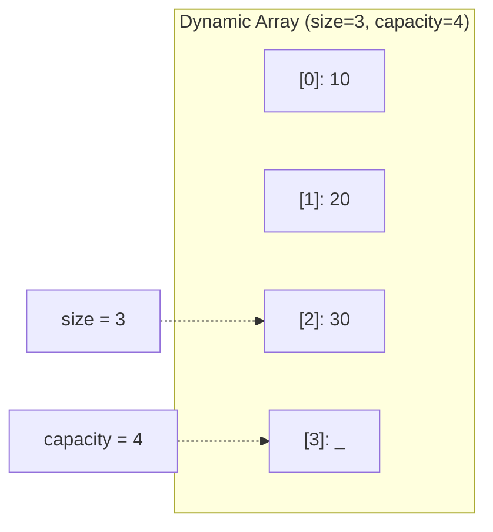

# Dynamic Array — C++ Implementation

## Why Dynamic Array?

### The Problem It Solves

Imagine you're building a program to collect user inputs. You don't know in advance how many items the user will enter—it could be 5, 50, or 5000. You have two bad options with plain C++ arrays:

1. **Fixed-size array**: Declare `int items[1000]` and hope it's enough. Wasteful if the user enters 3 items; catastrophic if they enter 1001.

2. **Linked list**: Each element points to the next. No size limit, but terrible cache performance and extra memory overhead for all those pointers.

A **dynamic array** solves this: it starts small, and when it fills up, it automatically allocates a bigger buffer, copies the elements over, and keeps going. You get the cache-friendly contiguous memory of arrays with the flexibility of unbounded growth.

### Real-World Analogies

**A notebook with removable pages**: You start writing, and when you fill a page, you don't throw away the notebook—you add more pages. But unlike a real notebook, a dynamic array occasionally needs to copy everything to a bigger notebook when it runs out of room.

**A parking lot with expansion**: Imagine a 10-car lot. When it fills, you don't turn cars away—you acquire adjacent land, repaint the lines for 20 spaces, and re-park all the cars. Expensive when it happens, but rare enough to be worthwhile.

**A restaurant waitlist**: The host's notepad starts small. If the wait gets long, they grab a bigger pad and copy the names over. Most of the time, they just add a name to the end (fast). Occasionally, they need to copy everything (slow, but infrequent).

### When to Use It

- **Use a dynamic array when you need**:
  - Fast random access by index (O(1) lookup)
  - Frequent additions to the end
  - Iteration in order (cache-friendly)
  - Unknown final size at compile time

- **Unlike a fixed array**: Dynamic array grows automatically—no buffer overflows
- **Unlike a linked list**: Elements are contiguous in memory—better cache performance, simpler iteration
- **Unlike a deque**: Simpler implementation, guaranteed contiguous storage (important for C interop)

---

## Core Concept

### The Big Idea

A dynamic array maintains a contiguous block of memory that's often **larger than needed**. It tracks two numbers: the **size** (how many elements are actually stored) and the **capacity** (how many could fit before reallocation). When you add an element and size equals capacity, it allocates a new, larger buffer (typically double the size), copies everything over, and frees the old buffer.

The insight is that **doubling** makes the average cost of insertion O(1). Yes, the occasional copy is O(n), but it happens so infrequently that the cost "amortizes" over all the cheap O(1) insertions.

### Visual Representation



The first three slots hold actual elements. The fourth slot is allocated but unused—ready for the next `push_back` without reallocation.

### Key Terminology

- **Size**: The number of elements currently stored. This is what `size()` returns.
- **Capacity**: The number of elements the current buffer can hold before needing to grow. Always >= size.
- **Reallocation**: Allocating a new, larger buffer and copying elements from the old one. This is the expensive operation we try to minimize.
- **Amortized O(1)**: An operation that's usually O(1) but occasionally O(n). When you average the cost over many operations, it works out to O(1) per operation.
- **Contiguous memory**: Elements stored one after another with no gaps. This is what makes array indexing O(1) and cache access fast.

---

## How It Works: Step-by-Step

### Operation 1: push_back (Append)

**What it does**: Adds an element to the end of the array, growing the capacity if necessary.

**Step-by-step walkthrough**:

Starting state (size=2, capacity=2, array is full):
```
┌─────┬─────┐
│  5  │  3  │
└─────┴─────┘
  [0]   [1]
size=2, capacity=2
```

Step 1: Call `push_back(8)`. Check if size == capacity. It is! Need to grow.

Step 2: Allocate new buffer with capacity = 2 * 2 = 4:
```
Old buffer:            New buffer:
┌─────┬─────┐          ┌─────┬─────┬─────┬─────┐
│  5  │  3  │          │     │     │     │     │
└─────┴─────┘          └─────┴─────┴─────┴─────┘
```

Step 3: Move elements from old buffer to new buffer:
```
Old buffer:            New buffer:
┌─────┬─────┐          ┌─────┬─────┬─────┬─────┐
│  -  │  -  │  ───►    │  5  │  3  │     │     │
└─────┴─────┘          └─────┴─────┴─────┴─────┘
```

Step 4: Delete old buffer, update data pointer:
```
┌─────┬─────┬─────┬─────┐
│  5  │  3  │     │     │
└─────┴─────┴─────┴─────┘
size=2, capacity=4
```

Step 5: Insert new element at position `size`, then increment size:
```
┌─────┬─────┬─────┬─────┐
│  5  │  3  │  8  │     │
└─────┴─────┴─────┴─────┘
  [0]   [1]   [2]   [3]
size=3, capacity=4
```

**Why this approach?** By doubling the capacity, we ensure that reallocations become exponentially rarer. After growing to capacity 4, we can add 2 more elements for free. After growing to 8, we can add 4 more. The copying cost is "paid back" by all the cheap insertions that follow.

### Operation 2: pop_back (Remove from End)

**What it does**: Removes the last element from the array.

**Step-by-step walkthrough**:

Starting state (size=3, capacity=4):
```
┌─────┬─────┬─────┬─────┐
│  5  │  3  │  8  │     │
└─────┴─────┴─────┴─────┘
  [0]   [1]   [2]   [3]
size=3, capacity=4
```

Step 1: Check if size > 0. It is, so proceed.

Step 2: Decrement size, reset the old element to default value:
```
┌─────┬─────┬─────┬─────┐
│  5  │  3  │  _  │     │
└─────┴─────┴─────┴─────┘
  [0]   [1]   [2]   [3]
size=2, capacity=4
```

**Why this approach?** We don't shrink the capacity or move any elements. The element at [2] is overwritten with a default value, and size is decremented. This makes pop_back O(1) always—no reallocation ever happens on removal.

### Operation 3: reserve (Pre-allocate Capacity)

**What it does**: Ensures the array has at least the specified capacity without changing size.

**Step-by-step walkthrough**:

Starting state (size=2, capacity=2):
```
┌─────┬─────┐
│  5  │  3  │
└─────┴─────┘
size=2, capacity=2
```

Call `reserve(6)`:

Step 1: Check if new_cap > capacity. 6 > 2, so proceed.

Step 2: Allocate new buffer with capacity 6, move elements, delete old:
```
┌─────┬─────┬─────┬─────┬─────┬─────┐
│  5  │  3  │     │     │     │     │
└─────┴─────┴─────┴─────┴─────┴─────┘
size=2, capacity=6
```

**Why this approach?** If you know you'll add many elements, calling `reserve` once avoids multiple reallocations. This is a key optimization technique when the final size is predictable.

### Worked Example: Complete Sequence

Let's trace through a realistic sequence of operations:

```
Initial state: empty array
size=0, capacity=0
┌───────────────────────┐
│ (no buffer allocated) │
└───────────────────────┘
```

```
Operation 1: push_back(10)
Need to grow: capacity 0 → 1
size=1, capacity=1
┌─────┐
│ 10  │
└─────┘
```

```
Operation 2: push_back(20)
Need to grow: capacity 1 → 2
size=2, capacity=2
┌─────┬─────┐
│ 10  │ 20  │
└─────┴─────┘
```

```
Operation 3: push_back(30)
Need to grow: capacity 2 → 4
size=3, capacity=4
┌─────┬─────┬─────┬─────┐
│ 10  │ 20  │ 30  │     │
└─────┴─────┴─────┴─────┘
```

```
Operation 4: push_back(40)
No growth needed (size 3 < capacity 4)
size=4, capacity=4
┌─────┬─────┬─────┬─────┐
│ 10  │ 20  │ 30  │ 40  │
└─────┴─────┴─────┴─────┘
```

```
Operation 5: pop_back()
size=3, capacity=4
┌─────┬─────┬─────┬─────┐
│ 10  │ 20  │ 30  │  _  │
└─────┴─────┴─────┴─────┘
```

```
Operation 6: at(1) → returns 20
Direct memory access: data_[1]
No state change.
```

```
Operation 7: push_back(50)
No growth needed (size 3 < capacity 4)
size=4, capacity=4
┌─────┬─────┬─────┬─────┐
│ 10  │ 20  │ 30  │ 50  │
└─────┴─────┴─────┴─────┘
```

```
Operation 8: clear()
size=0, capacity=4
┌─────┬─────┬─────┬─────┐
│  _  │  _  │  _  │  _  │
└─────┴─────┴─────┴─────┘
Note: Capacity unchanged! Buffer still allocated.
```

Notice how we only reallocated 3 times (0→1, 1→2, 2→4) for 5 push_back operations. As the array grows larger, reallocations become increasingly rare.

---

## From Concept to Code

### The Data Structure

Before looking at code, let's identify what we need to track:

1. **A pointer to the buffer** (`T* data_`): Where our elements live in memory
2. **The current size** (`size_type size_`): How many elements we're actually using
3. **The current capacity** (`size_type capacity_`): How many elements could fit before we need to grow

We also want STL-compatible type aliases so our array works with standard algorithms:
- `value_type` = the element type
- `size_type` = the type for sizes and indices (typically `std::size_t`)
- `iterator` / `const_iterator` = pointer types for iteration

### C++ Implementation

```cpp
template <typename T>
class DynamicArray {
public:
    using value_type = T;
    using size_type = std::size_t;
    using iterator = T*;
    using const_iterator = const T*;

private:
    T* data_;
    size_type size_;
    size_type capacity_;
};
```

**Line-by-line breakdown**:
- `template <typename T>`: This is a class template. `T` is a placeholder for any type—`int`, `std::string`, your own class. When you write `DynamicArray<int>`, the compiler generates a specialized version with `T` replaced by `int`.
- `using value_type = T`: A type alias. STL algorithms expect containers to have this typedef.
- `using size_type = std::size_t`: An unsigned integer type guaranteed to be big enough for any array index. On 64-bit systems, it's typically 8 bytes.
- `using iterator = T*`: Our iterator is just a raw pointer. This works because our elements are contiguous in memory—incrementing a pointer moves to the next element.
- `T* data_`: A pointer to the first element of our heap-allocated buffer. `nullptr` when empty.
- `size_type size_`: Count of elements currently stored.
- `size_type capacity_`: Total slots in the buffer.

### The Rule of Five

When a class manages a resource (like heap memory), C++ requires you to define 5 special functions. If you forget one, you risk memory leaks, double-frees, or dangling pointers.

```cpp
// 1. Destructor - clean up when object dies
~DynamicArray() { delete[] data_; }

// 2. Copy constructor - create a new object as a copy of another
DynamicArray(const DynamicArray& other)
    : data_(other.capacity_ > 0 ? new T[other.capacity_] : nullptr),
      size_(other.size_),
      capacity_(other.capacity_) {
    for (size_type i = 0; i < size_; ++i)
        data_[i] = other.data_[i];
}

// 3. Move constructor - efficiently "steal" resources from a temporary
DynamicArray(DynamicArray&& other) noexcept
    : data_(other.data_), size_(other.size_), capacity_(other.capacity_) {
    other.data_ = nullptr;
    other.size_ = 0;
    other.capacity_ = 0;
}

// 4. Copy assignment - copy into an existing object
DynamicArray& operator=(const DynamicArray& other) {
    if (this != &other) {
        delete[] data_;
        capacity_ = other.capacity_;
        size_ = other.size_;
        data_ = capacity_ > 0 ? new T[capacity_] : nullptr;
        for (size_type i = 0; i < size_; ++i)
            data_[i] = other.data_[i];
    }
    return *this;
}

// 5. Move assignment - efficiently take over from a temporary
DynamicArray& operator=(DynamicArray&& other) noexcept {
    if (this != &other) {
        delete[] data_;
        data_ = other.data_;
        size_ = other.size_;
        capacity_ = other.capacity_;
        other.data_ = nullptr;
        other.size_ = 0;
        other.capacity_ = 0;
    }
    return *this;
}
```

**Understanding the tricky parts**:

- **`const DynamicArray& other`**: The `const` means we won't modify `other`. The `&` means we're receiving a reference (no copy). Together: "a read-only reference to another array."

- **`DynamicArray&& other`**: The `&&` is an *rvalue reference*—it binds to temporaries (like function return values) or objects marked with `std::move`. This signals: "this object is about to be discarded, so feel free to cannibalize its resources."

- **`noexcept`**: A promise that this function won't throw exceptions. This enables important optimizations—for example, `std::vector` will only use move operations during reallocation if they're noexcept; otherwise, it plays safe with copies.

- **`delete[] data_`**: The `[]` is crucial! We allocated with `new T[n]`, so we must deallocate with `delete[]`. Using plain `delete` would only destroy the first element and corrupt memory.

- **`if (this != &other)`**: The self-assignment check. Without it, `arr = arr` would delete our own data before copying from... our now-deleted data. Rare, but catastrophic.

- **Setting `other.data_ = nullptr` after move**: The moved-from object must be left in a valid state. When its destructor runs, it will call `delete[] nullptr`, which is safe (does nothing). Without this, we'd double-free the memory.

### Implementing push_back

**The algorithm in plain English**:
1. If size equals capacity, we're full—double the capacity (or set to 1 if currently 0)
2. Copy (or move) the new element into position `size_`
3. Increment size

**The code**:
```cpp
void push_back(const T& value) {
    if (size_ == capacity_)
        reserve(capacity_ == 0 ? 1 : capacity_ * 2);
    data_[size_++] = value;
}

void push_back(T&& value) {
    if (size_ == capacity_)
        reserve(capacity_ == 0 ? 1 : capacity_ * 2);
    data_[size_++] = std::move(value);
}
```

**Understanding the tricky parts**:

- **Two overloads**: The first takes `const T&` (lvalue reference)—for when you're inserting a named variable that you want to keep. The second takes `T&&` (rvalue reference)—for temporaries or moved objects that can be cannibalized.

- **`capacity_ == 0 ? 1 : capacity_ * 2`**: Ternary operator handling the edge case. If capacity is 0, we can't double it (0 * 2 = 0), so we start with 1.

- **`data_[size_++]`**: This is post-increment. It accesses `data_[size_]`, then increments `size_`. One line does both the insertion and the bookkeeping.

- **`std::move(value)`**: Casts `value` to an rvalue reference, enabling the move assignment operator of type `T` to steal its resources. After this, `value` is in a "moved-from" state (valid but unspecified).

### Implementing reserve

**The algorithm in plain English**:
1. If new capacity is not larger than current, do nothing (never shrink)
2. Allocate a new buffer of the requested size
3. Move each element from old buffer to new buffer
4. Delete the old buffer
5. Update the data pointer and capacity

**The code**:
```cpp
void reserve(size_type new_cap) {
    if (new_cap <= capacity_)
        return;
    T* new_data = new T[new_cap];
    for (size_type i = 0; i < size_; ++i)
        new_data[i] = std::move(data_[i]);
    delete[] data_;
    data_ = new_data;
    capacity_ = new_cap;
}
```

**Understanding the tricky parts**:

- **`new T[new_cap]`**: Allocates an array of `new_cap` default-constructed T objects on the heap. Returns a pointer to the first element. If allocation fails, throws `std::bad_alloc`.

- **`std::move(data_[i])`**: We move rather than copy when relocating elements. For types like `std::string`, this is the difference between O(1) pointer transfer and O(n) character copying. For simple types like `int`, move and copy are identical.

- **Order matters**: We must copy elements *before* deleting the old buffer. Delete first = reading from freed memory = undefined behavior.

### Implementing Element Access

```cpp
T& at(size_type index) {
    if (index >= size_)
        throw std::out_of_range("DynamicArray::at: index out of range");
    return data_[index];
}

const T& at(size_type index) const {
    if (index >= size_)
        throw std::out_of_range("DynamicArray::at: index out of range");
    return data_[index];
}

T& operator[](size_type index) { return data_[index]; }
const T& operator[](size_type index) const { return data_[index]; }
```

**Understanding the tricky parts**:

- **Two versions of each**: The `const` version can be called on const arrays and returns a const reference (can't modify the element). The non-const version can modify.

- **`at` vs `operator[]`**: `at` does bounds checking and throws on invalid index. `operator[]` does no checking—faster, but undefined behavior on bad index. This mirrors `std::vector` semantics.

- **Returning `T&`**: Returns a *reference* to the element, not a copy. This allows `arr[0] = 5` to actually modify the array, and avoids copying large objects.

---

## Complexity Analysis

### Time Complexity

| Operation | Best | Average | Worst | Why |
|-----------|------|---------|-------|-----|
| push_back | O(1) | O(1) | O(n) | Usually just assigns and increments. Worst case triggers reallocation: allocate + copy n elements. |
| pop_back | O(1) | O(1) | O(1) | Just decrement size and reset one element. No reallocation ever. |
| at / operator[] | O(1) | O(1) | O(1) | Direct pointer arithmetic: `data_ + index`. Memory is contiguous. |
| front / back | O(1) | O(1) | O(1) | Just `data_[0]` or `data_[size_-1]`. |
| reserve | O(n) | O(n) | O(n) | Must copy/move all n elements to new buffer. |
| clear | O(n) | O(n) | O(n) | Resets each element to default value. |
| size / capacity / empty | O(1) | O(1) | O(1) | Just return a stored value or comparison. |

**Understanding the "Why" column**:

- **push_back amortized O(1)**: The worst case O(n) seems bad, but consider: to trigger a reallocation at size n, you must have done n/2 cheap insertions since the last reallocation. The O(n) cost is "spread" across those n/2 operations, averaging to O(1) per operation.

- **clear is O(n)**: This implementation resets each element to `T()`. For types with non-trivial destructors or resource cleanup, this matters. Some implementations just set `size_ = 0` for O(1).

### Space Complexity

- **Overall structure**: O(n) where n is capacity, not size. The allocated buffer might be up to 2x the number of elements due to the doubling strategy.

- **Per operation**:
  - Most operations: O(1) additional space
  - reserve/push_back (during growth): O(n) temporary space for the new buffer while copying

### Amortized Analysis: Why Doubling Works

**What "amortized" means**: Instead of looking at the worst case of each operation individually, we look at the total cost of a sequence of operations divided by the number of operations.

**The accounting argument**:

Imagine each `push_back` costs 1 "dollar" for the basic insertion. But we also "save" 2 extra dollars for future copying.

When we grow from capacity n to 2n:
- We need to copy n elements (costs n dollars)
- But we saved 2 dollars on each of the n/2 insertions since the last growth
- Total saved: n dollars, exactly enough to pay for the copy!

Therefore, if we charge 3 dollars per push_back (1 for insertion, 2 for future copies), we always have enough saved to pay for reallocations. The amortized cost is constant: O(1).

```
Insertions and their "true" costs:
Insert 1:  grow 0→1,  copy 0 elements  → total ops: 1
Insert 2:  grow 1→2,  copy 1 element   → total ops: 3
Insert 3:  grow 2→4,  copy 2 elements  → total ops: 6
Insert 4:  no growth                   → total ops: 7
Insert 5:  grow 4→8,  copy 4 elements  → total ops: 12
Insert 6:  no growth                   → total ops: 13
Insert 7:  no growth                   → total ops: 14
Insert 8:  no growth                   → total ops: 15

After 8 insertions: 15 total operations
Average per insertion: 15/8 ≈ 1.9 = O(1)
```

---

## Common Mistakes & Pitfalls

### Mistake 1: Forgetting delete[] (Memory Leak)

```cpp
// Wrong:
DynamicArray& operator=(const DynamicArray& other) {
    // Oops! Old data_ is never freed
    data_ = new T[other.capacity_];  // Memory leak!
    // ...
}

// Right:
DynamicArray& operator=(const DynamicArray& other) {
    if (this != &other) {
        delete[] data_;  // Free old memory first
        data_ = new T[other.capacity_];
        // ...
    }
    return *this;
}
```

**Why this matters**: Every time you assign to the array, you leak memory. In a long-running program, this will eventually exhaust all available memory.

### Mistake 2: Using delete Instead of delete[]

```cpp
// Wrong:
~DynamicArray() { delete data_; }  // Only destroys first element!

// Right:
~DynamicArray() { delete[] data_; }  // Destroys entire array
```

**Why this matters**: `delete` (without brackets) only calls the destructor for the first element and may not properly free all the memory. This leads to memory corruption and leaks. The `[]` tells C++ this is an array.

### Mistake 3: Forgetting Self-Assignment Check

```cpp
// Wrong:
DynamicArray& operator=(const DynamicArray& other) {
    delete[] data_;  // Just deleted our own data!
    data_ = new T[other.capacity_];
    for (size_type i = 0; i < other.size_; ++i)
        data_[i] = other.data_[i];  // Copying from freed memory!
    return *this;
}

// Right:
DynamicArray& operator=(const DynamicArray& other) {
    if (this != &other) {  // Self-assignment guard
        delete[] data_;
        // ... rest of copy logic
    }
    return *this;
}
```

**Why this matters**: `arr = arr;` seems pointless, but it can happen through aliases: `arr = someFunction()` where someFunction returns a reference to arr. Without the guard, you delete your own data then try to copy from it.

### Mistake 4: Not Nullifying Moved-From Object

```cpp
// Wrong:
DynamicArray(DynamicArray&& other) noexcept
    : data_(other.data_), size_(other.size_), capacity_(other.capacity_) {
    // Forgot to nullify other.data_!
}
// Later: other's destructor calls delete[] on the same pointer we're using!

// Right:
DynamicArray(DynamicArray&& other) noexcept
    : data_(other.data_), size_(other.size_), capacity_(other.capacity_) {
    other.data_ = nullptr;  // Prevent double-free
    other.size_ = 0;
    other.capacity_ = 0;
}
```

**Why this matters**: The moved-from object will still be destroyed when it goes out of scope. Its destructor will call `delete[]` on the pointer, which is now owned by the new object. Double-free leads to crashes or memory corruption.

### Mistake 5: Incorrect Growth Factor

```cpp
// Wrong:
void push_back(const T& value) {
    if (size_ == capacity_)
        reserve(capacity_ + 1);  // Only adds one slot!
    data_[size_++] = value;
}
// This makes push_back O(n) because EVERY insertion triggers reallocation!

// Right:
void push_back(const T& value) {
    if (size_ == capacity_)
        reserve(capacity_ == 0 ? 1 : capacity_ * 2);  // Double capacity
    data_[size_++] = value;
}
```

**Why this matters**: Growing by 1 each time means n insertions require 1 + 2 + 3 + ... + n = O(n^2) total copy operations. Doubling ensures O(n) total copies for n insertions.

---

## Practice Problems

To solidify your understanding, try implementing:

1. **insert(index, value)**: Insert an element at a specific position, shifting later elements right. What's the time complexity?

2. **erase(index)**: Remove the element at a specific position, shifting later elements left. Should this shrink capacity?

3. **shrink_to_fit()**: Reduce capacity to match size exactly. When might this be useful?

4. **resize(new_size, default_value)**: Change the size. If growing, fill new slots with default_value. If shrinking, discard elements.

5. **emplace_back(args...)**: Construct an element in-place at the end, avoiding the copy from push_back. (Hint: use placement new or variadic templates)

---

## Summary

### Key Takeaways

- A dynamic array provides O(1) random access with automatic growth
- The **doubling strategy** makes insertion O(1) amortized by spreading reallocation costs
- **Size vs Capacity**: size is elements stored; capacity is slots available
- In C++, managing heap memory requires the **Rule of Five**: destructor, copy constructor, move constructor, copy assignment, move assignment
- **Move semantics** (`&&`, `std::move`) enable efficient transfers without copying
- Memory must be freed with `delete[]` (not `delete`) when allocated with `new[]`

### Quick Reference

```
DynamicArray<T> — Contiguous, growable array
├── push_back(value): O(1) amortized — Add to end
├── pop_back():       O(1) — Remove from end
├── at(index):        O(1) — Bounds-checked access (throws)
├── operator[index]:  O(1) — Unchecked access (faster, unsafe)
├── front() / back(): O(1) — First / last element
├── reserve(n):       O(n) — Pre-allocate capacity
├── clear():          O(n) — Remove all elements
├── size():           O(1) — Element count
├── capacity():       O(1) — Allocated slots
└── empty():          O(1) — Check if size is 0

Best for: Random access, append-heavy workloads, unknown size at compile time
Avoid when: Frequent insertions/deletions in the middle (use list), fixed size known (use array)
```
