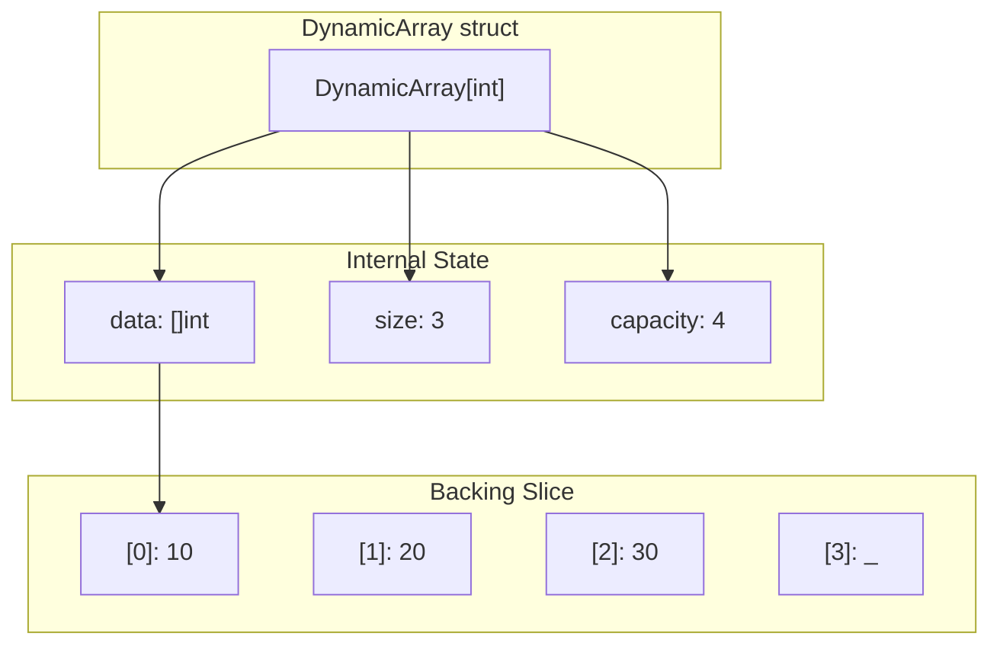

# Dynamic Array - Go Implementation

## Why Dynamic Array?

### The Problem It Solves

Imagine you're building a to-do list app. When the user starts, you don't know if they'll have 3 tasks or 300. You need a container that:

1. Lets you add items without knowing the final count upfront
2. Gives you instant access to any item by position
3. Keeps items in the order you added them

A fixed-size array can't grow. A linked list gives slow random access. A **dynamic array** gives you both: automatic growth AND fast indexed access.

### Real-World Analogies

**A filing cabinet with expandable folders**: You start with a few folders. When you run out of space, you buy a bigger cabinet, move everything over, and continue adding files. Each file has a clear position (slot number), so you can find any one instantly.

**A concert venue with removable walls**: Start with seating for 100. When demand grows, knock down a wall to expand to 200. Everyone keeps their seat number, and you can find any seat immediately.

**Your phone's photo gallery**: Photos are stored sequentially. You can jump to photo #47 instantly. As you take more, the storage expands automatically.

### When to Use It

- **Use a dynamic array when you need**:
  - Fast access by index: O(1)
  - Elements stored in insertion order
  - Frequent additions at the end
  - Unknown size at creation time

- **Compare to alternatives**:
  - Unlike a linked list, random access is O(1) instead of O(n)
  - Unlike a fixed array, it grows automatically
  - Unlike a map/hash table, elements maintain their order

---

## Core Concept

### The Big Idea

A dynamic array wraps a fixed-size array with automatic resizing logic. When the array fills up, we allocate a new array (typically 2x larger), copy everything over, and discard the old one. This "doubling strategy" means we rarely resize, making additions very fast on average.

The key insight: by doubling capacity instead of growing by 1, we amortize the expensive copy operations across many cheap insertions.

### Visual Representation



The diagram shows a dynamic array holding 3 elements with capacity for 4. `size` tracks how many elements are "live" (10, 20, 30). `capacity` tracks total allocated space. Slot [3] exists but is unused.

### Key Terminology

- **Size**: The number of elements currently stored (how many items you've added)
- **Capacity**: The total slots allocated in the backing array (how many items could fit before resizing)
- **Backing array/slice**: The actual memory storage underlying the dynamic array
- **Growth factor**: How much capacity increases when full (this implementation uses 2x)
- **Amortized O(1)**: An operation that's occasionally expensive but averages to O(1) over many calls

---

## How It Works: Step-by-Step

### Operation 1: PushBack (Insert at End)

**What it does**: Adds an element to the end of the array, growing if necessary.

**Step-by-step walkthrough**:

Starting state (empty array):
```
data:     []  (nil)
size:     0
capacity: 0
```

Step 1: `PushBack(10)` - Need space, allocate capacity 1
```
data:     [10]
size:     1
capacity: 1
```

Step 2: `PushBack(20)` - Full! Double capacity to 2, copy, then insert
```
data:     [10, 20]
size:     2
capacity: 2
```

Step 3: `PushBack(30)` - Full again! Double to 4, copy, insert
```
data:     [10, 20, 30, _]
size:     3
capacity: 4
```

Step 4: `PushBack(40)` - Room available, just insert
```
data:     [10, 20, 30, 40]
size:     4
capacity: 4
```

**Why this approach?** Doubling means growth operations (expensive O(n) copies) become increasingly rare. After growing to capacity N, we can do N insertions before the next growth. This averages out to O(1) per insertion.

### Operation 2: PopBack (Remove from End)

**What it does**: Removes the last element, reducing size by 1.

**Step-by-step walkthrough**:

Starting state:
```
data:     [10, 20, 30, 40]
size:     4
capacity: 4
```

Step 1: `PopBack()` - Decrement size, zero out the slot
```
data:     [10, 20, 30, 0]  <- slot [3] zeroed
size:     3
capacity: 4                <- unchanged!
```

Step 2: `PopBack()` again
```
data:     [10, 20, 0, 0]   <- slot [2] zeroed
size:     2
capacity: 4                <- still unchanged
```

**Why zero the slot?** In Go, if `T` is a pointer type, leaving the old value would prevent garbage collection of the pointed-to object. Zeroing ensures proper cleanup.

**Note**: Capacity never shrinks. This is a trade-off: we waste some memory to avoid expensive shrink operations.

### Operation 3: Reserve (Pre-allocate Capacity)

**What it does**: Ensures capacity is at least the requested amount, without changing size.

Starting state:
```
data:     [10, 20]
size:     2
capacity: 2
```

`Reserve(6)`:
```
data:     [10, 20, _, _, _, _]
size:     2                      <- unchanged!
capacity: 6
```

**Why use Reserve?** If you know you'll add 1000 elements, calling `Reserve(1000)` first avoids ~10 growth operations (1->2->4->8->16->32->64->128->256->512->1024).

### Worked Example: Complete Sequence

Let's trace through a realistic sequence of operations:

```
Operation 1: New[int]()
data:     nil
size:     0
capacity: 0
Result:   Empty array created

Operation 2: PushBack(5)
data:     [5]
size:     1
capacity: 1
Result:   First element added, capacity grew from 0 to 1

Operation 3: PushBack(10)
data:     [5, 10]
size:     2
capacity: 2
Result:   Capacity doubled from 1 to 2

Operation 4: PushBack(15)
data:     [5, 10, 15, _]
size:     3
capacity: 4
Result:   Capacity doubled from 2 to 4

Operation 5: At(1)
Returns:  (10, nil)
Result:   Bounds-checked access succeeds

Operation 6: At(5)
Returns:  (0, ErrOutOfRange)
Result:   Index 5 >= size 3, error returned

Operation 7: SetAt(0, 99)
data:     [99, 10, 15, _]
size:     3
capacity: 4
Result:   First element updated

Operation 8: PopBack()
data:     [99, 10, 0, _]  <- slot zeroed
size:     2
capacity: 4
Result:   Size decreased, capacity unchanged

Operation 9: Front()
Returns:  (99, nil)
Result:   Returns first element

Operation 10: Back()
Returns:  (10, nil)
Result:   Returns last element (index size-1 = 1)
```

---

## From Concept to Code

### The Data Structure

Before showing code, let's understand what we need to track:

| Field | Type | Purpose |
|-------|------|---------|
| `data` | `[]T` | The backing Go slice holding elements |
| `size` | `int` | Count of "live" elements (logical size) |
| `capacity` | `int` | Total allocated slots (physical size) |

**Why track size and capacity separately from the slice?** Go slices already have `len()` and `cap()`. However, managing them explicitly gives us:
1. Consistent behavior across all language implementations
2. Explicit control over growth strategy (always 2x)
3. Clear separation between "what's stored" and "what's allocated"

### Go Implementation

```go
type DynamicArray[T any] struct {
    data     []T
    size     int
    capacity int
}
```

**Line-by-line breakdown**:

- `type DynamicArray[T any]`: Declares a generic struct. The `[T any]` means this works with any type. `any` is Go's alias for `interface{}`, meaning "no constraints".

- `data []T`: A Go slice of type T. Slices are reference types - they point to an underlying array. Initially `nil` (zero value).

- `size int`: How many elements are logically present. Zero-initialized.

- `capacity int`: How many elements can fit before reallocation. Zero-initialized.

### Constructor Functions

```go
func New[T any]() *DynamicArray[T] {
    return &DynamicArray[T]{}
}
```

**Understanding this**:
- `func New[T any]()`: A generic function parameterized by type T
- `*DynamicArray[T]`: Returns a pointer to the struct (idiomatic for mutable Go types)
- `&DynamicArray[T]{}`: Creates a zero-valued struct and returns its address
- All fields get their zero values: `data` is `nil`, `size` is 0, `capacity` is 0

```go
func NewWithSize[T any](size int) *DynamicArray[T] {
    if size <= 0 {
        return &DynamicArray[T]{}
    }
    return &DynamicArray[T]{
        data:     make([]T, size),
        size:     size,
        capacity: size,
    }
}
```

**Understanding this**:
- `make([]T, size)`: Allocates a slice with length AND capacity equal to `size`, zero-initialized
- All elements are set to the zero value of T (0 for int, "" for string, nil for pointers)

### Implementing PushBack

**The algorithm in plain English**:
1. Check if we're at capacity
2. If so, calculate new capacity (double, or 1 if empty)
3. Call Reserve to allocate more space
4. Place the new element at index `size`
5. Increment `size`

**The code**:

```go
func (a *DynamicArray[T]) PushBack(value T) {
    if a.size == a.capacity {
        newCap := 1
        if a.capacity > 0 {
            newCap = a.capacity * 2
        }
        a.Reserve(newCap)
    }
    a.data[a.size] = value
    a.size++
}
```

**Understanding the tricky parts**:

- `(a *DynamicArray[T])`: This is a **pointer receiver**. It means this method can modify `a`. If we used `(a DynamicArray[T])` (value receiver), changes wouldn't persist.

- `newCap := 1`: Starting capacity is 1, not 0, because 0 * 2 = 0 (we'd be stuck).

- `a.data[a.size] = value`: After Reserve, `a.data` has at least `a.size + 1` slots. We write to the first empty slot.

### Implementing Reserve

**The algorithm in plain English**:
1. If requested capacity is not larger than current, do nothing
2. Allocate a new slice with the requested capacity
3. Copy existing elements to the new slice
4. Replace the old slice with the new one
5. Update capacity

**The code**:

```go
func (a *DynamicArray[T]) Reserve(newCap int) {
    if newCap <= a.capacity {
        return
    }
    newData := make([]T, newCap)
    copy(newData, a.data[:a.size])
    a.data = newData
    a.capacity = newCap
}
```

**Understanding the tricky parts**:

- `make([]T, newCap)`: Creates a new slice with length=capacity=newCap. All slots are zero-initialized.

- `copy(newData, a.data[:a.size])`: Go's built-in `copy` function copies elements between slices. `a.data[:a.size]` creates a sub-slice of just the live elements.

- After this, the old backing array becomes unreachable and Go's garbage collector will reclaim it.

### Implementing Bounds-Checked Access

```go
func (a *DynamicArray[T]) At(index int) (T, error) {
    var zero T
    if index < 0 || index >= a.size {
        return zero, ErrOutOfRange
    }
    return a.data[index], nil
}
```

**Understanding the tricky parts**:

- `(T, error)`: Go's multiple return values. Callers must handle both.

- `var zero T`: Declares a variable of type T, initialized to T's zero value. This is how Go handles "what to return on error" for generics - there's no null, so we return the zero value.

- `ErrOutOfRange`: A package-level exported error (capitalized). Callers can use `errors.Is(err, dynamicarray.ErrOutOfRange)` to check for this specific error.

### Implementing PopBack

```go
func (a *DynamicArray[T]) PopBack() error {
    if a.size == 0 {
        return ErrEmpty
    }
    a.size--
    var zero T
    a.data[a.size] = zero
    return nil
}
```

**Why zero the element?** Consider if T is `*SomeStruct`. Without zeroing, the old pointer stays in the slice, preventing garbage collection of the pointed-to object. By setting to `nil` (the zero value for pointers), we allow proper cleanup.

### Implementing Clone

```go
func (a *DynamicArray[T]) Clone() *DynamicArray[T] {
    clone := &DynamicArray[T]{
        data:     make([]T, a.capacity),
        size:     a.size,
        capacity: a.capacity,
    }
    copy(clone.data, a.data[:a.size])
    return clone
}
```

**Why we need Clone**: Go slices are reference types. If you just did `clone := arr`, both variables would point to the same backing array. `Clone()` creates a truly independent copy with its own backing array.

---

## Complexity Analysis

### Time Complexity

| Operation | Best | Average | Worst | Why |
|-----------|------|---------|-------|-----|
| PushBack | O(1) | O(1)* | O(n) | *Amortized. Worst case (resize) copies n elements. |
| PopBack | O(1) | O(1) | O(1) | Just decrement size and zero one slot. |
| At/SetAt | O(1) | O(1) | O(1) | Direct index calculation, constant time. |
| Get/Set | O(1) | O(1) | O(1) | Same as At, but without bounds check overhead. |
| Front/Back | O(1) | O(1) | O(1) | Access index 0 or size-1. |
| Reserve | O(n) | O(n) | O(n) | Must copy all n elements to new array. |
| Clear | O(n) | O(n) | O(n) | Zeros all n elements. |
| Clone | O(n) | O(n) | O(n) | Must copy all n elements. |
| Data | O(1) | O(1) | O(1) | Just returns a sub-slice (no copy). |

**Understanding the "Why" column**:

**PushBack Amortization Explained**: Say we start empty and push n elements. How many total copies happen?

- Push 1: allocate 1 (0 copies)
- Push 2: allocate 2, copy 1 element (1 copy)
- Push 3: allocate 4, copy 2 elements (2 copies)
- Push 4: no resize (0 copies)
- Push 5: allocate 8, copy 4 elements (4 copies)
- ...

Total copies for n pushes: 1 + 2 + 4 + 8 + ... + n/2 = n - 1 = O(n)

So n pushes cost O(n) total work, meaning O(1) average per push. This is "amortized O(1)".

### Space Complexity

- **Overall structure**: O(n) where n is the number of elements
- **Wasted space**: Up to n-1 unused slots (worst case: capacity is 2n-1 but only n elements stored)
- **Per PushBack**: O(n) during resize (temporarily holds both old and new arrays)

### Memory Behavior

```
Elements:  1  2  3  4  5  6  7  8  9
Capacity:  1  2  4  4  8  8  8  8  16
Wasted:    0  0  1  0  3  2  1  0  7
```

After adding 9 elements, capacity is 16, so 7 slots are "wasted". In practice, utilization averages ~75%.

---

## Go Slices vs This Implementation

You might wonder: "Go already has slices with `append()`. Why build this?"

### What Go Slices Give You

```go
slice := []int{}
slice = append(slice, 10)  // Automatic growth
slice = append(slice, 20)
len(slice)  // 2
cap(slice)  // 2 (or more - Go decides)
```

### What This Implementation Adds

| Feature | Go Slice | DynamicArray |
|---------|----------|--------------|
| Explicit capacity control | No (Go decides growth) | Yes (`Reserve`) |
| Predictable growth strategy | No (runtime-dependent) | Yes (always 2x) |
| Safe checked access | No (`slice[i]` panics) | Yes (`At()` returns error) |
| Cross-language consistency | N/A | Same API as C++, Rust, Python |
| Educational value | Hides internals | Shows how dynamic arrays work |

### When to Use Which

**Use Go slices** for production code when:
- You want the standard, idiomatic approach
- You don't need explicit capacity control
- You're okay with panic on out-of-bounds access

**Use DynamicArray** when:
- You need explicit error handling instead of panics
- You want predictable memory behavior
- You're learning how dynamic arrays work internally
- You need consistent APIs across multiple languages

---

## Common Mistakes & Pitfalls

### Mistake 1: Forgetting to Handle Errors

```go
// Wrong: Ignoring the error
value, _ := arr.At(index)
fmt.Println(value)  // Prints zero value if index was invalid!

// Right: Check the error
value, err := arr.At(index)
if err != nil {
    log.Printf("Invalid index: %v", err)
    return
}
fmt.Println(value)
```

**Why this matters**: Go's multiple returns are easy to ignore with `_`. Unlike panics, errors won't stop your program - you'll silently get wrong values.

### Mistake 2: Modifying Data() Slice Unintentionally

```go
// Dangerous: Data() returns a view, not a copy!
data := arr.Data()
data[0] = 999  // This modifies arr too!

// If you need an independent copy:
data := arr.Data()
safeCopy := make([]int, len(data))
copy(safeCopy, data)
safeCopy[0] = 999  // arr is unchanged
```

**Why this matters**: `Data()` returns a sub-slice that shares the backing array. This is efficient but can cause surprising mutations.

### Mistake 3: Using Get/Set Without Bounds Checking

```go
// Dangerous: Will panic if index >= size
value := arr.Get(100)

// Safer: Use At() and handle the error
value, err := arr.At(100)
if err != nil {
    // Handle gracefully
}
```

**Why this matters**: `Get`/`Set` are fast but rely on Go's runtime bounds check, which panics. Use them only when you've already validated the index.

### Mistake 4: Not Using Reserve for Bulk Inserts

```go
// Slow: Causes multiple reallocations
arr := dynamicarray.New[int]()
for i := 0; i < 1000; i++ {
    arr.PushBack(i)  // Resizes at 1, 2, 4, 8, 16, 32, 64, 128, 256, 512
}

// Fast: Single allocation
arr := dynamicarray.New[int]()
arr.Reserve(1000)
for i := 0; i < 1000; i++ {
    arr.PushBack(i)  // No resizes!
}
```

**Why this matters**: Without Reserve, adding 1000 elements causes ~10 reallocations and copies. With Reserve, zero reallocations.

### Mistake 5: Confusing Size and Capacity

```go
arr := dynamicarray.NewWithSize[int](10)
// size = 10, capacity = 10
// arr has 10 elements, all zero-valued!

arr := dynamicarray.New[int]()
arr.Reserve(10)
// size = 0, capacity = 10
// arr is EMPTY, but has room for 10 elements

// Wrong mental model:
arr.Reserve(10)
arr.Get(5)  // PANIC! size is still 0
```

**Why this matters**: `Reserve` only allocates space - it doesn't create elements. `NewWithSize` creates elements.

---

## Practice Problems

To solidify your understanding, try implementing:

1. **InsertAt(index, value)**: Insert an element at a specific position, shifting subsequent elements right. Think about: What's the time complexity? What if index equals size?

2. **RemoveAt(index)**: Remove an element at a specific position, shifting subsequent elements left. Think about: How do you handle the gap?

3. **ShrinkToFit()**: Reduce capacity to match size exactly. Think about: When is this useful? What's the trade-off?

4. **Reverse()**: Reverse all elements in place. Think about: Can you do this without extra memory?

5. **Filter(predicate func(T) bool)**: Return a new DynamicArray with only elements where predicate returns true.

---

## Summary

### Key Takeaways

- A dynamic array provides O(1) random access with automatic growth
- Doubling capacity on growth gives amortized O(1) insertion
- Go's explicit error handling (returning `(T, error)`) makes failures visible
- `Data()` returns a view, not a copy - mutations affect the original
- Reserve upfront when you know the size to avoid reallocations
- Size tracks live elements; capacity tracks allocated space

### Quick Reference

```
DynamicArray[T] - Growable array with O(1) indexed access
|-- New[T]()              O(1)   Create empty array
|-- NewWithSize[T](n)     O(n)   Create with n zero-valued elements
|-- PushBack(value)       O(1)*  Add to end (*amortized)
|-- PopBack()             O(1)   Remove from end
|-- At(index) (T, error)  O(1)   Safe read access
|-- SetAt(index, value)   O(1)   Safe write access
|-- Get(index) T          O(1)   Unchecked read (may panic)
|-- Set(index, value)     O(1)   Unchecked write (may panic)
|-- Front() (T, error)    O(1)   First element
|-- Back() (T, error)     O(1)   Last element
|-- Size() int            O(1)   Number of elements
|-- Capacity() int        O(1)   Allocated slots
|-- IsEmpty() bool        O(1)   Check if empty
|-- Reserve(n)            O(n)   Ensure capacity >= n
|-- Clear()               O(n)   Remove all elements
|-- Clone()               O(n)   Create independent copy
+-- Data() []T            O(1)   Get slice view of elements

Errors: ErrOutOfRange, ErrEmpty

Best for: Sequential data, frequent indexed access, stack-like usage
Avoid when: Frequent insertions/deletions in middle (use linked list)
```
