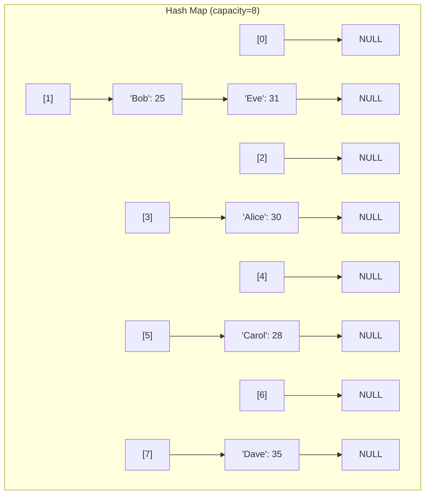

# Hash Map — C++ Implementation

## Why Hash Map?

### The Problem It Solves

Imagine you're building a contact list application. You have thousands of contacts, and users frequently ask: "What's the phone number for Alice?" or "Update Bob's email address."

With an array, you'd have to scan through every contact until you find the right name. With a thousand contacts, that's potentially a thousand comparisons every single time. As your list grows, the app gets slower and slower.

What if you could jump directly to any contact's information in one step, regardless of how many contacts you have? That's what a hash map provides: **instant access by key**.

A hash map transforms any key (like a person's name) into a position in an array. Instead of searching, you calculate where the data lives. This gives you O(1) — constant time — lookups, insertions, and deletions on average.

### Real-World Analogies

**A Library Card Catalog**
In old libraries, books weren't shelved in the order they arrived. Instead, each book had a call number (like "823.91 ROW"). This number told you exactly which shelf and section to find the book. The catalog was a hash map: book title goes in, shelf location comes out.

**A Phone Book**
Looking up "Smith, John" in a physical phone book is fast because names are organized alphabetically. You don't start at page 1 — you jump to the "S" section. A hash map takes this idea further: instead of 26 sections (A-Z), it might have thousands of sections, and it calculates which section to check using the key itself.

**Employee ID Badges**
When you swipe your badge, the system doesn't search through every employee record. Your badge number is converted directly into a database index. Swipe, lookup, done — in milliseconds.

### When to Use It

- **Use a hash map when** you need to associate values with unique keys and want fast lookups
- **Use a hash map when** you're counting occurrences (key = item, value = count)
- **Use a hash map when** you need to detect duplicates quickly
- **Use a hash map when** you're caching computed results (key = input, value = result)

Unlike an array, which requires you to know the numeric index, a hash map lets you use meaningful keys like strings or objects. Unlike a balanced tree (which also provides key-based access), a hash map gives O(1) average time instead of O(log n).

---

## Core Concept

### The Big Idea

A hash map stores key-value pairs by converting each key into an array index using a **hash function**. This function takes any key and produces a number. That number, when reduced to fit the array size, tells us which "bucket" to store the data in.

The magic is that the same key always produces the same hash, so when we want to find that key later, we recalculate the hash and look directly in that bucket — no searching required.

But what happens when two different keys produce the same index? This is called a **collision**, and our implementation handles it with **separate chaining**: each bucket holds a linked list of entries, so multiple key-value pairs can share a bucket.

### Visual Representation



This diagram shows a hash map with 8 buckets storing names and ages. Notice:
- Most buckets have one entry (or none)
- Bucket 1 has two entries: "Bob" and "Eve" collided (their keys hashed to the same index)
- The entries in each bucket form a linked list (chaining)

### Key Terminology

- **Hash function**: A function that converts a key into a numeric value. Good hash functions distribute keys evenly across the array.
- **Bucket**: One slot in the underlying array. Each bucket can hold multiple entries through chaining.
- **Collision**: When two different keys hash to the same bucket index.
- **Separate chaining**: A collision resolution strategy where each bucket is a linked list of all entries that hashed to that index.
- **Load factor**: The ratio of entries to buckets (size / capacity). Higher load factors mean more collisions.
- **Rehash**: The process of creating a larger bucket array and redistributing all entries when the load factor gets too high.

---

## How It Works: Step-by-Step

### Operation 1: Insert

**What it does**: Adds a new key-value pair, or updates the value if the key already exists.

**Step-by-step walkthrough**:

Starting with an empty hash map (capacity=4):

```
Buckets: [0]:NULL  [1]:NULL  [2]:NULL  [3]:NULL
Size: 0, Capacity: 4, Load Factor: 0.00
```

**Insert("Alice", 30)** — hash("Alice") % 4 = 3

Step 1: Calculate bucket index
```
hash("Alice") produces some large number
Large number % 4 = 3
Target bucket: [3]
```

Step 2: Check if key exists in bucket (it doesn't — bucket is empty)

Step 3: Create new entry and prepend to bucket
```
Buckets: [0]:NULL  [1]:NULL  [2]:NULL  [3]:("Alice",30)->NULL
Size: 1, Capacity: 4, Load Factor: 0.25
```

**Insert("Bob", 25)** — hash("Bob") % 4 = 1

```
Buckets: [0]:NULL  [1]:("Bob",25)->NULL  [2]:NULL  [3]:("Alice",30)->NULL
Size: 2, Capacity: 4, Load Factor: 0.50
```

**Insert("Eve", 31)** — hash("Eve") % 4 = 1 (collision with Bob!)

Step 1: Calculate bucket index = 1

Step 2: Search bucket for "Eve" — not found (we find "Bob", but keys don't match)

Step 3: Prepend new entry to bucket's chain
```
Buckets: [0]:NULL  [1]:("Eve",31)->("Bob",25)->NULL  [2]:NULL  [3]:("Alice",30)->NULL
Size: 3, Capacity: 4, Load Factor: 0.75
```

**Why this approach?** Prepending (adding at the head) is O(1) — we don't need to traverse the chain. The tradeoff is that iteration order isn't predictable, but hash maps don't guarantee order anyway.

### Operation 2: Get (Lookup)

**What it does**: Retrieves the value associated with a key, or throws an exception if not found.

**Step-by-step walkthrough**:

Using the state from above:
```
Buckets: [0]:NULL  [1]:("Eve",31)->("Bob",25)->NULL  [2]:NULL  [3]:("Alice",30)->NULL
```

**Get("Bob")**:

Step 1: Calculate bucket index = hash("Bob") % 4 = 1

Step 2: Traverse bucket's chain
```
Current entry: ("Eve", 31) — key "Eve" != "Bob", move to next
Current entry: ("Bob", 25) — key "Bob" == "Bob", found!
```

Step 3: Return reference to value (25)

**Get("Charlie")** (key doesn't exist):

Step 1: Calculate bucket index = hash("Charlie") % 4 = 2

Step 2: Bucket [2] is NULL — key not found

Step 3: Throw `std::out_of_range` exception

**Why this approach?** We must check the actual keys because different keys can hash to the same bucket. The chain traversal is usually very short when load factor is controlled.

### Operation 3: Remove

**What it does**: Deletes a key-value pair and returns whether the key existed.

**Step-by-step walkthrough**:

Starting state:
```
Buckets: [0]:NULL  [1]:("Eve",31)->("Bob",25)->NULL  [2]:NULL  [3]:("Alice",30)->NULL
```

**Remove("Eve")**:

Step 1: Calculate bucket index = 1

Step 2: Search for "Eve", tracking the previous entry
```
prev = NULL
current = ("Eve", 31) — found!
```

Step 3: Since prev is NULL, "Eve" is the head of the chain. Update bucket to point to next entry.
```
Buckets: [0]:NULL  [1]:("Bob",25)->NULL  [2]:NULL  [3]:("Alice",30)->NULL
Size: 2
```

Step 4: Delete the entry, return true

**Remove("Bob")** (if it were second in chain):
In that case, we'd update prev->next to skip over "Bob", maintaining the chain.

### Operation 4: Rehash

**What it does**: Doubles the capacity and redistributes all entries when load factor exceeds 75%.

**Step-by-step walkthrough**:

Suppose we're about to exceed load factor:
```
Buckets (capacity=4): [0]:NULL  [1]:("Eve",31)->("Bob",25)->NULL  [2]:NULL  [3]:("Alice",30)->NULL
Size: 3, Load Factor: 0.75
```

Inserting one more would push load factor above 75%, triggering rehash.

Step 1: Create new bucket array with double capacity (8)
```
New buckets: [0]:NULL [1]:NULL [2]:NULL [3]:NULL [4]:NULL [5]:NULL [6]:NULL [7]:NULL
```

Step 2: For each entry in old buckets, calculate new index and insert

```
Entry ("Eve", 31): hash("Eve") % 8 = 5  -> insert at [5]
Entry ("Bob", 25): hash("Bob") % 8 = 1  -> insert at [1]
Entry ("Alice", 30): hash("Alice") % 8 = 7 -> insert at [7]
```

Step 3: Delete old bucket array, adopt new one
```
Buckets (capacity=8): [0]:NULL [1]:("Bob",25)->NULL [2]:NULL [3]:NULL [4]:NULL [5]:("Eve",31)->NULL [6]:NULL [7]:("Alice",30)->NULL
Size: 3, Load Factor: 0.375
```

**Why this approach?** Notice that "Eve" and "Bob" no longer collide! With more buckets, entries spread out more evenly, keeping chains short.

### Worked Example: Complete Sequence

Let's trace through building a word frequency counter:

```
Operation 1: insert("apple", 1)
hash("apple") % 16 = 7
Bucket [7]: ("apple",1)->NULL
Size: 1

Operation 2: insert("banana", 1)
hash("banana") % 16 = 3
Bucket [3]: ("banana",1)->NULL
Bucket [7]: ("apple",1)->NULL
Size: 2

Operation 3: insert("apple", 2)  -- update existing key!
hash("apple") % 16 = 7
Found "apple" in bucket [7], update value to 2
Bucket [3]: ("banana",1)->NULL
Bucket [7]: ("apple",2)->NULL
Size: 2 (unchanged - was an update)

Operation 4: get("apple")
hash("apple") % 16 = 7
Search bucket [7], find ("apple",2)
Return: 2

Operation 5: contains("cherry")
hash("cherry") % 16 = 11
Bucket [11] is NULL
Return: false

Operation 6: remove("banana")
hash("banana") % 16 = 3
Found ("banana",1) at head of bucket [3]
Delete entry, bucket [3] becomes NULL
Return: true
Size: 1

Operation 7: get("banana")
hash("banana") % 16 = 3
Bucket [3] is NULL
Throw: std::out_of_range
```

---

## From Concept to Code

### The Data Structure

Before looking at code, let's understand what we need to track:

1. **Entries**: Each entry needs to store a key, a value, and a pointer to the next entry in the chain (for collision handling)
2. **Bucket array**: A dynamic array of entry pointers (one per bucket)
3. **Capacity**: How many buckets we have
4. **Size**: How many key-value pairs are stored

### C++ Implementation

```cpp
template <typename K, typename V>
class HashMap {
private:
    struct Entry {
        K key;
        V value;
        Entry* next;
        Entry(const K& k, const V& v) : key(k), value(v), next(nullptr) {}
        Entry(K&& k, V&& v) : key(std::move(k)), value(std::move(v)), next(nullptr) {}
    };

    Entry** buckets_;
    size_type capacity_;
    size_type size_;
};
```

**Line-by-line breakdown**:

- `template <typename K, typename V>` — Makes this a generic hash map that works with any key and value types. When you write `HashMap<std::string, int>`, the compiler generates a version where K=string and V=int.

- `struct Entry` — An inner struct holding one key-value pair. Using a struct inside the class keeps it private and closely associated with HashMap.

- `Entry* next` — Each entry points to the next entry in its bucket's chain. This is how we handle collisions.

- `Entry(const K& k, const V& v)` — Copy constructor for entries. Takes keys and values by const reference to avoid unnecessary copies when the caller already has the data.

- `Entry(K&& k, V&& v)` — Move constructor for entries. The `&&` means "rvalue reference" — it accepts temporary values and "steals" their contents using `std::move` instead of copying.

- `Entry** buckets_` — An array of pointers to Entry. Each element points to the head of a linked list (or nullptr if empty). The double pointer (`**`) means "pointer to an array of pointers."

- `size_type capacity_` — Number of buckets. Always a power of 2 in this implementation for efficient modulo operations.

- `size_type size_` — Number of key-value pairs currently stored.

### Constructor and Destructor

```cpp
HashMap() : buckets_(new Entry*[16]()), capacity_(16), size_(0) {}

~HashMap() {
    if (buckets_ != nullptr) {
        clear();
        delete[] buckets_;
    }
}
```

**Understanding the constructor**:

- `new Entry*[16]()` — Allocates an array of 16 Entry pointers. The `()` at the end is crucial: it **value-initializes** the array, setting all pointers to nullptr. Without it, you'd have garbage values.

**Understanding the destructor**:

The destructor must free all memory we allocated:
1. First, `clear()` deletes every Entry node in every chain
2. Then, `delete[] buckets_` frees the bucket array itself

The nullptr check handles the case where this HashMap was moved from (leaving buckets_ null).

### Implementing Insert

**The algorithm in plain English**:
1. Check if we need to rehash (load factor > 75%)
2. Calculate which bucket this key belongs to
3. Search that bucket for an existing entry with this key
4. If found, update the value
5. If not found, create a new entry and prepend it to the bucket

**The code**:

```cpp
void insert(const K& key, const V& value) {
    if (should_rehash())
        rehash();
    size_type idx = bucket_index(key);
    for (Entry* e = buckets_[idx]; e != nullptr; e = e->next) {
        if (e->key == key) {
            e->value = value;
            return;
        }
    }
    Entry* entry = new Entry(key, value);
    entry->next = buckets_[idx];
    buckets_[idx] = entry;
    ++size_;
}
```

**Understanding the tricky parts**:

- `should_rehash()` — Checks `size_ * 4 > capacity_ * 3`, which is equivalent to checking if load factor > 0.75. Using multiplication instead of division avoids floating-point math.

- `bucket_index(key)` — Returns `std::hash<K>{}(key) % capacity_`. The `std::hash<K>{}` creates a temporary hash function object and immediately calls it on the key. The `% capacity_` constrains the result to a valid bucket index.

- The `for` loop traverses the chain, comparing keys. If we find a match, we update in place and return early — the key already exists.

- `entry->next = buckets_[idx]` then `buckets_[idx] = entry` — This is the classic linked-list prepend operation. The new entry's next points to the old head, then the bucket points to the new entry.

### Implementing Lookup

**The code**:

```cpp
V& get(const K& key) {
    Entry* e = find_entry(key);
    if (e == nullptr)
        throw std::out_of_range("HashMap::get: key not found");
    return e->value;
}

V* find(const K& key) {
    Entry* e = find_entry(key);
    return e ? &e->value : nullptr;
}

Entry* find_entry(const K& key) const {
    size_type idx = bucket_index(key);
    for (Entry* e = buckets_[idx]; e != nullptr; e = e->next) {
        if (e->key == key)
            return e;
    }
    return nullptr;
}
```

**Understanding the tricky parts**:

- `find_entry` is a private helper that both `get` and `find` use. It returns the Entry pointer (or nullptr).

- `get` returns a **reference** (`V&`), allowing modification: `map.get("key") = newValue;`. It throws on missing keys.

- `find` returns a **pointer** (`V*`), returning nullptr for missing keys. This is safer when you're not sure the key exists: `if (V* val = map.find("key")) { /* use val */ }`

- Both const and non-const versions exist. The const version returns `const V*` or `const V&` to prevent modification through const HashMaps.

### Implementing Remove

**The code**:

```cpp
bool remove(const K& key) {
    size_type idx = bucket_index(key);
    Entry* prev = nullptr;
    for (Entry* e = buckets_[idx]; e != nullptr; prev = e, e = e->next) {
        if (e->key == key) {
            if (prev == nullptr)
                buckets_[idx] = e->next;
            else
                prev->next = e->next;
            delete e;
            --size_;
            return true;
        }
    }
    return false;
}
```

**Understanding the tricky parts**:

- We track `prev` to handle linked-list removal. When we find the target entry, we need to update either the bucket head (if prev is null) or the previous entry's next pointer.

- `delete e` frees the Entry's memory. This is manual memory management — every `new Entry` must have a matching `delete`.

- Returns `bool` to indicate whether the key existed.

### Implementing Rehash

**The code**:

```cpp
void rehash() {
    size_type new_capacity = capacity_ * 2;
    Entry** new_buckets = new Entry*[new_capacity]();
    for (size_type i = 0; i < capacity_; ++i) {
        Entry* e = buckets_[i];
        while (e != nullptr) {
            Entry* next = e->next;
            size_type idx = std::hash<K>{}(e->key) % new_capacity;
            e->next = new_buckets[idx];
            new_buckets[idx] = e;
            e = next;
        }
    }
    delete[] buckets_;
    buckets_ = new_buckets;
    capacity_ = new_capacity;
}
```

**Understanding the tricky parts**:

- We **reuse existing Entry nodes** rather than allocating new ones. Each entry is just relinked into the new bucket array. This is more efficient than creating new entries and deleting old ones.

- `Entry* next = e->next` saves the next pointer **before** we modify `e->next`. This is essential — once we relink `e` into the new array, its `next` pointer changes.

- After rehashing, entries that collided before might now be in different buckets (because `% new_capacity` gives different results than `% old_capacity`).

### The Rule of Five

This implementation manages dynamic memory, so it must define five special member functions:

```cpp
// Copy constructor: deep copy all entries
HashMap(const HashMap& other) : buckets_(new Entry*[other.capacity_]()), capacity_(other.capacity_), size_(0) {
    for (size_type i = 0; i < capacity_; ++i) {
        for (Entry* e = other.buckets_[i]; e != nullptr; e = e->next)
            insert(e->key, e->value);
    }
}

// Move constructor: steal resources
HashMap(HashMap&& other) noexcept
    : buckets_(other.buckets_), capacity_(other.capacity_), size_(other.size_) {
    other.buckets_ = nullptr;
    other.capacity_ = 0;
    other.size_ = 0;
}

// Copy assignment
HashMap& operator=(const HashMap& other) {
    if (this != &other) {
        clear();
        delete[] buckets_;
        buckets_ = new Entry*[other.capacity_]();
        capacity_ = other.capacity_;
        for (size_type i = 0; i < capacity_; ++i) {
            for (Entry* e = other.buckets_[i]; e != nullptr; e = e->next)
                insert(e->key, e->value);
        }
    }
    return *this;
}

// Move assignment
HashMap& operator=(HashMap&& other) noexcept {
    if (this != &other) {
        clear();
        delete[] buckets_;
        buckets_ = other.buckets_;
        capacity_ = other.capacity_;
        size_ = other.size_;
        other.buckets_ = nullptr;
        other.capacity_ = 0;
        other.size_ = 0;
    }
    return *this;
}
```

**Why we need all five**:

- **Copy constructor**: When `HashMap b = a;` creates a completely independent copy
- **Move constructor**: When `HashMap b = std::move(a);` transfers ownership efficiently
- **Copy assignment**: When `b = a;` replaces b's contents with a copy of a
- **Move assignment**: When `b = std::move(a);` replaces b's contents by stealing from a
- **Destructor**: When a HashMap goes out of scope, it cleans up all allocated memory

The move operations leave the source in a valid but empty state (buckets_ = nullptr). The destructor checks for nullptr before attempting cleanup.

---

## Complexity Analysis

### Time Complexity

| Operation | Best | Average | Worst | Why |
|-----------|------|---------|-------|-----|
| insert    | O(1) | O(1)    | O(n)  | Best/average: hash directly to bucket, prepend. Worst: all keys collide into one bucket. |
| get       | O(1) | O(1)    | O(n)  | Best/average: hash and find immediately. Worst: must traverse entire chain. |
| find      | O(1) | O(1)    | O(n)  | Same as get. |
| remove    | O(1) | O(1)    | O(n)  | Best/average: hash and find immediately. Worst: traverse entire chain. |
| contains  | O(1) | O(1)    | O(n)  | Same as get. |
| keys      | O(n) | O(n)    | O(n)  | Must visit every entry exactly once. |
| values    | O(n) | O(n)    | O(n)  | Must visit every entry exactly once. |
| clear     | O(n) | O(n)    | O(n)  | Must delete every entry. |
| rehash    | O(n) | O(n)    | O(n)  | Must relocate every entry. |

**Understanding the "Why" column**:

The O(n) worst case occurs when all keys hash to the same bucket, creating a single long chain. With a good hash function and controlled load factor, this is extremely unlikely — the average chain length stays close to 1.

The load factor threshold of 75% ensures that, on average, each bucket has fewer than 1 entry. This keeps the expected lookup time constant.

### Space Complexity

- **Overall structure**: O(n + m) where n is the number of entries and m is the capacity. Since capacity grows proportionally with n (maintaining load factor < 0.75), this simplifies to O(n).
- **Per operation**: Most operations use O(1) extra space. `insert` allocates one Entry. `rehash` temporarily holds both old and new bucket arrays (O(n) extra space).

### Amortized Analysis

Rehashing is expensive (O(n)), but it only happens when we've inserted enough elements to exceed the load factor threshold. Since capacity doubles each time, and we need to insert n/2 more elements before the next rehash, the cost of rehashing is "spread out" over all those inserts.

**Amortized insert time**: Even though individual inserts might trigger an O(n) rehash, the amortized cost per insert is still O(1). This is similar to how dynamic array (vector) push_back is amortized O(1) despite occasional O(n) resizes.

---

## Common Mistakes & Pitfalls

### Mistake 1: Forgetting to delete entries before deleting the bucket array

```cpp
// Wrong:
~HashMap() {
    delete[] buckets_;  // Memory leak! Entry nodes are never freed
}

// Right:
~HashMap() {
    if (buckets_ != nullptr) {
        clear();           // First delete all Entry nodes
        delete[] buckets_; // Then delete the bucket array
    }
}
```

**Why this matters**: Each Entry is separately allocated with `new`. Deleting the bucket array only frees the array of pointers, not what they point to. You'd leak every Entry ever inserted.

### Mistake 2: Not saving next pointer before relinking during rehash

```cpp
// Wrong:
while (e != nullptr) {
    size_type idx = hash(e->key) % new_capacity;
    e->next = new_buckets[idx];  // We just overwrote e->next!
    new_buckets[idx] = e;
    e = e->next;                  // This is now wrong - points into new array
}

// Right:
while (e != nullptr) {
    Entry* next = e->next;        // Save BEFORE modifying
    size_type idx = hash(e->key) % new_capacity;
    e->next = new_buckets[idx];
    new_buckets[idx] = e;
    e = next;                     // Use saved value
}
```

**Why this matters**: Once you set `e->next = new_buckets[idx]`, you've lost the reference to the next entry in the old chain. You need to save it first.

### Mistake 3: Using uninitialized bucket pointers

```cpp
// Wrong:
buckets_ = new Entry*[16];  // Uninitialized - contains garbage pointers!

// Right:
buckets_ = new Entry*[16]();  // Value-initialized - all pointers are nullptr
```

**Why this matters**: Without the `()`, the bucket pointers contain whatever garbage was in memory. When you later check `if (buckets_[idx] == nullptr)` or traverse a chain, you'll follow invalid pointers and likely crash.

### Mistake 4: Forgetting self-assignment check in copy/move assignment

```cpp
// Wrong:
HashMap& operator=(const HashMap& other) {
    clear();                // Clears our own data
    delete[] buckets_;      // Deletes our own buckets
    // ... then copies from other, which IS us! We just destroyed our data.
}

// Right:
HashMap& operator=(const HashMap& other) {
    if (this != &other) {   // Self-assignment check
        clear();
        delete[] buckets_;
        // ... safe to copy from other
    }
    return *this;
}
```

**Why this matters**: `map = map;` is valid C++. Without the self-assignment check, you destroy the map's contents before copying them — leaving you with garbage.

### Mistake 5: Not handling the case where key already exists

```cpp
// Wrong (creates duplicate entries):
void insert(const K& key, const V& value) {
    Entry* entry = new Entry(key, value);
    entry->next = buckets_[idx];
    buckets_[idx] = entry;
    ++size_;  // Size grows even if key existed!
}

// Right:
void insert(const K& key, const V& value) {
    for (Entry* e = buckets_[idx]; e != nullptr; e = e->next) {
        if (e->key == key) {
            e->value = value;  // Update existing
            return;            // Don't add duplicate!
        }
    }
    // Key doesn't exist, safe to add
    Entry* entry = new Entry(key, value);
    // ...
}
```

**Why this matters**: Hash maps should have unique keys. If you don't check for existing keys, you'll have duplicate entries, incorrect sizes, and confusing behavior.

---

## Practice Problems

To solidify your understanding, try implementing:

1. **`operator[]`**: Implement `V& operator[](const K& key)` that returns a reference to the value, inserting a default-constructed value if the key doesn't exist. (Hint: this is how `std::unordered_map` works)

2. **Iterator support**: Add `begin()` and `end()` methods that return iterators, allowing `for (auto& [key, value] : map)` syntax. (Hint: the iterator needs to track both bucket index and current entry)

3. **Custom hash function**: Modify the template to accept an optional hash function type: `template <typename K, typename V, typename Hash = std::hash<K>>`. This allows users to provide custom hash functions for their types.

4. **Load factor control**: Add a constructor parameter for maximum load factor. Add a `load_factor()` method and a `max_load_factor()` method.

5. **LRU Cache**: Use your HashMap alongside a doubly-linked list to implement an LRU (Least Recently Used) cache with O(1) get and put operations.

---

## Summary

### Key Takeaways

- A hash map provides O(1) average-case key-value lookups by converting keys to array indices
- Collisions (when different keys hash to the same index) are handled by chaining entries in linked lists
- The load factor (size/capacity) should be kept below 75% to maintain O(1) performance
- Rehashing doubles capacity and redistributes all entries when load factor gets too high
- In C++, manual memory management requires careful attention to the Rule of Five

### Quick Reference

```
HashMap<K, V> — Key-value store with O(1) average access
|-- insert(key, value): O(1) avg — Add or update a key-value pair
|-- get(key): O(1) avg — Get value by key (throws if missing)
|-- find(key): O(1) avg — Get pointer to value (nullptr if missing)
|-- remove(key): O(1) avg — Delete by key, returns success
|-- contains(key): O(1) avg — Check if key exists
|-- size(): O(1) — Number of key-value pairs
|-- empty(): O(1) — Check if map is empty
|-- clear(): O(n) — Remove all entries
|-- keys(container): O(n) — Copy all keys to container
+-- values(container): O(n) — Copy all values to container

Best for: Fast lookups by arbitrary keys, caching, counting, deduplication
Avoid when: You need ordered iteration, memory is extremely constrained, or keys don't have good hash functions
```
