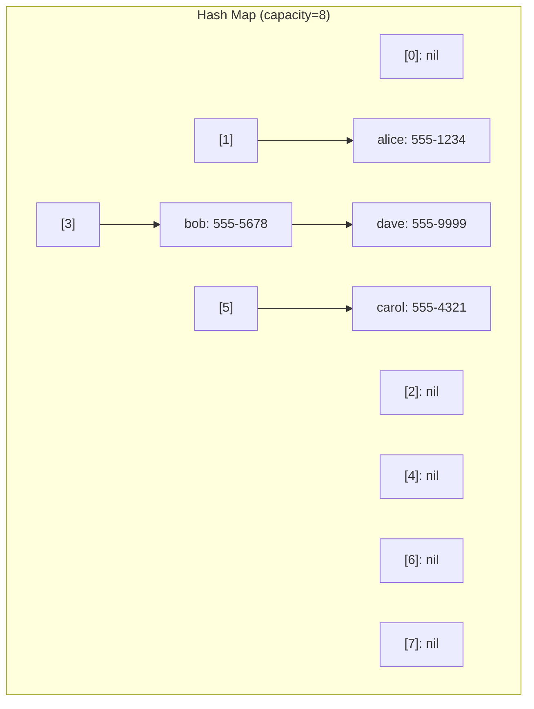

# Hash Map — Go Implementation

## Why Hash Map?

### The Problem It Solves

Imagine you're building a contacts app. You have thousands of contacts, and when a user types "Alice", you need to instantly show Alice's phone number. How do you find Alice's entry quickly?

**Approach 1: A list of contacts**
You could store contacts in a list and search through them one by one. But with 10,000 contacts, you might need to check all 10,000 entries to find Alice (or confirm she doesn't exist). That's slow.

**Approach 2: A sorted list with binary search**
Better! With binary search, you can find Alice in about 14 steps (log2 of 10,000). But every time you add a new contact, you need to keep the list sorted—potentially shifting thousands of entries.

**Approach 3: A hash map**
What if you could compute exactly where Alice's entry should be stored, and jump directly there? That's the magic of a hash map. Given any key, you can find (or store) its value in essentially one step, regardless of how many entries exist.

### Real-World Analogies

1. **Library catalog system**: Instead of searching every shelf for a book, the catalog tells you "Section B, Shelf 4, Position 12". The book's title is converted to a location. A hash map works the same way—the key is converted to an array index.

2. **Coat check at a theater**: You hand over your coat, receive ticket #47, and when you return, you give back #47 and immediately get your coat. The ticket number is like a hash—it tells the attendant exactly where to look.

3. **Filing cabinet with labeled folders**: Instead of searching through every document, you go directly to the folder labeled with the first letter of the name. Multiple names starting with "A" share a folder (this is like collision handling).

### When to Use It

- **Use a hash map when you need to**:
  - Look up values by a key in constant time
  - Check if something exists in a collection quickly
  - Count occurrences of items (key = item, value = count)
  - Cache computed results (memoization)
  - Group items by some property

- **Unlike a slice/array**: Hash maps give O(1) lookup by key, not by position. Arrays require O(n) search unless sorted.

- **Unlike a sorted tree (BST, AVL)**: Hash maps are faster for pure lookup (O(1) vs O(log n)), but don't maintain sorted order. If you need "find all contacts between A and C", use a tree.

---

## Core Concept

### The Big Idea

A hash map is an array where the index of each element is computed from its key using a **hash function**. Instead of searching for where a key might be, we calculate exactly where it should be.

The fundamental insight: if we can turn any key into a number (its hash), and that number into an array index, we can store and retrieve values in constant time.

### Visual Representation



The diagram shows:
- An array of 8 **buckets** (indexed 0-7)
- Each bucket is either empty (`nil`) or points to a chain of entries
- "alice" hashes to index 1, "carol" hashes to index 5
- "bob" and "dave" both hash to index 3—this is called a **collision**
- Collisions are handled by chaining entries together in a linked list

### Key Terminology

- **Bucket**: A slot in the underlying array. Each bucket can hold zero or more entries.
- **Hash function**: A function that converts a key into a number. Good hash functions spread keys evenly across buckets.
- **Collision**: When two different keys hash to the same bucket index.
- **Chaining**: A collision resolution strategy where entries in the same bucket are linked together.
- **Load factor**: The ratio of entries to buckets (`size / capacity`). Higher load factor means more collisions.
- **Rehashing**: When the load factor gets too high, we create a larger bucket array and redistribute all entries.

---

## How It Works: Step-by-Step

### Operation 1: Put (Insert or Update)

**What it does**: Stores a key-value pair. If the key already exists, updates its value.

**Step-by-step walkthrough**:

Starting state (capacity=4, size=1):
```
Buckets:
[0]: nil
[1]: ("alice", 100) -> nil
[2]: nil
[3]: nil
```

**Insert ("bob", 200)**

Step 1: Compute hash of "bob" and find bucket index
```
hash("bob") % 4 = 3
Target bucket: [3]
```

Step 2: Check if "bob" already exists in bucket [3]
```
Bucket [3] is nil (empty), so "bob" is new
```

Step 3: Insert at the head of bucket [3]
```
Buckets:
[0]: nil
[1]: ("alice", 100) -> nil
[2]: nil
[3]: ("bob", 200) -> nil

size: 2
```

**Insert ("carol", 300)** — causes collision with "bob"

Step 1: Compute hash
```
hash("carol") % 4 = 3  (same bucket as bob!)
Target bucket: [3]
```

Step 2: Walk the chain in bucket [3], looking for "carol"
```
Check ("bob", 200): key "bob" != "carol", continue
Reached nil: "carol" is not in the chain
```

Step 3: Prepend "carol" to bucket [3]
```
Buckets:
[0]: nil
[1]: ("alice", 100) -> nil
[2]: nil
[3]: ("carol", 300) -> ("bob", 200) -> nil

size: 3
```

**Why prepending?** It's O(1)—we don't need to traverse the chain. New entries go at the front.

### Operation 2: Get (Lookup)

**What it does**: Retrieves the value for a given key, or indicates the key doesn't exist.

**Step-by-step walkthrough**:

Current state:
```
Buckets:
[0]: nil
[1]: ("alice", 100) -> nil
[2]: nil
[3]: ("carol", 300) -> ("bob", 200) -> nil
```

**Get("bob")**

Step 1: Compute hash
```
hash("bob") % 4 = 3
Look in bucket [3]
```

Step 2: Walk the chain
```
Check ("carol", 300): key "carol" != "bob", continue
Check ("bob", 200): key "bob" == "bob", FOUND!
```

Step 3: Return (200, true)

**Get("dave")** — key not found

Step 1: Compute hash
```
hash("dave") % 4 = 3
Look in bucket [3]
```

Step 2: Walk the chain
```
Check ("carol", 300): key "carol" != "dave", continue
Check ("bob", 200): key "bob" != "dave", continue
Reached nil: "dave" not found
```

Step 3: Return (zero value, false)

### Operation 3: Remove (Delete)

**What it does**: Removes a key-value pair and returns the removed value.

**Step-by-step walkthrough**:

Current state:
```
[3]: ("carol", 300) -> ("bob", 200) -> nil
```

**Remove("bob")**

Step 1: Find bucket and walk chain, tracking previous entry
```
prev = nil, current = ("carol", 300)
"carol" != "bob", continue
prev = ("carol", 300), current = ("bob", 200)
"bob" == "bob", FOUND!
```

Step 2: Unlink "bob" by connecting prev to current.next
```
prev.next = current.next
("carol", 300).next = nil
```

Result:
```
[3]: ("carol", 300) -> nil

Returned: (200, true)
size: 2
```

### Operation 4: Rehash (Resize)

**What it does**: When load factor exceeds threshold (0.75), doubles capacity and redistributes entries.

**Step-by-step walkthrough**:

Before rehash (capacity=4, size=3, load factor=0.75):
```
[0]: nil
[1]: ("alice", 100) -> nil
[2]: nil
[3]: ("carol", 300) -> ("bob", 200) -> nil
```

Inserting one more entry would push load factor above 0.75, triggering rehash.

Step 1: Double capacity to 8, create new empty buckets
```
New buckets (capacity=8):
[0]: nil  [1]: nil  [2]: nil  [3]: nil
[4]: nil  [5]: nil  [6]: nil  [7]: nil
```

Step 2: Re-insert all entries (hash % 8 instead of % 4)
```
"alice": hash("alice") % 8 = 5 -> bucket [5]
"carol": hash("carol") % 8 = 7 -> bucket [7]
"bob":   hash("bob") % 8 = 3   -> bucket [3]
```

After rehash (capacity=8, size=3, load factor=0.375):
```
[0]: nil
[1]: nil
[2]: nil
[3]: ("bob", 200) -> nil
[4]: nil
[5]: ("alice", 100) -> nil
[6]: nil
[7]: ("carol", 300) -> nil
```

**Why rehash?** Without it, chains grow longer and longer. With a 0.75 load factor limit, average chain length stays close to 1, maintaining O(1) operations.

### Worked Example: Complete Sequence

Let's trace through building a phone book:

```
Initial state: capacity=4, size=0
[0]: nil  [1]: nil  [2]: nil  [3]: nil
```

**Operation 1: Put("alice", "555-1234")**
```
hash("alice") % 4 = 1
[0]: nil
[1]: ("alice", "555-1234") -> nil
[2]: nil
[3]: nil
size: 1, load factor: 0.25
```

**Operation 2: Put("bob", "555-5678")**
```
hash("bob") % 4 = 3
[0]: nil
[1]: ("alice", "555-1234") -> nil
[2]: nil
[3]: ("bob", "555-5678") -> nil
size: 2, load factor: 0.50
```

**Operation 3: Put("carol", "555-4321")**
```
hash("carol") % 4 = 3  (collision with bob!)
[0]: nil
[1]: ("alice", "555-1234") -> nil
[2]: nil
[3]: ("carol", "555-4321") -> ("bob", "555-5678") -> nil
size: 3, load factor: 0.75
```

**Operation 4: Put("dave", "555-9999")**
```
Would make load factor 4/4 = 1.0 > 0.75
REHASH triggered! New capacity: 8

After rehash and insert:
[0]: nil
[1]: nil
[2]: ("dave", "555-9999") -> nil   (new entry)
[3]: ("bob", "555-5678") -> nil
[4]: nil
[5]: ("alice", "555-1234") -> nil
[6]: nil
[7]: ("carol", "555-4321") -> nil
size: 4, load factor: 0.50
```

**Operation 5: Get("bob")**
```
hash("bob") % 8 = 3
Walk bucket [3]: found ("bob", "555-5678")
Return: ("555-5678", true)
```

**Operation 6: Get("eve")**
```
hash("eve") % 8 = 5
Walk bucket [5]: ("alice"...) != "eve", nil
Return: ("", false)
```

**Operation 7: Remove("alice")**
```
hash("alice") % 8 = 5
Found at head of bucket [5], remove it
[5]: nil
Return: ("555-1234", true)
size: 3
```

**Operation 8: Contains("alice")**
```
Calls Get("alice")
hash("alice") % 8 = 5
Bucket [5] is nil
Return: false
```

---

## From Concept to Code

### The Data Structure

Before looking at code, let's understand what we need to track:

1. **Buckets**: An array where each slot holds a chain of entries
2. **Size**: How many key-value pairs are currently stored
3. **Capacity**: The number of buckets (length of the array)

Each entry in a chain needs:
1. **Key**: What we're looking up by
2. **Value**: What we're storing
3. **Next pointer**: Link to the next entry in the chain (or nil)

### Go Implementation

```go
type entry[K comparable, V any] struct {
    key   K
    value V
    next  *entry[K, V]
}

type HashMap[K comparable, V any] struct {
    buckets  []*entry[K, V]
    size     int
    capacity int
}
```

**Line-by-line breakdown**:

- `entry[K comparable, V any]`: A generic struct with two type parameters. `K` must be `comparable` (can use `==`), `V` can be `any` type.
- `key K` and `value V`: The data stored in this entry.
- `next *entry[K, V]`: Pointer to next entry in chain. `nil` means end of chain.
- `HashMap[K comparable, V any]`: The main structure, also generic.
- `buckets []*entry[K, V]`: A slice of entry pointers. Each element is either `nil` (empty bucket) or points to the first entry in a chain.
- `size int`: Number of entries currently stored.
- `capacity int`: Number of buckets.

**Understanding `comparable`**:
Go's `comparable` constraint allows any type that supports `==` and `!=`. This includes:
- All numeric types (`int`, `float64`, etc.)
- `string`, `bool`
- Pointers, channels
- Arrays of comparable types
- Structs where all fields are comparable

It excludes slices, maps, and functions (which cannot be compared with `==`).

### The Hash Function

```go
const (
    fnvOffsetBasis = 14695981039346656037
    fnvPrime       = 1099511628211
)

func fnvHash(s string) uint64 {
    h := uint64(fnvOffsetBasis)
    for i := 0; i < len(s); i++ {
        h ^= uint64(s[i])
        h *= fnvPrime
    }
    return h
}

func (m *HashMap[K, V]) hash(key K) int {
    h := fnvHash(fmt.Sprintf("%v", key))
    return int(h % uint64(m.capacity))
}
```

**How FNV-1a works**:

FNV (Fowler-Noll-Vo) is a simple, fast hash algorithm:
1. Start with a magic number (offset basis)
2. For each byte: XOR it into the hash, then multiply by a prime
3. The XOR spreads the bits, the multiply cascades changes through all bits

**Why `fmt.Sprintf("%v", key)`?**

Go generics don't have a `Hashable` interface. We can't call `key.Hash()` because `comparable` doesn't guarantee a hash method exists. The workaround: convert any key to its string representation using `%v`, then hash that string.

This is pragmatic but has trade-offs:
- **Pro**: Works for any comparable type
- **Con**: String conversion allocates memory and adds overhead
- **Con**: Two keys that look the same when printed will hash the same (usually what you want, but be aware)

### Implementing Put

**The algorithm in plain English**:
1. Check if adding one more entry would exceed the load factor limit
2. If so, rehash first (double capacity, redistribute entries)
3. Compute which bucket this key belongs in
4. Walk the chain looking for an existing entry with this key
5. If found, update its value and return
6. If not found, create a new entry and prepend it to the chain

**The code**:

```go
func (m *HashMap[K, V]) Put(key K, value V) {
    if float64(m.size+1)/float64(m.capacity) > loadFactorLimit {
        m.rehash()
    }
    idx := m.hash(key)
    for e := m.buckets[idx]; e != nil; e = e.next {
        if e.key == key {
            e.value = value
            return
        }
    }
    m.buckets[idx] = &entry[K, V]{key: key, value: value, next: m.buckets[idx]}
    m.size++
}
```

**Understanding the tricky parts**:

- `float64(m.size+1)/float64(m.capacity)`: We check `size+1` because we're about to add an entry. Converting to `float64` gives us a proper ratio (otherwise integer division would truncate).

- `for e := m.buckets[idx]; e != nil; e = e.next`: This is Go's idiomatic linked list traversal. Start at the bucket head, continue while not nil, advance to next.

- `if e.key == key`: This is why `K` must be `comparable`—we need `==` to check for existing keys.

- `m.buckets[idx] = &entry[K, V]{key: key, value: value, next: m.buckets[idx]}`: Prepend in one line. The new entry's `next` points to the old head (which might be `nil`), then becomes the new head.

### Implementing Get

**The algorithm in plain English**:
1. Compute which bucket this key belongs in
2. Walk the chain looking for an entry with this key
3. If found, return (value, true)
4. If chain exhausted, return (zero value, false)

**The code**:

```go
func (m *HashMap[K, V]) Get(key K) (V, bool) {
    var zero V
    idx := m.hash(key)
    for e := m.buckets[idx]; e != nil; e = e.next {
        if e.key == key {
            return e.value, true
        }
    }
    return zero, false
}
```

**Understanding the tricky parts**:

- `var zero V`: Declares a variable of type `V` with its zero value. For `int` this is `0`, for `string` this is `""`, for pointers this is `nil`. We need this because Go requires returning something of type `V` even when the key isn't found.

- `(V, bool)` return type: This is Go's idiomatic "comma ok" pattern. Instead of returning a special value or panicking when a key doesn't exist, we return a boolean indicating success. Callers write:
  ```go
  if val, ok := m.Get("key"); ok {
      // use val
  }
  ```

### Implementing Remove

**The algorithm in plain English**:
1. Compute which bucket this key belongs in
2. Walk the chain, keeping track of the previous entry
3. If we find the key:
   - If it's at the head, update the bucket to point to `next`
   - Otherwise, link `prev.next` to `current.next` (skip over current)
   - Decrement size and return the removed value
4. If chain exhausted, return (zero value, false)

**The code**:

```go
func (m *HashMap[K, V]) Remove(key K) (V, bool) {
    var zero V
    idx := m.hash(key)
    var prev *entry[K, V]
    for e := m.buckets[idx]; e != nil; e = e.next {
        if e.key == key {
            if prev == nil {
                m.buckets[idx] = e.next
            } else {
                prev.next = e.next
            }
            m.size--
            return e.value, true
        }
        prev = e
    }
    return zero, false
}
```

**Understanding the tricky parts**:

- `var prev *entry[K, V]`: Starts as `nil`. If we find the key when `prev` is still `nil`, the key is at the bucket head.

- `prev = e`: We update `prev` at the end of each iteration, so it's always one step behind `e`.

- `m.buckets[idx] = e.next` vs `prev.next = e.next`: Both "skip over" the current entry, but the first updates the bucket head, the second updates a chain link.

### Implementing Rehash

**The algorithm in plain English**:
1. Save reference to old buckets
2. Double the capacity
3. Create new empty bucket array
4. Reset size to 0
5. Re-insert every entry (Put will compute new bucket indices based on new capacity)

**The code**:

```go
func (m *HashMap[K, V]) rehash() {
    oldBuckets := m.buckets
    m.capacity *= 2
    m.buckets = make([]*entry[K, V], m.capacity)
    m.size = 0
    for _, bucket := range oldBuckets {
        for e := bucket; e != nil; e = e.next {
            m.Put(e.key, e.value)
        }
    }
}
```

**Understanding the tricky parts**:

- `oldBuckets := m.buckets`: We need to keep a reference to the old buckets so we can iterate over them after replacing `m.buckets`.

- `m.size = 0`: We reset size because each `Put` will increment it. After rehashing, size will be back to its original value.

- Why call `Put` instead of direct insertion? It's simpler and handles the new hash calculation automatically. The slight overhead is acceptable since rehashing is rare.

---

## Complexity Analysis

### Time Complexity

| Operation | Best | Average | Worst | Why |
|-----------|------|---------|-------|-----|
| Put       | O(1) | O(1)    | O(n)  | Hash to bucket is O(1). Average chain length is constant with good load factor. Worst case: all keys hash to same bucket. |
| Get       | O(1) | O(1)    | O(n)  | Same reasoning as Put. |
| Remove    | O(1) | O(1)    | O(n)  | Same reasoning as Put. |
| Contains  | O(1) | O(1)    | O(n)  | Delegates to Get. |
| Keys      | O(n) | O(n)    | O(n)  | Must visit every entry. |
| Values    | O(n) | O(n)    | O(n)  | Must visit every entry. |
| Clear     | O(1) | O(1)    | O(1)  | Just creates new slice; old entries are garbage collected. |
| Clone     | O(n) | O(n)    | O(n)  | Must copy every entry. |
| Rehash    | O(n) | O(n)    | O(n)  | Must re-insert every entry. |

**Understanding "Average O(1)"**:

The O(1) average case assumes:
1. A good hash function that distributes keys evenly
2. Load factor is kept reasonable (< 0.75)

With these conditions, the expected chain length is constant (~0.75 entries per bucket on average). Walking a constant-length chain is O(1).

**Understanding "Worst O(n)"**:

The worst case happens when all keys hash to the same bucket. This creates one long chain of length n, making operations O(n). With a good hash function, this is astronomically unlikely.

### Space Complexity

- **Overall structure**: O(n + m) where n is number of entries and m is capacity
  - The bucket array uses O(m) space
  - Each of the n entries uses O(1) space
  - Since m grows proportionally to n (due to load factor limit), this simplifies to O(n)

- **Per-operation space**:
  - Put/Get/Remove/Contains: O(1) - only local variables
  - Keys/Values: O(n) - allocates slice to hold all keys/values
  - Clone: O(n) - creates complete copy
  - Rehash: O(n) - temporarily holds both old and new bucket arrays

### Amortized Analysis

**What is amortization?**

When we rehash, we do O(n) work. Doesn't that make Put O(n)? Not if we consider amortized analysis, which averages the cost over many operations.

**The insight**: Rehashing doubles the capacity. After a rehash with n entries, we can insert n more entries before the next rehash. We spread the O(n) rehash cost over those n cheap O(1) insertions.

**The math**:
- After inserting n entries at 0.75 load factor, capacity is about 1.33n
- Doubling to capacity 2.67n costs O(n) rehash work
- The next n insertions each cost O(1)
- Total for 2n insertions: O(n) rehash + O(n) regular inserts = O(n)
- Per insertion: O(n) / n = O(1) amortized

So while any individual Put might take O(n) time (if it triggers rehash), the amortized cost per Put is still O(1).

---

## Common Mistakes & Pitfalls

### Mistake 1: Forgetting that Get returns two values

```go
// Wrong: ignoring the boolean
value := m.Get("key")  // Compiler error!

// Also wrong: assuming zero value means not found
value, _ := m.Get("key")
if value == 0 {  // Bad! 0 might be a valid stored value
    fmt.Println("not found")
}

// Right: check the boolean
value, ok := m.Get("key")
if !ok {
    fmt.Println("not found")
}
```

**Why this matters**: If you store `("count", 0)`, the value `0` is valid. Only the boolean tells you whether the key exists.

### Mistake 2: Modifying the map while iterating Keys()

```go
// Wrong: may miss keys or see keys twice
for _, key := range m.Keys() {
    if someCondition(key) {
        m.Remove(key)  // Dangerous!
    }
}

// Right: collect keys to remove, then remove
var toRemove []string
for _, key := range m.Keys() {
    if someCondition(key) {
        toRemove = append(toRemove, key)
    }
}
for _, key := range toRemove {
    m.Remove(key)
}
```

**Why this matters**: While `Keys()` returns a snapshot slice (safe to iterate), if you remove during iteration and then call `Keys()` again, you might get unexpected behavior. More importantly, modifying while iterating is a common source of bugs.

### Mistake 3: Using unhashable types as keys

```go
// Wrong: slices are not comparable, won't compile
m := hashmap.New[[]int, string]()

// Wrong: maps are not comparable, won't compile
m := hashmap.New[map[string]int, string]()

// Right: use comparable types
m := hashmap.New[string, []int]()  // Values can be slices
m := hashmap.New[[3]int, string]()  // Fixed-size arrays are comparable
```

**Why this matters**: Go's `comparable` constraint is enforced at compile time. The compiler prevents you from using slices or maps as keys.

### Mistake 4: Assuming iteration order is consistent

```go
// Wrong: assuming keys come out in insertion order
m.Put("alice", 1)
m.Put("bob", 2)
m.Put("carol", 3)
for _, key := range m.Keys() {
    fmt.Println(key)  // Order is NOT guaranteed!
}

// Right: sort if order matters
keys := m.Keys()
sort.Strings(keys)
for _, key := range keys {
    fmt.Println(key)
}
```

**Why this matters**: Hash maps don't maintain insertion order. Keys are distributed across buckets based on their hash, and iteration visits buckets in array order. After rehashing, the order changes completely.

### Mistake 5: Shallow clone surprises with pointer values

```go
type Data struct {
    Count int
}

m1 := hashmap.New[string, *Data]()
m1.Put("key", &Data{Count: 1})

m2 := m1.Clone()

// Modifying through m2 affects m1!
if val, ok := m2.Get("key"); ok {
    val.Count = 100
}

// Both maps now see Count: 100
val1, _ := m1.Get("key")
fmt.Println(val1.Count)  // Prints: 100
```

**Why this matters**: `Clone()` creates new entry structs but does a shallow copy of values. If values are pointers, both maps point to the same underlying data.

---

## Practice Problems

To solidify your understanding, try implementing:

1. **GetOrDefault(key K, defaultValue V) V**: Return the value if key exists, otherwise return the default value. This is a one-liner using the existing Get.

2. **Update(key K, fn func(V) V)**: If key exists, apply the function to transform its value in place. Useful for incrementing counters: `m.Update("count", func(v int) int { return v + 1 })`.

3. **Merge(other *HashMap[K, V])**: Add all entries from another hash map into this one. If a key exists in both, the other's value wins.

4. **Filter(fn func(K, V) bool) *HashMap[K, V]**: Return a new hash map containing only entries where the function returns true.

5. **Shrink()**: Reduce capacity when load factor drops below 0.25 (minimum capacity 16). This is the inverse of rehash.

---

## Summary

### Key Takeaways

- A hash map provides O(1) average-case lookup, insertion, and deletion by computing array indices from keys
- Collisions (multiple keys hashing to the same index) are handled by chaining entries in a linked list
- Load factor (entries / capacity) is kept below 0.75 to maintain short chains
- Rehashing doubles capacity and redistributes entries when load factor gets too high
- Go's `comparable` constraint ensures keys can be compared with `==`
- Always check the boolean return value from Get—zero values can be valid stored values

### Quick Reference

```
HashMap[K comparable, V any] — Key-value store with constant-time access
├── Put(key, value): O(1) amortized — Insert or update
├── Get(key) (V, bool): O(1) — Retrieve value
├── Remove(key) (V, bool): O(1) — Delete and return value
├── Contains(key) bool: O(1) — Check existence
├── Keys() []K: O(n) — Get all keys
├── Values() []V: O(n) — Get all values
├── Size() int: O(1) — Number of entries
├── IsEmpty() bool: O(1) — Check if empty
├── Clear(): O(1) — Remove all entries
├── Clone() *HashMap: O(n) — Shallow copy
└── Capacity() int: O(1) — Number of buckets

Best for: Fast key-based lookup, caching, counting, deduplication
Avoid when: You need sorted order, range queries, or iteration in insertion order
```
