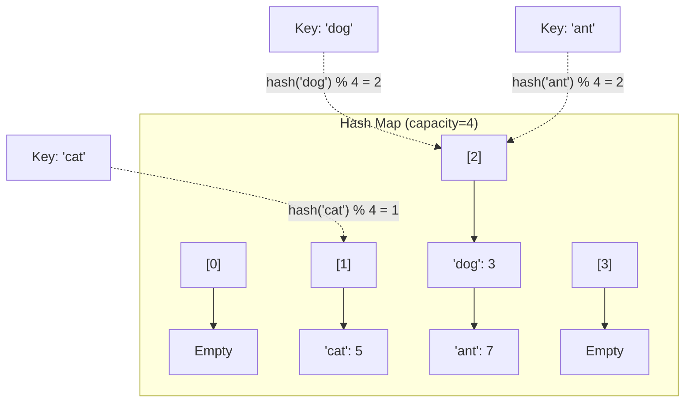

# Hash Map - Python Implementation

## Why Hash Map?

### The Problem It Solves

Imagine you're building an address book application. You have thousands of contacts, and users constantly search for people by name. With a simple list, every search would require checking each contact one by one until you find a match. For 10,000 contacts, that's potentially 10,000 comparisons per lookup.

What if you could look up any contact almost instantly, regardless of how many you have?

This is exactly what a hash map provides: **near-instant lookup by key**. Instead of searching through everything, a hash map uses a clever mathematical trick to jump directly to where your data lives.

### Real-World Analogies

**Library Card Catalog**: Before digital systems, libraries used card catalogs organized by author's last name. Want a book by "Smith"? Go directly to the "S" drawer. You don't scan through every card in the library - you use a system that tells you exactly where to look.

**Hotel Room Keys**: When you check into a hotel, you don't search every room for yours. Your room number (the "key") tells you exactly which floor and door to go to. A hash map works similarly - your key gets transformed into a location.

**Filing Cabinet with Labeled Folders**: You have folders labeled A-Z. When you file a document for "Johnson," it goes in the J folder. When you need it later, you go straight to J. The hash map's "hash function" is like your system for deciding which folder something belongs in.

### When to Use It

- **Use a hash map when you need to**:
  - Look up values by a unique identifier (user ID, email, product code)
  - Check if something exists in a collection (membership testing)
  - Count occurrences (word frequency, vote tallying)
  - Cache computed results (memoization)
  - Group related data (students by grade, orders by customer)

- **Unlike an array**: Hash maps let you use any hashable value as an index, not just integers 0, 1, 2...

- **Unlike a list**: Hash maps provide O(1) average lookup instead of O(n) scanning

---

## Core Concept

### The Big Idea

A hash map stores key-value pairs and uses a **hash function** to convert any key into an array index. This transformation is the magic that enables constant-time lookups.

Here's the insight: instead of organizing data by position (like an array) or order (like a linked list), we organize by **computed location**. The key itself tells us where to store and find its value.

The formula is simple:
```
index = hash(key) % capacity
```

The hash function produces a large number from the key. The modulo operation (%) constrains it to a valid array index.

### Visual Representation



Notice that both "dog" and "ant" hash to bucket 2. This is called a **collision**, and we handle it by storing multiple entries in the same bucket (a technique called **separate chaining**).

### Key Terminology

- **Hash Function**: A function that converts a key into a number. Python provides `hash()` for this purpose. Good hash functions spread keys evenly across buckets.

- **Bucket**: A container at each array index. In our implementation, each bucket is a Python list that can hold multiple key-value pairs.

- **Collision**: When two different keys hash to the same bucket index. This is inevitable - we have infinite possible keys but finite buckets.

- **Separate Chaining**: Our collision resolution strategy. Each bucket holds a list of all entries that hash to that index.

- **Load Factor**: The ratio of entries to buckets (`size / capacity`). When it gets too high, performance degrades because buckets get crowded.

- **Rehashing**: Doubling the bucket array and redistributing all entries when load factor exceeds a threshold (0.75 in our implementation).

---

## How It Works: Step-by-Step

### Operation 1: Put (Insert or Update)

**What it does**: Stores a value associated with a key. If the key already exists, updates its value.

**Step-by-step walkthrough**:

Let's insert `"apple": 10` into an empty hash map with capacity 4.

Starting state:
```
Buckets: [[], [], [], []]
          0   1   2   3
Size: 0
```

Step 1: Compute the bucket index
```
hash("apple") = 8897016920073108465  (example value)
8897016920073108465 % 4 = 1

The key "apple" belongs in bucket 1.
```

Step 2: Check if key exists in that bucket
```
Bucket 1 is empty [], so "apple" is not already present.
```

Step 3: Append the new entry
```
Buckets: [[], [("apple", 10)], [], []]
          0        1           2   3
Size: 1
```

Step 4: Check load factor
```
Load factor = 1/4 = 0.25
0.25 <= 0.75, so no rehash needed.
```

**Why this approach?** By computing an index from the key, we avoid searching the entire data structure. We only need to search within one bucket, which (with good hashing and load factor management) contains very few entries.

### Operation 2: Get (Lookup)

**What it does**: Retrieves the value associated with a key, or raises `KeyError` if not found.

**Step-by-step walkthrough**:

Let's look up `"apple"` in our hash map:

Starting state:
```
Buckets: [[], [("apple", 10)], [], []]
          0        1           2   3
```

Step 1: Compute the bucket index
```
hash("apple") % 4 = 1

We need to look in bucket 1.
```

Step 2: Search the bucket
```
Bucket 1 contains: [("apple", 10)]

Iterate through entries:
  - ("apple", 10): key "apple" matches! Return 10.
```

**What if the key doesn't exist?**

Looking up `"banana"`:
```
hash("banana") % 4 = 2  (example)

Bucket 2 is empty: []

No match found. Raise KeyError("banana").
```

### Operation 3: Remove (Delete)

**What it does**: Removes a key-value pair and returns the value, or returns `None` if not found.

**Step-by-step walkthrough**:

Removing `"apple"` from:
```
Buckets: [[], [("apple", 10), ("grape", 20)], [], []]
          0              1                    2   3
Size: 2
```

Step 1: Compute bucket index
```
hash("apple") % 4 = 1
```

Step 2: Search bucket for the key
```
Bucket 1: [("apple", 10), ("grape", 20)]

Index 0: ("apple", 10) - key matches!
```

Step 3: Remove the entry using `pop(0)`
```
Bucket 1 becomes: [("grape", 20)]
Size: 1
Return value: 10
```

Final state:
```
Buckets: [[], [("grape", 20)], [], []]
          0         1          2   3
Size: 1
```

### Operation 4: Rehash (Resize and Redistribute)

**What it does**: When the load factor exceeds 0.75, doubles the capacity and moves all entries to their new positions.

**Step-by-step walkthrough**:

Starting with capacity 4 and 3 entries (load factor = 0.75):
```
Buckets: [[("cat", 1)], [("dog", 2)], [("ant", 3)], []]
              0              1             2         3
Size: 3, Capacity: 4
```

Now we insert `"bee": 4`, and let's say `hash("bee") % 4 = 1`:
```
After insertion:
Buckets: [[("cat", 1)], [("dog", 2), ("bee", 4)], [("ant", 3)], []]
Size: 4, Capacity: 4
Load factor = 4/4 = 1.0 > 0.75

Rehash triggered!
```

Step 1: Save old buckets and create new array
```
Old buckets saved
New capacity: 8
New buckets: [[], [], [], [], [], [], [], []]
                0   1   2   3   4   5   6   7
```

Step 2: Reinsert each entry with new hash index
```
Each key gets a new bucket index because we mod by 8 now instead of 4:

hash("cat") % 8 = 5  -> bucket 5
hash("dog") % 8 = 1  -> bucket 1
"ant": let's say     -> bucket 6
"bee": let's say     -> bucket 4
```

Final state:
```
Buckets: [[], [("dog", 2)], [], [], [("bee", 4)], [("cat", 1)], [("ant", 3)], []]
          0       1         2   3        4             5             6         7
Size: 4, Capacity: 8
Load factor = 4/8 = 0.5
```

**Why rehash at 0.75?** This threshold balances memory usage against performance. Higher load factors save memory but increase collision probability, making bucket searches longer. 0.75 is a widely-used sweet spot.

### Worked Example: Complete Sequence

Let's trace through building a word frequency counter:

```
Initial state:
Buckets: [[], [], [], []]  (capacity 4)
Size: 0
```

**Operation 1: put("the", 1)**
```
hash("the") % 4 = 2

Buckets: [[], [], [("the", 1)], []]
          0   1        2         3
Size: 1, Load factor: 0.25
```

**Operation 2: put("cat", 1)**
```
hash("cat") % 4 = 1

Buckets: [[], [("cat", 1)], [("the", 1)], []]
          0        1             2         3
Size: 2, Load factor: 0.5
```

**Operation 3: put("sat", 1)**
```
hash("sat") % 4 = 2  (collision with "the"!)

Buckets: [[], [("cat", 1)], [("the", 1), ("sat", 1)], []]
          0        1                  2                 3
Size: 3, Load factor: 0.75
```

**Operation 4: put("on", 1)**
```
hash("on") % 4 = 0

After insertion: Size = 4, Load factor = 1.0 > 0.75
REHASH TRIGGERED! New capacity: 8

All entries redistributed:
Buckets: [...entries spread across 8 buckets...]
Size: 4, Load factor: 0.5
```

**Operation 5: put("the", 2)** (update existing key)
```
hash("the") % 8 = ? (find the bucket)

Search bucket, find ("the", 1), replace with ("the", 2)
Size remains 4 (update, not insert)
```

**Operation 6: get("cat")**
```
hash("cat") % 8 = ? (find the bucket)

Search bucket, find ("cat", 1), return 1
```

**Operation 7: remove("sat")**
```
hash("sat") % 8 = ? (find the bucket)

Search bucket, find ("sat", 1), remove it, return 1
Size: 3
```

---

## From Concept to Code

### The Data Structure

Before looking at code, let's understand what we need to track:

1. **Buckets** - An array of lists. Each list holds (key, value) tuples that hash to that index.

2. **Capacity** - The number of buckets. Determines how we compute indices (`hash(key) % capacity`).

3. **Size** - The total number of key-value pairs stored. Used for load factor calculation.

### Python Implementation

```python
class HashMap:
    def __init__(self, capacity=16):
        self._capacity = capacity
        self._size = 0
        self._buckets = [[] for _ in range(capacity)]
```

**Understanding each field**:

- `self._capacity = capacity`: We start with 16 buckets by default. More buckets = fewer collisions, but more memory. 16 is a reasonable starting point.

- `self._size = 0`: We track how many entries we have. This is different from capacity - a hash map with capacity 16 might have 0, 5, or 12 entries.

- `self._buckets = [[] for _ in range(capacity)]`: This creates a list of empty lists. Each position is an independent list that will hold entries.

**Why `[[] for _ in range(capacity)]` instead of `[[]] * capacity`?**

This is a classic Python gotcha:
```python
# WRONG: Creates 16 references to the SAME list
buckets = [[]] * 16
buckets[0].append("hello")
print(buckets)  # [['hello'], ['hello'], ['hello'], ...]  All modified!

# RIGHT: Creates 16 INDEPENDENT lists
buckets = [[] for _ in range(16)]
buckets[0].append("hello")
print(buckets)  # [['hello'], [], [], ...]  Only bucket 0 modified
```

### Computing the Bucket Index

```python
def _bucket_index(self, key):
    return hash(key) % self._capacity
```

**How Python's `hash()` works**:

Python's built-in `hash()` function returns an integer for any "hashable" object:

```python
hash("hello")    # -8103770210014465245 (varies by Python session)
hash(42)         # 42
hash((1, 2, 3))  # 529344067295497451
```

**Important properties**:
1. The same key always produces the same hash (within one program run)
2. Different keys usually produce different hashes (but not guaranteed - that's why we handle collisions)
3. Hash values can be negative or very large, which is why we use `%` to constrain them

**What can be a key?**

Only "hashable" types can be keys. In Python:
- Hashable (can be keys): `int`, `float`, `str`, `tuple` (if contents are hashable), `frozenset`
- Not hashable (cannot be keys): `list`, `dict`, `set`

```python
hash([1, 2, 3])  # TypeError: unhashable type: 'list'
```

Why? Mutable objects could change after being inserted, breaking the "same key = same hash" requirement.

### Implementing Put

**The algorithm in plain English**:
1. Find which bucket this key belongs in
2. Check if the key already exists in that bucket
3. If yes, update the value
4. If no, add a new entry
5. If load factor exceeds 0.75, rehash

```python
def put(self, key, value):
    index = self._bucket_index(key)
    bucket = self._buckets[index]
    for i, (k, v) in enumerate(bucket):
        if k == key:
            bucket[i] = (key, value)
            return
    bucket.append((key, value))
    self._size += 1
    if self._size / self._capacity > 0.75:
        self._rehash()
```

**Understanding the tricky parts**:

- `for i, (k, v) in enumerate(bucket)`: This simultaneously gives us the index `i` and unpacks each tuple into `k` (key) and `v` (value). We need `i` so we can update in place.

- `bucket[i] = (key, value)`: Tuples are immutable, so we can't do `bucket[i][1] = value`. Instead, we replace the entire tuple. Notice we use `key` (not `k`) to ensure we store the exact key provided.

- `return` after update: This prevents incrementing size and potentially triggering an unnecessary rehash for updates.

- `self._size / self._capacity > 0.75`: Python 3 uses true division, so this works correctly. In Python 2, you'd need `float(self._size) / self._capacity`.

### Implementing Get

**The algorithm in plain English**:
1. Find the bucket for this key
2. Search through the bucket for a matching key
3. Return the value if found, raise KeyError if not

```python
def get(self, key):
    index = self._bucket_index(key)
    for k, v in self._buckets[index]:
        if k == key:
            return v
    raise KeyError(key)
```

**Why raise `KeyError`?** This matches Python's dict behavior. When you do `d["missing"]` on a dict, you get `KeyError`. Being consistent with Python's conventions makes our HashMap feel natural to use.

The alternative `get_or` method provides a safe fallback:

```python
def get_or(self, key, default):
    try:
        return self.get(key)
    except KeyError:
        return default
```

This mirrors `dict.get(key, default)`.

### Implementing Remove

```python
def remove(self, key):
    index = self._bucket_index(key)
    bucket = self._buckets[index]
    for i, (k, v) in enumerate(bucket):
        if k == key:
            bucket.pop(i)
            self._size -= 1
            return v
    return None
```

**Understanding `bucket.pop(i)`**: This removes the element at index `i` from the list. Unlike dict's `del`, our `remove` returns `None` for missing keys instead of raising an exception. However, `__delitem__` (used with `del map[key]`) does raise `KeyError` to match dict behavior.

### Implementing Rehash

```python
def _rehash(self):
    old_buckets = self._buckets
    self._capacity *= 2
    self._buckets = [[] for _ in range(self._capacity)]
    self._size = 0
    for bucket in old_buckets:
        for key, value in bucket:
            self.put(key, value)
```

**Why reset `self._size = 0`?** Since we're calling `put()` for each entry, and `put()` increments `_size`, we start at 0 to get the correct final count.

**Why not just copy buckets?** Because the bucket index depends on capacity. When capacity changes from 4 to 8, an entry that was at index `hash(key) % 4 = 3` might now belong at `hash(key) % 8 = 7`. Every entry must be re-placed.

### The Dunder Methods (Magic Methods)

Python's "dunder" (double underscore) methods let our HashMap work with built-in syntax:

```python
def __len__(self):
    return self._size

def __contains__(self, key):
    return self.contains(key)

def __getitem__(self, key):
    return self.get(key)

def __setitem__(self, key, value):
    self.put(key, value)

def __delitem__(self, key):
    if not self.contains(key):
        raise KeyError(key)
    self.remove(key)

def __iter__(self):
    for bucket in self._buckets:
        for k, v in bucket:
            yield k
```

**What these enable**:

```python
# Without dunders          # With dunders
map.size()                  len(map)
map.contains("x")           "x" in map
map.get("x")                map["x"]
map.put("x", 5)             map["x"] = 5
map.remove("x")             del map["x"]
for k in map.keys():        for k in map:
```

**Understanding `__iter__` and `yield`**:

The `yield` keyword makes this function a "generator". Instead of building a list of all keys and returning it, it produces keys one at a time:

```python
for k in map:
    print(k)  # Keys are yielded one by one, not all loaded into memory
```

This is memory-efficient: if you have a million keys and only need to check the first 10, you don't create a million-element list.

---

## Complexity Analysis

### Time Complexity

| Operation | Best | Average | Worst | Why |
|-----------|------|---------|-------|-----|
| put       | O(1) | O(1)    | O(n)  | Usually direct access; worst case: all keys in one bucket |
| get       | O(1) | O(1)    | O(n)  | Same reasoning as put |
| remove    | O(1) | O(1)    | O(n)  | Same reasoning as put |
| contains  | O(1) | O(1)    | O(n)  | Same reasoning as put |
| keys      | O(n) | O(n)    | O(n)  | Must visit every entry |
| values    | O(n) | O(n)    | O(n)  | Must visit every entry |
| clear     | O(m) | O(m)    | O(m)  | Creates m new empty lists (m = capacity) |
| copy      | O(n) | O(n)    | O(n)  | Must copy every entry |

**Understanding the "Why" column**:

The O(1) average case assumes:
1. The hash function distributes keys evenly across buckets
2. The load factor stays below 0.75 (which rehashing ensures)

Under these conditions, each bucket has roughly `n / m` entries (where n = entries, m = buckets). With load factor 0.75, that's less than 1 entry per bucket on average.

The O(n) worst case happens if all keys hash to the same bucket. This would require a catastrophically bad hash function or deliberate attack. Python's hash function prevents this for normal use.

### Space Complexity

- **Overall structure**: O(n + m) where n = number of entries, m = capacity
  - We store n key-value pairs
  - We maintain m bucket lists (mostly empty)
  - Since m scales with n (due to rehashing), this simplifies to O(n)

- **Per operation**:
  - `put`, `get`, `remove`, `contains`: O(1) - no additional data structures
  - `rehash`: O(n) - creates new bucket array, briefly holds both old and new
  - `keys`, `values`: O(n) - builds and returns a list of all keys/values

### Amortized Analysis for Rehash

**What "amortized" means**: Instead of looking at a single operation's worst case, we average the cost over a sequence of operations.

Rehashing costs O(n), but it only happens when we've inserted n/2 elements since the last rehash (since we double capacity and trigger at 75% load).

Over n insertions:
- Rehashes happen at sizes: 12, 24, 48, 96, ... (75% of 16, 32, 64, 128, ...)
- Total rehash work: 12 + 24 + 48 + ... + n = O(n)
- Total insertions: n
- Amortized cost per insertion: O(n) / n = O(1)

So even though individual rehashes are expensive, they're rare enough that the average insertion cost remains O(1).

---

## Common Mistakes & Pitfalls

### Mistake 1: Using Mutable Objects as Keys

```python
# Wrong:
map = HashMap()
my_list = [1, 2, 3]
map.put(my_list, "value")  # TypeError: unhashable type: 'list'

# Right:
map = HashMap()
my_tuple = (1, 2, 3)
map.put(my_tuple, "value")  # Works! Tuples are hashable
```

**Why this matters**: If you could use a list as a key and then modify that list, the hash would change. The entry would be "lost" - stored in one bucket but searched for in another.

### Mistake 2: Expecting Iteration Order

```python
# Might not work as expected:
map = HashMap()
map.put("first", 1)
map.put("second", 2)
map.put("third", 3)

for key in map:
    print(key)  # Order is NOT guaranteed to be first, second, third!
```

**Why this matters**: Hash maps organize by hash value, not insertion order. If you need order, use a different data structure or Python's built-in `dict` (which maintains insertion order since Python 3.7).

### Mistake 3: Modifying While Iterating

```python
# Wrong:
for key in map:
    if some_condition(key):
        del map[key]  # Modifying during iteration - unpredictable behavior!

# Right:
keys_to_remove = [key for key in map if some_condition(key)]
for key in keys_to_remove:
    del map[key]
```

**Why this matters**: Deleting entries might trigger structural changes. Collect keys first, then modify.

### Mistake 4: Confusing `remove()` and `del`

```python
# remove() returns the value (or None if missing):
value = map.remove("key")  # Returns value or None

# del raises KeyError if missing:
del map["key"]  # Raises KeyError if "key" not found

# Choose based on your needs:
# Use remove() when missing keys are normal
# Use del when missing keys are bugs
```

### Mistake 5: Forgetting That Hash Values Change Between Runs

```python
# This value changes every time you run Python:
print(hash("hello"))  # Different each execution!

# Don't store hash values and expect them to persist:
stored_hash = hash("hello")
# ... save to file, restart Python ...
# hash("hello") will NOT equal stored_hash!
```

**Why this matters**: Python randomizes hashes for security reasons (to prevent hash collision attacks). Never persist hash values.

---

## Practice Problems

To solidify your understanding, try implementing:

1. **`items()` method**: Return a list of all `(key, value)` tuples. Similar to Python's `dict.items()`.

2. **`update(other)` method**: Merge another HashMap into this one, overwriting existing keys. Like `dict.update()`.

3. **Custom hash function**: Modify the HashMap to accept a custom hash function in the constructor. Test it with a function that always returns the same value - observe how performance degrades.

4. **Word frequency counter**: Use your HashMap to count word frequencies in a text file. Print the top 10 most common words.

5. **LRU Cache**: Build a Least Recently Used cache using a HashMap combined with a doubly-linked list. The cache should have a maximum size and evict the least recently accessed item when full.

---

## Summary

### Key Takeaways

- A hash map provides O(1) average-case lookup by converting keys to array indices via a hash function

- Collisions (multiple keys hashing to the same index) are handled with separate chaining - storing multiple entries in each bucket

- The load factor (entries / capacity) determines when to rehash. Keeping it below 0.75 maintains O(1) performance

- Python's `hash()` function works with any immutable (hashable) type. Mutable objects like lists cannot be keys

- Dunder methods (`__getitem__`, `__setitem__`, etc.) let our HashMap use familiar dict syntax

- Hash maps trade memory for speed - they use more space than a simple list, but provide much faster lookups

### Quick Reference

```
HashMap - Key-value storage with O(1) average access
|-- put(key, value):  O(1) avg  - Insert or update a pair
|-- get(key):         O(1) avg  - Retrieve value (KeyError if missing)
|-- get_or(key, def): O(1) avg  - Retrieve with default fallback
|-- remove(key):      O(1) avg  - Delete and return value
|-- contains(key):    O(1) avg  - Check if key exists
|-- keys():           O(n)      - List all keys
|-- values():         O(n)      - List all values
|-- clear():          O(m)      - Remove all entries
|-- copy():           O(n)      - Create shallow copy

Dict-like syntax:
  map["key"] = value    # put
  value = map["key"]    # get
  del map["key"]        # remove (with KeyError)
  "key" in map          # contains
  len(map)              # size
  for key in map:       # iterate keys

Best for: Fast lookups by key, membership testing, caching, counting
Avoid when: You need ordered data, memory is extremely constrained, or keys aren't hashable
```
