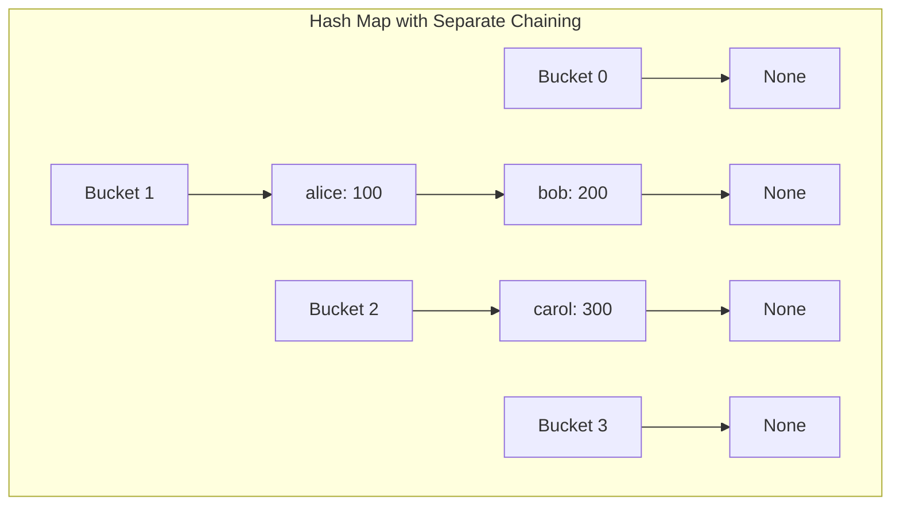

# Hash Map - Rust Implementation

## Why Hash Map?

### The Problem It Solves

Imagine you're building an address book application. You have thousands of contacts, and users want to look up phone numbers by name instantly. With a simple list, you'd have to check every single contact until you find the right one - that could mean checking all 10,000 entries just to find "Zoe"!

What if, instead of searching through everything, you could calculate exactly where to look? That's the magic of a hash map: it transforms keys (like names) into array indices, giving you near-instant lookups regardless of how many items you're storing.

### Real-World Analogies

**Library Card Catalog**: Old libraries had card catalogs organized by author's last name. To find "Hemingway," you go directly to the "H" drawer. You don't search from A to Z - you jump straight to the right location. A hash map works similarly, but with a mathematical formula instead of alphabetical order.

**Coat Check at a Theater**: You hand over your coat and get a numbered ticket. When you return, you give the ticket number, and the attendant goes directly to that spot. The ticket number is like a hash - it tells you exactly where to find your item.

**Post Office Boxes**: Each box has a unique number. To retrieve your mail, you don't search through every box - you go straight to your number. The hash function is like the system that assigns box numbers.

### When to Use It

- **Use a hash map when you need to:**
  - Look up values by key in constant time
  - Store key-value pairs with unique keys
  - Count occurrences of items (word frequency, etc.)
  - Cache computed results (memoization)
  - Remove duplicates while tracking associated data

- **Unlike an array:** A hash map lets you use any hashable type as an "index," not just integers 0 to n-1.

- **Unlike a balanced tree:** A hash map offers O(1) average lookup vs O(log n), but doesn't maintain sorted order.

---

## Core Concept

### The Big Idea

A hash map achieves fast lookups by using a **hash function** to convert keys into array indices. Instead of searching through all entries, we compute where an entry *should* be stored, then look directly there. When two different keys map to the same index (a "collision"), we handle it by storing multiple entries at that location using a linked list - this is called **separate chaining**.

### Visual Representation



In this diagram:
- We have 4 buckets (indices 0-3)
- "alice" and "bob" both hashed to bucket 1, forming a chain
- "carol" hashed to bucket 2 alone
- Buckets 0 and 3 are empty (None)

### Key Terminology

- **Hash Function**: A function that converts a key into a number (the hash code), which is then reduced to a valid array index using modulo.

- **Bucket**: A slot in the underlying array. Each bucket can hold zero, one, or multiple entries (via chaining).

- **Collision**: When two different keys produce the same bucket index. This is inevitable when you have more possible keys than buckets.

- **Separate Chaining**: A collision resolution strategy where each bucket holds a linked list of entries. All entries that hash to the same bucket are stored in that bucket's chain.

- **Load Factor**: The ratio of entries to buckets (size / capacity). When this exceeds a threshold (commonly 0.75), we resize to maintain fast operations.

- **Rehashing**: Doubling the bucket array and redistributing all entries based on the new capacity.

---

## How It Works: Step-by-Step

### Operation 1: Insert

**What it does**: Stores a key-value pair in the map. If the key already exists, updates its value.

**Step-by-step walkthrough**:

Let's insert three entries into a hash map with capacity 4. We'll use a simplified hash function for illustration: `hash(key) = first_letter_position % 4`

Starting state:
```
Buckets: [None, None, None, None]
Size: 0, Capacity: 4
```

Step 1: Insert ("apple", 10)
```
hash("apple") = 0 % 4 = 0
Bucket 0 is empty, so create new entry at head

Buckets: [Some(apple:10 -> None), None, None, None]
Size: 1
```

Step 2: Insert ("banana", 20)
```
hash("banana") = 1 % 4 = 1
Bucket 1 is empty, so create new entry at head

Buckets: [Some(apple:10 -> None), Some(banana:20 -> None), None, None]
Size: 2
```

Step 3: Insert ("avocado", 30) - Collision!
```
hash("avocado") = 0 % 4 = 0
Bucket 0 already has "apple"!

Walk the chain: "apple" != "avocado", and apple.next is None
Key not found, so prepend new entry at head

Buckets: [Some(avocado:30 -> apple:10 -> None), Some(banana:20 -> None), None, None]
Size: 3
```

Step 4: Insert ("apple", 99) - Update existing key
```
hash("apple") = 0 % 4 = 0
Walk the chain: "avocado" != "apple", check next
"apple" == "apple" - found it!

Update value in place, don't change size

Buckets: [Some(avocado:30 -> apple:99 -> None), Some(banana:20 -> None), None, None]
Size: 3 (unchanged)
```

**Why this approach?** Prepending to the head of the chain is O(1) - we don't need to traverse the entire chain just to add a new entry. The trade-off is that the most recently inserted items come first, which might not be cache-optimal, but the simplicity is worth it.

### Operation 2: Get (Lookup)

**What it does**: Retrieves the value associated with a key, or indicates the key doesn't exist.

**Step-by-step walkthrough**:

Using our map from above: `[avocado:30 -> apple:99, banana:20, None, None]`

Looking up "apple":
```
Step 1: hash("apple") = 0 % 4 = 0
Step 2: Go to bucket 0, current = avocado:30
Step 3: "avocado" != "apple", move to next: apple:99
Step 4: "apple" == "apple", found!
Return Some(&99)
```

Looking up "cherry" (not in map):
```
Step 1: hash("cherry") = 2 % 4 = 2
Step 2: Go to bucket 2, bucket is None
Return None
```

Looking up "apricot" (not in map, but bucket has entries):
```
Step 1: hash("apricot") = 0 % 4 = 0
Step 2: Go to bucket 0, current = avocado:30
Step 3: "avocado" != "apricot", move to next: apple:99
Step 4: "apple" != "apricot", move to next: None
Step 5: Reached end of chain without finding key
Return None
```

### Operation 3: Remove

**What it does**: Removes an entry by key and returns the value that was stored.

**Step-by-step walkthrough**:

Starting state: `[avocado:30 -> apple:99, banana:20, None, None]`

Removing "avocado" (head of chain):
```
Step 1: hash("avocado") = 0
Step 2: Bucket 0's head is "avocado" - matches!
Step 3: Take the entry out, replace bucket head with entry.next

Buckets: [Some(apple:99 -> None), Some(banana:20 -> None), None, None]
Size: 2
Return Some(30)
```

Removing "apple" (middle of chain, if we had started fresh):

Starting: `[avocado:30 -> apple:99 -> None, ...]`
```
Step 1: hash("apple") = 0
Step 2: Bucket head "avocado" != "apple"
Step 3: Check avocado.next - it's "apple" - matches!
Step 4: Take apple out, set avocado.next = apple.next (None)

Buckets: [Some(avocado:30 -> None), ...]
Return Some(99)
```

**Why the special case for head removal?** We need to update the bucket itself when removing the first entry, but we need to update the *previous entry's next pointer* when removing from the middle. These are fundamentally different operations in a singly-linked list.

### Operation 4: Rehash

**What it does**: Doubles the capacity and redistributes all entries to their new positions.

**Step-by-step walkthrough**:

Starting state (load factor exceeded):
```
Capacity: 4, Size: 3, Load: 0.75 (at threshold)
Buckets: [avocado:30 -> apple:99, banana:20, None, None]
```

Insert triggers rehash when size would exceed threshold:
```
Step 1: Create new bucket array with capacity 8
        [None, None, None, None, None, None, None, None]

Step 2: Swap old buckets out using mem::replace()

Step 3: Re-insert each entry:
        hash("avocado") with capacity 8 = might be 0 or different
        hash("apple") with capacity 8 = might be 0 or different
        hash("banana") with capacity 8 = might be 1 or different

Step 4: Entries are now distributed across 8 buckets
        Chains are likely shorter now
```

**Why rehash?** As the load factor increases, chains get longer, and O(1) operations degrade toward O(n). By keeping the load factor below 0.75, we ensure most buckets have 0 or 1 entries, maintaining fast performance.

### Worked Example: Complete Sequence

Let's trace through building a user score tracker:

```
Initial: HashMap::with_capacity(4)
Buckets: [None, None, None, None]
Size: 0, Capacity: 4, Load: 0.0

Operation 1: insert("alice", 100)
hash("alice") % 4 = let's say 2
Buckets: [None, None, alice:100, None]
Size: 1, Load: 0.25

Operation 2: insert("bob", 85)
hash("bob") % 4 = let's say 1
Buckets: [None, bob:85, alice:100, None]
Size: 2, Load: 0.5

Operation 3: insert("carol", 92)
hash("carol") % 4 = let's say 1 (collision with bob!)
Buckets: [None, carol:92 -> bob:85, alice:100, None]
Size: 3, Load: 0.75

Operation 4: insert("dave", 78)
Load would be 4/4 = 1.0 > 0.75, triggers rehash first!

After rehash (capacity 8):
All entries redistributed to new positions
Then dave is inserted

Size: 4, Capacity: 8, Load: 0.5

Operation 5: get(&"bob")
hash("bob") % 8 = find bucket
Walk chain until "bob" found
Return Some(&85)

Operation 6: remove(&"carol")
hash("carol") % 8 = find bucket
Walk chain, find carol, unlink it
Return Some(92)
Size: 3

Operation 7: get(&"carol")
hash("carol") % 8 = find bucket
Walk chain, reach end without finding
Return None

Operation 8: insert("alice", 150) - update!
hash("alice") % 8 = find bucket
Walk chain, find alice, update value
Size still 3 (no new entry)

Final state:
Contains: alice:150, bob:85, dave:78
Size: 3, Capacity: 8
```

---

## From Concept to Code

### The Data Structure

Before looking at code, let's understand what we need to track:

1. **An entry** stores a key, a value, and a pointer to the next entry in its chain
2. **The map** needs an array of buckets, where each bucket is either empty or points to a chain
3. **Metadata**: current size (number of entries) and capacity (number of buckets)

In Rust, we face a unique challenge: the compiler needs to know the size of every type at compile time. An entry that contains another entry would be infinite! We solve this with `Box<Entry>` - a heap-allocated pointer with known size.

### Rust Implementation

```rust
struct Entry<K, V> {
    key: K,
    value: V,
    next: Option<Box<Entry<K, V>>>,
}

pub struct HashMap<K, V> {
    buckets: Vec<Option<Box<Entry<K, V>>>>,
    size: usize,
    capacity: usize,
}
```

**Line-by-line breakdown**:

- `struct Entry<K, V>` - A generic struct that works with any key type `K` and value type `V`
- `key: K` - The entry owns its key
- `value: V` - The entry owns its value
- `next: Option<Box<Entry<K, V>>>` - Optionally points to the next entry in the chain
  - `Option` because there might not be a next entry (`None` = end of chain)
  - `Box` because we need heap allocation for the recursive type

- `pub struct HashMap<K, V>` - Public so users can create hash maps
- `buckets: Vec<Option<Box<Entry<K, V>>>>` - A vector of optional entry pointers
  - `Vec` gives us a resizable array
  - `Option<Box<Entry>>` means each bucket is either empty (`None`) or has a chain (`Some`)
- `size: usize` - How many key-value pairs we're storing
- `capacity: usize` - How many buckets we have

### Understanding Trait Bounds: `Hash + Eq`

```rust
impl<K: Hash + Eq, V> HashMap<K, V> {
```

This line says "this implementation works for any `K` that implements both `Hash` and `Eq`". But what are these traits?

**`Hash` trait**: Allows a type to be converted to a hash value
```rust
// Types that implement Hash can be hashed:
"hello".hash(&mut hasher);  // strings are Hash
42.hash(&mut hasher);        // integers are Hash
vec![1,2,3].hash(&mut hasher); // ERROR: Vec doesn't implement Hash
```

**`Eq` trait**: Allows full equality comparison (reflexive, symmetric, transitive)
```rust
// Types that implement Eq can be compared with ==
"hello" == "hello"  // true, strings are Eq
42 == 42            // true, integers are Eq
f64::NAN == f64::NAN // false! floats are NOT Eq (only PartialEq)
```

Why do we need both? We need `Hash` to compute the bucket index, and `Eq` to compare keys when walking a chain (since multiple keys can hash to the same bucket).

### Implementing the Hash Function

```rust
fn hash(&self, key: &K) -> usize {
    let mut hasher = DefaultHasher::new();
    key.hash(&mut hasher);
    (hasher.finish() as usize) % self.capacity
}
```

**Understanding this code**:

1. `DefaultHasher::new()` - Creates a new hasher instance using Rust's SipHash algorithm
2. `key.hash(&mut hasher)` - Feeds the key's bytes into the hasher (this is where the `Hash` trait is used)
3. `hasher.finish()` - Produces a 64-bit hash value
4. `% self.capacity` - Reduces the hash to a valid bucket index (0 to capacity-1)

The key takes `&K` (a reference) because we don't need to take ownership - we're just reading the key to compute its hash.

### Implementing Insert

**The algorithm in plain English**:
1. Check if we need to rehash (load factor too high)
2. Compute the bucket index from the key
3. Walk the chain looking for an existing entry with this key
4. If found, update the value and return
5. If not found, create a new entry at the head of the chain

**The code**:

```rust
pub fn insert(&mut self, key: K, value: V) {
    if (self.size + 1) as f64 / self.capacity as f64 > Self::LOAD_FACTOR {
        self.rehash();
    }

    let index = self.hash(&key);
    let bucket = &mut self.buckets[index];

    let mut current = bucket.as_mut();
    while let Some(entry) = current {
        if entry.key == key {
            entry.value = value;
            return;
        }
        current = entry.next.as_mut();
    }

    let new_entry = Box::new(Entry {
        key,
        value,
        next: self.buckets[index].take(),
    });
    self.buckets[index] = Some(new_entry);
    self.size += 1;
}
```

**Understanding the tricky parts**:

- `&mut self` - We need mutable access because we're modifying the map
- `(self.size + 1) as f64 / self.capacity as f64` - Calculates what the load factor would be after insertion
- `bucket.as_mut()` - Converts `&mut Option<Box<Entry>>` to `Option<&mut Box<Entry>>`, letting us mutably borrow the entry inside
- `while let Some(entry) = current` - Pattern matching in a loop: continues while `current` is `Some`, binding the inner value to `entry`
- `entry.key == key` - Uses the `Eq` trait to compare keys
- `entry.value = value` - Moves `value` into the entry, replacing the old value (which is dropped)
- `self.buckets[index].take()` - The `take()` method is crucial here:
  - It removes the value from the Option, leaving `None` behind
  - Returns `Some(old_value)` if there was a value, `None` otherwise
  - This lets us "steal" the existing chain to make it the new entry's `next`

**Ownership flow for new entry creation**:
```
self.buckets[index]: Some(old_chain)
                          |
                          v  .take()
                     None, returns Some(old_chain)
                                        |
                                        v
new_entry.next = Some(old_chain)
self.buckets[index] = Some(new_entry)

Result: new_entry -> old_chain
```

### Implementing Get

**The algorithm in plain English**:
1. Compute the bucket index from the key
2. Walk the chain looking for a matching key
3. If found, return a reference to the value
4. If not found, return None

**The code**:

```rust
pub fn get(&self, key: &K) -> Option<&V> {
    let index = self.hash(key);
    let mut current = self.buckets[index].as_ref();

    while let Some(entry) = current {
        if entry.key == *key {
            return Some(&entry.value);
        }
        current = entry.next.as_ref();
    }

    None
}
```

**Understanding the tricky parts**:

- `&self` - We only need read access
- `key: &K` - We take a reference to the key, not ownership (caller keeps their key)
- `Option<&V>` - We return a reference to the value inside the map, not a copy
- `.as_ref()` - Converts `&Option<Box<Entry>>` to `Option<&Box<Entry>>` (and through deref coercion, effectively `Option<&Entry>`)
- `entry.key == *key` - We dereference `key` because `entry.key` is `K` but `key` is `&K`
- `Some(&entry.value)` - Return a reference to the value stored in the entry

**Lifetime insight**: The returned `&V` borrows from `&self`, meaning the reference is valid as long as the map isn't mutated. This is enforced at compile time!

### Implementing Remove

**The algorithm in plain English**:
1. Compute the bucket index
2. Check if the bucket is empty (return None if so)
3. If the first entry matches, remove it and link the bucket to the second entry
4. Otherwise, walk the chain looking for a match in the "next" position
5. When found, unlink the entry and return its value

**The code**:

```rust
pub fn remove(&mut self, key: &K) -> Option<V> {
    let index = self.hash(key);

    if self.buckets[index].is_none() {
        return None;
    }

    // Special case: removing the head of the chain
    if self.buckets[index].as_ref().unwrap().key == *key {
        let entry = self.buckets[index].take().unwrap();
        self.buckets[index] = entry.next;
        self.size -= 1;
        return Some(entry.value);
    }

    // General case: removing from middle or end of chain
    let mut current = self.buckets[index].as_mut().unwrap();
    while current.next.is_some() {
        if current.next.as_ref().unwrap().key == *key {
            let removed = current.next.take().unwrap();
            current.next = removed.next;
            self.size -= 1;
            return Some(removed.value);
        }
        current = current.next.as_mut().unwrap();
    }

    None
}
```

**Understanding the tricky parts**:

- `Option<V>` - We return the owned value, not a reference (the entry is being destroyed)
- `.take().unwrap()` - Takes ownership of the entry out of the Option
  - `take()` leaves `None` behind and returns `Some(entry)`
  - `unwrap()` extracts the entry from the `Some` (safe because we checked `is_some()`)
- `self.buckets[index] = entry.next` - Moves the rest of the chain up to become the bucket head
- `current.next.take().unwrap()` - Same pattern, but for removing from middle of chain
- `current.next = removed.next` - Links around the removed entry

**Why not just use a cleaner pattern?** Rust's borrow checker makes this tricky. We can't have a mutable reference to `current` while also modifying `current.next`. The `take()` pattern works around this by extracting ownership.

### Implementing Rehash

**The algorithm in plain English**:
1. Create a new bucket array with double the capacity
2. Swap it with the old bucket array
3. For each entry in the old buckets, compute its new index and insert it

**The code**:

```rust
fn rehash(&mut self) {
    let new_capacity = self.capacity * 2;
    let mut new_buckets = Vec::with_capacity(new_capacity);
    for _ in 0..new_capacity {
        new_buckets.push(None);
    }

    let old_buckets = std::mem::replace(&mut self.buckets, new_buckets);
    self.capacity = new_capacity;

    for mut bucket in old_buckets {
        while let Some(mut entry) = bucket {
            bucket = entry.next.take();
            let index = self.hash(&entry.key);
            entry.next = self.buckets[index].take();
            self.buckets[index] = Some(entry);
        }
    }
}
```

**Understanding the tricky parts**:

- `std::mem::replace(&mut self.buckets, new_buckets)` - Atomically swaps `self.buckets` with `new_buckets`, returning the old value
  - This is safer than temporarily having an invalid state
  - The old buckets are now owned by `old_buckets`

- `for mut bucket in old_buckets` - Takes ownership of each bucket from the old vec
  - `mut` because we'll be modifying it as we extract entries

- `while let Some(mut entry) = bucket` - Extracts entries one by one from the chain
  - Each iteration, `bucket` becomes the next entry in the chain

- `bucket = entry.next.take()` - Saves the rest of the chain before we repurpose `entry`
  - `take()` sets `entry.next` to `None` so we can reuse the entry cleanly

- The last three lines are the same "prepend to head" pattern from `insert`

**Memory efficiency**: We're reusing the existing `Entry` allocations, just relinking them. No new allocations for entries, only for the new bucket vector.

---

## Complexity Analysis

### Time Complexity

| Operation | Best | Average | Worst | Why |
|-----------|------|---------|-------|-----|
| insert    | O(1) | O(1)    | O(n)  | Best: empty bucket. Average: short chain (good hash distribution + load factor control). Worst: all keys hash to same bucket. |
| get       | O(1) | O(1)    | O(n)  | Same reasoning as insert - depends on chain length. |
| get_mut   | O(1) | O(1)    | O(n)  | Identical to get, just returns mutable reference. |
| remove    | O(1) | O(1)    | O(n)  | Must walk chain to find entry, then O(1) to unlink. |
| contains  | O(1) | O(1)    | O(n)  | Implemented as `get(key).is_some()`. |
| keys      | O(n) | O(n)    | O(n)  | Must visit every entry in all buckets. |
| values    | O(n) | O(n)    | O(n)  | Must visit every entry in all buckets. |
| clear     | O(m) | O(m)    | O(m)  | m = capacity. Sets each bucket to None. |
| rehash    | O(n) | O(n)    | O(n)  | Must re-insert every entry. |

**Understanding the "Why" column**:

The O(1) average case depends on two factors:
1. **Good hash distribution**: A quality hash function spreads keys evenly across buckets
2. **Controlled load factor**: By rehashing when load exceeds 0.75, we keep chains short

If every key hashed to bucket 0, we'd have a linked list with O(n) operations. This is why hash function quality matters!

### Space Complexity

- **Overall structure**: O(n + m) where n = number of entries, m = capacity
  - We always have `m` bucket slots (even if empty)
  - Each of `n` entries takes constant space

- **Per operation**: O(1) for most operations
  - `rehash`: O(n) temporarily (new bucket array before old is freed)
  - `keys`/`values`: O(n) for the returned Vec
  - `clone`: O(n) for the new map

### Amortized Analysis

**What "amortized" means**: Some operations are occasionally expensive but rare enough that the cost spreads out over many operations.

**Rehashing is amortized O(1) per insert**:
- Rehash costs O(n) but only happens when size doubles
- After rehashing, we can insert n more items before the next rehash
- Total cost for n inserts: n (regular inserts) + n (one rehash) = 2n
- Amortized cost per insert: 2n/n = O(1)

This is similar to how `Vec::push` is amortized O(1) despite occasional reallocations.

---

## Common Mistakes & Pitfalls

### Mistake 1: Forgetting that keys must implement `Hash + Eq`

```rust
// Wrong: Using a type that doesn't implement Hash
struct Point { x: f64, y: f64 }  // f64 doesn't implement Hash!

let mut map: HashMap<Point, String> = HashMap::new();
// Compiler error: the trait bound `Point: Hash` is not satisfied

// Right: Derive Hash and Eq, but don't use floats for keys
#[derive(Hash, Eq, PartialEq)]
struct Point { x: i32, y: i32 }  // i32 implements Hash

let mut map: HashMap<Point, String> = HashMap::new();
map.insert(Point { x: 1, y: 2 }, "origin-ish".to_string());
```

**Why this matters**: Floating point numbers can't implement `Hash` safely because `NaN != NaN`, which breaks the fundamental contract that equal values must have equal hashes.

### Mistake 2: Using `get` when you need `get_mut`

```rust
let mut map = HashMap::new();
map.insert("score", 0);

// Wrong: Trying to modify through an immutable reference
if let Some(score) = map.get(&"score") {
    *score += 10;  // ERROR: cannot assign to `*score` which is behind a `&` reference
}

// Right: Use get_mut for mutable access
if let Some(score) = map.get_mut(&"score") {
    *score += 10;  // Works!
}
```

**Why this matters**: Rust's borrow checker distinguishes between read-only and mutable access. `get` returns `&V`, `get_mut` returns `&mut V`.

### Mistake 3: Holding a reference while trying to mutate

```rust
let mut map = HashMap::new();
map.insert("a", 1);
map.insert("b", 2);

// Wrong: Holding a reference while inserting
let a_ref = map.get(&"a");
map.insert("c", 3);  // ERROR: cannot borrow `map` as mutable because it is also borrowed as immutable
println!("{:?}", a_ref);

// Right: Don't hold references across mutations
let a_val = map.get(&"a").copied();  // Copy the value out
map.insert("c", 3);  // Now this works
println!("{:?}", a_val);
```

**Why this matters**: If you hold a reference into the map and then insert, a rehash might move memory, invalidating your reference. Rust prevents this at compile time.

### Mistake 4: Expecting ordered iteration

```rust
let mut map = HashMap::new();
map.insert(3, "three");
map.insert(1, "one");
map.insert(2, "two");

// Wrong assumption: keys come out in insertion order
for key in map.keys() {
    println!("{}", key);  // Could print in any order!
}

// If you need order, use a different structure or sort
let mut keys: Vec<_> = map.keys().collect();
keys.sort();
for key in keys {
    println!("{}", key);  // Now guaranteed: 1, 2, 3
}
```

**Why this matters**: Hash maps provide no ordering guarantees. Key order depends on hash values and bucket distribution, which can change after rehashing.

### Mistake 5: Confusing `Option` return with panicking

```rust
// Wrong: Assuming get returns the value directly
let map: HashMap<&str, i32> = HashMap::new();
let value = map.get(&"missing");  // This is Option<&i32>, not i32!
println!("{}", value);  // ERROR: Option doesn't implement Display

// Right: Handle the Option
match map.get(&"missing") {
    Some(v) => println!("Found: {}", v),
    None => println!("Not found"),
}

// Or use unwrap_or for a default
let value = map.get(&"missing").unwrap_or(&0);
println!("{}", value);  // Prints: 0
```

**Why this matters**: Rust uses `Option` instead of null or exceptions. You must explicitly handle the case where the key doesn't exist.

---

## Practice Problems

To solidify your understanding, try implementing:

1. **`entry` API**: Implement a method that returns an `Entry` enum allowing efficient "get or insert" patterns:
   ```rust
   map.entry("key").or_insert(default_value)
   ```

2. **`iter` method**: Return an iterator over `(&K, &V)` pairs instead of collecting into vectors. This is more memory-efficient for large maps.

3. **Custom hash function**: Modify the implementation to accept a custom hasher, allowing users to choose between security (SipHash) and speed (FxHash, AHash).

4. **Open addressing**: Reimplement using linear probing instead of separate chaining. Compare the performance characteristics.

5. **LRU Cache**: Build a Least Recently Used cache on top of your hash map by combining it with a doubly-linked list.

---

## Summary

### Key Takeaways

- A hash map achieves O(1) average-case lookup by converting keys to array indices via a hash function
- Collisions are handled with separate chaining: each bucket holds a linked list of entries
- Load factor control (rehashing at 75% full) keeps chains short and operations fast
- Rust's type system enforces that keys must implement `Hash` (for hashing) and `Eq` (for comparison)
- `Option<Box<Entry>>` provides null-safety: no null pointer bugs possible
- The `take()` pattern is essential for moving values out of Options during removal and rehashing
- References returned by `get`/`get_mut` are lifetime-bound to the map, preventing use-after-free bugs

### Quick Reference

```
HashMap<K, V> -- Generic key-value store with O(1) average operations
├── new()           : O(1) -- Create empty map with default capacity 16
├── with_capacity() : O(m) -- Create empty map with specified capacity
├── insert(k, v)    : O(1)* -- Insert or update; may trigger O(n) rehash
├── get(&k)         : O(1) -- Returns Option<&V>
├── get_mut(&k)     : O(1) -- Returns Option<&mut V>
├── remove(&k)      : O(1) -- Returns Option<V> (owned value)
├── contains(&k)    : O(1) -- Returns bool
├── keys()          : O(n) -- Returns Vec<&K>
├── values()        : O(n) -- Returns Vec<&V>
├── clear()         : O(m) -- Remove all entries
├── size()          : O(1) -- Number of entries
├── capacity()      : O(1) -- Number of buckets
└── is_empty()      : O(1) -- Returns size == 0

* amortized

Trait bounds: K: Hash + Eq
Clone requires: K: Clone, V: Clone

Best for: Fast key-value lookup, counting, caching, deduplication
Avoid when: You need sorted keys, ordered iteration, or guaranteed worst-case O(log n)
```
