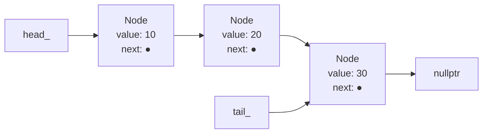

# Linked List — C++ Implementation

## Why Linked Lists?

### The Problem It Solves

Imagine you're building a playlist application. Users constantly add songs in the middle, remove tracks they don't like, and rearrange their queue. With an array, every insertion or deletion in the middle requires shifting all subsequent elements—if you insert a song at position 5 in a 1000-song playlist, you must move 995 elements. That's expensive.

The linked list solves this by abandoning the idea of contiguous memory. Instead of storing elements side-by-side, each element knows where the next one lives. Want to insert something in the middle? Just update two pointers. No shifting required.

### Real-World Analogies

**Train Cars**: Think of a train where each car has a coupling to the next car. To add a new car between two existing ones, you don't need to move any cars—just disconnect the coupling, hook up the new car on both sides, and you're done. Each car only needs to know about the one behind it.

**Scavenger Hunt**: In a scavenger hunt, each clue tells you where to find the next clue. You don't have a master list of all locations; you just follow the chain. Adding a new clue in the middle means changing what one clue points to.

**Chain of Command**: In an organization, each person knows who they report to and who reports to them. Restructuring doesn't require moving people physically—just updating reporting relationships.

### When to Use It

- **Frequent insertions/deletions at the front**: O(1) with a linked list, O(n) with arrays
- **Unknown or highly variable size**: No need to pre-allocate or resize
- **Implementing other structures**: Stacks, queues, and hash table buckets often use linked lists internally
- **When you don't need random access**: If you mostly traverse sequentially anyway

**Avoid when**:
- You need fast random access by index (arrays are O(1), linked lists are O(n))
- Memory locality matters for performance (linked list nodes are scattered in memory)
- Memory overhead is critical (each node has an extra pointer)

---

## Core Concept

### The Big Idea

A linked list is a sequence of **nodes** where each node contains a value and a pointer to the next node. Unlike arrays, the nodes don't need to be stored contiguously in memory—they can be scattered anywhere, connected only by these pointers. The list maintains a **head** pointer (the first node) and optionally a **tail** pointer (the last node) for efficient access to both ends.

### Visual Representation



The diagram shows a linked list with three elements. Each box is a Node containing a value and a `next` pointer (shown as an arrow). The `head_` pointer gives us access to the first node, and `tail_` points directly to the last node. The final node's `next` pointer is `nullptr`, signaling the end of the list.

### Key Terminology

- **Node**: A container holding one value plus a pointer to the next node
- **Head**: Pointer to the first node in the list (or `nullptr` if empty)
- **Tail**: Pointer to the last node in the list (or `nullptr` if empty)
- **nullptr**: C++'s null pointer constant, indicating "points to nothing"
- **Traversal**: Walking through the list by following next pointers from head to tail
- **Singly Linked**: Each node only points forward (to next), not backward

---

## How It Works: Step-by-Step

### Operation 1: push_front (Insert at Beginning)

**What it does**: Adds a new element at the front of the list in O(1) time.

**Step-by-step walkthrough**:

Starting state (list contains 20, 30):
```
head_ --> [20|●] --> [30|●] --> nullptr
                      ^
                    tail_
```

Step 1: Create a new node with value 10
```
new node: [10|●] --> ???

head_ --> [20|●] --> [30|●] --> nullptr
                      ^
                    tail_
```

Step 2: Point the new node's `next` to the current head
```
new node: [10|●] --> [20|●] --> [30|●] --> nullptr
                                 ^
          head_                tail_
```

Step 3: Update head_ to point to the new node
```
head_ --> [10|●] --> [20|●] --> [30|●] --> nullptr
                                 ^
                               tail_
```

**Why this approach?** We only need to update two pointers (the new node's `next` and `head_`), regardless of list size. No traversal needed, so it's O(1).

### Operation 2: push_back (Insert at End)

**What it does**: Adds a new element at the back of the list in O(1) time.

**Step-by-step walkthrough**:

Starting state (list contains 10, 20):
```
head_ --> [10|●] --> [20|●] --> nullptr
                      ^
                    tail_
```

Step 1: Create a new node with value 30
```
head_ --> [10|●] --> [20|●] --> nullptr
                      ^
                    tail_

new node: [30|●] --> nullptr
```

Step 2: Make the current tail's `next` point to the new node
```
head_ --> [10|●] --> [20|●] --> [30|●] --> nullptr
                      ^
                    tail_
```

Step 3: Update tail_ to point to the new node
```
head_ --> [10|●] --> [20|●] --> [30|●] --> nullptr
                                 ^
                               tail_
```

**Why this approach?** The tail pointer lets us access the last node directly. Without it, we'd need O(n) traversal to find the end.

### Operation 3: pop_front (Remove from Beginning)

**What it does**: Removes and returns the first element in O(1) time.

**Step-by-step walkthrough**:

Starting state (list contains 10, 20, 30):
```
head_ --> [10|●] --> [20|●] --> [30|●] --> nullptr
                                 ^
                               tail_
```

Step 1: Save a pointer to the current head node (we'll need to delete it)
```
temp --> [10|●] --> [20|●] --> [30|●] --> nullptr
          ^                      ^
        head_                  tail_
```

Step 2: Move head_ to the next node
```
temp --> [10|●] --> [20|●] --> [30|●] --> nullptr
                     ^          ^
                   head_      tail_
```

Step 3: Extract the value from the saved node, then delete it
```
head_ --> [20|●] --> [30|●] --> nullptr
                      ^
                    tail_

(node with 10 is deleted, value 10 is returned)
```

**Why this approach?** We save the node's value before deleting it, then return that value. Using `std::move` avoids copying for expensive-to-copy types.

### Operation 4: pop_back (Remove from End)

**What it does**: Removes and returns the last element. Takes O(n) time because we must find the second-to-last node.

**Step-by-step walkthrough**:

Starting state (list contains 10, 20, 30):
```
head_ --> [10|●] --> [20|●] --> [30|●] --> nullptr
                                 ^
                               tail_
```

Step 1: Traverse to find the node before tail (the one whose `next` is `tail_`)
```
head_ --> [10|●] --> [20|●] --> [30|●] --> nullptr
                      ^          ^
                     prev      tail_
```

Step 2: Save tail's value, then delete tail
```
head_ --> [10|●] --> [20|●]     (30 deleted, value saved)
                      ^
                     prev
```

Step 3: Update tail_ to prev, set prev's next to nullptr
```
head_ --> [10|●] --> [20|●] --> nullptr
                      ^
                    tail_
```

**Why O(n)?** In a singly linked list, we can't go backwards. To remove the last node, we need to update the second-to-last node's `next` pointer to `nullptr`, which means traversing from the head.

### Worked Example: Complete Sequence

Let's trace through a realistic sequence of operations:

```
Initial state: empty list
head_ = nullptr, tail_ = nullptr, size_ = 0

Operation 1: push_back(10)
head_ --> [10|●] --> nullptr
           ^
         tail_
size_ = 1

Operation 2: push_back(20)
head_ --> [10|●] --> [20|●] --> nullptr
                      ^
                    tail_
size_ = 2

Operation 3: push_front(5)
head_ --> [5|●] --> [10|●] --> [20|●] --> nullptr
                                ^
                              tail_
size_ = 3

Operation 4: insert_at(2, 15)  // Insert 15 at index 2
head_ --> [5|●] --> [10|●] --> [15|●] --> [20|●] --> nullptr
                                           ^
                                         tail_
size_ = 4

Operation 5: pop_front()  // Returns 5
head_ --> [10|●] --> [15|●] --> [20|●] --> nullptr
                                 ^
                               tail_
size_ = 3

Operation 6: remove_at(1)  // Remove index 1, returns 15
head_ --> [10|●] --> [20|●] --> nullptr
                      ^
                    tail_
size_ = 2

Operation 7: pop_back()  // Returns 20
head_ --> [10|●] --> nullptr
           ^
         tail_
size_ = 1

Operation 8: pop_front()  // Returns 10
head_ = nullptr
tail_ = nullptr
size_ = 0 (empty)
```

---

## From Concept to Code

### The Data Structure

Before looking at code, let's understand what we need to track:

1. **Node contents**: Each node needs to store a value and a pointer to the next node
2. **List endpoints**: We need quick access to the first (head) and last (tail) nodes
3. **Size**: Tracking element count lets `size()` run in O(1) instead of traversing

### C++ Implementation

```cpp
template <typename T>
class LinkedList {
private:
    struct Node {
        T value;
        Node* next;
        Node(const T& v) : value(v), next(nullptr) {}
        Node(T&& v) : value(std::move(v)), next(nullptr) {}
    };

    Node* head_;
    Node* tail_;
    size_type size_;
};
```

**Line-by-line breakdown**:

- `template <typename T>`: Makes the list generic—it can hold any type (`int`, `std::string`, custom classes, etc.)
- `struct Node`: A private inner structure invisible to users of the class
- `T value`: The actual data stored in this node
- `Node* next`: A pointer to the next node (or `nullptr` if this is the last node)
- `Node(const T& v)`: Constructor that copies the value in
- `Node(T&& v)`: Constructor that moves the value in (for efficiency with temporaries)
- `head_`: Points to the first node, or `nullptr` if the list is empty
- `tail_`: Points to the last node, or `nullptr` if the list is empty
- `size_`: Tracks how many elements are in the list

### Implementing push_front

**The algorithm in plain English**:
1. Create a new node with the given value
2. Make the new node point to the current head
3. Update head to point to the new node
4. If the list was empty, also update tail
5. Increment the size counter

**The code**:
```cpp
void push_front(const T& value) {
    Node* node = new Node(value);
    node->next = head_;
    head_ = node;
    if (tail_ == nullptr)
        tail_ = node;
    ++size_;
}
```

**Understanding the tricky parts**:

- `new Node(value)`: Allocates memory on the heap and constructs a Node. Unlike stack allocation, this memory persists until we explicitly `delete` it. Returns a pointer to the new node.

- `node->next = head_`: The arrow operator `->` dereferences the pointer and accesses the member. This is equivalent to `(*node).next = head_`. We're making our new node point to whatever head currently points to (which might be `nullptr` if the list is empty).

- `head_ = node`: Now head points to our new node. The old first node (if any) is still reachable through `node->next`.

- `if (tail_ == nullptr)`: If tail is null, the list was empty before this insertion. In that case, our new node is both the first AND last node, so tail should point to it too.

### Implementing pop_front

**The algorithm in plain English**:
1. Check if the list is empty (throw exception if so)
2. Save a pointer to the head node
3. Move the value out of the node (to return later)
4. Update head to point to the second node
5. If the list is now empty, also update tail to nullptr
6. Delete the old head node
7. Decrement size and return the value

**The code**:
```cpp
T pop_front() {
    if (head_ == nullptr)
        throw std::out_of_range("LinkedList::pop_front: list is empty");
    Node* node = head_;
    T value = std::move(node->value);
    head_ = head_->next;
    if (head_ == nullptr)
        tail_ = nullptr;
    delete node;
    --size_;
    return value;
}
```

**Understanding the tricky parts**:

- `throw std::out_of_range(...)`: C++ exception handling. If someone tries to pop from an empty list, we throw an exception rather than returning an error code. The caller can catch this with `try/catch`.

- `Node* node = head_`: We save a pointer to the node we're about to remove. We can't delete it yet because we still need to extract its value.

- `std::move(node->value)`: This casts the value to an rvalue reference, enabling move semantics. For types like `std::string` or `std::vector`, this transfers ownership of internal resources rather than copying. For primitive types like `int`, it's just a copy.

- `delete node`: Frees the memory allocated by `new`. After this line, `node` is a **dangling pointer**—it still holds an address, but that memory is no longer valid. We must not use `node` after deleting it.

### Implementing insert_at

**The algorithm in plain English**:
1. Check bounds (can insert at index 0 through size)
2. If inserting at front, delegate to push_front
3. If inserting at back, delegate to push_back
4. Otherwise, traverse to the node BEFORE the insertion point
5. Create a new node
6. Link it into the chain

**The code**:
```cpp
void insert_at(size_type index, const T& value) {
    if (index > size_)
        throw std::out_of_range("LinkedList::insert_at: index out of range");
    if (index == 0) {
        push_front(value);
        return;
    }
    if (index == size_) {
        push_back(value);
        return;
    }
    Node* prev = head_;
    for (size_type i = 0; i < index - 1; ++i)
        prev = prev->next;
    Node* node = new Node(value);
    node->next = prev->next;
    prev->next = node;
    ++size_;
}
```

**Understanding the tricky parts**:

- `index > size_`: Note the `>` not `>=`. You CAN insert at `index == size_` (that's appending to the end). You can't insert at `size_ + 1` or beyond.

- `for (size_type i = 0; i < index - 1; ++i)`: We stop at the node BEFORE where we want to insert. If we want to insert at index 2, we traverse to index 1 (after 2 iterations: i=0, i=1).

- The linking dance:
  ```cpp
  node->next = prev->next;  // New node points to what comes after prev
  prev->next = node;        // Prev now points to new node
  ```
  Order matters here! If we did `prev->next = node` first, we'd lose our reference to the rest of the list.

### Implementing the Destructor and Rule of Five

When a class manages resources (like dynamically allocated memory), C++ requires you to define five special member functions:

**The code**:
```cpp
// Destructor: clean up when object is destroyed
~LinkedList() { clear(); }

// Copy constructor: create a copy of another list
LinkedList(const LinkedList& other) : head_(nullptr), tail_(nullptr), size_(0) {
    for (Node* curr = other.head_; curr != nullptr; curr = curr->next)
        push_back(curr->value);
}

// Move constructor: steal resources from a temporary
LinkedList(LinkedList&& other) noexcept
    : head_(other.head_), tail_(other.tail_), size_(other.size_) {
    other.head_ = nullptr;
    other.tail_ = nullptr;
    other.size_ = 0;
}

// Copy assignment: replace contents with a copy
LinkedList& operator=(const LinkedList& other) {
    if (this != &other) {
        clear();
        for (Node* curr = other.head_; curr != nullptr; curr = curr->next)
            push_back(curr->value);
    }
    return *this;
}

// Move assignment: replace contents by stealing resources
LinkedList& operator=(LinkedList&& other) noexcept {
    if (this != &other) {
        clear();
        head_ = other.head_;
        tail_ = other.tail_;
        size_ = other.size_;
        other.head_ = nullptr;
        other.tail_ = nullptr;
        other.size_ = 0;
    }
    return *this;
}
```

**Understanding the tricky parts**:

- **Destructor `~LinkedList()`**: Called automatically when a LinkedList goes out of scope or is deleted. We call `clear()` to delete all nodes, preventing memory leaks.

- **Copy constructor `LinkedList(const LinkedList& other)`**: Creates a new list that's a deep copy. We traverse the other list and `push_back` each value. Each node is allocated fresh—we don't share memory with `other`.

- **Move constructor `LinkedList(LinkedList&& other)`**: The `&&` means this takes an rvalue reference (a temporary or explicitly moved object). Instead of copying, we steal the pointers directly and leave `other` in an empty state. The `noexcept` promises we won't throw—important for STL container compatibility.

- **Self-assignment check `if (this != &other)`**: Without this, `list = list;` would clear itself before trying to copy from itself, resulting in an empty list. The `&` takes the address of `other` so we can compare pointers.

---

## Complexity Analysis

### Time Complexity

| Operation | Best | Average | Worst | Why |
|-----------|------|---------|-------|-----|
| push_front | O(1) | O(1) | O(1) | Just updating pointers, no traversal |
| push_back | O(1) | O(1) | O(1) | Tail pointer gives direct access |
| pop_front | O(1) | O(1) | O(1) | Just updating head pointer |
| pop_back | O(n) | O(n) | O(n) | Must traverse to find second-to-last |
| front/back | O(1) | O(1) | O(1) | Direct access via head/tail pointers |
| at(index) | O(1) | O(n) | O(n) | Best: index 0. Average/Worst: traverse |
| insert_at | O(1) | O(n) | O(n) | Best: index 0. Worst: near end |
| remove_at | O(1) | O(n) | O(n) | Best: index 0. Worst: last element |
| size | O(1) | O(1) | O(1) | Stored in size_ member |
| clear | O(n) | O(n) | O(n) | Must visit and delete every node |

**Understanding the "Why" column**:

- **O(1) operations**: These only manipulate pointers at known locations (head/tail). The number of steps is constant regardless of list size.

- **O(n) traversal operations**: We have to follow the chain from head. In the worst case (accessing the last element), we visit all n nodes.

- **pop_back is O(n)**: Even though we have a tail pointer, we need to update the second-to-last node's `next` to `nullptr`. In a singly linked list, finding that node requires traversal.

### Space Complexity

- **Overall structure**: O(n) where n is the number of elements. Each node stores one value plus one pointer.
- **Per operation**: O(1). Insertions allocate one node, removals free one node. No operation allocates memory proportional to list size.
- **Pointer overhead**: Each node uses an extra `sizeof(Node*)` bytes (typically 8 bytes on 64-bit systems) for the `next` pointer. An array of the same elements would have zero pointer overhead.

---

## Common Mistakes & Pitfalls

### Mistake 1: Memory Leak from Lost Pointer

```cpp
// Wrong:
void bad_pop_front() {
    head_ = head_->next;  // Lost the old head! Memory leak!
    --size_;
}

// Right:
T pop_front() {
    Node* old_head = head_;      // Save pointer first
    T value = std::move(old_head->value);
    head_ = head_->next;
    delete old_head;             // Now we can safely delete
    --size_;
    return value;
}
```
**Why this matters**: If you update `head_` before saving the old pointer, you've lost your only reference to that memory. It's allocated but unreachable—a memory leak. Over time, your program consumes more and more memory until it crashes.

### Mistake 2: Wrong Order When Linking Nodes

```cpp
// Wrong: loses the rest of the list!
void bad_insert_after(Node* prev, const T& value) {
    Node* node = new Node(value);
    prev->next = node;           // Lost everything after prev!
    node->next = prev->next;     // node now points to itself
}

// Right: save the chain first
void good_insert_after(Node* prev, const T& value) {
    Node* node = new Node(value);
    node->next = prev->next;     // New node points to what follows
    prev->next = node;           // Now link prev to new node
}
```
**Why this matters**: When you do `prev->next = node`, you've overwritten the pointer to the rest of the list. If you haven't saved it somewhere, it's gone—another memory leak, plus you've lost all those nodes.

### Mistake 3: Forgetting to Update Tail

```cpp
// Wrong: tail_ becomes stale
void bad_push_front(const T& value) {
    Node* node = new Node(value);
    node->next = head_;
    head_ = node;
    ++size_;
    // Forgot to check if list was empty!
}

// Right: handle empty list case
void push_front(const T& value) {
    Node* node = new Node(value);
    node->next = head_;
    head_ = node;
    if (tail_ == nullptr)    // List was empty
        tail_ = node;        // New node is also the tail
    ++size_;
}
```
**Why this matters**: If the list was empty, `tail_` was `nullptr`. After inserting one element, that element is both head AND tail. Forgetting this means `tail_` stays `nullptr`, breaking `push_back` and `back()`.

### Mistake 4: Using a Deleted Pointer

```cpp
// Wrong: use after delete
void dangerous_remove(Node* node) {
    delete node;
    std::cout << node->value;  // UNDEFINED BEHAVIOR!
}

// Wrong: storing deleted pointer
Node* bad_pop() {
    Node* old_head = head_;
    head_ = head_->next;
    delete old_head;
    return old_head;  // Returning a dangling pointer!
}

// Right: extract value before deleting
T pop_front() {
    Node* old_head = head_;
    T value = std::move(old_head->value);  // Get value first
    head_ = head_->next;
    delete old_head;                        // Now delete
    return value;                           // Return the saved value
}
```
**Why this matters**: After `delete`, the memory is freed and may be reused for something else. Accessing it is undefined behavior—your program might crash, produce garbage, or appear to work but fail randomly later.

### Mistake 5: Missing Self-Assignment Check

```cpp
// Wrong: destroys data before copying
LinkedList& operator=(const LinkedList& other) {
    clear();  // Deleted all our nodes
    // If this == &other, we just deleted what we're trying to copy from!
    for (Node* curr = other.head_; curr; curr = curr->next)
        push_back(curr->value);
    return *this;
}

// Right: check first
LinkedList& operator=(const LinkedList& other) {
    if (this != &other) {
        clear();
        for (Node* curr = other.head_; curr; curr = curr->next)
            push_back(curr->value);
    }
    return *this;
}
```
**Why this matters**: The statement `list = list;` (self-assignment) should be a no-op. Without the check, you'd clear the list, then try to copy from an empty list. Result: unexpected empty list.

---

## Practice Problems

To solidify your understanding, try implementing:

1. **reverse()**: Reverse the list in-place without allocating new nodes. Hint: you'll need three pointers.

2. **find(value)**: Return an iterator to the first node containing `value`, or `end()` if not found.

3. **remove_all(value)**: Remove all nodes containing `value`. Return count of removed elements.

4. **merge(other)**: Merge another sorted linked list into this sorted linked list, maintaining sorted order.

5. **detect_cycle()**: Determine if a linked list has a cycle (a node's `next` eventually points back to an earlier node). Hint: look up Floyd's cycle detection algorithm.

---

## Summary

### Key Takeaways

- Linked lists trade random access (O(n)) for efficient insertion/deletion at the front (O(1))
- A tail pointer enables O(1) insertion at the back, but removal from back is still O(n) for singly linked lists
- Every `new` must have a matching `delete`—use RAII and the Rule of Five to prevent leaks
- Order of pointer updates matters: save references before overwriting them
- C++ requires explicit memory management—this is both a responsibility and an opportunity for efficiency

### Quick Reference

```
LinkedList<T> — Singly linked list with tail pointer
├── push_front(value): O(1) — Insert at beginning
├── push_back(value):  O(1) — Insert at end (tail pointer helps)
├── pop_front():       O(1) — Remove and return first element
├── pop_back():        O(n) — Remove and return last element (must traverse)
├── front() / back():  O(1) — Access first/last element
├── at(index):         O(n) — Access element by index
├── insert_at(i, val): O(n) — Insert at arbitrary position
├── remove_at(index):  O(n) — Remove at arbitrary position
├── size():            O(1) — Return element count
└── clear():           O(n) — Remove all elements

Best for: Frequent insertions/deletions at front, unknown size, implementing stacks/queues
Avoid when: Need random access, memory locality matters, memory overhead is critical
```
