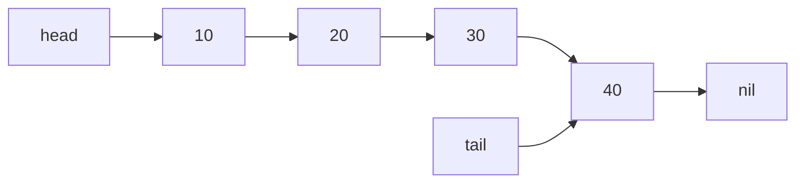

# Linked List — Go Implementation

## Why Linked List?

### The Problem It Solves

Imagine you're building a playlist app. Users add songs, remove songs, and rearrange them constantly. If you store songs in an array, inserting a new song in the middle means shifting every song after it—one by one—to make room. With 10,000 songs, that's potentially 10,000 moves just to add one song.

What if insertion could happen instantly, regardless of how many items you have?

A **linked list** solves this by changing how data is connected. Instead of storing elements in contiguous memory (side by side), each element knows where to find the next one. Adding an item in the middle? Just update two pointers. No shifting required.

### Real-World Analogies

**A Train**: Each car is connected to the next by a coupler. You don't need to move every car to add a new one—just uncouple at the right spot, insert the new car, and recouple. The cars don't need to be next to each other in a warehouse; they just need to know which car comes next.

**A Scavenger Hunt**: Each clue tells you where to find the next clue. You can insert a new clue by changing what the previous clue points to. Clues don't need to be in order physically—they just need their "next location" updated.

**A Chain of Paperclips**: Each paperclip hooks into the next. Adding one in the middle requires unhooking and rehooking—not moving the entire chain.

### When to Use It

- **Use a linked list when you need** frequent insertions and deletions at arbitrary positions
- **Use it when** you don't know the final size upfront and memory fragmentation is acceptable
- **Use it when** you primarily traverse from front to back (or maintain both head and tail for O(1) access at ends)

**Unlike a slice**, a linked list:
- Has O(1) insertion/deletion at the front (slices require O(n) shifting)
- Has no capacity limit that triggers reallocation
- Has slower random access (O(n) vs O(1))
- Uses more memory per element (each node stores a pointer)

---

## Core Concept

### The Big Idea

A linked list is a sequence of **nodes** where each node contains two things: a value and a pointer to the next node. The list itself just needs to remember where the chain starts (the **head**) and where it ends (the **tail**). There's no underlying array—nodes can live anywhere in memory, connected only by their pointers.

This indirection is the key insight: by sacrificing direct access (you can't jump to the 50th element), you gain flexible modification (inserting anywhere just means updating pointers).

### Visual Representation



This diagram shows a linked list containing [10, 20, 30, 40]:
- `head` points to the first node (value 10)
- Each node points to the next via its `next` field
- `tail` points to the last node (value 40)
- The last node's `next` is `nil`, signaling the end

### Key Terminology

- **Node**: A container holding one value and a pointer to the next node
- **Head**: Pointer to the first node in the list (nil if list is empty)
- **Tail**: Pointer to the last node in the list (enables O(1) append)
- **nil**: Go's null value—means "points to nothing" (end of list)
- **Singly Linked**: Each node only points forward (to `next`), not backward
- **Traversal**: Walking through the list node by node, following `next` pointers

---

## How It Works: Step-by-Step

### Operation 1: PushFront (Insert at Beginning)

**What it does**: Adds a new element at the front of the list in O(1) time.

**Step-by-step walkthrough**:

Starting state (list contains [20, 30]):
```
head --> [20] --> [30] --> nil
                    ^
                   tail
```

We want to add 10 at the front.

Step 1: Create a new node with value 10, pointing to the current head
```
new node: [10] --> [20] --> [30] --> nil
                             ^
                            tail
```

Step 2: Update head to point to the new node
```
head --> [10] --> [20] --> [30] --> nil
                             ^
                            tail
```

Done! The new list is [10, 20, 30].

**Why this approach?** We don't need to touch any existing nodes except to make the new node point to the old head. One allocation, one pointer update. Constant time regardless of list size.

**Special case**: If the list was empty, we also set `tail` to the new node (it's both first and last).

### Operation 2: PushBack (Insert at End)

**What it does**: Adds a new element at the back of the list in O(1) time.

**Step-by-step walkthrough**:

Starting state (list contains [10, 20]):
```
head --> [10] --> [20] --> nil
                    ^
                   tail
```

We want to add 30 at the back.

Step 1: Create a new node with value 30, pointing to nil
```
new node: [30] --> nil
```

Step 2: Make the current tail's `next` point to the new node
```
head --> [10] --> [20] --> [30] --> nil
                    ^
                   tail (still pointing to 20)
```

Step 3: Update tail to point to the new node
```
head --> [10] --> [20] --> [30] --> nil
                             ^
                            tail
```

Done! The new list is [10, 20, 30].

**Why this approach?** The `tail` pointer lets us jump directly to the end. Without it, we'd need to traverse the entire list to find where to append—making this O(n) instead of O(1).

### Operation 3: PopFront (Remove from Beginning)

**What it does**: Removes and returns the first element in O(1) time.

**Step-by-step walkthrough**:

Starting state (list contains [10, 20, 30]):
```
head --> [10] --> [20] --> [30] --> nil
                             ^
                            tail
```

We want to remove and return 10.

Step 1: Save the value to return (10)

Step 2: Move head to point to the second node
```
         [10] --> [20] --> [30] --> nil
         (orphaned)  ^               ^
                   head            tail
```

Step 3: The old first node is now orphaned—Go's garbage collector will clean it up

Final state:
```
head --> [20] --> [30] --> nil
                    ^
                   tail
```

Return value: 10

**Why this approach?** We just move one pointer. The orphaned node will be garbage collected automatically—no explicit deallocation needed in Go.

**Special case**: If we remove the last element, we set both `head` and `tail` to nil.

### Operation 4: PopBack (Remove from End)

**What it does**: Removes and returns the last element in O(n) time.

**Step-by-step walkthrough**:

Starting state (list contains [10, 20, 30]):
```
head --> [10] --> [20] --> [30] --> nil
                             ^
                            tail
```

We want to remove and return 30.

Step 1: We need to find the node *before* the tail. Start at head and walk until we find the node whose `next` is `tail`.
```
curr = head (10)
curr.next is 20, not tail (30)

curr = curr.next (20)
curr.next is 30, which IS tail. Stop here.
```

Step 2: Save the tail's value (30)

Step 3: Set the found node's `next` to nil (cutting off the tail)
```
head --> [10] --> [20] --> nil    [30] (orphaned)
                    ^
                   curr
```

Step 4: Update tail to point to curr (the new last node)
```
head --> [10] --> [20] --> nil
                    ^
                   tail
```

Return value: 30

**Why O(n)?** In a singly linked list, nodes don't know their predecessor. To update the second-to-last node, we must walk from the head. A **doubly linked list** (with `prev` pointers) would make this O(1).

### Worked Example: Complete Sequence

Let's trace through a realistic sequence of operations:

```
Initial state: empty list
head = nil, tail = nil, size = 0
```

**Operation 1: PushBack(10)**
```
head --> [10] --> nil
           ^
          tail
size = 1
```

**Operation 2: PushBack(20)**
```
head --> [10] --> [20] --> nil
                    ^
                   tail
size = 2
```

**Operation 3: PushFront(5)**
```
head --> [5] --> [10] --> [20] --> nil
                            ^
                           tail
size = 3
```

**Operation 4: InsertAt(2, 15)** (insert 15 at index 2)
```
Walk to index 1 (node with value 10)
Insert new node after it

head --> [5] --> [10] --> [15] --> [20] --> nil
                                     ^
                                    tail
size = 4
```

**Operation 5: PopFront()** returns 5
```
head --> [10] --> [15] --> [20] --> nil
                             ^
                            tail
size = 3
```

**Operation 6: At(1)** returns 15 (traverse to index 1)
```
(no change to list structure)
```

**Operation 7: RemoveAt(1)** returns 15
```
Find node at index 0 (value 10)
Make it point to index 2 (value 20)

head --> [10] --> [20] --> nil
                    ^
                   tail
size = 2
```

**Operation 8: PopBack()** returns 20
```
Walk to find node before tail (value 10)
Set its next to nil
Update tail

head --> [10] --> nil
           ^
          tail
size = 1
```

---

## From Concept to Code

### The Data Structure

Before looking at code, let's think about what we need to track:

**For each node**:
- The value it holds (generic type T)
- A pointer to the next node (could be nil)

**For the list itself**:
- A pointer to the first node (head)
- A pointer to the last node (tail) — for O(1) PushBack
- The number of elements (size) — for O(1) Size() and bounds checking

### Go Implementation

```go
type node[T any] struct {
    value T
    next  *node[T]
}

type LinkedList[T any] struct {
    head *node[T]
    tail *node[T]
    size int
}
```

**Line-by-line breakdown**:

- `type node[T any]` — Defines a generic node type. `[T any]` means T can be any type. The lowercase `node` makes it unexported (private to this package).

- `value T` — Stores the actual data. Type T is determined when you create the list.

- `next *node[T]` — Pointer to the next node. The `*` means "pointer to". When `next` is `nil`, this is the last node.

- `type LinkedList[T any]` — The public list type (uppercase = exported).

- `head *node[T]` — Pointer to first node. `nil` means empty list.

- `tail *node[T]` — Pointer to last node. Enables O(1) append.

- `size int` — Element count. Avoids traversing to count nodes.

**Sentinel Errors**:

```go
var (
    ErrOutOfRange = errors.New("LinkedList: index out of range")
    ErrEmptyList  = errors.New("LinkedList: list is empty")
)
```

These are package-level variables that callers can check with `errors.Is()`. This is idiomatic Go—export named errors so callers can handle specific failure modes.

### Implementing New (Constructor)

**The algorithm in plain English**:
1. Create an empty LinkedList
2. Go's zero values handle initialization—head and tail are nil, size is 0

**The code**:

```go
func New[T any]() *LinkedList[T] {
    return &LinkedList[T]{}
}
```

**Understanding the tricky parts**:

- `func New[T any]()` — This is a generic function. You call it as `New[int]()` or `New[string]()`. The `[T any]` declares the type parameter.

- `*LinkedList[T]` — Returns a pointer to the list. This is conventional in Go for structs with methods that modify state.

- `&LinkedList[T]{}` — Creates a new LinkedList and returns its address. The `{}` is an empty composite literal—all fields get their zero values (nil, nil, 0).

### Implementing PushFront

**The algorithm in plain English**:
1. Create a new node with the value, pointing to the current head
2. Update head to point to the new node
3. If the list was empty, also set tail to the new node
4. Increment size

**The code**:

```go
func (l *LinkedList[T]) PushFront(value T) {
    n := &node[T]{value: value, next: l.head}
    l.head = n
    if l.tail == nil {
        l.tail = n
    }
    l.size++
}
```

**Understanding the tricky parts**:

- `func (l *LinkedList[T])` — This is a method with a pointer receiver. The `l` is like `self` in Python or `this` in other languages. We use `*LinkedList[T]` (pointer) because we're modifying the list.

- `&node[T]{value: value, next: l.head}` — Creates a node on the heap and returns its pointer. The new node's `next` points to whatever `head` currently points to (could be nil if empty).

- `if l.tail == nil` — Checks if the list was empty. In an empty list, head and tail are both nil. After adding the first element, both should point to it.

### Implementing PopFront

**The algorithm in plain English**:
1. If empty, return zero value and error
2. Save the head's value
3. Move head to the next node
4. If head is now nil, the list is empty—clear tail too
5. Decrement size and return the saved value

**The code**:

```go
func (l *LinkedList[T]) PopFront() (T, error) {
    var zero T
    if l.head == nil {
        return zero, ErrEmptyList
    }
    value := l.head.value
    l.head = l.head.next
    if l.head == nil {
        l.tail = nil
    }
    l.size--
    return value, nil
}
```

**Understanding the tricky parts**:

- `(T, error)` — Go's multiple return values. We return both the value and an error. Callers must check the error.

- `var zero T` — Declares a variable of type T with its zero value. For int it's 0, for string it's "", for pointers it's nil. We need this because Go requires us to return *something* for T even on error.

- `return zero, ErrEmptyList` — Returns the zero value plus the sentinel error. Callers can check: `if errors.Is(err, ErrEmptyList)`.

- `l.head = l.head.next` — The old head node becomes unreachable. Go's garbage collector will eventually free it. No explicit `delete` needed.

### Implementing PopBack

**The algorithm in plain English**:
1. If empty, return zero value and error
2. If only one element, clear both head and tail, return the value
3. Otherwise, traverse to find the node before tail
4. Save tail's value, update the found node's next to nil
5. Update tail to point to the found node
6. Decrement size and return the saved value

**The code**:

```go
func (l *LinkedList[T]) PopBack() (T, error) {
    var zero T
    if l.head == nil {
        return zero, ErrEmptyList
    }
    if l.head == l.tail {
        value := l.head.value
        l.head = nil
        l.tail = nil
        l.size--
        return value, nil
    }
    curr := l.head
    for curr.next != l.tail {
        curr = curr.next
    }
    value := l.tail.value
    curr.next = nil
    l.tail = curr
    l.size--
    return value, nil
}
```

**Understanding the tricky parts**:

- `if l.head == l.tail` — When there's exactly one element, head and tail point to the same node. We handle this specially to avoid the traversal.

- `for curr.next != l.tail` — This loop finds the second-to-last node. We stop when `curr.next` equals `tail`, meaning `curr` is the node before tail.

- `curr.next = nil` — Severs the link to the old tail. The old tail node is now orphaned and will be garbage collected.

### Implementing InsertAt

**The algorithm in plain English**:
1. Validate index is in range [0, size]
2. If index is 0, use PushFront
3. If index is size, use PushBack
4. Otherwise, traverse to the node at index-1
5. Create new node pointing to what that node pointed to
6. Update that node to point to the new node
7. Increment size

**The code**:

```go
func (l *LinkedList[T]) InsertAt(index int, value T) error {
    if index < 0 || index > l.size {
        return ErrOutOfRange
    }
    if index == 0 {
        l.PushFront(value)
        return nil
    }
    if index == l.size {
        l.PushBack(value)
        return nil
    }
    curr := l.head
    for i := 0; i < index-1; i++ {
        curr = curr.next
    }
    n := &node[T]{value: value, next: curr.next}
    curr.next = n
    l.size++
    return nil
}
```

**Understanding the tricky parts**:

- `index > l.size` — Note the `>` not `>=`. Inserting at index `size` is valid—it appends to the end.

- `for i := 0; i < index-1; i++` — We traverse to position `index-1` because we need to modify that node's `next` pointer. After the loop, `curr` is the node *before* where we want to insert.

- `n := &node[T]{value: value, next: curr.next}` — The new node's `next` points to what will come after it (the old `curr.next`).

- `curr.next = n` — Now the node before the insertion point points to our new node. The chain is complete.

### Implementing Clone

**The algorithm in plain English**:
1. Create a new empty list
2. Traverse the original list
3. For each node, PushBack its value to the clone
4. Return the clone

**The code**:

```go
func (l *LinkedList[T]) Clone() *LinkedList[T] {
    clone := New[T]()
    curr := l.head
    for curr != nil {
        clone.PushBack(curr.value)
        curr = curr.next
    }
    return clone
}
```

**Understanding the tricky parts**:

- `New[T]()` — We can use the type parameter `T` from the method receiver. No need to specify it again.

- `for curr != nil` — Standard linked list traversal pattern. We walk until we hit the end (nil).

- `clone.PushBack(curr.value)` — Values are copied. If T is a pointer type or contains pointers, this is a shallow copy—both lists would point to the same underlying data.

---

## Complexity Analysis

### Time Complexity

| Operation | Best | Average | Worst | Why |
|-----------|------|---------|-------|-----|
| PushFront | O(1) | O(1) | O(1) | Just update head pointer |
| PushBack | O(1) | O(1) | O(1) | Tail pointer gives direct access |
| PopFront | O(1) | O(1) | O(1) | Just update head pointer |
| PopBack | O(n) | O(n) | O(n) | Must find second-to-last node |
| Front/Back | O(1) | O(1) | O(1) | Direct pointer access |
| At | O(1) | O(n) | O(n) | Best: index 0. Must traverse for others |
| InsertAt | O(1) | O(n) | O(n) | Best: index 0 or size. Must traverse for middle |
| RemoveAt | O(1) | O(n) | O(n) | Best: index 0. Must traverse for others |
| Size | O(1) | O(1) | O(1) | Stored in struct field |
| IsEmpty | O(1) | O(1) | O(1) | Just check size |
| Clear | O(1) | O(1) | O(1) | Just nil out pointers |
| Clone | O(n) | O(n) | O(n) | Must visit every node |
| Values | O(n) | O(n) | O(n) | Must visit every node |

**Understanding the "Why" column**:

- **O(1) operations** don't depend on list size. We have direct pointers to head and tail, so accessing or modifying them is instant.

- **O(n) operations** require traversal. Without a "previous" pointer, we can't jump backward. Finding the second-to-last node means walking from the head.

- **PopBack is O(n)** because we need to update the second-to-last node's `next` to nil. If this were a doubly linked list, we'd have `tail.prev` and could do it in O(1).

### Space Complexity

- **Overall structure**: O(n) where n is the number of elements. Each element requires one node, and each node stores a value plus one pointer.

- **Per-node overhead**: Each node uses `sizeof(T) + sizeof(*node[T])`. On 64-bit systems, the pointer is 8 bytes. A list of 1000 integers uses about 16KB (8 bytes per int + 8 bytes per pointer).

- **Per operation**: O(1) for most operations. `Clone()` and `Values()` use O(n) additional space.

### Memory Comparison with Slices

For a list of n integers (64-bit):
- **LinkedList**: ~16n bytes (value + pointer per node, plus overhead)
- **Slice**: ~8n bytes (just the values, contiguous)

Linked lists use roughly 2x the memory of slices for pointer-sized values, more for smaller values.

---

## Common Mistakes & Pitfalls

### Mistake 1: Forgetting to Update Tail

```go
// Wrong: Doesn't update tail when removing last element
func (l *LinkedList[T]) RemoveAt(index int) (T, error) {
    // ... traverse to node before index ...
    value := curr.next.value
    curr.next = curr.next.next
    l.size--
    return value, nil  // Bug: if we removed the last node, tail is stale!
}

// Right: Check if we removed the tail
func (l *LinkedList[T]) RemoveAt(index int) (T, error) {
    // ... traverse to node before index ...
    value := curr.next.value
    curr.next = curr.next.next
    if curr.next == nil {
        l.tail = curr  // Update tail if we removed the last element
    }
    l.size--
    return value, nil
}
```

**Why this matters**: A stale tail pointer means `PushBack` will append to a node that's no longer in the list, corrupting the structure.

### Mistake 2: Not Handling Single-Element List

```go
// Wrong: Assumes there are at least 2 elements
func (l *LinkedList[T]) PopBack() (T, error) {
    // ... error check ...
    curr := l.head
    for curr.next != l.tail {  // Infinite loop if head == tail!
        curr = curr.next
    }
    // ...
}

// Right: Handle single-element case separately
func (l *LinkedList[T]) PopBack() (T, error) {
    // ... error check ...
    if l.head == l.tail {
        value := l.head.value
        l.head = nil
        l.tail = nil
        l.size--
        return value, nil
    }
    // ... normal case ...
}
```

**Why this matters**: When head equals tail, the loop condition `curr.next != l.tail` is immediately false (since `head.next` would need to be different from tail, but if there's only one node, `head.next` is nil and `tail` points to head). Actually, the bug is subtler: if head == tail, then `head.next` is nil, not `l.tail`, so the loop runs but `curr.next` is nil, causing a nil pointer dereference.

### Mistake 3: Ignoring the Error Return

```go
// Wrong: Ignoring the error
value, _ := list.PopFront()  // If list is empty, value is zero value!
fmt.Println(value)           // Prints 0 for int, "" for string, etc.

// Right: Always check errors
value, err := list.PopFront()
if err != nil {
    if errors.Is(err, linkedlist.ErrEmptyList) {
        fmt.Println("List is empty")
        return
    }
    // Handle other errors
}
fmt.Println(value)
```

**Why this matters**: Go's error handling is explicit. Ignoring errors leads to silent bugs where you process invalid data.

### Mistake 4: Modifying List During Iteration

```go
// Wrong: Removing elements while iterating
for _, v := range list.Values() {
    if v < 0 {
        // This doesn't modify the list! Values() returns a copy.
        // Even if you could modify, you'd skip elements.
    }
}

// Right: Collect indices first, or iterate manually
toRemove := []int{}
for i, v := range list.Values() {
    if v < 0 {
        toRemove = append(toRemove, i)
    }
}
// Remove in reverse order so indices stay valid
for i := len(toRemove) - 1; i >= 0; i-- {
    list.RemoveAt(toRemove[i])
}
```

**Why this matters**: `Values()` returns a snapshot slice, not a live view. And even with direct access, removing elements while iterating forward causes index shifts.

### Mistake 5: Shallow Copy Confusion

```go
type Item struct {
    Name  string
    Count *int
}

// Original list with pointers
count := 5
list.PushBack(Item{Name: "apple", Count: &count})

// Clone the list
clone := list.Clone()

// Modify through clone
*clone.Front().Count = 10  // Oops! This also changes the original!
```

**Why this matters**: `Clone()` copies the values, but if T contains pointers, both lists point to the same underlying data. For true deep copies, you'd need a custom clone function.

---

## Practice Problems

To solidify your understanding, try implementing:

1. **Reverse**: Reverse the list in-place by manipulating pointers (not by creating a new list)

2. **FindMiddle**: Return the middle element. Can you do it in one pass? (Hint: two-pointer technique)

3. **HasCycle**: Given a potentially corrupted list where the tail might point back to an earlier node, detect if there's a cycle (Floyd's cycle detection)

4. **MergeSorted**: Given two sorted linked lists, merge them into one sorted list

5. **RemoveDuplicates**: Remove duplicate values from a sorted linked list

---

## Summary

### Key Takeaways

- Linked lists trade random access (O(n)) for flexible insertion/deletion (O(1) at ends)
- The head and tail pointers enable O(1) operations at both ends
- Singly linked lists have O(n) PopBack because they can't traverse backward
- Go's garbage collector handles memory automatically—no explicit deallocation
- Generic syntax `[T any]` allows the list to hold any type
- Error handling uses `(T, error)` returns with sentinel errors for type checking

### Quick Reference

```
LinkedList[T] — Generic singly linked list with head/tail pointers
├── PushFront(T):       O(1) — Add to beginning
├── PushBack(T):        O(1) — Add to end
├── PopFront() (T,err): O(1) — Remove from beginning
├── PopBack() (T,err):  O(n) — Remove from end (traversal needed)
├── Front() (T,err):    O(1) — Peek at first element
├── Back() (T,err):     O(1) — Peek at last element
├── At(i) (T,err):      O(n) — Access by index
├── InsertAt(i,T) err:  O(n) — Insert at index
├── RemoveAt(i) (T,err):O(n) — Remove at index
├── Size():             O(1) — Element count
├── IsEmpty():          O(1) — Check if empty
├── Clear():            O(1) — Remove all elements
├── Clone():            O(n) — Create a copy
└── Values():           O(n) — Convert to slice

Best for: Frequent insertions/deletions at front, unknown final size, queue implementations
Avoid when: Random access needed, memory is tight, cache performance matters
```
