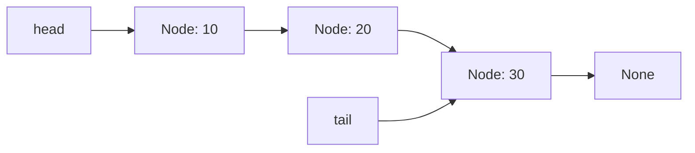

# Linked List — Python Implementation

## Why Linked Lists?

### The Problem It Solves

Imagine you have a playlist of songs. With a regular Python list (which is secretly an array), adding a song to the beginning is slow—every existing song has to shift over to make room. If you have 10,000 songs, that's 10,000 shifts just to add one song at the start.

Linked lists solve this elegantly. Instead of storing elements in a contiguous block of memory, each element "points" to the next one. Adding to the front? Just create the new element and point it at the old first element. No shifting required. Done in constant time, no matter how many elements you have.

### Real-World Analogies

**A treasure hunt with clues**: Each clue tells you where to find the next clue. You can't skip ahead—you must follow each clue in order. To add a new first clue, you just hand someone the new clue and tell them it leads to where the old first clue was.

**A conga line**: Each person has their hands on the shoulders of the person in front of them. To join at the front, you just put your hands on the current leader's shoulders, and now you're the new leader. No one else has to move.

**Train cars coupled together**: Each car is connected to the next. To add a car at the front, you couple it to the locomotive. To remove a car from the middle, you uncouple it and reconnect the cars on either side.

### When to Use It

- **Use a linked list when** you frequently insert or remove elements at the beginning
- **Use a linked list when** you don't need random access by index (you mostly iterate through everything)
- **Use a linked list when** you're implementing queues, stacks, or certain graph algorithms
- **Avoid linked lists when** you need fast access to arbitrary positions (use a Python list instead)
- **Avoid linked lists when** memory overhead matters (each element needs extra space for the pointer)

---

## Core Concept

### The Big Idea

A linked list is a chain of **nodes**, where each node holds two things: a **value** and a **reference** to the next node. The list itself just remembers where the chain starts (the **head**) and optionally where it ends (the **tail**). To traverse the list, you start at the head and follow references from node to node until you reach the end (marked by `None`).

This implementation is a **singly linked list with a tail pointer**—each node only knows about the next node (not the previous one), but we keep a direct reference to the last node for fast appends.

### Visual Representation



The diagram shows a linked list containing three values: 10, 20, and 30. The `head` points to the first node (10), and `tail` points to the last node (30). Each node's arrow represents its `next` reference. The final node's `next` is `None`, signaling the end of the list.

### Key Terminology

- **Node**: A container holding a value and a reference to the next node
- **Head**: A reference to the first node in the list (or `None` if empty)
- **Tail**: A reference to the last node in the list (or `None` if empty)
- **Reference**: In Python, a variable that "points to" an object. When we say `node.next`, we mean "the object that `next` refers to"
- **Traversal**: Walking through the list by following references from node to node
- **Singly Linked**: Each node only knows about the next node, not the previous one

---

## How It Works: Step-by-Step

### Operation 1: push_front (Insert at Beginning)

**What it does**: Adds a new element at the start of the list.

**Step-by-step walkthrough**:

Starting state (list contains 20 and 30):
```
head --> [20] --> [30] --> None
          ^               ^
          |               |
         tail points here if list had 1 element, but with 2:
                         tail --> [30]
```

Let's insert 10 at the front.

Step 1: Create a new node with value 10
```
new_node: [10] --> None

head --> [20] --> [30] --> None
                          ^
                         tail
```

Step 2: Point the new node's `next` to the current head
```
new_node: [10] --> [20] --> [30] --> None
                            ^
head --> [20]              tail
```

Step 3: Update head to point to the new node
```
head --> [10] --> [20] --> [30] --> None
                            ^
                           tail
```

**Why this approach?** By pointing the new node at the old head before updating head, we never "lose" the rest of the list. The order matters—if we updated head first, we'd lose our reference to the old first node.

### Operation 2: push_back (Insert at End)

**What it does**: Adds a new element at the end of the list.

**Step-by-step walkthrough**:

Starting state:
```
head --> [10] --> [20] --> None
                   ^
                  tail
```

Let's insert 30 at the end.

Step 1: Create a new node with value 30
```
new_node: [30] --> None

head --> [10] --> [20] --> None
                   ^
                  tail
```

Step 2: Make the current tail's `next` point to the new node
```
head --> [10] --> [20] --> [30] --> None
                   ^
                  tail (still points to 20)
```

Step 3: Update tail to point to the new node
```
head --> [10] --> [20] --> [30] --> None
                            ^
                           tail
```

**Why this approach?** The tail pointer is the key optimization here. Without it, we'd have to traverse the entire list to find the last node—O(n) instead of O(1).

### Operation 3: pop_front (Remove from Beginning)

**What it does**: Removes and returns the first element.

**Step-by-step walkthrough**:

Starting state:
```
head --> [10] --> [20] --> [30] --> None
                            ^
                           tail
```

Step 1: Save the value we're about to remove (10)
```
saved_value = 10

head --> [10] --> [20] --> [30] --> None
```

Step 2: Move head to point to the second node
```
         [10] --> [20] --> [30] --> None
                   ^        ^
                  head     tail
```

The old first node [10] is now unreachable—no variable points to it. Python's garbage collector will automatically reclaim its memory.

Step 3: Return the saved value (10)

Final state:
```
head --> [20] --> [30] --> None
                   ^
                  tail
```

### Operation 4: pop_back (Remove from End)

**What it does**: Removes and returns the last element.

**Step-by-step walkthrough**:

Starting state:
```
head --> [10] --> [20] --> [30] --> None
                            ^
                           tail
```

Step 1: Save the value we're about to remove (30)

Step 2: Find the second-to-last node by traversing from head
```
current starts at [10]
current.next is [20], which is not tail [30], so move forward
current is now [20]
current.next is [30], which IS tail, so stop here
```

Step 3: Set that node's `next` to `None` and update tail
```
head --> [10] --> [20] --> None
                   ^
                  tail
```

**Why this approach?** This is O(n) because we must traverse to find the second-to-last node. A singly linked list has no way to go backward from the tail. This is a fundamental trade-off of singly linked lists—if you need fast removal from both ends, use a doubly linked list.

### Worked Example: Complete Sequence

Let's trace through building and modifying a list:

```
Initial state: empty list
head = None, tail = None, size = 0

Operation 1: push_back(10)
head --> [10] --> None
          ^
         tail
size = 1

Operation 2: push_back(20)
head --> [10] --> [20] --> None
                   ^
                  tail
size = 2

Operation 3: push_front(5)
head --> [5] --> [10] --> [20] --> None
                           ^
                          tail
size = 3

Operation 4: push_back(30)
head --> [5] --> [10] --> [20] --> [30] --> None
                                    ^
                                   tail
size = 4

Operation 5: pop_front() -> returns 5
head --> [10] --> [20] --> [30] --> None
                           ^
                          tail
size = 3

Operation 6: at(1) -> returns 20
(No state change, just traverses: head[10] -> next[20], return 20)

Operation 7: insert_at(1, 15)
head --> [10] --> [15] --> [20] --> [30] --> None
                                     ^
                                    tail
size = 4

Operation 8: pop_back() -> returns 30
head --> [10] --> [15] --> [20] --> None
                            ^
                           tail
size = 3
```

---

## From Concept to Code

### The Data Structure

Before looking at the code, let's understand what we need to track:

- **The nodes themselves**: Each node needs to store a value and a reference to the next node
- **Where the list starts**: We need a `head` reference
- **Where the list ends**: We need a `tail` reference for O(1) appends
- **How many elements**: We track `size` so `len()` is O(1) instead of counting every time

### Python Implementation

```python
class LinkedList:
    class Node:
        def __init__(self, value):
            self.value = value
            self.next = None

    def __init__(self):
        self._head = None
        self._tail = None
        self._size = 0
```

**Line-by-line breakdown**:

- `class Node:` — A nested class inside `LinkedList`. This keeps `Node` as an implementation detail that users don't interact with directly.
- `self.value = value` — Stores whatever data this node holds. Python's dynamic typing means this can be any type.
- `self.next = None` — Initially, the node doesn't point to anything. We'll set this when we link nodes together.
- `self._head = None` — The underscore prefix is a Python convention meaning "this is internal, don't access directly". Starts as `None` because an empty list has no first node.
- `self._tail = None` — Same convention. Starts as `None`.
- `self._size = 0` — Tracking size explicitly means `len()` is O(1).

### Implementing push_front

**The algorithm in plain English**:
1. Create a new node with the given value
2. Point the new node's `next` to the current head
3. Update head to point to the new node
4. If the list was empty, tail should also point to this node
5. Increment the size

**The code**:
```python
def push_front(self, value):
    node = self.Node(value)
    node.next = self._head
    self._head = node
    if self._tail is None:
        self._tail = node
    self._size += 1
```

**Understanding the tricky parts**:

- `self.Node(value)` — We access the nested `Node` class through `self`. This creates a new Node instance.
- `node.next = self._head` — Even if `self._head` is `None` (empty list), this works perfectly—the new node's next will just be `None`.
- `if self._tail is None` — We check if the list was empty. If it was, our new node is both the first AND last element.

### Implementing push_back

**The algorithm in plain English**:
1. Create a new node with the given value
2. If the list is empty, both head and tail point to this node
3. Otherwise, make the current tail's `next` point to the new node, then update tail
4. Increment the size

**The code**:
```python
def push_back(self, value):
    node = self.Node(value)
    if self._tail is None:
        self._head = node
        self._tail = node
    else:
        self._tail.next = node
        self._tail = node
    self._size += 1
```

**Understanding the tricky parts**:

- `if self._tail is None` — We use `is` instead of `==` for `None` comparisons. This is both idiomatic Python and slightly faster because it checks identity (same object in memory) rather than equality.
- `self._tail.next = node` — This links the old last node to the new node.
- `self._tail = node` — Then we update our tail reference. Order matters here too—we must link first, then update tail.

### Implementing pop_back

**The algorithm in plain English**:
1. If empty, raise an error
2. Save the value from the tail node
3. If there's only one node, set both head and tail to None
4. Otherwise, traverse to find the second-to-last node, set its `next` to None, update tail
5. Decrement size and return the saved value

**The code**:
```python
def pop_back(self):
    if self._head is None:
        raise IndexError("pop_back from empty list")
    value = self._tail.value
    if self._head is self._tail:
        self._head = None
        self._tail = None
    else:
        current = self._head
        while current.next is not self._tail:
            current = current.next
        current.next = None
        self._tail = current
    self._size -= 1
    return value
```

**Understanding the tricky parts**:

- `if self._head is self._tail` — This checks if head and tail point to the same node object (single element). Using `is` checks object identity.
- `while current.next is not self._tail` — We stop when `current.next` IS the tail, meaning `current` is the second-to-last node.
- `current.next = None` — Severs the link to the old tail. The old tail node becomes unreachable and will be garbage collected.

### Implementing the Iterator

**The algorithm in plain English**:
1. Start at the head
2. While not at the end, yield the current value and move to the next node
3. The `yield` keyword makes this a generator—it pauses and resumes

**The code**:
```python
def __iter__(self):
    current = self._head
    while current is not None:
        yield current.value
        current = current.next
```

**Understanding the tricky parts**:

- `__iter__` — This is a "dunder" (double underscore) method that Python calls when you write `for item in my_list:`. It makes your object iterable.
- `yield current.value` — Unlike `return`, `yield` doesn't end the function. It pauses here, gives the value to the caller, and resumes from this exact point when the next value is requested.
- This is a **generator**, which is memory-efficient: it doesn't create a list of all values upfront. It produces them one at a time, on demand.

---

## Complexity Analysis

### Time Complexity

| Operation | Best | Average | Worst | Why |
|-----------|------|---------|-------|-----|
| push_front | O(1) | O(1) | O(1) | Just update a few references |
| push_back | O(1) | O(1) | O(1) | Tail pointer gives direct access to end |
| pop_front | O(1) | O(1) | O(1) | Just move head forward |
| pop_back | O(n) | O(n) | O(n) | Must traverse to find second-to-last |
| front/back | O(1) | O(1) | O(1) | Direct access via head/tail |
| at(index) | O(1) | O(n) | O(n) | Best: index 0. Must traverse to reach index |
| insert_at | O(1) | O(n) | O(n) | Best: index 0 or end. Must traverse otherwise |
| remove_at | O(1) | O(n) | O(n) | Best: index 0. Must traverse otherwise |
| size/is_empty | O(1) | O(1) | O(1) | Just return stored value |
| clear | O(1) | O(1) | O(1) | Just set references to None |
| copy | O(n) | O(n) | O(n) | Must visit every node |

**Understanding the "Why" column**:

- **O(1) operations** don't depend on list size. They do a fixed amount of work regardless of whether the list has 10 or 10 million elements.
- **O(n) operations** require traversing the list. If you double the list size, they take roughly twice as long.
- **pop_back is O(n)** because singly linked lists can't go backward. To update tail, we must find the second-to-last node by walking from the head.

### Space Complexity

- **Overall structure**: O(n) where n is the number of elements. Each element requires one Node object.
- **Per operation**: O(1) for all operations. We only create temporary variables, not data structures that grow with input size.
- **Node overhead**: Each node stores a reference in addition to the value. In Python, this is typically 8 bytes per reference on 64-bit systems, plus object overhead.

### Memory Management in Python

Python handles memory automatically through **reference counting** and **garbage collection**:

```python
def clear(self):
    self._head = None
    self._tail = None
    self._size = 0
```

When we set `self._head = None`, the first node loses its reference. If nothing else references it, Python decrements its reference count to zero and reclaims its memory. That node's `next` was the only reference to the second node, so the second node also becomes garbage, and so on down the chain.

This means `clear()` is O(1) in terms of our code, but Python does O(n) work behind the scenes to free the memory (spread out over time by the garbage collector).

---

## Common Mistakes & Pitfalls

### Mistake 1: Forgetting to Update Tail

```python
# Wrong:
def push_front(self, value):
    node = self.Node(value)
    node.next = self._head
    self._head = node
    self._size += 1
    # Forgot: if list was empty, tail should point to new node!

# Right:
def push_front(self, value):
    node = self.Node(value)
    node.next = self._head
    self._head = node
    if self._tail is None:
        self._tail = node
    self._size += 1
```

**Why this matters**: If you forget this, `push_back` will fail after `push_front` on an empty list because `tail` will still be `None`.

### Mistake 2: Wrong Order of Operations in Insertion

```python
# Wrong:
def push_front(self, value):
    node = self.Node(value)
    self._head = node       # Updated head first!
    node.next = self._head  # Now node.next points to itself!
    # ... rest of list is lost

# Right:
def push_front(self, value):
    node = self.Node(value)
    node.next = self._head  # Link to old head first
    self._head = node       # Then update head
```

**Why this matters**: The order of pointer updates is critical. If you update head before linking the new node to the old head, you lose your reference to the rest of the list.

### Mistake 3: Using == Instead of is for None Comparisons

```python
# Works but not idiomatic:
if self._head == None:
    ...

# Preferred:
if self._head is None:
    ...
```

**Why this matters**: While `==` usually works, `is` is the correct way to check for `None` in Python. It's faster (identity check vs equality check) and can't be fooled by objects that override `__eq__`.

### Mistake 4: Forgetting the Single-Element Case in pop_back

```python
# Wrong:
def pop_back(self):
    if self._head is None:
        raise IndexError("pop_back from empty list")
    value = self._tail.value
    # Forgot to handle single element case!
    current = self._head
    while current.next is not self._tail:
        current = current.next  # Infinite loop if head == tail!
    ...

# Right:
def pop_back(self):
    if self._head is None:
        raise IndexError("pop_back from empty list")
    value = self._tail.value
    if self._head is self._tail:
        self._head = None
        self._tail = None
    else:
        current = self._head
        while current.next is not self._tail:
            current = current.next
        current.next = None
        self._tail = current
    self._size -= 1
    return value
```

**Why this matters**: When there's only one element, head and tail point to the same node. The while loop condition `current.next is not self._tail` would check if `head.next` (which is `None`) is not `tail` (which is `head`). Since `None is not head`, we'd enter the loop and try to access `None.next`, causing a crash.

### Mistake 5: Modifying the List While Iterating

```python
# Dangerous:
for value in my_list:
    if value < 0:
        my_list.pop_front()  # Modifying during iteration!

# Safer:
to_remove = []
for i, value in enumerate(my_list):
    if value < 0:
        to_remove.append(i)
# Remove in reverse order to keep indices valid
for i in reversed(to_remove):
    my_list.remove_at(i)
```

**Why this matters**: The iterator holds a reference to `current`, but if you remove `current` or nodes around it, the iterator's internal state becomes invalid. This can cause skipped elements, infinite loops, or crashes.

---

## Practice Problems

To solidify your understanding, try implementing:

1. **reverse()**: Reverse the list in-place without creating new nodes. Hint: You'll need three references as you traverse: previous, current, and next.

2. **find(value)**: Return the index of the first occurrence of a value, or -1 if not found. Consider how to handle equality testing.

3. **remove_value(value)**: Remove the first node containing the given value. Return True if found and removed, False otherwise.

4. **has_cycle()**: Detect if a linked list has a cycle (a node's next eventually points back to an earlier node). Hint: Use the "tortoise and hare" algorithm with two pointers moving at different speeds.

5. **merge_sorted(other)**: Given two sorted linked lists, merge them into a single sorted list. This is a key operation in merge sort.

---

## Summary

### Key Takeaways

- A linked list is a chain of nodes where each node points to the next
- The tail pointer optimization makes `push_back` O(1) instead of O(n)
- `pop_back` is still O(n) because singly linked lists can't traverse backward
- Python's garbage collection automatically frees unreachable nodes
- The `__iter__` method with `yield` creates a memory-efficient generator
- Order of operations matters when updating references—always link first, then update head/tail

### Quick Reference

```
LinkedList — Dynamic sequence with O(1) insertions at ends
|-- push_front(value):  O(1) — Add to beginning
|-- push_back(value):   O(1) — Add to end (tail pointer optimization)
|-- pop_front():        O(1) — Remove from beginning
|-- pop_back():         O(n) — Remove from end (must traverse)
|-- front() / back():   O(1) — Peek at ends
|-- at(index):          O(n) — Access by position
|-- insert_at(i, val):  O(n) — Insert at position
|-- remove_at(i):       O(n) — Remove at position
|-- size() / len():     O(1) — Get element count
|-- is_empty():         O(1) — Check if empty
|-- clear():            O(1) — Remove all elements
|-- copy():             O(n) — Shallow copy

Best for: Frequent insertions/deletions at front, queue implementations,
          when you don't need random access

Avoid when: You need fast access by index, memory is tight (node overhead),
            you need fast removal from both ends (use deque instead)
```
