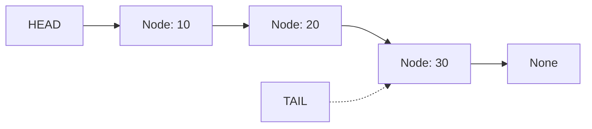

# Linked List — Rust Implementation

## Why Linked Lists?

### The Problem It Solves

Imagine you're building a playlist app. Users add songs, remove songs, and insert songs between others. If you use an array (or `Vec` in Rust), inserting a song in the middle means shifting everything after it—potentially thousands of elements. That's slow.

A **linked list** solves this by storing elements as independent nodes connected by pointers. To insert? Just update two pointers. To remove? Update one pointer. No shifting required.

But here's the twist: linked lists are notoriously difficult in Rust. Not because the concept is hard, but because Rust's ownership model actively fights against the way linked lists work. This implementation is as much about learning Rust's ownership system as it is about learning linked lists.

### Real-World Analogies

1. **A treasure hunt with clues**: Each clue (node) tells you where to find the next clue. You can't jump to clue #5 directly—you must follow the chain. To add a new clue in the middle, you just change what the previous clue says.

2. **A conga line**: Each dancer holds the shoulders of the person in front. To add someone new, they grab the shoulders of whoever was next, and the previous person now holds them. No one else needs to move.

3. **Train cars with couplers**: Each car connects to the next. Adding a car means unhooking a coupler and rehooking through the new car.

### When to Use It

- **Use a linked list when you need**:
  - Frequent insertions/deletions at the front
  - A queue (FIFO) with O(1) enqueue and dequeue
  - Unknown final size with frequent modifications

- **Avoid when you need**:
  - Random access by index (use `Vec`)
  - Cache-friendly iteration (arrays are contiguous in memory)
  - Simple, safe Rust code (linked lists require fighting the borrow checker)

---

## Core Concept

### The Big Idea

A linked list is a chain of **nodes**. Each node contains:
1. A **value** (the data you're storing)
2. A **pointer** to the next node (or nothing, if it's the last)

The list itself just remembers where the chain starts (the **head**) and optionally where it ends (the **tail**).

Unlike an array where elements sit next to each other in memory, linked list nodes can be scattered anywhere. The pointers are the glue that holds them together.

### Visual Representation



The solid arrows show ownership: `head` owns the first node, which owns the second, and so on. The dotted arrow shows `tail`—it *points to* the last node but doesn't own it.

### Key Terminology

- **Node**: A container holding one value and a link to the next node
- **Head**: The first node in the list (where iteration starts)
- **Tail**: The last node in the list (for O(1) append)
- **Option**: Rust's way of saying "this might be empty" (replaces null)
- **Box**: A pointer to heap-allocated memory that Rust automatically cleans up
- **Raw pointer**: An unsafe pointer that Rust doesn't track for safety

---

## Understanding `Option<Box<Node<T>>>` — The Heart of Rust Linked Lists

Before we dive into operations, we need to understand the most important line in this entire implementation:

```rust
next: Option<Box<Node<T>>>
```

This is how Rust represents "a pointer to another node that might not exist." Let's break it down piece by piece.

### Why `Box<T>`?

When you define a struct, Rust needs to know its size at compile time. But consider this:

```rust
struct Node<T> {
    value: T,
    next: Node<T>,  // ERROR! Infinite size
}
```

A `Node` contains a `Node`, which contains a `Node`, which contains... This is infinite recursion. The compiler can't determine the size.

`Box<T>` solves this. A `Box` is a pointer to heap-allocated memory. Pointers have a fixed, known size (usually 8 bytes on 64-bit systems). So:

```rust
struct Node<T> {
    value: T,
    next: Box<Node<T>>,  // Fixed size: pointer (8 bytes)
}
```

Now the compiler knows: a `Node` is the size of `T` plus 8 bytes for the pointer.

**Bonus**: `Box` also gives us ownership semantics. When a `Box` is dropped (goes out of scope), it automatically frees the heap memory it points to.

### Why `Option<T>`?

Rust doesn't have `null`. Instead, it has `Option<T>`:

```rust
enum Option<T> {
    Some(T),  // There's a value
    None,     // There's nothing
}
```

For a linked list, the last node has no next node. In C, you'd set `next = NULL`. In Rust:

```rust
next: Option<Box<Node<T>>>
// Last node: next = None
// Other nodes: next = Some(Box::new(next_node))
```

This is *safer* than null because the compiler forces you to handle both cases. You can't accidentally dereference a null pointer.

### Putting It Together

```rust
Option<Box<Node<T>>>
```

Read this as: "An optional pointer to a heap-allocated node of type T."

- `None` = no next node (like null, but safe)
- `Some(boxed_node)` = there's a next node, and we own it

### The Ownership Chain

Here's the beautiful part. When you have:

```
head -> Node1 -> Node2 -> Node3 -> None
```

The ownership chain is:
- `head` (an `Option<Box<Node>>`) owns `Node1`
- `Node1.next` owns `Node2`
- `Node2.next` owns `Node3`
- `Node3.next` is `None`

When the list is dropped, `head` is dropped, which drops `Node1`, which drops its `next`, which drops `Node2`, and so on. Memory is freed automatically in order. No manual cleanup needed.

---

## The Tail Pointer Problem

Look at the struct definition:

```rust
pub struct LinkedList<T> {
    head: Option<Box<Node<T>>>,
    tail: *mut Node<T>,  // Raw pointer!
    size: usize,
}
```

Wait—`tail` is a raw pointer (`*mut`), not an `Option<Box<...>>`? Why?

### The Problem

We want O(1) `push_back`. That means we need quick access to the last node. But we can't have two `Box` pointers to the same node—that would mean double ownership, and Rust forbids it.

We also can't use a reference (`&Node<T>`) because references have lifetimes. The borrow checker would complain: "You're borrowing the node, but the node might move when the list changes!"

### The Solution: Raw Pointers

A raw pointer (`*mut T`) is Rust's escape hatch. It's like a C pointer:
- No ownership
- No lifetime tracking
- No safety guarantees

This means:
- We can have `tail` point to the last node without owning it
- We must use `unsafe` to dereference it
- We're responsible for ensuring it's valid

```rust
tail: *mut Node<T>
```

When the list is empty, `tail` is null (`std::ptr::null_mut()`).
When the list has elements, `tail` points to the last node.

This is the *tension* of linked lists in Rust: the safe abstractions don't quite fit, so we use `unsafe` carefully.

---

## How It Works: Step-by-Step

### Operation 1: `push_front` — Insert at the Beginning

**What it does**: Creates a new node and makes it the new head.

**Step-by-step walkthrough**:

Starting state:
```
head -> [20] -> [30] -> None
         ^tail is pointing here (NO! tail points to [30])

Actually:
head -> [20] -> [30] -> None
                  ^
                  tail
```

Let me show this properly:

Starting state (list contains 20 and 30):
```
head ──> [20] ──> [30] ──> None
                    ^
                   tail
```

Step 1: Create new node with value 10. Its `next` will become the current head.
```
new_node [10]
              \
               ──> [20] ──> [30] ──> None
                              ^
                             tail
```

Step 2: Make new_node the new head.
```
head ──> [10] ──> [20] ──> [30] ──> None
                             ^
                            tail
```

**The code**:
```rust
pub fn push_front(&mut self, value: T) {
    let mut new_node = Box::new(Node { value, next: self.head.take() });

    if self.tail.is_null() {
        self.tail = &mut *new_node;
    }

    self.head = Some(new_node);
    self.size += 1;
}
```

**Understanding `take()`**:

This is crucial. `self.head.take()` does two things:
1. Returns whatever was in `self.head` (Some(old_head) or None)
2. Leaves `None` in its place

It's like saying: "Give me what's in this box, and leave the box empty."

Why do we need this? Because in Rust, you can't just copy a `Box`—it has ownership. You have to *move* it. `take()` moves the value out while leaving the `Option` in a valid state (`None`).

Without `take()`, you'd be trying to move out of `self.head` while `self` is borrowed mutably. That's a borrow checker error.

### Operation 2: `push_back` — Insert at the End

**What it does**: Creates a new node and links it after the current tail.

**Why it's interesting**: This is where `unsafe` comes in. We need to modify the *old* tail's `next` pointer, but we only have a raw pointer to it.

**Step-by-step walkthrough**:

Starting state:
```
head ──> [10] ──> [20] ──> None
                    ^
                   tail
```

Step 1: Create new node with value 30.
```
new_node [30] ──> None
```

Step 2: Get a raw pointer to the new node.
```
raw_tail = &mut *new_node  (points to [30])
```

Step 3: Link old tail to new node (requires unsafe).
```
head ──> [10] ──> [20] ──> [30] ──> None
```

Step 4: Update tail to point to new node.
```
head ──> [10] ──> [20] ──> [30] ──> None
                             ^
                            tail
```

**The code**:
```rust
pub fn push_back(&mut self, value: T) {
    let mut new_node = Box::new(Node { value, next: None });
    let raw_tail: *mut Node<T> = &mut *new_node;

    if self.tail.is_null() {
        self.head = Some(new_node);
    } else {
        unsafe {
            (*self.tail).next = Some(new_node);
        }
    }

    self.tail = raw_tail;
    self.size += 1;
}
```

**Understanding the unsafe block**:

```rust
unsafe {
    (*self.tail).next = Some(new_node);
}
```

This says:
1. `*self.tail` — dereference the raw pointer to get the Node
2. `.next = Some(new_node)` — set its next field

This is `unsafe` because Rust can't verify:
- That `self.tail` points to valid memory
- That the memory hasn't been freed
- That we have exclusive access

We know it's safe because:
- We set `tail` to null when the list is empty
- We only point `tail` at nodes that are owned by the list
- We update `tail` whenever we add/remove the last node

### Operation 3: `pop_front` — Remove from the Beginning

**What it does**: Removes the head node and returns its value.

**Step-by-step walkthrough**:

Starting state:
```
head ──> [10] ──> [20] ──> [30] ──> None
                             ^
                            tail
```

Step 1: Take the head node out.
```
taken_node = [10] ──> [20] ──> [30] ──> None
head = None (temporarily)
```

Step 2: Set head to the taken node's next.
```
head ──> [20] ──> [30] ──> None
                    ^
                   tail

taken_node = [10] ──> (next was moved to head)
```

Step 3: Return the value from taken_node.
```
Returns: 10
[10] is dropped (memory freed)
```

**The code**:
```rust
pub fn pop_front(&mut self) -> Option<T> {
    self.head.take().map(|node| {
        self.head = node.next;
        self.size -= 1;

        if self.head.is_none() {
            self.tail = std::ptr::null_mut();
        }

        node.value
    })
}
```

**Understanding `map`**:

`Option::map` transforms the value inside an Option (if it exists):
- `Some(x).map(f)` returns `Some(f(x))`
- `None.map(f)` returns `None`

Here, if `head` was `Some(node)`:
1. We move `node.next` into `self.head`
2. We return `node.value`

If `head` was `None`, we return `None` without doing anything.

This pattern (`take().map(...)`) is idiomatic Rust for "do something with the contents if they exist."

### Operation 4: `pop_back` — Remove from the End

**What it does**: Removes the tail node and returns its value.

**Why it's O(n)**: Unlike `pop_front`, we need to find the *second-to-last* node to update its `next` pointer to `None`. With a singly linked list, we can only traverse forward.

**Step-by-step walkthrough**:

Starting state:
```
head ──> [10] ──> [20] ──> [30] ──> None
                             ^
                            tail
```

Step 1: Check special cases. If only one node, use `pop_front` logic.

Step 2: Traverse to find second-to-last node.
```
current ──> [10] ──> [20] ──> [30] ──> None
              ^
         We stop here (current.next.next is None)

Wait, let me redo. We stop when current.next.next is None:

current at [10]: current.next.next = [30].next = None? No, = None.
Hmm, [10].next = [20]. [20].next = [30]. [30].next = None.
[10].next.next = [30]. [30].next = None. Yes!
So we stop at [10].

Actually for [10] -> [20] -> [30]:
- current = [10]
- current.next = Some([20])
- current.next.next = Some([30])
- current.next.next.next = None
So we continue...
- current = [20]
- current.next = Some([30])
- current.next.next = None
Stop! [20] is the second-to-last.
```

Let me show this more clearly:

Starting: `[10] -> [20] -> [30] -> None`

Traverse until `current.next.next` is `None`:
- At `[10]`: next is `[20]`, next.next is `[30]`. Continue.
- At `[20]`: next is `[30]`, next.next is `None`. Stop here.

Step 3: Take `[30]` from `[20].next`.
```
head ──> [10] ──> [20] ──> None
                    ^
                   tail (updated)

removed = [30]
```

Step 4: Return the value.
```
Returns: 30
```

**The code**:
```rust
pub fn pop_back(&mut self) -> Option<T> {
    if self.head.is_none() {
        return None;
    }

    self.size -= 1;

    if self.head.as_ref().unwrap().next.is_none() {
        self.tail = std::ptr::null_mut();
        return self.head.take().map(|node| node.value);
    }

    let mut current = self.head.as_mut().unwrap();
    while current.next.as_ref().unwrap().next.is_some() {
        current = current.next.as_mut().unwrap();
    }

    self.tail = &mut **current;
    current.next.take().map(|node| node.value)
}
```

**Understanding `as_ref()` and `as_mut()`**:

These convert `Option<T>` to `Option<&T>` or `Option<&mut T>`:

- `as_ref()` — "Let me look at what's inside without taking ownership"
- `as_mut()` — "Let me modify what's inside without taking ownership"

Why do we need them? Consider:
```rust
self.head.unwrap().next  // This MOVES head out of self!
```

That's a compile error because we're borrowing `self` mutably. Instead:
```rust
self.head.as_ref().unwrap().next  // Borrows, doesn't move
```

The `&mut **current` at the end deserves explanation:
- `current` is `&mut Box<Node<T>>`
- `*current` is `Box<Node<T>>`
- `**current` is `Node<T>`
- `&mut **current` is `*mut Node<T>` (a raw pointer to the node)

---

## Worked Example: Complete Sequence

Let's trace through building and modifying a list:

```
Operation 1: push_back(10)
─────────────────────────────
head ──> [10] ──> None
           ^
          tail
size: 1

Operation 2: push_back(20)
─────────────────────────────
head ──> [10] ──> [20] ──> None
                    ^
                   tail
size: 2

Operation 3: push_front(5)
─────────────────────────────
head ──> [5] ──> [10] ──> [20] ──> None
                            ^
                           tail
size: 3

Operation 4: pop_front() -> Some(5)
─────────────────────────────
head ──> [10] ──> [20] ──> None
                    ^
                   tail
size: 2

Operation 5: insert_at(1, 15)
─────────────────────────────
head ──> [10] ──> [15] ──> [20] ──> None
                             ^
                            tail
size: 3

Operation 6: pop_back() -> Some(20)
─────────────────────────────
head ──> [10] ──> [15] ──> None
                    ^
                   tail
size: 2

Operation 7: at(1) -> Some(&15)
─────────────────────────────
(no change, just returns reference)

Operation 8: clear()
─────────────────────────────
head = None
tail = null
size: 0
```

---

## From Concept to Code

### The Data Structure

We need to track:
- `head`: Entry point to the chain (owns the first node)
- `tail`: Quick access to the end (raw pointer, doesn't own)
- `size`: O(1) length queries

```rust
struct Node<T> {
    value: T,
    next: Option<Box<Node<T>>>,
}

pub struct LinkedList<T> {
    head: Option<Box<Node<T>>>,
    tail: *mut Node<T>,
    size: usize,
}
```

**Line-by-line breakdown**:

- `struct Node<T>` — Generic over any type `T`
- `value: T` — The actual data stored in this node
- `next: Option<Box<Node<T>>>` — Owned pointer to the next node, or None
- `head: Option<Box<Node<T>>>` — Owns the entire chain through the first node
- `tail: *mut Node<T>` — Raw pointer for O(1) tail access
- `size: usize` — Cached length for O(1) `size()` queries

### Implementing Traversal with `at`

**The algorithm in plain English**:
1. If index is out of bounds, return None
2. Start at head
3. Follow `next` pointers index times
4. Return reference to the value

**The code**:
```rust
pub fn at(&self, index: usize) -> Option<&T> {
    if index >= self.size {
        return None;
    }

    let mut current = self.head.as_ref();
    for _ in 0..index {
        current = current.unwrap().next.as_ref();
    }

    current.map(|node| &node.value)
}
```

**Understanding the tricky parts**:

- `self.head.as_ref()` — Convert `Option<Box<Node>>` to `Option<&Node>`. We want to look, not take ownership.

- `current.unwrap().next.as_ref()` — Get the next node's reference. `unwrap()` is safe here because we checked the index.

- `current.map(|node| &node.value)` — Transform `Option<&Node>` to `Option<&T>`.

### Implementing Insert at Index

**The algorithm in plain English**:
1. If index is 0, use `push_front`
2. If index is size, use `push_back`
3. Otherwise, traverse to the node *before* the insertion point
4. Create new node pointing to what comes after
5. Link the previous node to the new node

**The code**:
```rust
pub fn insert_at(&mut self, index: usize, value: T) -> bool {
    if index > self.size {
        return false;
    }

    if index == 0 {
        self.push_front(value);
        return true;
    }

    if index == self.size {
        self.push_back(value);
        return true;
    }

    let mut current = self.head.as_mut().unwrap();
    for _ in 0..index - 1 {
        current = current.next.as_mut().unwrap();
    }

    let new_node = Box::new(Node {
        value,
        next: current.next.take(),  // Take what was next
    });
    current.next = Some(new_node);  // Point to new node
    self.size += 1;
    true
}
```

**Understanding `take()` in insertion**:

```rust
next: current.next.take()
```

This is the key move. `current.next.take()`:
1. Removes the current next pointer, leaving `None`
2. Returns what was there (the rest of the list)
3. We put that into the new node's `next`

Then we set `current.next = Some(new_node)`, completing the splice.

---

## Iterators: Borrowing vs Owning

This implementation provides two iterator types.

### Borrowing Iterator (`iter`)

```rust
pub struct Iter<'a, T> {
    current: Option<&'a Node<T>>,
}

impl<'a, T> Iterator for Iter<'a, T> {
    type Item = &'a T;

    fn next(&mut self) -> Option<Self::Item> {
        self.current.map(|node| {
            self.current = node.next.as_deref();
            &node.value
        })
    }
}
```

**Understanding the lifetime `'a`**:

The `'a` says: "This iterator holds references that live as long as the list we borrowed from."

When you write `for x in list.iter()`, you're borrowing the list. The iterator can't outlive that borrow. This prevents use-after-free.

**Understanding `as_deref()`**:

`node.next.as_deref()` converts:
- `Option<Box<Node<T>>>` to `Option<&Node<T>>`

It's shorthand for `node.next.as_ref().map(|b| &**b)`. It dereferences through the `Box` to get a reference to the `Node`.

### Owning Iterator (`into_iter`)

```rust
pub struct IntoIter<T> {
    list: LinkedList<T>,
}

impl<T> Iterator for IntoIter<T> {
    type Item = T;

    fn next(&mut self) -> Option<Self::Item> {
        self.list.pop_front()
    }
}
```

This iterator *consumes* the list. Each `next()` pops the front. When iteration is done, the list is empty (and owned by the iterator, so it gets dropped).

Usage:
```rust
for value in list {  // list is moved here
    println!("{}", value);
}
// list no longer exists
```

---

## Complexity Analysis

### Time Complexity

| Operation | Best | Average | Worst | Why |
|-----------|------|---------|-------|-----|
| push_front | O(1) | O(1) | O(1) | Just update head pointer |
| push_back | O(1) | O(1) | O(1) | Tail pointer gives direct access |
| pop_front | O(1) | O(1) | O(1) | Just update head pointer |
| pop_back | O(n) | O(n) | O(n) | Must traverse to find second-to-last |
| front/back | O(1) | O(1) | O(1) | Direct pointer access |
| at | O(n) | O(n) | O(n) | Must traverse from head |
| insert_at | O(n) | O(n) | O(n) | Must traverse to position |
| remove_at | O(n) | O(n) | O(n) | Must traverse to position |
| size | O(1) | O(1) | O(1) | Cached in struct |
| clear | O(n) | O(n) | O(n) | Must drop all nodes |

**Why is `pop_back` O(n)?**

With a singly linked list, we can only traverse forward. To remove the last node, we need to update the second-to-last node's `next` to `None`. Finding the second-to-last requires traversing from the head.

A doubly linked list (with `prev` pointers) would make this O(1), but adds complexity.

### Space Complexity

- **Overall structure**: O(n) — Each of n elements needs a node with value + pointer
- **Per operation**: O(1) — Operations don't allocate extra space proportional to n

---

## Common Mistakes & Pitfalls

### Mistake 1: Moving Instead of Borrowing

```rust
// Wrong: This tries to move head out of self
fn front(&self) -> Option<&T> {
    self.head.map(|node| &node.value)  // ERROR!
}

// Right: Use as_ref() to borrow instead of move
fn front(&self) -> Option<&T> {
    self.head.as_ref().map(|node| &node.value)
}
```

**Why this matters**: `self.head.map(...)` tries to take ownership of the `Box` inside, but we only have a `&self` reference. `as_ref()` converts the Option to hold a reference instead.

### Mistake 2: Forgetting to Update Tail

```rust
// Wrong: Doesn't update tail when removing last element
fn pop_front(&mut self) -> Option<T> {
    self.head.take().map(|node| {
        self.head = node.next;
        self.size -= 1;
        node.value  // Forgot to check if list is now empty!
    })
}

// Right: Update tail when list becomes empty
fn pop_front(&mut self) -> Option<T> {
    self.head.take().map(|node| {
        self.head = node.next;
        self.size -= 1;

        if self.head.is_none() {
            self.tail = std::ptr::null_mut();  // Don't forget this!
        }

        node.value
    })
}
```

**Why this matters**: If you don't nullify `tail`, it becomes a dangling pointer—pointing to freed memory. The next `push_back` would write to invalid memory, causing undefined behavior.

### Mistake 3: Recursive Drop Causing Stack Overflow

```rust
// Wrong: Default Drop is recursive
// For a list of 1 million nodes, this overflows the stack

// Right: Implement iterative drop
impl<T> Drop for LinkedList<T> {
    fn drop(&mut self) {
        while self.pop_front().is_some() {}
    }
}
```

**Why this matters**: When a `Box<Node>` is dropped, it drops its contents, including the `next` field. That's another `Box<Node>`, so it drops that, and so on. Each drop is a stack frame. For a long list, you run out of stack space.

The iterative approach uses a loop, reusing the same stack frame.

### Mistake 4: Using `unwrap()` Without Checking

```rust
// Wrong: Will panic on empty list
fn front(&self) -> &T {
    &self.head.unwrap().value  // Panics if None!
}

// Right: Return Option and let caller decide
fn front(&self) -> Option<&T> {
    self.head.as_ref().map(|node| &node.value)
}
```

**Why this matters**: Idiomatic Rust uses `Option` to represent "might not exist." Forcing the caller to handle the `None` case prevents runtime panics.

### Mistake 5: Fighting the Borrow Checker in Traversal

```rust
// Wrong: Trying to keep two mutable references
fn insert_at(&mut self, index: usize, value: T) -> bool {
    let prev = self.at_mut(index - 1);  // Mutable borrow
    let next = self.at_mut(index);       // ERROR: Already borrowed!
    // ...
}

// Right: Navigate to the right spot with one reference
fn insert_at(&mut self, index: usize, value: T) -> bool {
    let mut current = self.head.as_mut().unwrap();
    for _ in 0..index - 1 {
        current = current.next.as_mut().unwrap();
    }
    // Now current is at index-1, and current.next is at index
    // ...
}
```

**Why this matters**: Rust allows only one mutable reference at a time. You can't hold references to both the previous and next nodes simultaneously. The solution is to navigate to the *previous* node and access `next` through it.

---

## The `unsafe` Contract

This implementation uses `unsafe` in two places. Here's the contract we must uphold:

### Invariants We Must Maintain

1. **Tail is null XOR points to valid node**: Either `tail.is_null()` (empty list) or `tail` points to a node owned by the list.

2. **Tail is always the last node**: If the list is non-empty, `tail` points to the node whose `next` is `None`.

3. **Tail is never dangling**: When we remove the tail node, we update `tail` to point to the new last node (or null if empty).

### Why This Is Safe

```rust
unsafe {
    (*self.tail).next = Some(new_node);
}
```

This dereference is safe because:
- We checked `!self.tail.is_null()` before entering this branch
- We only set `tail` to point at nodes we own
- We update `tail` whenever we modify the end of the list

The `unsafe` block is small and localized. The rest of the code is safe Rust, and the invariants ensure the `unsafe` code is correct.

---

## Practice Problems

To solidify your understanding, try implementing:

1. **`find(&self, value: &T) -> Option<usize>`** (where T: PartialEq)
   Return the index of the first occurrence of a value.

2. **`reverse(&mut self)`**
   Reverse the list in place. This is tricky with ownership!

3. **`merge(self, other: LinkedList<T>) -> LinkedList<T>`** (where T: Ord)
   Merge two sorted lists into one sorted list.

---

## Summary

### Key Takeaways

- `Option<Box<Node<T>>>` is Rust's way of representing an owned, nullable pointer to a heap-allocated node
- `take()` moves a value out of an `Option`, leaving `None` behind—essential for ownership transfer
- `as_ref()` and `as_mut()` let you borrow the contents of an `Option` without taking ownership
- Raw pointers (`*mut T`) are necessary for the tail because Rust's ownership model doesn't allow two owners
- Linked lists fight against Rust's safety guarantees, which is why they're considered an advanced topic

### Quick Reference

```
LinkedList<T> — Singly linked list with tail pointer
├── push_front(T):   O(1) — Insert at head
├── push_back(T):    O(1) — Insert at tail (uses unsafe)
├── pop_front() -> Option<T>:  O(1) — Remove from head
├── pop_back() -> Option<T>:   O(n) — Remove from tail (must traverse)
├── front() -> Option<&T>:     O(1) — Peek head
├── back() -> Option<&T>:      O(1) — Peek tail (uses unsafe)
├── at(index) -> Option<&T>:   O(n) — Access by index
├── insert_at(index, T) -> bool: O(n) — Insert at position
├── remove_at(index) -> Option<T>: O(n) — Remove at position
├── size() -> usize:           O(1) — Get length
├── is_empty() -> bool:        O(1) — Check if empty
├── clear():                   O(n) — Remove all elements
├── iter() -> Iter:            O(1) — Borrowing iterator
└── into_iter() -> IntoIter:   O(1) — Consuming iterator

Best for: Queues, frequent front insertions/deletions, unknown size
Avoid when: Random access needed, cache locality matters, want pure safe Rust
```

### The Bigger Picture

Linked lists in Rust teach you as much about Rust's ownership model as they do about data structures. The fact that you need `unsafe` for efficient tail access isn't a flaw—it's Rust being honest about where safety guarantees can't be statically verified.

For production code, consider:
- `std::collections::LinkedList` (doubly linked, all safe)
- `VecDeque` (ring buffer, often faster due to cache locality)
- A crate like `slotmap` for arena-allocated linked structures

But implementing a linked list from scratch is a rite of passage. If you can make the borrow checker happy here, you can make it happy anywhere.
