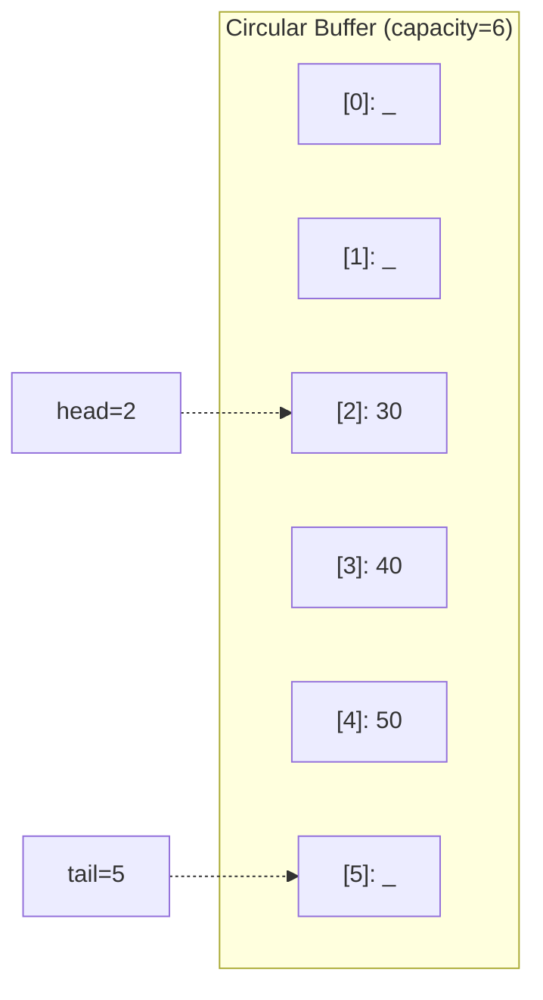

# Queue — C++ Implementation

## Why Queues?

### The Problem It Solves

Imagine you're writing a print spooler. Documents arrive faster than the printer can handle them. You need somewhere to hold the waiting documents, and critically, you need to print them in the order they arrived—the first document submitted should be the first one printed.

Or consider a web server handling incoming requests. When traffic spikes, requests pile up faster than you can process them. You need a waiting area where requests are served in the order they came in—no cutting in line.

This "first come, first served" pattern appears everywhere in computing:
- Task schedulers in operating systems
- Message queues between services
- Breadth-first search (BFS) in graphs
- Buffering data streams (keyboard input, network packets)

A **queue** is the data structure that solves this problem. It enforces **FIFO (First-In-First-Out)** ordering: elements come out in exactly the order they went in.

### Real-World Analogies

**The checkout line at a grocery store**: Customers join at the back and leave from the front. The person who has been waiting longest gets served next. No cutting, no special treatment—pure fairness by arrival order.

**A tunnel**: Cars enter one end and exit the other. The first car in is the first car out. Cars can't pass each other inside (unlike a stack, where you'd have to reverse out).

**A pipe with water flowing through it**: Water that enters first exits first. This is so fundamental that Unix actually calls its inter-process communication mechanism "pipes."

### When to Use It

- **Use a queue when** you need to process items in arrival order
- **Use a queue when** implementing breadth-first search (exploring nodes level by level)
- **Use a queue when** buffering between a producer (that generates data) and consumer (that processes it)
- **Use a queue when** you need fairness—no item should wait forever while newer items get processed

**Unlike a stack** (LIFO), a queue doesn't favor recent items. Unlike a priority queue, it doesn't favor "important" items—just whoever arrived first.

---

## Core Concept

### The Big Idea

A queue has two ends: a **front** where elements leave, and a **back** where elements arrive. You **enqueue** (add) at the back and **dequeue** (remove) from the front. That's it—those are the only ways in and out.

The clever part is *how* we implement this efficiently. A naive approach using an array would require shifting all elements forward every time we dequeue—O(n) per operation. Instead, we use a **circular buffer**: the array "wraps around" so that after the last index comes index 0 again. This gives us O(1) operations without any shifting.

### Visual Representation



In this diagram:
- The queue contains three elements: 30, 40, 50
- `head` points to the front element (30 at index 2)
- `tail` points to where the *next* element will be inserted (index 5)
- Indices 0, 1, and 5 are empty slots (shown as `_`)
- When we reach index 5 and need to add more, we "wrap around" to index 0

### Key Terminology

- **Enqueue**: Add an element to the back of the queue
- **Dequeue**: Remove and return the element at the front
- **Front/Head**: The element that will be dequeued next (oldest)
- **Back/Tail**: The most recently enqueued element (newest)
- **Circular buffer**: An array where indices wrap around (index after `capacity-1` is `0`)
- **Modulo arithmetic**: Using `%` to make indices wrap: `(index + 1) % capacity`

---

## How It Works: Step-by-Step

### Operation 1: Enqueue (Adding Elements)

**What it does**: Adds an element to the back of the queue.

**Step-by-step walkthrough**:

Starting with an empty queue (capacity 4):
```
Array:  [ _ | _ | _ | _ ]
Index:    0   1   2   3
          ^
        head=0, tail=0, size=0
```

**Step 1**: Enqueue(10) — Place 10 at tail position, advance tail
```
Array:  [10 | _ | _ | _ ]
Index:    0   1   2   3
          ^   ^
       head  tail
       size=1
```

**Step 2**: Enqueue(20) — Place 20 at tail position, advance tail
```
Array:  [10 | 20 | _ | _ ]
Index:    0    1   2   3
          ^        ^
       head      tail
       size=2
```

**Step 3**: Enqueue(30) — Place 30 at tail position, advance tail
```
Array:  [10 | 20 | 30 | _ ]
Index:    0    1    2   3
          ^             ^
       head           tail
       size=3
```

**Why this approach?** By tracking where to insert next (`tail`), we avoid searching for an empty slot. The operation is O(1)—just write and increment.

### Operation 2: Dequeue (Removing Elements)

**What it does**: Removes and returns the front element.

**Step-by-step walkthrough**:

Starting state (from above):
```
Array:  [10 | 20 | 30 | _ ]
Index:    0    1    2   3
          ^             ^
       head           tail
       size=3
```

**Step 1**: Dequeue() — Return data[head]=10, advance head
```
Array:  [10 | 20 | 30 | _ ]    (10 is now "garbage"—logically removed)
Index:    0    1    2   3
               ^        ^
            head      tail
       size=2, returned: 10
```

**Step 2**: Dequeue() — Return data[head]=20, advance head
```
Array:  [10 | 20 | 30 | _ ]    (10 and 20 are logically removed)
Index:    0    1    2   3
                    ^   ^
                 head  tail
       size=1, returned: 20
```

**Why this approach?** We don't actually delete or shift anything—we just move the `head` pointer. The old data sits there but is considered "not part of the queue." This is why dequeue is O(1).

### Operation 3: Wrap-Around (The Magic of Circular Buffers)

**What it does**: When indices reach the end of the array, they wrap back to the beginning.

**Step-by-step walkthrough**:

Starting with this state (after some enqueues and dequeues):
```
Array:  [ _ | _ | 30 | 40 ]
Index:    0   1   2    3
                  ^
               head
       tail=0 (wrapped!), size=2
```

**Step 1**: Enqueue(50) — tail is 0, so we place 50 at index 0
```
Array:  [50 | _ | 30 | 40 ]
Index:    0   1   2    3
              ^   ^
           tail  head
       size=3
```

**Step 2**: Enqueue(60) — tail advances to 1, place 60 there
```
Array:  [50 | 60 | 30 | 40 ]
Index:    0    1    2    3
                    ^
                 head, tail=2
       size=4 (FULL!)
```

Now we've wrapped around and filled the buffer. The logical order is: 30, 40, 50, 60 (starting from head and wrapping).

**Why this approach?** Without wrap-around, we'd waste the empty slots at the beginning. Circular buffering lets us reuse all slots without shifting elements.

### Operation 4: Growing the Buffer

**What it does**: When the queue is full and we need to add more, we allocate a larger array.

**Step-by-step walkthrough**:

Starting state (full buffer from above):
```
Array:  [50 | 60 | 30 | 40 ]
Index:    0    1    2    3
                    ^
                 head=2, tail=2
       size=4, capacity=4 (FULL!)
```

**Step 1**: Enqueue(70) triggers grow() — Allocate new array of size 8
```
Old:    [50 | 60 | 30 | 40 ]     head=2
New:    [ _ | _ | _ | _ | _ | _ | _ | _ ]
```

**Step 2**: Copy elements in logical order (starting from old head)
```
Old:    [50 | 60 | 30 | 40 ]     Copy: 30, 40, 50, 60
         ^    ^    ^    ^
         3rd  4th  1st  2nd

New:    [30 | 40 | 50 | 60 | _ | _ | _ | _ ]
Index:    0    1    2    3   4   5   6   7
          ^                  ^
       head=0              tail=4
```

**Step 3**: Now enqueue(70) normally
```
New:    [30 | 40 | 50 | 60 | 70 | _ | _ | _ ]
Index:    0    1    2    3    4   5   6   7
          ^                       ^
       head=0                   tail=5
       size=5, capacity=8
```

**Why this approach?** Growing linearizes the circular buffer—elements are copied in logical (FIFO) order to the new array starting at index 0. This simplifies the new buffer state: `head=0`, `tail=size`.

### Worked Example: Complete Sequence

Let's trace through a realistic sequence of operations with capacity starting at 2:

```
Initial: capacity=2
Array:  [ _ | _ ]
head=0, tail=0, size=0
```

**Operation 1: enqueue(10)**
```
Array:  [10 | _ ]
head=0, tail=1, size=1
```

**Operation 2: enqueue(20)**
```
Array:  [10 | 20 ]
head=0, tail=0 (wrapped), size=2 (FULL)
```

**Operation 3: enqueue(30)** — triggers grow!
```
After grow (capacity=4):
Array:  [10 | 20 | _ | _ ]
head=0, tail=2, size=2

After enqueue(30):
Array:  [10 | 20 | 30 | _ ]
head=0, tail=3, size=3
```

**Operation 4: dequeue()** — returns 10
```
Array:  [10 | 20 | 30 | _ ]  (10 is garbage)
head=1, tail=3, size=2
Returned: 10
```

**Operation 5: dequeue()** — returns 20
```
Array:  [10 | 20 | 30 | _ ]  (10, 20 are garbage)
head=2, tail=3, size=1
Returned: 20
```

**Operation 6: enqueue(40)**
```
Array:  [10 | 20 | 30 | 40 ]  (indices 0,1 still garbage)
head=2, tail=0 (wrapped), size=2
```

**Operation 7: enqueue(50)**
```
Array:  [50 | 20 | 30 | 40 ]  (overwrote garbage at index 0)
head=2, tail=1, size=3
Logical order: 30, 40, 50
```

**Operation 8: front()** — returns 30 (doesn't remove)
```
front() returns data[head] = data[2] = 30
State unchanged
```

---

## From Concept to Code

### The Data Structure

Before looking at code, let's understand what we need to track:

1. **`data_`** — Pointer to the dynamically allocated array
2. **`head_`** — Index of the front element (next to be dequeued)
3. **`tail_`** — Index where the next element will be inserted
4. **`size_`** — Number of elements currently in the queue
5. **`capacity_`** — Total number of slots in the array

Why do we need both `size_` and `capacity_`? Consider when `head_ == tail_`. This could mean:
- The queue is empty (just dequeued the last element), OR
- The queue is full (tail wrapped around and caught up to head)

Having `size_` resolves this ambiguity.

### C++ Implementation

```cpp
template <typename T>
class Queue {
public:
    Queue() : data_(nullptr), head_(0), tail_(0), size_(0), capacity_(0) {}

    ~Queue() { delete[] data_; }

private:
    T* data_;
    std::size_t head_;
    std::size_t tail_;
    std::size_t size_;
    std::size_t capacity_;
};
```

**Line-by-line breakdown**:

- **`template <typename T>`** — This makes Queue a generic class. You can create `Queue<int>`, `Queue<std::string>`, etc. The compiler generates specialized code for each type you use.

- **`T* data_`** — A raw pointer to an array of `T` on the heap. We use `new[]` to allocate and `delete[]` to free it. The underscore suffix is a convention for private member variables.

- **`std::size_t`** — An unsigned integer type guaranteed to hold any array index. On 64-bit systems, this is typically `unsigned long long` (8 bytes). Using `std::size_t` instead of `int` avoids signed/unsigned comparison warnings and handles very large queues.

- **Constructor initializer list** — The `: data_(nullptr), head_(0)...` syntax is more efficient than assignment in the constructor body because it initializes members directly rather than default-constructing then assigning.

- **`~Queue() { delete[] data_; }`** — The destructor frees the heap memory. Note `delete[]` (with brackets) because we allocated with `new[]`. Using plain `delete` would be undefined behavior.

### Implementing Enqueue

**The algorithm in plain English**:
1. If the queue is full, grow the buffer
2. Place the new element at the tail position
3. Advance tail to the next position (wrapping if necessary)
4. Increment the size

**The code**:

```cpp
void enqueue(const T& value) {
    if (size_ == capacity_) {
        grow();
    }
    data_[tail_] = value;
    tail_ = (tail_ + 1) % capacity_;
    ++size_;
}

void enqueue(T&& value) {
    if (size_ == capacity_) {
        grow();
    }
    data_[tail_] = std::move(value);
    tail_ = (tail_ + 1) % capacity_;
    ++size_;
}
```

**Understanding the tricky parts**:

- **Two overloads** — The first takes `const T&` (a reference to a value we copy). The second takes `T&&` (an rvalue reference—a temporary or moved-from value). This lets us avoid copying when possible:
  ```cpp
  queue.enqueue(42);                    // Uses rvalue overload (42 is temporary)
  queue.enqueue(my_string);             // Uses lvalue overload (copies)
  queue.enqueue(std::move(my_string));  // Uses rvalue overload (moves, no copy)
  ```

- **`std::move(value)`** — This casts `value` to an rvalue reference, enabling move semantics. For types like `std::string`, this transfers ownership of internal buffers instead of copying character by character.

- **`(tail_ + 1) % capacity_`** — This is the wrap-around logic. If `tail_` is 3 and `capacity_` is 4, then `(3 + 1) % 4 = 0`. The tail wraps back to the beginning.

### Implementing Dequeue

**The algorithm in plain English**:
1. If the queue is empty, throw an exception
2. Move the front element out (to return it)
3. Advance head to the next position (wrapping if necessary)
4. Decrement the size
5. Return the value

**The code**:

```cpp
T dequeue() {
    if (size_ == 0) {
        throw std::out_of_range("dequeue from empty queue");
    }
    T value = std::move(data_[head_]);
    head_ = (head_ + 1) % capacity_;
    --size_;
    return value;
}
```

**Understanding the tricky parts**:

- **Returns `T` by value** — Unlike `std::queue::pop()` which returns void, this returns the removed element. This is more convenient but means we must throw on empty (no valid value to return).

- **`std::move(data_[head_])`** — We move the value out of the array slot rather than copying. The slot now contains a moved-from object (valid but unspecified state). This is fine because we're about to logically remove it from the queue anyway.

- **`throw std::out_of_range`** — This is the standard exception for accessing invalid positions. Callers can catch it or let it propagate.

### Implementing Front and Back

**The code**:

```cpp
T& front() {
    if (size_ == 0) {
        throw std::out_of_range("front on empty queue");
    }
    return data_[head_];
}

const T& front() const {
    if (size_ == 0) {
        throw std::out_of_range("front on empty queue");
    }
    return data_[head_];
}

T& back() {
    if (size_ == 0) {
        throw std::out_of_range("back on empty queue");
    }
    std::size_t back_idx = (tail_ + capacity_ - 1) % capacity_;
    return data_[back_idx];
}
```

**Understanding the tricky parts**:

- **Const and non-const overloads** — `front()` has two versions. The `const` version can be called on a const queue and returns a const reference (read-only). The non-const version allows modification: `queue.front() = 99;`

- **`(tail_ + capacity_ - 1) % capacity_`** — This computes the index of the last element. Why not just `(tail_ - 1) % capacity_`? Because if `tail_` is 0, subtracting 1 gives a huge number (unsigned underflow). Adding `capacity_` first ensures we stay positive: `(0 + 4 - 1) % 4 = 3`.

### Implementing Grow

**The algorithm in plain English**:
1. Calculate new capacity (double the current, or 1 if empty)
2. Allocate new array
3. Copy elements in logical order, linearizing the circular buffer
4. Delete old array
5. Update pointers and capacity

**The code**:

```cpp
void grow() {
    std::size_t new_capacity = capacity_ == 0 ? 1 : capacity_ * 2;
    T* new_data = new T[new_capacity];
    for (std::size_t i = 0; i < size_; ++i) {
        new_data[i] = std::move(data_[(head_ + i) % capacity_]);
    }
    delete[] data_;
    data_ = new_data;
    head_ = 0;
    tail_ = size_;
    capacity_ = new_capacity;
}
```

**Understanding the tricky parts**:

- **`capacity_ == 0 ? 1 : capacity_ * 2`** — Handles the edge case of an initially empty queue. We can't double 0.

- **`data_[(head_ + i) % capacity_]`** — This walks through elements in logical order (starting from `head_`), not physical array order. The `% capacity_` handles wrap-around.

- **Linearization** — After growth, `head_ = 0` and `tail_ = size_`. The circular buffer becomes a simple linear array with all elements at the front. This simplifies the new state.

### The Rule of Five

When a class manages resources (like heap memory), C++ requires you to define five special member functions:

```cpp
// 1. Destructor
~Queue() { delete[] data_; }

// 2. Copy constructor
Queue(const Queue& other)
    : data_(nullptr), head_(0), tail_(0), size_(other.size_), capacity_(other.size_) {
    if (size_ > 0) {
        data_ = new T[capacity_];
        for (std::size_t i = 0; i < size_; ++i) {
            data_[i] = other.data_[(other.head_ + i) % other.capacity_];
        }
        tail_ = size_;
    }
}

// 3. Move constructor
Queue(Queue&& other) noexcept
    : data_(other.data_), head_(other.head_), tail_(other.tail_),
      size_(other.size_), capacity_(other.capacity_) {
    other.data_ = nullptr;
    other.head_ = 0;
    other.tail_ = 0;
    other.size_ = 0;
    other.capacity_ = 0;
}

// 4. Copy assignment
Queue& operator=(const Queue& other) {
    if (this != &other) {
        Queue tmp(other);
        swap(tmp);
    }
    return *this;
}

// 5. Move assignment
Queue& operator=(Queue&& other) noexcept {
    if (this != &other) {
        delete[] data_;
        data_ = other.data_;
        head_ = other.head_;
        tail_ = other.tail_;
        size_ = other.size_;
        capacity_ = other.capacity_;
        other.data_ = nullptr;
        other.head_ = 0;
        other.tail_ = 0;
        other.size_ = 0;
        other.capacity_ = 0;
    }
    return *this;
}
```

**Why each one matters**:

- **Copy constructor** — Called when creating a new queue from an existing one: `Queue<int> q2 = q1;`. Allocates fresh memory and copies elements in logical order. Note it allocates exactly `size_` capacity, not `capacity_`—a memory optimization.

- **Move constructor** — Called when creating from a temporary: `Queue<int> q2 = std::move(q1);`. Steals the pointer instead of copying—O(1) instead of O(n). The `noexcept` is important for `std::vector<Queue<T>>` to use moves during reallocation.

- **Copy assignment** — Called when assigning to existing queue: `q2 = q1;`. Uses copy-and-swap idiom: make a copy, swap with it, let the copy's destructor clean up the old data. This provides strong exception safety (if copy fails, `q2` is unchanged).

- **Move assignment** — Called when assigning from temporary: `q2 = std::move(q1);`. Deletes current data, then steals from source.

- **Self-assignment check (`this != &other`)** — Prevents `q = q;` from deleting its own data before copying it.

---

## Complexity Analysis

### Time Complexity

| Operation | Best | Average | Worst | Why |
|-----------|------|---------|-------|-----|
| enqueue   | O(1) | O(1)*   | O(n)  | Usually just write + increment. Worst case triggers grow(), copying all n elements. |
| dequeue   | O(1) | O(1)    | O(1)  | Just move + increment, regardless of queue size. |
| front     | O(1) | O(1)    | O(1)  | Direct array access at known index. |
| back      | O(1) | O(1)    | O(1)  | Direct array access with one modulo calculation. |
| size      | O(1) | O(1)    | O(1)  | Returns stored value; no computation. |
| empty     | O(1) | O(1)    | O(1)  | Single comparison. |
| clear     | O(1) | O(1)    | O(1)  | Just resets indices; doesn't free memory or destroy elements. |

*Amortized O(1) — see below.

### Space Complexity

- **Overall structure**: O(n) where n is the number of elements. The capacity may be up to 2n due to doubling, but this is still O(n).
- **Per operation**: O(1) for most operations. O(n) during `grow()` which temporarily holds both old and new arrays.

### Amortized Analysis

**What "amortized" means**: Some operations are occasionally expensive, but if you average the cost over many operations, each operation is cheap.

**For enqueue**: Most enqueues are O(1). Occasionally we hit a resize, which is O(n). But consider: to trigger a resize at capacity n, we must have done n/2 cheap enqueues since the last resize (because capacity doubled). So the expensive O(n) work is "spread across" n/2 operations.

**The accounting argument**: Imagine each enqueue "pays" 3 units of work:
- 1 unit for the actual insertion
- 2 units saved for the future resize (one to copy itself, one to help copy an older element)

When resize happens, the saved-up units cover the copying cost. Therefore, each enqueue is O(1) amortized.

---

## Common Mistakes & Pitfalls

### Mistake 1: Signed vs Unsigned Index Issues

```cpp
// Wrong:
int idx = tail_ - 1;  // If tail_ is 0, this is -1 (or huge positive if size_t)
return data_[idx % capacity_];

// Right:
std::size_t idx = (tail_ + capacity_ - 1) % capacity_;
return data_[idx];
```

**Why this matters**: With unsigned types, `0 - 1` wraps to a massive number (like 18 quintillion for 64-bit). Adding `capacity_` first ensures the value stays positive before the modulo.

### Mistake 2: Forgetting to Handle Empty Queue

```cpp
// Wrong:
T dequeue() {
    T value = data_[head_];  // Undefined behavior if empty!
    head_ = (head_ + 1) % capacity_;
    --size_;
    return value;
}

// Right:
T dequeue() {
    if (size_ == 0) {
        throw std::out_of_range("dequeue from empty queue");
    }
    T value = std::move(data_[head_]);
    head_ = (head_ + 1) % capacity_;
    --size_;
    return value;
}
```

**Why this matters**: Accessing `data_[head_]` when the queue is empty reads from:
1. Uninitialized memory (if never grown), or
2. A stale/garbage value from a previous element

Both lead to undefined behavior or returning wrong values.

### Mistake 3: Using Wrong Delete Operator

```cpp
// Wrong:
~Queue() { delete data_; }  // Only frees first element!

// Right:
~Queue() { delete[] data_; }  // Frees entire array
```

**Why this matters**: `new[]` and `delete[]` must be paired. Using `delete` instead of `delete[]` on an array:
- Only calls the destructor for the first element
- May not free all the memory (implementation-dependent)
- Is officially undefined behavior

### Mistake 4: Not Handling Self-Assignment

```cpp
// Wrong:
Queue& operator=(Queue&& other) noexcept {
    delete[] data_;         // Destroys our data
    data_ = other.data_;    // If this == &other, data_ is now garbage!
    // ...
}

// Right:
Queue& operator=(Queue&& other) noexcept {
    if (this != &other) {
        delete[] data_;
        data_ = other.data_;
        // ...
    }
    return *this;
}
```

**Why this matters**: Without the self-assignment check, `q = std::move(q);` deletes `q`'s data, then tries to copy from the now-deleted pointer. Crash or corruption follows.

### Mistake 5: Forgetting noexcept on Move Operations

```cpp
// Wrong:
Queue(Queue&& other) { ... }  // No noexcept

// Right:
Queue(Queue&& other) noexcept { ... }
```

**Why this matters**: `std::vector<Queue<T>>` will only use move operations during reallocation if they're marked `noexcept`. Without it, vector falls back to copying for exception safety, defeating the performance benefit of moves.

---

## Practice Problems

To solidify your understanding, try implementing:

1. **`peek_at(size_t index)`** — Return the element at position `index` from the front (without removing it). Remember to handle wrap-around!

2. **`shrink_to_fit()`** — Reduce capacity to match size, reallocating if necessary. This reclaims memory after a queue shrinks significantly.

3. **Double-ended queue (deque)** — Extend the queue to support `push_front()` and `pop_back()` in addition to the normal operations. This requires adjusting how `head_` moves.

4. **Bounded queue** — Implement a queue with a maximum capacity that rejects enqueues when full (returns false or throws) instead of growing. Useful for producer-consumer scenarios with backpressure.

---

## Summary

### Key Takeaways

- A queue enforces **FIFO** ordering: first in, first out
- **Circular buffers** allow O(1) enqueue and dequeue without shifting elements
- **Modulo arithmetic** (`% capacity_`) makes indices wrap around
- **Amortized O(1)** enqueue: occasional O(n) resizes average out to constant time
- The **Rule of Five** is essential when managing heap memory in C++
- Always check for **empty queue** before accessing elements
- Use `delete[]` for arrays, not `delete`

### Quick Reference

```
Queue<T> — FIFO container using circular buffer
|-- enqueue(value): O(1)* — Add to back
|-- dequeue():      O(1)  — Remove and return front
|-- front():        O(1)  — Peek at front
|-- back():         O(1)  — Peek at back
|-- size():         O(1)  — Element count
|-- empty():        O(1)  — Check if empty
+-- clear():        O(1)  — Remove all elements

* Amortized O(1), worst case O(n) when growing

Best for: Task scheduling, BFS, buffering, any FIFO scenario
Avoid when: Need random access, need priority ordering, need LIFO (use stack)
```
