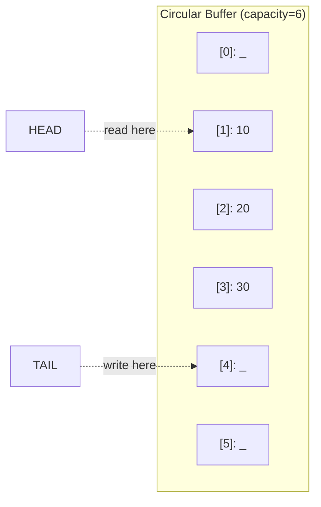

# Queue - Go Implementation

## Why Queues?

### The Problem It Solves

Imagine you're building a print spooler. Documents arrive at unpredictable times, but the printer can only handle one document at a time. You need a way to:
1. Accept new print jobs as they come in
2. Process them in the order they arrived (first come, first served)
3. Never lose a job, even when the printer is busy

Using a simple slice and removing from the front with `slice[1:]` seems tempting, but it's secretly expensive. Every removal copies all remaining elements forward, making it O(n). With 1000 documents in the queue, removing the first one shifts 999 elements. Ouch.

A **queue** solves this by providing O(1) operations for both adding to the back and removing from the front. The secret sauce is a technique called a **circular buffer**.

### Real-World Analogies

**The Checkout Line**: At a grocery store, people join at the back and leave from the front. The first person in line is the first person served. This is FIFO (First-In, First-Out) - the fundamental property of a queue.

**A Conveyor Belt (that loops)**: Picture a circular conveyor belt in a sushi restaurant. Items are placed on at one spot and picked up at another. The belt keeps moving in a circle, so you're never "at the end" - you just loop around.

**A Circular Track**: Imagine runners on a track. The "head" runner marks where people exit, the "tail" runner marks where new people join. As people leave and join, both markers move around the track. When they reach the end, they loop back to the start.

### When to Use It

- **Task scheduling**: Process jobs in the order they were submitted
- **Breadth-first search**: Explore graph nodes level by level
- **Buffering**: Handle data that arrives faster than you can process it
- **Message passing**: Send messages between goroutines (though Go's channels are often better)

Unlike a stack (LIFO - last in, first out), a queue preserves arrival order. Use a queue when fairness matters.

---

## Core Concept

### The Big Idea

A circular buffer treats a fixed-size array as if it were a ring. Two indices track the **head** (where we read from) and **tail** (where we write to). When an index reaches the end, it wraps around to the beginning using modular arithmetic.

This "wraparound" trick means we never need to shift elements. Both enqueue and dequeue are O(1) because they just update an index and wrap it around.

### Visual Representation



In this buffer:
- Elements 10, 20, 30 are stored at indices 1, 2, 3
- `head = 1` (next element to dequeue is at index 1)
- `tail = 4` (next enqueue will go to index 4)
- `size = 3` (three elements currently stored)
- The `_` slots are empty (available for future enqueues)

When `tail` reaches index 5 and we enqueue again, it wraps to index 0. The buffer "loops around."

### Key Terminology

- **Head**: The index of the front element (oldest, will be dequeued next)
- **Tail**: The index where the next element will be written
- **Size**: How many elements are currently in the queue
- **Capacity**: Total slots in the underlying array
- **Wrap around**: When an index exceeds capacity, reset it to 0 using modulo
- **FIFO**: First-In, First-Out ordering

---

## How It Works: Step-by-Step

### Operation 1: Enqueue (Add to Back)

**What it does**: Adds an element to the back of the queue.

**Step-by-step walkthrough**:

Starting with an empty queue (capacity 4, after first grow):
```
Index:     0    1    2    3
Data:    [ _ ][ _ ][ _ ][ _ ]
           ^
         head=0, tail=0, size=0
```

**Step 1**: Enqueue(10) - Write 10 at tail, advance tail
```
Index:     0    1    2    3
Data:    [10 ][ _ ][ _ ][ _ ]
           ^    ^
         head  tail
         size=1
```

**Step 2**: Enqueue(20) - Write 20 at tail, advance tail
```
Index:     0    1    2    3
Data:    [10 ][20 ][ _ ][ _ ]
           ^         ^
         head       tail
         size=2
```

**Step 3**: Enqueue(30), Enqueue(40) - Fill the buffer
```
Index:     0    1    2    3
Data:    [10 ][20 ][30 ][40 ]
           ^                  ^
         head                tail (wraps to 0, but size=capacity triggers grow)
         size=4
```

**Step 4**: Enqueue(50) - Must grow first!
Before we can enqueue, `size == capacity`, so we double the capacity:
```
Old: [10][20][30][40]  head=0, tail=0 (wrapped)

Copy in logical order (starting from head):
New: [10][20][30][40][ _ ][ _ ][ _ ][ _ ]
      ^               ^
    head=0           tail=4
    capacity=8
```

Now enqueue 50:
```
Index:     0    1    2    3    4    5    6    7
Data:    [10 ][20 ][30 ][40 ][50 ][ _ ][ _ ][ _ ]
           ^                        ^
         head                      tail
         size=5
```

**Why this approach?** By using modulo arithmetic `(tail + 1) % capacity`, we avoid expensive element shifting. The "circular" nature means old slots get reused when elements are dequeued.

### Operation 2: Dequeue (Remove from Front)

**What it does**: Removes and returns the front element.

**Step-by-step walkthrough**:

Starting state (from before):
```
Index:     0    1    2    3    4    5    6    7
Data:    [10 ][20 ][30 ][40 ][50 ][ _ ][ _ ][ _ ]
           ^                        ^
         head=0                    tail=5
         size=5
```

**Step 1**: Dequeue() - Return 10, clear slot, advance head
```
Index:     0    1    2    3    4    5    6    7
Data:    [ _ ][20 ][30 ][40 ][50 ][ _ ][ _ ][ _ ]
                ^                   ^
              head=1               tail=5
              size=4

Returns: 10
```

**Step 2**: Dequeue() - Return 20, clear slot, advance head
```
Index:     0    1    2    3    4    5    6    7
Data:    [ _ ][ _ ][30 ][40 ][50 ][ _ ][ _ ][ _ ]
                     ^              ^
                   head=2          tail=5
                   size=3

Returns: 20
```

**Why clear the slot?** We set the old position to the zero value (`var zero T`) to help Go's garbage collector. If T is a pointer type, keeping the old reference would prevent GC from collecting that object.

### Operation 3: Wrap Around in Action

Let's see the circular nature. Start with:
```
Index:     0    1    2    3
Data:    [ _ ][ _ ][30 ][40 ]
                     ^
                   head=2
                   tail=0 (wrapped!)
                   size=2
```

Enqueue(50):
```
Index:     0    1    2    3
Data:    [50 ][ _ ][30 ][40 ]
           ^    ^
         tail  (empty)
         head=2
         size=3
```

Enqueue(60):
```
Index:     0    1    2    3
Data:    [50 ][60 ][30 ][40 ]
                ^    ^
              tail  head
              size=4
```

Notice how the "newer" elements (50, 60) are at lower indices than "older" elements (30, 40). The logical order is 30, 40, 50, 60 - but physical storage wraps around!

### Worked Example: Complete Sequence

Let's trace through a realistic sequence:

```
Operation 1: New() - Create empty queue
State: head=0, tail=0, size=0, capacity=0
Data: []
```

```
Operation 2: Enqueue(5) - First enqueue triggers grow to capacity 1
State: head=0, tail=1 (wraps to 0+1=1, but cap=1 so =0), size=1, capacity=1

Wait, let's be precise:
- grow() sets capacity to 1
- Enqueue writes at tail=0, then tail = (0+1) % 1 = 0
Data: [5]
head=0, tail=0, size=1, capacity=1
```

```
Operation 3: Enqueue(10) - size==capacity, grow to capacity 2
After grow: [5][ _ ], head=0, tail=1
After enqueue(10): [5][10], tail = (1+1) % 2 = 0
Data: [5][10]
head=0, tail=0, size=2, capacity=2
```

```
Operation 4: Dequeue() - Returns 5
Read data[head=0] = 5
Clear data[0], head = (0+1) % 2 = 1
Data: [_][10]
head=1, tail=0, size=1
Returns: 5, nil
```

```
Operation 5: Enqueue(15)
Write 15 at tail=0, tail = (0+1) % 2 = 1
Data: [15][10]
head=1, tail=1, size=2
Note: Logical order is 10, 15 (starting from head)
```

```
Operation 6: Enqueue(20) - size==capacity, grow to capacity 4
After grow (linearizes from head):
[10][15][_][_], head=0, tail=2
After enqueue(20): tail = (2+1) % 4 = 3
Data: [10][15][20][_]
head=0, tail=3, size=3
```

```
Operation 7: Front() - Returns 10 without removing
Returns: data[head=0] = 10, nil
State unchanged
```

```
Operation 8: Back() - Returns 20 without removing
idx = (tail-1 + capacity) % capacity = (3-1+4) % 4 = 6 % 4 = 2
Returns: data[2] = 20, nil
State unchanged
```

---

## From Concept to Code

### The Data Structure

Before looking at code, let's understand what we need to track:

| Field | Purpose |
|-------|---------|
| `data` | The underlying slice storing elements |
| `head` | Index of the front element |
| `tail` | Index where the next element will go |
| `size` | Number of elements currently stored |
| `capacity` | Length of the underlying slice |

Why both `size` and `capacity`? Because in a circular buffer, we can't tell if the queue is full or empty just by comparing head and tail. If `head == tail`, is the buffer completely full or completely empty? Tracking `size` explicitly resolves this ambiguity.

### Go Implementation

```go
package queue

import "errors"

var ErrEmptyQueue = errors.New("Queue: empty queue")

type Queue[T any] struct {
    data     []T
    head     int
    tail     int
    size     int
    capacity int
}
```

**Line-by-line breakdown**:

- `var ErrEmptyQueue = errors.New(...)` - A **sentinel error**. It's exported (capital E) so callers can check `errors.Is(err, queue.ErrEmptyQueue)`. This is Go's idiomatic way to handle expected error conditions.

- `type Queue[T any] struct` - The `[T any]` declares a **type parameter**. `any` is an alias for `interface{}`, meaning T can be any type (int, string, custom struct, etc.). This is Go 1.18+ generics.

- `data []T` - A slice, not an array. Slices can grow, and we use `make()` to allocate them.

- `head`, `tail`, `size`, `capacity` - All `int`. Go initializes them to 0 (the zero value), which is exactly what we want for an empty queue.

### Creating a Queue

```go
func New[T any]() *Queue[T] {
    return &Queue[T]{}
}
```

**Understanding this function**:

- `func New[T any]()` - A generic function that takes a type parameter T
- Returns `*Queue[T]` - A **pointer** to the queue, not a copy
- `&Queue[T]{}` - Creates a Queue with all fields at zero values, returns its address

**Why return a pointer?** All our methods modify the queue (except Size/IsEmpty). Methods need pointer receivers (`*Queue[T]`) to modify the original struct. If we returned a value instead of a pointer, callers might accidentally work with copies:

```go
q := queue.New[int]()  // q is *Queue[int]
q.Enqueue(5)           // Modifies the actual queue

// If New returned Queue[int] (not pointer):
q := queue.New[int]()  // q is Queue[int]
q.Enqueue(5)           // Modifies a copy! Original unchanged.
```

### Implementing Enqueue

**The algorithm in plain English**:
1. If the queue is full (size equals capacity), grow the buffer
2. Store the value at the tail position
3. Advance tail, wrapping around if needed
4. Increment size

**The code**:

```go
func (q *Queue[T]) Enqueue(value T) {
    if q.size == q.capacity {
        q.grow()
    }
    q.data[q.tail] = value
    q.tail = (q.tail + 1) % q.capacity
    q.size++
}
```

**Understanding the tricky parts**:

- `(q *Queue[T])` - **Pointer receiver**. This means `q` is a pointer to the Queue, so modifications affect the original.

- `q.data[q.tail] = value` - Store at tail position. Note: we don't need `(*q).data` because Go automatically dereferences.

- `(q.tail + 1) % q.capacity` - **Modulo for wrap-around**. If tail is at the last index and we add 1, modulo brings it back to 0.

### Implementing Dequeue

**The algorithm in plain English**:
1. If empty, return an error
2. Save the value at the head position
3. Clear the slot (help garbage collector)
4. Advance head, wrapping around if needed
5. Decrement size
6. Return the value

**The code**:

```go
func (q *Queue[T]) Dequeue() (T, error) {
    var zero T
    if q.size == 0 {
        return zero, ErrEmptyQueue
    }
    value := q.data[q.head]
    q.data[q.head] = zero
    q.head = (q.head + 1) % q.capacity
    q.size--
    return value, nil
}
```

**Understanding the tricky parts**:

- `var zero T` - Creates the **zero value** for type T. For int it's 0, for string it's "", for pointers it's nil. We need this for two purposes: returning something on error, and clearing slots.

- `return zero, ErrEmptyQueue` - Go's **multi-value return**. The caller must check the error:
  ```go
  val, err := q.Dequeue()
  if err != nil {
      // Handle error
  }
  ```

- `q.data[q.head] = zero` - **Clear the slot**. This is important for garbage collection. If T is `*SomeBigStruct`, keeping the old pointer in the array prevents that struct from being collected.

### Implementing Back (The Modulo Gotcha)

**The algorithm in plain English**:
1. If empty, return an error
2. Calculate the index of the last element: one before tail
3. Return the value at that index

**The code**:

```go
func (q *Queue[T]) Back() (T, error) {
    var zero T
    if q.size == 0 {
        return zero, ErrEmptyQueue
    }
    idx := (q.tail - 1 + q.capacity) % q.capacity
    return q.data[idx], nil
}
```

**Understanding the modulo gotcha**:

Why `(q.tail - 1 + q.capacity)` instead of just `(q.tail - 1)`?

In Go (and C, and many languages), the modulo operator with a negative dividend returns a negative result:

```go
(-1) % 4  // Returns -1, not 3!
```

If `tail` is 0, then `tail - 1` is -1, and `-1 % capacity` gives -1, not `capacity - 1` as we want.

The fix: add `capacity` first to ensure the dividend is positive:
```go
(0 - 1 + 4) % 4 = 3 % 4 = 3  // Correct!
```

This is a **common source of bugs** when implementing circular buffers.

### Implementing grow

**The algorithm in plain English**:
1. Calculate new capacity (double, or 1 if currently 0)
2. Allocate a new slice
3. Copy elements in logical order (from head to tail, wrapping)
4. Reset head to 0, tail to size
5. Update capacity

**The code**:

```go
func (q *Queue[T]) grow() {
    newCap := 1
    if q.capacity > 0 {
        newCap = q.capacity * 2
    }
    newData := make([]T, newCap)
    for i := 0; i < q.size; i++ {
        newData[i] = q.data[(q.head+i)%q.capacity]
    }
    q.data = newData
    q.head = 0
    q.tail = q.size
    q.capacity = newCap
}
```

**Understanding the tricky parts**:

- `make([]T, newCap)` - Allocates a slice of length and capacity `newCap`, initialized to zero values.

- `q.data[(q.head+i)%q.capacity]` - Reads elements in **logical order**. Starting from head, moving forward with wrap-around. This "linearizes" the circular buffer.

- After grow, `head = 0` and `tail = size` - The new buffer is "clean" with elements at indices 0 through size-1.

### Implementing Clone

```go
func (q *Queue[T]) Clone() *Queue[T] {
    clone := &Queue[T]{
        data:     make([]T, q.capacity),
        head:     0,
        tail:     q.size,
        size:     q.size,
        capacity: q.capacity,
    }
    for i := 0; i < q.size; i++ {
        clone.data[i] = q.data[(q.head+i)%q.capacity]
    }
    return clone
}
```

Clone creates an **independent copy**. Modifications to the clone don't affect the original, and vice versa.

Note: This is a **shallow copy**. If T is a pointer type, the clone contains the same pointers as the original. They point to the same objects. For a deep copy with pointer types, you'd need type-specific logic.

---

## Complexity Analysis

### Time Complexity

| Operation | Best | Average | Worst | Why |
|-----------|------|---------|-------|-----|
| Enqueue   | O(1) | O(1) amortized | O(n) | Usually just index update. Resize copies all n elements. |
| Dequeue   | O(1) | O(1) | O(1) | Always just index arithmetic and assignment. |
| Front     | O(1) | O(1) | O(1) | Direct index access. |
| Back      | O(1) | O(1) | O(1) | Direct index access with one subtraction. |
| Size      | O(1) | O(1) | O(1) | Returns stored value. |
| IsEmpty   | O(1) | O(1) | O(1) | Comparison with 0. |
| Clear     | O(n) | O(n) | O(n) | Zeros all slots for GC. |
| Clone     | O(n) | O(n) | O(n) | Must copy all elements. |

**Understanding amortized O(1) for Enqueue**:

Occasionally, Enqueue triggers a resize that takes O(n) time. But resizes are rare because capacity doubles each time.

Consider n enqueues starting from capacity 0:
- Resize happens at sizes: 0, 1, 2, 4, 8, 16, ... (powers of 2)
- Total copy operations: 0 + 1 + 2 + 4 + 8 + ... + n/2 = n - 1

So n enqueues cause n + (n-1) = 2n-1 operations. That's O(n) total, or O(1) per enqueue on average. This is what "amortized O(1)" means.

### Space Complexity

- **Overall structure**: O(n) where n is the number of elements
- **Per Enqueue**: O(1) usually, O(n) during resize (allocates new array)
- **Dequeue, Front, Back, Size, IsEmpty**: O(1) no allocation
- **Clone**: O(n) allocates a complete copy

**Memory overhead**: Capacity can be up to 2x the current size (due to doubling). In the worst case, right after a resize, you have capacity 2n but only n+1 elements.

---

## Common Mistakes & Pitfalls

### Mistake 1: Forgetting to Check Errors

```go
// Wrong: Ignoring the error
val, _ := q.Dequeue()
fmt.Println(val)  // Prints zero value if queue was empty!

// Right: Always check errors
val, err := q.Dequeue()
if err != nil {
    // Handle empty queue appropriately
    return
}
fmt.Println(val)
```

**Why this matters**: Go returns the zero value for T when there's an error. If T is `int`, you get 0, which might be a valid value! Always check the error.

### Mistake 2: Negative Modulo Bug

```go
// Wrong: Naive calculation for "previous" index
func (q *Queue[T]) Back() (T, error) {
    idx := (q.tail - 1) % q.capacity  // BUG: negative when tail=0
    return q.data[idx], nil
}

// Right: Add capacity to ensure positive dividend
func (q *Queue[T]) Back() (T, error) {
    idx := (q.tail - 1 + q.capacity) % q.capacity
    return q.data[idx], nil
}
```

**Why this matters**: When `tail` is 0, `(0 - 1) % 4` returns -1 in Go, not 3. This causes an array index out of bounds panic.

### Mistake 3: Modifying While Iterating

```go
// Wrong: Modifying the queue during iteration
for i := 0; i < q.Size(); i++ {
    val, _ := q.Front()
    if val < 0 {
        q.Dequeue()  // BUG: Size() changes, loop misbehaves
    }
}

// Right: Collect items first, then process
toRemove := 0
originalSize := q.Size()
for i := 0; i < originalSize; i++ {
    val, _ := q.Dequeue()
    if val >= 0 {
        q.Enqueue(val)  // Re-add items we want to keep
    }
}
```

**Why this matters**: The queue doesn't have an iterator. If you modify it during a "manual iteration," size changes and you lose track of position.

### Mistake 4: Assuming Clone is Deep

```go
type Item struct {
    Name string
}

q1 := queue.New[*Item]()
q1.Enqueue(&Item{Name: "original"})

q2 := q1.Clone()
item, _ := q2.Front()
item.Name = "modified"

// BUG: q1's item is also "modified"!
// Both queues contain pointers to the SAME Item struct
```

**Why this matters**: Clone copies pointer values, not the objects they point to. For deep cloning with pointer types, you need custom logic.

### Mistake 5: Comparing Errors with ==

```go
// Fragile: Works but not idiomatic
if err == queue.ErrEmptyQueue {
    // ...
}

// Better: Use errors.Is for wrapped errors
if errors.Is(err, queue.ErrEmptyQueue) {
    // ...
}
```

**Why this matters**: `errors.Is` handles error wrapping (from `fmt.Errorf("%w", err)`). Direct comparison fails if the error was wrapped.

---

## Practice Problems

To solidify your understanding, try implementing:

1. **MaxQueue**: A queue that also supports `Max()` in O(1) time. Hint: maintain a secondary data structure.

2. **CircularBuffer with overwrite**: Modify the queue so that when full, `Enqueue` overwrites the oldest element instead of growing. Useful for "keep the last N items" scenarios.

3. **Level-Order Tree Traversal**: Use a queue to implement breadth-first traversal of a binary tree. Enqueue the root, then repeatedly dequeue a node, process it, and enqueue its children.

4. **Hot Potato Simulation**: N people in a circle pass a "hot potato." Every K passes, the person holding it is out. Last person wins. (Use a queue where dequeue + enqueue simulates passing.)

---

## Summary

### Key Takeaways

- A **queue** provides FIFO (First-In, First-Out) ordering with O(1) enqueue and dequeue
- **Circular buffers** use modulo arithmetic to wrap indices, avoiding costly element shifts
- Go's **generics** (`[T any]`) let us write type-safe queues for any element type
- Always use `(index + capacity) % capacity` to avoid **negative modulo** bugs
- Go uses **error returns** (`(T, error)`) instead of exceptions for expected failures
- **Sentinel errors** (`var ErrEmptyQueue`) allow callers to check error identity

### Quick Reference

```
Queue[T] - FIFO collection using circular buffer
|-- New[T]()           O(1) - Create empty queue
|-- Enqueue(T)         O(1)* - Add to back (*amortized, O(n) resize)
|-- Dequeue() (T,err)  O(1) - Remove from front
|-- Front() (T,err)    O(1) - Peek front without removing
|-- Back() (T,err)     O(1) - Peek back without removing
|-- Size() int         O(1) - Number of elements
|-- IsEmpty() bool     O(1) - Check if empty
|-- Clear()            O(n) - Remove all elements
|-- Clone() *Queue[T]  O(n) - Independent copy

Best for: Task queues, BFS, buffering, any FIFO scenario
Avoid when: You need random access, or LIFO order (use stack instead)
```

### Go-Specific Idioms Used

| Pattern | Example | Purpose |
|---------|---------|---------|
| Generics | `[T any]` | Type-safe container for any type |
| Pointer receiver | `(q *Queue[T])` | Methods can modify the struct |
| Zero value | `var zero T` | Default value for error returns |
| Sentinel error | `var ErrEmptyQueue` | Exported error for `errors.Is()` checking |
| Multi-return | `(T, error)` | Explicit error handling |
