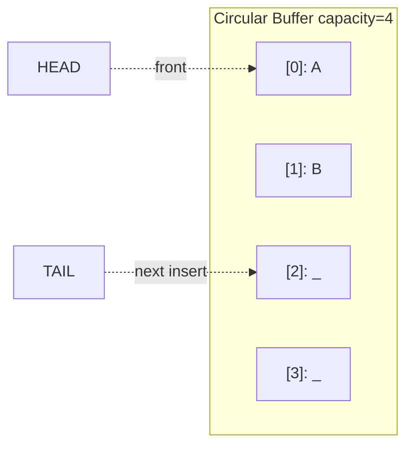

# Queue - Python Implementation

## Why Queue?

### The Problem It Solves

Imagine you're building a print spooler. Documents come in from multiple users, and you need to print them in the order they arrived. You can't just use a list and remove from the front each time because `list.pop(0)` is slow - it has to shift every remaining element. What you need is a data structure that efficiently handles the pattern: "process things in the order they arrived."

This is the **FIFO (First-In, First-Out)** problem, and queues solve it elegantly.

### Real-World Analogies

1. **A line at a coffee shop**: The first person to join the line is the first to get served. New customers join at the back. You don't skip to the front, and you don't serve from the middle.

2. **A printer queue**: Print jobs are processed in the order submitted. Your document doesn't jump ahead of someone else's just because it's smaller.

3. **A conveyor belt**: Items placed on one end travel down and come off the other end in the same order. The belt keeps moving; you load from one side and unload from the other.

### When to Use It

- **Task scheduling**: Processing requests in arrival order
- **Breadth-first search (BFS)**: Exploring graph levels one at a time
- **Buffering**: Managing data between a fast producer and slow consumer
- **Event handling**: Processing events in the order they occurred

Unlike a **stack** (which is LIFO - last-in, first-out), a queue preserves arrival order. Unlike a **deque** (double-ended queue), a queue only adds to the back and removes from the front.

---

## Core Concept

### The Big Idea

A queue maintains **FIFO order**: elements leave in the same order they arrived. The key insight of a **circular buffer** implementation is that we can reuse space at the beginning of our array after elements are removed, avoiding the need to shift elements or constantly grow the array.

Instead of moving elements when we remove from the front, we simply move our "front pointer" forward. When we reach the end of the array, we wrap around to the beginning. The array becomes a circle.

### Visual Representation



The `head` points to the front element (the next one to be removed). The `tail` points to where the next element will be inserted. The queue currently holds elements A and B.

### Key Terminology

- **FIFO (First-In, First-Out)**: The ordering principle - first element added is the first removed
- **Enqueue**: Add an element to the back of the queue
- **Dequeue**: Remove and return the element at the front of the queue
- **Head**: The front of the queue (where we remove from)
- **Tail**: The back of the queue (where we add to)
- **Circular buffer**: An array where indices wrap around from the end back to the beginning
- **Wrap-around**: When head or tail reaches the end of the array, it jumps back to index 0

---

## How It Works: Step-by-Step

### Operation 1: Enqueue (Add to Back)

**What it does**: Adds an element at the tail position and advances the tail.

**Step-by-step walkthrough**:

Starting state (empty queue, capacity=4):
```
Index:    [0]  [1]  [2]  [3]
Data:      _    _    _    _
           ^
         head
         tail
size = 0
```

Step 1: `enqueue('A')` - Place 'A' at tail position (0)
```
Index:    [0]  [1]  [2]  [3]
Data:      A    _    _    _
           ^    ^
         head  tail
size = 1
```

Step 2: `enqueue('B')` - Place 'B' at tail position (1)
```
Index:    [0]  [1]  [2]  [3]
Data:      A    B    _    _
           ^         ^
         head      tail
size = 2
```

**Why this approach?** By tracking where to insert next (tail) rather than always appending to the end, we can reuse slots that become available after dequeue operations.

### Operation 2: Dequeue (Remove from Front)

**What it does**: Returns the element at head and advances head forward.

**Step-by-step walkthrough**:

Starting state (queue with A, B):
```
Index:    [0]  [1]  [2]  [3]
Data:      A    B    _    _
           ^         ^
         head      tail
size = 2
```

Step 1: `dequeue()` returns 'A', clears slot, advances head
```
Index:    [0]  [1]  [2]  [3]
Data:      _    B    _    _
                ^    ^
              head  tail
size = 1
```

**Why clear the slot?** Setting `_data[head] = None` releases the reference to the removed object, allowing Python's garbage collector to reclaim memory if nothing else references it.

### Operation 3: Wrap-Around

**What it does**: When head or tail reaches the end of the array, it wraps to index 0.

**Step-by-step walkthrough**:

Starting state (tail at end, space at front):
```
Index:    [0]  [1]  [2]  [3]
Data:      _    _    C    D
                     ^         ^
                   head      tail (would be 4, but wraps)
size = 2
```

Step 1: `enqueue('E')` - tail wraps around: `(4) % 4 = 0`
```
Index:    [0]  [1]  [2]  [3]
Data:      E    _    C    D
                ^    ^
              tail  head
size = 3
```

The queue now "wraps around" - it contains C, D, E in logical order, but they're stored as C at [2], D at [3], E at [0].

Step 2: `dequeue()` returns 'C', advances head with wrap-around
```
Index:    [0]  [1]  [2]  [3]
Data:      E    _    _    D
                ^         ^
              tail      head
size = 2
```

**Why this approach?** Without wrap-around, we'd either waste space at the front of the array or need to shift all elements left on every dequeue (which is O(n)). Wrap-around gives us O(1) dequeue while reusing space.

### Worked Example: Complete Sequence

Let's trace through a realistic sequence showing wrap-around and resize:

```
Initial state (capacity=4):
[_][_][_][_]  head=0, tail=0, size=0

enqueue('A'):
[A][_][_][_]  head=0, tail=1, size=1

enqueue('B'):
[A][B][_][_]  head=0, tail=2, size=2

dequeue() -> 'A':
[_][B][_][_]  head=1, tail=2, size=1
(Slot 0 is now free for reuse)

enqueue('C'):
[_][B][C][_]  head=1, tail=3, size=2

enqueue('D'):
[_][B][C][D]  head=1, tail=0 (wrapped!), size=3

enqueue('E'):
[E][B][C][D]  head=1, tail=1, size=4
(Queue is now full - tail caught up to head)

enqueue('F'):
RESIZE! Linearize and double capacity:
[B][C][D][E][F][_][_][_]  head=0, tail=5, size=5, capacity=8

dequeue() -> 'B':
[_][C][D][E][F][_][_][_]  head=1, tail=5, size=4
```

Notice how:
- After the first dequeue, slot 0 became available
- When tail wrapped around, it reused slot 0 for 'E'
- When the queue became full, resize linearized elements into a fresh array

---

## From Concept to Code

### The Data Structure

Before showing code, let's understand what we need to track:

| Field | Purpose |
|-------|---------|
| `_data` | The array holding our elements |
| `_head` | Index of the front element (next to dequeue) |
| `_tail` | Index where the next element will go (next enqueue location) |
| `_size` | How many elements are currently in the queue |
| `_capacity` | Total slots in the array |

We need both `_size` and `_capacity` because in a circular buffer, you can't tell if the queue is empty or full just by comparing head and tail - both cases have head == tail!

### Python Implementation

```python
class Queue:
    def __init__(self):
        self._data = [None] * 4
        self._head = 0
        self._tail = 0
        self._size = 0
        self._capacity = 4
```

**Line-by-line breakdown**:
- `self._data = [None] * 4`: Creates a list of 4 `None` values. We start with capacity 4 to avoid resizing on the first few enqueues.
- `self._head = 0`: Front of the queue starts at index 0.
- `self._tail = 0`: Next insertion point also starts at 0 (queue is empty, so they're the same).
- `self._size = 0`: No elements yet.
- `self._capacity = 4`: Matches our initial array size.

The underscore prefix (`_data`, `_head`, etc.) is Python convention for "private" - these are implementation details, not part of the public interface.

### Implementing Enqueue

**The algorithm in plain English**:
1. If the queue is full, grow the array
2. Place the new value at the tail position
3. Advance tail (wrapping if necessary)
4. Increment size

**The code**:
```python
def enqueue(self, value):
    if self._size == self._capacity:
        self._grow()
    self._data[self._tail] = value
    self._tail = (self._tail + 1) % self._capacity
    self._size += 1
```

**Understanding the tricky parts**:
- `(self._tail + 1) % self._capacity`: The modulo operator handles wrap-around. If tail is 3 and capacity is 4, then `(3 + 1) % 4 = 0`. The tail wraps back to the beginning.
- We check size against capacity, not whether head equals tail, because head == tail means EITHER empty OR full depending on size.

### Implementing Dequeue

**The algorithm in plain English**:
1. If queue is empty, raise an error
2. Save the value at head
3. Clear that slot (for garbage collection)
4. Advance head (wrapping if necessary)
5. Decrement size
6. Return the saved value

**The code**:
```python
def dequeue(self):
    if self._size == 0:
        raise IndexError("dequeue from empty queue")
    value = self._data[self._head]
    self._data[self._head] = None
    self._head = (self._head + 1) % self._capacity
    self._size -= 1
    return value
```

**Understanding the tricky parts**:
- `self._data[self._head] = None`: This isn't strictly necessary for correctness, but it's important for memory. Without it, the queue would hold a reference to the dequeued object, preventing Python's garbage collector from reclaiming that memory.
- `(self._head + 1) % self._capacity`: Same wrap-around logic as tail.
- We use `IndexError` to match Python's convention for sequence types (like how `list.pop()` raises `IndexError` on an empty list).

### Implementing Back (Peek at Last Element)

**The algorithm in plain English**:
1. If queue is empty, raise an error
2. Calculate the index of the last element (one before tail, with wrap-around)
3. Return the value at that index

**The code**:
```python
def back(self):
    if self._size == 0:
        raise IndexError("back from empty queue")
    back_index = (self._tail - 1) % self._capacity
    return self._data[back_index]
```

**Understanding the tricky parts**:
- `(self._tail - 1) % self._capacity`: This handles the wrap-around edge case. If tail is 0, then `(0 - 1) % 4 = -1 % 4 = 3`. Python's modulo with negative numbers always returns a non-negative result when the divisor is positive, which is exactly what we want!

### Implementing Grow (Resize)

**The algorithm in plain English**:
1. Create a new array with double the capacity
2. Copy elements from the old array to the new array, linearizing them (putting them in order starting at index 0)
3. Reset head to 0 and tail to size
4. Update capacity

**The code**:
```python
def _grow(self):
    new_capacity = self._capacity * 2
    new_data = [None] * new_capacity
    for i in range(self._size):
        new_data[i] = self._data[(self._head + i) % self._capacity]
    self._data = new_data
    self._head = 0
    self._tail = self._size
    self._capacity = new_capacity
```

**Understanding the tricky parts**:
- `self._data[(self._head + i) % self._capacity]`: This reads elements in logical order (front to back), not storage order. If head is 2 and elements wrap around, this correctly follows the circular path.
- `self._tail = self._size`: After linearizing, the first empty slot is right after all the elements.
- Doubling capacity (`* 2`) gives us amortized O(1) enqueue - we spread the cost of copying n elements over the n enqueues that led to the resize.

### Python Magic Methods

The implementation includes two "dunder" (double underscore) methods that integrate with Python's built-in functions:

```python
def __len__(self):
    return self._size

def __bool__(self):
    return self._size > 0
```

**Why these matter**:
- `__len__` enables `len(queue)` - returns the number of elements
- `__bool__` enables truthiness checks - `if queue:` works naturally

```python
queue = Queue()
if not queue:  # Works! __bool__ returns False when empty
    print("Queue is empty")

queue.enqueue(1)
print(len(queue))  # Works! __len__ returns 1
```

---

## Complexity Analysis

### Time Complexity

| Operation | Best | Average | Worst | Why |
|-----------|------|---------|-------|-----|
| enqueue   | O(1) | O(1)*   | O(n)  | Usually just assigns and increments. Worst case triggers resize. |
| dequeue   | O(1) | O(1)    | O(1)  | Just reads, clears, and increments. No data movement. |
| front     | O(1) | O(1)    | O(1)  | Direct array access at head index. |
| back      | O(1) | O(1)    | O(1)  | Direct array access at (tail-1) index. |
| size      | O(1) | O(1)    | O(1)  | Just returns stored value. |
| is_empty  | O(1) | O(1)    | O(1)  | Just compares size to 0. |
| clear     | O(n) | O(n)    | O(n)  | Creates new list of n None values. |
| copy      | O(n) | O(n)    | O(n)  | Must copy all n elements. |

*Amortized O(1) - see below.

**Understanding the "Why" column**:
- Enqueue's worst case is O(n) because resizing copies all n elements. But this happens rarely - only when the array is full.
- Dequeue is always O(1) because we never shrink the array or move elements.
- Clear is O(n) because `[None] * capacity` allocates and initializes `capacity` slots.

### Space Complexity

- **Overall structure**: O(n) where n is the number of elements
- **Per operation**: O(1) for most operations, O(n) for enqueue during resize and for copy

The circular buffer may have some wasted space (capacity > size), but capacity is at most 2x the high-water mark of elements stored.

### Amortized Analysis

"Amortized O(1)" means that while individual operations might be expensive, the average over many operations is O(1).

For enqueue: Suppose we start with capacity 4 and enqueue n elements.
- Resizes happen at sizes 4, 8, 16, 32, ...
- Total copying work: 4 + 8 + 16 + ... up to n = O(n)
- But we did n enqueues to cause this work
- Average work per enqueue: O(n) / n = O(1)

Think of it like paying $1 per enqueue into a "resize fund." When resize happens, the fund has enough to pay for the copying. Each enqueue truly costs O(1) on average.

---

## Common Mistakes & Pitfalls

### Mistake 1: Confusing Empty and Full

```python
# Wrong: Checking head == tail to determine if full
def is_full(self):
    return self._head == self._tail  # BUG! This is also true when empty!

# Right: Track size explicitly
def is_full(self):
    return self._size == self._capacity
```

**Why this matters**: In a circular buffer without a size counter, head == tail is ambiguous. It could mean the queue is empty (nothing between head and tail) or full (tail wrapped all the way around). Always track size separately.

### Mistake 2: Forgetting Wrap-Around in Back

```python
# Wrong: Simple subtraction
def back(self):
    return self._data[self._tail - 1]  # BUG! Fails when tail is 0

# Right: Use modulo for wrap-around
def back(self):
    back_index = (self._tail - 1) % self._capacity
    return self._data[back_index]
```

**Why this matters**: When tail is 0, `tail - 1` is -1, which in Python accesses the last element of the list (negative indexing). But we want the element at index `capacity - 1`. The modulo handles this: `(-1) % 4 = 3`.

### Mistake 3: Not Clearing Dequeued Slots

```python
# Wrong: Leave old reference in place
def dequeue(self):
    value = self._data[self._head]
    self._head = (self._head + 1) % self._capacity
    self._size -= 1
    return value

# Right: Clear the reference
def dequeue(self):
    value = self._data[self._head]
    self._data[self._head] = None  # Allow garbage collection
    self._head = (self._head + 1) % self._capacity
    self._size -= 1
    return value
```

**Why this matters**: If you store large objects and dequeue them but don't clear the slot, the queue still holds a reference. That object can't be garbage collected until the slot is overwritten by a future enqueue. This causes a memory leak in long-running programs.

### Mistake 4: Off-by-One in Copy

```python
# Wrong: Copy from 0 to size
def copy(self):
    clone = Queue()
    for i in range(self._size):
        clone._data[i] = self._data[i]  # BUG! Elements may not start at 0

# Right: Follow the circular structure
def copy(self):
    clone = Queue()
    clone._capacity = self._capacity
    clone._data = [None] * self._capacity
    clone._head = self._head
    clone._tail = self._tail
    clone._size = self._size
    for i in range(self._size):
        idx = (self._head + i) % self._capacity
        clone._data[idx] = self._data[idx]
    return clone
```

**Why this matters**: After wrap-around, elements don't start at index 0. If head is 2, the first logical element is at index 2, not 0. You must either preserve the circular layout (as this implementation does) or linearize elements starting from head.

---

## Practice Problems

To solidify your understanding, try implementing:

1. **Peek at the nth element**: Add a `peek(n)` method that returns the nth element from the front without removing it. Handle wrap-around correctly.

2. **Shrinking**: Modify `dequeue()` to shrink the array by half when it's less than 25% full. Be careful to linearize elements during shrink.

3. **Iterator support**: Add `__iter__` to allow `for item in queue:` syntax. Decide: should iteration consume elements or just view them?

4. **Implement a sliding window maximum**: Given a stream of numbers and a window size k, use a queue (or deque) to efficiently track the maximum value in the last k numbers.

---

## Summary

### Key Takeaways

- A **queue** enforces FIFO (First-In, First-Out) order - elements leave in the same order they arrived
- A **circular buffer** avoids O(n) shifts on dequeue by wrapping indices around the array
- The **modulo operator** (`%`) is the key to wrap-around: `(index + 1) % capacity`
- Always track **size separately** - in a circular buffer, head == tail is ambiguous
- **Clear dequeued slots** to allow garbage collection of removed elements
- **Amortized O(1)** enqueue comes from doubling the array size on resize

### Quick Reference

```
Queue (Circular Buffer) - FIFO data structure with O(1) operations

Operations:
  enqueue(value)  : O(1) amortized - Add to back
  dequeue()       : O(1) - Remove and return from front
  front()         : O(1) - Peek at front element
  back()          : O(1) - Peek at back element
  size()          : O(1) - Return number of elements
  is_empty()      : O(1) - Check if queue is empty
  clear()         : O(n) - Remove all elements
  copy()          : O(n) - Create independent copy

Python integration:
  len(queue)      : Works via __len__
  if queue:       : Works via __bool__

Best for:
  - Processing items in arrival order
  - BFS graph traversal
  - Buffering between producer/consumer
  - Any FIFO scenario

Avoid when:
  - You need LIFO order (use a stack)
  - You need to add/remove from both ends (use a deque)
  - You need random access by index (use a list)
```
