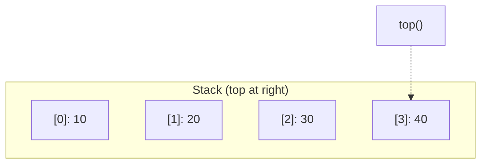

# Stack - C++ Implementation

## Why Stack?

### The Problem It Solves

Imagine you are writing a text editor. Users expect to press Ctrl+Z and have their last action undone. How do you track what the "last action" was? You could use an array and remember the index of the most recent action, but then you need to manage that index carefully. What if you want to undo multiple times? You need to decrement the index each time. What if you make a new change after undoing? Now you need to overwrite everything after the current index.

This is getting complicated. What you really want is a simple rule: **the most recent thing added is the first thing removed**. This is the LIFO (Last-In, First-Out) principle, and a **stack** is the data structure that embodies it perfectly.

### Real-World Analogies

1. **Stack of plates in a cafeteria**: When clean plates come out of the dishwasher, they go on top of the stack. When someone takes a plate, they take from the top. You never reach into the middle of the stack.

2. **Browser back button**: Each page you visit gets pushed onto a history stack. When you click "back", you pop the most recent page off and go to whatever is underneath.

3. **Function call stack**: When your program calls a function, the current location is pushed onto a stack. When the function returns, that location is popped off so the program knows where to continue. This is why it is called a "stack trace" when your program crashes.

### When to Use It

- **Undo/redo functionality**: Push each action, pop to undo
- **Expression parsing**: Matching parentheses, evaluating postfix notation
- **Depth-first search**: Track nodes to visit when exploring graphs or trees
- **Backtracking algorithms**: Solving mazes, puzzles, constraint satisfaction
- **Reversing sequences**: Push all elements, then pop them out in reverse order

**Use a stack when you need to:**
- Process items in reverse order of arrival
- Track "where you were" to return later
- Match opening/closing pairs (parentheses, tags, etc.)

**Unlike an array, a stack:**
- Does not allow random access to elements in the middle
- Has a focused API that prevents accidental misuse
- Communicates intent clearly to other programmers

---

## Core Concept

### The Big Idea

A stack is a container where elements are added and removed from the **same end**, called the **top**. This simple constraint gives us LIFO behavior: the last element pushed is the first element popped.

The key insight is that a stack is really just an array with a restricted interface. By only allowing operations at one end, we get O(1) performance for all primary operations and a clean mental model that is hard to misuse.

### Visual Representation



The stack grows to the right. The rightmost element (40) is the "top" - this is what `top()` returns and what `pop()` removes.

```
Bottom                    Top
  |                        |
  v                        v
+----+----+----+----+
| 10 | 20 | 30 | 40 |     <- push adds here
+----+----+----+----+
                 ^
                 |
             pop removes from here
```

### Key Terminology

- **Push**: Add an element to the top of the stack
- **Pop**: Remove and return the element at the top
- **Top/Peek**: Look at the top element without removing it
- **LIFO**: Last-In, First-Out - the defining property of a stack
- **Underflow**: Attempting to pop or peek on an empty stack (an error condition)

---

## How It Works: Step-by-Step

### Operation 1: Push

**What it does**: Adds an element to the top of the stack.

**Step-by-step walkthrough**:

Starting with an empty stack:
```
Stack: [ ]
Size: 0
```

Push 10:
```
Stack: [ 10 ]
         ^
        top
Size: 1
```

Push 20:
```
Stack: [ 10 | 20 ]
              ^
             top
Size: 2
```

Push 30:
```
Stack: [ 10 | 20 | 30 ]
                   ^
                  top
Size: 3
```

**Why this approach?** We use the end of the underlying array as the "top" because adding to the end of a dynamic array is O(1) amortized. If we used the beginning, we would need to shift all elements on every push - that would be O(n).

### Operation 2: Pop

**What it does**: Removes and returns the top element.

**Step-by-step walkthrough**:

Starting state:
```
Stack: [ 10 | 20 | 30 ]
                   ^
                  top
Size: 3
```

Pop (returns 30):
```
Stack: [ 10 | 20 ]
              ^
             top
Size: 2
```

Pop (returns 20):
```
Stack: [ 10 ]
         ^
        top
Size: 1
```

Pop (returns 10):
```
Stack: [ ]
Size: 0
```

**Why this approach?** Removing from the end of a dynamic array is O(1) - we just decrement the size. The element is still in memory but is logically removed. This implementation also returns the value, which is more convenient than the standard library's `void` return.

### Operation 3: Top (Peek)

**What it does**: Returns a reference to the top element without removing it.

Starting state:
```
Stack: [ 10 | 20 | 30 ]
                   ^
                  top
```

After `top()` - returns reference to 30:
```
Stack: [ 10 | 20 | 30 ]   <- unchanged
                   ^
                  top
```

**Why this approach?** Sometimes you need to see what is on top without removing it - for example, when checking if the top of a stack of operators has higher precedence than an incoming operator in expression parsing.

### Worked Example: Complete Sequence

Let us trace through a sequence simulating undo/redo in a text editor:

```
Initial state: empty stack
Stack: [ ]
Size: 0
```

User types "Hello":
```cpp
stack.push("Hello");
```
```
Stack: [ "Hello" ]
Size: 1
```

User types " World":
```cpp
stack.push(" World");
```
```
Stack: [ "Hello" | " World" ]
Size: 2
```

User types "!":
```cpp
stack.push("!");
```
```
Stack: [ "Hello" | " World" | "!" ]
Size: 3
```

User checks what they just typed:
```cpp
stack.top();  // Returns "!"
```
```
Stack: [ "Hello" | " World" | "!" ]   <- unchanged
Size: 3
```

User presses Undo (Ctrl+Z):
```cpp
std::string undone = stack.pop();  // undone = "!"
```
```
Stack: [ "Hello" | " World" ]
Size: 2
```

User presses Undo again:
```cpp
std::string undone = stack.pop();  // undone = " World"
```
```
Stack: [ "Hello" ]
Size: 1
```

User types " C++":
```cpp
stack.push(" C++");
```
```
Stack: [ "Hello" | " C++" ]
Size: 2
```

Final state shows the document is now "Hello C++".

---

## From Concept to Code

### The Data Structure

Before looking at the code, let us think about what we need:

1. **Storage for elements**: We need somewhere to put the data. We will use a dynamic array.
2. **Size tracking**: We need to know how many elements are in the stack (the dynamic array tracks this for us).
3. **No explicit "top" pointer**: Since the dynamic array knows its size, "top" is always the last element.

The key design decision in this implementation is **composition over inheritance**: the Stack contains a DynamicArray rather than inheriting from it. This prevents users from accessing the underlying array directly and misusing the stack.

### C++ Implementation

```cpp
template <typename T>
class Stack {
public:
    using size_type = std::size_t;

private:
    DynamicArray<T> data_;
};
```

**Line-by-line breakdown**:

- `template <typename T>`: This makes Stack generic. `T` is a placeholder for any type - `int`, `std::string`, or your own custom class. When you write `Stack<int>`, the compiler generates a version of Stack specifically for integers.

- `using size_type = std::size_t`: Creates a type alias. `std::size_t` is an unsigned integer type guaranteed to be large enough to represent the size of any object in memory. Using `size_type` is a convention that follows the STL.

- `DynamicArray<T> data_`: This is where the actual elements live. The underscore suffix (`data_`) is a common C++ convention for member variables.

### Constructor and Rule of Five

```cpp
Stack() = default;

Stack(const Stack& other) = default;
Stack(Stack&& other) noexcept = default;
Stack& operator=(const Stack& other) = default;
Stack& operator=(Stack&& other) noexcept = default;
~Stack() = default;
```

**Understanding the "Rule of Five"**:

When a class manages resources (like dynamically allocated memory), you must define 5 special functions. However, our Stack delegates all resource management to DynamicArray. By saying `= default`, we tell the compiler: "generate the standard version of this function, which will call the corresponding function on all member variables."

- **Default constructor**: Creates an empty stack (DynamicArray's default constructor creates an empty array)
- **Copy constructor** `Stack(const Stack& other)`: Creates a new stack as a copy of another. The `const Stack&` means "a read-only reference to another Stack."
- **Move constructor** `Stack(Stack&& other)`: Transfers ownership from a temporary/expiring stack. The `&&` means "rvalue reference" - a reference to something that is about to be destroyed.
- **Copy assignment** `operator=`: Replaces this stack's contents with a copy of another's
- **Move assignment**: Replaces this stack's contents by taking ownership from another
- **Destructor** `~Stack()`: Cleans up when the stack is destroyed

The `noexcept` on move operations promises that these operations will not throw exceptions. This allows standard library containers to use the more efficient move operations when resizing.

### Implementing Push

**The algorithm in plain English**:
1. Add the value to the end of the underlying dynamic array
2. (The dynamic array handles resizing automatically if needed)

**The code**:

```cpp
void push(const T& value) { data_.push_back(value); }

void push(T&& value) { data_.push_back(std::move(value)); }
```

**Understanding the tricky parts**:

We have two overloads of `push`:

1. `push(const T& value)`: Takes a const reference. This is for when you have an existing value you want to copy onto the stack:
   ```cpp
   std::string name = "Alice";
   stack.push(name);  // name is copied, original unchanged
   ```

2. `push(T&& value)`: Takes an rvalue reference. This is for when you have a temporary value or explicitly want to move:
   ```cpp
   stack.push(std::string("Bob"));  // temporary, no need to copy
   stack.push(std::move(name));     // explicitly transfer ownership
   ```

**What is `std::move`?** It does not actually move anything - it is a cast that says "treat this value as if it is about to be destroyed, so you can cannibalize its resources." The actual moving happens when DynamicArray receives this marked value and transfers its internal data instead of copying.

### Implementing Pop

**The algorithm in plain English**:
1. Check if the stack is empty - if so, throw an exception
2. Get the top element using move semantics (transfer ownership)
3. Remove the top element from the underlying array
4. Return the value we saved

**The code**:

```cpp
T pop() {
    if (data_.empty())
        throw std::out_of_range("Stack::pop: empty stack");
    T value = std::move(data_.back());
    data_.pop_back();
    return value;
}
```

**Understanding the tricky parts**:

- `T value = std::move(data_.back())`: We move the top element into a local variable. For types like `std::string`, this transfers the internal character buffer rather than copying it. The element in the array is left in a valid but unspecified state.

- `data_.pop_back()`: Now we remove that element from the array. Since we already moved its contents out, no expensive destructor work needs to happen.

- `return value`: Return the value we saved. Thanks to Return Value Optimization (RVO), this usually does not involve any copying.

**Why move-then-pop?** If we called `pop_back()` first, the element would be destroyed before we could return it. By moving first, we extract the value, then clean up.

### Implementing Top

**The algorithm in plain English**:
1. Check if the stack is empty - if so, throw an exception
2. Return a reference to the last element

**The code**:

```cpp
T& top() {
    if (data_.empty())
        throw std::out_of_range("Stack::top: empty stack");
    return data_.back();
}

const T& top() const {
    if (data_.empty())
        throw std::out_of_range("Stack::top: empty stack");
    return data_.back();
}
```

**Understanding the tricky parts**:

We have two versions of `top()`:

1. `T& top()`: Returns a non-const reference. This lets you modify the top element:
   ```cpp
   stack.top() = 42;  // Change the top element in place
   ```

2. `const T& top() const`: The `const` at the end means "this method does not modify the stack." This version is called when you have a `const Stack&`:
   ```cpp
   void printTop(const Stack<int>& s) {
       std::cout << s.top();  // Uses const version
   }
   ```

### Implementing Helper Methods

```cpp
size_type size() const { return data_.size(); }

bool empty() const { return data_.empty(); }

void clear() { data_.clear(); }
```

These are simple pass-throughs to the underlying DynamicArray. The `const` on `size()` and `empty()` indicates they do not modify the stack.

---

## Complexity Analysis

### Time Complexity

| Operation | Best | Average | Worst | Why |
|-----------|------|---------|-------|-----|
| push      | O(1) | O(1)*   | O(n)  | Usually just increments size and assigns. Worst case triggers array resize. |
| pop       | O(1) | O(1)    | O(1)  | Decrements size and destructs one element. No shifting needed. |
| top       | O(1) | O(1)    | O(1)  | Direct array access at index `size - 1`. |
| size      | O(1) | O(1)    | O(1)  | Returns stored value; no computation. |
| empty     | O(1) | O(1)    | O(1)  | Compares size to zero. |
| clear     | O(n) | O(n)    | O(n)  | Must destruct each element. |

*Amortized O(1) - see explanation below.

**Understanding the "Why" column**:

**Push's worst case**: When the underlying array is full, we must allocate a new array with double the capacity and copy/move all elements. This is O(n). However...

**Amortized Analysis**:

"Amortized" means "averaged over a sequence of operations." While a single push can be O(n), this expensive operation happens rarely enough that the average cost is O(1).

Here is the intuition: If we start with capacity 1 and push n elements, we resize at sizes 1, 2, 4, 8, ... The total work for all resizes is:
```
1 + 2 + 4 + 8 + ... + n/2 + n = 2n - 1
```

So n pushes cost O(2n) total work, meaning each push costs O(2) = O(1) amortized.

### Space Complexity

- **Overall structure**: O(n) where n is the number of elements stored
- **Per operation**:
  - push: O(1) amortized (occasionally O(n) when resizing)
  - pop: O(1) - the memory is not freed, just logically removed
  - All others: O(1) - no additional memory allocated

---

## Common Mistakes and Pitfalls

### Mistake 1: Forgetting to check for empty stack

```cpp
// Wrong:
T pop() {
    T value = std::move(data_.back());  // Undefined behavior if empty!
    data_.pop_back();
    return value;
}

// Right:
T pop() {
    if (data_.empty())
        throw std::out_of_range("Stack::pop: empty stack");
    T value = std::move(data_.back());
    data_.pop_back();
    return value;
}
```

**Why this matters**: Accessing `back()` on an empty container is undefined behavior. Your program might crash, return garbage, or appear to work but corrupt memory. Always check first, or document that the caller must check.

### Mistake 2: Returning by value from top()

```cpp
// Problematic:
T top() const {
    if (data_.empty())
        throw std::out_of_range("Stack::top: empty stack");
    return data_.back();  // Returns a copy!
}

// Better:
T& top() {
    if (data_.empty())
        throw std::out_of_range("Stack::top: empty stack");
    return data_.back();  // Returns a reference
}
```

**Why this matters**:
1. Returning by value creates a copy, which is wasteful for large objects
2. Returning by value prevents modifying the top element: `stack.top() = newValue` would modify a temporary
3. For the const version, returning `const T&` is still more efficient than copying

### Mistake 3: Not providing move semantics for push

```cpp
// Limited:
void push(const T& value) { data_.push_back(value); }

// Better - also provide:
void push(T&& value) { data_.push_back(std::move(value)); }
```

**Why this matters**: Without the rvalue overload, even temporary objects get copied:
```cpp
stack.push(std::string("hello"));  // Without &&, this creates a temporary,
                                   // then copies it into the stack
```

With the rvalue overload, the temporary's internal buffer is transferred directly into the stack - no copying of characters.

### Mistake 4: Popping then returning (wrong order)

```cpp
// Wrong:
T pop() {
    data_.pop_back();              // Element is destroyed!
    return data_.back();           // Returns the WRONG element (or crashes)
}

// Right:
T pop() {
    if (data_.empty())
        throw std::out_of_range("Stack::pop: empty stack");
    T value = std::move(data_.back());  // Extract first
    data_.pop_back();                   // Then remove
    return value;
}
```

**Why this matters**: The order is critical. If you pop first, the element you wanted is destroyed before you can return it. You end up returning the new top (wrong element) or crashing if the stack is now empty.

---

## Practice Problems

To solidify your understanding, try implementing:

1. **MinStack**: A stack that supports `getMin()` in O(1) time. Hint: use an auxiliary stack to track minimums.

2. **Two stacks in one array**: Implement two stacks using a single array, growing from opposite ends.

3. **Balanced parentheses checker**: Use a stack to verify that all opening brackets have matching closing brackets in the correct order.

4. **Postfix expression evaluator**: Evaluate expressions like "3 4 + 2 *" (which equals 14) using a stack.

5. **Browser history**: Implement back/forward functionality using two stacks.

---

## Summary

### Key Takeaways

- A stack is a LIFO (Last-In, First-Out) container - the most recently added element is the first removed
- All primary operations (push, pop, top) are O(1), making stacks highly efficient
- Using composition (containing a DynamicArray) rather than inheritance keeps the interface clean and prevents misuse
- Move semantics (the `T&&` overload of push and use of `std::move` in pop) make the stack efficient for expensive-to-copy types
- The Rule of Five is satisfied by defaulting all special members, delegating to the underlying DynamicArray

### Quick Reference

```
Stack<T> - LIFO container backed by dynamic array
|-- push(value): O(1) amortized - add element to top
|-- pop():       O(1)          - remove and return top element
|-- top():       O(1)          - return reference to top element
|-- size():      O(1)          - return number of elements
|-- empty():     O(1)          - check if stack is empty
+-- clear():     O(n)          - remove all elements

Best for: Undo/redo, parsing, DFS, backtracking, reversing
Avoid when: Need random access, FIFO order, or searching
```
