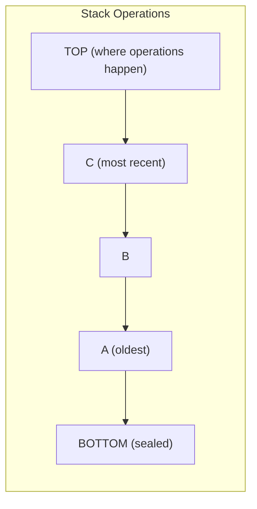

# Stack — Go Implementation

## Why Stack?

### The Problem It Solves

Imagine you're writing a text editor and need to implement an "undo" feature. Every time the user makes a change, you need to remember it. When they press Ctrl+Z, you need to reverse the *most recent* change first, then the one before that, and so on. You can't undo the first change before undoing all the later ones—that would be chaos.

This is a classic problem: **you need to process items in reverse order from how they arrived**. Arrays alone don't give you this behavior—you'd have to manually track which index is "current" and remember to always access from the end.

A **stack** solves this elegantly. It enforces the rule: the last thing you put in is the first thing you take out. This "Last-In-First-Out" (LIFO) behavior is exactly what you need for undo functionality, and countless other problems.

### Real-World Analogies

**Stack of plates in a cafeteria**: When the dishwasher adds clean plates, they go on top. When a customer takes a plate, they take from the top. The first plate washed might sit at the bottom for hours—it's the last one to be used.

**Browser back button**: Each page you visit gets "pushed" onto your history. When you click back, you "pop" off the most recent page and return to the one before it. You can't jump to your first page without going through all the intermediate ones.

**Function call stack**: When function A calls function B, which calls function C, the computer needs to remember where to return. It pushes return addresses onto a stack. When C finishes, it pops C's address and returns to B. When B finishes, it pops and returns to A. The nesting naturally forms a stack.

### When to Use It

- **Use a stack when you need to reverse order** — parsing expressions, backtracking algorithms
- **Use a stack for nested structures** — matching parentheses, HTML tags, recursive algorithms
- **Use a stack for undo/redo** — text editors, drawing programs, any reversible operations
- **Use a stack for depth-first traversal** — exploring mazes, tree traversal without recursion

Unlike an array where you access any index, a stack restricts you to one end. This restriction is a feature, not a limitation—it guarantees LIFO ordering and makes your code's intent clear.

---

## Core Concept

### The Big Idea

A stack is a collection where you can only add and remove elements from one end, called the "top." Think of it as a vertical tube that's closed at the bottom—items can only enter and exit through the top.

The key insight is that this restriction gives you a powerful guarantee: **the order of removal is always the reverse of the order of insertion**. Push A, B, C and you'll pop C, B, A. This property makes stacks perfect for any problem involving reversal or nested structures.

### Visual Representation



The diagram shows a stack containing three elements. Element "A" was pushed first and sits at the bottom. Element "C" was pushed last and sits at the top. When we pop, "C" comes out first—the last in is the first out.

### Key Terminology

- **Push**: Add an element to the top of the stack
- **Pop**: Remove and return the top element
- **Top/Peek**: Look at the top element without removing it
- **LIFO**: Last-In-First-Out—the defining property of a stack
- **Underflow**: Attempting to pop from an empty stack (an error condition)
- **Capacity**: The maximum elements a stack can hold (in Go's slice-based implementation, this grows automatically)

---

## How It Works: Step-by-Step

### Operation 1: Push

**What it does**: Adds a new element to the top of the stack.

**Step-by-step walkthrough**:

Starting state (empty stack):
```
Stack: []
Size: 0
```

Step 1: Push 10
```
Stack: [10]
        ^
       top
Size: 1
```

Step 2: Push 20
```
Stack: [10, 20]
             ^
            top
Size: 2
```

Step 3: Push 30
```
Stack: [10, 20, 30]
                 ^
                top
Size: 3
```

**Why this approach?** We add to the end of the underlying slice because:
1. Go's `append` is O(1) amortized for adding to the end
2. Removing from the end is also O(1) (just reslice)
3. Adding/removing from the front would require shifting all elements—O(n)

### Operation 2: Pop

**What it does**: Removes the top element and returns it.

**Step-by-step walkthrough**:

Starting state:
```
Stack: [10, 20, 30]
                 ^
                top
Size: 3
```

Step 1: Pop (returns 30)
```
- Save value at index 2: 30
- Reslice to exclude last element
- Return 30

Stack: [10, 20]
             ^
            top
Size: 2
```

Step 2: Pop (returns 20)
```
Stack: [10]
        ^
       top
Size: 1
```

Step 3: Pop (returns 10)
```
Stack: []
Size: 0
```

Step 4: Pop on empty stack
```
Returns: (zero value, ErrEmptyStack)
Stack remains: []
```

**Why this approach?** Reslicing (`s.data[:idx]`) is O(1)—it doesn't move any data, just adjusts the slice's length header. The underlying array still contains the old value, but it's inaccessible through the slice. Go's implementation also zeroes out the removed slot to help garbage collection (more on this later).

### Operation 3: Top (Peek)

**What it does**: Returns the top element without removing it.

Starting state:
```
Stack: [10, 20, 30]
```

Top operation:
```
Returns: 30
Stack remains: [10, 20, 30] (unchanged)
```

**Why have both Pop and Top?** Sometimes you need to look before you leap. For example, when evaluating expressions, you might check the top operator's precedence before deciding whether to pop it.

### Worked Example: Complete Sequence

Let's trace through evaluating if parentheses are balanced in the string `"(())"`:

```
Input: "(())"
Use a stack to track unmatched opening parentheses.

Character 1: '('
  Action: Push '('
  Stack: ['(']

Character 2: '('
  Action: Push '('
  Stack: ['(', '(']

Character 3: ')'
  Action: Closing paren found. Pop to match.
  Popped: '('
  Stack: ['(']

Character 4: ')'
  Action: Closing paren found. Pop to match.
  Popped: '('
  Stack: []

End of string:
  Stack is empty -> All parentheses matched!
  Result: Balanced
```

Now let's trace an unbalanced string `"(()"`:

```
Input: "(()"

Character 1: '('
  Stack: ['(']

Character 2: '('
  Stack: ['(', '(']

Character 3: ')'
  Popped: '('
  Stack: ['(']

End of string:
  Stack is NOT empty -> Unmatched '(' remains
  Result: NOT Balanced
```

---

## From Concept to Code

### The Data Structure

Before looking at code, let's think about what we need:

1. **Storage for elements**: We need somewhere to put our data. Go's slice is perfect—it grows automatically and gives O(1) access to any index.

2. **Track the top**: With a slice, the "top" is simply the last element. No separate pointer needed—`len(s.data) - 1` always gives us the top index.

3. **Generic type**: We want our stack to work with integers, strings, custom structs—anything. Go's type parameters (`[T any]`) give us this.

That's it. A stack is beautifully simple—just a slice with restricted operations.

### Go Implementation

```go
package stack

import "errors"

var ErrEmptyStack = errors.New("Stack: empty stack")

type Stack[T any] struct {
    data []T
}

func New[T any]() *Stack[T] {
    return &Stack[T]{}
}
```

**Line-by-line breakdown**:

- `package stack`: Go organizes code into packages. Each data structure gets its own package for clean imports.

- `import "errors"`: We need this to create our error value.

- `var ErrEmptyStack = errors.New("Stack: empty stack")`: This is a **sentinel error**—a predefined error value that callers can check against. The uppercase `E` makes it exported (public), so users can write `if err == stack.ErrEmptyStack`.

- `type Stack[T any] struct`: This declares a generic struct. The `[T any]` part means "this struct has a type parameter T that can be any type." When you create a `Stack[int]`, T becomes `int`. When you create a `Stack[string]`, T becomes `string`.

- `data []T`: The slice that holds our elements. It's lowercase (unexported), so external code can't access it directly—they must use our methods.

- `func New[T any]() *Stack[T]`: A constructor function. It returns a pointer (`*Stack[T]`) rather than a value because:
  1. Methods need to modify the stack (push, pop, clear)
  2. Passing a pointer avoids copying the struct on every method call
  3. The slice inside would be copied by value anyway, but pointer receivers are idiomatic in Go

- `return &Stack[T]{}`: Creates a Stack with `data` set to `nil` (the zero value for a slice). Importantly, `nil` slices work correctly with `append` and `len`—they're just empty.

### Implementing Push

**The algorithm in plain English**:
1. Take the new value
2. Append it to the end of our slice
3. Done! (Go's `append` handles all the memory management)

**The code**:
```go
func (s *Stack[T]) Push(value T) {
    s.data = append(s.data, value)
}
```

**Understanding the tricky parts**:

- `(s *Stack[T])`: This is a **method receiver**. It says "this function is a method on `*Stack[T]`." The `*` means pointer receiver—we get a pointer to the stack, not a copy.

- `s.data = append(s.data, value)`: Go's `append` is special. If the slice has room (capacity > length), it adds the element in place. If not, it allocates a new, larger array, copies everything over, and returns a slice pointing to the new array. **That's why we must assign the result back to `s.data`**—`append` might return a completely different slice.

### Implementing Pop

**The algorithm in plain English**:
1. If the stack is empty, return an error
2. Find the index of the top element (last position)
3. Save the top value
4. Zero out that slot (for garbage collection)
5. Reslice to exclude the last element
6. Return the saved value and nil error

**The code**:
```go
func (s *Stack[T]) Pop() (T, error) {
    var zero T
    if len(s.data) == 0 {
        return zero, ErrEmptyStack
    }
    idx := len(s.data) - 1
    value := s.data[idx]
    s.data[idx] = zero
    s.data = s.data[:idx]
    return value, nil
}
```

**Understanding the tricky parts**:

- `(T, error)`: Go functions can return multiple values. The convention for fallible operations is to return `(result, error)` where error is `nil` on success.

- `var zero T`: This creates the **zero value** for type T. For `int`, that's 0. For `string`, that's "". For pointers, that's `nil`. Go doesn't have generics constraints that would let us write `return 0, err`—we need a way to get "the default" for any type.

- `s.data[idx] = zero`: This line is subtle but important. After reslicing, `s.data[:idx]` no longer includes this slot *from the slice's perspective*, but the underlying array still holds the old value. If T is a pointer type, that reference would prevent garbage collection of the pointed-to object. Setting it to zero clears the reference.

- `s.data = s.data[:idx]`: Reslicing creates a new slice header pointing to the same underlying array but with a shorter length. This is O(1)—no data is copied or moved.

### Implementing Top

**The code**:
```go
func (s *Stack[T]) Top() (T, error) {
    var zero T
    if len(s.data) == 0 {
        return zero, ErrEmptyStack
    }
    return s.data[len(s.data)-1], nil
}
```

Same pattern as Pop, but we don't modify the slice. We return the value directly (not a pointer to it) because:
1. Returning `&s.data[idx]` would expose internal memory
2. If the slice grows, that pointer could become invalid
3. Value semantics are safer for generic types

### Implementing Clear

**The code**:
```go
func (s *Stack[T]) Clear() {
    var zero T
    for i := range s.data {
        s.data[i] = zero
    }
    s.data = s.data[:0]
}
```

**Why the loop?** The same reason as in Pop—we zero out all elements so the garbage collector can reclaim any objects they reference.

**Why `s.data[:0]` instead of `s.data = nil`?** Both give you an empty stack, but `:0` preserves the underlying array's capacity. If you're going to push new elements soon, this avoids a reallocation. It's a performance optimization for reuse patterns.

### Implementing Clone

**The code**:
```go
func (s *Stack[T]) Clone() *Stack[T] {
    clone := &Stack[T]{
        data: make([]T, len(s.data)),
    }
    copy(clone.data, s.data)
    return clone
}
```

**Understanding the tricky parts**:

- `make([]T, len(s.data))`: Creates a new slice with the exact length (and capacity) needed. This is more efficient than repeatedly appending.

- `copy(clone.data, s.data)`: Go's built-in `copy` function copies elements between slices. It returns the number of elements copied (which we ignore here).

- **Shallow copy warning**: This copies the slice elements directly. If T is `*SomeStruct`, both stacks will contain pointers to the same underlying structs. Modifying a struct through one stack affects the other. For true deep copying, you'd need to implement cloning logic specific to your type.

---

## Complexity Analysis

### Time Complexity

| Operation | Best | Average | Worst | Why |
|-----------|------|---------|-------|-----|
| Push      | O(1) | O(1)*   | O(n)  | Amortized O(1); worst case when slice must grow and copy all elements |
| Pop       | O(1) | O(1)    | O(1)  | Reslicing is constant time; no data movement |
| Top       | O(1) | O(1)    | O(1)  | Direct index access to last element |
| Size      | O(1) | O(1)    | O(1)  | Slice length is stored in header, not computed |
| IsEmpty   | O(1) | O(1)    | O(1)  | Just compares length to zero |
| Clear     | O(n) | O(n)    | O(n)  | Must zero each element for GC safety |
| Clone     | O(n) | O(n)    | O(n)  | Must copy all elements |

*Amortized means "averaged over many operations." Most pushes are O(1), but occasionally we need O(n) to grow. Because Go doubles capacity each time, the expensive operations are rare enough that the average remains O(1).

### Space Complexity

- **Overall structure**: O(n) where n is the number of elements
- **Per operation**: O(1) for all operations except Clone which is O(n)

### Amortized Analysis for Push

Why is Push O(1) amortized even though growing the slice is O(n)?

Go's slice implementation roughly doubles capacity when full. Let's trace what happens with 8 pushes:

```
Push 1: capacity 1 -> 1 copy
Push 2: capacity 2 -> 1 copy (grew from 1)
Push 3: capacity 4 -> 2 copies (grew from 2)
Push 4: no growth needed
Push 5: capacity 8 -> 4 copies (grew from 4)
Push 6, 7, 8: no growth needed

Total copies for 8 pushes: 1 + 1 + 2 + 4 = 8 copies
Average: 8 copies / 8 pushes = 1 copy per push = O(1)
```

As n grows, the ratio of copies to pushes approaches 2—still O(1) per operation.

---

## Common Mistakes & Pitfalls

### Mistake 1: Ignoring the Error Return

```go
// Wrong: ignoring error
value, _ := stack.Pop()
fmt.Println(value)  // If stack was empty, value is zero value!

// Right: always handle errors
value, err := stack.Pop()
if err != nil {
    // Handle empty stack appropriately
    fmt.Println("Stack is empty!")
    return
}
fmt.Println(value)
```

**Why this matters**: Go's multi-return forces you to acknowledge errors exist, but doesn't force you to handle them. The `_` silently discards the error. On an empty stack, you'd get a zero value (0 for int, "" for string) with no indication something went wrong.

### Mistake 2: Comparing Error Values with == vs errors.Is

```go
// Works, but fragile:
if err == stack.ErrEmptyStack {
    // handle empty
}

// Better: handles wrapped errors
if errors.Is(err, stack.ErrEmptyStack) {
    // handle empty
}
```

**Why this matters**: If your error passes through middleware that wraps it (e.g., `fmt.Errorf("context: %w", err)`), direct comparison fails. `errors.Is` unwraps and checks the chain. For simple cases they're equivalent, but `errors.Is` is future-proof.

### Mistake 3: Forgetting append Returns a New Slice

```go
// Wrong: forgetting to assign result
func (s *Stack[T]) Push(value T) {
    append(s.data, value)  // Result discarded! Stack unchanged.
}

// Right: always assign append result
func (s *Stack[T]) Push(value T) {
    s.data = append(s.data, value)
}
```

**Why this matters**: When `append` needs to grow the slice, it allocates a new array and returns a slice pointing to it. If you don't capture the return value, the new slice is lost and your original slice is unchanged.

### Mistake 4: Shallow Copy Surprises with Pointer Types

```go
type Item struct {
    Name string
}

// Create stack of pointers
stack := stack.New[*Item]()
item := &Item{Name: "original"}
stack.Push(item)

// Clone the stack
cloned := stack.Clone()

// Modify through original
item.Name = "modified"

// Surprise: cloned stack also affected!
val, _ := cloned.Pop()
fmt.Println(val.Name)  // Prints "modified", not "original"
```

**Why this matters**: Clone copies the pointer values, not what they point to. Both stacks now reference the same `Item` in memory. For true independence with pointer types, you need deep cloning logic.

### Mistake 5: Using Value Receiver Instead of Pointer Receiver

```go
// Wrong: value receiver gets a copy
func (s Stack[T]) Push(value T) {
    s.data = append(s.data, value)  // Modifies the copy, not original!
}

// Right: pointer receiver modifies original
func (s *Stack[T]) Push(value T) {
    s.data = append(s.data, value)
}
```

**Why this matters**: With a value receiver, Go copies the entire Stack struct when calling the method. Modifications affect the copy, not your original stack. The original remains unchanged.

---

## Practice Problems

To solidify your understanding, try implementing:

1. **MinStack**: A stack that supports Push, Pop, and GetMin, all in O(1) time. Hint: use an auxiliary stack to track minimums.

2. **Evaluate Reverse Polish Notation**: Given tokens like `["2", "1", "+", "3", "*"]`, evaluate the expression (answer: 9). Use a stack to hold intermediate results.

3. **Valid Parentheses**: Given a string containing `()[]{}`, determine if the brackets are balanced and properly nested. Extend to handle multiple bracket types.

4. **Daily Temperatures**: Given an array of temperatures, for each day find how many days until a warmer day. Use a stack to track indices of unresolved days.

---

## Summary

### Key Takeaways

- A stack is a LIFO container—last in, first out
- Go's implementation uses a slice with operations restricted to one end
- All core operations (Push, Pop, Top) are O(1), with Push being O(1) amortized
- Go's error handling pattern returns `(value, error)` tuples; always check the error
- The `[T any]` syntax enables generic stacks that work with any type
- Pointer receivers (`*Stack[T]`) are necessary for methods that modify state
- Clone creates a shallow copy; pointer types require extra care for true independence

### Quick Reference

```
Stack[T] — LIFO container using slice-backed storage
|-- Push(value T):     O(1) amortized — Add to top
|-- Pop() (T, error):  O(1)           — Remove and return top
|-- Top() (T, error):  O(1)           — View top without removing
|-- Size() int:        O(1)           — Number of elements
|-- IsEmpty() bool:    O(1)           — Check if empty
|-- Clear():           O(n)           — Remove all elements
+-- Clone() *Stack[T]: O(n)           — Create independent copy

Best for: Undo/redo, expression evaluation, DFS traversal, backtracking
Avoid when: You need random access, or FIFO ordering (use Queue instead)
```

### Usage Example

```go
package main

import (
    "fmt"
    "your-module/src/stack"
)

func main() {
    s := stack.New[int]()

    s.Push(10)
    s.Push(20)
    s.Push(30)

    for !s.IsEmpty() {
        val, err := s.Pop()
        if err != nil {
            break
        }
        fmt.Println(val)  // Prints: 30, 20, 10
    }
}
```
