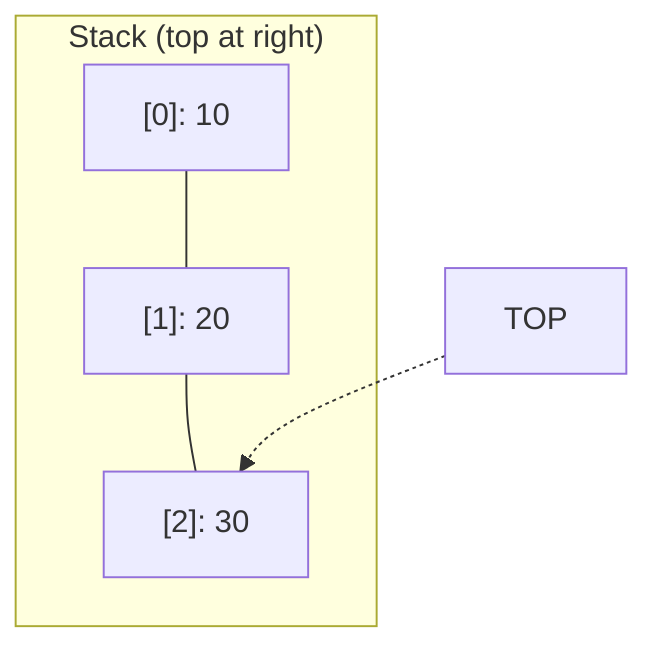

# Stack - Python Implementation

## Why Stack?

### The Problem It Solves

Imagine you're writing a text editor and need to implement an "undo" feature. Every time the user makes a change, you save it. When they hit Ctrl+Z, you need to reverse the *most recent* change first, then the one before that, and so on.

This is the **Last-In, First-Out (LIFO)** pattern: the last thing you added is the first thing you need to remove. Regular lists *can* do this, but they expose too much functionality. Someone could accidentally remove from the middle or insert at the wrong position, breaking your undo logic.

A **stack** enforces the discipline: you can only add to the top, remove from the top, or peek at the top. This constraint prevents bugs and makes your intent crystal clear to anyone reading your code.

### Real-World Analogies

1. **Stack of plates in a cafeteria**: You can only take the plate on top. When the dishwasher adds clean plates, they go on top too. You'd never pull a plate from the middle of the stack.

2. **Browser back button**: Each page you visit gets "pushed" onto a history stack. Hitting back "pops" the most recent page to return you to the previous one.

3. **Undo in any application**: Every action pushes onto the undo stack. Ctrl+Z pops the most recent action and reverses it.

### When to Use It

- **Use a stack when** you need to process things in reverse order of arrival
- **Use a stack when** you're tracking state that can be "entered" and "exited" (like matching parentheses or HTML tags)
- **Use a stack when** you need to backtrack (maze solving, parsing expressions, depth-first search)
- **Unlike a queue**, which processes things in arrival order (first-in, first-out), a stack always handles the newest item first

---

## Core Concept

### The Big Idea

A stack is a container where you can only interact with one end, called the **top**. You add items to the top (push), remove items from the top (pop), and look at the top item without removing it (peek/top). Everything else is hidden.

This restriction is the stack's superpower. By limiting what operations are allowed, you eliminate entire categories of bugs and make your code's behavior predictable.

### Visual Representation



The stack grows to the right. The `TOP` pointer always refers to the most recently added element (index 2 in this case). You can only access, add, or remove at this position.

### Key Terminology

- **Push**: Add an element to the top of the stack
- **Pop**: Remove and return the top element
- **Top/Peek**: Look at the top element without removing it
- **LIFO**: Last-In, First-Out - the defining property of a stack
- **Underflow**: Attempting to pop or peek when the stack is empty (an error condition)

---

## How It Works: Step-by-Step

### Operation 1: Push

**What it does**: Adds a new element to the top of the stack.

**Step-by-step walkthrough**:

Starting state (empty stack):
```
Stack: []
Size: 0
```

Step 1: Push 10
```
Stack: [10]
        ^
       TOP
Size: 1
```

Step 2: Push 20
```
Stack: [10, 20]
             ^
            TOP
Size: 2
```

Step 3: Push 30
```
Stack: [10, 20, 30]
                 ^
                TOP
Size: 3
```

**Why this approach?** We add to the end of the underlying list because Python lists support O(1) amortized append. Adding to the beginning would require shifting all elements, making it O(n).

### Operation 2: Pop

**What it does**: Removes and returns the element at the top of the stack.

**Step-by-step walkthrough**:

Starting state:
```
Stack: [10, 20, 30]
                 ^
                TOP
Size: 3
```

Step 1: Pop (returns 30)
```
Stack: [10, 20]
             ^
            TOP
Size: 2
Returned: 30
```

Step 2: Pop (returns 20)
```
Stack: [10]
        ^
       TOP
Size: 1
Returned: 20
```

Step 3: Pop (returns 10)
```
Stack: []
Size: 0
Returned: 10
```

Step 4: Pop on empty stack
```
Raises IndexError: "pop from empty stack"
```

**Why this approach?** We always remove from the end of the list. Python's `list.pop()` without an argument removes and returns the last element in O(1) time.

### Operation 3: Top (Peek)

**What it does**: Returns the top element without removing it.

Starting state:
```
Stack: [10, 20, 30]
                 ^
                TOP
```

After `top()`:
```
Stack: [10, 20, 30]  (unchanged!)
                 ^
                TOP
Returns: 30
```

**Why this approach?** Sometimes you need to see what's on top without consuming it. For example, when parsing expressions, you might need to check the operator on top of the stack before deciding whether to push or pop.

### Worked Example: Complete Sequence

Let's trace through a realistic sequence - evaluating whether parentheses are balanced:

```
Input string: "((a+b)*(c-d))"
We'll push '(' and pop when we see ')'
```

```
Character: '('
Action: push('(')
Stack: ['(']
```

```
Character: '('
Action: push('(')
Stack: ['(', '(']
```

```
Characters: 'a', '+', 'b'
Action: ignore (not parentheses)
Stack: ['(', '(']
```

```
Character: ')'
Action: pop() -> '(' (matches!)
Stack: ['(']
```

```
Character: '*'
Action: ignore
Stack: ['(']
```

```
Character: '('
Action: push('(')
Stack: ['(', '(']
```

```
Characters: 'c', '-', 'd'
Action: ignore
Stack: ['(', '(']
```

```
Character: ')'
Action: pop() -> '(' (matches!)
Stack: ['(']
```

```
Character: ')'
Action: pop() -> '(' (matches!)
Stack: []
```

```
End of string, stack is empty -> Balanced!
```

---

## From Concept to Code

### The Data Structure

Before looking at code, let's think about what we need:

1. **Storage for elements**: Something to hold our data. In Python, a list works perfectly.
2. **No explicit size tracking**: Python lists already know their length via `len()`.
3. **No explicit top pointer**: The list's last index (-1) is always our top.

That's it! Python's list is so well-suited to stack operations that our implementation is essentially a thin wrapper providing stack semantics.

### Python Implementation

```python
class Stack:
    def __init__(self):
        self._data = []
```

**Line-by-line breakdown**:
- `class Stack:` - We define a new class. No inheritance needed.
- `def __init__(self):` - The constructor, called when you create a `Stack()`.
- `self._data = []` - Our internal storage. The underscore prefix (`_data`) is Python's convention for "this is private, don't access directly." It's not enforced, but signals intent.

### Implementing Push

**The algorithm in plain English**:
1. Take the value we're given
2. Add it to the end of our internal list

**The code**:
```python
def push(self, value):
    self._data.append(value)
```

**Understanding the details**:
- `self._data.append(value)` - Python's list `append()` adds to the end in O(1) amortized time
- No type checking - Python is duck-typed, so any value can be pushed
- No return value - push is a mutating operation that doesn't return anything

### Implementing Pop

**The algorithm in plain English**:
1. Check if the stack is empty - if so, raise an error
2. Remove and return the last element

**The code**:
```python
def pop(self):
    if not self._data:
        raise IndexError("pop from empty stack")
    return self._data.pop()
```

**Understanding the details**:
- `if not self._data:` - An empty list is "falsy" in Python, so this checks for empty
- `raise IndexError(...)` - We use `IndexError` because Python convention uses this for sequence access errors. The message clearly states the problem.
- `self._data.pop()` - Without an argument, `list.pop()` removes and returns the last element in O(1) time

### Implementing Top

**The algorithm in plain English**:
1. Check if the stack is empty - if so, raise an error
2. Return the last element without removing it

**The code**:
```python
def top(self):
    if not self._data:
        raise IndexError("top from empty stack")
    return self._data[-1]
```

**Understanding the details**:
- `self._data[-1]` - Negative indexing in Python! Index -1 means "last element". This is more elegant than `self._data[len(self._data) - 1]`.

### Implementing Helper Methods

```python
def size(self):
    return len(self._data)

def is_empty(self):
    return len(self._data) == 0

def clear(self):
    self._data.clear()

def copy(self):
    clone = Stack()
    clone._data = self._data.copy()
    return clone
```

**Understanding the details**:
- `size()` and `is_empty()` provide explicit methods for clarity
- `clear()` delegates to `list.clear()` which empties the list in O(1) time
- `copy()` creates a **shallow copy** - the new stack has its own list, but if your elements are mutable objects, both stacks share references to those same objects

### Implementing Dunder Methods

Python has "magic methods" (also called dunder methods for their double underscores) that let your class work with built-in syntax:

```python
def __len__(self):
    return len(self._data)

def __bool__(self):
    return len(self._data) > 0
```

**What these enable**:

```python
stack = Stack()
stack.push(1)
stack.push(2)

# __len__ enables len()
print(len(stack))  # Output: 2

# __bool__ enables truthiness testing
if stack:
    print("Stack has items!")

# Without __bool__, Python falls back to __len__
# (non-zero length = truthy), but explicit is better
```

**Why implement `__bool__` explicitly?**

Python's default behavior: if `__bool__` isn't defined, it falls back to `__len__` (non-zero = True). However:
1. Explicit is better than implicit (Python Zen)
2. `__bool__` could be more efficient than `__len__` in some implementations
3. It documents our intention clearly

---

## Complexity Analysis

### Time Complexity

| Operation | Best | Average | Worst | Why |
|-----------|------|---------|-------|-----|
| push      | O(1) | O(1)*   | O(n)  | List append is O(1) amortized; occasional resize copies all elements |
| pop       | O(1) | O(1)    | O(1)  | Remove from end requires no shifting |
| top       | O(1) | O(1)    | O(1)  | Direct access via index -1 |
| size      | O(1) | O(1)    | O(1)  | Python lists cache their length |
| is_empty  | O(1) | O(1)    | O(1)  | Just checks if length equals 0 |
| clear     | O(1) | O(1)    | O(1)  | Resets internal pointers; GC handles deallocation |
| copy      | O(n) | O(n)    | O(n)  | Must copy every element reference |

*The asterisk on push indicates "amortized" complexity.

**Understanding the "Why" column**:
- Push is O(n) worst case because Python lists use dynamic arrays. When the array fills up, Python allocates a larger array and copies everything over. This happens rarely (the array typically doubles in size), so averaged over many operations, it's still O(1).
- Pop is always O(1) because removing from the end never requires shifting elements.

### Space Complexity

- **Overall structure**: O(n) where n is the number of elements - we store exactly what you push
- **Per operation**: O(1) for all operations except `copy()` which is O(n)

### Amortized Analysis

**What "amortized" means**: Some individual operations are expensive, but when you average the cost over a sequence of operations, the average cost per operation is low.

**Example with push**:
- Imagine a list that doubles when full
- If we push 8 elements and the initial capacity is 1:
  - Push 1: O(1)
  - Push 2: O(2) - copy 1 element to new array of size 2
  - Push 3: O(3) - copy 2 elements to new array of size 4
  - Push 4: O(1)
  - Push 5: O(5) - copy 4 elements to new array of size 8
  - Push 6, 7, 8: O(1) each
- Total work: 1 + 2 + 3 + 1 + 5 + 1 + 1 + 1 = 15
- Average per push: 15/8 < 2 = O(1)

The expensive resizing operations become increasingly rare as the list grows, keeping the average constant.

---

## Common Mistakes & Pitfalls

### Mistake 1: Not Checking for Empty Stack

```python
# Wrong:
def peek_wrong(self):
    return self._data[-1]  # Crashes with IndexError if empty!

# Right:
def top(self):
    if not self._data:
        raise IndexError("top from empty stack")
    return self._data[-1]
```

**Why this matters**: Accessing `[-1]` on an empty list raises a confusing `IndexError: list index out of range`. Our explicit check provides a clearer message and documents that this is expected behavior, not a bug.

### Mistake 2: Using Pop from the Wrong End

```python
# Wrong - O(n) because it shifts all elements:
def push_wrong(self, value):
    self._data.insert(0, value)  # Inserts at beginning

def pop_wrong(self):
    return self._data.pop(0)  # Removes from beginning

# Right - O(1):
def push(self, value):
    self._data.append(value)  # Add to end

def pop(self):
    return self._data.pop()  # Remove from end
```

**Why this matters**: `list.pop(0)` and `list.insert(0, x)` are O(n) operations because Python must shift all elements. Always use the end of the list for stack operations.

### Mistake 3: Confusing Shallow and Deep Copy

```python
# Creates a shallow copy:
stack1 = Stack()
stack1.push([1, 2, 3])  # Push a mutable list
stack2 = stack1.copy()

# Modifying the contained list affects BOTH stacks!
stack1.top().append(4)
print(stack2.top())  # [1, 2, 3, 4] - not [1, 2, 3]!

# For true independence with mutable contents:
import copy
stack2._data = copy.deepcopy(stack1._data)
```

**Why this matters**: The `copy()` method creates a new Stack with a new list, but the *elements* in that list are still shared references. If those elements are mutable (like lists or dictionaries), changes through one stack are visible through the other.

### Mistake 4: Forgetting That Stack Access is Restricted

```python
# Wrong - breaking stack semantics:
def get_item(self, index):
    return self._data[index]  # Don't do this!

# This defeats the purpose of using a stack.
# If you need random access, use a list directly.
```

**Why this matters**: The whole point of a stack is restricted access. If you find yourself needing to access elements by index, you probably need a different data structure.

---

## Practice Problems

To solidify your understanding, try implementing:

1. **Reverse a string using a stack**: Push each character, then pop them all. What do you get?

2. **Balanced parentheses checker**: Given a string with `()`, `[]`, and `{}`, determine if all brackets are properly matched and nested.

3. **Evaluate postfix notation**: Given an expression like `"3 4 + 2 *"`, use a stack to evaluate it. (Push numbers; when you see an operator, pop two numbers, apply the operator, push the result.)

4. **Min Stack**: Implement a stack that supports `push`, `pop`, `top`, and `get_min` all in O(1) time. Hint: use two stacks.

---

## Summary

### Key Takeaways

- A **stack** is a LIFO (Last-In, First-Out) container with restricted access
- The three core operations are **push** (add to top), **pop** (remove from top), and **top** (peek at top)
- Python's implementation uses a **list as the underlying storage**, with operations at the end for O(1) performance
- **Dunder methods** (`__len__`, `__bool__`) make the stack work naturally with Python's built-in syntax
- **Error handling** uses `IndexError` to follow Python conventions for sequence access errors
- The `copy()` method creates a **shallow copy** - be careful with mutable elements

### Quick Reference

```
Stack - A LIFO container where you can only interact with the top element
|-- push(value)  : O(1)* - Add element to top
|-- pop()        : O(1)  - Remove and return top element
|-- top()        : O(1)  - Return top element without removing
|-- size()       : O(1)  - Return number of elements
|-- is_empty()   : O(1)  - Return True if empty
|-- clear()      : O(1)  - Remove all elements
|-- copy()       : O(n)  - Create shallow copy
|-- len(stack)   : O(1)  - Via __len__
|-- if stack:    : O(1)  - Via __bool__

*Amortized due to occasional list resizing

Best for: Undo functionality, expression parsing, backtracking algorithms, DFS
Avoid when: You need random access, FIFO ordering, or to search for elements
```
