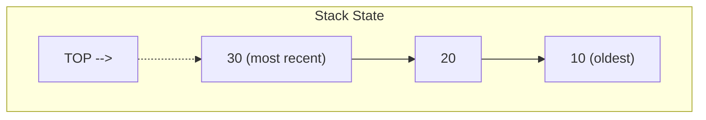

# Stack - Rust Implementation

## Why Stack?

### The Problem It Solves

Imagine you're writing a text editor and need to implement an "undo" feature. Every time the user types something, you need to remember it. When they press Ctrl+Z, you need to reverse the *most recent* action first, then the one before that, and so on.

An array could store all these actions, but how do you efficiently know which one is "most recent"? You'd need to track an index, increment it on every action, decrement on undo, and be careful not to go out of bounds. That's a lot of bookkeeping for something conceptually simple.

A **stack** solves this elegantly. It's a container where:
- You add items to the "top"
- You remove items from the "top"
- The last item added is always the first one removed

This "Last-In, First-Out" (LIFO) behavior matches exactly how undo/redo works, how function calls return, and countless other patterns in computing.

### Real-World Analogies

**Stack of plates in a cafeteria**: When you grab a plate, you take the one on top. When the dishwasher adds clean plates, they go on top. You never reach into the middle of the stack.

**A pile of books on your desk**: You put a new book on top of the pile. When you need a book, you naturally grab from the top. To get to the book at the bottom, you'd have to remove all the ones above it.

**Browser back button**: Each page you visit is "pushed" onto a history stack. Clicking back "pops" the most recent page. You can't jump directly to a page you visited 5 clicks ago without going through the ones in between.

### When to Use It

- **Undo/redo functionality** - Each action is pushed; undo pops the most recent
- **Expression evaluation** - Parsing parentheses, operators in calculators
- **Function call management** - Your program's call stack works exactly this way
- **Backtracking algorithms** - Maze solving, game state exploration (DFS)
- **Syntax validation** - Matching opening/closing brackets, tags

**Use a stack when you need**:
- O(1) access to only the most recently added element
- LIFO ordering is natural for your problem
- You don't need to search or access elements in the middle

**Unlike an array**, a stack enforces discipline: you can only interact with the top. This constraint actually helps prevent bugs by making invalid operations impossible.

---

## Core Concept

### The Big Idea

A stack is defined by a single rule: **the last element added is the first element removed**. This is called LIFO (Last-In, First-Out) ordering.

You can think of a stack as a restricted list that only allows three operations:
1. **Push**: Add an element to the top
2. **Pop**: Remove and return the top element
3. **Top/Peek**: Look at the top element without removing it

That's it. No indexing. No searching. No inserting in the middle. This simplicity is a feature, not a limitation.

### Visual Representation



The stack above contains three elements. The number 30 was pushed last, so it's on top. If we call `pop()`, we get 30 back. The next `pop()` would return 20, then 10.

Elements are stacked vertically in our mental model: newest on top, oldest at the bottom. We only ever interact with the top.

### Key Terminology

- **Push**: Add an element to the top of the stack
- **Pop**: Remove and return the element from the top
- **Top (or Peek)**: View the top element without removing it
- **LIFO**: Last-In, First-Out - the defining property of a stack
- **Underflow**: Attempting to pop from an empty stack (an error condition)
- **Capacity**: How many elements the underlying storage can hold before resizing
- **Size**: How many elements are currently in the stack

---

## How It Works: Step-by-Step

### Operation 1: Push

**What it does**: Adds a new element to the top of the stack.

**Step-by-step walkthrough**:

Starting state (empty stack):
```
Stack: [ ]
Size: 0
```

Step 1: `push(10)` - Add 10 to the top
```
Stack: [ 10 ]
        ^
        top
Size: 1
```

Step 2: `push(20)` - Add 20 to the top
```
Stack: [ 10, 20 ]
             ^
             top
Size: 2
```

Step 3: `push(30)` - Add 30 to the top
```
Stack: [ 10, 20, 30 ]
                 ^
                 top
Size: 3
```

**Why this approach?** We always add to the end of the underlying array/vector. This is O(1) because we don't need to shift any elements. We're just appending.

### Operation 2: Pop

**What it does**: Removes and returns the element from the top of the stack.

**Step-by-step walkthrough**:

Starting state:
```
Stack: [ 10, 20, 30 ]
                 ^
                 top
Size: 3
```

Step 1: `pop()` - Remove and return 30
```
Stack: [ 10, 20 ]
             ^
             top
Size: 2
Returned: Some(30)
```

Step 2: `pop()` - Remove and return 20
```
Stack: [ 10 ]
        ^
        top
Size: 1
Returned: Some(20)
```

Step 3: `pop()` - Remove and return 10
```
Stack: [ ]
Size: 0
Returned: Some(10)
```

Step 4: `pop()` on empty stack
```
Stack: [ ]
Size: 0
Returned: None  <-- Safe! No crash.
```

**Why this approach?** Removing from the end of a vector is O(1) - no shifting required. In Rust, we return `Option<T>` instead of crashing on empty stacks, making the operation safe.

### Operation 3: Top (Peek)

**What it does**: Returns a reference to the top element without removing it.

Starting state:
```
Stack: [ 10, 20, 30 ]
                 ^
                 top
```

Call `top()`:
```
Stack: [ 10, 20, 30 ]    <-- unchanged!
                 ^
                 top
Returned: Some(&30)      <-- reference, not ownership
```

**Why a reference?** Returning `&T` instead of `T` means:
1. The element stays in the stack
2. No cloning/copying is needed
3. The caller can look at the value but not take ownership

### Worked Example: Complete Sequence

Let's trace through a realistic sequence of operations:

```
Initial state:
Stack: [ ]
Size: 0
```

```
Operation 1: push(5)
Stack: [ 5 ]
Size: 1
```

```
Operation 2: push(10)
Stack: [ 5, 10 ]
Size: 2
```

```
Operation 3: push(15)
Stack: [ 5, 10, 15 ]
Size: 3
```

```
Operation 4: top() -> Some(&15)
Stack: [ 5, 10, 15 ]    <-- unchanged
Size: 3
We can see 15 without removing it
```

```
Operation 5: pop() -> Some(15)
Stack: [ 5, 10 ]
Size: 2
15 is removed and returned
```

```
Operation 6: push(20)
Stack: [ 5, 10, 20 ]
Size: 3
```

```
Operation 7: pop() -> Some(20)
Stack: [ 5, 10 ]
Size: 2
```

```
Operation 8: pop() -> Some(10)
Stack: [ 5 ]
Size: 1
```

```
Operation 9: pop() -> Some(5)
Stack: [ ]
Size: 0
```

```
Operation 10: pop() -> None
Stack: [ ]
Size: 0
Empty stack returns None, not a crash!
```

---

## From Concept to Code

### The Data Structure

Before looking at code, let's think about what we need:

**What data do we store?**
- The elements themselves, in LIFO order

**What's the simplest way to store them?**
- An array or dynamic array (vector) works perfectly
- Push = append to end
- Pop = remove from end
- Both are O(1) operations

**What metadata do we need?**
- Just the collection of elements
- The vector already tracks its own size

In Rust, `Vec<T>` gives us exactly what we need: a dynamic array with O(1) amortized push and O(1) pop from the end.

### Rust Implementation

```rust
pub struct Stack<T> {
    data: Vec<T>,
}
```

**Line-by-line breakdown**:

- `pub struct Stack<T>` - We're defining a public struct named `Stack`. The `<T>` makes it generic: `T` is a placeholder for any type. You can create a `Stack<i32>`, `Stack<String>`, or `Stack<YourCustomType>`.

- `data: Vec<T>` - The only field. It's private (no `pub`), so users can't bypass our stack operations and mess with the internal vector directly. `Vec<T>` is Rust's dynamically-sized array - it grows as needed and handles memory automatically.

**Why `Vec<T>` instead of a linked list?**
- `Vec<T>` has better cache locality (elements are contiguous in memory)
- Simpler implementation - `Vec` already does the heavy lifting
- `Vec::push` and `Vec::pop` are exactly what we need

### Implementing `new`

**The algorithm in plain English**:
1. Create an empty vector
2. Wrap it in our Stack struct

**The code**:
```rust
impl<T> Stack<T> {
    pub fn new() -> Self {
        Stack { data: Vec::new() }
    }
}
```

**Understanding the tricky parts**:

- `impl<T> Stack<T>` - "I'm implementing methods for `Stack<T>`, and `T` can be any type." The `<T>` appears twice: once to declare the type parameter, once to use it.

- `pub fn new() -> Self` - A public function that returns `Self` (which means `Stack<T>` in this context). This is Rust's convention for constructors.

- `Vec::new()` - Creates an empty vector. Important: this allocates **no heap memory** until you actually push something. It's essentially free.

### Implementing `push`

**The algorithm in plain English**:
1. Take ownership of the value
2. Add it to the end of our vector

**The code**:
```rust
pub fn push(&mut self, value: T) {
    self.data.push(value);
}
```

**Understanding the tricky parts**:

- `&mut self` - "I need exclusive, mutable access to this stack." This prevents anyone else from reading or writing the stack while we're modifying it. Rust's ownership system enforces this at compile time.

- `value: T` - The value is taken **by value**, meaning ownership is transferred into the function. After calling `stack.push(my_string)`, you can't use `my_string` anymore - the stack owns it now. This is move semantics.

- `self.data.push(value)` - Delegating to `Vec::push`. The value's ownership transfers from our function parameter into the vector.

### Implementing `pop`

**The algorithm in plain English**:
1. If the stack is empty, return `None`
2. Otherwise, remove the last element and return `Some(element)`

**The code**:
```rust
pub fn pop(&mut self) -> Option<T> {
    self.data.pop()
}
```

**Understanding the tricky parts**:

- `Option<T>` - Rust doesn't have null. Instead, `Option<T>` explicitly represents "might not exist." `Some(value)` means we have a value, `None` means we don't. This forces callers to handle the empty case - you can't accidentally ignore it.

- We just delegate to `Vec::pop()` which already returns `Option<T>`. When the vector is empty, it returns `None`. Otherwise, it removes and returns `Some(last_element)`.

- Ownership transfers out: the returned value is no longer in the vector. The caller now owns it.

### Implementing `top`

**The algorithm in plain English**:
1. If the stack is empty, return `None`
2. Otherwise, return a reference to the last element wrapped in `Some`

**The code**:
```rust
pub fn top(&self) -> Option<&T> {
    self.data.last()
}
```

**Understanding the tricky parts**:

- `&self` vs `&mut self` - We only need to *look* at the stack, not modify it. `&self` means "I'm borrowing this immutably." Multiple readers can exist simultaneously.

- `Option<&T>` - Notice it's `&T` (a reference), not `T`. We're returning a borrowed reference to the element, not the element itself. The element stays in the stack.

- Lifetime elision: The full signature would be `fn top<'a>(&'a self) -> Option<&'a T>`, meaning "the returned reference lives as long as the borrow of self." Rust infers this automatically.

- `Vec::last()` - Returns `Option<&T>`, exactly what we need.

### Implementing Helper Methods

```rust
pub fn size(&self) -> usize {
    self.data.len()
}

pub fn is_empty(&self) -> bool {
    self.data.is_empty()
}

pub fn clear(&mut self) {
    self.data.clear();
}
```

These are straightforward delegations. Note:
- `size` and `is_empty` take `&self` (read-only)
- `clear` takes `&mut self` (modifies the stack)

### Implementing Traits

Rust has a concept called **traits** - they're like interfaces that define behavior. Implementing standard traits makes your type work naturally with Rust's ecosystem.

#### The `Default` Trait

```rust
impl<T> Default for Stack<T> {
    fn default() -> Self {
        Self::new()
    }
}
```

**What this enables**:
```rust
// These are now equivalent:
let stack1: Stack<i32> = Stack::new();
let stack2: Stack<i32> = Stack::default();

// More importantly, this works in generic contexts:
let stack3: Stack<i32> = Default::default();
```

`Default` is expected for types that have a sensible "empty" or "zero" value.

#### The `Clone` Trait

```rust
impl<T: Clone> Clone for Stack<T> {
    fn clone(&self) -> Self {
        Stack {
            data: self.data.clone(),
        }
    }
}
```

**Understanding the tricky parts**:

- `impl<T: Clone>` - "This implementation only exists when `T` implements `Clone`." You can only clone a `Stack<String>` because `String` is `Clone`. You couldn't clone a `Stack<TcpStream>` because network connections aren't clonable.

- `self.data.clone()` - Creates a deep copy of the vector, which clones each element. The two stacks are now completely independent.

**Why the trait bound matters**:
```rust
let s1: Stack<i32> = Stack::new();  // i32 is Clone
let s2 = s1.clone();                // Works!

let s3: Stack<MyNonCloneType> = Stack::new();
// s3.clone()  <-- Won't compile! MyNonCloneType isn't Clone
```

---

## Complexity Analysis

### Time Complexity

| Operation | Best | Average | Worst | Why |
|-----------|------|---------|-------|-----|
| push      | O(1) | O(1)*   | O(n)  | Usually appends to end. Worst case: vector must reallocate and copy all elements |
| pop       | O(1) | O(1)    | O(1)  | Always removes from end, no shifting needed |
| top       | O(1) | O(1)    | O(1)  | Direct access to last element |
| size      | O(1) | O(1)    | O(1)  | Vec stores its length |
| is_empty  | O(1) | O(1)    | O(1)  | Just checks if length is 0 |
| clear     | O(n) | O(n)    | O(n)  | Must drop each element (if T has Drop) |
| clone     | O(n) | O(n)    | O(n)  | Must clone each element |

*Amortized O(1)

**Understanding "amortized"**: `push` is O(1) *amortized*. Most pushes just append - truly O(1). But occasionally the vector is full and must reallocate (allocate bigger array, copy everything). If the vector doubles each time, this expensive operation happens so rarely that averaged over many operations, each push is still O(1).

Think of it like this: if you push 1000 elements, maybe 10 of those cause reallocation. The total work is roughly 1000 + 10*(some copying), which divided by 1000 operations is still roughly constant per operation.

### Space Complexity

- **Overall structure**: O(n) where n is the number of elements. The vector stores all elements contiguously.
- **Per push operation**: O(1) amortized (same reasoning as time complexity)
- **Pop operation**: O(1) - removes element, doesn't allocate
- **Top operation**: O(1) - returns reference, no allocation

### Memory Layout

```
Stack (on stack)              Heap
+------------------+          +---+---+---+---+---+---+---+---+
| data.ptr     ----+--------> | 1 | 2 | 3 | 4 |   |   |   |   |
| data.len: 4      |          +---+---+---+---+---+---+---+---+
| data.cap: 8      |            ^               ^
+------------------+            |               |
                               used          capacity
```

The `Stack` struct itself is small (just a pointer, length, and capacity - 24 bytes on 64-bit). The actual data lives on the heap, managed by `Vec`.

---

## Common Mistakes & Pitfalls

### Mistake 1: Ignoring the `Option` Return Value

```rust
// Wrong - will panic if stack is empty:
fn wrong_usage(stack: &mut Stack<i32>) -> i32 {
    stack.pop().unwrap()  // PANIC if empty!
}

// Right - handle the None case:
fn right_usage(stack: &mut Stack<i32>) -> Option<i32> {
    stack.pop()  // Caller decides how to handle None
}

// Or if you truly know it's not empty:
fn right_with_check(stack: &mut Stack<i32>) -> i32 {
    if stack.is_empty() {
        panic!("Stack unexpectedly empty!");  // Explicit panic with message
    }
    stack.pop().unwrap()  // Safe because we checked
}

// Better - use expect for clearer panic messages:
fn with_expect(stack: &mut Stack<i32>) -> i32 {
    stack.pop().expect("Stack should not be empty here")
}
```

**Why this matters**: Calling `.unwrap()` on `None` causes a panic, crashing your program. It's the Rust equivalent of a null pointer exception. Always handle `Option` properly or use `.expect()` with a meaningful message if you're certain it can't be `None`.

### Mistake 2: Holding a Reference While Modifying

```rust
// Wrong - won't compile:
fn wrong_borrow(stack: &mut Stack<i32>) {
    let top_ref = stack.top();  // Immutable borrow starts
    stack.push(42);              // Error! Can't mutably borrow
    println!("{:?}", top_ref);   // Immutable borrow still active
}

// Right - finish using the reference first:
fn right_borrow(stack: &mut Stack<i32>) {
    if let Some(top) = stack.top() {
        println!("Top is: {}", top);  // Use it here
    }  // Borrow ends
    stack.push(42);  // Now we can mutate
}

// Or clone if you need the value to outlive the borrow:
fn right_with_clone(stack: &mut Stack<i32>) {
    let top_value = stack.top().cloned();  // Clone the value
    stack.push(42);  // Safe - we own top_value, no borrow
    println!("{:?}", top_value);
}
```

**Why this matters**: Rust's borrow checker prevents data races at compile time. You can't have a reference to data while also modifying that data. This catches bugs that would cause undefined behavior in C/C++.

### Mistake 3: Forgetting Ownership Transfer on Push

```rust
// This won't compile:
fn wrong_ownership() {
    let s = String::from("hello");
    let mut stack = Stack::new();
    stack.push(s);        // s is moved into the stack
    println!("{}", s);    // Error! s was moved
}

// Right - if you need the value after pushing:
fn right_ownership() {
    let s = String::from("hello");
    let mut stack = Stack::new();
    stack.push(s.clone()); // Push a clone
    println!("{}", s);     // Original s still valid
}

// Or redesign to not need the original:
fn right_redesign() {
    let mut stack = Stack::new();
    stack.push(String::from("hello"));
    // Use stack.top() if you need to see the value
    if let Some(s) = stack.top() {
        println!("{}", s);
    }
}
```

**Why this matters**: Rust's ownership system prevents use-after-free bugs. When you push a value, the stack owns it. You can't use the original variable anymore. This is intentional - it prevents dangling references.

### Mistake 4: Type Annotation Confusion with Empty Stacks

```rust
// Won't compile - Rust can't infer T:
fn wrong_inference() {
    let mut stack = Stack::new();  // What type is T?
    // Error: type annotations needed
}

// Right - provide type annotation:
fn right_inference() {
    let mut stack: Stack<i32> = Stack::new();
    // Or let Rust infer from usage:
    let mut stack = Stack::new();
    stack.push(42);  // Now Rust knows T = i32
}

// Or use the turbofish syntax:
fn with_turbofish() {
    let mut stack = Stack::<String>::new();
}
```

**Why this matters**: Rust needs to know the type at compile time. If you never push anything, Rust can't figure out what `T` is. Provide a type annotation in these cases.

---

## Practice Problems

To solidify your understanding, try implementing:

1. **Min Stack**: Extend the stack to support `get_min()` in O(1) time. Hint: use an auxiliary stack to track minimums.

2. **Stack with Max Capacity**: Modify the stack to reject pushes beyond a maximum size. Should `push` return `Result<(), StackFullError>`?

3. **Reverse a String**: Use a stack to reverse a string. Push each character, then pop them all.

4. **Valid Parentheses**: Given a string of `()[]{}`, determine if the brackets are balanced. Classic stack problem!

5. **Evaluate Postfix Expression**: Given `"3 4 + 2 *"`, evaluate to `14`. Numbers push, operators pop two and push result.

---

## Summary

### Key Takeaways

- A stack is a LIFO container: last in, first out
- Three core operations: push (add to top), pop (remove from top), top (peek at top)
- Rust's `Option<T>` makes empty-stack operations safe without exceptions
- The implementation wraps `Vec<T>`, which provides O(1) amortized operations
- Ownership matters: push takes ownership, pop returns ownership, top borrows
- Trait implementations (`Default`, `Clone`) make the stack work naturally with Rust

### Quick Reference

```
Stack<T> - Generic LIFO container
|-- new() -> Stack<T>           O(1)  Create empty stack
|-- push(&mut self, T)          O(1)* Add to top
|-- pop(&mut self) -> Option<T> O(1)  Remove from top
|-- top(&self) -> Option<&T>    O(1)  Peek at top (borrow)
|-- size(&self) -> usize        O(1)  Number of elements
|-- is_empty(&self) -> bool     O(1)  Check if empty
|-- clear(&mut self)            O(n)  Remove all elements
+-- clone(&self) -> Stack<T>    O(n)  Deep copy (requires T: Clone)

* Amortized, occasional O(n) for reallocation

Best for: Undo/redo, expression parsing, backtracking, DFS
Avoid when: Need random access, FIFO order, or searching
```

### Rust-Specific Notes

| Concept | What It Means Here |
|---------|-------------------|
| `Option<T>` | Pop/top return `Some(value)` or `None` instead of crashing |
| `&mut self` | Methods that modify the stack require exclusive access |
| `&self` | Read-only methods can be called with shared references |
| `T: Clone` bound | Clone only works when the element type is clonable |
| Move semantics | Push takes ownership; you can't use the value after pushing |
