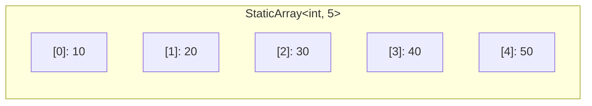

# Static Array — C++ Implementation

## Why Static Array?

### The Problem It Solves

Imagine you're building a game and need to store the positions of exactly 4 players. You could use a raw C-style array:

```cpp
int positions[4];
positions[5] = 100;  // Oops! No error, just silent memory corruption
```

This compiles and runs—but it's wrong. You wrote past the end of the array, corrupting memory. This is one of the most common sources of bugs and security vulnerabilities in C/C++ programs.

What we need is an array that:
1. Has a **fixed size known at compile time** (so the compiler can optimize)
2. Lives on the **stack** (fast allocation, automatic cleanup)
3. Provides **bounds checking** when we want it
4. Works seamlessly with **C++ standard library algorithms**

A Static Array gives us all of this—the performance of raw arrays with the safety and convenience of a proper container.

### Real-World Analogies

**An egg carton**: It holds exactly 12 eggs. You can't fit 13, and the carton doesn't grow. When you buy it, you know exactly how much space it takes up.

**A monthly calendar row**: Seven boxes for seven days. The structure is fixed—you wouldn't try to access "day 8" of a week.

**Reserved parking spots**: A parking lot with exactly 20 numbered spots. You can park in spots 0-19, but spot 20 doesn't exist. The lot size was decided when it was built and never changes.

### When to Use It

- **Use a static array when you know the exact size at compile time**
  - RGB color values (always 3 components)
  - Matrix operations with fixed dimensions
  - Lookup tables that never change size

- **Use it when you need stack allocation**
  - Performance-critical code where heap allocation overhead matters
  - Embedded systems with limited or no heap

- **Unlike `std::vector`**, a static array:
  - Cannot grow or shrink
  - Requires no heap allocation
  - Has its size baked into the type (`StaticArray<int, 5>` is a different type than `StaticArray<int, 10>`)

---

## Core Concept

### The Big Idea

A static array wraps a fixed-size C-style array (`T data_[N]`) in a class template, providing type-safe access, bounds checking, and iterator support. The size `N` is a **compile-time constant**, which means the compiler knows the exact memory layout and can optimize aggressively.

### Visual Representation



This diagram shows a `StaticArray<int, 5>` holding 5 integers. The elements are stored **contiguously** in memory—one right after another with no gaps. If the first element is at memory address 1000, and each `int` is 4 bytes, then:

| Index | Memory Address | Value |
|-------|----------------|-------|
| 0     | 1000           | 10    |
| 1     | 1004           | 20    |
| 2     | 1008           | 30    |
| 3     | 1012           | 40    |
| 4     | 1016           | 50    |

### Key Terminology

- **Template**: A C++ feature that lets you write code that works with any type. `template <typename T>` means "T is a placeholder for any type."

- **Non-type template parameter**: A template parameter that's a value, not a type. In `template <typename T, std::size_t N>`, the `N` is a compile-time integer constant.

- **Contiguous memory**: Elements stored one after another with no gaps. This enables pointer arithmetic and efficient CPU cache usage.

- **Iterator**: An object that points to an element and can be advanced to the next element. In our implementation, raw pointers (`T*`) serve as iterators.

- **constexpr**: A C++ keyword meaning "this can be evaluated at compile time." Marking methods `constexpr` allows using the array in compile-time computations.

---

## How It Works: Step-by-Step

### Operation 1: Element Access with `at()`

**What it does**: Retrieves a reference to the element at a given index, with bounds checking.

**Step-by-step walkthrough**:

Starting state — a `StaticArray<int, 4>` with values:
```
Index:  [0]   [1]   [2]   [3]
Value:   10    20    30    40
```

**Accessing `arr.at(2)`**:

Step 1: Check if index (2) is within bounds
```
Is 2 >= 4?  No, so we continue.
```

Step 2: Return reference to `data_[2]`
```
Index:  [0]   [1]   [2]   [3]
Value:   10    20   >30<   40
                     ^
                     Returned (value = 30)
```

**What happens with `arr.at(5)`?**

Step 1: Check if index (5) is within bounds
```
Is 5 >= 4?  Yes! Throw std::out_of_range exception.
```

**Why this approach?** We provide both `at()` (safe, bounds-checked) and `operator[]` (fast, unchecked). This lets programmers choose: safety when debugging, speed when they're confident their indices are valid.

### Operation 2: Element Access with `operator[]`

**What it does**: Retrieves a reference to the element at a given index, **without** bounds checking.

This is identical to `at()` but skips the bounds check:

```
arr[2]  ->  return data_[2]  (no questions asked)
arr[10] ->  return data_[10] (undefined behavior! memory corruption!)
```

**Why have both?** Performance. In a tight loop accessing millions of elements, that bounds check adds up. When you're confident your indices are valid, `operator[]` is faster.

### Operation 3: Fill

**What it does**: Sets every element in the array to the same value.

**Step-by-step walkthrough**:

Starting state:
```
Index:  [0]   [1]   [2]   [3]
Value:   ?     ?     ?     ?     (uninitialized)
```

Call `arr.fill(42)`:

Iteration 1 (i=0):
```
Index:  [0]   [1]   [2]   [3]
Value:  42     ?     ?     ?
```

Iteration 2 (i=1):
```
Index:  [0]   [1]   [2]   [3]
Value:  42    42     ?     ?
```

Iteration 3 (i=2):
```
Index:  [0]   [1]   [2]   [3]
Value:  42    42    42     ?
```

Iteration 4 (i=3):
```
Index:  [0]   [1]   [2]   [3]
Value:  42    42    42    42
```

**Why this approach?** Simple and correct. We could use `std::fill`, but that would require including `<algorithm>`. This minimal approach keeps dependencies low.

### Worked Example: Complete Sequence

Let's trace through a realistic usage scenario:

```cpp
StaticArray<int, 4> arr;
```

**Operation 1: Initial state (uninitialized)**
```
Index:  [0]   [1]   [2]   [3]
Value:   ?     ?     ?     ?     (garbage values for primitive types)
```

**Operation 2: `arr.fill(0)`**
```
Index:  [0]   [1]   [2]   [3]
Value:   0     0     0     0
```

**Operation 3: `arr[0] = 10`**
```
Index:  [0]   [1]   [2]   [3]
Value:  10     0     0     0
```

**Operation 4: `arr[2] = arr[0] * 3`**
```
Index:  [0]   [1]   [2]   [3]
Value:  10     0    30     0
```

**Operation 5: `arr.at(1) = 20`**
```
Index:  [0]   [1]   [2]   [3]
Value:  10    20    30     0
```

**Operation 6: `arr.back() = 40`**
```
Index:  [0]   [1]   [2]   [3]
Value:  10    20    30    40
```

**Operation 7: `int x = arr.front()` (x = 10)**
```
Index:  [0]   [1]   [2]   [3]
Value:  10    20    30    40     (unchanged, just read)
```

**Operation 8: Range-based for loop**
```cpp
for (int val : arr) {
    std::cout << val << " ";
}
// Output: 10 20 30 40
```

This works because our `begin()` and `end()` methods return iterators that the range-for loop uses internally.

---

## From Concept to Code

### The Data Structure

Before looking at code, let's understand what we need:

1. **Storage for N elements of type T**: A C-style array `T data_[N]`
2. **That's it!** — No size variable needed because `N` is baked into the type at compile time

The simplicity is the point. We're wrapping a raw array to add safety and convenience without any runtime overhead.

### C++ Implementation

```cpp
template <typename T, std::size_t N>
class StaticArray {
public:
    using value_type = T;
    using size_type = std::size_t;
    using iterator = T*;
    using const_iterator = const T*;

    // ... methods ...

private:
    T data_[N];
};
```

**Line-by-line breakdown**:

- **Line 1**: `template <typename T, std::size_t N>` — This class is parameterized by:
  - `T`: The element type (could be `int`, `double`, `std::string`, anything)
  - `N`: The array size, which must be a compile-time constant

- **Line 4-7**: Type aliases for STL compatibility:
  - `value_type`: What type the container holds
  - `size_type`: Type used for sizes and indices (unsigned)
  - `iterator` / `const_iterator`: Raw pointers work as iterators

- **Line 12**: `T data_[N]` — The actual storage. This is a C-style array embedded directly in the object. No heap allocation, no pointers—just N consecutive T's.

### Implementing `at()` (Bounds-Checked Access)

**The algorithm in plain English**:
1. Check if the index is out of range (>= N)
2. If so, throw an exception
3. Otherwise, return a reference to that element

**The code**:
```cpp
constexpr T& at(size_type index) {
    if (index >= N)
        throw std::out_of_range("StaticArray::at: index out of range");
    return data_[index];
}

constexpr const T& at(size_type index) const {
    if (index >= N)
        throw std::out_of_range("StaticArray::at: index out of range");
    return data_[index];
}
```

**Understanding the tricky parts**:

- **`constexpr`**: Allows this function to be evaluated at compile time when called with compile-time constants. Modern C++ idiom.

- **`T&` (reference return)**: We return a reference so the caller can modify the element: `arr.at(0) = 42` works.

- **Two versions (const and non-const)**:
  - `T& at(...)` — Called on mutable arrays, returns mutable reference
  - `const T& at(...) const` — Called on const arrays, returns read-only reference

  The `const` at the end means "this method doesn't modify the object."

- **`size_type` vs `int`**: Using `std::size_t` (unsigned) prevents negative indices and matches STL conventions.

### Implementing `operator[]` (Unchecked Access)

**The code**:
```cpp
constexpr T& operator[](size_type index) noexcept {
    return data_[index];
}
constexpr const T& operator[](size_type index) const noexcept {
    return data_[index];
}
```

**Understanding the tricky parts**:

- **`noexcept`**: Promises this function never throws exceptions. This enables compiler optimizations and is semantically accurate (we're not doing bounds checking).

- **No bounds check**: This is intentional. If you access out of bounds, it's undefined behavior. The tradeoff is maximum speed when you know your indices are valid.

### Implementing Iterators

**The code**:
```cpp
constexpr iterator begin() noexcept { return data_; }
constexpr const_iterator begin() const noexcept { return data_; }
constexpr iterator end() noexcept { return data_ + N; }
constexpr const_iterator end() const noexcept { return data_ + N; }
```

**Understanding the tricky parts**:

- **`return data_`**: An array name decays to a pointer to its first element. So `data_` gives us `&data_[0]`.

- **`return data_ + N`**: Pointer arithmetic. If `data_` points to index 0, then `data_ + N` points one past the last element. This is the standard C++ convention for "end" iterators—they point to the position *after* the last valid element.

- **Why raw pointers work as iterators**: C++ iterators don't need to be special classes. Any type that supports `*` (dereference) and `++` (advance) works. Pointers naturally support both, plus random access (`ptr + 5`), making them "random access iterators."

### The Zero-Size Specialization

What happens if someone creates `StaticArray<int, 0>`? In standard C++, zero-length arrays (`T data_[0]`) are technically invalid. We handle this with template specialization:

```cpp
template <typename T>
class StaticArray<T, 0> {
public:
    // Same type aliases...

    constexpr T& at(size_type) {
        throw std::out_of_range("StaticArray::at: index out of range");
    }

    constexpr T* data() noexcept { return nullptr; }
    constexpr size_type size() const noexcept { return 0; }
    constexpr bool empty() const noexcept { return true; }

    constexpr iterator begin() noexcept { return nullptr; }
    constexpr iterator end() noexcept { return nullptr; }
    // ...
};
```

**Key points**:
- No `data_` member at all (avoid zero-length array)
- `at()` always throws (no valid index exists)
- `data()` returns `nullptr`
- `begin() == end()` (both `nullptr`), indicating an empty range

---

## Complexity Analysis

### Time Complexity

| Operation | Best | Average | Worst | Why |
|-----------|------|---------|-------|-----|
| `at(i)`   | O(1) | O(1)    | O(1)  | Direct index calculation: address = base + i * sizeof(T) |
| `operator[]` | O(1) | O(1) | O(1)  | Same as `at()` but without the bounds check |
| `front()` / `back()` | O(1) | O(1) | O(1) | Just `data_[0]` or `data_[N-1]` |
| `fill(v)` | O(N) | O(N)   | O(N)  | Must visit every element once |
| `size()` / `empty()` | O(1) | O(1) | O(1) | Returns compile-time constant `N` |
| `begin()` / `end()` | O(1) | O(1) | O(1) | Returns pointer (no computation) |

**Understanding the "Why" column**:

Array access is O(1) because of how contiguous memory works. Given the base address and element size, we can compute any element's address with simple arithmetic:

```
address of arr[i] = base_address + (i * element_size)
```

No searching, no following pointers—just math.

### Space Complexity

- **Overall structure**: O(N) — We store exactly N elements, nothing more
- **Per operation**: O(1) — No operation allocates additional memory
- **No overhead**: Unlike `std::vector`, there's no capacity tracking, no pointer to heap memory, just the raw elements

### Why "Compile-Time Size" Matters

Since `N` is a template parameter, not a runtime variable:

1. **No storage for size**: We don't need a `size_` member variable
2. **Inlining**: The compiler can inline `size()` as just the constant `N`
3. **Loop unrolling**: For small N, the compiler might unroll `fill()` entirely
4. **Stack allocation**: The compiler knows exactly how much stack space to reserve

---

## Common Mistakes & Pitfalls

### Mistake 1: Forgetting That Different Sizes Are Different Types

```cpp
// Wrong: These are DIFFERENT TYPES
void processArray(StaticArray<int, 5>& arr) { /* ... */ }

StaticArray<int, 10> myArray;
processArray(myArray);  // Compile error! Types don't match
```

```cpp
// Right: Use templates for size-generic functions
template <std::size_t N>
void processArray(StaticArray<int, N>& arr) { /* ... */ }

StaticArray<int, 10> myArray;
processArray(myArray);  // Works! N is deduced as 10
```

**Why this matters**: `StaticArray<int, 5>` and `StaticArray<int, 10>` are completely unrelated types to the compiler. This is the tradeoff for compile-time size—you gain performance but lose flexibility.

### Mistake 2: Using `operator[]` When You Should Use `at()`

```cpp
// Dangerous: No bounds checking
int value = arr[userInput];  // If userInput >= N, undefined behavior!
```

```cpp
// Safe: Bounds checking with clear error
try {
    int value = arr.at(userInput);
} catch (const std::out_of_range& e) {
    std::cerr << "Invalid index: " << e.what() << '\n';
}
```

**Why this matters**: Out-of-bounds access is undefined behavior. It might crash, might silently corrupt memory, or might appear to work today and fail tomorrow. When dealing with untrusted input, always use `at()`.

### Mistake 3: Assuming Elements Are Zero-Initialized

```cpp
// Wrong assumption:
StaticArray<int, 5> arr;
std::cout << arr[0];  // Undefined! Could print anything

// Right:
StaticArray<int, 5> arr;
arr.fill(0);  // Now all elements are definitely 0
std::cout << arr[0];  // Prints 0
```

**Why this matters**: For primitive types like `int`, `double`, etc., default construction leaves them with garbage values. Only class types with default constructors get initialized. Always call `fill()` or explicitly set values before reading.

### Mistake 4: Confusing `begin()`/`end()` Return Values

```cpp
// Wrong: Comparing pointer to integer
if (arr.end() == N) { /* ... */ }  // Type mismatch!

// Right: Comparing iterators (pointers)
if (arr.begin() == arr.end()) {
    std::cout << "Array is empty";
}

// Or use the provided method:
if (arr.empty()) {
    std::cout << "Array is empty";
}
```

**Why this matters**: `begin()` and `end()` return pointers, not indices. They're for iteration, not size comparison.

---

## Practice Problems

To solidify your understanding, try implementing:

1. **`swap(StaticArray& other)`**: Exchange contents with another array of the same size. Consider: do you need to handle self-swap?

2. **`reverse()`**: Reverse the elements in place. Hint: use two indices moving toward each other.

3. **`find(const T& value)`**: Return an iterator to the first occurrence of value, or `end()` if not found. This teaches you to work with iterators.

4. **Comparison operators**: Implement `operator==` to compare two arrays element-by-element. Think about whether arrays of different sizes should be comparable.

5. **`std::initializer_list` constructor**: Allow `StaticArray<int, 3> arr = {1, 2, 3};` syntax. This is trickier and requires understanding aggregate initialization.

---

## Summary

### Key Takeaways

- A static array wraps a C-style array to provide **type safety**, **bounds checking**, and **iterator support** without any runtime overhead

- The size is a **compile-time template parameter**, meaning different sizes are different types—this enables aggressive optimization but limits flexibility

- Use `at()` for safety during development and with untrusted input; use `operator[]` for performance when you're confident indices are valid

- Raw pointers work perfectly as random-access iterators, enabling compatibility with the entire C++ standard library algorithm suite

- Zero-size arrays need special handling via template specialization to avoid undefined behavior

### Quick Reference

```
StaticArray<T, N> — Fixed-size, stack-allocated container
|-- at(i)          : O(1) — Bounds-checked access, throws on invalid index
|-- operator[i]    : O(1) — Unchecked access, undefined behavior on invalid
|-- front() / back(): O(1) — Access first/last element
|-- fill(value)    : O(N) — Set all elements to value
|-- size()         : O(1) — Returns N (compile-time constant)
|-- empty()        : O(1) — Returns true if N == 0
|-- begin() / end(): O(1) — Iterator access for range-for and algorithms

Best for: Fixed-size data, performance-critical code, compile-time known sizes
Avoid when: Size unknown at compile time, need to grow/shrink, need to pass
            different sizes to the same function without templates
```
