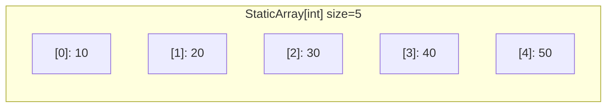

# Static Array - Go Implementation

## Why Static Array?

### The Problem It Solves

Imagine you're building a game where the board is always 8x8 squares (like chess), or you're storing the RGB values of a pixel (always exactly 3 numbers). You know exactly how many elements you need, and that number will never change.

Go's built-in slices are powerful, but they're designed for dynamic collections that can grow and shrink. When you know your size upfront and it's fixed, you want something simpler:
- No accidental resizing (which could be a bug in disguise)
- Clear intent in your code: "this collection has exactly N elements"
- Predictable memory usage

A **static array** is the answer: a fixed-size container where you decide the size once at creation, and it stays that size forever.

### Real-World Analogies

1. **A pill organizer** - It has exactly 7 compartments (one per day). You can put different pills in each compartment, but you can't add an 8th compartment or remove one. The structure is fixed.

2. **An ice cube tray** - It holds exactly 12 ice cubes. You can fill or empty individual slots, but the tray itself doesn't grow or shrink.

3. **A parking lot with numbered spots** - If it has 50 spots numbered 0-49, you can park cars in any spot, check which car is in spot 23, but you can't suddenly have 51 spots.

### When to Use It

- **Fixed-size data**: Coordinates (x, y, z), RGB colors (r, g, b), game boards
- **Buffers with known size**: Reading exactly 1024 bytes at a time
- **Configuration with fixed entries**: Days of the week, months of the year
- **When resizing would be a bug**: If your code accidentally tries to add a 4th element to a 3-element array, you want to know immediately

**Unlike a slice**, a static array:
- Cannot grow with `append()`
- Has bounds-checking built into its API (optional)
- Clearly communicates "this size is intentional"

---

## Core Concept

### The Big Idea

A static array is a contiguous block of memory holding a fixed number of elements. Every element lives at a predictable position (its index), and you can read or write any element in constant time by knowing its index. The array's size is set once at creation and never changes.

### Visual Representation



This diagram shows a static array of 5 integers. Each box is a slot:
- The number in brackets `[0]` is the **index** (position)
- The number after the colon is the **value** stored at that position

You can access any element by its index: `arr.Get(2)` returns `30`.

### Key Terminology

- **Index**: The position of an element, starting from 0. In an array of size 5, valid indices are 0, 1, 2, 3, and 4.
- **Bounds checking**: Verifying that an index is valid before accessing. Index 5 in a size-5 array is "out of bounds."
- **Zero value**: In Go, uninitialized variables have a default value (0 for int, "" for string, false for bool). A newly created static array is filled with zero values.
- **Contiguous memory**: Elements are stored one after another in memory, with no gaps. This makes access fast because the computer can calculate exactly where each element lives.

---

## How It Works: Step-by-Step

### Operation 1: Creating an Array (`New`)

**What it does**: Allocates a fixed-size array and returns a pointer to it.

**Step-by-step walkthrough**:

We want to create a static array of 4 integers.

```go
arr, err := staticarray.New[int](4)
```

Step 1: Go allocates memory for 4 integers, all initialized to zero:
```
[0]: 0    [1]: 0    [2]: 0    [3]: 0
```

Step 2: A `StaticArray` struct is created with:
- `data`: the slice pointing to these 4 integers
- `size`: 4

Step 3: A pointer to this struct is returned.

**Why this approach?** Returning a pointer (rather than the struct itself) means:
1. The struct isn't copied every time you pass it to a function
2. Methods can modify the array's contents
3. This is idiomatic Go for mutable data structures

---

### Operation 2: Setting an Element (`Set` / `SetAt`)

**What it does**: Stores a value at a specific index.

**Step-by-step walkthrough**:

Starting with our array of zeros:
```
[0]: 0    [1]: 0    [2]: 0    [3]: 0
```

We call `arr.Set(1, 42)`:

Step 1: Go calculates where index 1 lives in memory (the second slot).

Step 2: The value 42 is written to that location:
```
[0]: 0    [1]: 42    [2]: 0    [3]: 0
```

**The difference between `Set` and `SetAt`**:
- `Set(i, v)` - No bounds checking. If `i` is invalid, Go panics.
- `SetAt(i, v)` - Returns an error if `i` is invalid. Safer, but slightly more verbose to use.

---

### Operation 3: Getting an Element (`Get` / `At`)

**What it does**: Retrieves the value at a specific index.

**Step-by-step walkthrough**:

Given our array:
```
[0]: 0    [1]: 42    [2]: 0    [3]: 0
```

Calling `arr.Get(1)`:

Step 1: Go finds index 1 in memory.

Step 2: Returns the value `42`.

**The difference between `Get` and `At`**:
- `Get(i)` - Returns just the value. Panics if `i` is invalid.
- `At(i)` - Returns `(value, error)`. Returns an error if `i` is invalid.

---

### Operation 4: Fill

**What it does**: Sets every element in the array to the same value.

**Step-by-step walkthrough**:

Starting state:
```
[0]: 0    [1]: 42    [2]: 0    [3]: 0
```

Calling `arr.Fill(7)`:

Step 1: Index 0 is set to 7:
```
[0]: 7    [1]: 42    [2]: 0    [3]: 0
```

Step 2: Index 1 is set to 7:
```
[0]: 7    [1]: 7    [2]: 0    [3]: 0
```

Step 3: Index 2 is set to 7:
```
[0]: 7    [1]: 7    [2]: 7    [3]: 0
```

Step 4: Index 3 is set to 7:
```
[0]: 7    [1]: 7    [2]: 7    [3]: 7
```

**Why this approach?** Fill uses a simple loop that visits each element once. This is O(N) - the time grows linearly with the array size.

---

### Worked Example: Complete Sequence

Let's trace through a realistic sequence of operations:

```go
// Operation 1: Create an array of 5 integers
arr, _ := staticarray.New[int](5)
```
State: `[0]: 0  [1]: 0  [2]: 0  [3]: 0  [4]: 0`

```go
// Operation 2: Set some values
arr.Set(0, 10)
arr.Set(2, 30)
arr.Set(4, 50)
```
State: `[0]: 10  [1]: 0  [2]: 30  [3]: 0  [4]: 50`

```go
// Operation 3: Read a value
val := arr.Get(2)  // val = 30
```
State unchanged: `[0]: 10  [1]: 0  [2]: 30  [3]: 0  [4]: 50`

```go
// Operation 4: Check first and last elements
front, _ := arr.Front()  // front = 10
back, _ := arr.Back()    // back = 50
```
State unchanged: `[0]: 10  [1]: 0  [2]: 30  [3]: 0  [4]: 50`

```go
// Operation 5: Try to access an invalid index (safely)
_, err := arr.At(10)  // err = ErrOutOfRange
```
State unchanged. The error tells us the index was invalid.

```go
// Operation 6: Fill the array
arr.Fill(99)
```
State: `[0]: 99  [1]: 99  [2]: 99  [3]: 99  [4]: 99`

```go
// Operation 7: Iterate over all elements
for i, v := range arr.Data() {
    fmt.Printf("Index %d: %d\n", i, v)
}
```
Prints:
```
Index 0: 99
Index 1: 99
Index 2: 99
Index 3: 99
Index 4: 99
```

---

## From Concept to Code

### The Data Structure

Before looking at code, let's think about what we need to store:

1. **The actual elements** - We need somewhere to put the values (10, 20, 30, etc.)
2. **The size** - We need to know how many elements the array holds

In Go, we'll use:
- A **slice** (`[]T`) as the backing storage for elements
- An **int** to track the size

### Go Implementation

```go
type StaticArray[T any] struct {
    data []T
    size int
}
```

**Line-by-line breakdown**:

- `type StaticArray[T any]` - Defines a generic type. `[T any]` means "T can be any type." You can have `StaticArray[int]`, `StaticArray[string]`, `StaticArray[MyCustomType]`, etc.
- `struct { ... }` - A struct groups related data together.
- `data []T` - A slice that holds the actual elements. The type is `[]T` (slice of T).
- `size int` - Tracks how many elements the array has.

**Why both `data` and `size`?** In Go, a slice already knows its length (`len(data)`). But storing `size` separately:
1. Makes the intent explicit
2. Matches the conceptual model of a fixed-size array
3. The slice's length and capacity are set once and never change

### Implementing the Constructor

**The algorithm in plain English**:
1. Check if the requested size is valid (not negative)
2. Allocate a slice of the requested size
3. Return a pointer to the struct

**The code**:

```go
var ErrNegativeSize = errors.New("StaticArray: size cannot be negative")

func New[T any](size int) (*StaticArray[T], error) {
    if size < 0 {
        return nil, ErrNegativeSize
    }
    return &StaticArray[T]{
        data: make([]T, size),
        size: size,
    }, nil
}
```

**Understanding the tricky parts**:

- `func New[T any]` - This is a generic function. The `[T any]` declares that T is a type parameter.
- `*StaticArray[T]` - Returns a pointer to the struct (indicated by `*`).
- `make([]T, size)` - Creates a slice of type T with the given size. All elements are initialized to their zero value.
- `&StaticArray[T]{...}` - The `&` takes the address of the struct, giving us a pointer.
- `return ..., nil` - In Go, functions that can fail return `(result, error)`. `nil` error means success.

### Implementing Bounds-Checked Access (`At`)

**The algorithm in plain English**:
1. Check if the index is valid (not negative, not >= size)
2. If invalid, return an error
3. If valid, return the element at that index

**The code**:

```go
var ErrOutOfRange = errors.New("StaticArray: index out of range")

func (a *StaticArray[T]) At(index int) (T, error) {
    var zero T
    if index < 0 || index >= a.size {
        return zero, ErrOutOfRange
    }
    return a.data[index], nil
}
```

**Understanding the tricky parts**:

- `func (a *StaticArray[T])` - This is a method with a pointer receiver. `a` is the array we're operating on.
- `var zero T` - Creates a zero value for type T. Since T could be anything (int, string, custom struct), we use `var zero T` to get whatever "empty" means for that type. For int, zero is 0. For string, it's "".
- `return zero, ErrOutOfRange` - When returning an error, we still need to return something for the value. The zero value is the conventional choice.
- `a.data[index]` - Standard slice indexing to get the element.

### Implementing Unchecked Access (`Get`)

**The algorithm in plain English**:
1. Return the element at the given index (let Go panic if invalid)

**The code**:

```go
func (a *StaticArray[T]) Get(index int) T {
    return a.data[index]
}
```

**Understanding the tricky parts**:

This is intentionally simple. If `index` is out of bounds, Go's runtime will panic with "index out of range." This is useful when:
- You're confident the index is valid
- You want maximum performance (no extra checks)
- You prefer a panic over handling errors

### Implementing Front and Back

**The algorithm in plain English**:
1. Check if the array is empty
2. If empty, return an error
3. If not empty, return the first (index 0) or last (index size-1) element

**The code**:

```go
var ErrEmpty = errors.New("StaticArray: array is empty")

func (a *StaticArray[T]) Front() (T, error) {
    var zero T
    if a.size == 0 {
        return zero, ErrEmpty
    }
    return a.data[0], nil
}

func (a *StaticArray[T]) Back() (T, error) {
    var zero T
    if a.size == 0 {
        return zero, ErrEmpty
    }
    return a.data[a.size-1], nil
}
```

**Understanding the tricky parts**:

- `a.size-1` - The last valid index. In a size-5 array, indices are 0-4, so the last is 5-1 = 4.
- Why check for empty? An empty array (size 0) has no first or last element. Trying to access `data[0]` when size is 0 would panic.

### Implementing Fill

**The algorithm in plain English**:
1. Loop through every index
2. Set each element to the given value

**The code**:

```go
func (a *StaticArray[T]) Fill(value T) {
    for i := range a.data {
        a.data[i] = value
    }
}
```

**Understanding the tricky parts**:

- `for i := range a.data` - Iterates over all valid indices of the slice. This is equivalent to `for i := 0; i < len(a.data); i++` but more idiomatic.
- `a.data[i] = value` - Overwrites whatever was there with the new value.

---

## Complexity Analysis

### Time Complexity

| Operation | Best | Average | Worst | Why |
|-----------|------|---------|-------|-----|
| New(n)    | O(n) | O(n)    | O(n)  | Must allocate and zero-initialize n elements |
| Get/At    | O(1) | O(1)    | O(1)  | Direct index calculation, no searching |
| Set/SetAt | O(1) | O(1)    | O(1)  | Direct index calculation, no shifting |
| Front/Back| O(1) | O(1)    | O(1)  | First/last index is always known |
| Fill      | O(n) | O(n)    | O(n)  | Must visit every element once |
| Size/IsEmpty | O(1) | O(1) | O(1)  | Just returns the stored size value |
| Data      | O(1) | O(1)    | O(1)  | Just returns the existing slice reference |

**Understanding the "Why" column**:

- **O(1)** (constant time) means the operation takes the same amount of time regardless of array size. Getting element 0 from a 10-element array takes the same time as getting element 999,999 from a million-element array.

- **O(n)** (linear time) means the time grows proportionally with array size. Filling a 1000-element array takes roughly 10x longer than filling a 100-element array.

### Space Complexity

- **Overall structure**: O(n) where n is the array size. We store n elements plus a small constant overhead (the size field and slice header).
- **Per operation**: O(1) for all operations. No operation allocates additional memory proportional to the array size.

---

## Common Mistakes and Pitfalls

### Mistake 1: Ignoring Errors from `At` / `SetAt`

```go
// Wrong: Ignoring the error
value, _ := arr.At(100)  // If 100 is out of bounds, value is 0 (zero value)
// Code continues with wrong value!

// Right: Check the error
value, err := arr.At(100)
if err != nil {
    // Handle the error - log it, return early, etc.
    log.Printf("Invalid index: %v", err)
    return
}
// Now safe to use value
```

**Why this matters**: If you ignore the error, you'll silently get a zero value when the index is invalid. Your code might continue with bad data, causing subtle bugs far from the actual mistake.

### Mistake 2: Confusing Size with Capacity

```go
// Wrong assumption: "I can add more elements"
arr, _ := staticarray.New[int](5)
arr.Set(5, 100)  // PANIC! Valid indices are 0-4, not 5

// Right: Understand that size is fixed
arr, _ := staticarray.New[int](5)
for i := 0; i < arr.Size(); i++ {  // Loop from 0 to 4
    arr.Set(i, i*10)
}
```

**Why this matters**: A static array of size 5 has indices 0, 1, 2, 3, 4. Index 5 does not exist. This is a classic off-by-one error.

### Mistake 3: Modifying Data() and Expecting Independence

```go
// The Data() slice shares memory with the array
arr, _ := staticarray.New[int](3)
arr.Fill(10)

slice := arr.Data()
slice[0] = 999  // This ALSO changes arr!

fmt.Println(arr.Get(0))  // Prints 999, not 10!
```

**Why this matters**: `Data()` returns the underlying slice, not a copy. Modifications to that slice affect the original array. If you need an independent copy:

```go
// Right: Make an explicit copy if you need independence
slice := make([]int, arr.Size())
copy(slice, arr.Data())
slice[0] = 999  // Only affects slice, not arr
```

### Mistake 4: Using Get/Set When You're Not Sure About Bounds

```go
// Wrong: Using Get with uncertain index
func processItem(arr *staticarray.StaticArray[int], i int) int {
    return arr.Get(i) * 2  // Might panic!
}

// Right: Use At when the index might be invalid
func processItem(arr *staticarray.StaticArray[int], i int) (int, error) {
    val, err := arr.At(i)
    if err != nil {
        return 0, fmt.Errorf("invalid index %d: %w", i, err)
    }
    return val * 2, nil
}
```

**Why this matters**: `Get` panics on invalid indices. Use it only when you're certain the index is valid (e.g., inside a `for i := 0; i < arr.Size(); i++` loop). Use `At` when the index comes from user input or other uncertain sources.

### Mistake 5: Forgetting to Handle Negative Size

```go
// Wrong: Assuming New always succeeds
arr, _ := staticarray.New[int](userInput)  // What if userInput is -5?

// Right: Check the error
arr, err := staticarray.New[int](userInput)
if err != nil {
    // Handle: ErrNegativeSize means user gave us bad input
    return fmt.Errorf("invalid array size: %w", err)
}
```

**Why this matters**: If `New` receives a negative size, it returns `ErrNegativeSize`. Ignoring this error means `arr` is `nil`, and any method call on it will panic with a nil pointer dereference.

---

## Go-Specific Concepts Explained

### Generics with `[T any]`

```go
type StaticArray[T any] struct { ... }
```

This declares a **generic type**. The `[T any]` means:
- `T` is a placeholder for a type
- `any` means T can be any type (int, string, custom struct, etc.)

When you use it:
```go
intArray, _ := staticarray.New[int](5)      // T = int
stringArray, _ := staticarray.New[string](3) // T = string
```

The compiler generates specialized code for each type you use. This gives you type safety (can't put a string in an int array) without sacrificing performance.

### Pointer Receivers `(a *StaticArray[T])`

```go
func (a *StaticArray[T]) Set(index int, value T) { ... }
```

The `*` before `StaticArray[T]` means this method receives a **pointer** to the struct, not a copy. This matters because:

1. **Mutation works**: When `Set` modifies `a.data[index]`, it's modifying the original struct, not a copy.
2. **Efficiency**: The struct isn't copied on each method call. Just a small pointer is passed.
3. **Consistency**: Go convention is to use pointer receivers when any method modifies the struct.

### The Zero Value Pattern

```go
func (a *StaticArray[T]) At(index int) (T, error) {
    var zero T
    if index < 0 || index >= a.size {
        return zero, ErrOutOfRange
    }
    return a.data[index], nil
}
```

In Go, you can't return "nothing" for a generic type T. When there's an error, we need to return something. The convention is to use the **zero value**:

- `var zero T` declares a variable of type T without initializing it
- Go automatically sets it to the zero value for that type:
  - `int` -> `0`
  - `string` -> `""`
  - `bool` -> `false`
  - Pointers -> `nil`
  - Structs -> all fields are their zero values

This pattern lets generic functions return "empty" values regardless of what T actually is.

### Sentinel Errors

```go
var ErrOutOfRange = errors.New("StaticArray: index out of range")
var ErrEmpty = errors.New("StaticArray: array is empty")
```

These are **exported package-level error values** (they start with uppercase letters). Callers can check for specific errors:

```go
_, err := arr.At(100)
if errors.Is(err, staticarray.ErrOutOfRange) {
    // Handle out-of-range specifically
} else if err != nil {
    // Handle other errors
}
```

This is better than comparing error messages (which might change) and allows wrapped errors to still match.

---

## Practice Problems

To solidify your understanding, try implementing:

1. **Swap** - Swap the elements at two indices. Should it return an error if either index is invalid?

2. **Reverse** - Reverse the array in-place. Hint: swap elements from both ends moving toward the middle.

3. **IndexOf** - Find the first index where a given value appears. Return -1 if not found. Note: you'll need to constrain T to comparable types (`[T comparable]`).

4. **Copy** - Create a deep copy of the array. The copy should be independent (modifying one doesn't affect the other).

5. **Equals** - Check if two static arrays have the same size and contents. Consider: what type constraint does T need?

---

## Summary

### Key Takeaways

- A static array is a fixed-size container where size is set at creation and never changes
- Go's generics (`[T any]`) let us write type-safe, reusable code for any element type
- Two access patterns exist: safe (`At`/`SetAt` return errors) and fast (`Get`/`Set` may panic)
- Pointer receivers (`*StaticArray[T]`) allow methods to modify the struct and avoid copying
- Sentinel errors (`ErrOutOfRange`, `ErrEmpty`) enable callers to handle specific failure cases
- The zero value pattern (`var zero T`) lets generic functions return "empty" values on error

### Quick Reference

```
StaticArray[T] - Fixed-size generic container
|-- New(size)     : O(n) - Create array, returns (*StaticArray[T], error)
|-- At(i)         : O(1) - Get element with bounds check, returns (T, error)
|-- SetAt(i, v)   : O(1) - Set element with bounds check, returns error
|-- Get(i)        : O(1) - Get element, panics if invalid
|-- Set(i, v)     : O(1) - Set element, panics if invalid
|-- Front()       : O(1) - First element, returns (T, error)
|-- Back()        : O(1) - Last element, returns (T, error)
|-- Fill(v)       : O(n) - Set all elements to v
|-- Size()        : O(1) - Number of elements
|-- IsEmpty()     : O(1) - True if size is 0
|-- Data()        : O(1) - Underlying slice (shares memory!)

Best for: Fixed-size collections, buffers, coordinates, game boards
Avoid when: You need dynamic resizing (use slices instead)
```
