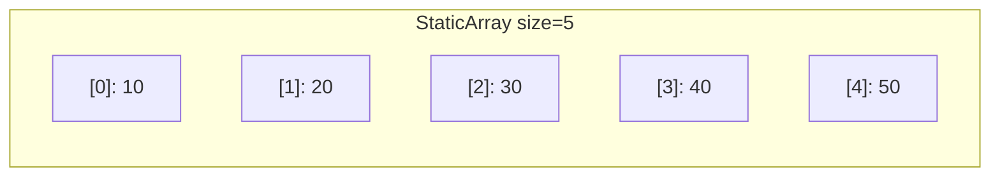
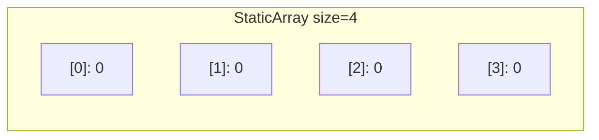
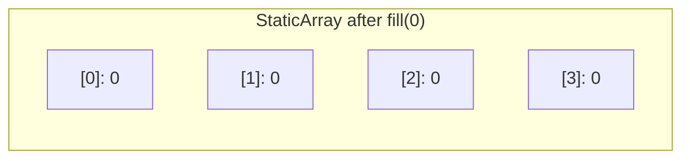

# Static Array — Python Implementation

## Why Static Array?

### The Problem It Solves

Imagine you're building a game and need to track exactly 10 player scores. You know upfront there will always be 10 players—no more, no less. You could use Python's built-in list, but lists are designed to grow and shrink dynamically. This flexibility comes with overhead: extra memory for potential growth, and the risk that someone accidentally appends an 11th score.

What if you want a container that says: "I hold exactly N items, period"? That's a static array.

A static array is the most fundamental data structure in computer science. It's a contiguous block of memory holding a fixed number of elements, each accessible by its index. While Python's lists are dynamic (they resize automatically), a static array has a size determined at creation and never changes.

### Real-World Analogies

1. **A hotel floor with numbered rooms**: A hotel floor has rooms 101-110. You can check who's in room 105 instantly (just go to that door), but you can't add room 111—the building's structure is fixed.

2. **A parking lot with painted spaces**: A lot with 50 marked spaces can hold exactly 50 cars. Space #23 is always in the same location. You can't squeeze in a 51st space without repainting the entire lot.

3. **A weekly pill organizer**: Seven compartments for seven days. Monday's compartment is always the first one. You can change what pills go in each day, but you can't add an eighth day.

### When to Use It

- **Use a static array when**:
  - You know the exact size needed upfront
  - You want to prevent accidental insertions or deletions
  - You need predictable O(1) access to any element by index
  - You're implementing other data structures (heaps, hash tables, circular buffers)

- **Unlike Python lists**:
  - Static arrays don't grow—no `append()`, `insert()`, or `pop()`
  - The size is a promise: code that expects 10 elements can rely on exactly 10 existing

- **Compared to tuples**:
  - Tuples are also fixed-size, but they're immutable (can't change elements)
  - Static arrays let you modify elements while keeping the size fixed

---

## Core Concept

### The Big Idea

A static array is a numbered sequence of slots, each holding one value. The number of slots (the "size" or "capacity") is fixed when the array is created. You can read or write any slot instantly using its index, but you cannot add or remove slots.

This simplicity is its power: because the size never changes, the array can live in one contiguous chunk of memory, and accessing element `i` is just a matter of looking at the right offset—no searching required.

### Visual Representation



This diagram shows a static array of size 5. Each box represents a slot with its index (in brackets) and current value. Index 0 is the first element, index 4 is the last.

### Key Terminology

- **Index**: A number identifying a slot's position. Starts at 0 (zero-indexed).
- **Element**: The value stored in a slot.
- **Size/Length**: The number of slots in the array (fixed at creation).
- **Bounds**: The valid range of indices (0 to size-1). Accessing outside this range is an error.
- **Contiguous**: Elements are stored next to each other in memory, enabling fast access.

---

## How It Works: Step-by-Step

### Operation 1: Creation

**What it does**: Allocates an array of a specified size, optionally filling all slots with a default value.

**Step-by-step walkthrough**:

We want to create an array of size 4 with default value 0:

```
StaticArray(4, default=0)
```

Step 1: Validate the size (must be a non-negative integer)
```
size = 4 -> Valid!
```

Step 2: Store the size for later reference
```
_size = 4
```

Step 3: Create the internal storage with 4 slots, each containing 0
```
[0]: 0    [1]: 0    [2]: 0    [3]: 0
```

Final state:


**Why this approach?** Pre-allocating all slots ensures the array is immediately usable. The default value prevents "uninitialized" slots containing garbage.

### Operation 2: Access with `at(index)`

**What it does**: Retrieves the value at a specific index, with bounds checking.

**Step-by-step walkthrough**:

Given this array:
```
[0]: 10    [1]: 20    [2]: 30    [3]: 40
```

Call: `arr.at(2)`

Step 1: Check if index is valid (0 <= 2 < 4)
```
2 >= 0? Yes
2 < 4? Yes
-> Index is valid
```

Step 2: Return the value at index 2
```
Return 30
```

Now let's try an invalid index: `arr.at(5)`

Step 1: Check if index is valid (0 <= 5 < 4)
```
5 >= 0? Yes
5 < 4? No!
-> Index is OUT OF BOUNDS
```

Step 2: Raise an error
```
IndexError: StaticArray.at: index out of range
```

**Why this approach?** Bounds checking catches bugs early. Without it, accessing index 5 in a size-4 array could read garbage memory (in lower-level languages) or silently fail.

### Operation 3: Modification with `set_at(index, value)`

**What it does**: Changes the value at a specific index, with bounds checking.

**Step-by-step walkthrough**:

Starting state:
```
[0]: 10    [1]: 20    [2]: 30    [3]: 40
```

Call: `arr.set_at(1, 99)`

Step 1: Check if index is valid (0 <= 1 < 4)
```
1 >= 0? Yes
1 < 4? Yes
-> Index is valid
```

Step 2: Replace the value at index 1
```
[0]: 10    [1]: 99    [2]: 30    [3]: 40
                ^
                Changed from 20 to 99
```

**Why this approach?** Like `at()`, bounds checking prevents writing to invalid memory locations.

### Operation 4: Fill

**What it does**: Sets every slot to the same value.

**Step-by-step walkthrough**:

Starting state:
```
[0]: 10    [1]: 20    [2]: 30    [3]: 40
```

Call: `arr.fill(0)`

Step 1: Set index 0 to 0
```
[0]: 0    [1]: 20    [2]: 30    [3]: 40
```

Step 2: Set index 1 to 0
```
[0]: 0    [1]: 0    [2]: 30    [3]: 40
```

Step 3: Set index 2 to 0
```
[0]: 0    [1]: 0    [2]: 0    [3]: 40
```

Step 4: Set index 3 to 0
```
[0]: 0    [1]: 0    [2]: 0    [3]: 0
```

Final state:


**Why this approach?** The loop visits each element exactly once, making this O(n)—the best possible for setting n values.

### Worked Example: Complete Sequence

Let's trace through a realistic sequence of operations:

```python
# Operation 1: Create array of size 5 with default value None
arr = StaticArray(5)
```
```
[0]: None    [1]: None    [2]: None    [3]: None    [4]: None
```

```python
# Operation 2: Set first element
arr.set_at(0, "apple")
```
```
[0]: "apple"    [1]: None    [2]: None    [3]: None    [4]: None
```

```python
# Operation 3: Set middle element using bracket notation
arr[2] = "banana"
```
```
[0]: "apple"    [1]: None    [2]: "banana"    [3]: None    [4]: None
```

```python
# Operation 4: Set last element
arr.set_at(4, "cherry")
```
```
[0]: "apple"    [1]: None    [2]: "banana"    [3]: None    [4]: "cherry"
```

```python
# Operation 5: Read front element
arr.front()  # Returns "apple"
```
```
[0]: "apple"  <-- front() returns this
```

```python
# Operation 6: Read back element
arr.back()  # Returns "cherry"
```
```
[4]: "cherry"  <-- back() returns this
```

```python
# Operation 7: Check size
len(arr)  # Returns 5
arr.size()  # Also returns 5
```

```python
# Operation 8: Fill all with "grape"
arr.fill("grape")
```
```
[0]: "grape"    [1]: "grape"    [2]: "grape"    [3]: "grape"    [4]: "grape"
```

---

## From Concept to Code

### The Data Structure

Before looking at code, let's think about what we need to track:

1. **The elements themselves**: We need somewhere to store the actual values.
2. **The size**: We need to know how many slots exist (for bounds checking and iteration).

That's it! A static array is remarkably simple—just a collection of values and a count.

### Python Implementation

```python
class StaticArray:
    def __init__(self, size, default=None):
        if not isinstance(size, int) or size < 0:
            raise ValueError("size must be a non-negative integer")
        self._size = size
        self._data = [default] * size
```

**Line-by-line breakdown**:

- `def __init__(self, size, default=None)`: The constructor takes a required size and an optional default value (defaults to `None`).

- `if not isinstance(size, int) or size < 0`: Python is dynamically typed, so we explicitly check that size is an integer and non-negative. This catches bugs like `StaticArray("five")` or `StaticArray(-3)`.

- `raise ValueError(...)`: If validation fails, we raise an exception immediately. Better to fail at creation than have mysterious bugs later.

- `self._size = size`: Store the size. The underscore prefix is a Python convention meaning "private—don't access directly from outside the class."

- `self._data = [default] * size`: Create a list with `size` copies of `default`. For example, `[0] * 4` creates `[0, 0, 0, 0]`. This is Python's list multiplication syntax.

### Implementing Bounds-Checked Access

**The algorithm in plain English**:
1. Check if the index is within valid bounds (0 to size-1)
2. If not, raise an error
3. If yes, return (or set) the value at that index

**The code**:
```python
def at(self, index):
    if index < 0 or index >= self._size:
        raise IndexError("StaticArray.at: index out of range")
    return self._data[index]

def set_at(self, index, value):
    if index < 0 or index >= self._size:
        raise IndexError("StaticArray.at: index out of range")
    self._data[index] = value
```

**Understanding the tricky parts**:

- `index < 0`: We explicitly reject negative indices here. Why? Because Python lists accept negative indices (`list[-1]` is the last element), but we want `at()` to behave like C++ where negative indices are invalid.

- `index >= self._size`: If size is 4, valid indices are 0, 1, 2, 3. Index 4 is out of bounds. The `>=` catches this.

- `raise IndexError`: We use `IndexError` (not `ValueError`) because this is Python's standard exception for invalid indices.

### Implementing Pythonic Bracket Notation

**The code**:
```python
def __getitem__(self, index):
    return self._data[index]

def __setitem__(self, index, value):
    self._data[index] = value
```

**Understanding the tricky parts**:

- `__getitem__` and `__setitem__`: These are Python's "dunder" (double-underscore) methods. They're magic methods that Python calls when you use bracket notation.
  - `arr[2]` calls `arr.__getitem__(2)`
  - `arr[2] = 10` calls `arr.__setitem__(2, 10)`

- No bounds checking: We delegate directly to the underlying list. This means Python's negative indexing works (`arr[-1]` returns the last element), and Python's own bounds checking applies.

- Why two access patterns? `at()` gives strict, C++-style bounds checking. `[]` gives Pythonic behavior. Users can choose based on their needs.

### Implementing Front and Back Access

**The code**:
```python
def front(self):
    if self._size == 0:
        raise IndexError("StaticArray.front: array is empty")
    return self._data[0]

def back(self):
    if self._size == 0:
        raise IndexError("StaticArray.back: array is empty")
    return self._data[-1]
```

**Understanding the tricky parts**:

- `self._data[0]`: The first element is always at index 0.

- `self._data[-1]`: Python's negative indexing—`-1` means "last element." This is equivalent to `self._data[self._size - 1]` but more idiomatic in Python.

- Empty check: If size is 0, there's no first or last element. We raise an error rather than returning `None` to make bugs obvious.

### Implementing Fill

**The code**:
```python
def fill(self, value):
    for i in range(self._size):
        self._data[i] = value
```

**Understanding the tricky parts**:

- `range(self._size)`: Generates indices 0, 1, 2, ..., size-1.

- Why not `self._data = [value] * self._size`? That would work and is arguably more "Pythonic," but creates a new list object. The loop modifies in place, which is closer to what happens in C++ and avoids reallocating memory.

### Implementing Iteration and Length

**The code**:
```python
def __iter__(self):
    return iter(self._data)

def __len__(self):
    return self._size
```

**Understanding the tricky parts**:

- `__iter__`: Enables `for x in arr` syntax. We return an iterator over the underlying list. Python handles the rest.

- `__len__`: Enables `len(arr)` syntax. Returns our stored size.

- Why `self._size` instead of `len(self._data)`? They're the same in this implementation, but `self._size` is more semantically correct—it's the size we promised, not an implementation detail of the backing storage.

---

## Complexity Analysis

### Time Complexity

| Operation | Best | Average | Worst | Why |
|-----------|------|---------|-------|-----|
| `__init__` | O(n) | O(n) | O(n) | Must create n slots with the default value |
| `at(i)` | O(1) | O(1) | O(1) | Direct index lookup—just math to find memory location |
| `set_at(i, v)` | O(1) | O(1) | O(1) | Same as `at()`—direct memory access |
| `__getitem__` | O(1) | O(1) | O(1) | Delegates to list, which is O(1) |
| `front()` | O(1) | O(1) | O(1) | Just returns index 0 |
| `back()` | O(1) | O(1) | O(1) | Just returns index -1 (last element) |
| `fill(v)` | O(n) | O(n) | O(n) | Must visit every slot once |
| `size()` | O(1) | O(1) | O(1) | Returns stored value |
| `empty()` | O(1) | O(1) | O(1) | Compares size to 0 |
| `__len__` | O(1) | O(1) | O(1) | Returns stored value |
| `__iter__` | O(1) | O(1) | O(1) | Iterator creation is O(1); full traversal is O(n) |

**Understanding the "Why" column**:

The magic of arrays is O(1) random access. When you ask for element `i`, the computer calculates `base_address + (i * element_size)` and jumps directly there. No searching, no following chains of pointers—just math.

This is why arrays are the foundation of so many other data structures. When you need fast access by index, nothing beats an array.

### Space Complexity

- **Overall structure**: O(n) where n is the size. We store n elements plus a small constant for the size variable.

- **Per operation**: All operations are O(1) extra space. They don't allocate additional memory proportional to input size.

---

## Common Mistakes & Pitfalls

### Mistake 1: Confusing Size with Index

```python
# Wrong: Using size as an index
arr = StaticArray(5)
arr.set_at(5, 100)  # IndexError! Size is 5, but max index is 4

# Right: Remember indices go from 0 to size-1
arr = StaticArray(5)
arr.set_at(4, 100)  # Last valid index is 4
```

**Why this matters**: Off-by-one errors are among the most common bugs in programming. An array of size n has indices 0 through n-1.

### Mistake 2: Expecting Negative Indices to Work with `at()`

```python
# Wrong: Assuming at() works like Python lists
arr = StaticArray(5)
arr.set_at(0, "first")
arr.set_at(4, "last")
print(arr.at(-1))  # IndexError! at() rejects negative indices

# Right: Use bracket notation for Python-style negative indexing
print(arr[-1])  # Works! Returns "last"
```

**Why this matters**: The implementation deliberately provides two access patterns. `at()` mimics C++ strict bounds checking; `[]` follows Python conventions. Know which you're using.

### Mistake 3: Forgetting Arrays are Zero-Indexed

```python
# Wrong: Thinking the first element is at index 1
arr = StaticArray(3)
arr.set_at(1, "first item")  # This is actually the SECOND slot!

# Right: First element is always index 0
arr.set_at(0, "first item")
```

**Why this matters**: This convention comes from how arrays work at the hardware level. The first element has zero offset from the array's base address.

### Mistake 4: Modifying Size Assumptions

```python
# Wrong: Creating a size-0 array and expecting to add elements
arr = StaticArray(0)
arr.set_at(0, "hello")  # IndexError! No valid indices exist

# Right: Choose the right size upfront
arr = StaticArray(10)  # If you might need up to 10 elements
```

**Why this matters**: Static arrays don't grow. If you need dynamic sizing, use a regular Python list or implement a dynamic array.

### Mistake 5: Assuming `data()` Returns a Copy

```python
# Dangerous: Modifying the internal list directly
arr = StaticArray(3, default=0)
internal = arr.data()
internal.append(999)  # Now the internal list has 4 elements!
print(len(arr))  # Still says 3, but internal structure is corrupted

# Safer: If you need a copy, make one explicitly
internal = list(arr.data())  # Creates an independent copy
internal.append(999)  # Only affects the copy
```

**Why this matters**: `data()` returns a reference to the actual internal list, not a copy. Modifying it breaks the "static" guarantee. This is a design trade-off for performance—copying would be O(n).

---

## Practice Problems

To solidify your understanding, try implementing:

1. **Swap**: Add a method `swap(i, j)` that exchanges elements at two indices. Make sure to handle invalid indices.

2. **Reverse in place**: Add a method `reverse()` that reverses the array without creating a new one. Hint: swap elements from the ends toward the middle.

3. **Find**: Add a method `find(value)` that returns the index of the first occurrence of `value`, or -1 if not found. What's the time complexity?

4. **Rotate**: Add a method `rotate(k)` that rotates all elements k positions to the right. For example, `[1,2,3,4,5]` rotated by 2 becomes `[4,5,1,2,3]`.

5. **Use it as a building block**: Implement a simple stack using your StaticArray as the underlying storage.

---

## Summary

### Key Takeaways

- A static array is a fixed-size, indexed collection of elements
- Size is set at creation and cannot change
- Any element can be accessed in O(1) time using its index
- Python's implementation wraps a list but restricts the interface to enforce fixed-size semantics
- Two access patterns exist: strict (`at()`) and Pythonic (`[]`)
- Fill is the only O(n) operation; everything else is O(1)

### Quick Reference

```
StaticArray — Fixed-size indexed collection
|-- __init__(size, default)   : O(n) — Create with n slots
|-- at(i) / set_at(i, v)      : O(1) — Bounds-checked access
|-- [i] / [i] = v             : O(1) — Python-style access (allows negative indices)
|-- front() / back()          : O(1) — First/last element
|-- fill(v)                   : O(n) — Set all elements to v
|-- size() / __len__          : O(1) — Number of elements
|-- empty()                   : O(1) — Check if size is 0
|-- __iter__                  : O(1) — Enable for-loop iteration

Best for: Fixed-size data, lookup tables, buffers, building other data structures
Avoid when: Size is unknown or needs to change dynamically
```
