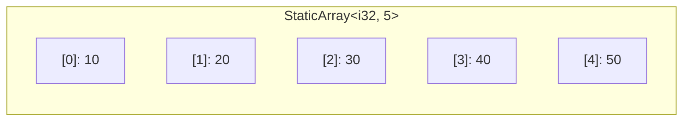

# Static Array — Rust Implementation

## Why Static Array?

### The Problem It Solves

Imagine you're writing a program to store the scores of a quiz with exactly 10 questions. You know at the time you write the code that there will always be 10 scores—no more, no less. Why should you pay for the overhead of a resizable container when your size is fixed?

Dynamic collections like `Vec` in Rust are powerful, but they come with costs:
- Extra bookkeeping (tracking capacity, length)
- Heap allocation (slower than stack)
- Potential reallocations when growing

A **static array** solves this by fixing the size at compile time. The compiler knows exactly how much memory is needed, so it can allocate the array on the stack (fast!) and verify size-related errors before your program even runs.

### Real-World Analogies

1. **A physical mailbox with slots**: An apartment building's mailbox unit has exactly 20 slots—one per apartment. You can't add a 21st slot without rebuilding the whole thing, but you also never waste space on slots that don't exist.

2. **A weekly pill organizer**: Those plastic containers with 7 compartments (Sun-Sat). The number of compartments is fixed when the product is manufactured. You put something in each slot, but you can't add an 8th day.

3. **A chessboard**: Always 8x8 squares. The game is designed around this fixed size—it's not a limitation, it's a feature.

### When to Use It

- **Use a static array when** the size is known at compile time and will never change
- **Use a static array when** you want stack allocation for performance
- **Use a static array when** you want the compiler to catch size mismatches as errors
- **Unlike `Vec`**, you don't pay for heap allocation or capacity tracking
- **Unlike slices**, you own the data and know its exact size at compile time

---

## Core Concept

### The Big Idea

A static array is a fixed-size, contiguous block of memory where all elements have the same type. The key insight in Rust is that **the size is part of the type**. `StaticArray<i32, 5>` and `StaticArray<i32, 10>` are completely different types—you cannot accidentally mix them.

This compile-time size guarantee is achieved through Rust's **const generics** feature, which lets you parameterize a type by a constant value (like a number), not just by other types.

### Visual Representation



This array holds exactly 5 integers. The elements live in contiguous memory locations—index 1 is right after index 0, index 2 right after index 1, and so on. This contiguity is why accessing any element by index is O(1): we can calculate exactly where it lives with simple arithmetic.

### Key Terminology

- **Const Generic**: A generic parameter that is a value (like `5`) instead of a type (like `i32`). Written as `const N: usize` in Rust.
- **Stack Allocation**: Memory that lives in the function's call stack. Automatically cleaned up when the function returns. Very fast to allocate.
- **Contiguous Memory**: Elements stored one after another with no gaps. Enables direct index calculation.
- **Bounds Checking**: Verifying that an index is within valid range before accessing memory.
- **Option<T>**: Rust's way of representing "a value that might not exist." `Some(x)` means the value exists, `None` means it doesn't.

---

## How It Works: Step-by-Step

### Operation 1: Creating a New Array (`new`)

**What it does**: Creates a new array where every element is initialized to its default value.

**Step-by-step walkthrough**:

Let's create a `StaticArray<i32, 4>`. Since `i32` defaults to `0`, we get:

Starting state:
```
(memory not yet allocated)
```

Step 1: Allocate space for 4 integers on the stack
```
[ _, _, _, _ ]  (uninitialized memory)
```

Step 2: Initialize each element to `i32::default()` (which is `0`)
```
[ 0, 0, 0, 0 ]
   |  |  |  |
   0  1  2  3   (indices)
```

**Why this approach?** We use `core::array::from_fn(|_| T::default())` which calls the `Default` trait for each position. This ensures every element starts in a valid, predictable state—no garbage values.

### Operation 2: Accessing Elements (`at` vs `[]`)

**What it does**: Retrieves the element at a given index.

Rust provides two ways to access elements, each with different safety guarantees:

**Method 1: `at(index)` — Safe access returning Option**

```
arr.at(2) on array [10, 20, 30, 40]
```

Step 1: Check if index 2 < array size (4)
```
2 < 4? Yes, proceed
```

Step 2: Return `Some(&30)` (a reference to the value)
```
Result: Some(&30)
```

What if we try `arr.at(10)`?

Step 1: Check if index 10 < array size (4)
```
10 < 4? No, return None
```

Step 2: Return `None`
```
Result: None
```

**Method 2: `arr[index]` — Direct access that panics on invalid index**

```
arr[2] on array [10, 20, 30, 40]
```

Step 1: Return reference to element at index 2
```
Result: &30 (directly, no wrapping)
```

What if we try `arr[10]`?
```
PANIC! "index out of bounds: the len is 4 but the index is 10"
```

**Why two methods?** The `at()` method forces you to handle the "doesn't exist" case—the compiler won't let you forget. The `[]` operator is convenient when you're certain the index is valid and a panic is appropriate for bugs.

### Operation 3: Modifying Elements (`at_mut` and `[]=`)

**What it does**: Changes the value at a specific index.

**Using `at_mut`**:

```rust
let mut arr: StaticArray<i32, 4> = StaticArray::new();
// arr = [0, 0, 0, 0]

if let Some(elem) = arr.at_mut(1) {
    *elem = 42;
}
// arr = [0, 42, 0, 0]
```

The `at_mut` returns `Option<&mut T>`—a mutable reference wrapped in Option. The `*elem = 42` dereferences the reference to modify the actual array element.

**Using index assignment**:

```rust
arr[2] = 100;
// arr = [0, 42, 100, 0]
```

Direct and concise, but will panic if the index is out of bounds.

### Operation 4: Filling All Elements (`fill`)

**What it does**: Sets every element in the array to the same value.

```
Before: [0, 42, 100, 0]
arr.fill(7)
After:  [7, 7, 7, 7]
```

Step 1: Clone the value for each position (requires `T: Clone`)
```
Position 0: clone 7, store it
Position 1: clone 7, store it
Position 2: clone 7, store it
Position 3: clone 7, store it
```

**Why clone?** Each array slot needs its own copy of the value. For simple types like integers, cloning is just a memory copy. For complex types like `String`, it performs a deep copy.

### Worked Example: Complete Sequence

Let's trace through a realistic sequence of operations on a `StaticArray<i32, 5>`:

```
Operation 1: let mut arr = StaticArray::new()
Array state: [0, 0, 0, 0, 0]
Explanation: All elements initialized to i32::default() = 0

Operation 2: arr[0] = 10
Array state: [10, 0, 0, 0, 0]
Explanation: Direct assignment at index 0

Operation 3: arr[2] = 30
Array state: [10, 0, 30, 0, 0]
Explanation: Direct assignment at index 2

Operation 4: *arr.at_mut(4).unwrap() = 50
Array state: [10, 0, 30, 0, 50]
Explanation: Safe mutation via at_mut, unwrap because we know index 4 is valid

Operation 5: let first = arr.front()
Result: Some(&10)
Array state: [10, 0, 30, 0, 50] (unchanged)
Explanation: front() returns Option<&T>, borrowing first element

Operation 6: let last = arr.back()
Result: Some(&50)
Array state: [10, 0, 30, 0, 50] (unchanged)
Explanation: back() returns Option<&T>, borrowing last element

Operation 7: let out_of_bounds = arr.at(10)
Result: None
Array state: [10, 0, 30, 0, 50] (unchanged)
Explanation: at() safely returns None for invalid indices

Operation 8: arr.fill(99)
Array state: [99, 99, 99, 99, 99]
Explanation: All elements replaced with 99
```

---

## From Concept to Code

### The Data Structure

Before looking at the code, let's think about what we need:

1. **Storage for elements**: We need an actual array to hold our data
2. **Size information**: We need to know how big the array is

In many languages, you'd store the size as a field. But in Rust with const generics, **the size is part of the type itself**—no runtime storage needed!

### Rust Implementation

```rust
#[derive(Debug)]
pub struct StaticArray<T, const N: usize> {
    data: [T; N],
}
```

**Line-by-line breakdown**:

- `#[derive(Debug)]`: Automatically implements the `Debug` trait, letting us print the array with `{:?}` formatting. Useful for debugging.

- `pub struct StaticArray<T, const N: usize>`: This declares a public struct with two generic parameters:
  - `T` — the type of elements (could be `i32`, `String`, anything)
  - `const N: usize` — a compile-time constant for the size. The `const` keyword indicates this is a value, not a type. `usize` is Rust's type for sizes and indices.

- `data: [T; N]`: The actual storage. `[T; N]` is Rust's built-in fixed-size array type. It holds exactly `N` elements of type `T`, stored inline (not behind a pointer).

**Understanding const generics**:

Think of `const N: usize` like a "template parameter that's a number." When you write `StaticArray<i32, 5>`, Rust essentially generates:

```rust
// What the compiler creates for StaticArray<i32, 5>
struct StaticArray_i32_5 {
    data: [i32; 5],
}
```

This means `StaticArray<i32, 5>` and `StaticArray<i32, 10>` are **completely different types**. You can't accidentally assign one to the other—the compiler catches it.

### Implementing `new()`

**The algorithm in plain English**:
1. Create an array of size N
2. Fill each position with the default value for type T
3. Wrap it in our struct and return

**The code**:

```rust
impl<T: Default, const N: usize> StaticArray<T, N> {
    pub fn new() -> Self {
        Self {
            data: core::array::from_fn(|_| T::default()),
        }
    }
}
```

**Understanding the tricky parts**:

- `impl<T: Default, const N: usize>`: This `impl` block only applies when `T` implements the `Default` trait. If your type doesn't have a default value (like a struct with no `Default` impl), you can't use `new()`. This is intentional—how would we initialize elements without a default?

- `core::array::from_fn(|_| T::default())`: This is a clever initialization trick.
  - `core::array::from_fn` creates an array by calling a function for each index
  - `|_| T::default()` is a closure that ignores the index (`_`) and returns the default value
  - This runs N times, creating N default-initialized elements

- Why `core::` instead of `std::`? The `core` crate is Rust's minimal standard library that works even without an operating system. Using `core` makes this code compatible with embedded systems (`no_std` environments).

### Implementing Safe Access (`at`)

**The algorithm in plain English**:
1. Ask the underlying slice if the index is valid
2. Return `Some(&element)` if valid, `None` if not

**The code**:

```rust
impl<T, const N: usize> StaticArray<T, N> {
    pub fn at(&self, index: usize) -> Option<&T> {
        self.data.get(index)
    }

    pub fn at_mut(&mut self, index: usize) -> Option<&mut T> {
        self.data.get_mut(index)
    }
}
```

**Understanding the tricky parts**:

- `impl<T, const N: usize>`: No trait bounds! This works for any `T`. We split this into a separate `impl` block specifically so these methods are available even for types without `Default` or `Clone`.

- `&self` vs `&mut self`:
  - `&self` means "I'm borrowing the struct to look at it" (read-only)
  - `&mut self` means "I'm borrowing the struct to modify it" (exclusive access)
  - The `at` method only reads, so it takes `&self`
  - The `at_mut` method returns a mutable reference, so it needs `&mut self`

- `Option<&T>` vs `Option<&mut T>`:
  - `&T` is a shared reference—you can look but not touch
  - `&mut T` is an exclusive reference—you can modify through it
  - Wrapping in `Option` handles the "index doesn't exist" case

- `self.data.get(index)`: Rust arrays (and slices) have a built-in `get` method that returns `Option<&T>`. We're delegating to it instead of reimplementing bounds checking.

### Implementing Index Operators

**The algorithm in plain English**:
1. Access the element directly using the underlying array's indexing
2. If out of bounds, panic (standard Rust behavior for `[]`)

**The code**:

```rust
impl<T, const N: usize> core::ops::Index<usize> for StaticArray<T, N> {
    type Output = T;
    fn index(&self, index: usize) -> &T {
        &self.data[index]
    }
}

impl<T, const N: usize> core::ops::IndexMut<usize> for StaticArray<T, N> {
    fn index_mut(&mut self, index: usize) -> &mut T {
        &mut self.data[index]
    }
}
```

**Understanding the tricky parts**:

- `impl ... Index<usize> for StaticArray`: This is implementing the `Index` trait, which is what enables `arr[i]` syntax. `<usize>` specifies that we index with `usize` values.

- `type Output = T`: Associated type saying "when you index into this, you get a `T`."

- `&self.data[index]` vs `&mut self.data[index]`: The `&` and `&mut` create references to the element at that index. If `index >= N`, this panics—that's the contract of the `[]` operator in Rust.

- Why implement both `Index` and `IndexMut`? `Index` enables `let x = arr[0]` (reading). `IndexMut` enables `arr[0] = x` (writing). They're separate because you might want read-only indexing for some types.

### Implementing Fill

**The code**:

```rust
impl<T: Clone, const N: usize> StaticArray<T, N> {
    pub fn fill(&mut self, value: T) {
        self.data.fill(value);
    }
}
```

**Understanding the tricky parts**:

- `T: Clone`: We need `Clone` because filling means putting a copy of `value` in each slot. For N slots, we need N copies.

- `self.data.fill(value)`: Rust's built-in array/slice has a `fill` method. No need to reinvent the wheel—we delegate to it.

### Implementing Iteration

**The code**:

```rust
impl<T, const N: usize> StaticArray<T, N> {
    pub fn iter(&self) -> core::slice::Iter<'_, T> {
        self.data.iter()
    }

    pub fn iter_mut(&mut self) -> core::slice::IterMut<'_, T> {
        self.data.iter_mut()
    }
}

impl<'a, T, const N: usize> IntoIterator for &'a StaticArray<T, N> {
    type Item = &'a T;
    type IntoIter = core::slice::Iter<'a, T>;
    fn into_iter(self) -> Self::IntoIter {
        self.data.iter()
    }
}
```

**Understanding the tricky parts**:

- `core::slice::Iter<'_, T>`: This is the standard iterator type for slices. The `'_` is a lifetime placeholder saying "the iterator borrows from self."

- `impl<'a, T, const N: usize> IntoIterator for &'a StaticArray`: This implements `IntoIterator` for **references to** our array, not the array itself. This enables `for x in &arr` syntax.

- Why `&'a StaticArray` and not `StaticArray`? Implementing `IntoIterator` for the owned type would consume (move) the array during iteration. For a stack-allocated fixed-size array, consuming it for iteration is usually not what you want. By only implementing for `&StaticArray`, we force iteration by reference.

- `type Item = &'a T`: Each iteration yields a reference to an element, not the element itself.

---

## Complexity Analysis

### Time Complexity

| Operation | Best | Average | Worst | Why |
|-----------|------|---------|-------|-----|
| `new()`   | O(N) | O(N)    | O(N)  | Must initialize all N elements to their default |
| `at(i)`   | O(1) | O(1)    | O(1)  | Direct index calculation: base_addr + i * sizeof(T) |
| `arr[i]`  | O(1) | O(1)    | O(1)  | Same direct calculation, but panics instead of returning Option |
| `front()` | O(1) | O(1)    | O(1)  | Just accesses index 0 |
| `back()`  | O(1) | O(1)    | O(1)  | Just accesses index N-1 |
| `fill(v)` | O(N) | O(N)    | O(N)  | Must clone and assign to all N positions |
| `size()`  | O(1) | O(1)    | O(1)  | Returns the const generic N—no computation needed |
| `iter()`  | O(1) | O(1)    | O(1)  | Creating an iterator is just setting up pointers |
| iteration | O(N) | O(N)    | O(N)  | Must visit each of N elements |

**Understanding the "Why" column**:

The beauty of arrays is that element access is always O(1). Here's why:

If an array starts at memory address `0x1000` and each element is 4 bytes:
- Element 0 is at `0x1000`
- Element 1 is at `0x1004`
- Element 2 is at `0x1008`
- Element i is at `0x1000 + i * 4`

This is just multiplication and addition—constant time, no matter how big the array.

### Space Complexity

- **Overall structure**: O(N) — We store exactly N elements, nothing more
- **Per operation**: O(1) — No operation allocates additional memory proportional to input
- **Stack vs Heap**: The entire array lives on the stack, which is faster to allocate but limited in size

### No Amortized Analysis Needed

Unlike dynamic arrays (like `Vec`), static arrays never resize. There's no reallocation, so no amortized analysis is needed. What you see is what you get.

---

## Common Mistakes & Pitfalls

### Mistake 1: Using `[]` When Index Might Be Invalid

```rust
// Wrong - will panic if user_input >= arr.size()
fn get_score(arr: &StaticArray<i32, 10>, user_input: usize) -> i32 {
    arr[user_input]  // PANIC if out of bounds!
}

// Right - handle the possibility of invalid index
fn get_score(arr: &StaticArray<i32, 10>, user_input: usize) -> Option<i32> {
    arr.at(user_input).copied()
}
```

**Why this matters**: Using `[]` with untrusted input (like user input or data from files) can crash your program. Use `at()` and handle the `None` case appropriately.

### Mistake 2: Forgetting That Size Is Part of the Type

```rust
// Wrong - these are different types!
fn process(arr: StaticArray<i32, 5>) { /* ... */ }

let small: StaticArray<i32, 3> = StaticArray::new();
process(small);  // COMPILE ERROR: expected StaticArray<i32, 5>, got StaticArray<i32, 3>
```

```rust
// Right - use generics if you need to handle different sizes
fn process<const N: usize>(arr: StaticArray<i32, N>) { /* ... */ }

let small: StaticArray<i32, 3> = StaticArray::new();
process(small);  // Works!
```

**Why this matters**: The compile-time size is a feature, not a bug. If you need functions that work with multiple sizes, make the size a generic parameter.

### Mistake 3: Forgetting Trait Bounds When Using `new()` or `fill()`

```rust
// Wrong - MyType doesn't implement Default
struct MyType { value: i32 }

let arr: StaticArray<MyType, 5> = StaticArray::new();
// COMPILE ERROR: the trait `Default` is not implemented for `MyType`
```

```rust
// Right - implement Default for your type
#[derive(Default)]
struct MyType { value: i32 }

let arr: StaticArray<MyType, 5> = StaticArray::new();  // Works!
```

**Why this matters**: `new()` needs to initialize elements somehow. Without `Default`, Rust doesn't know what value to put in each slot. Either derive `Default` or construct the struct differently.

### Mistake 4: Unwrapping Without Checking

```rust
// Wrong - blindly unwrapping
let element = arr.at(index).unwrap();  // Panics if None!
```

```rust
// Right - handle the None case
match arr.at(index) {
    Some(element) => println!("Found: {}", element),
    None => println!("Index {} is out of bounds", index),
}

// Or use if-let for simpler cases
if let Some(element) = arr.at(index) {
    println!("Found: {}", element);
}

// Or provide a default
let element = arr.at(index).unwrap_or(&0);
```

**Why this matters**: The whole point of `Option` is to force you to think about the failure case. Calling `.unwrap()` throws away that safety. Only use `unwrap()` when you're absolutely certain the value exists (and even then, consider `expect("reason")` for better error messages).

### Mistake 5: Trying to Resize

```rust
// Wrong - static arrays cannot change size
let mut arr: StaticArray<i32, 5> = StaticArray::new();
arr.push(10);  // COMPILE ERROR: no method named `push`
```

```rust
// Right - use Vec if you need dynamic sizing
let mut vec: Vec<i32> = Vec::new();
vec.push(10);  // Works!
```

**Why this matters**: The "static" in static array means the size is fixed forever. If you need to add or remove elements, use `Vec` instead. Choose static arrays only when the size is truly constant.

---

## Practice Problems

To solidify your understanding, try implementing:

1. **`swap(i, j)`**: Swap the elements at indices i and j. Return an error (or Option) if either index is invalid.

2. **`reverse()`**: Reverse the array in place. Can you do it without allocating extra memory?

3. **`find(predicate)`**: Return the index of the first element satisfying a predicate function. Return `Option<usize>`.

4. **`map<U, F>(f: F) -> StaticArray<U, N>`**: Create a new array where each element is transformed by function f. This is tricky because you need to handle the const generic properly!

5. **Implement `Clone` and `PartialEq`**: Make your static array cloneable and comparable. When are two static arrays equal?

---

## Summary

### Key Takeaways

- **Const generics make size part of the type**: `StaticArray<i32, 5>` and `StaticArray<i32, 10>` are incompatible types, catching size mismatches at compile time

- **Stack allocation = fast**: Unlike `Vec`, the entire array lives on the stack with no heap allocation or pointer indirection

- **Two access patterns for different needs**: Use `at()` returning `Option` when the index might be invalid; use `[]` when you're certain and want to panic on bugs

- **Trait bounds are precise**: `new()` requires `Default`, `fill()` requires `Clone`, but basic operations work with any type

- **Rust's `Option` replaces null**: Instead of null pointers or exceptions, invalid access returns `None`, forcing you to handle the error case

### Quick Reference

```
StaticArray<T, N> — Fixed-size array with compile-time size
├── new()        : O(N) — Create array with default elements (requires T: Default)
├── at(i)        : O(1) — Safe access returning Option<&T>
├── at_mut(i)    : O(1) — Safe mutable access returning Option<&mut T>
├── arr[i]       : O(1) — Direct access, panics if out of bounds
├── front()      : O(1) — First element as Option<&T>
├── back()       : O(1) — Last element as Option<&T>
├── fill(v)      : O(N) — Set all elements to v (requires T: Clone)
├── size()       : O(1) — Returns N (the const generic)
├── is_empty()   : O(1) — Returns true if N == 0
├── data()       : O(1) — Borrow as slice &[T]
└── iter()       : O(1) — Create iterator over &T

Best for: Fixed-size collections, stack allocation, compile-time size guarantees
Avoid when: Size unknown at compile time, need to add/remove elements, very large arrays (stack overflow risk)
```
