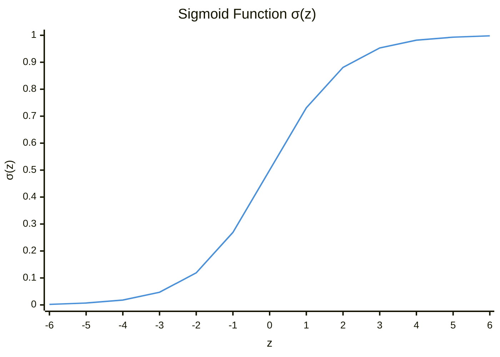
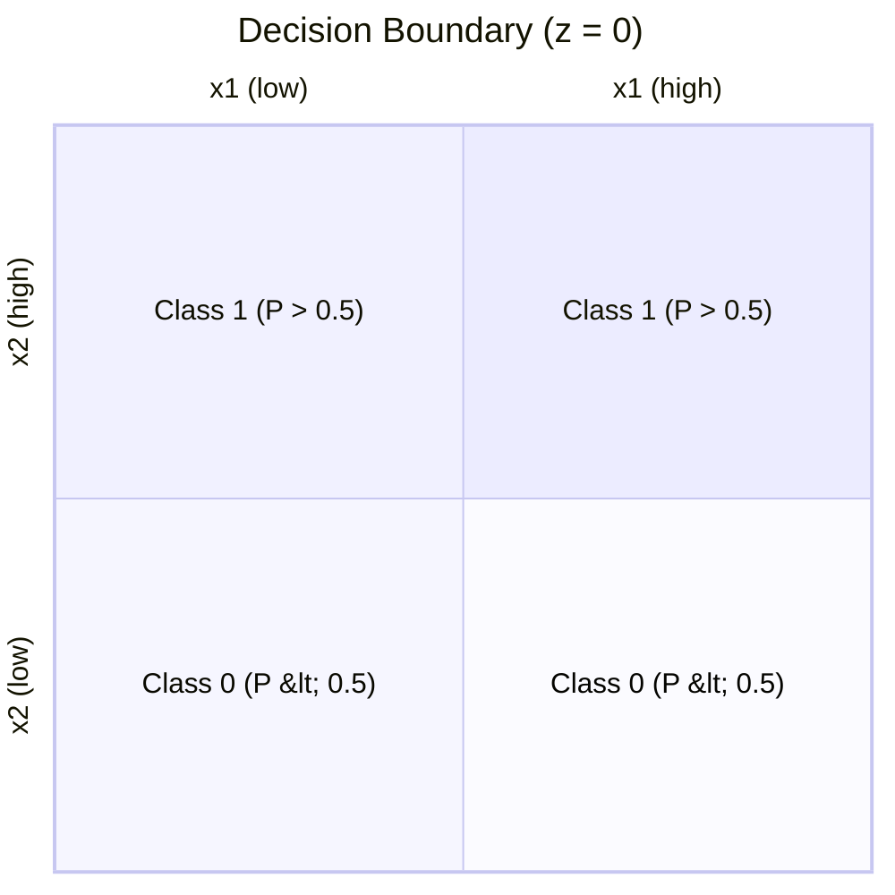
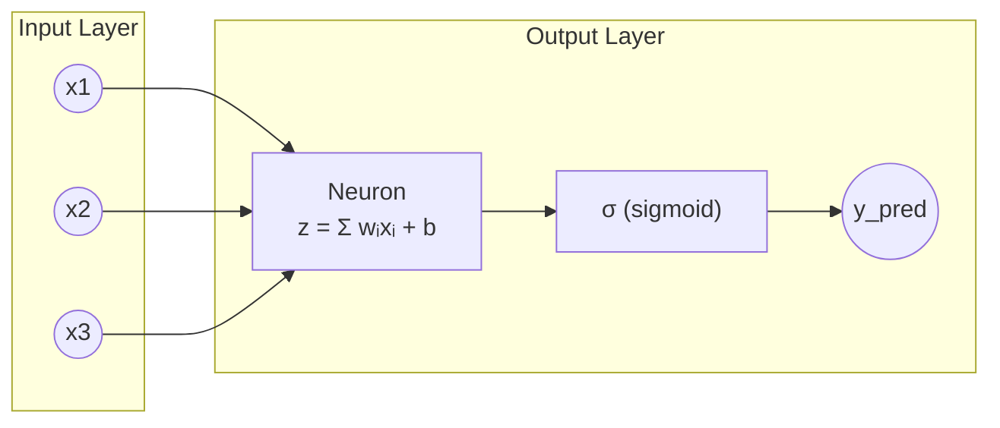
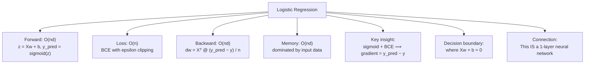
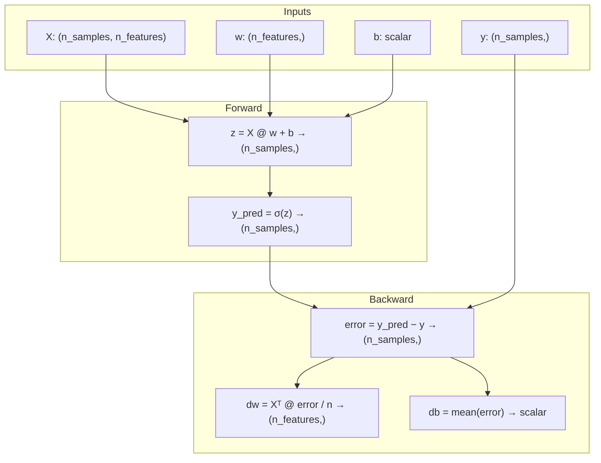

# Logistic Regression - Deep Dive

## The Intuition

### What Problem Are We Solving?

Imagine you are building a spam filter. For each email, you extract features like word counts, sender reputation, and link density. You need to output a decision: spam or not spam. Linear regression will not work here because it outputs any real number, but you need a probability between 0 and 1.

The fundamental problem: **How do we transform an unbounded linear output into a valid probability?**

Linear regression gives us:

$$
z = w_1 x_1 + w_2 x_2 + \cdots + b
$$

This $z$ can be $-1000$ or $+1000$. We need something that says "73% chance this is spam."

### The Key Insight

The sigmoid function is the mathematical bridge between the linear world and the probability world. It takes any real number and "squashes" it into the $(0, 1)$ range:

- Large positive numbers become close to 1
- Large negative numbers become close to 0
- Zero becomes exactly 0.5

This is not just convenient - it emerges naturally from the mathematics of log-odds (more on this later). The sigmoid gives us a principled way to interpret linear model outputs as probabilities.

### Real-World Analogy

Think of a thermostat. The temperature can vary wildly (like our linear output $z$), but the thermostat has a threshold where it flips from "heating off" to "heating on." The sigmoid is like a "soft" thermostat - instead of a hard flip, it gives a gradual transition. At 68F (threshold), there is a 50% chance the heating triggers. At 60F, maybe 95% chance. At 76F, maybe 5% chance.

The "steepness" of this transition is controlled by the weights. Large weights mean a sharp transition (confident classifier); small weights mean a gradual one (uncertain classifier).

---

## The Sigmoid Function

### Why This Specific Function?

The sigmoid is not arbitrary. It comes from modeling log-odds:

$$
\log\frac{P(y=1)}{P(y=0)} = z = Xw + b
$$

Solving for $P(y=1)$:

$$
\frac{P(y=1)}{P(y=0)} = e^z
$$

$$
\frac{P(y=1)}{1 - P(y=1)} = e^z
$$

$$
P(y=1) = e^z \cdot (1 - P(y=1))
$$

$$
P(y=1) = e^z - e^z \cdot P(y=1)
$$

$$
P(y=1) + e^z \cdot P(y=1) = e^z
$$

$$
P(y=1) \cdot (1 + e^z) = e^z
$$

$$
P(y=1) = \frac{e^z}{1 + e^z} = \frac{1}{1 + e^{-z}}
$$

This is the sigmoid. It is the unique function that converts log-odds to probability.

### Properties That Matter



Key properties:
- $\sigma(0) = 0.5$ (the decision point)
- $\sigma(-z) = 1 - \sigma(z)$ (symmetry)
- Range is strictly $(0, 1)$, never exactly 0 or 1
- Derivative: $\sigma(z) \cdot (1 - \sigma(z))$

### Numerical Stability

Here is the naive implementation:

```python
def sigmoid_naive(z):
    return 1.0 / (1.0 + np.exp(-z))
```

**Problem:** When $z = -1000$, we compute $e^{1000}$ which overflows to infinity. Then $\frac{1}{1 + \infty} = 0$, which is fine. But when $z = 1000$, we compute $e^{-1000}$ which underflows to 0. Then $\frac{1}{1 + 0} = 1$, also fine.

Wait, so what is the problem? The issue is intermediate overflow. On some systems, $e^{1000}$ causes a floating-point exception before we even get to divide.

**The stable solution** uses two equivalent formulas:

```python
def sigmoid(z):
    result = np.zeros_like(z, dtype=np.float64)
    pos_mask = z >= 0
    neg_mask = ~pos_mask

    # For z >= 0: use 1 / (1 + exp(-z))
    result[pos_mask] = 1.0 / (1.0 + np.exp(-z[pos_mask]))

    # For z < 0: use exp(z) / (1 + exp(z))
    exp_z = np.exp(z[neg_mask])
    result[neg_mask] = exp_z / (1.0 + exp_z)

    return result
```

Why does this work?

- For $z \geq 0$: $e^{-z}$ is small, no overflow
- For $z < 0$: $e^{z}$ is small, no overflow

Both formulas compute the same value, but each avoids overflow in its domain.

---

## Binary Cross-Entropy Loss

### Why Not Mean Squared Error?

You might ask: "Why not just use MSE like linear regression?"

```python
# Don't do this for classification!
loss_mse = np.mean((y - y_pred) ** 2)
```

Problems with MSE for classification:

1. **Non-convex optimization landscape:** The sigmoid + MSE combination creates a non-convex loss surface with many local minima.

2. **Vanishing gradients:** When sigmoid saturates (output near 0 or 1), its gradient is nearly zero. MSE gradient is $(\hat{y} - y) \cdot \sigma'(z)$. If $\sigma'(z) \approx 0$, learning stops.

3. **Wrong probabilistic interpretation:** MSE assumes Gaussian noise around predictions. Classification is fundamentally Bernoulli-distributed.

### Deriving BCE from Maximum Likelihood

What is the probability of observing our data given parameters $w$ and $b$?

For a single sample with true label $y$ and predicted probability $p$:
- If $y = 1$: probability of observing this $= p$
- If $y = 0$: probability of observing this $= 1 - p$

Combined: $P(y \mid x) = p^y \cdot (1 - p)^{(1-y)}$

For all samples (assuming independence):

$$
P(\text{all data}) = \prod_{i} p_i^{y_i} \cdot (1 - p_i)^{(1 - y_i)}
$$

Taking the log (for numerical stability and to turn products into sums):

$$
\log P = \sum_{i} \left[ y_i \log(p_i) + (1 - y_i) \log(1 - p_i) \right]
$$

We want to maximize this. Equivalently, minimize the negative:

$$
\mathcal{L} = -\frac{1}{n} \sum_{i} \left[ y_i \log(p_i) + (1 - y_i) \log(1 - p_i) \right]
$$

This is binary cross-entropy.

### The Numerical Stability Fix

What happens when $\hat{y}$ is exactly 0.0?

```python
y_true = [0, 1]
y_pred = [0.0, 0.0]  # Terrible predictions

# For y=0, p=0: (1-0) * log(1-0) = log(1) = 0  [fine]
# For y=1, p=0: 1 * log(0) = -infinity  [BAD]
```

Solution: Clip predictions away from 0 and 1:

```python
def binary_cross_entropy(y_true, y_pred, eps=1e-15):
    y_pred_clipped = np.clip(y_pred, eps, 1.0 - eps)
    n = y_true.shape[0]
    loss = -np.sum(
        y_true * np.log(y_pred_clipped) +
        (1.0 - y_true) * np.log(1.0 - y_pred_clipped)
    ) / n
    return loss
```

Why $10^{-15}$? It is small enough to not affect normal predictions but large enough to keep $\log()$ finite.

---

## The Gradient Derivation

This is where the magic happens. The gradient of BCE with respect to $z$ turns out to be remarkably simple.

### Setting Up the Chain Rule

We need $\frac{\partial \mathcal{L}}{\partial w}$. By chain rule:

$$
\frac{\partial \mathcal{L}}{\partial w} = \frac{\partial \mathcal{L}}{\partial \hat{y}} \cdot \frac{\partial \hat{y}}{\partial z} \cdot \frac{\partial z}{\partial w}
$$

Let us compute each piece.

### Step 1: $\frac{\partial \mathcal{L}}{\partial \hat{y}}$

Loss for one sample: $\mathcal{L} = -\left[ y \log(p) + (1 - y) \log(1 - p) \right]$

$$
\frac{\partial \mathcal{L}}{\partial p} = -\left[ \frac{y}{p} - \frac{1 - y}{1 - p} \right]
$$

### Step 2: $\frac{\partial \hat{y}}{\partial z}$ (Sigmoid Derivative)

$$
\frac{\partial \hat{y}}{\partial z} = \frac{d}{dz} \left[ \frac{1}{1 + e^{-z}} \right]
$$

Let $s = \sigma(z) = \frac{1}{1 + e^{-z}}$

Using quotient rule or chain rule:

$$
\frac{ds}{dz} = \frac{e^{-z}}{(1 + e^{-z})^2} = \frac{1}{1 + e^{-z}} \cdot \frac{e^{-z}}{1 + e^{-z}} = s \cdot (1 - s)
$$

So $\sigma'(z) = \sigma(z) \cdot (1 - \sigma(z))$.

At $z = 0$: $\sigma(0) = 0.5$, so derivative $= 0.5 \times 0.5 = 0.25$ (maximum).

### Step 3: $\frac{\partial z}{\partial w}$

$$
z = Xw + b
$$

$$
\frac{\partial z}{\partial w} = X
$$

### Step 4: The Magic Cancellation

Now multiply them together:

$$
\frac{\partial \mathcal{L}}{\partial z} = \frac{\partial \mathcal{L}}{\partial p} \cdot \frac{\partial p}{\partial z} = -\left[ \frac{y}{p} - \frac{1-y}{1-p} \right] \cdot p(1-p)
$$

Distribute:

$$
= -\left[ \frac{y}{p} \cdot p(1-p) - \frac{1-y}{1-p} \cdot p(1-p) \right]
$$

$$
= -\left[ y(1-p) - (1-y)p \right]
$$

$$
= -\left[ y - yp - p + yp \right]
$$

$$
= -\left[ y - p \right] = p - y = \hat{y} - y
$$

The complex derivatives cancel out to give us simply: $\hat{y} - y$

This is identical to linear regression's gradient. It is not a coincidence - BCE was designed to pair with sigmoid to produce this elegant result.

### Final Gradients

For the full batch:

$$
\frac{\partial \mathcal{L}}{\partial w} = \frac{1}{n} X^\top (\hat{y} - y)
$$

$$
\frac{\partial \mathcal{L}}{\partial b} = \frac{1}{n} \sum (\hat{y} - y) = \text{mean}(\hat{y} - y)
$$

Shapes:
- $X$: $(n_{\text{samples}}, n_{\text{features}})$
- $\hat{y} - y$: $(n_{\text{samples}},)$
- $\frac{\partial \mathcal{L}}{\partial w}$: $(n_{\text{features}},)$
- $\frac{\partial \mathcal{L}}{\partial b}$: scalar

---

## Worked Example

Let us trace through a complete forward and backward pass.

### Setup

$$
X = \begin{bmatrix} 1 & 2 \\ 3 & 4 \end{bmatrix}, \quad y = \begin{bmatrix} 0 \\ 1 \end{bmatrix}, \quad w = \begin{bmatrix} 0.1 \\ 0.2 \end{bmatrix}, \quad b = 0.0
$$

### Forward Pass

**Step 1: Compute $z$ (logits)**

$$
z_0 = 1 \cdot 0.1 + 2 \cdot 0.2 + 0 = 0.1 + 0.4 = 0.5
$$

$$
z_1 = 3 \cdot 0.1 + 4 \cdot 0.2 + 0 = 0.3 + 0.8 = 1.1
$$

$$
z = [0.5, \; 1.1]
$$

**Step 2: Apply sigmoid**

$$
\hat{y}_0 = \frac{1}{1 + e^{-0.5}} = \frac{1}{1 + 0.6065} = 0.6225
$$

$$
\hat{y}_1 = \frac{1}{1 + e^{-1.1}} = \frac{1}{1 + 0.3329} = 0.7503
$$

$$
\hat{y} = [0.6225, \; 0.7503]
$$

**Step 3: Compute loss**

$$
\mathcal{L} = -\frac{1}{2} \left[ 0 \cdot \log(0.6225) + 1 \cdot \log(1 - 0.6225) + 1 \cdot \log(0.7503) + 0 \cdot \log(1 - 0.7503) \right]
$$

$$
= -\frac{1}{2} \left[ 0 + \log(0.3775) + \log(0.7503) + 0 \right]
$$

$$
= -\frac{1}{2} \left[ -0.9741 + (-0.2873) \right]
$$

$$
= -\frac{1}{2} \cdot (-1.2614) = 0.6307
$$

### Backward Pass

**Step 1: Compute error**

$$
\text{error} = \hat{y} - y = [0.6225 - 0, \; 0.7503 - 1] = [0.6225, \; -0.2497]
$$

**Step 2: Compute gradients**

$$
\frac{\partial \mathcal{L}}{\partial w} = \frac{X^\top \cdot \text{error}}{n} = \frac{1}{2} \begin{bmatrix} 1 & 3 \\ 2 & 4 \end{bmatrix} \begin{bmatrix} 0.6225 \\ -0.2497 \end{bmatrix}
$$

$$
= \frac{1}{2} \begin{bmatrix} 1 \cdot 0.6225 + 3 \cdot (-0.2497) \\ 2 \cdot 0.6225 + 4 \cdot (-0.2497) \end{bmatrix} = \frac{1}{2} \begin{bmatrix} 0.6225 - 0.7491 \\ 1.2450 - 0.9988 \end{bmatrix} = \frac{1}{2} \begin{bmatrix} -0.1266 \\ 0.2462 \end{bmatrix} = \begin{bmatrix} -0.0633 \\ 0.1231 \end{bmatrix}
$$

$$
\frac{\partial \mathcal{L}}{\partial b} = \text{mean}(\text{error}) = \frac{0.6225 - 0.2497}{2} = 0.1864
$$

**Step 3: Update parameters (learning rate $= 0.1$)**

$$
w_{\text{new}} = w - 0.1 \cdot \frac{\partial \mathcal{L}}{\partial w} = \begin{bmatrix} 0.1 \\ 0.2 \end{bmatrix} - 0.1 \cdot \begin{bmatrix} -0.0633 \\ 0.1231 \end{bmatrix} = \begin{bmatrix} 0.1 + 0.00633 \\ 0.2 - 0.01231 \end{bmatrix} = \begin{bmatrix} 0.1063 \\ 0.1877 \end{bmatrix}
$$

$$
b_{\text{new}} = b - 0.1 \cdot \frac{\partial \mathcal{L}}{\partial b} = 0 - 0.1 \cdot 0.1864 = -0.0186
$$

Notice how $w_0$ increased (because the gradient was negative) and $w_1$ decreased. This makes sense: we are adjusting to better separate the classes.

---

## From Math to Code

### The Data Structures

The LogisticRegression class maintains:

```python
self.w          # Weight vector, shape (n_features,)
self.b          # Bias scalar, float
self.history    # List of loss values during training
```

Intermediate values during forward pass:

```python
z               # Logits, shape (n_samples,)
y_pred          # Probabilities, shape (n_samples,)
```

### Implementation Walkthrough

Here is the core training loop:

```python
def fit(self, X: np.ndarray, y: np.ndarray) -> "LogisticRegression":
    if X.ndim == 1:
        X = X.reshape(-1, 1)     # Handle 1D input
    if y.ndim == 2:
        y = y.ravel()            # Flatten (n,1) to (n,)

    n_samples, n_features = X.shape

    self.w = np.zeros(n_features)  # Initialize weights to zero
    self.b = 0.0
    self.history = []

    prev_loss = float("inf")

    for _ in range(self.n_iterations):
        # Forward pass
        z = X @ self.w + self.b      # (n,d) @ (d,) + () -> (n,)
        y_pred = sigmoid(z)          # (n,) -> (n,)

        # Compute and store loss
        loss = binary_cross_entropy(y, y_pred)
        self.history.append(loss)

        # Early stopping check
        if abs(prev_loss - loss) < self.tolerance:
            break
        prev_loss = loss

        # Backward pass
        dw, db = self._compute_gradients(X, y, y_pred)

        # Parameter update
        self.w = self.w - self.learning_rate * dw
        self.b = self.b - self.learning_rate * db

    return self
```

**Line-by-line:**

- `X @ self.w`: Matrix-vector multiplication. Shape $(n, d) \times (d,)$ gives $(n,)$. Each sample gets its own $z$ value.
- `sigmoid(z)`: Element-wise sigmoid. Each $z$ becomes a probability.
- `binary_cross_entropy(y, y_pred)`: Computes scalar loss, handles clipping internally.
- `self._compute_gradients`: Returns $\frac{\partial \mathcal{L}}{\partial w}$ of shape $(d,)$ and $\frac{\partial \mathcal{L}}{\partial b}$ as float.
- Update step: Move in the negative gradient direction.

### The Gradient Computation

```python
def _compute_gradients(
    self, X: np.ndarray, y: np.ndarray, y_pred: np.ndarray
) -> Tuple[np.ndarray, float]:
    n = X.shape[0]
    error = y_pred - y                  # (n,) - (n,) -> (n,)
    dw = X.T @ error / n                # (d,n) @ (n,) -> (d,), then normalize
    db = float(np.mean(error))          # mean of (n,) -> scalar
    return dw, db
```

The key insight: `X.T @ error` computes the dot product of each feature column with the error vector, giving us how much each feature contributed to the prediction error.

---

## The Decision Boundary

### What Is It?

The decision boundary is where $P(y=1 \mid x) = 0.5$. Since $\sigma(0) = 0.5$, this happens when $z = 0$:

$$
w_1 x_1 + w_2 x_2 + b = 0
$$

For 2D features, this is a line:

$$
x_2 = -\frac{w_1}{w_2} x_1 - \frac{b}{w_2}
$$

Slope $= -\frac{w_1}{w_2}$, Intercept $= -\frac{b}{w_2}$

### Visualization Concept



Points above the line have $z > 0$, so $\sigma(z) > 0.5$, predicted class 1.
Points below have $z < 0$, so $\sigma(z) < 0.5$, predicted class 0.

### Code for Decision Boundary

```python
def decision_boundary_params(self) -> Tuple[float, float]:
    if self.w is None:
        raise ValueError("Model has not been fitted. Call fit() first.")
    if len(self.w) != 2:
        raise ValueError("decision_boundary_params requires exactly 2 features")
    if abs(self.w[1]) < 1e-10:
        raise ValueError("w2 is too close to zero; decision boundary is vertical")

    slope = -self.w[0] / self.w[1]
    intercept = -self.b / self.w[1]
    return float(slope), float(intercept)
```

---

## Connection to Neural Networks

### Logistic Regression IS a Neural Network

Logistic regression is literally a single-layer neural network:



The neuron computes: $z = x_1 w_1 + x_2 w_2 + x_3 w_3 + b$, then applies sigmoid.

### The Building Block Pattern

Every layer in a neural network follows the same pattern:

$$
\text{Linear transformation: } z = Wx + b
$$

$$
\text{Nonlinear activation: } a = \text{activation}(z)
$$

Logistic regression is:
- Linear: $z = Wx + b$
- Activation: sigmoid

Hidden layers typically use ReLU instead of sigmoid, but the final layer for binary classification still uses sigmoid.

### Why Sigmoid Falls Out of Favor for Hidden Layers

The sigmoid has a problem called **vanishing gradients**:

$$
\sigma'(z) = \sigma(z) \cdot (1 - \sigma(z))
$$

When $z$ is large (positive or negative):
- $\sigma(z)$ is close to 0 or 1
- Therefore $\sigma'(z)$ is close to 0

During backpropagation through many layers, these small gradients multiply together and become vanishingly small, stopping learning.

ReLU solves this:

```python
relu(z) = max(0, z)
relu_derivative(z) = 1 if z > 0 else 0
```

The derivative is either 0 or 1, never tiny.

### Where Sigmoid Still Appears

1. **Binary classification output layer:** The last layer uses sigmoid to produce probabilities.

2. **Multi-label classification:** When you can have multiple labels simultaneously (not mutually exclusive), use sigmoid on each output independently.

3. **LSTM/GRU gates:** The forget gate, input gate, and output gate all use sigmoid because gates need to be in $[0, 1]$.

4. **Attention mechanisms:** Some attention variants use sigmoid gating.

---

## Complexity Analysis

### Time Complexity

| Operation | Complexity | Why |
|-----------|------------|-----|
| Forward ($z = Xw + b$) | $O(nd)$ | Matrix-vector multiplication |
| Sigmoid | $O(n)$ | Element-wise operation |
| Loss | $O(n)$ | Sum over samples |
| Gradients | $O(nd)$ | $X^\top \cdot \text{error}$ |
| Full iteration | $O(nd)$ | Dominated by matrix ops |
| Full training | $O(nd \cdot T)$ | Repeat for $T$ iterations |

### Space Complexity

| Component | Size | Why |
|-----------|------|-----|
| $X$ (input) | $O(nd)$ | Data matrix |
| $w$ (weights) | $O(d)$ | One per feature |
| $z$, $\hat{y}$ | $O(n)$ | Intermediate values |
| gradients | $O(d)$ | Same size as weights |
| history | $O(T)$ | Loss at each step |

Total: $O(nd)$ dominated by input data.

### The Bottleneck

For large datasets, the matrix multiplication $Xw$ is the bottleneck. This is compute-bound for dense data.

In production, this is optimized with:
- BLAS libraries (numpy uses these internally)
- GPU acceleration
- Mini-batch gradient descent (process subsets of data)

---

## Common Pitfalls

### Pitfall 1: Forgetting Numerical Stability in Sigmoid

**The mistake:**

```python
def sigmoid_naive(z):
    return 1.0 / (1.0 + np.exp(-z))

# Fails for z = -1000 due to exp(1000) overflow
sigmoid_naive(np.array([-1000]))  # May raise warning or return nan
```

**Why it is wrong:** $e^{1000}$ overflows to infinity on most systems.

**The fix:**

```python
def sigmoid(z):
    result = np.zeros_like(z, dtype=np.float64)
    pos_mask = z >= 0
    neg_mask = ~pos_mask
    result[pos_mask] = 1.0 / (1.0 + np.exp(-z[pos_mask]))
    exp_z = np.exp(z[neg_mask])
    result[neg_mask] = exp_z / (1.0 + exp_z)
    return result
```

### Pitfall 2: Not Clipping in BCE Loss

**The mistake:**

```python
def bce_unstable(y_true, y_pred):
    return -np.mean(y_true * np.log(y_pred) + (1-y_true) * np.log(1-y_pred))

# When y_pred = 0 and y_true = 1: log(0) = -inf
bce_unstable(np.array([1.0]), np.array([0.0]))  # Returns inf
```

**Why it is wrong:** Due to sigmoid saturation or numerical precision, $\hat{y}$ can become exactly 0 or 1.

**The fix:**

```python
def bce_stable(y_true, y_pred, eps=1e-15):
    y_pred_clipped = np.clip(y_pred, eps, 1.0 - eps)
    return -np.mean(y_true * np.log(y_pred_clipped) +
                    (1-y_true) * np.log(1-y_pred_clipped))
```

### Pitfall 3: Using MSE Instead of BCE

**The mistake:**

```python
# Training with MSE for classification
loss = np.mean((y - y_pred) ** 2)
gradient = 2 * (y_pred - y) * sigmoid_derivative(z)
```

**Why it is wrong:**
- Creates non-convex loss landscape
- Suffers from vanishing gradients when sigmoid saturates
- Wrong probabilistic model

**The fix:** Use BCE loss. The elegant gradient $(\hat{y} - y)$ comes from BCE + sigmoid working together.

### Pitfall 4: Learning Rate Too High

**The mistake:**

```python
model = LogisticRegression(learning_rate=100.0)
model.fit(X, y)
# Loss explodes: 0.6, 2.3, 15.7, 892.4, nan
```

**Why it is wrong:** Large steps overshoot the minimum and diverge.

**The fix:** Start with learning rate $= 0.01$ or $0.1$ and adjust based on loss history. If loss increases, reduce learning rate.

---

## Testing Your Understanding

### Quick Checks

1. **What would happen if we removed the $\frac{1}{n}$ normalization in the gradient?**

   The gradient magnitude would scale with batch size. Larger batches would take larger steps, making the learning rate effectively dataset-size-dependent.

2. **Why do we need to clip $\hat{y}$ in BCE but not in the gradient computation?**

   BCE uses $\log()$, which requires strictly positive inputs. The gradient formula $(\hat{y} - y)$ works fine with any values in $[0, 1]$.

3. **What is the output shape if input $X$ is $(100, 5)$?**

   - $z$: $(100,)$
   - $\hat{y}$: $(100,)$
   - $\frac{\partial \mathcal{L}}{\partial w}$: $(5,)$
   - $\frac{\partial \mathcal{L}}{\partial b}$: scalar

4. **Why does $\sigma(0) = 0.5$?**

   $\sigma(0) = \frac{1}{1 + e^0} = \frac{1}{1 + 1} = \frac{1}{2}$. This is the "neutral" point where we are maximally uncertain.

### Exercises

1. **Easy:** Modify `predict` to return probabilities for both classes as shape $(n, 2)$ where column 0 is $P(y=0)$ and column 1 is $P(y=1)$.

2. **Medium:** Implement L2 regularization. The loss becomes $\mathcal{L} + \lambda \|w\|^2$ and the gradient for $w$ becomes $\frac{\partial \mathcal{L}}{\partial w} + 2\lambda w$.

3. **Hard:** Implement mini-batch gradient descent. Instead of using all samples each iteration, randomly sample a batch of size $B$ and compute gradients on that subset.

---

## Summary

### Key Takeaways

- **Logistic regression transforms linear outputs into probabilities** using the sigmoid function, enabling binary classification.

- **The gradient simplifies to $(\hat{y} - y)$** due to the elegant cancellation between sigmoid derivative and BCE loss derivative. This is not coincidence - these functions were designed to work together.

- **Numerical stability matters.** Use the two-formula sigmoid and clip predictions before taking logs.

- **This is a single-layer neural network.** Understanding logistic regression deeply prepares you for multi-layer networks.

### Quick Reference



### Shape Cheat Sheet


