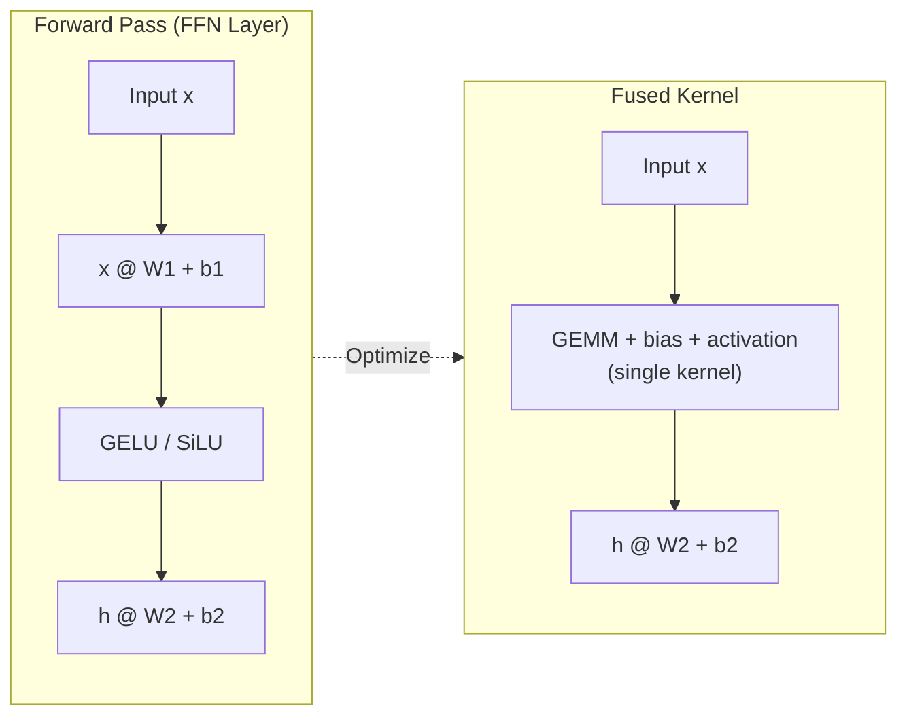

# Activation Functions

**Phase 2 · Topic 1** — The nonlinearities that make neural networks universal approximators, and the first ops you will fuse into CUDA kernels.

## What it is

Activation functions introduce nonlinearity into neural networks. Without them, stacking linear layers collapses into a single linear transformation: $W_2(W_1 x + b_1) + b_2 = W' x + b'$. No matter how many layers you stack, the network could only learn linear relationships. Activations break this linearity, enabling networks to approximate arbitrarily complex functions.

Each activation function has distinct properties that affect gradient flow during training and computational cost during inference. The choice of activation influences whether gradients vanish ($\sigma$ and $\tanh$ saturate for large inputs), whether neurons can "die" ($\text{ReLU}$ with persistently negative inputs), and how smooth the optimization landscape is ($\text{GELU}$ and $\text{SiLU}$ provide smooth, non-monotonic transitions that $\text{ReLU}$ lacks).

Modern transformers have converged on specific activations: $\text{GELU}$ in the GPT and BERT families, $\text{SiLU}$ (Swish) in LLaMA, Mistral, and Gemma. Understanding both the forward pass AND the backward pass (derivative) is essential -- these are among the first operations you will fuse into CUDA kernels, where computing the gradient inline with the matmul eliminates memory round-trips and yields significant speedups. This topic is placed before the MLP topic so that the MLP implementation can import these activations directly.

## The math

### ReLU (Rectified Linear Unit)

The simplest modern activation. Zeroes out negative values, passes positive values unchanged.

**Forward:**

$$\text{ReLU}(x) = \max(0, x)$$

**Backward:**

$$\text{ReLU}'(x) = \begin{cases} 1 & \text{if } x > 0 \\ 0 & \text{if } x \leq 0 \end{cases}$$

**At $x = 0$:** The derivative is technically undefined. Convention is to use 0 (subgradient).

**The dying ReLU problem:** If a neuron's pre-activation input is always negative (e.g., due to a large negative bias or unlucky weight initialization), the gradient is always 0. The neuron stops learning entirely -- it is "dead." In a deep network with aggressive learning rates, a significant fraction of neurons can die during training, permanently reducing the network's capacity. This is a real problem in practice and motivated the development of Leaky ReLU, GELU, and SiLU.

---

### Leaky ReLU

A simple fix for dying ReLU: instead of zeroing out negative values, scale them by a small constant $\alpha$ (typically 0.01).

**Forward:**

$$\text{LeakyReLU}(x) = \begin{cases} x & \text{if } x > 0 \\ \alpha x & \text{if } x \leq 0 \end{cases}$$

Or equivalently:

$$\text{LeakyReLU}(x) = \max(\alpha x, x)$$

**Backward:**

$$\text{LeakyReLU}'(x) = \begin{cases} 1 & \text{if } x > 0 \\ \alpha & \text{if } x \leq 0 \end{cases}$$

**Why it fixes dying ReLU:** Negative inputs now produce a small but non-zero gradient ($\alpha$), so neurons can always recover. In practice, Leaky ReLU works well but has been largely superseded by GELU and SiLU in transformer architectures because the smooth non-monotonic shape of those activations provides better optimization landscapes.

**Default $\alpha$:** Use $\alpha = 0.01$ as the default. The constructor should accept a configurable negative slope.

---

### Sigmoid

Maps any real number to $(0, 1)$. Already implemented in logistic regression, included here for completeness and because it is a building block for SiLU.

**Forward:**

$$\sigma(x) = \frac{1}{1 + e^{-x}}$$

**Backward:**

$$\sigma'(x) = \sigma(x) \cdot (1 - \sigma(x))$$

**Step by step for backward:**
1. Let $s = \sigma(x)$ (cache this from forward pass)
2. Derivative is simply $s \cdot (1 - s)$

**Numerical stability:** For large negative $x$, $e^{-x}$ overflows. Compute as:

$$\sigma(x) = \begin{cases} \frac{1}{1 + e^{-x}} & \text{if } x \geq 0 \\ \frac{e^x}{1 + e^x} & \text{if } x < 0 \end{cases}$$

**Vanishing gradient:** When $|x|$ is large, $\sigma(x)$ saturates near 0 or 1, and the gradient $s(1-s)$ approaches 0. This makes sigmoid a poor choice for hidden layers in deep networks.

---

### Tanh (Hyperbolic Tangent)

Maps to $(-1, 1)$. Zero-centered unlike sigmoid, which gives it better gradient properties for hidden layers.

**Forward:**

$$\tanh(x) = \frac{e^x - e^{-x}}{e^x + e^{-x}} = 2\sigma(2x) - 1$$

**Backward:**

$$\tanh'(x) = 1 - \tanh^2(x)$$

**Step by step for backward:**
1. Let $t = \tanh(x)$ (cache from forward)
2. Derivative is $1 - t^2$

**Numerical stability:** Use `np.tanh()` which handles large values correctly internally.

**Still used today:** Tanh appears in the relationship $\tanh(x) = 2\sigma(2x) - 1$, and more importantly it is a core component of the GELU tanh approximation. It also appears in some normalization and gating mechanisms.

---

### GELU (Gaussian Error Linear Unit)

The activation in GPT-2, GPT-3, BERT, and most encoder-based transformers. It smoothly gates the input based on how likely it is to be positive under a standard Gaussian distribution.

**Exact definition:**

$$\text{GELU}(x) = x \cdot \Phi(x)$$

where $\Phi(x)$ is the CDF of the standard normal distribution:

$$\Phi(x) = \frac{1}{2}\left(1 + \text{erf}\left(\frac{x}{\sqrt{2}}\right)\right)$$

**Intuition:** GELU can be interpreted as a smooth, probabilistic version of ReLU. Where ReLU makes a hard binary decision (pass or block), GELU weights the input by the probability that a Gaussian random variable would be less than $x$. For large positive $x$, $\Phi(x) \approx 1$ so GELU $\approx x$. For large negative $x$, $\Phi(x) \approx 0$ so GELU $\approx 0$. The transition is smooth and non-monotonic -- GELU has a small negative dip around $x \approx -0.17$ before rising, which creates a richer optimization landscape than ReLU.

**Tanh approximation (commonly used in practice):**

$$\text{GELU}(x) \approx \frac{1}{2} x \left(1 + \tanh\left(\sqrt{\frac{2}{\pi}} (x + 0.044715 x^3)\right)\right)$$

Let $c = \sqrt{\frac{2}{\pi}} \approx 0.7978845608$.

**Backward for tanh approximation:**

Let:
- $\text{inner} = c \cdot (x + 0.044715 x^3)$
- $t = \tanh(\text{inner})$

Then:

$$\text{GELU}(x) = \frac{1}{2} x (1 + t)$$

$$\text{GELU}'(x) = \frac{1}{2}(1 + t) + \frac{1}{2} x (1 - t^2) \cdot c \cdot (1 + 3 \cdot 0.044715 \cdot x^2)$$

**Step by step for backward:**
1. Compute $\text{inner} = \sqrt{\frac{2}{\pi}} (x + 0.044715 x^3)$
2. Compute $t = \tanh(\text{inner})$ (cache this)
3. Compute $\text{sech}^2 = 1 - t^2$
4. Compute $\frac{d(\text{inner})}{dx} = \sqrt{\frac{2}{\pi}} (1 + 0.134145 x^2)$
5. Return $\frac{1}{2}(1 + t) + \frac{1}{2} x \cdot \text{sech}^2 \cdot \frac{d(\text{inner})}{dx}$

**Exact GELU backward (using erf):**

$$\text{GELU}'(x) = \Phi(x) + x \cdot \phi(x)$$

where $\phi(x)$ is the PDF of the standard normal:

$$\phi(x) = \frac{1}{\sqrt{2\pi}} e^{-x^2/2}$$

---

### SiLU / Swish (Sigmoid Linear Unit)

The activation in LLaMA, Mistral, Gemma, and most modern decoder-only LLMs. Self-gating: the input gates itself through sigmoid.

**Forward:**

$$\text{SiLU}(x) = x \cdot \sigma(x)$$

**Backward:**

$$\text{SiLU}'(x) = \sigma(x) + x \cdot \sigma(x) \cdot (1 - \sigma(x)) = \sigma(x) \cdot (1 + x \cdot (1 - \sigma(x)))$$

Equivalently:

$$\text{SiLU}'(x) = \text{SiLU}(x) + \sigma(x) \cdot (1 - \text{SiLU}(x))$$

**Step by step for backward:**
1. Let $s = \sigma(x)$ (cache from forward)
2. Derivative is $s + x \cdot s \cdot (1 - s)$ or equivalently $s \cdot (1 + x - x \cdot s)$

**Numerical stability:** Use the stable sigmoid formula from above.

**Intuition:** Like GELU, SiLU is smooth, non-monotonic, and unbounded above. It has a negative trough around $x \approx -1.28$ with minimum value $\approx -0.278$. The self-gating property means the activation adaptively scales its input based on the input's own magnitude -- large positive values pass through nearly unchanged, while negative values are suppressed (but not zeroed out like ReLU).

---

## Why GELU and SiLU dominate modern LLMs

Both GELU and SiLU share properties that make them superior to ReLU for training deep transformers:

1. **Smoothness ($C^\infty$):** Both are infinitely differentiable everywhere. ReLU has a discontinuous derivative at $x = 0$, creating a non-smooth optimization landscape. Smooth activations lead to smoother loss surfaces, which helps optimizers like Adam navigate the high-dimensional parameter space of billion-parameter models.

2. **Non-monotonicity:** Both have a small negative region (GELU dips to $\approx -0.17$, SiLU dips to $\approx -0.278$). This means the activation can produce negative outputs for slightly negative inputs, which provides a form of implicit regularization and allows richer gradient signals than ReLU's hard cutoff.

3. **No dying neurons:** Since neither GELU nor SiLU has a zero-gradient region for finite inputs, every neuron always receives gradient signal. This eliminates the dying ReLU problem entirely.

4. **Self-gating:** Both can be interpreted as "input times a gate." For GELU, the gate is $\Phi(x)$. For SiLU, the gate is $\sigma(x)$. This gating mechanism allows the network to learn which signals to amplify and which to suppress, without an explicit gating parameter.

The choice between GELU and SiLU is largely empirical. GELU was adopted first (BERT, GPT-2/3) and remains standard in encoder models. SiLU has become the default for decoder-only models (LLaMA, Mistral, Gemma) where it consistently shows slight improvements in training dynamics.

## Tensor shapes

All activations are element-wise operations:

- Input: $x \in \mathbb{R}^{n \times \cdots \times d}$ (any shape -- batch, sequence, features, etc.)
- Output: same shape as input
- Gradient: same shape as input

For a transformer FFN hidden layer with $x \in \mathbb{R}^{B \times L \times H}$ (batch, seq_len, hidden_dim):
- Forward: apply activation element-wise, output is $(B, L, H)$
- Backward: multiply incoming gradient element-wise with local derivative, output is $(B, L, H)$

## Why it matters for inference

### Kernel fusion -- the primary optimization

Activations are **element-wise** and **memory-bandwidth-bound**. Each activation alone requires:
1. Read input tensor from global memory
2. Compute (trivially cheap -- a few FLOPs per element)
3. Write output tensor to global memory

The compute-to-memory ratio is terrible: you move bytes to do almost no math. This makes activations prime targets for **kernel fusion**. In a transformer FFN:

```
Unfused (3 separate kernels, 3 memory round-trips):
  h = x @ W1 + b1        # GEMM + bias  (read x, W1 -> write h)
  h = gelu(h)            # activation   (read h -> write h)
  out = h @ W2 + b2      # GEMM + bias  (read h, W2 -> write out)

Fused (activation folded into GEMM epilogue, 2 round-trips):
  h = fused_gemm_bias_gelu(x, W1, b1)  # Single kernel: matmul + bias + activation
  out = h @ W2 + b2
```

cuBLAS provides `cublasLtMatmul` with epilogue fusion for exactly this pattern. Triton lets you write custom fused kernels trivially. Understanding the activation's forward and backward formulas is prerequisite to writing these fused kernels.

### Why you must understand the naive version first

Before you can fuse an activation into a GEMM epilogue, you need to know:
- The exact formula to inline (forward pass)
- The derivative formula to inline (backward pass for training kernels)
- The numerical stability requirements (where does overflow/underflow happen?)
- What intermediate values to cache vs. recompute (memory/compute tradeoff)

This is why we implement each activation from scratch in NumPy before ever touching CUDA.

### GELU vs SiLU in production models

| Model Family | Activation | FFN Structure |
|-------------|------------|---------------|
| GPT-2, GPT-3, BERT | $\text{GELU}$ | Standard FFN: $\text{GELU}(xW_1 + b_1)W_2 + b_2$ |
| LLaMA, Mistral, Gemma | $\text{SiLU}$ | Gated FFN (SwiGLU): $(\text{SiLU}(xW_1) \odot xW_3)W_2$ |

Note that LLaMA-family models use SiLU in a **gated** configuration (SwiGLU) where two parallel linear projections are computed, one is passed through SiLU, and the results are multiplied element-wise. This means the activation is fused differently -- the SiLU and the element-wise multiply are combined into one kernel.

### Backward pass efficiency

Understanding the backward pass matters because:
1. **Training kernels** must compute both forward and backward
2. **Memory reuse:** The backward pass reuses intermediate values from forward -- cache $\sigma(x)$ for SiLU, cache $\tanh(\text{inner})$ for GELU. This avoids recomputing expensive transcendentals.
3. **Gradient checkpointing:** Knowing which values to cache vs. recompute affects the memory/compute tradeoff in training. If you discard cached values to save memory, you must know the full recomputation cost.

### Numerical stability is non-negotiable

Overflow and underflow in activations propagate through the entire network:
- Sigmoid with large negative input: $e^{-x}$ overflows to inf
- GELU and SiLU inherit sigmoid's stability issues (both use sigmoid or erf internally)
- Naive tanh with large input: $e^x - e^{-x}$ can overflow

Always use the numerically stable formulations. When you write CUDA kernels, you must handle this explicitly -- there is no safety net.



## What to implement

Implement each activation as a class with a consistent interface:

- [ ] `Activation` base class (abstract) with `forward(x)` and `backward(grad_output)` methods
  - `forward(x)` computes the activation and caches values needed for backward
  - `backward(grad_output)` computes $\frac{\partial \mathcal{L}}{\partial x} = \text{grad\_output} \odot f'(x)$ using cached values
- [ ] `ReLU` class
  - Forward: element-wise max with 0
  - Backward: pass gradient where input was positive, zero elsewhere
  - Handle the $x = 0$ edge case explicitly (gradient = 0 by convention)
- [ ] `LeakyReLU` class
  - Constructor accepts `alpha` parameter (default 0.01)
  - Forward: $\max(\alpha x, x)$
  - Backward: gradient is 1 where input > 0, $\alpha$ elsewhere
- [ ] `Sigmoid` class
  - Forward: numerically stable sigmoid (branch on sign of $x$)
  - Backward: use cached sigmoid output $s \cdot (1 - s)$
- [ ] `Tanh` class
  - Forward: use `np.tanh` for stability
  - Backward: use cached tanh output $1 - t^2$
- [ ] `GELU` class
  - Forward: tanh approximation (default) and exact (erf-based) modes
  - Backward: derivative of whichever mode was used in forward
  - Constructor accepts `approximate: bool = True` to switch between modes
- [ ] `SiLU` class (alias: `Swish`)
  - Forward: $x \cdot \text{stable\_sigmoid}(x)$
  - Backward: use cached sigmoid value $s \cdot (1 + x \cdot (1 - s))$
- [ ] Gradient checking utility function
  - Numerical gradient via central finite differences: $\frac{f(x+h) - f(x-h)}{2h}$
  - Compare with analytical backward
  - Report max absolute error and max relative error

## Test cases to cover

### Basic correctness

- [ ] **Known input/output pairs for each activation:**
  - $\text{ReLU}$: $f([-2, -1, 0, 1, 2]) = [0, 0, 0, 1, 2]$
  - $\text{LeakyReLU}$: $f([-2, -1, 0, 1, 2]) = [-0.02, -0.01, 0, 1, 2]$ with $\alpha = 0.01$
  - $\sigma$: $f(0) = 0.5$, $f(\text{large}) \to 1$, $f(-\text{large}) \to 0$
  - $\tanh$: $f(0) = 0$, bounded in $(-1, 1)$
  - $\text{GELU}$: $f(0) = 0$, $f(-\infty) = 0$, $f(\infty) = \infty$, smooth transition near zero
  - $\text{SiLU}$: $f(0) = 0$, $f(-\infty) = 0$, $f(\infty) = \infty$

### Gradient checking (critical)

- [ ] **Numerical vs analytical gradient comparison for each activation:**
  - Use $h = 10^{-5}$ for finite differences
  - Test at multiple points: negative, zero, positive, large magnitude
  - Assert relative error $< 10^{-5}$ for smooth activations (sigmoid, tanh, GELU, SiLU)
  - For ReLU and Leaky ReLU at $x = 0$: accept that numerical and analytical may differ (subgradient)

### Edge cases

- [ ] **ReLU at exactly zero:** verify gradient is 0 (convention)
- [ ] **Leaky ReLU at exactly zero:** verify gradient is $\alpha$
- [ ] **Sigmoid at extreme values:** $x = 100$ should give $\approx 1.0$, not inf; $x = -100$ should give $\approx 0.0$, not nan
- [ ] **Empty tensor:** $f(\text{np.array([])}$) should return empty array, not error
- [ ] **Single element:** $f(\text{np.array([0.5])})$ works correctly
- [ ] **High-dimensional tensors:** shape $(2, 3, 4, 5)$ works element-wise, output shape matches input shape

### Numerical stability

- [ ] **Sigmoid stability:** $\sigma(1000) = 1.0$ (not inf), $\sigma(-1000) = 0.0$ (not nan)
- [ ] **GELU with large input:** $\text{GELU}(100) \approx 100$, not nan/inf
- [ ] **SiLU with large input:** $\text{SiLU}(100) \approx 100$, not nan/inf
- [ ] **Tanh saturation:** $\tanh(100) = 1.0$, $\tanh(-100) = -1.0$
- [ ] **No NaN or Inf in any activation output** for inputs in $[-1000, 1000]$

### GELU approximation accuracy

- [ ] **Compare tanh approximation to exact (erf) GELU:**
  - Max absolute error should be $< 0.005$ for $x \in [-10, 10]$
  - Both modes should produce identical results at $x = 0$ (exactly 0)

### Backward pass caching

- [ ] **Verify cached values are used:**
  - After `forward(x)`, calling `backward(grad)` should not recompute $\sigma$ or $\tanh$
  - Test that modifying input array after forward does not affect backward (cache should be independent)
- [ ] **Calling backward without forward raises an error**

### Shape preservation

- [ ] **Output shape equals input shape** for all activations
- [ ] **Gradient shape equals input shape** for all activations
- [ ] **Batch dimension handling:** $(32, 784)$, $(16, 128, 512)$, $(2, 8, 64, 128)$ all work

### Leaky ReLU specific

- [ ] **Custom alpha:** $\text{LeakyReLU}(\alpha=0.2)([-1, 0, 1]) = [-0.2, 0, 1]$
- [ ] **Alpha = 0 reduces to ReLU:** verify outputs match ReLU for $\alpha = 0$
- [ ] **Alpha = 1 becomes identity:** verify $f(x) = x$ for $\alpha = 1$

### Gradient flow analysis (optional but valuable)

- [ ] **Vanishing gradient demonstration:**
  - Show sigmoid gradient magnitude shrinks as $|x|$ grows
  - Compare gradient distributions: ReLU (sparse zeros), Leaky ReLU (no zeros), GELU/SiLU (smooth)
- [ ] **Dying ReLU demonstration:**
  - Show that when input is persistently negative, ReLU gradient is identically 0
  - Show that Leaky ReLU, GELU, and SiLU maintain non-zero gradients for the same input

## Reference implementations to validate against

Your GELU output should match:
```python
# PyTorch reference (for validation only, not in implementation)
import torch
torch.nn.functional.gelu(x, approximate='tanh')  # tanh approximation
torch.nn.functional.gelu(x, approximate='none')  # exact
```

Your SiLU output should match:
```python
torch.nn.functional.silu(x)
```

Your Leaky ReLU output should match:
```python
torch.nn.functional.leaky_relu(x, negative_slope=0.01)
```

Validate against these during development, then remove the PyTorch dependency.
