# Multilayer Perceptron

**Phase 2 · Topic 2** — The core of all deep learning: forward pass, backpropagation via chain rule, and the computational graph. Transformers are fancy MLPs with attention.

## What it is

A multilayer perceptron (MLP) is a feedforward neural network with one or more hidden layers between input and output. Each layer performs a linear transformation followed by a nonlinear activation function. The power of MLPs comes from stacking these nonlinear transformations: the universal approximation theorem proves that a single hidden layer with enough neurons can approximate any continuous function to arbitrary precision. Without activations, stacking layers collapses to a single linear transformation ($W_2(W_1 x + b_1) + b_2 = W'x + b'$), which is why the activations module we already built is prerequisite.

Training an MLP requires backpropagation -- systematic application of the chain rule to compute gradients through the entire computational graph. You compute the forward pass (input to output), measure the loss, then propagate error signals backward layer by layer to determine how each weight contributed to the error. This forward-backward pattern is THE pattern for all of deep learning. Every framework (PyTorch autograd, JAX's autodiff, TensorFlow's GradientTape) is an automated version of what we implement here by hand.

Understanding MLPs deeply is non-negotiable for transformer work. The FFN block in every transformer layer is literally a two-layer MLP. In GPT-2/3, the FFN hidden dimension is 4x the model dimension. In LLaMA, it is ~2.7x with SiLU activation and a gated structure (SwiGLU). This FFN is where roughly two-thirds of the FLOPs in a transformer live. When you later optimize transformer inference, you will be fusing these exact linear-activation-linear patterns into CUDA kernels. The matrix multiplications here are identical to attention projections -- same GEMM operations, same memory access patterns, same optimization targets.

## The math

### Network architecture

For a network with $L$ layers:
- Layer 0: input $x$ with shape $(\text{batch\_size}, n_\text{features})$
- Layers 1 to $L-1$: hidden layers
- Layer $L$: output layer

**Notation:**
- $a^{(0)} = x$ -- the input (activations at "layer 0")
- $z^{(l)}$ -- pre-activation at layer $l$ (linear output before activation)
- $a^{(l)}$ -- post-activation at layer $l$ (output of activation function)
- $W^{(l)} \in \mathbb{R}^{n_l \times n_{l-1}}$ -- weight matrix for layer $l$ ($n_l$ outputs, $n_{l-1}$ inputs)
- $b^{(l)} \in \mathbb{R}^{n_l}$ -- bias vector for layer $l$
- $f^{(l)}$ -- activation function at layer $l$ (imported from activations module)

```mermaid
flowchart LR
    X["x<br/>(batch, 784)"] --> Z1["z&#185; = xW&#185;&#7488; + b&#185;<br/>(batch, 256)"]
    Z1 --> A1["a&#185; = ReLU(z&#185;)<br/>(batch, 256)"]
    A1 --> Z2["z&#178; = a&#185;W&#178;&#7488; + b&#178;<br/>(batch, 128)"]
    Z2 --> A2["a&#178; = ReLU(z&#178;)<br/>(batch, 128)"]
    A2 --> Z3["z&#179; = a&#178;W&#179;&#7488; + b&#179;<br/>(batch, 10)"]
    Z3 --> A3["a&#179; = softmax(z&#179;)<br/>(batch, 10)"]
    A3 --> Loss["L = -sum(y log a&#179;)"]
```

### Forward pass

For each layer $l$ from 1 to $L$:

$$z^{(l)} = a^{(l-1)} W^{(l)\top} + b^{(l)}$$

$$a^{(l)} = f^{(l)}(z^{(l)})$$

Where $z^{(l)} \in \mathbb{R}^{\text{batch} \times n_l}$ and $a^{(l)} \in \mathbb{R}^{\text{batch} \times n_l}$.

**Shape walkthrough (2-hidden-layer network, 10-class classification):**

| Step | Operation | Shape |
|------|-----------|-------|
| Input | $x = a^{(0)}$ | $(\text{batch}, 784)$ |
| Layer 1 linear | $z^{(1)} = a^{(0)} W^{(1)\top} + b^{(1)}$ | $(\text{batch}, 784) \times (784, 256) = (\text{batch}, 256)$ |
| Layer 1 activation | $a^{(1)} = \text{ReLU}(z^{(1)})$ | $(\text{batch}, 256)$ |
| Layer 2 linear | $z^{(2)} = a^{(1)} W^{(2)\top} + b^{(2)}$ | $(\text{batch}, 256) \times (256, 128) = (\text{batch}, 128)$ |
| Layer 2 activation | $a^{(2)} = \text{ReLU}(z^{(2)})$ | $(\text{batch}, 128)$ |
| Output linear | $z^{(3)} = a^{(2)} W^{(3)\top} + b^{(3)}$ | $(\text{batch}, 128) \times (128, 10) = (\text{batch}, 10)$ |
| Output activation | $a^{(3)} = \text{softmax}(z^{(3)})$ | $(\text{batch}, 10)$ |

**Critical: Cache everything.** During the forward pass, store every $z^{(l)}$ and $a^{(l)}$ because backpropagation needs them all. This is why training uses far more memory than inference -- inference only needs the current layer's activations.

### Loss functions

**Cross-entropy loss (classification):**

For one-hot encoded labels $Y \in \mathbb{R}^{n \times K}$ and softmax output $a^{(L)} \in \mathbb{R}^{n \times K}$:

$$\mathcal{L}_\text{CE} = -\frac{1}{n} \sum_{i=1}^{n} \sum_{k=1}^{K} Y_{ik} \log(a^{(L)}_{ik})$$

Since $Y$ is one-hot, only one term per sample survives: $\mathcal{L}_i = -\log(a^{(L)}_{i,c})$ where $c$ is the true class.

**Mean squared error (regression):**

For target values $y \in \mathbb{R}^{n \times d_\text{out}}$ and linear output $a^{(L)} \in \mathbb{R}^{n \times d_\text{out}}$:

$$\mathcal{L}_\text{MSE} = \frac{1}{2n} \sum_{i=1}^{n} \|a^{(L)}_i - y_i\|^2 = \frac{1}{2n} \sum_{i=1}^{n} \sum_{j=1}^{d_\text{out}} (a^{(L)}_{ij} - y_{ij})^2$$

The $\frac{1}{2}$ factor simplifies the gradient (the 2 from the power rule cancels it).

### Backpropagation -- the full chain rule derivation

Backprop computes $\frac{\partial \mathcal{L}}{\partial W^{(l)}}$ and $\frac{\partial \mathcal{L}}{\partial b^{(l)}}$ for every layer by applying the chain rule from output back to input. This is THE core algorithm of deep learning.

**The computational graph perspective:**

Think of the network as a directed acyclic graph (DAG) where each node is an operation and each edge carries a tensor. The forward pass flows left-to-right computing values. The backward pass flows right-to-left, multiplying local gradients along each path. At each node, you compute "how much does my output change if my input changes?" (the local Jacobian), then multiply by "how much does the loss change if my output changes?" (the upstream gradient).

```mermaid
flowchart TB
    subgraph Forward["Forward Pass (compute values, cache intermediates)"]
        direction LR
        X["a&#8304; = x"] --> |"W&#185;, b&#185;"| Z1["z&#185;"]
        Z1 --> |"f&#185;"| A1["a&#185;"]
        A1 --> |"W&#178;, b&#178;"| Z2["z&#178;"]
        Z2 --> |"f&#178;"| A2["a&#178;"]
        A2 --> |"W&#179;, b&#179;"| Z3["z&#179;"]
        Z3 --> |"softmax"| A3["a&#179;"]
        A3 --> L["Loss"]
    end

    subgraph Backward["Backward Pass (compute gradients via chain rule)"]
        direction RL
        dL["dL/da&#179; = a&#179; - y"] --> |"chain rule"| dZ3["delta&#179;"]
        dZ3 --> |"dL/dW&#179;, dL/db&#179;"| dA2["delta&#178;"]
        dA2 --> |"dL/dW&#178;, dL/db&#178;"| dZ1b["delta&#185;"]
        dZ1b --> |"dL/dW&#185;, dL/db&#185;"| dX["done"]
    end

    L -.->|"error signal"| dL
```

#### Step 1: Output layer error ($\delta^{(L)}$)

The gradient of the loss with respect to the output layer's pre-activation $z^{(L)}$ is our starting point. The form depends on the loss function and output activation.

**Softmax + cross-entropy (classification):**

This combination produces an elegantly simple gradient (derived in the softmax regression topic):

$$\delta^{(L)} = \frac{\partial \mathcal{L}}{\partial z^{(L)}} = \frac{1}{n}(a^{(L)} - Y)$$

Where $\delta^{(L)} \in \mathbb{R}^{n \times K}$. The predictions-minus-targets form is identical to what we saw in linear regression, logistic regression, and softmax regression. This is not a coincidence -- cross-entropy loss is specifically designed so that its gradient with respect to the logits simplifies to this form.

**Linear output + MSE (regression):**

$$\delta^{(L)} = \frac{\partial \mathcal{L}}{\partial z^{(L)}} = \frac{1}{n}(a^{(L)} - y)$$

Where $\delta^{(L)} \in \mathbb{R}^{n \times d_\text{out}}$. Same form, because with a linear output layer, $a^{(L)} = z^{(L)}$ and $\frac{\partial}{\partial z}\frac{1}{2n}\|z - y\|^2 = \frac{1}{n}(z - y)$.

#### Step 2: Propagate error backward through hidden layers

For each layer $l = L-1, L-2, \ldots, 1$, we need $\delta^{(l)} = \frac{\partial \mathcal{L}}{\partial z^{(l)}}$. Apply the chain rule in two stages:

**Stage A: Propagate through the linear layer above.**

The pre-activation $z^{(l+1)} = a^{(l)} W^{(l+1)\top} + b^{(l+1)}$, so:

$$\frac{\partial \mathcal{L}}{\partial a^{(l)}} = \delta^{(l+1)} W^{(l+1)}$$

This is the key insight: the error from layer $l+1$ is projected back through $W^{(l+1)}$ (not transposed this time -- the transpose happens naturally from the chain rule applied to $z^{(l+1)} = a^{(l)} W^{(l+1)\top}$).

Shape check: $\delta^{(l+1)} \in \mathbb{R}^{n \times n_{l+1}}$ times $W^{(l+1)} \in \mathbb{R}^{n_{l+1} \times n_l}$ gives $\mathbb{R}^{n \times n_l}$. Correct -- same shape as $a^{(l)}$.

**Stage B: Propagate through the activation.**

Since $a^{(l)} = f^{(l)}(z^{(l)})$ and activations are element-wise:

$$\delta^{(l)} = \frac{\partial \mathcal{L}}{\partial z^{(l)}} = \frac{\partial \mathcal{L}}{\partial a^{(l)}} \odot f'^{(l)}(z^{(l)})$$

Combining stages A and B:

$$\boxed{\delta^{(l)} = \left(\delta^{(l+1)} W^{(l+1)}\right) \odot f'^{(l)}(z^{(l)})}$$

This is the backpropagation recurrence. Each $\delta^{(l)}$ depends only on $\delta^{(l+1)}$, $W^{(l+1)}$, and the cached $z^{(l)}$. You compute it layer by layer from output to input.

**Using the activations module:** Instead of computing $f'(z^{(l)})$ manually, pass $\delta^{(l+1)} W^{(l+1)}$ as `grad_output` to the activation's `backward()` method. During the forward pass, the activation already cached what it needs. This is exactly why we built activations with a forward/backward interface.

#### Step 3: Compute weight and bias gradients

Once you have $\delta^{(l)}$ for each layer, computing the parameter gradients is straightforward. Since $z^{(l)} = a^{(l-1)} W^{(l)\top} + b^{(l)}$:

$$\frac{\partial \mathcal{L}}{\partial W^{(l)}} = \delta^{(l)\top} a^{(l-1)}$$

$$\frac{\partial \mathcal{L}}{\partial b^{(l)}} = \sum_{\text{rows}} \delta^{(l)}$$

**Shape verification:**
- $\delta^{(l)\top} \in \mathbb{R}^{n_l \times n}$ times $a^{(l-1)} \in \mathbb{R}^{n \times n_{l-1}}$ gives $\mathbb{R}^{n_l \times n_{l-1}}$ -- same shape as $W^{(l)}$. Correct.
- $\sum_\text{rows} \delta^{(l)} \in \mathbb{R}^{n_l}$ -- same shape as $b^{(l)}$. Correct.

#### Step 4: Update parameters (gradient descent)

For each layer $l$ from 1 to $L$:

$$W^{(l)} \leftarrow W^{(l)} - \alpha \frac{\partial \mathcal{L}}{\partial W^{(l)}}$$

$$b^{(l)} \leftarrow b^{(l)} - \alpha \frac{\partial \mathcal{L}}{\partial b^{(l)}}$$

Where $\alpha$ is the learning rate. This is vanilla gradient descent. Optimizers (Adam, AdamW) modify this update rule and are implemented in the next topic.

### Complete backprop derivation for a concrete example

To make this fully concrete, let's trace backprop through a 2-layer network with ReLU hidden activation and softmax output for 3-class classification.

**Architecture:** input (4) $\to$ hidden (3, ReLU) $\to$ output (3, softmax)

**Forward pass:**

$$
\begin{aligned}
z^{(1)} &= x W^{(1)\top} + b^{(1)} & &\in \mathbb{R}^{n \times 3} \\
a^{(1)} &= \text{ReLU}(z^{(1)}) & &\in \mathbb{R}^{n \times 3} \\
z^{(2)} &= a^{(1)} W^{(2)\top} + b^{(2)} & &\in \mathbb{R}^{n \times 3} \\
a^{(2)} &= \text{softmax}(z^{(2)}) & &\in \mathbb{R}^{n \times 3}
\end{aligned}
$$

**Backward pass:**

$$
\begin{aligned}
\delta^{(2)} &= \frac{1}{n}(a^{(2)} - Y) & &\in \mathbb{R}^{n \times 3} \\[4pt]
\frac{\partial \mathcal{L}}{\partial W^{(2)}} &= \delta^{(2)\top} a^{(1)} & &\in \mathbb{R}^{3 \times 3} \\[4pt]
\frac{\partial \mathcal{L}}{\partial b^{(2)}} &= \sum_\text{rows} \delta^{(2)} & &\in \mathbb{R}^{3} \\[4pt]
\delta^{(1)} &= (\delta^{(2)} W^{(2)}) \odot \mathbb{1}[z^{(1)} > 0] & &\in \mathbb{R}^{n \times 3} \\[4pt]
\frac{\partial \mathcal{L}}{\partial W^{(1)}} &= \delta^{(1)\top} x & &\in \mathbb{R}^{3 \times 4} \\[4pt]
\frac{\partial \mathcal{L}}{\partial b^{(1)}} &= \sum_\text{rows} \delta^{(1)} & &\in \mathbb{R}^{3}
\end{aligned}
$$

Note how $\mathbb{1}[z^{(1)} > 0]$ is the ReLU derivative -- it is 1 where the pre-activation was positive and 0 elsewhere. In the implementation, this comes from calling `relu_activation.backward(upstream_gradient)`.

### Weight initialization

Poor initialization causes vanishing or exploding gradients before training even begins. Consider a network with $L$ layers, all using the same activation. During the forward pass, each layer multiplies the input by $W^{(l)}$. If the weights are too large, activations grow exponentially ($\|a^{(l)}\| \propto c^l$ where $c > 1$). If too small, activations shrink exponentially ($c < 1$). The same problem occurs in reverse during backpropagation: gradients either explode or vanish.

**Xavier/Glorot initialization (for sigmoid, tanh):**

Designed to keep variance constant across layers. The variance of each weight is scaled by both $n_\text{in}$ and $n_\text{out}$:

$$W \sim \mathcal{N}\left(0, \frac{2}{n_\text{in} + n_\text{out}}\right)$$

or equivalently using uniform distribution:

$$W \sim \mathcal{U}\left(-\sqrt{\frac{6}{n_\text{in} + n_\text{out}}}, \sqrt{\frac{6}{n_\text{in} + n_\text{out}}}\right)$$

**Derivation intuition:** If we want $\text{Var}(z^{(l)}) = \text{Var}(a^{(l-1)})$, then since $z^{(l)} = \sum_{j=1}^{n_\text{in}} w_j a_j$ and weights and activations are independent with zero mean, $\text{Var}(z) = n_\text{in} \cdot \text{Var}(w) \cdot \text{Var}(a)$. Setting $\text{Var}(z) = \text{Var}(a)$ requires $\text{Var}(w) = 1/n_\text{in}$. A symmetric argument for the backward pass gives $\text{Var}(w) = 1/n_\text{out}$. Xavier averages: $\text{Var}(w) = 2/(n_\text{in} + n_\text{out})$.

**He/Kaiming initialization (for ReLU, Leaky ReLU):**

ReLU zeros out roughly half the activations, halving the variance. He initialization compensates with a factor of 2:

$$W \sim \mathcal{N}\left(0, \frac{2}{n_\text{in}}\right)$$

**Why this matters practically:** With standard normal initialization ($\text{Var}(w) = 1$), a network with layers of width 256 would have $\text{Var}(z^{(l)}) = 256^l \cdot \text{Var}(x)$. By layer 5, the variance has grown by a factor of $256^5 \approx 10^{12}$. Gradients would overflow immediately. He initialization keeps variance stable at every layer.

**Biases:** Always initialized to zero. There is no benefit to random bias initialization, and it can break symmetry in undesirable ways.

### Mini-batch gradient descent

Instead of computing the gradient over all $n$ samples (full-batch), compute it over randomly sampled subsets of size $B$:

$$\frac{\partial \mathcal{L}}{\partial W^{(l)}} \approx \frac{1}{B} \delta^{(l)\top}_\text{batch} \, a^{(l-1)}_\text{batch}$$

**Why mini-batches:**
1. **Memory:** Full-batch requires all activations for all samples in memory simultaneously
2. **Speed:** Gradient estimate from 32-256 samples is often sufficient -- you update more frequently
3. **Regularization:** The noise from sampling acts as implicit regularization, helping generalization
4. **Hardware:** GPUs are designed for batched operations; batch size should match GPU memory

**Training loop with mini-batches:**

For each epoch:
1. Shuffle the training data
2. Split into batches of size $B$
3. For each batch: forward $\to$ loss $\to$ backward $\to$ update
4. Record average loss across batches

## Why it matters for inference

The MLP is the building block of all deep learning, and its operations are the exact operations you optimize for inference:

**1. Matrix multiplications are the compute bottleneck.**
The $z = x W^\top$ operation is a GEMM (General Matrix Multiply). This is identical to the Q/K/V projections in attention and the FFN layers in transformers. When you later write CUDA kernels, you are optimizing these exact operations.

**2. Memory bandwidth vs compute.**
For small batch sizes (typical in inference), MLPs are memory-bandwidth-bound: you read the weight matrix from memory, do a small multiply, and write the result. For large batches, they become compute-bound. Understanding this crossover point (the "arithmetic intensity" threshold) is essential for optimization. The roofline model makes this precise.

**3. Kernel fusion opportunities.**
The forward pass $z = x W^\top + b$; $a = \text{ReLU}(z)$ involves: (1) matrix multiply, (2) bias add, (3) activation. Naive execution reads/writes intermediate results to memory three times. A fused kernel does it once. This is exactly what you will implement for transformer FFN blocks.

**4. Backprop teaches you the computational graph.**
Understanding backprop is prerequisite to understanding:
- PyTorch autograd (automatic differentiation)
- Gradient checkpointing (trading compute for memory during training)
- Mixed precision training (where gradients need FP32 accumulation)
- Why the backward pass uses roughly 2x the FLOPs of the forward pass

**5. The FFN in transformers IS an MLP.**

Every transformer block ends with a two-layer MLP:

$$\text{FFN}(x) = f(x W_1^\top + b_1) W_2^\top + b_2$$

| Model | FFN Activation | FFN Hidden Dim | FFN Structure |
|-------|---------------|----------------|---------------|
| GPT-2/3, BERT | GELU | 4x model dim | Standard MLP |
| LLaMA, Mistral | SiLU | ~2.7x model dim | Gated (SwiGLU): $(\text{SiLU}(xW_1) \odot xW_3)W_2$ |

This is where roughly two-thirds of a transformer's FLOPs live. Optimizing the MLP IS optimizing the transformer.

## What to implement

### Integration with activations module

Import activation classes from `machine-learning/02-neural-networks/activations/implementation.py`. The available activations are:
- `ReLU`, `LeakyReLU`, `Sigmoid`, `Tanh`, `GELU`, `SiLU` (alias `Swish`)
- Each has `forward(x)` and `backward(grad_output)` with internal caching
- Use these directly -- do not reimplement activation forward/backward logic

### Core classes

- [ ] `Layer` class: represents a single layer (linear transform + activation)
  - `__init__(self, n_in, n_out, activation)` where `activation` is an `Activation` instance (from activations module) or `None` for linear output, or `"softmax"` string for softmax output
  - $W \in \mathbb{R}^{n_\text{out} \times n_\text{in}}$ weight matrix
  - $b \in \mathbb{R}^{n_\text{out}}$ bias vector
  - Cache: stores $z$ (pre-activation), $a$ (post-activation), $a_\text{prev}$ (input to this layer)
  - Gradients: stores $\frac{\partial \mathcal{L}}{\partial W}$ and $\frac{\partial \mathcal{L}}{\partial b}$

- [ ] `MLP` class: composes multiple layers into a full network
  - `__init__(self, layer_sizes, activations, init_method)` where:
    - `layer_sizes: list[int]` e.g. `[784, 256, 128, 10]`
    - `activations: list[Activation | str]` e.g. `[ReLU(), ReLU(), "softmax"]` (one per layer, length = `len(layer_sizes) - 1`)
    - `init_method: str` either `"he"` (default) or `"xavier"`

### Forward pass

- [ ] `forward(self, X) -> np.ndarray`: compute output activations
  - Iterate through layers: linear transform then activation
  - Cache all intermediate values ($z^{(l)}$, $a^{(l)}$, $a^{(l-1)}$) for backprop
  - Handle softmax output with numerical stability (subtract-max trick)
  - Return final activations $a^{(L)}$

### Backward pass

- [ ] `backward(self, y) -> float`: compute all gradients via backpropagation, return loss
  - Compute loss (cross-entropy for softmax output, MSE for linear output)
  - Compute output layer delta $\delta^{(L)}$
  - Propagate backward through each hidden layer using the recurrence:
    $\delta^{(l)} = (\delta^{(l+1)} W^{(l+1)}) \odot f'^{(l)}(z^{(l)})$
  - Use each layer's activation's `backward()` method for $f'$ computation
  - Store $\frac{\partial \mathcal{L}}{\partial W^{(l)}}$ and $\frac{\partial \mathcal{L}}{\partial b^{(l)}}$ in each layer

### Loss functions

- [ ] `cross_entropy_loss(predictions, targets_onehot)` -- with epsilon clipping for $\log(0)$ protection
- [ ] `mse_loss(predictions, targets)` -- with the $\frac{1}{2n}$ scaling
- [ ] `softmax(z)` -- numerically stable (subtract max before exp)

### Weight initialization

- [ ] He/Kaiming initialization: $W \sim \mathcal{N}(0, \sqrt{2/n_\text{in}})$ -- default for ReLU networks
- [ ] Xavier/Glorot initialization: $W \sim \mathcal{N}(0, \sqrt{2/(n_\text{in} + n_\text{out})})$ -- for sigmoid/tanh
- [ ] Zero initialization for all biases

### Training

- [ ] `update(self, learning_rate)`: apply vanilla gradient descent to all layers
- [ ] `fit(self, X, y, epochs, learning_rate, batch_size, verbose)`: full training loop
  - Support both classification (integer labels auto-converted to one-hot) and regression (float targets)
  - Mini-batch support: shuffle and split data each epoch
  - `batch_size=None` for full-batch gradient descent
  - Track and return loss history (list of per-epoch average losses)
  - Optional verbose printing of loss every N epochs

### Prediction and evaluation

- [ ] `predict(self, X)`: return class predictions (argmax) for classification, raw output for regression
- [ ] `predict_proba(self, X)`: return probability distributions (softmax output)
- [ ] `score(self, X, y)`: return classification accuracy

## Test cases to cover

### Gradient checking (CRITICAL -- if this fails, nothing else matters)

The single most important test. If analytical gradients do not match numerical gradients, backprop is wrong.

- [ ] **Numerical gradient check:** For each weight $w_{ij}$ in each layer, compute $\frac{\mathcal{L}(w + \epsilon) - \mathcal{L}(w - \epsilon)}{2\epsilon}$ with $\epsilon = 10^{-5}$
- [ ] **Relative error criterion:** $\frac{|\text{analytical} - \text{numerical}|}{|\text{analytical}| + |\text{numerical}| + 10^{-8}} < 10^{-5}$ for all parameters
- [ ] **Test all layers:** Check gradients for $W^{(l)}$ and $b^{(l)}$ in every layer, not just the output
- [ ] **Test with different activations:** ReLU, sigmoid, tanh, GELU, SiLU -- each activation has different backward behavior
- [ ] **Test both loss functions:** Cross-entropy (softmax output) and MSE (linear output)
- [ ] **Test with multiple architectures:** Single hidden layer, multiple hidden layers, varying widths

### XOR problem (proves nonlinearity works)

The simplest problem that is not linearly separable. If your MLP solves XOR, backprop is working.

- [ ] **Dataset:** 4 points: $(0,0) \to 0$, $(0,1) \to 1$, $(1,0) \to 1$, $(1,1) \to 0$
- [ ] **Architecture:** 2 inputs $\to$ hidden layer with 4 neurons (ReLU) $\to$ 1 output (sigmoid)
- [ ] **Success criterion:** After training, all 4 predictions correct (output $> 0.5$ maps to 1)
- [ ] **Why this matters:** XOR requires the hidden layer to create a new representation where the classes become linearly separable. This is the fundamental purpose of hidden layers.

### Shape validation

- [ ] **Forward output shape:** Matches expected for various batch sizes and architectures
- [ ] **Gradient shapes:** $\frac{\partial \mathcal{L}}{\partial W^{(l)}}$ has shape $(n_l, n_{l-1})$ and $\frac{\partial \mathcal{L}}{\partial b^{(l)}}$ has shape $(n_l,)$ for every layer $l$
- [ ] **Single sample:** `batch_size=1` should work without shape errors
- [ ] **Large batch:** `batch_size=1000` should work

### Convergence tests

- [ ] **Linearly separable data:** MLP should achieve near-100% accuracy on simple 2-class problem
- [ ] **Spiral dataset:** 2D spiral classification -- requires hidden layers to solve. Tests that the network can learn nonlinear decision boundaries
- [ ] **Loss decreases monotonically:** For reasonable learning rate, loss should decrease (approximately) each epoch
- [ ] **Regression task:** MLP with linear output and MSE loss should fit a simple function (e.g., $y = \sin(x)$)

### Weight initialization verification

- [ ] **He variance:** Initialized weights should have variance $\approx 2/n_\text{in}$
- [ ] **Xavier variance:** Initialized weights should have variance $\approx 2/(n_\text{in} + n_\text{out})$
- [ ] **Activation distribution stability:** After forward pass on random input with He-initialized ReLU network (5+ layers), hidden activations should have variance within the same order of magnitude across all layers (not vanishing or exploding)
- [ ] **Bad initialization comparison:** Show that a 5-layer network with $W \sim \mathcal{N}(0, 1)$ has exploding activations, while He-initialized version stays stable

### Numerical stability

- [ ] **Softmax with large logits:** Input of 1000 should not produce NaN or Inf
- [ ] **Cross-entropy with near-zero predictions:** $\log(0)$ must be protected by epsilon clipping
- [ ] **Deep network gradients:** 5+ layer network should train without NaN in gradients
- [ ] **Zero input:** Network should handle all-zero input without NaN

### Mini-batch training

- [ ] **Batch size 1 (SGD):** Should converge (noisily) on simple problems
- [ ] **Batch size = n (full batch):** Should match full-batch gradient descent behavior
- [ ] **Batch size indivisible by n:** Last batch smaller than batch_size should work
- [ ] **Shuffling effect:** Different random seeds produce different training curves but similar final accuracy

### Edge cases

- [ ] **Single hidden layer:** The simplest MLP architecture
- [ ] **Five hidden layers:** Tests gradient flow through deep networks
- [ ] **Very wide layer:** 1000+ neurons in a hidden layer should work
- [ ] **Narrow bottleneck:** Architecture like [100, 2, 100] (autoencoder-like) should work
- [ ] **Single class (degenerate):** All labels are the same class
- [ ] **Two classes with softmax:** Should behave like logistic regression

### Activations module integration

- [ ] **All activations work:** Build and train an MLP with each activation from the activations module (ReLU, LeakyReLU, Sigmoid, Tanh, GELU, SiLU)
- [ ] **Different activations per layer:** e.g. first hidden layer uses ReLU, second uses GELU
- [ ] **Activation backward is called correctly:** Verify that the activation's internal cache is used during backprop (not recomputed)

## Memory analysis

Understanding memory usage is preparation for inference optimization.

For a network with layers of sizes $[n_0, n_1, \ldots, n_L]$ and batch size $B$:

| Component | Size (floats) | Example (784, 256, 128, 10), B=64 |
|-----------|--------------|-------------------------------------|
| Weights $W^{(l)}$ | $\sum_{l=1}^{L} n_l \cdot n_{l-1}$ | $784 \times 256 + 256 \times 128 + 128 \times 10 = 234,\!624$ |
| Biases $b^{(l)}$ | $\sum_{l=1}^{L} n_l$ | $256 + 128 + 10 = 394$ |
| Cached activations $a^{(l)}$ | $B \cdot \sum_{l=0}^{L} n_l$ | $64 \times (784 + 256 + 128 + 10) = 75,\!392$ |
| Cached pre-activations $z^{(l)}$ | $B \cdot \sum_{l=1}^{L} n_l$ | $64 \times (256 + 128 + 10) = 25,\!216$ |
| Gradients $\frac{\partial \mathcal{L}}{\partial W}$, $\frac{\partial \mathcal{L}}{\partial b}$ | Same as weights + biases | $235,\!018$ |

**Training memory** = weights + biases + cached activations + cached pre-activations + gradients. The cached activations are why training uses far more memory than inference. This directly motivates gradient checkpointing, where you discard intermediate activations and recompute them during the backward pass.

**Inference memory** = weights + biases + current layer activations only ($B \cdot \max(n_l)$). You only need the current layer's output to compute the next layer's input.
