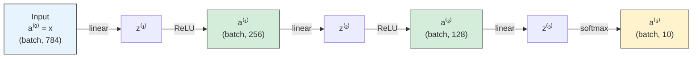
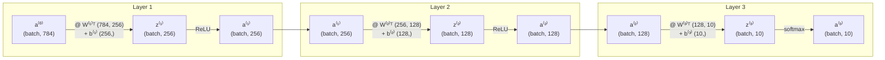
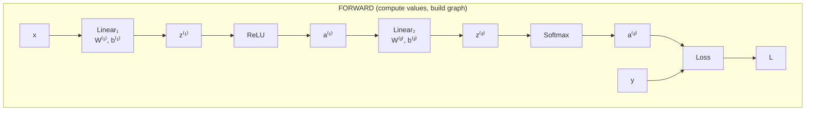
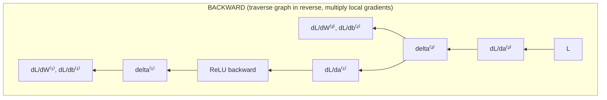
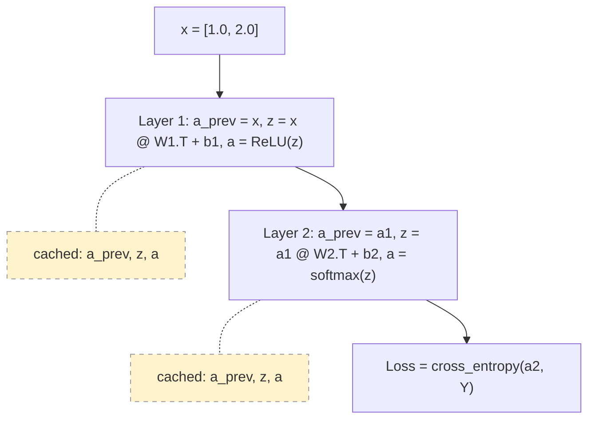
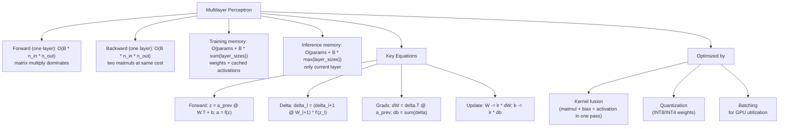

# Multilayer Perceptron -- Deep Dive

## The Intuition

### What Problem Are We Solving?

Linear models draw straight lines. That is their fundamental limitation. Logistic regression, softmax regression, linear regression -- they all compute $y = Wx + b$ and call it a day. If your data is linearly separable, great. If not, you are stuck.

Consider XOR: the inputs $(0,0)$ and $(1,1)$ should produce $0$, while $(0,1)$ and $(1,0)$ should produce $1$. Plot these four points and you will see there is no single straight line that separates the two classes. No amount of tuning a linear model will solve this. XOR is the simplest problem that proves linear models are insufficient for real-world data.

The multilayer perceptron (MLP) solves this by learning to *transform the data* into a space where it *becomes* linearly separable, then drawing the line in that new space.

### The Key Insight

Stacking linear transformations does not help. If you compose two linear functions, $f(x) = W_2(W_1 x + b_1) + b_2$, you get $f(x) = W_2 W_1 x + W_2 b_1 + b_2 = W' x + b'$. No matter how many linear layers you stack, the result collapses to a single linear transformation.

The breakthrough is inserting **nonlinear activation functions** between layers. Each layer computes:

$$a^{(l)} = f\left(a^{(l-1)} W^{(l)\top} + b^{(l)}\right)$$

where $f$ is a nonlinear function like ReLU. The nonlinearity prevents the collapse: $\text{ReLU}(W_2 \cdot \text{ReLU}(W_1 x + b_1) + b_2)$ cannot be reduced to a single linear operation. Each layer creates a new, richer representation of the data. The **universal approximation theorem** proves that a single hidden layer with enough neurons can approximate any continuous function to arbitrary precision.

### Real-World Analogy

Think of an MLP as an assembly line of interpreters, each translating a document into a progressively more useful form.

The raw input is a document in an obscure dialect. The first interpreter (layer 1) translates it into a related language -- not the final one, but a stepping stone. Each interpreter can only do simple transformations (linear + a twist of nonlinearity), but by chaining them together, you can translate from any language to any other language, no matter how different they seem.

The critical point: if each interpreter were only allowed to do word-for-word substitution (purely linear), chaining ten of them would be no better than one. It is the "twist" -- the nonlinear reinterpretation at each stage -- that gives the chain its power.

---

## The Forward Pass -- Layer by Layer

### Network Architecture

An MLP with $L$ layers has this structure:



**Notation:**
- $a^{(0)} = x$ -- the input (activations at "layer 0")
- $z^{(l)}$ -- pre-activation at layer $l$ (linear output before activation)
- $a^{(l)}$ -- post-activation at layer $l$ (output of activation function)
- $W^{(l)} \in \mathbb{R}^{n_l \times n_{l-1}}$ -- weight matrix for layer $l$
- $b^{(l)} \in \mathbb{R}^{n_l}$ -- bias vector for layer $l$
- $f^{(l)}$ -- activation function at layer $l$

### The Two-Step Computation at Each Layer

For each layer $l$ from $1$ to $L$:

$$z^{(l)} = a^{(l-1)} W^{(l)\top} + b^{(l)}$$

$$a^{(l)} = f^{(l)}(z^{(l)})$$

The first equation is a linear transformation (matrix multiply + bias). The second applies the nonlinearity element-wise. Together they form one layer of the network.

### Shape Walkthrough

For a concrete example: input dimension 784 (e.g., flattened $28 \times 28$ image), two hidden layers of 256 and 128 neurons, and 10 output classes:



### Critical: Cache Everything

During the forward pass, every $z^{(l)}$, $a^{(l)}$, and $a^{(l-1)}$ must be stored because backpropagation needs them all. This is why training uses far more memory than inference -- inference only needs the current layer's activations to compute the next.

### Implementation: The Forward Pass

From `implementation.py`, the `Layer.forward` method:

```python
def forward(self, x: np.ndarray) -> np.ndarray:
    self.a_prev = x.copy()                          # Cache input
    self.z = x @ self.W.T + self.b                   # Linear: z = xW^T + b
    if self.activation is None:
        self.a = self.z.copy()                       # Linear output (regression)
    elif isinstance(self.activation, str) and self.activation == "softmax":
        self.a = softmax(self.z)                     # Softmax output (classification)
    else:
        self.a = self.activation.forward(self.z)     # ReLU, GELU, etc.
    return self.a
```

**Line-by-line:**
- `self.a_prev = x.copy()` -- Cache the input to this layer. Needed for computing $\frac{\partial \mathcal{L}}{\partial W^{(l)}} = \delta^{(l)\top} a^{(l-1)}$ during backprop.
- `self.z = x @ self.W.T + self.b` -- The linear transform $z^{(l)} = a^{(l-1)} W^{(l)\top} + b^{(l)}$. Note that $W$ is stored as $(n_\text{out}, n_\text{in})$ so we transpose to get $(n_\text{in}, n_\text{out})$ for the matmul.
- The activation branch handles three cases: no activation (linear output for regression), softmax (classification), or any activation from the activations module (ReLU, GELU, etc.).

The `MLP.forward` simply chains all layers:

```python
def forward(self, X: np.ndarray) -> np.ndarray:
    X = np.asarray(X, dtype=np.float64)
    if X.ndim == 1:
        X = X.reshape(1, -1)
    a = X
    for layer in self.layers:
        a = layer.forward(a)
    return a
```

The output of each layer becomes the input to the next. This is the "feedforward" pattern.

---

## Backpropagation -- The Chain Rule, Step by Step

### The Computational Graph Perspective

Think of the network as a directed acyclic graph (DAG). Each node is an operation (matmul, add, ReLU). Each edge carries a tensor. The forward pass flows left-to-right, computing values. The backward pass flows right-to-left, computing gradients.





At each node during the backward pass, you answer two questions:
1. **"How much does my output change if my input changes?"** -- the local Jacobian
2. **"How much does the loss change if my output changes?"** -- the upstream gradient

You multiply them together (chain rule) and pass the result backward.

### Why It Is "Just" The Chain Rule

Backpropagation is not a special algorithm. It is the chain rule of calculus applied systematically to a computational graph. If you have a composition $L = h(g(f(x)))$, the chain rule says:

$$\frac{dL}{dx} = \frac{dh}{dg} \cdot \frac{dg}{df} \cdot \frac{df}{dx}$$

An MLP is exactly this: a composition of linear transforms and activations. Backpropagation computes these derivatives layer by layer from output to input, reusing intermediate results. The "back" in backpropagation refers to the direction of traversal -- from loss back to input.

### Step 1: The Output Layer Error ($\delta^{(L)}$)

The gradient of the loss with respect to the output layer's pre-activation $z^{(L)}$ is the starting point for backprop.

**Softmax + Cross-Entropy (classification):**

The cross-entropy loss is:

$$\mathcal{L}_\text{CE} = -\frac{1}{n} \sum_{i=1}^{n} \sum_{k=1}^{K} Y_{ik} \log(a^{(L)}_{ik})$$

When combined with softmax, the gradient simplifies beautifully:

$$\delta^{(L)} = \frac{\partial \mathcal{L}}{\partial z^{(L)}} = \frac{1}{n}(a^{(L)} - Y)$$

This "predictions minus targets" form is the same as in linear regression, logistic regression, and softmax regression. It is not a coincidence -- cross-entropy loss is specifically designed so that its gradient with respect to the logits takes this form.

**Linear Output + MSE (regression):**

$$\mathcal{L}_\text{MSE} = \frac{1}{2n} \sum_{i=1}^{n} \|a^{(L)}_i - y_i\|^2$$

$$\delta^{(L)} = \frac{\partial \mathcal{L}}{\partial z^{(L)}} = \frac{1}{n}(a^{(L)} - y)$$

The $\frac{1}{2}$ factor in MSE is a convention that cancels the 2 from the power rule derivative, giving the clean $(a - y) / n$ form.

### Step 2: Propagate Error Backward Through Hidden Layers

For each layer $l = L-1, L-2, \ldots, 1$, we need $\delta^{(l)} = \frac{\partial \mathcal{L}}{\partial z^{(l)}}$.

**Stage A: Propagate through the linear layer above.**

Since $z^{(l+1)} = a^{(l)} W^{(l+1)\top} + b^{(l+1)}$, the gradient with respect to $a^{(l)}$ is:

$$\frac{\partial \mathcal{L}}{\partial a^{(l)}} = \delta^{(l+1)} W^{(l+1)}$$

Shape check: $\delta^{(l+1)} \in \mathbb{R}^{n \times n_{l+1}}$ times $W^{(l+1)} \in \mathbb{R}^{n_{l+1} \times n_l}$ gives $\mathbb{R}^{n \times n_l}$. Same shape as $a^{(l)}$. Correct.

**Stage B: Propagate through the activation.**

Since $a^{(l)} = f^{(l)}(z^{(l)})$ and activations are element-wise:

$$\delta^{(l)} = \frac{\partial \mathcal{L}}{\partial a^{(l)}} \odot f'^{(l)}(z^{(l)})$$

Combining both stages gives the **backpropagation recurrence**:

$$\boxed{\delta^{(l)} = \left(\delta^{(l+1)} W^{(l+1)}\right) \odot f'^{(l)}(z^{(l)})}$$

Each $\delta^{(l)}$ depends only on $\delta^{(l+1)}$, $W^{(l+1)}$, and the cached $z^{(l)}$. You compute it layer by layer, from output back to input.

### Step 3: Compute Weight and Bias Gradients

Once you have $\delta^{(l)}$ for each layer, parameter gradients are straightforward. Since $z^{(l)} = a^{(l-1)} W^{(l)\top} + b^{(l)}$:

$$\frac{\partial \mathcal{L}}{\partial W^{(l)}} = \delta^{(l)\top} a^{(l-1)}$$

$$\frac{\partial \mathcal{L}}{\partial b^{(l)}} = \sum_{\text{rows}} \delta^{(l)}$$

**Shape verification:**
- $\delta^{(l)\top} \in \mathbb{R}^{n_l \times n}$ times $a^{(l-1)} \in \mathbb{R}^{n \times n_{l-1}}$ gives $\mathbb{R}^{n_l \times n_{l-1}}$ -- same shape as $W^{(l)}$
- $\sum_\text{rows} \delta^{(l)} \in \mathbb{R}^{n_l}$ -- same shape as $b^{(l)}$

### Step 4: Update Parameters

$$W^{(l)} \leftarrow W^{(l)} - \alpha \frac{\partial \mathcal{L}}{\partial W^{(l)}}$$

$$b^{(l)} \leftarrow b^{(l)} - \alpha \frac{\partial \mathcal{L}}{\partial b^{(l)}}$$

### Implementation: The Backward Pass

From `implementation.py`, the `MLP.backward` method:

```python
def backward(self, y: np.ndarray) -> float:
    output_layer = self.layers[-1]
    a_out = output_layer.a
    n = y.shape[0]

    if self._is_classification:
        loss = cross_entropy_loss(a_out, y)
        delta = (a_out - y) / n                      # Softmax + CE combined gradient
    else:
        loss = mse_loss(a_out, y)
        da_out = (a_out - y) / n                     # dL/da for MSE
        if output_layer.activation is not None and not isinstance(output_layer.activation, str):
            delta = output_layer.activation.backward(da_out)  # Propagate through output activation
        else:
            delta = da_out                            # Linear output: dL/dz = dL/da

    da_prev = output_layer.backward(delta)           # Compute dW, db; return dL/da_prev

    for layer in reversed(self.layers[:-1]):         # Hidden layers, back to front
        if layer.activation is not None and not isinstance(layer.activation, str):
            delta = layer.activation.backward(da_prev)  # dL/da * f'(z) = dL/dz
        else:
            delta = da_prev
        da_prev = layer.backward(delta)              # Compute dW, db; return dL/da_prev

    return loss
```

**Line-by-line:**

- Lines 1-3: Retrieve the output layer's cached activations and batch size.
- Lines 5-7 (classification): Compute cross-entropy loss, then the combined softmax+CE gradient $\delta^{(L)} = (a^{(L)} - Y) / n$. This is the elegant shortcut -- we never need to compute the Jacobian of softmax explicitly.
- Lines 8-12 (regression): Compute MSE loss. If the output layer has a nonlinear activation (e.g., Sigmoid for bounded output), propagate through its backward. If it is linear (None), $\delta = da$.
- Line 14: Call `output_layer.backward(delta)` which computes $\frac{\partial \mathcal{L}}{\partial W^{(L)}}$, $\frac{\partial \mathcal{L}}{\partial b^{(L)}}$, and returns $\delta^{(L)} W^{(L)}$ (the gradient flowing to the previous layer's activations).
- Lines 16-20: Loop through hidden layers in reverse. For each, propagate through the activation's backward (computing $\delta^{(l)} = \frac{\partial \mathcal{L}}{\partial a^{(l)}} \odot f'^{(l)}(z^{(l)})$), then through the layer's backward (computing gradients and propagating further).

And the `Layer.backward` method:

```python
def backward(self, delta: np.ndarray) -> np.ndarray:
    self.dW = delta.T @ self.a_prev      # (n_out, batch) @ (batch, n_in) = (n_out, n_in)
    self.db = np.sum(delta, axis=0)      # (n_out,)
    return delta @ self.W                # (batch, n_out) @ (n_out, n_in) = (batch, n_in)
```

Three operations, three lines. The return value is $\frac{\partial \mathcal{L}}{\partial a^{(l-1)}}$ -- the gradient flowing to the previous layer's post-activation.

---

## Worked Example -- Full Forward and Backward Pass

Let us trace through a tiny network with actual numbers. Architecture: input (2) --> hidden (2, ReLU) --> output (2, softmax).

### Setup

$$W^{(1)} = \begin{bmatrix} 0.1 & 0.3 \\ 0.2 & 0.4 \end{bmatrix}, \quad b^{(1)} = \begin{bmatrix} 0 \\ 0 \end{bmatrix}$$

$$W^{(2)} = \begin{bmatrix} 0.5 & 0.7 \\ 0.6 & 0.8 \end{bmatrix}, \quad b^{(2)} = \begin{bmatrix} 0 \\ 0 \end{bmatrix}$$

Input: $x = \begin{bmatrix} 1.0 & 2.0 \end{bmatrix}$ (single sample, $n = 1$)

Target: $Y = \begin{bmatrix} 1 & 0 \end{bmatrix}$ (class 0)

### Forward Pass

**Layer 1 -- Linear:**

$$z^{(1)} = x W^{(1)\top} + b^{(1)} = \begin{bmatrix} 1 & 2 \end{bmatrix} \begin{bmatrix} 0.1 & 0.2 \\ 0.3 & 0.4 \end{bmatrix} + \begin{bmatrix} 0 & 0 \end{bmatrix}$$

$$z^{(1)} = \begin{bmatrix} 1 \cdot 0.1 + 2 \cdot 0.3 & 1 \cdot 0.2 + 2 \cdot 0.4 \end{bmatrix} = \begin{bmatrix} 0.7 & 1.0 \end{bmatrix}$$

**Layer 1 -- ReLU:**

$$a^{(1)} = \text{ReLU}(z^{(1)}) = \text{ReLU}\begin{bmatrix} 0.7 & 1.0 \end{bmatrix} = \begin{bmatrix} 0.7 & 1.0 \end{bmatrix}$$

Both values are positive, so ReLU is an identity here.

**Layer 2 -- Linear:**

$$z^{(2)} = a^{(1)} W^{(2)\top} + b^{(2)} = \begin{bmatrix} 0.7 & 1.0 \end{bmatrix} \begin{bmatrix} 0.5 & 0.6 \\ 0.7 & 0.8 \end{bmatrix} + \begin{bmatrix} 0 & 0 \end{bmatrix}$$

$$z^{(2)} = \begin{bmatrix} 0.7 \cdot 0.5 + 1.0 \cdot 0.7 & 0.7 \cdot 0.6 + 1.0 \cdot 0.8 \end{bmatrix} = \begin{bmatrix} 1.05 & 1.22 \end{bmatrix}$$

**Layer 2 -- Softmax:**

$$a^{(2)} = \text{softmax}(z^{(2)}) = \text{softmax}\begin{bmatrix} 1.05 & 1.22 \end{bmatrix}$$

$$e^{1.05} \approx 2.858, \quad e^{1.22} \approx 3.387, \quad \text{sum} \approx 6.245$$

$$a^{(2)} = \begin{bmatrix} 2.858 / 6.245 & 3.387 / 6.245 \end{bmatrix} \approx \begin{bmatrix} 0.4577 & 0.5423 \end{bmatrix}$$

**Loss (Cross-Entropy):**

$$\mathcal{L} = -\frac{1}{1}\left(1 \cdot \log(0.4577) + 0 \cdot \log(0.5423)\right) = -\log(0.4577) \approx 0.7822$$

### Backward Pass

**Step 1: Output layer delta.**

$$\delta^{(2)} = \frac{1}{n}(a^{(2)} - Y) = \frac{1}{1}\begin{bmatrix} 0.4577 - 1 & 0.5423 - 0 \end{bmatrix} = \begin{bmatrix} -0.5423 & 0.5423 \end{bmatrix}$$

**Step 2: Output layer gradients.**

$$\frac{\partial \mathcal{L}}{\partial W^{(2)}} = \delta^{(2)\top} a^{(1)} = \begin{bmatrix} -0.5423 \\ 0.5423 \end{bmatrix} \begin{bmatrix} 0.7 & 1.0 \end{bmatrix} = \begin{bmatrix} -0.3796 & -0.5423 \\ 0.3796 & 0.5423 \end{bmatrix}$$

$$\frac{\partial \mathcal{L}}{\partial b^{(2)}} = \begin{bmatrix} -0.5423 & 0.5423 \end{bmatrix}$$

**Step 3: Propagate error to hidden layer.**

$$\frac{\partial \mathcal{L}}{\partial a^{(1)}} = \delta^{(2)} W^{(2)} = \begin{bmatrix} -0.5423 & 0.5423 \end{bmatrix} \begin{bmatrix} 0.5 & 0.7 \\ 0.6 & 0.8 \end{bmatrix}$$

$$= \begin{bmatrix} -0.5423 \cdot 0.5 + 0.5423 \cdot 0.6 & -0.5423 \cdot 0.7 + 0.5423 \cdot 0.8 \end{bmatrix} = \begin{bmatrix} 0.0542 & 0.0542 \end{bmatrix}$$

**Step 4: Propagate through ReLU.**

$$\delta^{(1)} = \frac{\partial \mathcal{L}}{\partial a^{(1)}} \odot \mathbb{1}[z^{(1)} > 0] = \begin{bmatrix} 0.0542 & 0.0542 \end{bmatrix} \odot \begin{bmatrix} 1 & 1 \end{bmatrix} = \begin{bmatrix} 0.0542 & 0.0542 \end{bmatrix}$$

Both $z^{(1)}$ values were positive, so the ReLU derivative is 1 everywhere.

**Step 5: Hidden layer gradients.**

$$\frac{\partial \mathcal{L}}{\partial W^{(1)}} = \delta^{(1)\top} a^{(0)} = \begin{bmatrix} 0.0542 \\ 0.0542 \end{bmatrix} \begin{bmatrix} 1.0 & 2.0 \end{bmatrix} = \begin{bmatrix} 0.0542 & 0.1085 \\ 0.0542 & 0.1085 \end{bmatrix}$$

$$\frac{\partial \mathcal{L}}{\partial b^{(1)}} = \begin{bmatrix} 0.0542 & 0.0542 \end{bmatrix}$$

**Step 6: Update (with $\alpha = 0.1$).**

$$W^{(1)}_\text{new} = W^{(1)} - 0.1 \cdot \frac{\partial \mathcal{L}}{\partial W^{(1)}} = \begin{bmatrix} 0.1 - 0.00542 & 0.3 - 0.01085 \\ 0.2 - 0.00542 & 0.4 - 0.01085 \end{bmatrix} = \begin{bmatrix} 0.0946 & 0.2892 \\ 0.1946 & 0.3892 \end{bmatrix}$$

After this update, the network's prediction for class 0 will be slightly higher than 0.4577. Repeat for hundreds of iterations and the network converges.

---

## Weight Initialization -- Why It Matters

### The Variance Explosion/Collapse Problem

Consider a network with $L$ layers of width $n$. During the forward pass, each layer multiplies the input by $W^{(l)}$. If each weight is drawn from $\mathcal{N}(0, 1)$ (standard normal), then:

$$\text{Var}(z^{(l)}_j) = \sum_{i=1}^{n} \text{Var}(w_{ji}) \cdot \text{Var}(a^{(l-1)}_i) = n \cdot \text{Var}(a^{(l-1)})$$

With $n = 256$: after layer 1 the variance multiplies by 256; after layer 2 by $256^2$; after layer 5 by $256^5 \approx 10^{12}$. Activations overflow to infinity. The same explosion happens in reverse during backpropagation.

If you make weights too small, the variance shrinks exponentially instead. After 5 layers the signal is effectively zero -- "vanishing activations."

This is verified in the test suite:

```python
def test_bad_init_explodes(self):
    """Standard normal init on deep network should have exploding activations."""
    # ... layers with W ~ N(0, 1) ...
    final_var = np.var(a)
    self.assertGreater(final_var, 1e6, "Bad init should cause exploding activations")
```

### Xavier/Glorot Initialization (for Sigmoid, Tanh)

**Goal:** Keep $\text{Var}(z^{(l)}) = \text{Var}(a^{(l-1)})$ across all layers.

**Derivation:** If weights and activations are independent with zero mean:

$$\text{Var}(z) = n_\text{in} \cdot \text{Var}(w) \cdot \text{Var}(a)$$

Setting $\text{Var}(z) = \text{Var}(a)$ requires $\text{Var}(w) = 1/n_\text{in}$.

A symmetric argument for the backward pass (wanting gradient variance preserved) gives $\text{Var}(w) = 1/n_\text{out}$.

Xavier compromises by averaging:

$$W \sim \mathcal{N}\left(0, \frac{2}{n_\text{in} + n_\text{out}}\right)$$

### He/Kaiming Initialization (for ReLU)

ReLU zeros out roughly half the neurons (those with negative pre-activation), effectively halving the variance at each layer. He initialization compensates with a factor of 2:

$$W \sim \mathcal{N}\left(0, \frac{2}{n_\text{in}}\right)$$

**Derivation sketch:** With ReLU, $\text{Var}(a) = \frac{1}{2} \text{Var}(z)$ (since half the activations are zeroed). So:

$$\text{Var}(z^{(l)}) = n_\text{in} \cdot \text{Var}(w) \cdot \text{Var}(a^{(l-1)}) = n_\text{in} \cdot \text{Var}(w) \cdot \frac{1}{2} \text{Var}(z^{(l-1)})$$

For stability we want $\text{Var}(z^{(l)}) = \text{Var}(z^{(l-1)})$, giving $\text{Var}(w) = 2 / n_\text{in}$.

### Implementation

```python
if init_method == "he":
    self.W = np.random.randn(n_out, n_in) * np.sqrt(2.0 / n_in)
elif init_method == "xavier":
    self.W = np.random.randn(n_out, n_in) * np.sqrt(2.0 / (n_in + n_out))

self.b = np.zeros(n_out)    # Biases always zero
```

Note that `np.random.randn` produces $\mathcal{N}(0, 1)$. Multiplying by $\sqrt{2/n_\text{in}}$ gives $\mathcal{N}(0, 2/n_\text{in})$ since $\text{Var}(cX) = c^2 \text{Var}(X)$.

**Biases are always zero.** There is no benefit to random bias initialization, and it can interact badly with activation symmetry.

---

## Loss Functions -- Cross-Entropy vs. MSE

### Cross-Entropy Loss (Classification)

For one-hot encoded labels $Y \in \mathbb{R}^{n \times K}$ and softmax output $a^{(L)} \in \mathbb{R}^{n \times K}$:

$$\mathcal{L}_\text{CE} = -\frac{1}{n} \sum_{i=1}^{n} \sum_{k=1}^{K} Y_{ik} \log(a^{(L)}_{ik})$$

Since $Y$ is one-hot, only one term per sample survives: $\mathcal{L}_i = -\log(a^{(L)}_{i,c})$ where $c$ is the true class. This means: the loss is the negative log-probability assigned to the correct class. If the model is confident and correct ($a_{i,c} \to 1$), the loss approaches 0. If the model assigns near-zero probability to the correct class ($a_{i,c} \to 0$), the loss approaches $+\infty$.

**Implementation with numerical protection:**

```python
def cross_entropy_loss(predictions, targets, eps=1e-15):
    P_clipped = np.clip(predictions, eps, 1.0 - eps)
    n = targets.shape[0]
    return float(-np.sum(targets * np.log(P_clipped)) / n)
```

The `np.clip` prevents $\log(0) = -\infty$. Without it, a single overconfident wrong prediction can produce NaN loss.

### Mean Squared Error (Regression)

$$\mathcal{L}_\text{MSE} = \frac{1}{2n} \sum_{i=1}^{n} \|a^{(L)}_i - y_i\|^2$$

```python
def mse_loss(predictions, targets):
    n = targets.shape[0]
    return float(0.5 * np.sum((predictions - targets) ** 2) / n)
```

The $\frac{1}{2}$ factor is a convenience: the derivative of $\frac{1}{2}x^2$ is $x$, not $2x$, keeping the gradient cleaner.

### When to Use Which

| Criterion | Cross-Entropy | MSE |
|-----------|---------------|-----|
| Task | Classification | Regression |
| Output activation | Softmax | Linear (or Sigmoid for bounded) |
| Gradient at output | $(a - Y) / n$ | $(a - y) / n$ |
| Gradient behavior | Strong signal when wrong | Weaker signal at extremes |
| Why preferred | Aligns with MLE for categorical distribution | Aligns with MLE for Gaussian distribution |

Cross-entropy is strongly preferred for classification because it provides a stronger gradient signal when the model is confidently wrong. MSE for classification can suffer from "plateau" regions where the gradient is tiny despite large error.

---

## Mini-Batch Gradient Descent

### Why Not Full-Batch?

Full-batch gradient descent computes the gradient over all $n$ samples. This is mathematically clean but practically problematic:

1. **Memory:** You must store all activations for all samples simultaneously.
2. **Speed:** You only update weights once per full pass through the data.
3. **Generalization:** The gradient is "too clean" -- the noise from mini-batches acts as implicit regularization.

### Why Not Pure SGD (batch size 1)?

At the other extreme, updating after every single sample is noisy -- the gradient from one sample is a poor estimate of the true gradient. It also fails to exploit GPU parallelism, since GPUs are designed to process batches of data in parallel.

### The Sweet Spot: Mini-Batches

Mini-batch gradient descent samples a batch of $B$ examples and computes the gradient on that subset:

$$\frac{\partial \mathcal{L}}{\partial W^{(l)}} \approx \frac{1}{B} \delta^{(l)\top}_\text{batch} \, a^{(l-1)}_\text{batch}$$

Typical batch sizes are 32, 64, 128, or 256 -- chosen to balance gradient quality, GPU memory, and training speed.

### Implementation

```python
def fit(self, X, y, epochs, learning_rate, batch_size, verbose):
    # ...
    for epoch in range(epochs):
        indices = np.random.permutation(n)           # Shuffle each epoch
        epoch_losses = []

        for start in range(0, n, batch_size):
            batch_idx = indices[start : start + batch_size]
            X_batch = X[batch_idx]
            Y_batch = Y[batch_idx]

            self.forward(X_batch)                    # Forward pass on batch
            loss = self.backward(Y_batch)            # Compute gradients
            self.update(learning_rate)               # Update weights
            epoch_losses.append(loss)

        avg_loss = float(np.mean(epoch_losses))
        history.append(avg_loss)
    return history
```

**Key details:**
- **Shuffling:** `np.random.permutation(n)` at each epoch ensures different batches each time, preventing the model from memorizing batch order.
- **Last batch handling:** `indices[start : start + batch_size]` naturally handles the case where the last batch is smaller than `batch_size` (e.g., 17 samples with batch size 5 gives batches of 5, 5, 5, 2).
- **Epoch loss:** Averaged over all mini-batches in the epoch.

---

## The Computational Graph Perspective

### Forward Builds the Graph

During the forward pass, each layer stores its inputs and outputs. This creates an implicit computational graph -- a record of every operation performed and every intermediate value produced.



### Backward Traverses It

The backward pass walks this graph in reverse. At each node, it:
1. Receives the upstream gradient (how much the loss changes with respect to this node's output)
2. Computes local gradients (how much this node's output changes with respect to its inputs)
3. Multiplies them (chain rule) and sends the result upstream

This is exactly what PyTorch's autograd does automatically. Our manual implementation makes the process explicit, which is why understanding it is essential before using autograd.

### Why Backward Uses ~2x the FLOPs of Forward

During the forward pass, each layer performs one matrix multiply: $z = a W^\top$.

During backward, each layer performs **two** matrix multiplies:
1. $\frac{\partial \mathcal{L}}{\partial W} = \delta^\top a_\text{prev}$ (weight gradient)
2. $\delta_\text{prev} = \delta W$ (propagate to previous layer)

Plus the element-wise activation backward (negligible compared to matmuls). So backward is roughly 2x the compute of forward. This is a fundamental property of backpropagation, not a quirk of our implementation.

---

## Connection to Transformers

### The FFN Block IS an MLP

Every transformer block contains a feed-forward network (FFN) that is literally a two-layer MLP:

$$\text{FFN}(x) = f(x W_1^\top + b_1) W_2^\top + b_2$$

This is exactly what our implementation computes with `MLP(layer_sizes=[d_model, d_ff, d_model], activations=[activation, None])`.

| Model | FFN Activation | FFN Hidden Dim | Structure |
|-------|---------------|----------------|-----------|
| GPT-2/3, BERT | GELU | $4 \times d_\text{model}$ | Standard 2-layer MLP |
| LLaMA, Mistral | SiLU | $\sim 2.7 \times d_\text{model}$ | Gated (SwiGLU): $(\text{SiLU}(xW_1) \odot xW_3)W_2$ |

### Where the FLOPs Live

In a standard transformer, roughly **two-thirds** of the FLOPs are in the FFN blocks, not in attention. For a model with dimension $d$ and FFN dimension $4d$:

- Attention projections ($Q$, $K$, $V$, $O$): $4 \times d^2$ parameters per layer
- FFN: $2 \times d \times 4d = 8d^2$ parameters per layer

The FFN has twice the parameters of attention, and the matrix multiplications are the same GEMMs. When you later optimize transformer inference with fused kernels, you are optimizing the exact `z = x @ W.T + b; a = ReLU(z)` pattern we implemented here.

### Kernel Fusion Opportunity

The forward pass `z = x @ W.T + b; a = activation(z)` involves three memory operations in a naive implementation: write $z$, read $z$ for bias add, write result, read result for activation. A **fused kernel** does the matmul, bias add, and activation in one pass, reading and writing memory only once. This is a 3x reduction in memory bandwidth usage for the activation portion -- a significant win during inference.

---

## Complexity Analysis

### Time Complexity

For a network with layers of sizes $[n_0, n_1, \ldots, n_L]$ and batch size $B$:

| Operation | Complexity | Why |
|-----------|------------|-----|
| Forward (one layer) | $O(B \cdot n_{l-1} \cdot n_l)$ | Matrix multiply $a^{(l-1)} W^{(l)\top}$ dominates |
| Forward (all layers) | $O(B \cdot \sum_{l=1}^{L} n_{l-1} \cdot n_l)$ | Sum over all layer matmuls |
| Backward (one layer) | $O(B \cdot n_{l-1} \cdot n_l)$ | Two matmuls ($\delta^\top a$ and $\delta W$), each same complexity |
| Backward (all layers) | $O(B \cdot \sum_{l=1}^{L} n_{l-1} \cdot n_l)$ | ~2x forward per layer |
| One training step | $O(B \cdot \sum_{l=1}^{L} n_{l-1} \cdot n_l)$ | Forward + backward, constant factor ~3x |
| One epoch | $O(n \cdot \sum_{l=1}^{L} n_{l-1} \cdot n_l)$ | Process all $n$ samples in batches of $B$ |

The matrix multiplies dominate everything. Activations are element-wise $O(B \cdot n_l)$ -- negligible by comparison.

### Space Complexity

| Component | Size | Purpose |
|-----------|------|---------|
| Weights + biases | $\sum_{l=1}^{L} (n_l \cdot n_{l-1} + n_l)$ | Model parameters |
| Cached activations (training) | $B \cdot \sum_{l=0}^{L} n_l$ | Needed for backprop |
| Cached pre-activations (training) | $B \cdot \sum_{l=1}^{L} n_l$ | Needed for activation backward |
| Gradients | Same as weights + biases | $\frac{\partial \mathcal{L}}{\partial W}$ and $\frac{\partial \mathcal{L}}{\partial b}$ |
| Inference only | Weights + $B \cdot \max(n_l)$ | Only need current layer's activations |

**Concrete example** -- architecture `[784, 256, 128, 10]`, batch size 64:

| Component | Floats | ~Size (float64) |
|-----------|--------|-----------------|
| Weights | $784 \times 256 + 256 \times 128 + 128 \times 10 = 234,624$ | 1.8 MB |
| Biases | $256 + 128 + 10 = 394$ | 3 KB |
| Cached activations | $64 \times (784 + 256 + 128 + 10) = 75,392$ | 589 KB |
| Cached pre-activations | $64 \times (256 + 128 + 10) = 25,216$ | 197 KB |
| Gradients | $235,018$ | 1.8 MB |
| **Training total** | | **~4.4 MB** |
| **Inference total** | | **~1.8 MB** |

Training uses ~2.4x the memory of inference. This ratio grows with batch size and network depth. It directly motivates **gradient checkpointing** -- discarding intermediate activations and recomputing them during backward, trading compute for memory.

### The Bottleneck

For small batch sizes (typical during inference), MLPs are **memory-bandwidth-bound**: you read the entire weight matrix from memory, do a small multiply, and write a small result. The ratio of compute to memory access (arithmetic intensity) is low.

For large batch sizes (typical during training), MLPs become **compute-bound**: the matrix multiply has enough work to keep the ALUs busy while data streams in.

Understanding this crossover point is essential for inference optimization. It is why batching requests together during serving matters so much.

---

## Common Pitfalls

### Pitfall 1: Vanishing Gradients in Deep Networks

**The mistake:** Using Sigmoid or Tanh activations in a deep network (5+ layers) without proper initialization.

```python
# Wrong: Sigmoid saturates, derivatives approach zero in deep networks
mlp = MLP([784, 256, 256, 256, 256, 10],
          [Sigmoid(), Sigmoid(), Sigmoid(), Sigmoid(), "softmax"])
```

**Why it is wrong:** Sigmoid squashes inputs to $(0, 1)$ and its maximum derivative is 0.25 (at $x = 0$). After $L$ layers, the gradient is multiplied by at most $0.25^L$. With 4 hidden layers, the gradient reaching layer 1 is at most $0.25^4 \approx 0.004$ of the output gradient. Early layers barely learn.

**The fix:** Use ReLU (or variants) which have gradient 1 for positive inputs:

```python
# Correct: ReLU does not saturate for positive inputs
mlp = MLP([784, 256, 256, 256, 256, 10],
          [ReLU(), ReLU(), ReLU(), ReLU(), "softmax"])
```

### Pitfall 2: Dead ReLU Neurons

**The mistake:** Using a learning rate that is too large with ReLU, causing neurons to enter a permanently "dead" state.

```python
# Risky: large learning rate can push weights so negative that ReLU always outputs 0
mlp = MLP([2, 16, 2], [ReLU(), "softmax"])
mlp.fit(X, y, learning_rate=10.0)  # Too aggressive
```

**Why it is wrong:** If a large gradient update pushes all weights feeding into a neuron to large negative values, every input will produce a negative pre-activation. ReLU outputs 0 for all negative inputs, and its gradient is also 0 there. The neuron can never recover -- it is "dead." This can silently reduce your effective network capacity.

**The fix:** Use a moderate learning rate, or use Leaky ReLU which has a small non-zero gradient for negative inputs:

```python
# Option 1: Moderate learning rate
mlp.fit(X, y, learning_rate=0.01)

# Option 2: Leaky ReLU -- no dead neurons
mlp = MLP([2, 16, 2], [LeakyReLU(0.01), "softmax"])
```

### Pitfall 3: Forgetting to Cache During Forward

**The mistake:** Not storing intermediate values during the forward pass, then having no data for backprop.

```python
# Wrong: no caching
def forward(self, x):
    z = x @ self.W.T + self.b
    return self.activation.forward(z)
    # Lost: x (needed for dW), z (needed for activation backward)
```

**Why it is wrong:** Backprop needs $a^{(l-1)}$ to compute $\frac{\partial \mathcal{L}}{\partial W^{(l)}} = \delta^{(l)\top} a^{(l-1)}$, and needs $z^{(l)}$ for the activation's backward pass (e.g., ReLU needs to know which values were positive).

**The fix:** Cache everything (as our implementation does):

```python
# Correct: cache all intermediates
def forward(self, x):
    self.a_prev = x.copy()                    # Cache for dW computation
    self.z = x @ self.W.T + self.b            # Cache for activation backward
    self.a = self.activation.forward(self.z)   # Activation caches internally
    return self.a
```

### Pitfall 4: Shape Confusion with Weight Matrices

**The mistake:** Confusing the convention for $W$ shape.

```python
# Confusion: is W shape (n_in, n_out) or (n_out, n_in)?
z = x @ W + b       # This assumes W is (n_in, n_out)
z = x @ W.T + b     # This assumes W is (n_out, n_in)
```

**Why it matters:** Our implementation stores $W \in \mathbb{R}^{n_\text{out} \times n_\text{in}}$ (same convention as PyTorch). The forward pass transposes: `z = x @ self.W.T + self.b`. Getting this wrong silently produces incorrect shapes or, worse, correct shapes with wrong values (if $n_\text{in} = n_\text{out}$).

**The fix:** Always verify shapes explicitly:

```python
# W is (n_out, n_in), so W.T is (n_in, n_out)
# x is (batch, n_in) @ (n_in, n_out) = (batch, n_out). Correct.
self.z = x @ self.W.T + self.b
```

### Pitfall 5: Not Protecting log(0) in Cross-Entropy

**The mistake:** Computing cross-entropy without epsilon clipping.

```python
# Wrong: log(0) = -inf, produces NaN
loss = -np.sum(Y * np.log(predictions)) / n
```

**Why it is wrong:** If the model assigns exactly 0 probability to the correct class, $\log(0) = -\infty$. Multiplied by 1 (from one-hot), this makes the loss infinite. Any subsequent gradient computation produces NaN, and training collapses.

**The fix:** Clip predictions to $[\epsilon, 1 - \epsilon]$:

```python
# Correct: epsilon prevents log(0)
P_clipped = np.clip(predictions, 1e-15, 1.0 - 1e-15)
loss = -np.sum(Y * np.log(P_clipped)) / n
```

---

## Testing Your Understanding

### Quick Checks

1. What would happen if we removed all activation functions and stacked 10 linear layers? (Answer: The entire network collapses to a single linear transformation $W'x + b'$ -- no capacity for nonlinear decision boundaries.)

2. Why does the backward pass through `Layer.backward` return `delta @ self.W` and not `delta @ self.W.T`? (Answer: $W$ is stored as $(n_\text{out}, n_\text{in})$. The gradient $\frac{\partial \mathcal{L}}{\partial a^{(l-1)}} = \delta^{(l)} W^{(l)}$ requires shape $(n, n_\text{out}) \times (n_\text{out}, n_\text{in}) = (n, n_\text{in})$. This matches `delta @ self.W` directly.)

3. Why do we divide by $n$ (batch size) in the loss and delta computation? (Answer: To make the gradient magnitude independent of batch size. Without it, larger batches would produce proportionally larger gradients, requiring different learning rates for different batch sizes.)

4. If the input is shape $(32, 784)$ and the network is `[784, 256, 128, 10]`, what is the shape of $\frac{\partial \mathcal{L}}{\partial W^{(2)}}$? (Answer: $(128, 256)$ -- same shape as $W^{(2)}$. This is $\delta^{(2)\top} a^{(1)}$ with shapes $(128, 32) \times (32, 256) = (128, 256)$.)

### Exercises

1. **Easy:** Modify the `MLP` class to support L2 regularization. Add $\frac{\lambda}{2} \sum_l \|W^{(l)}\|^2_F$ to the loss and $\lambda W^{(l)}$ to each weight gradient in the backward pass.

2. **Medium:** Implement dropout. During training, randomly zero out each hidden neuron with probability $p$ and scale the remaining activations by $1/(1-p)$. During inference, use all neurons. This requires modifying `Layer.forward` to accept a `training` flag.

3. **Hard:** Implement gradient checkpointing. Instead of caching all intermediate activations, only cache every $k$-th layer's activations. During backward, recompute the missing activations by re-running the forward pass from the nearest checkpoint. Measure the memory savings vs. compute overhead.

---

## Summary

### Key Takeaways

- An MLP is a composition of linear transforms and nonlinear activations. The nonlinearity is what gives it power -- without it, all layers collapse to one.
- Backpropagation is the chain rule applied systematically: each layer computes local gradients and multiplies by the upstream gradient, passing the result backward.
- Weight initialization is not optional -- He init for ReLU, Xavier for sigmoid/tanh -- and getting it wrong means your network cannot train at all.
- The FFN block in every transformer layer is literally a two-layer MLP. Understanding this implementation is understanding two-thirds of a transformer's compute.

### Quick Reference


