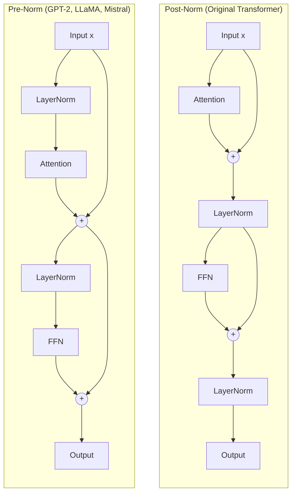
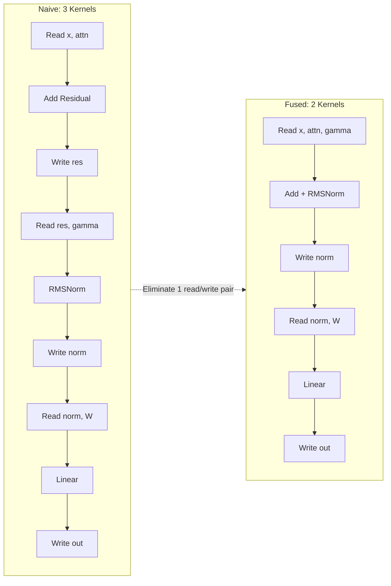

# Normalization

**Phase 2 · Topic 4** — The operations that make deep networks trainable, and primary targets for kernel fusion in transformer inference.

## What it is

Normalization layers re-center and re-scale activations within each sample to stabilize training and improve gradient flow. Without normalization, deep networks suffer from internal covariate shift: the distribution of inputs to each layer changes as the parameters of all preceding layers update during training. This forces each layer to continuously adapt to a moving input distribution, making optimization slow and fragile. Normalization constrains the activation statistics, giving each layer a stable foundation to learn from.

The key distinction is **what dimension you normalize over**. Batch Normalization normalizes across the batch dimension -- computing statistics over all samples in a mini-batch for each feature. This works well for CNNs but fails catastrophically for autoregressive transformers: at inference time you generate one token at a time (batch size 1), so batch statistics are meaningless. Running averages from training are a poor substitute, and variable-length sequences with padding create further complications. BatchNorm also introduces a train/inference behavioral gap that complicates deployment.

**Layer Normalization** and **RMS Normalization** solve this by normalizing across the feature dimension within each individual sample. They compute statistics per-sample, so they behave identically at training and inference time, work with batch size 1, and handle variable-length sequences naturally. Every transformer layer applies normalization -- typically twice per block, once before attention and once before the FFN. LayerNorm was used in the original transformer (Vaswani et al., 2017), GPT-2, GPT-3, and BERT. RMSNorm (Zhang & Sennrich, 2019) is used in LLaMA, Mistral, Gemma, and most modern LLMs because it achieves comparable performance with fewer operations. Understanding both -- forward AND backward -- is essential because these are among the first operations you will fuse into custom CUDA kernels.

## The math

### Layer Normalization

Given an input $x$ where normalization is applied over the last dimension of size $D$ (the hidden dimension / model dimension):

**Forward pass:**

$$\mu = \frac{1}{D} \sum_{i=1}^{D} x_i$$

$$\sigma^2 = \frac{1}{D} \sum_{i=1}^{D} (x_i - \mu)^2$$

$$\hat{x} = \frac{x - \mu}{\sqrt{\sigma^2 + \epsilon}}$$

$$y = \gamma \odot \hat{x} + \beta$$

Where:
- $x \in \mathbb{R}^{B \times L \times D}$ or $\mathbb{R}^{B \times D}$ is the input tensor (batch, sequence length, model dimension)
- $\mu \in \mathbb{R}^{B \times L \times 1}$ is the mean, computed per-sample over the last dimension
- $\sigma^2 \in \mathbb{R}^{B \times L \times 1}$ is the variance, computed per-sample over the last dimension
- $\epsilon$ is a small constant (typically $10^{-5}$) for numerical stability
- $\gamma \in \mathbb{R}^{D}$ is the learnable scale parameter, initialized to ones
- $\beta \in \mathbb{R}^{D}$ is the learnable shift parameter, initialized to zeros
- $\hat{x}$ is the normalized input (zero mean, unit variance before $\gamma$/$\beta$)
- $y \in \mathbb{R}^{B \times L \times D}$ is the output, same shape as $x$

**Step by step (forward):**
1. Compute the mean $\mu$ over the last dimension (the feature/hidden dimension), keeping the dimension for broadcasting
2. Subtract the mean: $x_{\text{centered}} = x - \mu$
3. Compute the variance $\sigma^2 = \frac{1}{D} \sum (x - \mu)^2$ over the last dimension
4. Compute the inverse standard deviation: $\sigma^{-1} = \frac{1}{\sqrt{\sigma^2 + \epsilon}}$
5. Normalize: $\hat{x} = (x - \mu) \cdot \sigma^{-1}$
6. Scale and shift: $y = \gamma \odot \hat{x} + \beta$
7. Cache $\hat{x}$, $\sigma^{-1}$, $x$, $\gamma$ for the backward pass

**Backward pass:**

The backward pass for LayerNorm is non-trivial because $\mu$ and $\sigma^2$ both depend on all elements of $x$ along the normalized dimension. Every element of $x$ affects every other element's normalized value through these shared statistics. Let $\frac{\partial \mathcal{L}}{\partial y}$ be the upstream gradient.

**Gradients for learnable parameters:**

$$\frac{\partial \mathcal{L}}{\partial \gamma} = \sum_{b,l} \frac{\partial \mathcal{L}}{\partial y} \odot \hat{x}$$

$$\frac{\partial \mathcal{L}}{\partial \beta} = \sum_{b,l} \frac{\partial \mathcal{L}}{\partial y}$$

The sums are over the batch and sequence dimensions -- $\gamma$ and $\beta$ are shared across all positions, so their gradients accumulate. The result has shape $(D,)$, matching the parameters.

**Gradient for input (step-by-step derivation):**

Start from the chain rule through each intermediate variable:

$$\frac{\partial \mathcal{L}}{\partial \hat{x}} = \frac{\partial \mathcal{L}}{\partial y} \odot \gamma$$

$$\frac{\partial \mathcal{L}}{\partial \sigma^2} = \sum_{d=1}^{D} \frac{\partial \mathcal{L}}{\partial \hat{x}_d} \cdot (x_d - \mu) \cdot \left(-\frac{1}{2}\right) (\sigma^2 + \epsilon)^{-3/2}$$

$$\frac{\partial \mathcal{L}}{\partial \mu} = -\sigma^{-1} \sum_{d=1}^{D} \frac{\partial \mathcal{L}}{\partial \hat{x}_d} + \frac{\partial \mathcal{L}}{\partial \sigma^2} \cdot \frac{-2}{D} \sum_{d=1}^{D} (x_d - \mu)$$

Note that $\sum_{d=1}^{D} (x_d - \mu) = 0$ by definition of the mean, so the second term vanishes:

$$\frac{\partial \mathcal{L}}{\partial \mu} = -\sigma^{-1} \sum_{d=1}^{D} \frac{\partial \mathcal{L}}{\partial \hat{x}_d}$$

$$\frac{\partial \mathcal{L}}{\partial x} = \frac{\partial \mathcal{L}}{\partial \hat{x}} \cdot \sigma^{-1} + \frac{\partial \mathcal{L}}{\partial \sigma^2} \cdot \frac{2(x - \mu)}{D} + \frac{\partial \mathcal{L}}{\partial \mu} \cdot \frac{1}{D}$$

**Simplified backward (commonly used form):**

The three-term expression can be combined into a single, more numerically stable formula. Let $g = \frac{\partial \mathcal{L}}{\partial y} \odot \gamma$:

$$\frac{\partial \mathcal{L}}{\partial x} = \frac{\sigma^{-1}}{D} \left( D \cdot g - \sum_{d=1}^{D} g_d - \hat{x} \odot \sum_{d=1}^{D} g_d \cdot \hat{x}_d \right)$$

**Derivation of simplified form:**

$$
\begin{aligned}
\frac{\partial \mathcal{L}}{\partial x} &= \sigma^{-1} \left( g - \frac{1}{D} \sum g - \frac{\hat{x}}{D} \sum g \odot \hat{x} \right) \\
&= \frac{\sigma^{-1}}{D} \left( D \cdot g - \sum g - \hat{x} \sum g \odot \hat{x} \right)
\end{aligned}
$$

This formulation requires only two reductions (sum of $g$ and sum of $g \odot \hat{x}$) and avoids recomputing $(x - \mu)$ separately.

---

### RMS Normalization

RMSNorm (Zhang & Sennrich, 2019) simplifies LayerNorm by removing the mean subtraction entirely. The key insight from the paper: the re-centering provided by mean subtraction is not critical for transformer performance, while the re-scaling (dividing by a norm) is essential. Removing the mean computation saves one reduction operation and one elementwise subtraction, and also eliminates the $\beta$ parameter.

**Forward pass:**

$$\text{RMS}(x) = \sqrt{\frac{1}{D} \sum_{i=1}^{D} x_i^2 + \epsilon}$$

$$\hat{x} = \frac{x}{\text{RMS}(x)}$$

$$y = \hat{x} \odot \gamma$$

Where:
- $x \in \mathbb{R}^{B \times L \times D}$ is the input tensor
- $\text{RMS}(x) \in \mathbb{R}^{B \times L \times 1}$ is the root mean square, computed per-sample over the last dimension
- $\epsilon$ is a small constant for numerical stability (typically $10^{-6}$)
- $\gamma \in \mathbb{R}^{D}$ is the learnable scale parameter, initialized to ones
- No $\beta$ parameter -- RMSNorm does not shift, only scales

**Step by step (forward):**
1. Compute the mean of squared values: $\text{ms} = \frac{1}{D} \sum x_i^2$ over the last dimension
2. Compute the inverse RMS: $\text{RMS}^{-1} = \frac{1}{\sqrt{\text{ms} + \epsilon}}$
3. Normalize: $\hat{x} = x \cdot \text{RMS}^{-1}$
4. Scale: $y = \hat{x} \odot \gamma$
5. Cache $\hat{x}$, $\text{RMS}^{-1}$, $x$, $\gamma$ for the backward pass

**Backward pass:**

The backward pass for RMSNorm is simpler than LayerNorm because there is no mean computation and no $\beta$ parameter. Let $\frac{\partial \mathcal{L}}{\partial y}$ be the upstream gradient.

**Gradient for learnable parameter:**

$$\frac{\partial \mathcal{L}}{\partial \gamma} = \sum_{b,l} \frac{\partial \mathcal{L}}{\partial y} \odot \hat{x}$$

**Gradient for input:**

Let $g = \frac{\partial \mathcal{L}}{\partial y} \odot \gamma$:

$$\frac{\partial \mathcal{L}}{\partial x} = \text{RMS}^{-1} \left( g - \hat{x} \cdot \frac{1}{D} \sum_{d=1}^{D} g_d \cdot \hat{x}_d \right)$$

**Derivation:**

$$
\begin{aligned}
\frac{\partial \mathcal{L}}{\partial x_i} &= \frac{\partial \mathcal{L}}{\partial \hat{x}_i} \cdot \frac{\partial \hat{x}_i}{\partial x_i} + \sum_{j} \frac{\partial \mathcal{L}}{\partial \hat{x}_j} \cdot \frac{\partial \hat{x}_j}{\partial \text{RMS}} \cdot \frac{\partial \text{RMS}}{\partial x_i} \\[6pt]
&= g_i \cdot \text{RMS}^{-1} - \text{RMS}^{-1} \cdot \hat{x}_i \cdot \frac{1}{D} \sum_{j} g_j \cdot \hat{x}_j \\[6pt]
&= \text{RMS}^{-1} \left( g_i - \hat{x}_i \cdot \frac{1}{D} \sum_{j} g_j \cdot \hat{x}_j \right)
\end{aligned}
$$

The key difference from LayerNorm: there is only one reduction term ($\sum g \odot \hat{x}$) instead of two. No mean subtraction means no $\sum g$ term.

---

### Why RMSNorm is simpler

| Operation | LayerNorm | RMSNorm |
|-----------|-----------|---------|
| Mean computation ($\mu$) | Yes (1 reduction) | No |
| Variance computation ($\sigma^2$) | Yes (1 reduction, uses $\mu$) | No |
| RMS computation | No | Yes (1 reduction) |
| Mean subtraction | Yes (1 elementwise op) | No |
| Learnable shift ($\beta$) | Yes ($D$ extra params) | No |
| Forward reductions | 2 | 1 |
| Backward reductions | 2 ($\sum g$, $\sum g \hat{x}$) | 1 ($\sum g \hat{x}$) |
| Forward elementwise ops | ~6 per element | ~4 per element |

RMSNorm removes the mean-centering step entirely. Empirically, researchers found that the re-centering provided by mean subtraction is not critical for transformer performance, while the re-scaling (dividing by a norm) is essential. This insight led to RMSNorm's adoption in LLaMA, Mistral, Gemma, and most modern LLMs.

---

### Batch Normalization (for context -- not implemented)

BatchNorm normalizes across the batch dimension:

$$\mu_B = \frac{1}{B} \sum_{b=1}^{B} x_b, \qquad \sigma_B^2 = \frac{1}{B} \sum_{b=1}^{B} (x_b - \mu_B)^2$$

$$\hat{x} = \frac{x - \mu_B}{\sqrt{\sigma_B^2 + \epsilon}}, \qquad y = \gamma \hat{x} + \beta$$

**Why BatchNorm is not used in transformers:**

1. **Batch size 1 at inference:** Autoregressive generation processes one token at a time. BatchNorm over a single sample produces meaningless statistics ($\mu = x$, $\sigma^2 = 0$).
2. **Running statistics mismatch:** BatchNorm maintains running mean/variance from training as substitutes during inference. These running statistics were computed over training batches and may not match inference distributions, especially for long sequences or out-of-distribution inputs.
3. **Train/inference behavioral gap:** BatchNorm behaves differently during training (uses batch statistics) and inference (uses running statistics). This complicates debugging, deployment, and reproducibility.
4. **Variable-length sequences:** In a batch of sequences with different lengths, padding tokens corrupt batch statistics. Masking adds complexity and still produces length-dependent statistics.
5. **Breaks autoregressive semantics:** Normalizing across the batch means each sample's output depends on other samples in the batch. This couples samples that should be independent, and makes results depend on what else is in the batch.

LayerNorm and RMSNorm have none of these problems. They normalize within each sample independently, behave identically at training and inference time, and work naturally with any batch size and sequence length.

---

### Pre-norm vs Post-norm

The placement of normalization within the transformer block has a significant impact on training stability.

**Post-norm (original transformer, Vaswani et al. 2017):**

$$x_1 = \text{LayerNorm}(x + \text{Attention}(x))$$

$$x_2 = \text{LayerNorm}(x_1 + \text{FFN}(x_1))$$

**Pre-norm (GPT-2, LLaMA, modern LLMs):**

$$x_1 = x + \text{Attention}(\text{LayerNorm}(x))$$

$$x_2 = x_1 + \text{FFN}(\text{LayerNorm}(x_1))$$



**Why pre-norm trains more stably:**

In post-norm, the residual connection adds the sub-layer output to $x$, and then normalization is applied to the sum. During backpropagation, gradients must flow through the normalization layer to reach the residual path. The normalization's backward pass includes division by $\sigma$ and subtraction of projection terms, which can attenuate gradient magnitude. In deep networks (32-96 layers), this repeated attenuation can cause vanishing gradients.

In pre-norm, the residual connection creates a direct "gradient highway" from output to input. The gradient flows through the addition node unchanged: $\frac{\partial (x + f(\text{LN}(x)))}{\partial x}$ includes a direct identity term. Normalization is only applied on the sub-layer branch, not on the residual path itself. This means gradients always have a clear, unimpeded path back through the network, regardless of depth.

The practical consequence: post-norm requires careful learning rate warmup and often fails to train at all for very deep networks without additional tricks. Pre-norm trains stably even for 100+ layer transformers with simple optimizers and schedules.

**Final LayerNorm:** Pre-norm architectures typically add one final LayerNorm after the last transformer block (before the output projection). This is needed because the pre-norm design leaves the residual stream unnormalized at the output.

| Architecture | Norm Placement | Models |
|-------------|----------------|--------|
| Post-norm | After residual add | Original Transformer, BERT |
| Pre-norm + LayerNorm | Before each sub-layer | GPT-2, GPT-3 |
| Pre-norm + RMSNorm | Before each sub-layer | LLaMA, LLaMA 2, Mistral, Gemma |

---

### The epsilon parameter

The $\epsilon$ in $\frac{1}{\sqrt{\sigma^2 + \epsilon}}$ (LayerNorm) and $\frac{1}{\sqrt{\text{ms} + \epsilon}}$ (RMSNorm) prevents division by zero when the input has zero variance or zero magnitude. This happens in practice when:

- All input features are identical (e.g., after a saturated activation)
- The input vector is all zeros
- Numerical precision causes computed variance to be slightly negative (catastrophic cancellation)

Without $\epsilon$, these cases produce NaN or Inf that propagate through the entire network and corrupt all subsequent computation. The value of $\epsilon$ is a tradeoff:

- **Too small** ($10^{-12}$): May not prevent NaN in float16/bfloat16 where the minimum positive normal value is $\sim 6 \times 10^{-8}$
- **Too large** ($10^{-2}$): Biases the normalization, especially for inputs with genuinely small variance
- **Standard choices:** $10^{-5}$ for LayerNorm, $10^{-6}$ for RMSNorm

$\epsilon$ must be added **inside** the square root, not outside:

```python
# Correct: epsilon prevents sqrt(0) and division by 0
std_inv = 1.0 / np.sqrt(var + eps)

# Wrong: sqrt(0) already produces 0, then adding eps gives 1/eps which is wrong
std_inv = 1.0 / (np.sqrt(var) + eps)
```

The placement matters because $\sqrt{v + \epsilon} \neq \sqrt{v} + \epsilon$. For $v = 0$: the correct version gives $\sqrt{\epsilon}$, the wrong version gives $\epsilon$. For small $v$, the correct version smoothly transitions, while the wrong version has a discontinuity in its derivative.

## Why it matters for inference

### Normalization is everywhere in transformers

Every transformer layer contains normalization operations. For a pre-norm architecture:

```
Pre-LN Block (repeated N times):
    x = x + Attention(LayerNorm(x))     -- norm before attention
    x = x + FFN(LayerNorm(x))           -- norm before FFN
Final: output = LayerNorm(x)            -- final norm before output projection
```

A 32-layer LLaMA model has $32 \times 2 + 1 = 65$ RMSNorm operations per forward pass. Each norm operation reads and writes the entire activation tensor. At hidden dimension 4096, that is 65 reads and 65 writes of tensors with shape $(B, L, 4096)$.

### Memory bandwidth is the bottleneck

Normalization is **memory-bandwidth-bound**, not compute-bound. The arithmetic intensity (FLOPs per byte transferred) is extremely low:

For a single LayerNorm over hidden dimension $D = 4096$ (one position in the sequence):

| Operation | Quantity |
|-----------|----------|
| Read input $x$ | $D \times 4 = 16$ KB |
| Compute (mean, variance, normalize, scale, shift) | $\sim 8D \approx 32\text{K FLOPs}$ |
| Read $\gamma$, $\beta$ | $2D \times 4 = 32$ KB |
| Write output $y$ | $D \times 4 = 16$ KB |
| **Total memory** | **64 KB** |
| **Total compute** | **32K FLOPs** |

$$\text{Arithmetic intensity} = \frac{32\text{K FLOPs}}{64\text{ KB}} = 0.5 \text{ FLOPs/byte}$$

Modern GPUs like the A100 have 2 TB/s memory bandwidth and 312 TFLOPS compute. The "ridge point" of the roofline model is at $312\text{T} / 2\text{T} = 156$ FLOPs/byte. Normalization at 0.5 FLOPs/byte is **312x below the ridge point** -- it is completely memory-bound. The GPU spends almost all its time waiting for data to arrive from memory, not computing.

### Kernel fusion is the optimization

Since normalization is memory-bound, the only way to speed it up is to **reduce memory traffic**. Kernel fusion combines normalization with adjacent operations so that intermediate tensors never leave the GPU registers/shared memory:

```
Without fusion (3 kernel launches, 6 global memory accesses):
    residual = x + attention_output     # read x, attn_out; write residual
    normalized = rmsnorm(residual)      # read residual, gamma; write normalized
    projected = normalized @ W          # read normalized, W; write projected

With fusion (2 kernel launches, 4 global memory accesses):
    residual_normalized = fused_residual_rmsnorm(x, attention_output, gamma)
    projected = residual_normalized @ W
```

Common fused patterns in inference engines (vLLM, TensorRT-LLM, TGI):

| Fused Pattern | Operations Combined | Memory Savings |
|---------------|-------------------|----------------|
| Residual + LayerNorm | Add + mean + var + normalize + scale + shift | Eliminates 1 intermediate tensor write/read |
| Residual + RMSNorm | Add + RMS + normalize + scale | Same, with fewer ops |
| RMSNorm + Linear | Normalize + matmul | Eliminates normalized tensor write/read |
| Residual + RMSNorm + SiLU | Full FFN input processing | Eliminates 2 intermediate tensors |

### RMSNorm's computational advantage

RMSNorm requires fewer operations per element than LayerNorm:

- **One fewer reduction:** No mean computation (saves a full pass over the data)
- **One fewer elementwise op:** No mean subtraction
- **One fewer parameter:** No $\beta$ (saves memory and one addition)

In memory-bound operations, fewer operations means less time spent in the kernel, even though the bottleneck is memory bandwidth. The operations still take *some* time, and reducing them helps -- especially when the kernel is fused with other operations and the compute cost becomes more significant relative to the (now reduced) memory traffic.

| Model | Norm Type | Why |
|-------|-----------|-----|
| GPT-2, GPT-3 | LayerNorm | Predates RMSNorm |
| BERT | LayerNorm | Post-norm architecture |
| LLaMA, LLaMA 2 | RMSNorm | Fewer ops, same quality |
| Mistral | RMSNorm | Follows LLaMA design |
| Gemma | RMSNorm | Follows LLaMA design |

### Understanding the naive version first

You cannot write efficient fused kernels without understanding:

1. **What values are computed:** mean, variance (LayerNorm) or mean-of-squares (RMSNorm) -- these are reduction operations that require reading all elements before producing any output
2. **What values must be cached:** $\hat{x}$ and $\sigma^{-1}$ (or $\text{RMS}^{-1}$) for the backward pass -- this determines shared memory requirements in a CUDA kernel
3. **How gradients flow:** The backward pass involves reductions ($\sum g$, $\sum g \hat{x}$) that require synchronization across threads -- understanding the math tells you exactly what synchronization is needed
4. **Where numerical instability arises:** The $\epsilon$ parameter, the order of operations for variance computation (subtract mean first vs compute $E[x^2] - E[x]^2$), and float16 precision limits

This implementation teaches you exactly what a fused LayerNorm/RMSNorm kernel must compute, so when you write the CUDA version you are translating known math, not guessing.



## Connection to the MLP

The MLP implementation from Topic 2 provides `Layer` and `MLP` classes with forward/backward passes. Normalization slots in between layers in a transformer block:

```
Transformer FFN (what you will build in Phase 3):
    h = x + FFN(LayerNorm(x))

Where FFN is the MLP from Topic 2:
    FFN(z) = SiLU(z @ W1.T) * (z @ W3.T) @ W2.T     # SwiGLU in LLaMA
    FFN(z) = GELU(z @ W1.T + b1) @ W2.T + b2          # Standard in GPT
```

The normalization classes you build here use the same `forward(x)` / `backward(grad_output)` interface as the activation classes from Topic 1, making them composable with existing code. In Phase 3 (transformer block), you will wire normalization, attention, and FFN together with residual connections.

## What to implement

### LayerNorm class

- [ ] `__init__(self, normalized_shape: int, eps: float = 1e-5)` -- initialize $\gamma$ to ones, $\beta$ to zeros, both shape $(D,)$
- [ ] `forward(self, x: np.ndarray) -> np.ndarray` -- compute normalized output using the formulas above; cache $\hat{x}$, $\sigma^{-1}$, $x$, and input shape for backward
- [ ] `backward(self, grad_output: np.ndarray) -> np.ndarray` -- compute and return $\frac{\partial \mathcal{L}}{\partial x}$ using the simplified formula; store `grad_gamma` and `grad_beta` as attributes
- [ ] Handle 2D input $(B, D)$ and 3D input $(B, L, D)$ -- normalization always over the last dimension
- [ ] Use numerically stable variance: compute from $(x - \mu)^2$, not from $E[x^2] - (E[x])^2$

### RMSNorm class

- [ ] `__init__(self, normalized_shape: int, eps: float = 1e-6)` -- initialize $\gamma$ to ones, shape $(D,)$; no $\beta$
- [ ] `forward(self, x: np.ndarray) -> np.ndarray` -- compute RMS-normalized output; cache $\hat{x}$, $\text{RMS}^{-1}$, $x$ for backward
- [ ] `backward(self, grad_output: np.ndarray) -> np.ndarray` -- compute and return $\frac{\partial \mathcal{L}}{\partial x}$; store `grad_gamma` as attribute
- [ ] Handle same input shapes as LayerNorm: $(B, D)$ and $(B, L, D)$

### Numerical stability

- [ ] Add $\epsilon$ inside the square root: $\sqrt{\sigma^2 + \epsilon}$, not $\sqrt{\sigma^2} + \epsilon$
- [ ] Compute variance using the stable formula: $\text{Var}(x) = \text{mean}((x - \mu)^2)$, not $\text{mean}(x^2) - \mu^2$ (the latter suffers from catastrophic cancellation when $\text{mean}(x^2) \approx \mu^2$)
- [ ] Use `keepdims=True` in all reductions to maintain proper broadcasting shapes

### Inference mode

- [ ] Both LayerNorm and RMSNorm behave identically at training and inference time (unlike BatchNorm). No special handling needed, but document this explicitly -- it is one of their main advantages.

## Test cases to cover

### Basic correctness

- [ ] **LayerNorm forward:** Output $\hat{x}$ (before $\gamma$/$\beta$) has mean $\approx 0$ and variance $\approx 1$ along the last dimension
- [ ] **RMSNorm forward:** Output $\hat{x}$ (before $\gamma$) has RMS $\approx 1$ along the last dimension
- [ ] **Shape preservation:** Input shape equals output shape for both 2D and 3D inputs
- [ ] **Default parameters:** With $\gamma = \mathbf{1}$, $\beta = \mathbf{0}$ for LayerNorm, output equals $\hat{x}$. With $\gamma = \mathbf{1}$ for RMSNorm, output equals $\hat{x}$.
- [ ] **Hand-calculated example:** For a small input (e.g., $x = [1, 2, 3, 4]$), compute the expected output by hand and verify the implementation matches

### Gradient checking (critical)

- [ ] **Numerical gradient check for** $\frac{\partial \mathcal{L}}{\partial x}$: Use central finite differences with $h = 10^{-5}$, verify relative error $< 10^{-5}$ for both LayerNorm and RMSNorm
- [ ] **Numerical gradient check for** $\frac{\partial \mathcal{L}}{\partial \gamma}$: Same finite difference approach
- [ ] **Numerical gradient check for** $\frac{\partial \mathcal{L}}{\partial \beta}$: LayerNorm only
- [ ] **Multiple input shapes:** Test gradients with $(4, 64)$, $(2, 10, 128)$, $(1, 1, 512)$, $(8, 32, 256)$
- [ ] **Non-trivial gamma/beta:** Test gradients with $\gamma \neq \mathbf{1}$ and $\beta \neq \mathbf{0}$ to exercise the full backward path

### Numerical stability

- [ ] **All identical inputs:** $x = [5, 5, 5, 5]$ has zero variance. Verify no NaN/Inf in forward or backward -- $\epsilon$ should prevent division by zero.
- [ ] **Very small inputs:** $x \sim 10^{-10}$ scale. Forward and backward should produce finite values.
- [ ] **Very large inputs:** $x \sim 10^{10}$ scale. Forward and backward should produce finite values.
- [ ] **All zeros:** $x = \mathbf{0}$. Should produce valid output (RMSNorm output is 0; LayerNorm output depends on $\beta$).
- [ ] **Mixed scales:** $x = [10^{-8}, 10^{8}]$. Variance computation must not suffer catastrophic cancellation.

### PyTorch reference comparison

- [ ] **LayerNorm forward matches `torch.nn.LayerNorm`** within tolerance ($< 10^{-5}$ absolute error)
- [ ] **LayerNorm backward matches PyTorch autograd gradients** for $\frac{\partial \mathcal{L}}{\partial x}$, $\frac{\partial \mathcal{L}}{\partial \gamma}$, $\frac{\partial \mathcal{L}}{\partial \beta}$
- [ ] **RMSNorm forward matches reference implementation** (PyTorch does not have a built-in RMSNorm, so compare against a known-correct reference)
- [ ] **RMSNorm backward matches numerical gradients**

```python
# Example PyTorch comparison test
import torch
import torch.nn as nn

def test_layernorm_matches_pytorch():
    x_np = np.random.randn(2, 5, 64).astype(np.float32)
    x_torch = torch.tensor(x_np, requires_grad=True)

    # PyTorch reference
    ln_torch = nn.LayerNorm(64)
    y_torch = ln_torch(x_torch)
    y_torch.sum().backward()

    # Your implementation
    ln_np = LayerNorm(64)
    ln_np.gamma = ln_torch.weight.detach().numpy()
    ln_np.beta = ln_torch.bias.detach().numpy()
    y_np = ln_np.forward(x_np)
    grad_x_np = ln_np.backward(np.ones_like(y_np))

    assert np.allclose(y_np, y_torch.detach().numpy(), atol=1e-5)
    assert np.allclose(grad_x_np, x_torch.grad.numpy(), atol=1e-5)
```

### Edge cases

- [ ] **Batch size 1:** $(1, D)$ and $(1, L, D)$ -- the inference case
- [ ] **Sequence length 1:** $(B, 1, D)$
- [ ] **Feature dimension 1:** $(B, L, 1)$ -- degenerate case; LayerNorm output is always $\beta$ (since $\hat{x} = 0$ when $D = 1$)
- [ ] **Single element input:** $(1, 1, 1)$
- [ ] **All identical values per sample:** $(B, L, D)$ where all $D$ values are the same for each sample

### Learnable parameters

- [ ] **$\gamma$ initialized to ones:** Verify after construction
- [ ] **$\beta$ initialized to zeros:** LayerNorm only, verify after construction
- [ ] **Gradients accumulate correctly:** After multiple backward calls, `grad_gamma` and `grad_beta` should reflect the most recent backward call (not accumulate across calls -- each backward produces the gradient for that specific forward)
- [ ] **Parameter update works:** After computing gradients, verify that $\gamma \leftarrow \gamma - \alpha \cdot \text{grad\_gamma}$ changes the forward output appropriately

## Implementation notes

### What to cache for backward

For the backward pass to work without recomputing the forward pass, cache these values:

**LayerNorm:**
- $\hat{x}$ -- the normalized input (shape same as $x$)
- $\sigma^{-1} = \frac{1}{\sqrt{\sigma^2 + \epsilon}}$ -- inverse standard deviation (shape $(B, L, 1)$ or $(B, 1)$)
- $\gamma$ -- needed for $\frac{\partial \mathcal{L}}{\partial x}$

**RMSNorm:**
- $\hat{x}$ -- the normalized input (shape same as $x$)
- $\text{RMS}^{-1}$ -- inverse RMS (shape $(B, L, 1)$ or $(B, 1)$)
- $\gamma$ -- needed for $\frac{\partial \mathcal{L}}{\partial x}$

For inference-only, none of this needs to be cached, saving significant memory.

### Variance computation stability

The order of operations matters for numerical stability:

```python
# Stable: subtract mean first, then square
var = np.mean((x - mu) ** 2, axis=-1, keepdims=True)

# Unstable: catastrophic cancellation when E[x^2] is close to mu^2
var = np.mean(x ** 2, axis=-1, keepdims=True) - mu ** 2
```

For example, if $x = [1000000, 1000001]$, then $\mu = 1000000.5$, $E[x^2] = 10^{12} + 1000000.5$, and $\mu^2 = 10^{12} + 1000000.25$. The difference is 0.25, but computing it from $E[x^2] - \mu^2$ involves subtracting two numbers that are nearly equal at $\sim 10^{12}$, losing most significant digits.

### Broadcasting

Ensure $\gamma$ and $\beta$ broadcast correctly against 2D and 3D inputs:

```python
# gamma shape: (D,)
# x shape: (B, L, D) or (B, D)
# This works because numpy broadcasts gamma along leading dimensions:
y = gamma * x_hat + beta
```

Use `keepdims=True` in all reductions (`np.mean`, `np.sum`) to maintain broadcastable shapes. The mean/variance should have shape $(\ldots, 1)$ along the normalized dimension so they broadcast against the full tensor.

## Reference implementations to validate against

```python
# PyTorch LayerNorm (for validation only)
import torch
ln = torch.nn.LayerNorm(d_model, eps=1e-5)

# RMSNorm reference (no built-in PyTorch version)
# LLaMA's implementation:
class RMSNormReference(torch.nn.Module):
    def __init__(self, dim, eps=1e-6):
        super().__init__()
        self.weight = torch.nn.Parameter(torch.ones(dim))
        self.eps = eps

    def forward(self, x):
        rms = torch.sqrt(torch.mean(x ** 2, dim=-1, keepdim=True) + self.eps)
        return x / rms * self.weight
```
