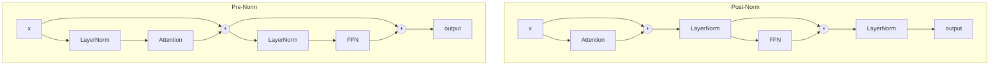
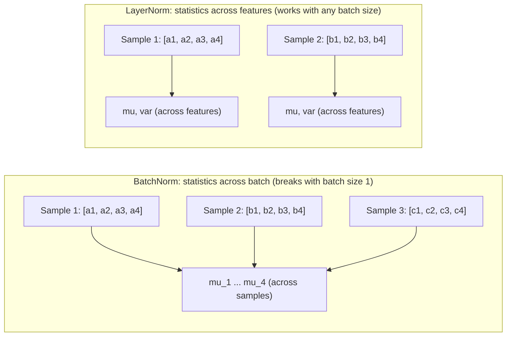

# Normalization Layers -- Deep Dive

## The Intuition

### What Problem Are We Solving?

Imagine you are stacking 96 layers of a neural network. Each layer receives the output of the layer before it, applies a linear transformation and a nonlinearity, and passes the result forward. The problem: as weights update during training, the output distribution of every layer shifts. Layer 47 receives inputs that looked roughly Gaussian yesterday, but today -- after a gradient update to layers 1 through 46 -- the distribution has drifted. Its mean might have jumped from 0 to 3, or its variance might have doubled.

This phenomenon is called **internal covariate shift**: the distribution of each layer's inputs changes as the preceding layers update. Layer 47 now has to simultaneously learn its own task *and* chase a moving input distribution. Multiply this across 96 layers and training becomes painfully slow, requiring tiny learning rates and careful initialization to avoid divergence.

Normalization layers fix this by standardizing the inputs to each layer. No matter what the preceding layers produce, normalization guarantees that activations arrive with controlled statistics -- zero mean and unit variance (LayerNorm) or unit root-mean-square (RMSNorm). Each layer sees a stable input distribution, so it can focus entirely on learning useful features.

### The Key Insight

**Normalization decouples "what direction" from "how big."** By stripping away the scale and shift of activations, we force the network to encode information in the *relative pattern* of features, not in their raw magnitudes. The learnable parameters $\gamma$ and $\beta$ then let the network add back whatever scale and shift it actually needs -- but now these are explicit, optimized quantities rather than accidental side effects of upstream weight changes.

### Real-World Analogy

Think of a team of relay runners where each runner can only see the baton speed when they receive it, not the entire race. If runner 3 suddenly starts sprinting twice as fast (a weight update), runner 4 receives a baton traveling at an unexpected speed and stumbles. Normalization is like installing a speed regulator at each handoff point: no matter how fast the baton arrives, it is normalized to a standard speed before the next runner grabs it. Each runner can then develop their own optimal technique without worrying about upstream surprises.

---

## The Math, Step by Step

### Building Up to LayerNorm

**Step 1 -- The simplest idea: just subtract the mean.**

Given a vector $x = [x_1, x_2, \ldots, x_D]$, compute its mean and center it:

$$x_{\text{centered}} = x - \mu, \qquad \mu = \frac{1}{D}\sum_{i=1}^{D} x_i$$

This removes shifts but does nothing about scale. If one layer produces activations in $[0, 1000]$ and another in $[0, 0.001]$, centering alone does not help.

**Step 2 -- Divide by the standard deviation.**

$$\hat{x} = \frac{x - \mu}{\sigma}, \qquad \sigma = \sqrt{\frac{1}{D}\sum_{i=1}^{D}(x_i - \mu)^2}$$

Now $\hat{x}$ has mean zero and unit variance. But this is too rigid -- maybe the network genuinely needs activations with a non-zero mean or a specific scale. Forcing everything to $\mathcal{N}(0, 1)$ can destroy useful information.

**Step 3 -- Add learnable scale and shift.**

$$y = \gamma \odot \hat{x} + \beta$$

The parameters $\gamma \in \mathbb{R}^D$ and $\beta \in \mathbb{R}^D$ let the network learn the ideal scale and offset for each feature. They are initialized to $\gamma = \mathbf{1}$ and $\beta = \mathbf{0}$, so at initialization the output is exactly $\hat{x}$.

**Step 4 -- Numerical safety.**

Division by $\sigma$ fails when all features are identical ($\sigma = 0$). Add a small constant $\epsilon$ inside the square root:

$$\hat{x} = \frac{x - \mu}{\sqrt{\sigma^2 + \epsilon}}$$

This is the full LayerNorm formula.

### The Core Equations

Given input $x \in \mathbb{R}^{B \times L \times D}$ (or $\mathbb{R}^{B \times D}$), normalization operates over the last dimension $D$:

$$\mu = \frac{1}{D}\sum_{i=1}^{D} x_i \quad \in \mathbb{R}^{B \times L \times 1}$$

$$\sigma^2 = \frac{1}{D}\sum_{i=1}^{D} (x_i - \mu)^2 \quad \in \mathbb{R}^{B \times L \times 1}$$

$$\sigma^{-1} = \frac{1}{\sqrt{\sigma^2 + \epsilon}} \quad \in \mathbb{R}^{B \times L \times 1}$$

$$\hat{x} = (x - \mu) \cdot \sigma^{-1} \quad \in \mathbb{R}^{B \times L \times D}$$

$$y = \gamma \odot \hat{x} + \beta \quad \in \mathbb{R}^{B \times L \times D}$$

Where:
- $\mu$: per-sample mean (one scalar per position in the batch/sequence)
- $\sigma^2$: per-sample variance (same shape as $\mu$)
- $\epsilon$: stability constant, typically $10^{-5}$
- $\gamma \in \mathbb{R}^D$: learnable scale, initialized to ones
- $\beta \in \mathbb{R}^D$: learnable shift, initialized to zeros
- $\odot$: elementwise multiplication (with broadcasting over $B$ and $L$ dimensions)

---

## LayerNorm Forward: Implementation Walkthrough

### The Data Structures

Before looking at code, here is what we need to track:

| What | Shape | Purpose |
|------|-------|---------|
| `gamma` | $(D,)$ | Learnable scale parameter |
| `beta` | $(D,)$ | Learnable shift parameter |
| `x_hat` (cached) | same as $x$ | Normalized input, needed for backward |
| `std_inv` (cached) | $(B, L, 1)$ or $(B, 1)$ | $1/\sqrt{\sigma^2 + \epsilon}$, needed for backward |
| `D` (cached) | scalar | Feature dimension size |

### The Code

```python
def forward(self, x: np.ndarray) -> np.ndarray:
    x = np.asarray(x, dtype=np.float64)
    D = self.normalized_shape

    mu = np.mean(x, axis=-1, keepdims=True)
    x_centered = x - mu
    var = np.mean(x_centered ** 2, axis=-1, keepdims=True)
    std_inv = 1.0 / np.sqrt(var + self.eps)
    x_hat = x_centered * std_inv
    y = self.gamma * x_hat + self.beta

    self._cache = {
        "x_hat": x_hat,
        "std_inv": std_inv,
        "D": D,
    }
    return y
```

**Line-by-line:**

- `x = np.asarray(x, dtype=np.float64)`: Cast to float64 to avoid precision issues in the variance computation. In production, float32/float16/bfloat16 is used with careful accumulation.
- `mu = np.mean(x, axis=-1, keepdims=True)`: Compute the mean over the last (feature) dimension. `keepdims=True` is critical: it produces shape $(B, L, 1)$ instead of $(B, L)$, enabling broadcasting when we subtract from the full $(B, L, D)$ tensor.
- `x_centered = x - mu`: Broadcasting: $(B, L, D) - (B, L, 1)$ subtracts the per-position mean from every feature.
- `var = np.mean(x_centered ** 2, axis=-1, keepdims=True)`: Variance via the **stable** formula. We center first, *then* square. This avoids catastrophic cancellation (discussed in detail later).
- `std_inv = 1.0 / np.sqrt(var + self.eps)`: Inverse standard deviation. $\epsilon$ is added **inside** `np.sqrt`, not outside.
- `x_hat = x_centered * std_inv`: The normalized tensor: zero mean, unit variance.
- `y = self.gamma * x_hat + self.beta`: NumPy broadcasts $\gamma$ of shape $(D,)$ against $\hat{x}$ of shape $(B, L, D)$, multiplying each feature by its own scale and adding its own shift.
- The cache stores $\hat{x}$, $\sigma^{-1}$, and $D$ -- exactly what the backward pass needs.

### The Tricky Parts

**Why `keepdims=True` everywhere?** Without it, `np.mean(x, axis=-1)` would reduce shape $(2, 5, 64)$ to $(2, 5)$. Then `x - mu` would fail because NumPy cannot broadcast $(2, 5, 64) - (2, 5)$. With `keepdims=True`, $\mu$ has shape $(2, 5, 1)$, and broadcasting works: each of the 64 features gets the same mean subtracted.

**Why cache `std_inv` instead of `var`?** The backward pass needs $\sigma^{-1}$, not $\sigma^2$. Caching the already-computed inverse avoids redundant work in `backward()`.

**Why not cache `x_centered`?** It can be reconstructed from `x_hat * (1/std_inv)` if needed, but the simplified backward formula only requires `x_hat` and `std_inv`, so caching `x_centered` would waste memory.

---

## LayerNorm Backward -- Step-by-Step Derivation

The backward pass for LayerNorm is the hardest part of this implementation. The difficulty arises because the mean $\mu$ and variance $\sigma^2$ are computed from *all* elements of $x$ along the feature dimension. When we perturb a single $x_i$, it changes $\mu$, which changes every $x_j - \mu$, which changes $\sigma^2$, which changes every $\hat{x}_j$. The Jacobian $\frac{\partial \hat{x}}{\partial x}$ is not diagonal -- it is a dense $D \times D$ matrix.

### Gradients for Learnable Parameters

These are straightforward because $\gamma$ and $\beta$ appear only in the final affine transform $y = \gamma \odot \hat{x} + \beta$.

**Gradient for** $\gamma$:

$$\frac{\partial \mathcal{L}}{\partial \gamma_j} = \sum_{b,l} \frac{\partial \mathcal{L}}{\partial y_{b,l,j}} \cdot \hat{x}_{b,l,j}$$

The sum is over batch and sequence dimensions because $\gamma$ is shared across all positions. The result has shape $(D,)$.

**Gradient for** $\beta$:

$$\frac{\partial \mathcal{L}}{\partial \beta_j} = \sum_{b,l} \frac{\partial \mathcal{L}}{\partial y_{b,l,j}}$$

Since $\beta$ is added directly, its gradient is just the sum of upstream gradients over all positions.

In code:

```python
sum_axes = tuple(range(grad_output.ndim - 1))  # all axes except the last
self.grad_gamma = np.sum(grad_output * x_hat, axis=sum_axes)  # shape: (D,)
self.grad_beta = np.sum(grad_output, axis=sum_axes)            # shape: (D,)
```

`sum_axes` is `(0,)` for 2D input or `(0, 1)` for 3D input -- everything except the feature dimension.

### Gradient for Input $x$ -- The Full Derivation

Let $\frac{\partial \mathcal{L}}{\partial y}$ be the upstream gradient. Define $g = \frac{\partial \mathcal{L}}{\partial y} \odot \gamma$ for convenience -- this is the gradient that has passed through the scale parameter.

**Step 1: Through the affine transform.** Since $y = \gamma \odot \hat{x} + \beta$:

$$\frac{\partial \mathcal{L}}{\partial \hat{x}} = \frac{\partial \mathcal{L}}{\partial y} \odot \gamma = g$$

**Step 2: Identify the three paths.** Since $\hat{x}_i = (x_i - \mu) \cdot \sigma^{-1}$, and both $\mu$ and $\sigma^{-1}$ depend on all $x_j$, we need to account for three paths through which $x_i$ affects the loss:

- Path A (direct): $x_i \to \hat{x}_i$, holding $\mu$ and $\sigma^{-1}$ fixed
- Path B (through $\mu$): $x_i \to \mu \to \hat{x}_j$ for all $j$
- Path C (through $\sigma^2$): $x_i \to \sigma^2 \to \sigma^{-1} \to \hat{x}_j$ for all $j$

**Step 3: Path A -- the direct path.**

Holding $\mu$ and $\sigma$ fixed:

$$\frac{\partial \hat{x}_i}{\partial x_i}\bigg|_{\mu,\sigma\text{ fixed}} = \sigma^{-1}$$

Contribution: $g_i \cdot \sigma^{-1}$

**Step 4: Path B -- through the mean.**

$$\frac{\partial \mu}{\partial x_i} = \frac{1}{D}$$

Every element contributes equally to the mean, so changing $x_i$ shifts $\mu$ by $1/D$. Since $\hat{x}_j = (x_j - \mu) \cdot \sigma^{-1}$, this shift affects all $\hat{x}_j$:

$$\frac{\partial \mathcal{L}}{\partial \mu} = \sum_d g_d \cdot \frac{\partial \hat{x}_d}{\partial \mu} = \sum_d g_d \cdot (-\sigma^{-1}) = -\sigma^{-1} \sum_d g_d$$

Contribution to $\frac{\partial \mathcal{L}}{\partial x_i}$:

$$\frac{\partial \mathcal{L}}{\partial \mu} \cdot \frac{\partial \mu}{\partial x_i} = -\frac{\sigma^{-1}}{D} \sum_d g_d$$

**Step 5: Path C -- through the variance.**

$$\frac{\partial \sigma^2}{\partial x_i} = \frac{2(x_i - \mu)}{D}$$

And using $\frac{\partial \sigma^{-1}}{\partial \sigma^2} = -\frac{1}{2}(\sigma^2 + \epsilon)^{-3/2}$:

$$\frac{\partial \mathcal{L}}{\partial \sigma^2} = \sum_d g_d \cdot (x_d - \mu) \cdot \left(-\frac{1}{2}\right)(\sigma^2 + \epsilon)^{-3/2}$$

Since $(x_d - \mu) = \hat{x}_d / \sigma^{-1}$:

$$\frac{\partial \mathcal{L}}{\partial \sigma^2} = -\frac{(\sigma^{-1})^3}{2} \cdot \frac{1}{\sigma^{-1}} \sum_d g_d \hat{x}_d = -\frac{(\sigma^{-1})^2}{2} \sum_d g_d \hat{x}_d$$

Contribution to $\frac{\partial \mathcal{L}}{\partial x_i}$:

$$\frac{\partial \mathcal{L}}{\partial \sigma^2} \cdot \frac{\partial \sigma^2}{\partial x_i} = -\frac{(\sigma^{-1})^2}{2} \sum_d g_d \hat{x}_d \cdot \frac{2(x_i - \mu)}{D}$$

$$= -\frac{(\sigma^{-1})^2}{D} \sum_d g_d \hat{x}_d \cdot \frac{\hat{x}_i}{\sigma^{-1}} = -\frac{\sigma^{-1} \hat{x}_i}{D} \sum_d g_d \hat{x}_d$$

(Note: the $\frac{\partial \mathcal{L}}{\partial \mu}$ path through $\sigma^2$ vanishes because $\sum_d (x_d - \mu) = 0$ by definition of the mean.)

**Step 6: Combine all three paths.**

$$\frac{\partial \mathcal{L}}{\partial x_i} = \underbrace{g_i \cdot \sigma^{-1}}_{\text{Path A: direct}} \underbrace{- \frac{\sigma^{-1}}{D} \sum_d g_d}_{\text{Path B: through } \mu} \underbrace{- \frac{\sigma^{-1} \hat{x}_i}{D} \sum_d g_d \hat{x}_d}_{\text{Path C: through } \sigma^2}$$

Factor out $\frac{\sigma^{-1}}{D}$:

$$\boxed{\frac{\partial \mathcal{L}}{\partial x} = \frac{\sigma^{-1}}{D}\left(D \cdot g - \sum_{d=1}^{D} g_d - \hat{x} \odot \sum_{d=1}^{D} g_d \cdot \hat{x}_d\right)}$$

This is the **simplified LayerNorm backward formula**. It requires exactly two reductions over the feature dimension: $\sum g$ and $\sum g \odot \hat{x}$.

### Why the Three Terms Make Sense

1. **$D \cdot g$**: The "naive" gradient, as if $\mu$ and $\sigma$ were constants. This is what you would get if normalization were just elementwise division by a fixed constant.
2. **$-\sum g$**: Correction for the mean. The mean subtraction creates coupling -- increasing $x_i$ decreases every $\hat{x}_j$ by shifting $\mu$. This term removes that shared component.
3. **$-\hat{x} \odot \sum g \hat{x}$**: Correction for the variance. Increasing $x_i$ changes the denominator $\sigma$, which rescales all outputs. This projection term accounts for that scaling effect.

### Backward Code

```python
def backward(self, grad_output: np.ndarray) -> np.ndarray:
    grad_output = np.asarray(grad_output, dtype=np.float64)
    x_hat = self._cache["x_hat"]
    std_inv = self._cache["std_inv"]
    D = self._cache["D"]

    sum_axes = tuple(range(grad_output.ndim - 1))
    self.grad_gamma = np.sum(grad_output * x_hat, axis=sum_axes)
    self.grad_beta = np.sum(grad_output, axis=sum_axes)

    g = grad_output * self.gamma

    sum_g = np.sum(g, axis=-1, keepdims=True)
    sum_g_xhat = np.sum(g * x_hat, axis=-1, keepdims=True)
    dx = (std_inv / D) * (D * g - sum_g - x_hat * sum_g_xhat)

    return dx
```

**Line-by-line:**

- `sum_axes = tuple(range(grad_output.ndim - 1))`: For 3D tensor $(B, L, D)$ this gives `(0, 1)`. For 2D $(B, D)$, this gives `(0,)`. These are the batch/sequence axes over which parameter gradients accumulate.
- `self.grad_gamma = np.sum(grad_output * x_hat, axis=sum_axes)`: $\sum_{b,l} \frac{\partial \mathcal{L}}{\partial y} \odot \hat{x}$. Shape: $(D,)$.
- `self.grad_beta = np.sum(grad_output, axis=sum_axes)`: $\sum_{b,l} \frac{\partial \mathcal{L}}{\partial y}$. Shape: $(D,)$.
- `g = grad_output * self.gamma`: Absorb $\gamma$ into the upstream gradient. Broadcasting applies $\gamma$ of shape $(D,)$ to the full tensor.
- `sum_g = np.sum(g, axis=-1, keepdims=True)`: First reduction, $\sum_d g_d$. Shape $(B, L, 1)$.
- `sum_g_xhat = np.sum(g * x_hat, axis=-1, keepdims=True)`: Second reduction, $\sum_d g_d \hat{x}_d$. Shape $(B, L, 1)$.
- `dx = (std_inv / D) * (D * g - sum_g - x_hat * sum_g_xhat)`: The combined formula. `std_inv` has shape $(B, L, 1)$ and broadcasts against the $(B, L, D)$ terms.

---

## RMSNorm -- How It Simplifies LayerNorm

### The Insight

Zhang and Sennrich (2019) asked: does the mean subtraction in LayerNorm actually matter for transformers? They found the answer is *no*. The re-scaling (dividing by a norm) is what stabilizes training. The re-centering (subtracting the mean) is optional. Removing it gives RMSNorm -- fewer operations, one fewer parameter, comparable performance.

### Forward Pass

Given input $x \in \mathbb{R}^{B \times L \times D}$:

$$\text{ms} = \frac{1}{D}\sum_{i=1}^{D} x_i^2 \qquad \text{(mean of squares)}$$

$$\text{RMS}^{-1} = \frac{1}{\sqrt{\text{ms} + \epsilon}}$$

$$\hat{x} = x \cdot \text{RMS}^{-1}$$

$$y = \gamma \odot \hat{x}$$

Note: no $\mu$ subtraction, no $\beta$ parameter. RMSNorm only scales, it does not center or shift.

```python
def forward(self, x: np.ndarray) -> np.ndarray:
    x = np.asarray(x, dtype=np.float64)
    D = self.normalized_shape

    ms = np.mean(x ** 2, axis=-1, keepdims=True)
    rms_inv = 1.0 / np.sqrt(ms + self.eps)
    x_hat = x * rms_inv
    y = x_hat * self.gamma

    self._cache = {
        "x_hat": x_hat,
        "rms_inv": rms_inv,
        "D": D,
    }
    return y
```

Compared to LayerNorm, side by side:

| LayerNorm | RMSNorm |
|-----------|---------|
| `mu = np.mean(x, ...)` | *(no mean computation)* |
| `x_centered = x - mu` | *(no centering)* |
| `var = np.mean(x_centered ** 2, ...)` | `ms = np.mean(x ** 2, ...)` |
| `std_inv = 1/sqrt(var + eps)` | `rms_inv = 1/sqrt(ms + eps)` |
| `x_hat = x_centered * std_inv` | `x_hat = x * rms_inv` |
| `y = gamma * x_hat + beta` | `y = x_hat * gamma` |

Two operations vanish: the mean computation and the mean subtraction. One parameter vanishes: $\beta$.

### RMSNorm Backward -- Derivation

The backward is simpler than LayerNorm because there is no mean to differentiate through. Let $g = \frac{\partial \mathcal{L}}{\partial y} \odot \gamma$.

**Gradient for $\gamma$:**

$$\frac{\partial \mathcal{L}}{\partial \gamma_j} = \sum_{b,l} \frac{\partial \mathcal{L}}{\partial y_{b,l,j}} \cdot \hat{x}_{b,l,j}$$

**Gradient for input -- two paths only (no mean path):**

Let $r = \text{RMS}(x) = \sqrt{\frac{1}{D}\sum x_j^2 + \epsilon}$, so $\hat{x}_i = x_i / r$ and $\text{RMS}^{-1} = 1/r$.

Path A (direct): $x_i$ affects $\hat{x}_i$ through the numerator, holding $r$ fixed:

$$\frac{\partial \hat{x}_i}{\partial x_i}\bigg|_{r \text{ fixed}} = \frac{1}{r} = \text{RMS}^{-1}$$

Path C (through RMS): $x_i$ affects $r$, which affects all $\hat{x}_j$:

$$\frac{\partial r}{\partial x_i} = \frac{1}{2r} \cdot \frac{2x_i}{D} = \frac{x_i}{D \cdot r}$$

$$\frac{\partial \hat{x}_j}{\partial r} = -\frac{x_j}{r^2}$$

Summing over all outputs:

$$\sum_j g_j \frac{\partial \hat{x}_j}{\partial r} \cdot \frac{\partial r}{\partial x_i} = \sum_j g_j \cdot \left(-\frac{x_j}{r^2}\right) \cdot \frac{x_i}{D \cdot r}$$

Since $x_j = \hat{x}_j \cdot r$:

$$= -\frac{1}{D \cdot r} \cdot x_i \cdot \frac{1}{r^2} \sum_j g_j \hat{x}_j r = -\frac{\hat{x}_i}{D \cdot r} \sum_j g_j \hat{x}_j$$

Wait -- let me redo this more carefully. We have $x_j / r^2 = \hat{x}_j / r$ and $x_i / (D \cdot r) = \hat{x}_i / D$:

$$= -\frac{1}{r} \cdot \frac{\hat{x}_i}{D} \sum_j g_j \hat{x}_j$$

Combining both paths:

$$\frac{\partial \mathcal{L}}{\partial x_i} = g_i \cdot \text{RMS}^{-1} - \text{RMS}^{-1} \cdot \frac{\hat{x}_i}{D} \sum_j g_j \hat{x}_j$$

$$\boxed{\frac{\partial \mathcal{L}}{\partial x} = \text{RMS}^{-1}\left(g - \hat{x} \cdot \frac{1}{D}\sum_{d=1}^{D} g_d \cdot \hat{x}_d\right)}$$

Compare to LayerNorm's formula: the $\sum g_d$ term is entirely absent. Only **one** reduction ($\sum g_d \hat{x}_d$) is needed instead of two.

### Backward Code

```python
def backward(self, grad_output: np.ndarray) -> np.ndarray:
    grad_output = np.asarray(grad_output, dtype=np.float64)
    x_hat = self._cache["x_hat"]
    rms_inv = self._cache["rms_inv"]
    D = self._cache["D"]

    sum_axes = tuple(range(grad_output.ndim - 1))
    self.grad_gamma = np.sum(grad_output * x_hat, axis=sum_axes)

    g = grad_output * self.gamma

    sum_g_xhat = np.sum(g * x_hat, axis=-1, keepdims=True)
    dx = rms_inv * (g - x_hat * (sum_g_xhat / D))

    return dx
```

The key difference from LayerNorm backward: no `sum_g` computation, no `sum_g` subtraction in the final formula. One fewer reduction, one fewer elementwise operation.

---

## Why RMSNorm Is Faster

The speed advantage comes from three sources, all of which compound when the operation is memory-bandwidth-bound:

### 1. Fewer Reductions (Biggest Impact)

A "reduction" reads all $D$ elements and produces one scalar. On a GPU, this requires synchronization across threads in a warp or block -- the most expensive coordination primitive in CUDA programming.

| | LayerNorm Forward | RMSNorm Forward |
|---|---|---|
| Reductions | 2 ($\mu$, then $\sigma^2$) | 1 (mean of squares) |
| Sequential dependency | $\sigma^2$ depends on $\mu$ | None |

LayerNorm's two forward reductions are *sequential*: you cannot compute the variance until you know the mean. RMSNorm's single reduction is self-contained. The backward shows the same pattern: LayerNorm needs two reductions ($\sum g$ and $\sum g \hat{x}$), RMSNorm needs only one ($\sum g \hat{x}$).

### 2. Fewer Elementwise Operations

| Operation | LayerNorm | RMSNorm |
|---|---|---|
| Mean subtraction ($x - \mu$) | Yes | No |
| Addition ($+\beta$) | Yes | No |
| Total ops per element (forward) | $\sim 6$ | $\sim 4$ |
| Total ops per element (backward) | $\sim 10$ | $\sim 6$ |

### 3. Fewer Parameters, Less Memory Traffic

RMSNorm has no $\beta$ parameter, saving $D$ parameter reads per forward pass and $D$ gradient writes per backward pass. For $D = 4096$, that is 16 KB less memory traffic per normalization per pass.

### Quantified Difference

For a single normalization over $D = 4096$ at one sequence position:

| | LayerNorm | RMSNorm | Savings |
|---|---|---|---|
| Read $x$ | 16 KB | 16 KB | 0 |
| Read params | 32 KB ($\gamma + \beta$) | 16 KB ($\gamma$ only) | 16 KB |
| Write output | 16 KB | 16 KB | 0 |
| Compute | $\sim 8D$ FLOPs | $\sim 5D$ FLOPs | $\sim 37\%$ |
| Reductions (fwd+bwd) | 4 | 2 | $50\%$ |

In practice, benchmarks show RMSNorm is $10\text{--}30\%$ faster than LayerNorm in fused CUDA kernels.

---

## Worked Example -- LayerNorm Forward and Backward with Numbers

### Setup

```
Input:   x = [[1, 2, 3, 4]]     shape: (1, 4), so B=1, D=4
Gamma:   gamma = [1, 1, 1, 1]   (default initialization)
Beta:    beta  = [0, 0, 0, 0]   (default initialization)
Epsilon: eps = 1e-5
```

### Forward Pass

**Step 1: Mean.**

$$\mu = \frac{1 + 2 + 3 + 4}{4} = 2.5$$

**Step 2: Center.**

$$x - \mu = [1 - 2.5, \; 2 - 2.5, \; 3 - 2.5, \; 4 - 2.5] = [-1.5, \; -0.5, \; 0.5, \; 1.5]$$

**Step 3: Variance.**

$$\sigma^2 = \frac{(-1.5)^2 + (-0.5)^2 + 0.5^2 + 1.5^2}{4} = \frac{2.25 + 0.25 + 0.25 + 2.25}{4} = \frac{5.0}{4} = 1.25$$

**Step 4: Inverse standard deviation.**

$$\sigma^{-1} = \frac{1}{\sqrt{1.25 + 10^{-5}}} = \frac{1}{\sqrt{1.25001}} \approx 0.894423$$

**Step 5: Normalize.**

$$\hat{x} = [-1.5, \; -0.5, \; 0.5, \; 1.5] \times 0.894423 = [-1.34164, \; -0.44721, \; 0.44721, \; 1.34164]$$

**Step 6: Scale and shift.** With $\gamma = \mathbf{1}$, $\beta = \mathbf{0}$: $y = \hat{x}$.

**Verify:** $\text{mean}(y) = (-1.34164 - 0.44721 + 0.44721 + 1.34164) / 4 = 0.0$. Check. $\text{var}(y) = (1.8 + 0.2 + 0.2 + 1.8) / 4 = 1.0$. Check.

### Backward Pass

Suppose the upstream gradient is:

$$\frac{\partial \mathcal{L}}{\partial y} = [1, 0, -1, 2]$$

**Step 1: Parameter gradients.**

$$\frac{\partial \mathcal{L}}{\partial \gamma} = \frac{\partial \mathcal{L}}{\partial y} \odot \hat{x} = [1 \times (-1.34164),\; 0 \times (-0.44721),\; (-1) \times 0.44721,\; 2 \times 1.34164]$$

$$= [-1.34164,\; 0,\; -0.44721,\; 2.68328]$$

$$\frac{\partial \mathcal{L}}{\partial \beta} = \frac{\partial \mathcal{L}}{\partial y} = [1,\; 0,\; -1,\; 2]$$

**Step 2: Compute** $g$.

$$g = \frac{\partial \mathcal{L}}{\partial y} \odot \gamma = [1, 0, -1, 2] \odot [1, 1, 1, 1] = [1, 0, -1, 2]$$

**Step 3: First reduction.**

$$\sum_d g_d = 1 + 0 + (-1) + 2 = 2$$

**Step 4: Second reduction.**

$$\sum_d g_d \hat{x}_d = 1(-1.34164) + 0(-0.44721) + (-1)(0.44721) + 2(1.34164)$$

$$= -1.34164 + 0 - 0.44721 + 2.68328 = 0.89443$$

**Step 5: Apply the formula.**

$$\frac{\partial \mathcal{L}}{\partial x} = \frac{\sigma^{-1}}{D}\left(D \cdot g - \sum g - \hat{x} \cdot \sum g\hat{x}\right)$$

$$= \frac{0.894423}{4}\left(4 \cdot [1, 0, -1, 2] - 2 - [-1.34164, -0.44721, 0.44721, 1.34164] \times 0.89443\right)$$

Working through each element:

| $i$ | $4g_i$ | $-\sum g$ | $-\hat{x}_i \sum g\hat{x}$ | Sum | $\times \frac{\sigma^{-1}}{D} = 0.22361$ |
|---|---|---|---|---|---|
| 1 | 4 | $-2$ | $-(-1.34164)(0.89443) = +1.2$ | $3.2$ | $0.71554$ |
| 2 | 0 | $-2$ | $-(-0.44721)(0.89443) = +0.4$ | $-1.6$ | $-0.35777$ |
| 3 | $-4$ | $-2$ | $-(0.44721)(0.89443) = -0.4$ | $-6.4$ | $-1.43108$ |
| 4 | 8 | $-2$ | $-(1.34164)(0.89443) = -1.2$ | $4.8$ | $1.07331$ |

$$\frac{\partial \mathcal{L}}{\partial x} \approx [0.716,\; -0.358,\; -1.431,\; 1.073]$$

**Sanity check:** The sum $0.716 - 0.358 - 1.431 + 1.073 = 0.0$. This must be zero because the mean subtraction in the forward pass kills any uniform shift in $x$. If we perturb all $x_i$ by the same amount, $\mu$ shifts by that amount and $\hat{x}$ does not change at all. So the gradient must sum to zero.

---

## Pre-norm vs Post-norm

### The Two Arrangements

**Post-norm** (original transformer, BERT):

$$x_1 = \text{LayerNorm}(x + \text{Attention}(x))$$

$$x_2 = \text{LayerNorm}(x_1 + \text{FFN}(x_1))$$

**Pre-norm** (GPT-2, LLaMA, Mistral):

$$x_1 = x + \text{Attention}(\text{LayerNorm}(x))$$

$$x_2 = x_1 + \text{FFN}(\text{LayerNorm}(x_1))$$



### Why Pre-norm Wins for Deep Networks

The critical difference is in the **gradient highway**. In pre-norm, the residual connection creates a direct additive path:

$$x_1 = x + f(\text{LN}(x))$$

Taking the gradient:

$$\frac{\partial x_1}{\partial x} = I + \frac{\partial f(\text{LN}(x))}{\partial x}$$

The identity matrix $I$ provides an unimpeded gradient path. No matter how much the second term $\frac{\partial f}{\partial x}$ shrinks through many layers, the identity term always passes gradients through unchanged. This is the "gradient highway."

In post-norm, the residual stream passes through LayerNorm:

$$x_1 = \text{LN}(x + f(x))$$

Now gradients from $x_1$ to $x$ must flow through the LayerNorm backward pass, which involves division by $\sigma$ and the projection terms that subtract $\frac{\sum g}{D}$ and $\frac{\hat{x} \sum g\hat{x}}{D}$. These operations attenuate gradient magnitude. After 96 layers, this repeated attenuation can cause vanishing gradients.

**Practical consequence:** Post-norm requires careful learning rate warmup and gradient clipping. Pre-norm trains stably even at 100+ layers with simple optimizer settings. This is why every modern LLM uses pre-norm.

**Final LayerNorm:** Pre-norm architectures typically add one final normalization after the last transformer block, before the output projection. This is necessary because the pre-norm design leaves the residual stream unnormalized at the output.

| Architecture | Norm Placement | Models |
|---|---|---|
| Post-norm | After residual add | Original Transformer, BERT |
| Pre-norm + LayerNorm | Before sublayer | GPT-2, GPT-3 |
| Pre-norm + RMSNorm | Before sublayer | LLaMA, LLaMA 2, Mistral, Gemma |

---

## Why Not BatchNorm?

BatchNorm normalizes across the **batch** dimension: for each feature, it computes statistics over all samples in the mini-batch.

$$\mu_B = \frac{1}{B}\sum_{b=1}^{B} x_b, \qquad \sigma_B^2 = \frac{1}{B}\sum_{b=1}^{B}(x_b - \mu_B)^2$$

This creates five problems for transformers:

### Problem 1: Batch Size 1 at Inference

Autoregressive generation processes one token at a time. With $B = 1$:

$$\mu_B = x, \qquad \sigma_B^2 = 0$$

The normalized output is $\frac{x - x}{\sqrt{0 + \epsilon}} = \frac{0}{\sqrt{\epsilon}} = 0$ -- all information destroyed. The "normalization" has collapsed every input to the same constant output.

### Problem 2: Running Statistics Are a Poor Substitute

BatchNorm's workaround is to maintain running averages of $\mu$ and $\sigma^2$ during training, then use them at inference. But these running statistics were computed over training batches with specific properties (batch size, data distribution) that may not match inference conditions -- especially for long sequences or out-of-distribution inputs.

### Problem 3: Train/Inference Behavioral Gap

BatchNorm behaves differently during training (uses batch statistics) and inference (uses running statistics). This means a model can behave differently at training and inference time, complicating debugging, deployment, and reproducibility. You need a `model.eval()` flag -- one more thing to get wrong.

### Problem 4: Variable-Length Sequences

A batch of sequences with different lengths requires padding. Padding tokens contaminate batch statistics. Masking adds complexity and still produces length-dependent normalization.

### Problem 5: Cross-Sample Coupling

With BatchNorm, each sample's output depends on the other samples in the batch. This breaks the independence assumption and makes results depend on batch composition.

### LayerNorm and RMSNorm Avoid All of This

They normalize within each sample independently, use only that sample's own statistics, and behave identically at training and inference time. No running averages, no batch dependence, no special inference mode. This is why the implementation has no `training` flag and no running statistics -- there is nothing to switch between.



---

## Epsilon Placement -- Inside sqrt vs Outside

### The Correct Way

$$\sigma^{-1} = \frac{1}{\sqrt{\sigma^2 + \epsilon}}$$

```python
std_inv = 1.0 / np.sqrt(var + eps)    # Correct: eps INSIDE sqrt
```

### The Wrong Way

$$\sigma^{-1} = \frac{1}{\sqrt{\sigma^2} + \epsilon}$$

```python
std_inv = 1.0 / (np.sqrt(var) + eps)   # Wrong: eps OUTSIDE sqrt
```

### Why It Matters

For $\sigma^2 = 0$ (all inputs identical):

| Method | Value |
|---|---|
| Inside: $1/\sqrt{0 + 10^{-5}}$ | $= 1/\sqrt{10^{-5}} = 1/0.00316 \approx 316.2$ |
| Outside: $1/(\sqrt{0} + 10^{-5})$ | $= 1/10^{-5} = 100{,}000$ |

The outside version produces a normalization factor **$316\times$ too large**, which blows up the normalized values and injects enormous gradients.

For small $\sigma^2 = 10^{-10}$:

| Method | Value |
|---|---|
| Inside: $1/\sqrt{10^{-10} + 10^{-5}}$ | $\approx 1/\sqrt{10^{-5}} = 316.2$ |
| Outside: $1/(\sqrt{10^{-10}} + 10^{-5})$ | $= 1/(10^{-5} + 10^{-5}) = 50{,}000$ |

The inside version transitions smoothly: as variance shrinks below $\epsilon$, $\sigma^{-1}$ saturates at $1/\sqrt{\epsilon}$. The outside version has a kink in its derivative at $\sigma^2 = 0$ (because $\sqrt{\cdot}$ has infinite derivative at zero), creating discontinuous gradients.

### Catastrophic Cancellation in Variance

The variance computation itself can go wrong with the alternative formula. Consider $x = [1000000, 1000001]$:

**Stable formula** (used in our implementation):

$$\mu = 1000000.5$$

$$(x - \mu) = [-0.5, 0.5]$$

$$\sigma^2 = \frac{(-0.5)^2 + (0.5)^2}{2} = 0.25 \quad \checkmark$$

**Unstable formula** ($E[x^2] - \mu^2$):

$$E[x^2] = \frac{10^{12} + 2 \times 10^{6} + 1}{2} + \frac{10^{12}}{2} \approx 1.000001000 \times 10^{12}$$

$$\mu^2 = (1000000.5)^2 \approx 1.000001000 \times 10^{12}$$

$$\sigma^2 = E[x^2] - \mu^2 = 0.25$$

In exact arithmetic this works. But in float64 with $\sim 15$ significant digits, the subtraction $10^{12} - 10^{12}$ loses nearly all precision. In float32 ($7$ significant digits), the result can be *negative* due to rounding -- and taking the square root of a negative number gives NaN.

This is why the implementation computes `var = np.mean(x_centered ** 2, ...)` (subtract the mean first, then square), not `np.mean(x**2, ...) - mu**2`.

---

## Complexity Analysis

### Time Complexity

| Operation | LayerNorm | RMSNorm | Why |
|---|---|---|---|
| Forward | $O(B \cdot L \cdot D)$ | $O(B \cdot L \cdot D)$ | Each element is read once per reduction; there are $O(1)$ reductions |
| Backward ($dx$) | $O(B \cdot L \cdot D)$ | $O(B \cdot L \cdot D)$ | Two reductions (LN) or one (RMS), each over $D$ elements, plus elementwise ops |
| Backward ($d\gamma$, $d\beta$) | $O(B \cdot L \cdot D)$ | $O(B \cdot L \cdot D)$ | Sum over batch/sequence dimensions |

Both are $O(N)$ where $N = B \cdot L \cdot D$ is the total number of elements. No matrix multiplications, no quadratic operations. The difference is in the constant factor: LayerNorm does $\sim 8$ operations per element in the forward pass, RMSNorm $\sim 5$.

### Space Complexity

| What | LayerNorm | RMSNorm |
|---|---|---|
| Parameters | $O(D)$ for $\gamma$ + $O(D)$ for $\beta$ | $O(D)$ for $\gamma$ only |
| Cached $\hat{x}$ | $O(B \cdot L \cdot D)$ | $O(B \cdot L \cdot D)$ |
| Cached $\sigma^{-1}$ / $\text{RMS}^{-1}$ | $O(B \cdot L)$ | $O(B \cdot L)$ |
| Working memory | $O(B \cdot L \cdot D)$ | $O(B \cdot L \cdot D)$ |

The dominant cost is caching $\hat{x}$ for the backward pass. At $D = 4096$, $B = 32$, $L = 2048$, that is $32 \times 2048 \times 4096 \times 4$ bytes $= 1$ GB per LayerNorm in float32. With 65 norms in a 32-layer model, that is 65 GB just for normalization caches during training. This is why activation checkpointing (recomputing the forward pass during backward instead of caching) is essential for large models.

### The Bottleneck

Normalization is **memory-bandwidth-bound**, not compute-bound. For hidden dimension $D = 4096$ at a single sequence position:

| Quantity | Value |
|---|---|
| Read input $x$ | $D \times 4 = 16$ KB |
| Read $\gamma$, $\beta$ | $2D \times 4 = 32$ KB |
| Write output $y$ | $D \times 4 = 16$ KB |
| **Total memory** | **64 KB** |
| **Total compute** | **$\sim 8D = 32\text{K FLOPs}$** |

$$\text{Arithmetic intensity} = \frac{32\text{K FLOPs}}{64\text{ KB}} = 0.5 \text{ FLOPs/byte}$$

An A100 GPU has a compute-to-bandwidth ratio of $312 \text{ TFLOPS} / 2 \text{ TB/s} = 156 \text{ FLOPs/byte}$. Normalization at $0.5$ FLOPs/byte is **$312\times$ below the ridge point**. The GPU's arithmetic units are idle $>99\%$ of the time, waiting for data to move from HBM to registers. The only way to speed this up is to reduce memory traffic -- which is exactly what kernel fusion does.

---

## Common Pitfalls

### Pitfall 1: Epsilon Outside the Square Root

**The mistake:**
```python
# Wrong -- epsilon is outside sqrt
std_inv = 1.0 / (np.sqrt(var) + eps)
```

**Why it is wrong:** When `var = 0`, `np.sqrt(0)` produces 0, and $1/(0 + 10^{-5}) = 100{,}000$. The correct value is $1/\sqrt{10^{-5}} = 316.2$. The error is a factor of $316\times$, which produces enormous normalized values and exploding gradients.

**The fix:**
```python
# Correct -- epsilon inside sqrt
std_inv = 1.0 / np.sqrt(var + eps)
```

### Pitfall 2: Unstable Variance Formula

**The mistake:**
```python
# Wrong -- catastrophic cancellation for large inputs
mu = np.mean(x, axis=-1, keepdims=True)
var = np.mean(x ** 2, axis=-1, keepdims=True) - mu ** 2
```

**Why it is wrong:** When $E[x^2] \approx \mu^2$ (which happens whenever the mean is large compared to the spread), subtracting two nearly equal large numbers loses most significant digits. Can produce negative variance, leading to NaN from the square root.

**The fix:**
```python
# Correct -- subtract mean first, then square
mu = np.mean(x, axis=-1, keepdims=True)
x_centered = x - mu
var = np.mean(x_centered ** 2, axis=-1, keepdims=True)
```

### Pitfall 3: Missing keepdims in Reductions

**The mistake:**
```python
# Wrong -- shape mismatch in broadcast
mu = np.mean(x, axis=-1)          # shape (B, L), not (B, L, 1)
x_centered = x - mu               # fails: (B, L, D) - (B, L) = ???
```

**Why it is wrong:** Without `keepdims=True`, the reduction collapses the last dimension entirely. NumPy cannot broadcast $(B, L, D) - (B, L)$ in the intended way.

**The fix:**
```python
# Correct -- keepdims preserves the dimension for broadcasting
mu = np.mean(x, axis=-1, keepdims=True)   # shape (B, L, 1)
x_centered = x - mu                        # (B, L, D) - (B, L, 1) = (B, L, D)
```

### Pitfall 4: Summing Parameter Gradients Over the Wrong Axes

**The mistake:**
```python
# Wrong -- sums over the feature dimension (or all dims)
self.grad_gamma = np.sum(grad_output * x_hat, axis=-1)   # shape (B, L), not (D,)
```

**Why it is wrong:** $\gamma$ has shape $(D,)$. Its gradient must also have shape $(D,)$. We need to sum over all non-feature dimensions (batch and sequence), preserving the feature dimension.

**The fix:**
```python
# Correct -- sum over batch and sequence dims, keep feature dim
sum_axes = tuple(range(grad_output.ndim - 1))  # (0,) or (0, 1)
self.grad_gamma = np.sum(grad_output * x_hat, axis=sum_axes)  # shape (D,)
```

---

## Connection to Inference Optimization

### What Gets Optimized

Normalization is purely **memory-bandwidth-bound**. At $\sim 0.5$ FLOPs/byte, the GPU spends almost all its time moving data between HBM and compute units, not actually computing. This makes normalization a primary target for kernel fusion: combining it with adjacent operations so intermediate tensors never touch global memory.

### Kernel Fusion in Practice

The key insight: if normalization is preceded by a residual addition and followed by a linear projection, we can fuse operations so that intermediate tensors stay in registers.

```mermaid
graph TD
    subgraph Without["Without fusion (3 kernel launches, 9 global memory accesses)"]
        direction LR
        W1["x, attn_output"] -->|"read 2, write 1"| W2["residual = x + attn_output"]
        W2 -->|"read 2, write 1"| W3["normalized = rmsnorm(residual, gamma)"]
        W3 -->|"read 2, write 1"| W4["projected = normalized @ W_q"]
    end

    subgraph With["With fusion (2 kernel launches, 7 global memory accesses)"]
        direction LR
        F1["x, attn_output, gamma"] -->|"read 3, write 1"| F2["res_normed = fused_add_rmsnorm(...)"]
        F2 -->|"read 2, write 1"| F3["projected = res_normed @ W_q"]
    end
```



The fused kernel reads $x$, `attn_output`, and $\gamma$ once, computes the residual addition and RMSNorm entirely in registers/shared memory, and writes only the final result. Two full tensor trips through global memory are eliminated.

### Common Fused Patterns in Inference Engines

| Fused Pattern | Operations Combined | Memory Savings |
|---|---|---|
| Residual + RMSNorm | Add + RMS + normalize + scale | 1 intermediate tensor eliminated |
| RMSNorm + Linear | Normalize + matmul | 1 intermediate tensor eliminated |
| Residual + RMSNorm + Quantize | Add + normalize + int8 cast | 2 intermediates eliminated |
| Residual + RMSNorm + SiLU | Full FFN input processing | 2 intermediates eliminated |

These patterns are implemented in vLLM, TensorRT-LLM, and TGI (Text Generation Inference).

### RMSNorm in Modern LLMs

Every major open-weight LLM since LLaMA uses RMSNorm:

| Model | Norm Type | Hidden Dim | Layers | Total Norms |
|---|---|---|---|---|
| LLaMA 7B | RMSNorm | 4096 | 32 | 65 ($32 \times 2 + 1$) |
| LLaMA 70B | RMSNorm | 8192 | 80 | 161 ($80 \times 2 + 1$) |
| Mistral 7B | RMSNorm | 4096 | 32 | 65 |
| Gemma 7B | RMSNorm | 3072 | 28 | 57 |

For LLaMA 7B at sequence length 2048, batch size 1, in bfloat16:

$$\text{Memory traffic per norm} = 2 \times 2048 \times 4096 \times 2 \text{ bytes} \approx 32 \text{ MB}$$

$$\text{Total norm traffic (65 norms)} \approx 2 \text{ GB per forward pass}$$

At $2$ TB/s memory bandwidth, this is $\sim 1$ ms just for normalization -- before accounting for redundant writes when outputs are immediately read by the next kernel. Fusion eliminates much of this redundancy.

### From Naive to Optimized

| Aspect | Naive (this implementation) | Optimized (production CUDA kernel) |
|---|---|---|
| Statistics | Separate mean, variance passes | Single-pass Welford's online algorithm |
| Intermediates | Full tensors materialized in memory | Values stay in registers/shared memory |
| Reductions | Sequential `np.mean` calls | Warp-level `__shfl_xor_sync` primitives |
| Precision | float64 throughout | BFloat16 input, float32 accumulation |
| Caching | Full $\hat{x}$ tensor for backward | Recompute from cached $\mu$, $\sigma^{-1}$ (saves memory) |
| Parallelism | Single-threaded NumPy | One thread block per sequence position |

Understanding our naive implementation is essential because it tells you exactly what the fused kernel must compute: what reductions are needed, what values must be cached, and how gradients flow. The CUDA version is a translation of the same math into hardware-aware memory access patterns, not a different algorithm.

---

## Testing Your Understanding

### Quick Checks

1. What would happen if we removed the $\epsilon$ from $\sqrt{\sigma^2 + \epsilon}$ and fed in a vector of identical values like $[5, 5, 5, 5]$?
2. Why does the LayerNorm input gradient $\frac{\partial \mathcal{L}}{\partial x}$ always sum to zero along the feature dimension?
3. If the input shape is $(4, 8, 512)$, what are the shapes of $\mu$, $\gamma$, $\hat{x}$, and $\frac{\partial \mathcal{L}}{\partial \gamma}$?
4. Why does RMSNorm's backward have one reduction but LayerNorm's has two?
5. Why can we not use `np.var(x, axis=-1)` directly instead of computing `np.mean((x - mu)**2, axis=-1)`? (They compute the same thing mathematically, but one controls the order of operations.)
6. What would happen if we initialized $\gamma = \mathbf{0}$ instead of $\gamma = \mathbf{1}$?

### Exercises

1. **Easy**: Verify the `gradient_check` utility by introducing a deliberate bug in the backward pass (e.g., drop the $\sum g$ term) and confirm that `gradient_check` detects it.
2. **Medium**: Implement a `GroupNorm` class that divides the $D$ features into $G$ groups and applies LayerNorm independently within each group. It should reduce to LayerNorm when $G = 1$.
3. **Hard**: Write a version of LayerNorm that recomputes the forward pass from cached $x$ during backward (instead of caching $\hat{x}$), trading compute for memory. This is the "activation checkpointing" pattern used to train very large models.

---

## Summary

### Key Takeaways

- **Normalization stabilizes training** by ensuring each layer sees inputs with predictable statistics, combating internal covariate shift and improving gradient flow.
- **LayerNorm** normalizes to zero mean and unit variance per-sample using two reductions ($\mu$, $\sigma^2$) and two learnable parameters ($\gamma$, $\beta$). Its backward pass requires two reductions ($\sum g$ and $\sum g\hat{x}$).
- **RMSNorm** drops the mean subtraction entirely, keeping only the re-scaling. One reduction in forward and one in backward, no $\beta$ parameter. Comparable quality for transformers.
- **Pre-norm placement** (normalize before each sublayer) creates a gradient highway via the residual connection, enabling stable training of 100+ layer networks. Post-norm blocks this highway.
- **BatchNorm fails for transformers** because it requires meaningful batch statistics, which do not exist at batch size 1 during autoregressive inference.
- **Epsilon goes inside the square root** ($\sqrt{\sigma^2 + \epsilon}$, not $\sqrt{\sigma^2} + \epsilon$), and **variance must use the centered formula** ($\text{mean}((x-\mu)^2)$, not $\text{mean}(x^2) - \mu^2$) to avoid catastrophic cancellation.
- **Normalization is memory-bandwidth-bound** at $\sim 0.5$ FLOPs/byte, far below the GPU compute ridge at $\sim 156$ FLOPs/byte. Kernel fusion is the primary optimization.

### Quick Reference

```
LayerNorm
  Forward:  mu -> center -> var -> normalize -> scale + shift
            2 reductions, ~6 ops/element
  Backward: g = dL/dy * gamma
            dx = (std_inv / D) * (D*g - sum(g) - x_hat * sum(g*x_hat))
            2 reductions
  Params:   gamma (D,), beta (D,)
  Cache:    x_hat (B,L,D), std_inv (B,L,1)

RMSNorm
  Forward:  mean_sq -> rms_inv -> normalize -> scale
            1 reduction, ~4 ops/element
  Backward: g = dL/dy * gamma
            dx = rms_inv * (g - x_hat * (1/D) * sum(g*x_hat))
            1 reduction
  Params:   gamma (D,) only
  Cache:    x_hat (B,L,D), rms_inv (B,L,1)

Used by:      LLaMA, Mistral, Gemma (RMSNorm)
              GPT-2, GPT-3, BERT (LayerNorm)
Optimized by: Fused residual+norm CUDA kernels (Triton, CUTLASS)
Bottleneck:   Memory bandwidth, not compute (~0.5 FLOPs/byte)
```
