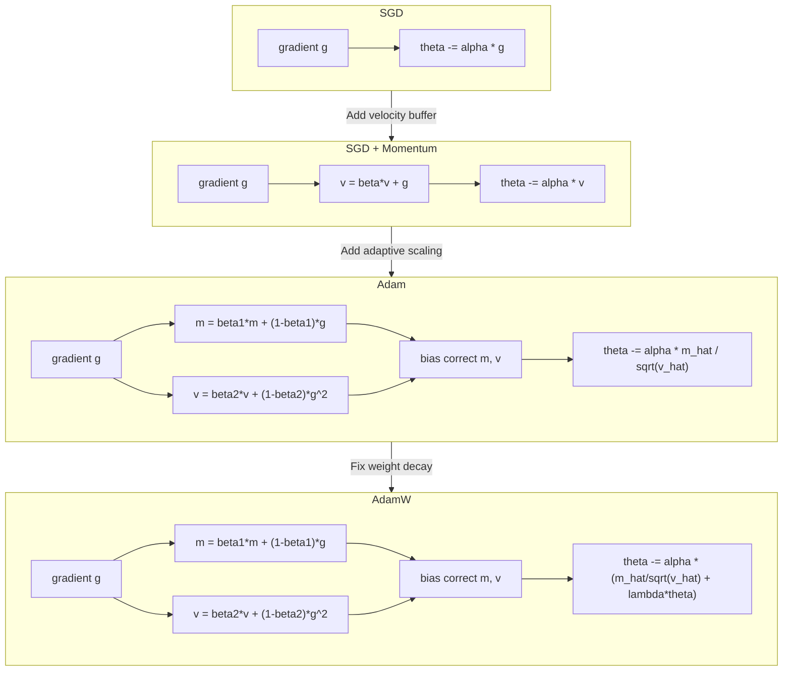
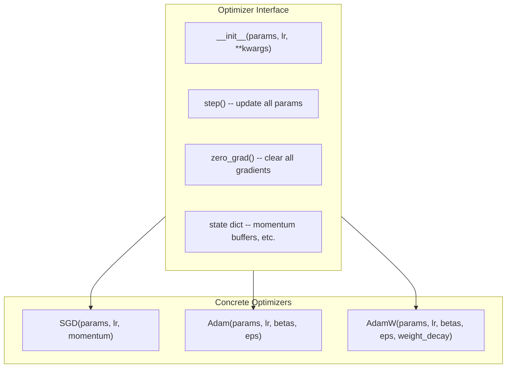

# Optimizers

**Phase 2 · Topic 3** — The update rules that determine how (and whether) your model learns. AdamW is the default for every modern LLM.

## What it is

Optimizers take gradients computed via backpropagation and convert them into weight updates. The MLP we just built uses vanilla gradient descent: $w \leftarrow w - \alpha \cdot g$. This works but is painfully slow on real problems. The choice of optimizer affects training speed, stability, and final model quality more than almost any other hyperparameter. A poor optimizer can make training diverge; a good one finds good minima efficiently.

The progression from SGD to Adam to AdamW represents decades of research into why adaptive learning rates work better than fixed ones, and why the original Adam paper got weight decay wrong. AdamW is now the default for training every large language model -- GPT-3, LLaMA, Mistral, Gemma -- and understanding why requires understanding the entire lineage. Each optimizer in this progression solves a specific failure mode of the previous one.

The key insight behind adaptive optimizers is that different parameters need different learning rates. Parameters with sparse gradients (like embedding layers) need larger effective learning rates; parameters with dense, consistent gradients need smaller ones. Adam handles this automatically by tracking per-parameter gradient statistics. AdamW then fixes Adam's broken weight decay, which is why it is the universal choice for LLM training.

These optimizers are standalone classes with a unified interface: each has a `step(params, grads)` method that updates parameters in-place. They are not tied to the MLP -- they can be plugged into any model that produces gradients.

## The math

### SGD (Stochastic Gradient Descent)

The simplest update rule. Move in the direction opposite to the gradient, scaled by learning rate.

$$\theta_{t+1} = \theta_t - \alpha \cdot g_t$$

Where:
- $\theta_t \in \mathbb{R}^d$ is the parameter vector at step $t$
- $\alpha \in \mathbb{R}$ is the learning rate (typically 0.01 to 0.1)
- $g_t = \nabla_\theta \mathcal{L}$ is the gradient at step $t$

**Default hyperparameters:** $\alpha = 0.01$

**Problem:** SGD oscillates in ravines -- narrow valleys in the loss landscape with steep sides. The gradient points mostly across the ravine (toward the walls), not along it (toward the minimum). Progress is slow and noisy: the optimizer bounces back and forth between the walls while creeping forward. This is the fundamental failure mode that momentum was invented to solve.

**Full pseudocode:**

$$
\boxed{
\begin{aligned}
&\textbf{SGD} \\
&\textbf{Input: } \theta_0, \alpha \\
&\textbf{for } t = 1, 2, \ldots \textbf{ do} \\
&\quad g_t \leftarrow \nabla_\theta \mathcal{L}(\theta_{t-1}) \\
&\quad \theta_t \leftarrow \theta_{t-1} - \alpha \cdot g_t \\
&\textbf{end for}
\end{aligned}
}
$$

---

### SGD with Momentum

Accumulate a velocity vector that smooths out oscillations and accelerates in consistent gradient directions.

$$v_t = \beta \cdot v_{t-1} + g_t$$

$$\theta_{t+1} = \theta_t - \alpha \cdot v_t$$

Where:
- $v_t \in \mathbb{R}^d$ is the velocity (momentum buffer) at step $t$
- $\beta \in \mathbb{R}$ is the momentum coefficient (typically 0.9)
- $v_0 = 0$ (initialized to zero)

**Default hyperparameters:** $\alpha = 0.01$, $\beta = 0.9$

**The ball rolling down a hill analogy:**

Imagine a ball rolling down a hilly terrain toward the lowest point. Vanilla SGD teleports the ball at each step based only on the local slope -- if the slope points left, the ball jumps left, regardless of where it was heading before. With momentum, the ball has physical inertia. It accumulates velocity as it rolls: if the hill consistently slopes downward in one direction, the ball accelerates. If the terrain oscillates (slopes left then right then left), the velocity in the oscillating direction cancels out while the velocity in the consistent downhill direction builds up.

Concretely, with $\beta = 0.9$, the velocity is an exponential moving average with an effective window of $\sim 1/(1 - \beta) = 10$ steps. Gradients that point the same way for 10 steps build up substantial velocity. Gradients that alternate directions every step cancel to near zero.

**Step by step:**
1. Compute gradient $g_t$ via backpropagation
2. Update velocity: $v_t = \beta \cdot v_{t-1} + g_t$ (add current gradient to decayed previous velocity)
3. Update parameters: $\theta_t = \theta_{t-1} - \alpha \cdot v_t$ (move by velocity scaled by learning rate)

**Full pseudocode:**

$$
\boxed{
\begin{aligned}
&\textbf{SGD + Momentum} \\
&\textbf{Input: } \theta_0, \alpha, \beta \\
&v_0 \leftarrow 0 \\
&\textbf{for } t = 1, 2, \ldots \textbf{ do} \\
&\quad g_t \leftarrow \nabla_\theta \mathcal{L}(\theta_{t-1}) \\
&\quad v_t \leftarrow \beta \cdot v_{t-1} + g_t \\
&\quad \theta_t \leftarrow \theta_{t-1} - \alpha \cdot v_t \\
&\textbf{end for}
\end{aligned}
}
$$

**Nesterov momentum (optional variant):**

Nesterov computes the gradient at the "lookahead" position $\theta - \alpha \beta v$ instead of at the current position. This gives a better estimate of where the ball is actually heading:

$$v_t = \beta \cdot v_{t-1} + \nabla_\theta \mathcal{L}(\theta_t - \alpha \beta v_{t-1})$$

$$\theta_{t+1} = \theta_t - \alpha \cdot v_t$$

In practice, Nesterov gives slightly faster convergence but is rarely used with Adam-family optimizers.

---

### Adam (Adaptive Moment Estimation)

Maintains per-parameter adaptive learning rates using estimates of the first moment (mean) and second moment (uncentered variance) of gradients. This is the key innovation: each parameter gets its own effective learning rate based on its gradient history.

**First moment (momentum):**

$$m_t = \beta_1 \cdot m_{t-1} + (1 - \beta_1) \cdot g_t$$

**Second moment (adaptive scaling):**

$$v_t = \beta_2 \cdot v_{t-1} + (1 - \beta_2) \cdot g_t^2$$

**Bias correction:**

$$\hat{m}_t = \frac{m_t}{1 - \beta_1^t}$$

$$\hat{v}_t = \frac{v_t}{1 - \beta_2^t}$$

**Parameter update:**

$$\theta_{t+1} = \theta_t - \alpha \cdot \frac{\hat{m}_t}{\sqrt{\hat{v}_t} + \epsilon}$$

Where:
- $m_t \in \mathbb{R}^d$ is the first moment (exponential moving average of gradients)
- $v_t \in \mathbb{R}^d$ is the second moment (exponential moving average of squared gradients)
- $\beta_1 = 0.9$ (first moment decay rate, controls momentum)
- $\beta_2 = 0.999$ (second moment decay rate, controls adaptive learning rate)
- $\epsilon = 10^{-8}$ (numerical stability, prevents division by zero)
- $t$ is the step number (starts at 1)
- $m_0 = 0, v_0 = 0$

**Default hyperparameters:** $\alpha = 0.001$, $\beta_1 = 0.9$, $\beta_2 = 0.999$, $\epsilon = 10^{-8}$

**Why bias correction is needed:**

Since $m_0 = 0$ and $v_0 = 0$, the estimates are biased toward zero in early training steps. Consider the first moment at step 1:

$$m_1 = 0.9 \cdot 0 + 0.1 \cdot g_1 = 0.1 \cdot g_1$$

This is 10x too small. The bias correction divides by $(1 - \beta_1^t)$:

- At $t=1$: $1 - 0.9^1 = 0.1$, so $\hat{m}_1 = 0.1 \cdot g_1 / 0.1 = g_1$ (unbiased)
- At $t=10$: $1 - 0.9^{10} \approx 0.65$, so correction is moderate
- At $t=1000$: $1 - 0.9^{1000} \approx 1.0$, so correction is negligible

The second moment has a worse problem because $\beta_2 = 0.999$ means the initial bias persists for ~1000 steps. Without bias correction, the second moment is underestimated, which makes the denominator too small, which makes the effective learning rate too large, which can cause training to diverge in early steps.

**Effective learning rate (per-parameter):**

For each parameter, the effective step size is approximately:

$$\alpha_{\text{eff}} \approx \frac{\alpha}{\sqrt{\hat{v}_t} + \epsilon}$$

Parameters with small gradient variance get larger effective learning rates. Parameters with large gradient variance get smaller effective learning rates. This is why Adam handles sparse gradients well: parameters that rarely get gradients accumulate small $\hat{v}$, so when they do get a gradient, the effective learning rate is large.

**Full pseudocode:**

$$
\boxed{
\begin{aligned}
&\textbf{Adam} \\
&\textbf{Input: } \theta_0, \alpha = 0.001, \beta_1 = 0.9, \beta_2 = 0.999, \epsilon = 10^{-8} \\
&m_0 \leftarrow 0, \quad v_0 \leftarrow 0, \quad t \leftarrow 0 \\
&\textbf{for } t = 1, 2, \ldots \textbf{ do} \\
&\quad g_t \leftarrow \nabla_\theta \mathcal{L}(\theta_{t-1}) \\
&\quad m_t \leftarrow \beta_1 \cdot m_{t-1} + (1 - \beta_1) \cdot g_t \\
&\quad v_t \leftarrow \beta_2 \cdot v_{t-1} + (1 - \beta_2) \cdot g_t^2 \\
&\quad \hat{m}_t \leftarrow m_t \;/\; (1 - \beta_1^t) \\
&\quad \hat{v}_t \leftarrow v_t \;/\; (1 - \beta_2^t) \\
&\quad \theta_t \leftarrow \theta_{t-1} - \alpha \cdot \hat{m}_t \;/\; (\sqrt{\hat{v}_t} + \epsilon) \\
&\textbf{end for}
\end{aligned}
}
$$

---

### Adam with L2 Regularization (the wrong way)

The original Adam paper suggested adding L2 regularization by injecting the penalty into the gradient before Adam processes it:

$$g_t = \nabla_\theta \mathcal{L}_{\text{data}} + \lambda \cdot \theta_t$$

$$m_t = \beta_1 \cdot m_{t-1} + (1 - \beta_1) \cdot g_t$$

$$v_t = \beta_2 \cdot v_{t-1} + (1 - \beta_2) \cdot g_t^2$$

$$\text{... (rest of Adam as above)}$$

**The problem:** The regularization term $\lambda \cdot \theta$ gets folded into the gradient, which means it gets scaled by Adam's adaptive learning rate $1/(\sqrt{\hat{v}_t} + \epsilon)$. This creates a coupling that breaks the intent of regularization:

- For parameters with **large gradient variance** (large $\hat{v}_t$): the denominator is large, so the effective weight decay is **reduced**. These are precisely the parameters you most want to regularize.
- For parameters with **small gradient variance** (small $\hat{v}_t$): the denominator is small, so the effective weight decay is **amplified**.

The net effect: weight decay is applied non-uniformly across parameters in a way that is correlated with gradient statistics, which is not what we want. We want weight decay to apply uniformly regardless of the optimization dynamics.

This was identified by Loshchilov & Hutter in "Decoupled Weight Decay Regularization" (2019) and directly connects to the regularization topic from Phase 1.

---

### AdamW (Decoupled Weight Decay)

Fixes Adam's weight decay by applying it directly to the parameters, bypassing the adaptive learning rate entirely.

**First and second moments (same as Adam -- computed from data gradients only, no penalty term):**

$$m_t = \beta_1 \cdot m_{t-1} + (1 - \beta_1) \cdot g_t$$

$$v_t = \beta_2 \cdot v_{t-1} + (1 - \beta_2) \cdot g_t^2$$

**Bias correction (same as Adam):**

$$\hat{m}_t = \frac{m_t}{1 - \beta_1^t}$$

$$\hat{v}_t = \frac{v_t}{1 - \beta_2^t}$$

**Parameter update (weight decay is separate):**

$$\theta_{t+1} = \theta_t - \alpha \left( \frac{\hat{m}_t}{\sqrt{\hat{v}_t} + \epsilon} + \lambda \cdot \theta_t \right)$$

Or equivalently, writing the weight decay as multiplicative shrinkage:

$$\theta_{t+1} = (1 - \alpha \lambda) \cdot \theta_t - \alpha \cdot \frac{\hat{m}_t}{\sqrt{\hat{v}_t} + \epsilon}$$

Where:
- $\lambda \in \mathbb{R}$ is the weight decay coefficient (typically 0.01 to 0.1)
- $g_t = \nabla_\theta \mathcal{L}_{\text{data}}$ is the gradient of the **data loss only** (no penalty term)
- Weight decay is now independent of gradient statistics

**Default hyperparameters:** $\alpha = 0.001$, $\beta_1 = 0.9$, $\beta_2 = 0.999$, $\epsilon = 10^{-8}$, $\lambda = 0.01$

**Full pseudocode:**

$$
\boxed{
\begin{aligned}
&\textbf{AdamW} \\
&\textbf{Input: } \theta_0, \alpha = 0.001, \beta_1 = 0.9, \beta_2 = 0.999, \epsilon = 10^{-8}, \lambda = 0.01 \\
&m_0 \leftarrow 0, \quad v_0 \leftarrow 0, \quad t \leftarrow 0 \\
&\textbf{for } t = 1, 2, \ldots \textbf{ do} \\
&\quad g_t \leftarrow \nabla_\theta \mathcal{L}_{\text{data}}(\theta_{t-1}) \\
&\quad m_t \leftarrow \beta_1 \cdot m_{t-1} + (1 - \beta_1) \cdot g_t \\
&\quad v_t \leftarrow \beta_2 \cdot v_{t-1} + (1 - \beta_2) \cdot g_t^2 \\
&\quad \hat{m}_t \leftarrow m_t \;/\; (1 - \beta_1^t) \\
&\quad \hat{v}_t \leftarrow v_t \;/\; (1 - \beta_2^t) \\
&\quad \theta_t \leftarrow \theta_{t-1} - \alpha \left( \hat{m}_t \;/\; (\sqrt{\hat{v}_t} + \epsilon) + \lambda \cdot \theta_{t-1} \right) \\
&\textbf{end for}
\end{aligned}
}
$$

**Why AdamW beats Adam + L2 -- connecting to the regularization topic:**

For vanilla SGD, L2 regularization and weight decay are mathematically equivalent:

$$
\begin{aligned}
\text{SGD + L2: } \theta &= \theta - \alpha (g + \lambda \theta) = \theta - \alpha g - \alpha \lambda \theta \\
\text{SGD + WD: } \theta &= \theta - \alpha g - \alpha \lambda \theta
\end{aligned}
$$

Identical. Set $\lambda_{\text{L2}} = \lambda_{\text{WD}}$ and you get the same trajectory.

For Adam, they are NOT equivalent. The adaptive scaling $1/(\sqrt{\hat{v}_t} + \epsilon)$ is applied to the full gradient in Adam+L2, but only to the data gradient in AdamW. This means:

1. **Adam + L2:** Weight decay strength varies per parameter based on gradient history. The optimizer "fights" the regularizer.
2. **AdamW:** Weight decay strength is uniform across all parameters. Each parameter shrinks by the same fraction $(1 - \alpha\lambda)$ per step, regardless of its gradient statistics.

This is exactly what the regularization module covered: weight decay should apply a consistent penalty to all weights. AdamW achieves this; Adam + L2 does not.

---

### Learning Rate Scheduling

Modern training uses learning rate schedules, not constant learning rates. The learning rate typically warms up from zero, then decays.

**Linear warmup:**

$$\alpha_t = \alpha_{\max} \cdot \frac{t}{t_{\text{warmup}}} \quad \text{for } t < t_{\text{warmup}}$$

Ramps linearly from 0 to $\alpha_{\max}$ over $t_{\text{warmup}}$ steps. Prevents early training instability when Adam's moment estimates are still poorly calibrated (even with bias correction, the estimates from a handful of batches are noisy).

**Cosine annealing:**

$$\alpha_t = \alpha_{\min} + \frac{1}{2}(\alpha_{\max} - \alpha_{\min})\left(1 + \cos\left(\frac{\pi \cdot t}{T}\right)\right)$$

Smoothly decays from $\alpha_{\max}$ to $\alpha_{\min}$ over $T$ total steps. The decay is slow at first, fast in the middle, and slow again at the end. Standard for LLM training (GPT-3, LLaMA, Chinchilla all use cosine schedules).

**Warmup + cosine (the LLM standard):**

$$\alpha_t = \begin{cases} \alpha_{\max} \cdot \frac{t}{t_{\text{warmup}}} & \text{if } t < t_{\text{warmup}} \\[6pt] \alpha_{\min} + \frac{1}{2}(\alpha_{\max} - \alpha_{\min})\left(1 + \cos\left(\frac{\pi \cdot (t - t_{\text{warmup}})}{T - t_{\text{warmup}}}\right)\right) & \text{otherwise} \end{cases}$$

**Step decay (simpler alternative):**

$$\alpha_t = \alpha_0 \cdot \gamma^{\lfloor t / S \rfloor}$$

Multiply learning rate by $\gamma$ (e.g., 0.1) every $S$ steps. Less common for LLMs but still used in some vision training.

## Optimizer comparison



### Default hyperparameters summary

| Optimizer | Learning Rate | Momentum | Betas | Epsilon | Weight Decay |
|-----------|--------------|----------|-------|---------|-------------|
| SGD | $0.01$ | -- | -- | -- | -- |
| SGD+Momentum | $0.01$ | $\beta = 0.9$ | -- | -- | -- |
| Adam | $0.001$ | -- | $(\beta_1, \beta_2) = (0.9, 0.999)$ | $10^{-8}$ | -- |
| AdamW | $0.001$ | -- | $(\beta_1, \beta_2) = (0.9, 0.999)$ | $10^{-8}$ | $\lambda = 0.01$ |

### Memory overhead per optimizer

| Optimizer | Extra State per Parameter | Total State for 7B Model (fp32) |
|-----------|--------------------------|--------------------------------|
| SGD (no momentum) | 0 | 0 |
| SGD + Momentum | $1 \times |\theta|$ (velocity $v$) | 28 GB |
| Adam / AdamW | $2 \times |\theta|$ (moments $m$, $v$) | 56 GB |

For a 70B parameter model, Adam/AdamW optimizer state alone requires 560 GB in fp32. This is why inference is so much cheaper than training, and why mixed-precision training keeps optimizer state in fp32 while model weights are in fp16/bf16.

## Why it matters for inference

**Optimizers are training-only operations.** They do not run during inference. So why do they belong in this curriculum?

### 1. Understanding model quality

The optimizer determines the final weight values of your model. AdamW with proper learning rate scheduling produces models with specific weight distributions -- weights that are well-regularized (bounded magnitudes due to weight decay), smoothly distributed (no extreme outliers due to adaptive scaling), and converged to flat minima (due to the combination of momentum and noise from mini-batching). When you later quantize these weights (int8, int4), the weight distribution directly affects quantization error. Models trained with stronger weight decay quantize better because their weights have smaller dynamic range.

### 2. Training memory vs inference memory

Adam/AdamW stores 2 additional tensors per parameter ($m$ and $v$). For a 70B parameter model in fp32:

| Component | Size |
|-----------|------|
| Model weights | $70\text{B} \times 4\text{ bytes} = 280\text{ GB}$ |
| Optimizer state ($m + v$) | $70\text{B} \times 4\text{ bytes} \times 2 = 560\text{ GB}$ |
| Gradients | $70\text{B} \times 4\text{ bytes} = 280\text{ GB}$ |
| **Total training** | **~1120 GB** |
| **Total inference** | **280 GB** (weights only) |

Training requires 4x the memory of inference just for parameters and optimizer state (not counting activations). This is why you need multi-GPU setups for training but can often serve on a single GPU.

### 3. Mixed precision training

The optimizer state is typically kept in fp32 even when model weights are in fp16/bf16. Why? The moment estimates $m$ and $v$ accumulate many small gradient updates. In fp16, the minimum representable positive value is $\sim 6 \times 10^{-8}$, which is close to $\epsilon = 10^{-8}$. Accumulating gradients of magnitude $10^{-6}$ to $10^{-4}$ in fp16 would lose precision rapidly. The optimizer state must be high-precision to correctly track these statistics.

### 4. Hyperparameter transfer for fine-tuning

When fine-tuning a pre-trained model, understanding optimizer dynamics helps you set hyperparameters. Common patterns:
- Lower learning rate than pre-training ($\alpha = 10^{-5}$ to $10^{-4}$ vs $10^{-3}$ to $10^{-2}$)
- Same weight decay as pre-training ($\lambda = 0.01$ to $0.1$)
- Warmup is still important (even for fine-tuning, the optimizer state starts cold)

### 5. Weight decay and regularization for inference quality

Weight decay during training acts as regularization (as covered in the regularization topic). Stronger weight decay produces models that generalize better but may sacrifice some training loss. For inference, generalization IS the goal -- you never care about training loss in production. Understanding this tradeoff helps you reason about model quality.

## What to implement

### Unified optimizer interface



- [ ] **Parameter representation:** list of dicts `[{"params": np.ndarray, "grad": np.ndarray}, ...]`
  - Each dict contains a parameter array and its corresponding gradient array
  - Both are NumPy arrays, updated in-place
  - This is the interface contract between any model and any optimizer

- [ ] **`Optimizer` base class** with:
  - `__init__(self, params, lr, **kwargs)` stores parameter references and learning rate
  - `step()` abstract method that updates all parameters using their gradients
  - `zero_grad()` method that sets all gradients to zero
  - Internal state dictionary for momentum buffers, moment estimates, step counter, etc.

### SGD optimizer

- [ ] `SGD(params, lr=0.01, momentum=0.0, nesterov=False)`
- [ ] Basic SGD update when `momentum=0.0`: $\theta \leftarrow \theta - \alpha g$
- [ ] Momentum update when `momentum > 0`: maintain velocity buffer $v$ per parameter, apply $v = \beta v + g$; $\theta \leftarrow \theta - \alpha v$
- [ ] Velocity buffer initialized to zeros on first call to `step()`
- [ ] Nesterov momentum variant (optional): compute gradient at lookahead position

### Adam optimizer

- [ ] `Adam(params, lr=0.001, betas=(0.9, 0.999), eps=1e-8)`
- [ ] First moment $m$ tracking per parameter (initialized to zeros)
- [ ] Second moment $v$ tracking per parameter (initialized to zeros)
- [ ] Step counter $t$ (starts at 0, incremented each call to `step()`)
- [ ] Bias-corrected moment computation: $\hat{m}_t = m_t / (1 - \beta_1^t)$, $\hat{v}_t = v_t / (1 - \beta_2^t)$
- [ ] Final update: $\theta \leftarrow \theta - \alpha \cdot \hat{m}_t / (\sqrt{\hat{v}_t} + \epsilon)$

### AdamW optimizer

- [ ] `AdamW(params, lr=0.001, betas=(0.9, 0.999), eps=1e-8, weight_decay=0.01)`
- [ ] Same moment tracking and bias correction as Adam
- [ ] **Decoupled weight decay:** applied directly to $\theta$, NOT added to the gradient before moment computation
- [ ] Update: $\theta \leftarrow \theta - \alpha (\hat{m}_t / (\sqrt{\hat{v}_t} + \epsilon) + \lambda \theta)$

### Learning rate scheduling

- [ ] `LRScheduler` base class with `get_lr(step) -> float` method
- [ ] `StepDecayScheduler(initial_lr, decay_factor, step_size)`: multiply lr by $\gamma$ every $S$ steps
- [ ] `CosineScheduler(max_lr, min_lr, total_steps)`: cosine annealing from max to min
- [ ] `WarmupCosineScheduler(max_lr, min_lr, warmup_steps, total_steps)`: linear warmup then cosine decay
- [ ] Integration: each scheduler can update an optimizer's learning rate via `scheduler.step(optimizer, current_step)`

### Verification utilities

- [ ] Numerical gradient checking: for each optimizer, verify that one step matches hand-computed result
- [ ] Demonstrate that AdamW is NOT equivalent to Adam + L2 (show the weight trajectories diverge)

## Test cases to cover

### Single-step correctness (most important -- if these fail, nothing else matters)

- [ ] **SGD basic:** On $f(x) = x^2$ with $x_0 = 3.0$, $\alpha = 0.1$: gradient $= 2 \cdot 3 = 6$, so $x_1 = 3.0 - 0.1 \cdot 6 = 2.4$
- [ ] **SGD momentum:** Two steps on $f(x) = x^2$, verify velocity accumulates correctly:
  - Step 1: $v_1 = 0 + 6 = 6$, $x_1 = 3.0 - 0.1 \cdot 6 = 2.4$
  - Step 2: $g_2 = 4.8$, $v_2 = 0.9 \cdot 6 + 4.8 = 10.2$, $x_2 = 2.4 - 0.1 \cdot 10.2 = 1.38$
- [ ] **Adam single step:** With $x_0 = 3.0$, $g = 6.0$, $\alpha = 0.001$, $\beta_1 = 0.9$, $\beta_2 = 0.999$:
  - $m_1 = 0.1 \cdot 6 = 0.6$, $v_1 = 0.001 \cdot 36 = 0.036$
  - $\hat{m}_1 = 0.6 / 0.1 = 6.0$, $\hat{v}_1 = 0.036 / 0.001 = 36.0$
  - $x_1 = 3.0 - 0.001 \cdot 6.0 / (\sqrt{36.0} + 10^{-8}) = 3.0 - 0.001 = 2.999$
- [ ] **Adam bias correction:** Verify at $t=1$ that $\hat{m}_1 = m_1 / 0.1$ and $\hat{v}_1 = v_1 / 0.001$ (for default betas)
- [ ] **AdamW weight decay:** With $\lambda = 0.1$, $\theta = 3.0$: verify the weight decay term $\alpha \lambda \theta = 0.001 \cdot 0.1 \cdot 3 = 0.0003$ is applied on top of the Adam update, NOT folded into the gradient

### Convergence tests

- [ ] **Quadratic bowl:** $f(x) = \frac{1}{2} x^\top A x$ where $A$ is positive definite with known minimum at $\mathbf{0}$
  - All optimizers should converge to within tolerance of $\mathbf{0}$
  - Adam/AdamW should converge in fewer steps than vanilla SGD
  - Momentum should converge faster than vanilla SGD

- [ ] **Rosenbrock function:** $f(x,y) = (1-x)^2 + 100(y-x^2)^2$
  - Classic optimization test with a narrow curved valley
  - Minimum at $(1, 1)$
  - SGD struggles (oscillates across the valley)
  - SGD + momentum helps (damps oscillations)
  - Adam handles it well (adapts per-dimension)
  - Compare iteration count to reach $\|x - x^*\| < 0.01$

- [ ] **Ill-conditioned quadratic:** $A$ with condition number $\kappa = 100$ (ratio of largest to smallest eigenvalue)
  - SGD oscillates badly along the high-curvature direction
  - Momentum reduces but does not eliminate oscillation
  - Adam adapts each dimension's learning rate, handling the conditioning gap

### Adam vs AdamW comparison

- [ ] **Different weight trajectories:** Start from same initialization, train with Adam+L2 vs AdamW with equivalent $\lambda$. Show that weight values diverge after multiple steps.
- [ ] **Weight distribution analysis:** After training on a simple problem, compare the distribution of final weight magnitudes:
  - AdamW should produce more uniform weight magnitudes across parameters
  - Adam+L2 should show weight decay correlated with gradient variance (parameters with high gradient variance have less effective decay)

### Learning rate schedule tests

- [ ] **Linear warmup:** Verify $\alpha_t$ increases linearly from 0 to $\alpha_{\max}$ over warmup steps
- [ ] **Cosine decay:** Verify $\alpha_0 = \alpha_{\max}$, $\alpha_T = \alpha_{\min}$, and the curve is smooth
- [ ] **Warmup + cosine:** Verify transition at $t = t_{\text{warmup}}$ is smooth (no discontinuity)
- [ ] **Step decay:** Verify lr drops by $\gamma$ at each step boundary

### Numerical stability tests

- [ ] **Very small gradients:** $g = 10^{-10}$. Adam should not produce NaN or Inf (the $\epsilon$ prevents division by near-zero)
- [ ] **Very large gradients:** $g = 10^{6}$. Adam's adaptive scaling should naturally limit the step size
- [ ] **Many steps:** After 10000 steps, verify bias correction factor approaches 1.0 as expected
- [ ] **Zero gradient:** SGD produces no update. Adam's moment estimates still decay toward zero.

### Shape and edge case tests

- [ ] **Empty parameter list:** `step()` on an optimizer with no parameters should not crash
- [ ] **Single scalar parameter:** Basic case works for all optimizers
- [ ] **Multiple parameter groups:** Parameters of shapes $(10, 5)$, $(5,)$, $(3, 3, 3)$ all update correctly in one `step()` call
- [ ] **Zero gradient:** SGD no update, Adam moments decay, AdamW still applies weight decay even when gradient is zero
- [ ] **`zero_grad()` correctness:** All gradients are set to zero arrays of correct shape

### Integration test with MLP

- [ ] **Plug optimizer into MLP training:** Replace the MLP's `update()` method with an optimizer's `step()`. Train on a simple classification problem. Verify loss decreases and accuracy improves.
- [ ] **Compare convergence:** Train same MLP architecture with each optimizer. Adam/AdamW should converge in fewer epochs than SGD on a non-trivial problem.

### Memory overhead verification (optional but valuable)

- [ ] **SGD (no momentum):** Zero additional state per parameter
- [ ] **SGD + momentum:** Exactly 1 buffer (velocity) per parameter, same shape as parameter
- [ ] **Adam/AdamW:** Exactly 2 buffers ($m$, $v$) per parameter, same shape as parameter
- [ ] **Step counter:** Single integer, not per-parameter

## Reference implementations to validate against

Your optimizer outputs should match these for identical inputs (for validation only, not in implementation):

```python
# PyTorch reference
import torch

# SGD
opt = torch.optim.SGD([param], lr=0.01, momentum=0.9)

# Adam
opt = torch.optim.Adam([param], lr=0.001, betas=(0.9, 0.999), eps=1e-8)

# AdamW
opt = torch.optim.AdamW([param], lr=0.001, betas=(0.9, 0.999), eps=1e-8, weight_decay=0.01)
```

Note: PyTorch's SGD with momentum uses a slightly different formula than the "classical" version. PyTorch computes $v_t = \beta v_{t-1} + g_t$ and updates $\theta -= \alpha v_t$. Validate against this convention.
