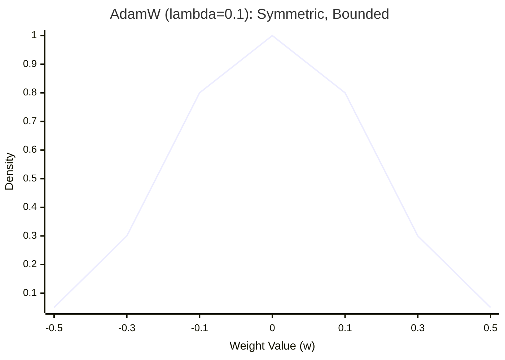
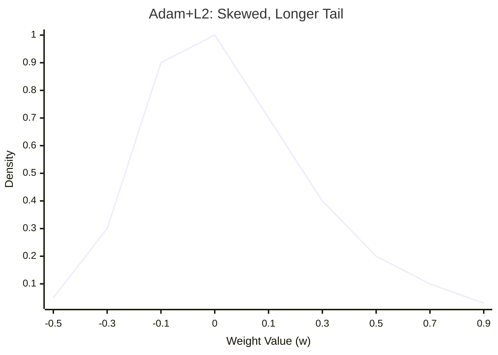
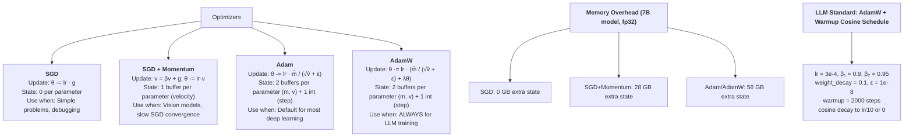

# Optimizers -- Deep Dive

## The Intuition

### What Problem Are We Solving?

You have a neural network. Backpropagation gave you gradients -- the direction each parameter should move to reduce the loss. The question is: **how far** do you move, and do you move every parameter the same way?

The simplest answer is vanilla SGD: multiply the gradient by a small number (the learning rate) and subtract. This works on textbook problems. On real problems, it is painfully slow, and here is why.

Consider a loss landscape shaped like a long, narrow valley -- steep walls on the sides, gentle slope toward the minimum along the floor. The gradient at any point mostly points toward the nearest wall (the steep direction), not along the floor toward the minimum. SGD bounces back and forth between the walls, making tiny progress along the valley with each step. This is the **ravine problem**, and it gets worse as the curvature ratio between dimensions increases.

Now add saddle points -- places where the gradient is near zero but the point is not a minimum (it curves up in some directions, down in others). SGD crawls through these regions because the gradient signal is tiny. It can waste thousands of steps inching past a saddle point that a smarter optimizer would blast through.

The progression from SGD to Adam to AdamW is the story of solving these problems one at a time:

1. **Momentum** solves oscillation in ravines
2. **Adam** adds per-parameter adaptive learning rates for dimensions with different curvatures
3. **AdamW** fixes a subtle but critical bug in how Adam handles weight decay

### The Key Insight

Different parameters need different learning rates. An embedding layer that sees sparse updates needs large steps when it does get a gradient. A bias term in a dense layer that gets consistent gradients needs smaller, steadier steps. Adam tracks the history of each parameter's gradients and automatically adjusts step sizes -- parameters with large, variable gradients get smaller steps; parameters with small, rare gradients get larger steps. This is **adaptive** optimization.

### Real-World Analogy

Imagine you are navigating a mountain range in thick fog. You can only feel the slope under your feet (the gradient).

- **SGD**: You take a fixed-size step downhill based on the local slope. On a narrow ridge, you overshoot side to side. On a flat plateau, you barely move.
- **Momentum**: You are on a sled. You accumulate speed going downhill. Side-to-side oscillations cancel out (push left, then right, net zero), but consistent downhill motion builds up velocity. You carve through plateaus on built-up momentum.
- **Adam**: You are on a sled AND you have a separate throttle for every direction. Directions where the slope changes wildly get a gentle throttle (small effective learning rate). Directions where the slope is consistent get full throttle. Every parameter dimension is independently controlled.
- **AdamW**: Same as Adam, but when you want to penalize heavy cargo (weight decay), you dump cargo at a uniform rate everywhere -- you do not let the throttle settings interfere with how much cargo you drop.

---

## The Math, Step by Step

### 1. SGD: The Baseline

The simplest possible update rule. At each step $t$:

$$\theta_{t+1} = \theta_t - \alpha \cdot g_t$$

Where:
- $\theta_t \in \mathbb{R}^d$ is the parameter vector at step $t$
- $\alpha \in \mathbb{R}$ is the learning rate (typically $0.01$)
- $g_t = \nabla_\theta \mathcal{L}(\theta_t)$ is the gradient of the loss with respect to parameters

This is a direct translation: the gradient tells you which direction increases the loss, so you go the opposite way. The learning rate $\alpha$ controls step size.

**The failure mode**: When the loss landscape has different curvatures along different dimensions, a single learning rate cannot be optimal for all of them. Too large and you oscillate along the high-curvature direction. Too small and you crawl along the low-curvature direction.

### 2. Momentum: Smoothing the Path

Momentum introduces a **velocity** vector $v_t$ that accumulates past gradients:

$$v_t = \beta \cdot v_{t-1} + g_t$$

$$\theta_{t+1} = \theta_t - \alpha \cdot v_t$$

Where:
- $v_t \in \mathbb{R}^d$ is the velocity (initialized to $v_0 = 0$)
- $\beta \in \mathbb{R}$ is the momentum coefficient (typically $0.9$)

**The exponential moving average interpretation**: Unrolling the recursion:

$$v_t = g_t + \beta g_{t-1} + \beta^2 g_{t-2} + \beta^3 g_{t-3} + \cdots$$

Each past gradient contributes with exponentially decaying weight. The effective window is approximately $\frac{1}{1 - \beta}$ steps. With $\beta = 0.9$, the last $\sim 10$ gradients dominate.

**Why this helps with ravines**: In a ravine, gradients oscillate across the valley (pointing left, then right, then left). These oscillating components cancel in the sum: $+g_{\text{left}} + \beta \cdot g_{\text{right}} + \beta^2 \cdot g_{\text{left}} \approx 0$. Meanwhile, the consistent downhill component along the valley floor accumulates: $g_{\text{down}} + \beta \cdot g_{\text{down}} + \beta^2 \cdot g_{\text{down}} = g_{\text{down}} \cdot \frac{1}{1 - \beta}$. The velocity builds up by a factor of $\sim 10\times$ along the consistent direction.

### 3. Adam: Adaptive Per-Parameter Learning Rates

Adam maintains two exponential moving averages per parameter:

**First moment** (mean of gradients -- the momentum term):

$$m_t = \beta_1 \cdot m_{t-1} + (1 - \beta_1) \cdot g_t$$

**Second moment** (mean of squared gradients -- the variance signal):

$$v_t = \beta_2 \cdot v_{t-1} + (1 - \beta_2) \cdot g_t^2$$

**Bias correction** (discussed in detail below):

$$\hat{m}_t = \frac{m_t}{1 - \beta_1^t}$$

$$\hat{v}_t = \frac{v_t}{1 - \beta_2^t}$$

**Parameter update**:

$$\theta_{t+1} = \theta_t - \alpha \cdot \frac{\hat{m}_t}{\sqrt{\hat{v}_t} + \epsilon}$$

Where:
- $m_t \in \mathbb{R}^d$: first moment estimate (shape matches $\theta$)
- $v_t \in \mathbb{R}^d$: second moment estimate (shape matches $\theta$)
- $\beta_1 = 0.9$: first moment decay rate
- $\beta_2 = 0.999$: second moment decay rate
- $\epsilon = 10^{-8}$: numerical stability constant
- $t$: step counter, starting at $1$

**The key**: The division by $\sqrt{\hat{v}_t}$ normalizes the gradient by its root-mean-square. For a parameter whose gradients are consistently large (say, magnitude $\sim 100$), $\sqrt{\hat{v}_t} \approx 100$, so the effective step is $\sim \alpha \cdot \hat{m}_t / 100$. For a parameter with small gradients (magnitude $\sim 0.01$), $\sqrt{\hat{v}_t} \approx 0.01$, so the effective step is $\sim \alpha \cdot \hat{m}_t / 0.01$. This means the effective learning rate for each parameter is:

$$\alpha_{\text{eff}, j} \approx \frac{\alpha}{\sqrt{\hat{v}_{t,j}} + \epsilon}$$

Parameters with large gradient variance get smaller learning rates. Parameters with small gradient variance get larger learning rates. The optimizer automatically adapts.

### 4. Bias Correction: Why It Matters

Both $m_0$ and $v_0$ are initialized to zero. This means the moving averages are biased toward zero in the early steps.

**Derivation**: The first moment at step $t$ is (unrolling the recursion):

$$m_t = (1 - \beta_1) \sum_{i=1}^{t} \beta_1^{t-i} g_i$$

If we assume all gradients are drawn from a distribution with mean $\mathbb{E}[g]$, then:

$$\mathbb{E}[m_t] = (1 - \beta_1) \cdot \mathbb{E}[g] \sum_{i=1}^{t} \beta_1^{t-i} = (1 - \beta_1) \cdot \mathbb{E}[g] \cdot \frac{1 - \beta_1^t}{1 - \beta_1} = (1 - \beta_1^t) \cdot \mathbb{E}[g]$$

So $\mathbb{E}[m_t] = (1 - \beta_1^t) \cdot \mathbb{E}[g]$, which is biased by a factor of $(1 - \beta_1^t)$. Dividing by this factor corrects the bias:

$$\mathbb{E}[\hat{m}_t] = \frac{\mathbb{E}[m_t]}{1 - \beta_1^t} = \mathbb{E}[g]$$

**Concrete impact at step 1** (with $\beta_1 = 0.9$, $\beta_2 = 0.999$):

- $m_1 = 0.1 \cdot g_1$ ($10\times$ too small). Correction: $\hat{m}_1 = m_1 / 0.1 = g_1$.
- $v_1 = 0.001 \cdot g_1^2$ ($1000\times$ too small). Correction: $\hat{v}_1 = v_1 / 0.001 = g_1^2$.

Without correction at step 1, $\sqrt{\hat{v}_1}$ would be too small, making the effective learning rate too large, potentially causing divergence. The second moment is especially dangerous because $\beta_2 = 0.999$ means the bias persists for $\sim 1000$ steps.

**Decay of the correction factor**:

| Step $t$ | $1 - \beta_1^t$ | $1 - \beta_2^t$ | Correction significant? |
|----------|-----------------|-----------------|------------------------|
| 1        | $0.1$           | $0.001$         | Yes -- $10\times$ and $1000\times$ correction |
| 10       | $0.651$         | $0.010$         | Yes -- both still far from 1 |
| 100      | $1.0$           | $0.095$         | $\beta_1$ done, $\beta_2$ still correcting |
| 1000     | $1.0$           | $0.632$         | $\beta_2$ moderate correction |
| 10000    | $1.0$           | $1.0$           | Both negligible |

### 5. AdamW: Fixing Weight Decay

The original Adam paper suggested adding L2 regularization by modifying the gradient:

$$g_t^{\text{L2}} = g_t + \lambda \cdot \theta_t$$

Then feeding this modified gradient into Adam's moment updates. The problem is that the regularization term $\lambda \cdot \theta_t$ gets processed by Adam's adaptive scaling. It gets divided by $\sqrt{\hat{v}_t} + \epsilon$ just like the data gradient. This means:

- Parameters with **large** $\hat{v}_t$ (large gradient variance): the weight decay term is **divided by a large number**, making the effective decay **weaker**. These are exactly the parameters that might need the most regularization.
- Parameters with **small** $\hat{v}_t$ (small gradient variance): the weight decay term is **divided by a small number**, making the effective decay **stronger**.

The result: weight decay strength is coupled to gradient statistics in an unintended way.

**AdamW decouples** weight decay from the adaptive scaling:

$$\theta_{t+1} = \theta_t - \alpha \left( \frac{\hat{m}_t}{\sqrt{\hat{v}_t} + \epsilon} + \lambda \cdot \theta_t \right)$$

Equivalently:

$$\theta_{t+1} = (1 - \alpha \lambda) \cdot \theta_t - \alpha \cdot \frac{\hat{m}_t}{\sqrt{\hat{v}_t} + \epsilon}$$

Now every parameter shrinks by the same fraction $(1 - \alpha \lambda)$ per step, regardless of its gradient history. This is the behavior we actually want from weight decay.

**Why this matters**: For SGD, L2 regularization and weight decay are mathematically identical:

$$\text{SGD + L2}: \quad \theta \leftarrow \theta - \alpha(g + \lambda\theta) = (1 - \alpha\lambda)\theta - \alpha g$$

$$\text{SGD + WD}: \quad \theta \leftarrow (1 - \alpha\lambda)\theta - \alpha g$$

Same formula. But for Adam, they diverge because of the $1/\sqrt{\hat{v}_t}$ scaling. AdamW restores the "true" weight decay behavior that we expect from regularization theory.

**Why every LLM uses AdamW**: Training GPT-3, LLaMA, Mistral, and Gemma all use AdamW. The decoupled weight decay provides more predictable regularization across the diverse parameter types in a transformer -- embedding layers, attention weights, feedforward layers, and layer norm parameters all have vastly different gradient statistics. AdamW ensures weight decay behaves uniformly across all of them.

---

## Worked Example: 3 Steps of Adam

Let us trace Adam on $f(x) = x^2$ with $x_0 = 3.0$, $\alpha = 0.001$, $\beta_1 = 0.9$, $\beta_2 = 0.999$, $\epsilon = 10^{-8}$.

The gradient of $f(x) = x^2$ is $g = 2x$.

**Initial state**: $m_0 = 0$, $v_0 = 0$, $t = 0$.

### Step 1: $t = 1$, $x_0 = 3.0$, $g_1 = 2 \times 3.0 = 6.0$

```
Gradient:          g_1 = 6.0

First moment:      m_1 = 0.9 * 0 + 0.1 * 6.0         = 0.6
Second moment:     v_1 = 0.999 * 0 + 0.001 * 6.0^2    = 0.036

Bias correction:   m_hat_1 = 0.6   / (1 - 0.9^1)      = 0.6 / 0.1   = 6.0
                   v_hat_1 = 0.036 / (1 - 0.999^1)     = 0.036 / 0.001 = 36.0

Update:            x_1 = 3.0 - 0.001 * 6.0 / (sqrt(36.0) + 1e-8)
                       = 3.0 - 0.001 * 6.0 / 6.0
                       = 3.0 - 0.001
                       = 2.999
```

Notice: after bias correction, $\hat{m}_1 = 6.0$ (the actual gradient) and $\sqrt{\hat{v}_1} = 6.0$ (the actual gradient magnitude). They cancel perfectly at step 1, leaving an effective step of exactly $\alpha = 0.001$. This is a beautiful property of the bias correction.

### Step 2: $t = 2$, $x_1 = 2.999$, $g_2 = 2 \times 2.999 = 5.998$

```
Gradient:          g_2 = 5.998

First moment:      m_2 = 0.9 * 0.6 + 0.1 * 5.998      = 0.54 + 0.5998 = 1.1398
Second moment:     v_2 = 0.999 * 0.036 + 0.001 * 5.998^2
                       = 0.035964 + 0.001 * 35.976004   = 0.035964 + 0.035976 = 0.071940

Bias correction:   m_hat_2 = 1.1398 / (1 - 0.9^2)     = 1.1398 / 0.19   = 5.99895
                   v_hat_2 = 0.071940 / (1 - 0.999^2)  = 0.071940 / 0.001999 = 35.98799

Update:            x_2 = 2.999 - 0.001 * 5.99895 / (sqrt(35.98799) + 1e-8)
                       = 2.999 - 0.001 * 5.99895 / 5.99900
                       = 2.999 - 0.001 * 0.99999
                       = 2.999 - 0.001
                       = 2.998
```

Again, the step size is almost exactly $\alpha = 0.001$. This is because with a single parameter on a smooth function, the first and second moments track the gradient closely, and the ratio $\hat{m}_t / \sqrt{\hat{v}_t}$ stays close to $\pm 1$.

### Step 3: $t = 3$, $x_2 \approx 2.998$, $g_3 = 2 \times 2.998 = 5.996$

```
Gradient:          g_3 = 5.996

First moment:      m_3 = 0.9 * 1.1398 + 0.1 * 5.996   = 1.02582 + 0.5996 = 1.62542
Second moment:     v_3 = 0.999 * 0.071940 + 0.001 * 5.996^2
                       = 0.071868 + 0.035952            = 0.107820

Bias correction:   m_hat_3 = 1.62542 / (1 - 0.9^3)    = 1.62542 / 0.271  = 5.997
                   v_hat_3 = 0.107820 / (1 - 0.999^3)  = 0.107820 / 0.002997 = 35.982

Update:            x_3 = 2.998 - 0.001 * 5.997 / (sqrt(35.982) + 1e-8)
                       = 2.998 - 0.001 * 5.997 / 5.999
                       = 2.998 - 0.001
                       = 2.997
```

**Key observation**: Adam takes steps of approximately $\alpha$ regardless of gradient magnitude. The adaptive scaling normalizes away the gradient scale. This is fundamentally different from SGD, where the step size is $\alpha \cdot |g|$ and thus directly proportional to the gradient magnitude.

---

## Learning Rate Scheduling

### Why Constant Learning Rates Are Not Enough

Even Adam benefits from learning rate schedules. The intuition:

- **Early training**: The loss landscape is poorly explored. Moment estimates are noisy. Large learning rates can cause instability.
- **Mid training**: The optimizer has found a good region. Full learning rate explores it efficiently.
- **Late training**: We want to fine-tune into a sharp minimum. Smaller learning rates avoid overshooting.

### Linear Warmup

$$\alpha_t = \alpha_{\max} \cdot \frac{t}{t_{\text{warmup}}} \quad \text{for } t < t_{\text{warmup}}$$

Ramps from $0$ to $\alpha_{\max}$ over $t_{\text{warmup}}$ steps. This prevents early instability. Even with bias correction, Adam's moment estimates from a handful of batches are noisy -- the moving averages have not had enough samples to be accurate. Warming up the learning rate gives the moments time to calibrate before taking large steps.

### Cosine Annealing

$$\alpha_t = \alpha_{\min} + \frac{1}{2}(\alpha_{\max} - \alpha_{\min})\left(1 + \cos\left(\frac{\pi \cdot t}{T}\right)\right)$$

Smoothly decays from $\alpha_{\max}$ to $\alpha_{\min}$ over $T$ steps. The cosine shape is slow at the start, fast in the middle, and slow at the end -- a natural "ease-in, ease-out" curve.

### Warmup + Cosine Decay (The LLM Standard)

$$\alpha_t = \begin{cases} \alpha_{\max} \cdot \dfrac{t}{t_{\text{warmup}}} & \text{if } t < t_{\text{warmup}} \\[8pt] \alpha_{\min} + \dfrac{1}{2}(\alpha_{\max} - \alpha_{\min})\left(1 + \cos\left(\dfrac{\pi(t - t_{\text{warmup}})}{T - t_{\text{warmup}}}\right)\right) & \text{otherwise} \end{cases}$$

This is what GPT-3, LLaMA, Chinchilla, and nearly every large language model uses. Typical values:

- $t_{\text{warmup}}$: 1-5% of total training steps
- $\alpha_{\max}$: $3 \times 10^{-4}$ (common for LLMs)
- $\alpha_{\min}$: $\alpha_{\max} / 10$ or $0$

```mermaid
---
config:
    themeVariables:
        xyChart:
            titleColor: "#333"
---
xychart-beta
    title "Learning Rate Schedule (Warmup + Cosine Decay)"
    x-axis "Training Step" [0, "warmup", "mid", "T"]
    y-axis "Learning Rate" ["alpha_min", "alpha_max"]
    line [0, 1, 0.85, 0.5, 0.15, 0]
```

The schedule ramps linearly from $0$ to $\alpha_{\max}$ during warmup, then follows a cosine curve down to $\alpha_{\min}$ over the remaining steps.

---

## From Math to Code

### The Data Structures

Before looking at code, understand what the optimizer needs to track:

```
Parameter interface (the contract between model and optimizer):
[
    {"params": np.ndarray,   # the weight tensor (updated in-place)
     "grad":  np.ndarray},   # the gradient tensor (same shape)
    {"params": np.ndarray,
     "grad":  np.ndarray},
    ...
]

Optimizer state (per parameter, indexed by position):
{
    0: {"m": np.ndarray, "v": np.ndarray},   # moments for param 0
    1: {"m": np.ndarray, "v": np.ndarray},   # moments for param 1
    ...
}
```

Every optimizer receives a list of parameter dictionaries and updates the `"params"` array in-place using the `"grad"` array. This clean interface means any model that produces gradients can use any optimizer.

### SGD Implementation Walkthrough

```python
class SGD(Optimizer):
    def __init__(self, params, lr=0.01, momentum=0.0, nesterov=False):
        super().__init__(params, lr)
        self.momentum = momentum
        self.nesterov = nesterov
        if nesterov and momentum == 0.0:
            raise ValueError("Nesterov momentum requires momentum > 0")

    def step(self):
        for i, p in enumerate(self.params):
            grad = p["grad"]

            if self.momentum == 0.0:
                p["params"] -= self.lr * grad
            else:
                if i not in self.state:
                    self.state[i] = {"velocity": np.zeros_like(p["params"])}

                v = self.state[i]["velocity"]
                v[:] = self.momentum * v + grad

                if self.nesterov:
                    p["params"] -= self.lr * (self.momentum * v + grad)
                else:
                    p["params"] -= self.lr * v
```

**Line-by-line**:

- `if self.momentum == 0.0`: When no momentum, skip velocity tracking entirely. This is why SGD with `momentum=0` has zero state overhead.
- `v[:] = self.momentum * v + grad`: The `[:]` syntax is critical -- it updates the array **in-place** rather than creating a new array. This means `self.state[i]["velocity"]` still points to the same memory. Without `[:]`, you would create a new array and the state dictionary would still hold the old one.
- `if self.nesterov`: Nesterov uses the "lookahead" update $\theta \mathrel{-}= \alpha(\beta v_t + g_t)$. After updating $v_t$, the Nesterov step effectively evaluates the gradient one momentum step ahead.

### Adam Implementation Walkthrough

```python
class Adam(Optimizer):
    def __init__(self, params, lr=0.001, betas=(0.9, 0.999), eps=1e-8):
        super().__init__(params, lr)
        self.beta1, self.beta2 = betas
        self.eps = eps
        self.t = 0

    def step(self):
        self.t += 1                                          # (1)

        for i, p in enumerate(self.params):
            grad = p["grad"]

            if i not in self.state:                          # (2)
                self.state[i] = {
                    "m": np.zeros_like(p["params"]),
                    "v": np.zeros_like(p["params"]),
                }

            m = self.state[i]["m"]
            v = self.state[i]["v"]

            m[:] = self.beta1 * m + (1 - self.beta1) * grad           # (3)
            v[:] = self.beta2 * v + (1 - self.beta2) * grad ** 2      # (4)

            m_hat = m / (1 - self.beta1 ** self.t)                     # (5)
            v_hat = v / (1 - self.beta2 ** self.t)                     # (6)

            p["params"] -= self.lr * m_hat / (np.sqrt(v_hat) + self.eps)  # (7)
```

**Line-by-line**:

- **(1)** `self.t += 1`: The step counter increments **before** the update. This means $t$ starts at $1$ on the first call, which is essential for bias correction. At $t=0$, the formula $1 - \beta^0 = 0$ would cause division by zero.
- **(2)** Lazy initialization: Moment buffers are created on first use, matching the parameter shape. This means the optimizer does not need to know parameter shapes at construction time.
- **(3)** First moment update: $m_t = \beta_1 m_{t-1} + (1 - \beta_1) g_t$. Note the $(1 - \beta_1)$ weighting, which makes $m_t$ a proper weighted average (weights sum to 1 as $t \to \infty$).
- **(4)** Second moment update: $v_t = \beta_2 v_{t-1} + (1 - \beta_2) g_t^2$. The `** 2` is element-wise squaring -- each element of the gradient is squared independently.
- **(5-6)** Bias correction: These create **new** arrays `m_hat` and `v_hat` (no `[:]`), which is correct because we do not want to modify the stored moments.
- **(7)** The parameter update. `np.sqrt(v_hat)` is element-wise square root. Adding `self.eps` prevents division by zero when a parameter has received no gradient signal. The entire operation is element-wise: each parameter component gets its own effective learning rate.

### AdamW Implementation Walkthrough

```python
class AdamW(Optimizer):
    def step(self):
        self.t += 1

        for i, p in enumerate(self.params):
            grad = p["grad"]
            # ... (moment updates identical to Adam) ...

            m_hat = m / (1 - self.beta1 ** self.t)
            v_hat = v / (1 - self.beta2 ** self.t)

            # Decoupled weight decay: applied to params directly, not through the gradient
            p["params"] -= self.lr * (
                m_hat / (np.sqrt(v_hat) + self.eps) + self.weight_decay * p["params"]
            )
```

The **only** difference from Adam is line 175-177. The weight decay term `self.weight_decay * p["params"]` is added to the update **after** bias correction, not injected into the gradient **before** moment computation. This single change is the difference between Adam and AdamW.

### AdamL2 (The Wrong Way) -- For Comparison

```python
class AdamL2(Optimizer):
    def step(self):
        self.t += 1

        for i, p in enumerate(self.params):
            # L2: fold penalty into the gradient before moment computation
            grad = p["grad"] + self.weight_decay * p["params"]
            # ... rest is identical to Adam ...
```

Here the penalty term is added to the gradient on line 208, **before** it enters the moment updates. This means the weight decay gets scaled by $1/(\sqrt{\hat{v}_t} + \epsilon)$, coupling regularization strength to gradient statistics.

### The Tricky Parts

**In-place updates with `[:]`**: Throughout the code, moment buffers are updated with `m[:] = ...` rather than `m = ...`. This is not cosmetic. Without `[:]`, the line `m = self.beta1 * m + ...` would create a new NumPy array and bind the local variable `m` to it, while `self.state[i]["m"]` would still point to the old array. With `[:]`, the values are written into the existing array, which is what the state dictionary references.

**`grad ** 2` is element-wise**: When the code computes `grad ** 2`, this is not a dot product or matrix multiplication. It squares each element independently. For a gradient of shape $(10, 5)$, the result is a $(10, 5)$ array where each element is the square of the corresponding gradient element. The second moment tracks per-element gradient magnitude.

**Bias correction creates new arrays**: Note that `m_hat` and `v_hat` do NOT use `[:]`. They are new arrays, not in-place modifications. This is important because modifying the stored moments would corrupt future steps. The stored $m_t$ and $v_t$ must be the un-corrected values; only the corrected values are used for the parameter update.

**Step counter is global, not per-parameter**: Adam uses a single step counter $t$ shared across all parameters. This means all parameters use the same bias correction factor, even if some parameters are added later. This matches the PyTorch convention.

---

## Complexity Analysis

### Time Complexity

| Operation | SGD | SGD+Momentum | Adam/AdamW |
|-----------|-----|-------------|------------|
| Per step  | $O(d)$ | $O(d)$ | $O(d)$ |

Where $d$ is the total number of parameters. All optimizers iterate through every parameter once per step, performing constant work per element (multiply, add, possibly sqrt and divide). The complexity is identical -- the constant factor is just larger for Adam (more arithmetic per element).

**Why $O(d)$**: Each step involves:
- SGD: 1 multiply + 1 subtract per element = $2d$ FLOPs
- SGD+Momentum: 2 multiplies + 1 add + 1 subtract = $4d$ FLOPs
- Adam: 2 multiplies + 2 adds + 2 divides + 1 sqrt + 1 multiply + 1 subtract $\approx 9d$ FLOPs

The overhead of Adam over SGD is roughly $4.5\times$ per step in FLOPs, but this is negligible compared to the forward and backward pass of the model itself.

### Space Complexity

| Optimizer | State per parameter | Formula | 7B model (fp32) |
|-----------|-------------------|---------|-----------------|
| SGD (no momentum) | $0$ | $0$ | 0 GB |
| SGD + Momentum | $1 \times |\theta|$ | $v$ | 28 GB |
| Adam/AdamW | $2 \times |\theta|$ | $m + v$ | 56 GB |

For a 7B parameter model stored in fp32 (4 bytes per parameter):
- Parameters: $7 \times 10^9 \times 4$ bytes $= 28$ GB
- Adam state: $2 \times 28$ GB $= 56$ GB
- Gradients: $28$ GB
- **Total training memory** (params + state + grads): $\sim 112$ GB

### The Bottleneck

The optimizer step itself is not the bottleneck in training -- the forward pass, backward pass, and communication (in distributed training) dominate. However, the **memory** overhead of Adam is significant. For a 70B model, the optimizer state alone is 560 GB in fp32. This is why:

1. **Mixed precision training** keeps model weights in fp16/bf16 but optimizer state in fp32
2. **ZeRO optimization** (DeepSpeed) shards optimizer state across GPUs
3. **Memory-efficient optimizers** like Adafactor reduce the state from $2|\theta|$ to $\sim |\theta|$ by factoring the second moment matrix

---

## Common Pitfalls

### Pitfall 1: Forgetting In-Place Assignment for State

**The mistake:**
```python
m = self.state[i]["m"]
m = self.beta1 * m + (1 - self.beta1) * grad  # BUG: creates new array
```

**Why it is wrong:** The variable `m` is rebound to a new NumPy array. `self.state[i]["m"]` still points to the old (unmodified) array. On the next call to `step()`, the moments will be read from the stale state, and the optimizer will behave as though $m_0 = 0$ at every step.

**The fix:**
```python
m = self.state[i]["m"]
m[:] = self.beta1 * m + (1 - self.beta1) * grad  # correct: in-place update
```

### Pitfall 2: Step Counter Starting at 0

**The mistake:**
```python
def step(self):
    for i, p in enumerate(self.params):
        # ... compute moments ...
        m_hat = m / (1 - self.beta1 ** self.t)  # BUG: t=0 on first call
        # Division by (1 - 1) = division by zero!
    self.t += 1  # incremented too late
```

**Why it is wrong:** When $t = 0$, $\beta_1^0 = 1$, so $1 - \beta_1^0 = 0$. Dividing by zero gives `inf` or `nan`.

**The fix:**
```python
def step(self):
    self.t += 1  # increment BEFORE use, so t starts at 1
    for i, p in enumerate(self.params):
        # ... compute moments ...
        m_hat = m / (1 - self.beta1 ** self.t)  # t >= 1, always safe
```

### Pitfall 3: Confusing Adam+L2 with AdamW

**The mistake:**
```python
# "I'll add weight decay to Adam by modifying the gradient"
grad = p["grad"] + weight_decay * p["params"]  # L2-style
m[:] = self.beta1 * m + (1 - self.beta1) * grad
v[:] = self.beta2 * v + (1 - self.beta2) * grad ** 2
# ... bias correction and update as usual ...
```

**Why it is wrong:** The weight decay term $\lambda \theta$ enters the moment estimates. The second moment $v$ now tracks the variance of $g + \lambda\theta$, not just $g$. This means the adaptive scaling $1/\sqrt{\hat{v}_t}$ is applied to the weight decay, making its effective strength vary per parameter.

**The fix (AdamW):**
```python
# Compute moments from data gradient ONLY
grad = p["grad"]  # no weight decay here
m[:] = self.beta1 * m + (1 - self.beta1) * grad
v[:] = self.beta2 * v + (1 - self.beta2) * grad ** 2
# ... bias correction ...
# Apply weight decay OUTSIDE of the adaptive scaling
p["params"] -= self.lr * (m_hat / (np.sqrt(v_hat) + eps) + weight_decay * p["params"])
```

### Pitfall 4: Not Correcting Both Moments

**The mistake:**
```python
m_hat = m / (1 - self.beta1 ** self.t)  # corrected
# Forgot to correct v!
p["params"] -= self.lr * m_hat / (np.sqrt(v) + self.eps)
```

**Why it is wrong:** The raw second moment $v$ is biased toward zero by a factor of $(1 - \beta_2^t)$. With $\beta_2 = 0.999$, at step 1 this means $v_1$ is $1000\times$ too small. Taking $\sqrt{v_1}$ gives a denominator that is $\sim 31\times$ too small, making the effective learning rate $\sim 31\times$ too large. Training may diverge immediately.

**The fix:** Always correct both moments:
```python
m_hat = m / (1 - self.beta1 ** self.t)
v_hat = v / (1 - self.beta2 ** self.t)
p["params"] -= self.lr * m_hat / (np.sqrt(v_hat) + self.eps)
```

---

## Connection to Inference Optimization

### Optimizers Are Training-Only

Optimizers do not run during inference. Once training is complete, the model weights are fixed, and the optimizer state ($m$, $v$, step counter) is discarded. So why understand them deeply?

### 1. Weight Distributions Affect Quantization

The optimizer determines what the final weights look like. AdamW with proper weight decay produces weights with bounded magnitudes and smooth distributions. When you quantize these weights (int8, int4) for inference, the weight distribution directly determines quantization error.





Tighter, more symmetric weight distributions quantize better -- the dynamic range fits neatly into fewer bits.

### 2. Training Memory vs Inference Memory

| Component | 7B Model (fp32) | 70B Model (fp32) |
|-----------|----------------|-----------------|
| Weights only (inference) | 28 GB | 280 GB |
| + Gradients (training) | +28 GB | +280 GB |
| + Optimizer state (Adam) | +56 GB | +560 GB |
| **Total training** | **112 GB** | **1120 GB** |

Training requires $\sim 4\times$ the memory of inference for weights and optimizer state alone, not counting activations. This is why you need clusters of GPUs for training but can serve on a single GPU (or even a CPU with quantization).

### 3. Typical LLM Hyperparameters

These are the values used in practice for training large language models:

| Hyperparameter | Typical Value | Used By |
|---------------|--------------|---------|
| Optimizer | AdamW | GPT-3, LLaMA, Mistral, Gemma |
| $\alpha$ (peak LR) | $3 \times 10^{-4}$ | LLaMA-2, Mistral |
| $\beta_1$ | $0.9$ | Nearly universal |
| $\beta_2$ | $0.95$ | LLaMA-2 ($0.999$ in original Adam) |
| $\epsilon$ | $10^{-8}$ | Universal |
| $\lambda$ (weight decay) | $0.1$ | LLaMA-2, Mistral |
| Warmup | $\sim 2000$ steps | GPT-3, LLaMA |
| Schedule | Cosine decay | GPT-3, LLaMA, Chinchilla |

Note that $\beta_2 = 0.95$ (not $0.999$) is common for LLMs. The lower value makes the second moment respond faster to changing gradient statistics, which helps when training on very long sequences where gradient distributions shift as the model improves.

### From Naive to Optimized

| What we implemented (naive) | What production uses |
|---------------------------|---------------------|
| Python loop over parameters | Fused CUDA kernel updating all params in one launch |
| fp32 everywhere | Mixed precision: fp32 optimizer state, bf16 model weights |
| Single-GPU state | ZeRO-sharded state across 8-256 GPUs |
| $2|\theta|$ optimizer memory | Adafactor: $\sim |\theta|$ via matrix factorization |
| Full Adam for all params | 8-bit Adam (quantized optimizer state) |

Understanding our naive implementation is essential because the optimized versions make the same mathematical updates -- they just do it faster and with less memory. Knowing that Adam tracks two moment buffers per parameter helps you understand why ZeRO-3 partitions optimizer state, and why 8-bit Adam quantizes the moment buffers to reduce memory.

---

## Testing Your Understanding

### Quick Checks

1. If you remove the scaling factor $1/(\sqrt{\hat{v}_t} + \epsilon)$ from Adam, what optimizer do you get? (Answer: momentum SGD with $(1-\beta_1)$-weighted gradients)

2. Why does AdamW still apply weight decay even when the gradient is zero? (Answer: the weight decay term $\lambda \cdot \theta_t$ depends only on the parameter value, not the gradient. Even with zero gradient, $\theta$ gets shrunk by factor $(1 - \alpha\lambda)$.)

3. At step $t = 1$ with default betas, what is the effective learning rate of Adam? (Answer: After bias correction, $\hat{m}_1 = g_1$ and $\sqrt{\hat{v}_1} = |g_1|$, so the effective step is $\alpha \cdot g_1 / |g_1| = \pm \alpha$. The step is exactly $\alpha$ regardless of gradient magnitude.)

4. Why is the step counter global rather than per-parameter? (Answer: all parameters are updated on every step. A per-parameter counter would only differ if some parameters were frozen, which this implementation does not support.)

### Exercises

1. **Easy**: Modify the `SGD` class to support a `weight_decay` parameter that applies decoupled weight decay (like AdamW does, but for SGD).

2. **Medium**: Implement RMSProp, which is Adam without the first moment: $v_t = \beta v_{t-1} + (1-\beta) g_t^2$, $\theta_{t+1} = \theta_t - \alpha g_t / (\sqrt{v_t} + \epsilon)$. This was the predecessor to Adam.

3. **Hard**: Implement gradient clipping (clip the gradient norm to a maximum value before passing it to the optimizer). This is used in all LLM training to prevent gradient explosions. Add a `max_grad_norm` parameter to the optimizer base class.

---

## Summary

### Key Takeaways

- **SGD** is simple but struggles with ravines and saddle points. A single learning rate cannot handle dimensions with different curvatures.
- **Momentum** adds a velocity buffer that smooths oscillations and accelerates in consistent gradient directions. The effective window is $\sim 1/(1-\beta)$ steps.
- **Adam** adds per-parameter adaptive learning rates by tracking the first moment (gradient mean) and second moment (gradient variance). Bias correction prevents the zero-initialized moments from distorting early training.
- **AdamW** fixes Adam's weight decay by decoupling it from the adaptive scaling. This makes weight decay uniform across parameters, which is what regularization theory calls for. Every LLM uses AdamW.
- **Learning rate scheduling** (warmup + cosine decay) is standard for LLM training. Warmup prevents instability from noisy early moment estimates; cosine decay allows fine-grained convergence.

### Quick Reference


