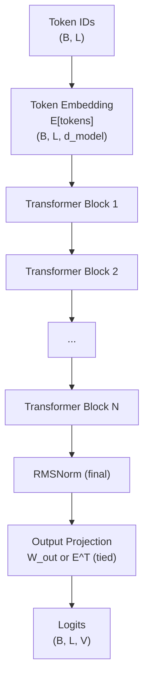
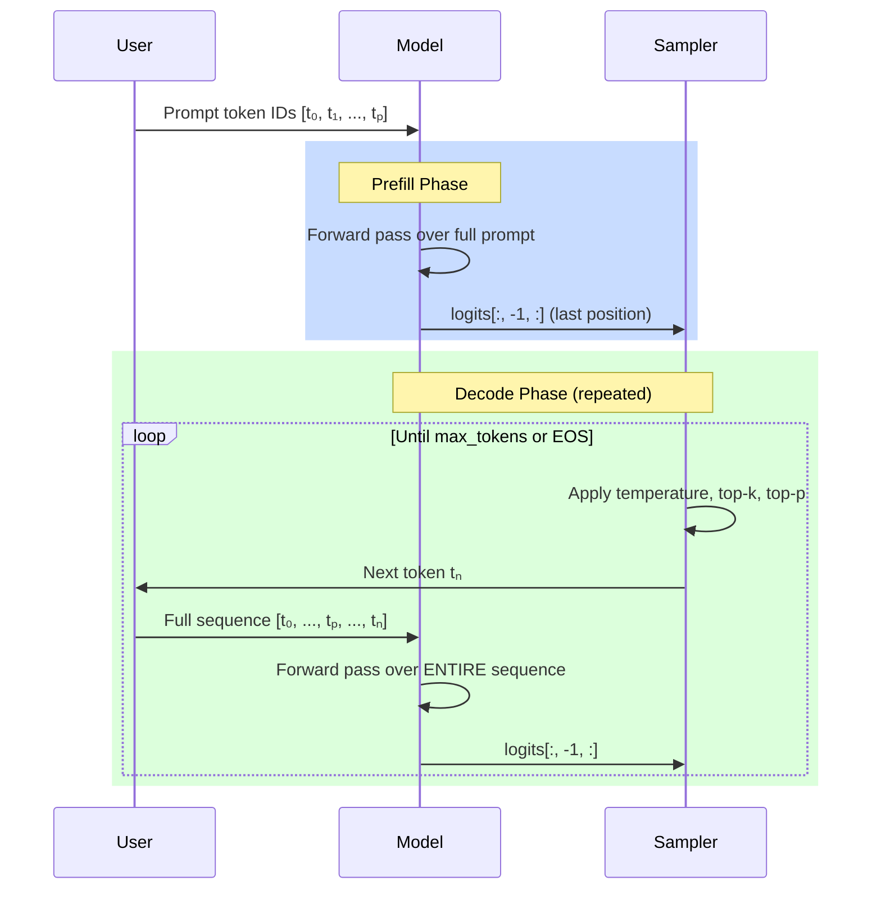

# Causal Decoding

**Phase 3 · Topic 15** — The complete decoder-only language model: stacked transformer blocks with token embeddings, autoregressive generation, and sampling strategies. This is what inference engines optimize.

## What it is

Causal decoding is the process by which decoder-only language models (GPT, Llama, Mistral) generate text one token at a time. The model takes a sequence of token IDs, passes them through an embedding layer, a stack of transformer blocks, and a final output projection to produce a probability distribution over the entire vocabulary for the next token. The "causal" property means each position can only see itself and all previous positions -- token $i$'s prediction depends exclusively on tokens $0, 1, \ldots, i$. This is enforced by the causal attention mask inside every transformer block and is what makes autoregressive generation possible: because position $i$'s output is independent of future tokens, we can generate token-by-token in a left-to-right sweep, feeding each generated token back as input.

This topic is the culmination of everything in Phase 3. You have already built every individual component: RMSNorm, SwiGLU FFN, grouped-query attention, RoPE, and the transformer block that wires them together. Causal decoding adds three things on top. First, the **embedding layer** that converts integer token IDs into dense vectors. Second, the **output head** that projects the transformer's hidden states back to vocabulary-sized logits, optionally sharing weights with the embedding layer (weight tying). Third, the **generation loop** that iteratively selects the next token using sampling strategies (greedy, temperature, top-k, top-p). The result is a complete, end-to-end language model that accepts token IDs and produces token IDs -- the same interface as any production LLM, just implemented naively in NumPy.

The naive version you implement here recomputes the full forward pass over the entire sequence at every generation step. This means generating $n$ tokens from a prompt of length $p$ requires $n$ forward passes over sequences of length $p+1, p+2, \ldots, p+n$, with attention cost growing quadratically. This is deliberately inefficient -- the next topic (KV cache) eliminates the redundant recomputation. But you must understand the naive version first to appreciate what the KV cache saves and why it is the single most impactful optimization in inference.

## The math

### Model architecture



### Notation

- $V$ = vocabulary size (e.g., 32000 for Llama 2, 128256 for Llama 3)
- $d_{model}$ = model dimension (e.g., 4096)
- $N$ = number of transformer blocks (e.g., 32 for Llama 7B)
- $B$ = batch size
- $L$ = sequence length
- $E \in \mathbb{R}^{V \times d_{model}}$ = token embedding matrix
- $W_{out} \in \mathbb{R}^{d_{model} \times V}$ = output projection matrix

### Forward pass

Given a sequence of token IDs $t = [t_0, t_1, \ldots, t_{L-1}]$ where $t_i \in \{0, 1, \ldots, V-1\}$:

**Step 1: Token embedding lookup**

$$x^{(0)} = E[t] \in \mathbb{R}^{B \times L \times d_{model}}$$

This is a table lookup, not a matrix multiply. Each token ID selects a row from $E$.

**Step 2: Pass through $N$ transformer blocks**

$$x^{(\ell)} = \text{TransformerBlock}_\ell(x^{(\ell-1)}) \quad \text{for } \ell = 1, \ldots, N$$

Each block applies pre-norm attention with RoPE and SwiGLU FFN with residual connections. The causal mask is applied inside each block's attention computation.

**Step 3: Final normalization**

$$x_{norm} = \text{RMSNorm}_{final}(x^{(N)}) \in \mathbb{R}^{B \times L \times d_{model}}$$

**Step 4: Output projection to vocabulary logits**

$$\text{logits} = x_{norm} \cdot W_{out} \in \mathbb{R}^{B \times L \times V}$$

With **weight tying**, $W_{out} = E^\top$, so:

$$\text{logits} = x_{norm} \cdot E^\top \in \mathbb{R}^{B \times L \times V}$$

Weight tying reduces parameters by $d_{model} \times V$ (e.g., $4096 \times 32000 = 131$M parameters for Llama 2 scale).

**Step 5: Convert to probabilities (for generation)**

$$P(t_{next} | t_0, \ldots, t_{L-1}) = \text{softmax}(\text{logits}[:, -1, :]) \in \mathbb{R}^{B \times V}$$

Only the last position's logits are used for next-token prediction, because causality guarantees that position $L-1$'s output encodes information from the entire input sequence.

### Complete shape table

| Step | Tensor | Shape |
|------|--------|-------|
| Token IDs | $t$ | $(B, L)$ |
| Embedding lookup | $x^{(0)} = E[t]$ | $(B, L, d_{model})$ |
| After block $\ell$ | $x^{(\ell)}$ | $(B, L, d_{model})$ |
| Final RMSNorm | $x_{norm}$ | $(B, L, d_{model})$ |
| Output logits | $\text{logits} = x_{norm} W_{out}$ | $(B, L, V)$ |
| Next-token probs | $P = \text{softmax}(\text{logits}[:, -1, :])$ | $(B, V)$ |

### The causal property

The causal mask inside each transformer block's attention ensures:

$$\text{output}[i] = f(t_0, t_1, \ldots, t_i) \quad \text{independent of } t_{i+1}, \ldots, t_{L-1}$$

This has a critical consequence: the logits at position $i$ are the model's prediction for token $i+1$. During training, all $L$ predictions are computed in parallel (teacher forcing). During inference, we only need the last position's logits to generate the next token.

### Verification of causality

For any two sequences that share a prefix of length $k$:

$$t = [t_0, \ldots, t_{k-1}, a_{k}, \ldots] \quad \text{and} \quad t' = [t_0, \ldots, t_{k-1}, b_{k}, \ldots]$$

The outputs at positions $0$ through $k-1$ must be identical:

$$\text{logits}(t)[:, :k, :] = \text{logits}(t')[:, :k, :]$$

This is the defining test of correct causal masking.

### Parameter count for full model

$$\text{Params}_{total} = \underbrace{V \cdot d_{model}}_{\text{embedding}} + \underbrace{N \cdot \text{Params}_{block}}_{\text{transformer blocks}} + \underbrace{d_{model}}_{\text{final norm}} + \underbrace{d_{model} \cdot V}_{\text{output proj}}$$

With weight tying, the embedding and output projection share weights, saving $d_{model} \times V$ parameters:

$$\text{Params}_{tied} = V \cdot d_{model} + N \cdot \text{Params}_{block} + d_{model}$$

#### Concrete example: Llama 2 7B

| Component | Parameters | Share |
|-----------|-----------|-------|
| Token embedding ($32000 \times 4096$) | 131M | 1.9% |
| 32 transformer blocks | 6,443M | 93.8% |
| Final RMSNorm ($\gamma$) | 4K | ~0% |
| Output projection (tied with embedding) | 0 (shared) | 0% |
| **Total** | **~6,574M** | **100%** |

## Autoregressive generation

### The generation loop



**Prefill phase:** Process the entire prompt in a single forward pass. This is compute-bound because the full sequence is processed in parallel through all $N$ blocks.

**Decode phase:** Generate one token at a time. Without KV cache, each step recomputes the forward pass over the full sequence (prompt + all previously generated tokens). This is wasteful -- and that waste is exactly what motivates KV caching (Topic 16).

### Pseudocode

```python
def generate(model, prompt_tokens, max_new_tokens, temperature, top_k, top_p):
    tokens = prompt_tokens                    # (B, P)
    for _ in range(max_new_tokens):
        logits = model.forward(tokens)        # (B, L, V) -- full recompute!
        next_logits = logits[:, -1, :]        # (B, V) -- last position only
        next_token = sample(next_logits, temperature, top_k, top_p)  # (B, 1)
        tokens = concat(tokens, next_token)   # (B, L+1)
        if next_token == eos_token_id:
            break
    return tokens
```

### Computational cost without KV cache

Generating $n$ tokens from a prompt of length $p$:

- Step 1: forward pass over $p + 1$ tokens
- Step 2: forward pass over $p + 2$ tokens
- ...
- Step $n$: forward pass over $p + n$ tokens

Total forward pass tokens:

$$\sum_{i=1}^{n} (p + i) = np + \frac{n(n+1)}{2}$$

For $p = 100$ and $n = 100$: $10000 + 5050 = 15{,}050$ total token-steps.

With KV cache (Topic 16), the decode phase processes 1 token per step, reducing this to $p + n = 200$ token-steps for the projection operations. The naive version is $\sim 75 \times$ more expensive in this example.

## Sampling strategies

### Temperature scaling

$$P_i = \frac{e^{\ell_i / \tau}}{\sum_j e^{\ell_j / \tau}}$$

- $\tau = 1.0$: original distribution
- $\tau < 1.0$: sharper (more deterministic), amplifies differences between logits
- $\tau > 1.0$: flatter (more random), smooths differences between logits
- $\tau \to 0^+$: equivalent to greedy decoding (argmax)

### Top-k filtering

Keep only the $k$ tokens with highest logits; set the rest to $-\infty$ before softmax:

$$\text{top\_k}(\ell, k)_i = \begin{cases} \ell_i & \text{if } i \in \text{argsort}(\ell)[-k:] \\ -\infty & \text{otherwise} \end{cases}$$

### Top-p (nucleus) sampling

Keep the smallest set of tokens whose cumulative probability exceeds $p$:

1. Compute probabilities: $P = \text{softmax}(\ell / \tau)$
2. Sort descending: $P_{sorted}$, with corresponding indices
3. Cumulative sum: $C_i = \sum_{j=0}^{i} P_{sorted,j}$
4. Find cutoff: mask out all tokens where $C_i - P_{sorted,i} \geq p$ (i.e., keep all tokens needed to reach cumulative probability $p$)
5. Set masked logits to $-\infty$, renormalize, and sample

Top-p adapts to the distribution shape: peaked distributions keep few tokens, flat distributions keep many.

### Combined sampling pipeline

The standard order:

$$\ell \xrightarrow{\div \tau} \ell_{scaled} \xrightarrow{\text{top-k}} \ell_{filtered} \xrightarrow{\text{top-p}} \ell_{nucleus} \xrightarrow{\text{softmax}} P \xrightarrow{\text{categorical}} t_{next}$$

**Step by step:**

1. Extract last position logits: $\ell = \text{logits}[:, -1, :] \in \mathbb{R}^{B \times V}$
2. Temperature scale: $\ell \leftarrow \ell / \tau$
3. Apply top-k filter (if $k > 0$): zero out all but top $k$
4. Apply top-p filter (if $p < 1.0$): nucleus filtering
5. Convert to probabilities: $P = \text{softmax}(\ell)$
6. Sample from categorical distribution: $t_{next} \sim \text{Categorical}(P)$

### Greedy decoding

The simplest strategy: always pick the most likely token.

$$t_{next} = \text{argmax}(\ell)$$

Greedy decoding is deterministic and is equivalent to temperature $\tau \to 0^+$ or top-k with $k = 1$.

## Why it matters for inference

### This is the complete system that inference engines optimize

Every optimization in production LLM serving targets this exact loop:

| Optimization | What it eliminates |
|-------------|-------------------|
| **KV Cache** (Topic 16) | Redundant recomputation of K/V for previous tokens |
| **Flash Attention** (Topic 17) | Materialization of the $O(L^2)$ attention matrix |
| **Continuous batching** | Idle GPU cycles while waiting for requests |
| **Speculative decoding** | Sequential dependency in token generation |
| **PagedAttention** | KV cache memory fragmentation |
| **Quantization** | Memory bandwidth for weight loading |

### The prefill vs decode asymmetry

This is the central insight of inference optimization:

| Property | Prefill | Decode |
|----------|---------|--------|
| Tokens processed | All prompt tokens at once | 1 token at a time |
| Bottleneck | Compute-bound (large matmuls) | Memory-bound (reading all weights for 1 token) |
| Arithmetic intensity | High (many FLOPs per byte loaded) | Very low (~1 FLOP per byte loaded) |
| GPU utilization | High | Very low without batching |
| Typical time | $O(p)$ with sequence parallelism | $O(n)$ sequential, each step loads all weights |

During decode, the model loads all $N \times \text{Params}_{block}$ parameters from GPU memory to compute a single output token. For a 7B model in FP16, that is ~14 GB of weight reads per token. At 2 TB/s memory bandwidth (A100), that is 7 ms per token just for the weight reads -- roughly 143 tokens/second for a single sequence. This is why batch size, quantization, and memory bandwidth dominate inference performance.

### Why understand the naive version first

The naive implementation (no KV cache) makes the waste explicit and measurable:

1. **You can count the redundant FLOPs** -- every forward pass recomputes K/V projections for all previous tokens
2. **You can measure the quadratic scaling** -- generation time grows quadratically with output length
3. **You can verify KV cache correctness** -- the cached version must produce identical outputs to the naive version
4. **You understand what "prefill" and "decode" mean** -- the naive version has only "prefill" (full sequence forward pass every time)

### Weight tying as a memory optimization

Weight tying ($W_{out} = E^\top$) saves $d_{model} \times V$ parameters. For Llama 2 scale ($4096 \times 32000$), that is 131M parameters or ~262 MB in FP16. Llama 2 does not use weight tying, but GPT-2 and many smaller models do. Understanding this option matters because:

- It affects the output projection's memory cost during inference
- The embedding matrix must be loaded anyway for the first layer, so tying reuses it for free
- It constrains the embedding space and logit space to be the same, which has quality implications

## Connection to prior modules

### TransformerBlock (Topic 14)

Import `TransformerBlock` from `03-transformers/transformer-block/`. The class provides `.forward(x, mask, positions)` taking $(B, L, d_{model})$ input and returning $(B, L, d_{model})$ output. It handles RMSNorm, GQA with RoPE, SwiGLU FFN, and residual connections internally. The causal model stacks $N$ of these blocks sequentially.

### RMSNorm (Topic 8)

Import `RMSNorm` from `02-neural-networks/normalization/` for the final normalization layer after all transformer blocks. This is separate from the two RMSNorm instances inside each block.

### Softmax (from GQA module)

Import `softmax` from `03-transformers/grouped-query-attention/` for converting output logits to probabilities during sampling.

### Causal mask (from GQA module)

Import `create_causal_mask` from `03-transformers/grouped-query-attention/`. The same mask is shared across all blocks -- it only depends on sequence length.

## What to implement

### CausalLM class (the full model)

- [ ] `CausalLM.__init__(self, vocab_size, d_model, num_layers, num_heads, num_kv_heads, d_ff, max_seq_len, rope_theta=10000.0, tie_weights=True)`
  - Token embedding matrix $E \in \mathbb{R}^{V \times d_{model}}$ (Xavier init)
  - $N$ `TransformerBlock` instances (imported from transformer-block module)
  - Final `RMSNorm(d_model)` (imported from normalization module)
  - Output projection $W_{out} \in \mathbb{R}^{d_{model} \times V}$ (Xavier init), or set $W_{out} = E^\top$ if `tie_weights=True`
  - Store `vocab_size`, `d_model`, `num_layers`, `max_seq_len`

- [ ] `CausalLM.forward(self, token_ids)`: full forward pass returning logits
  - Input: `token_ids` of shape $(B, L)$ with integer values in $[0, V)$
  - Embedding lookup: index into $E$ to get $(B, L, d_{model})$
  - Create causal mask for sequence length $L$
  - Create position indices $[0, 1, \ldots, L-1]$
  - Pass through $N$ transformer blocks sequentially
  - Apply final RMSNorm
  - Project to logits: $(B, L, d_{model}) \times (d_{model}, V) \to (B, L, V)$
  - With weight tying: $\text{logits} = x_{norm} @ E^\top$
  - Return logits of shape $(B, L, V)$

### Sampling functions (standalone, operate on logits)

- [ ] `temperature_scale(logits, temperature)`: divide logits by $\tau$
  - Input: $\text{logits} \in \mathbb{R}^{B \times V}$, $\tau > 0$
  - Output: $\text{logits} / \tau$
  - Handle $\tau = 0$ as greedy (return logits unchanged, let argmax handle it)

- [ ] `top_k_filter(logits, k)`: mask all but top $k$ logits to $-\infty$
  - Input: $\text{logits} \in \mathbb{R}^{B \times V}$, $k \geq 1$
  - Find $k$-th largest value per batch element
  - Set all logits below this threshold to $-\infty$
  - Return filtered logits

- [ ] `top_p_filter(logits, p)`: nucleus sampling filter
  - Input: $\text{logits} \in \mathbb{R}^{B \times V}$, $0 < p \leq 1$
  - Convert to probabilities via softmax
  - Sort descending, compute cumulative sum
  - Mask tokens beyond the cumulative probability threshold
  - Set masked logits to $-\infty$ in the original (unsorted) logit space
  - Return filtered logits

- [ ] `sample_token(logits, temperature=1.0, top_k=0, top_p=1.0, greedy=False, rng=None)`: full sampling pipeline
  - If greedy: return argmax
  - Apply temperature scaling
  - Apply top-k filter (if $k > 0$)
  - Apply top-p filter (if $p < 1.0$)
  - Convert to probabilities via softmax
  - Sample from categorical distribution using `rng` (numpy RandomState/Generator for reproducibility)
  - Return token IDs of shape $(B,)$ or $(B, 1)$

### Generation method

- [ ] `CausalLM.generate(self, prompt_tokens, max_new_tokens, temperature=1.0, top_k=0, top_p=1.0, greedy=False, eos_token_id=None, seed=None)`: autoregressive generation
  - Input: `prompt_tokens` of shape $(B, P)$
  - Initialize RNG from seed for reproducibility
  - **Prefill:** Forward pass over full prompt, extract last logits
  - **Decode loop:** For each new token:
    1. Sample next token from last-position logits
    2. Append to sequence: $(B, L) \to (B, L+1)$
    3. Check stop conditions (EOS token, max length, max_seq_len)
    4. Forward pass over **entire** sequence (no KV cache)
    5. Extract last-position logits for next iteration
  - Return generated token IDs of shape $(B, P + n_{generated})$

### Analysis functions

- [ ] `count_model_parameters(vocab_size, d_model, num_layers, num_heads, num_kv_heads, d_ff, tie_weights=True)`: full model parameter breakdown
  - Embedding: $V \times d_{model}$
  - Per-block: use `count_parameters` from transformer-block module
  - Total blocks: $N \times \text{Params}_{block}$
  - Final norm: $d_{model}$
  - Output projection: $d_{model} \times V$ (or 0 if tied)
  - Return dict with component counts, percentages, and total

- [ ] `generation_flops(prompt_len, num_new_tokens, num_layers, d_model, num_heads, num_kv_heads, d_ff, vocab_size)`: total FLOPs for generating $n$ tokens without KV cache
  - Sum over each decode step: forward pass FLOPs for sequence length $p + i$
  - Include embedding lookup cost (negligible) and output projection cost ($2 \cdot B \cdot L \cdot d_{model} \cdot V$)
  - Return total FLOPs and per-step breakdown

- [ ] `generation_flops_with_cache(prompt_len, num_new_tokens, num_layers, d_model, num_heads, num_kv_heads, d_ff, vocab_size)`: theoretical FLOPs with KV cache (for comparison)
  - Prefill: one forward pass over $p$ tokens
  - Decode: each step projects 1 token, attends over growing cache
  - Return total FLOPs for comparison against naive version

## Test cases to cover

### Model architecture tests

- [ ] **Output shape**: `model.forward(tokens)` returns shape $(B, L, V)$ for various $B$, $L$, $V$
- [ ] **Single token input**: $L = 1$ works correctly, returns $(B, 1, V)$
- [ ] **Embedding lookup correctness**: For a known embedding matrix, verify that `E[token_ids]` produces the correct rows
- [ ] **Weight tying**: With `tie_weights=True`, verify `model.W_out` is `model.embedding.T` (or logits are computed as `x @ E.T`)
- [ ] **Weight tying disabled**: With `tie_weights=False`, `model.W_out` is an independent matrix with shape $(d_{model}, V)$
- [ ] **Logits range**: Output logits are finite (no NaN, no Inf) for random token inputs

### Causal property tests

- [ ] **Future token independence**: Two sequences sharing a prefix of length $k$ produce identical logits at positions $0$ through $k-1$. Test with sequences `[1, 2, 3, 4]` and `[1, 2, 3, 7]` -- logits at positions 0, 1, 2 must match exactly.
- [ ] **Single token vs full sequence**: The logit at position 0 for input `[5]` equals the logit at position 0 for input `[5, 8, 3, 1]`.
- [ ] **Incremental consistency**: Running the model on `[1, 2, 3]` and extracting logits at position 2 gives the same result as running on `[1, 2, 3, 99]` and extracting logits at position 2.

### Sampling tests

- [ ] **Greedy determinism**: Greedy decoding always produces the same output for the same input and model weights
- [ ] **Seed reproducibility**: Same seed produces identical generated sequences
- [ ] **Different seeds diverge**: Different seeds produce different sequences (with high probability for $\tau > 0$)
- [ ] **Temperature $\tau = 1.0$**: Preserves original softmax distribution
- [ ] **Temperature $\tau < 1.0$**: Probability of argmax token increases (compare to $\tau = 1.0$)
- [ ] **Temperature $\tau > 1.0$**: Distribution entropy increases (flatter)
- [ ] **Top-k correctness**: After filtering with $k$, exactly $k$ tokens have non-zero probability per batch element
- [ ] **Top-k preserves top tokens**: The $k$ surviving tokens are the ones with highest original logits
- [ ] **Top-p correctness**: Cumulative probability of kept tokens $\geq p$
- [ ] **Top-p minimality**: Removing the lowest-probability kept token would drop cumulative below $p$
- [ ] **Combined sampling**: Temperature + top-k + top-p applied together produce valid probability distributions (sum to 1, no NaN)
- [ ] **Greedy equals argmax**: `sample_token(logits, greedy=True)` equals `np.argmax(logits, axis=-1)`

### Generation loop tests

- [ ] **Output starts with prompt**: Generated sequence begins with the original prompt tokens
- [ ] **Max tokens respected**: Generation produces at most `max_new_tokens` new tokens beyond the prompt
- [ ] **EOS stops generation**: If `eos_token_id` is set and the model generates it, generation stops early
- [ ] **Greedy generation determinism**: Same model + same prompt + greedy always produces the same output
- [ ] **Sequence length growth**: After generating $n$ tokens, output shape is $(B, P + n)$

### Numerical stability tests

- [ ] **Large vocab softmax**: With $V = 32000$ and logits in range $[-100, 100]$, softmax produces valid probabilities
- [ ] **No NaN in forward**: Random token inputs produce finite logits through the full model
- [ ] **Deep model stability**: With $N = 8$ blocks, outputs remain finite (not exploding or vanishing to zero)

### Weight tying tests

- [ ] **Tied model has fewer parameters**: `count_model_parameters(..., tie_weights=True)` < `count_model_parameters(..., tie_weights=False)` by exactly $d_{model} \times V$
- [ ] **Tied forward pass**: Logits are computed as $x_{norm} @ E^\top$, verified by comparing to explicit matrix multiply

### Configuration validation tests

- [ ] **Invalid token IDs**: Token IDs outside $[0, V)$ raise `ValueError`
- [ ] **Sequence exceeds max_seq_len**: Raise `ValueError` if input length exceeds `max_seq_len`
- [ ] **Invalid temperature**: $\tau \leq 0$ (non-greedy mode) raises `ValueError`
- [ ] **Invalid top-k**: $k < 0$ raises `ValueError`
- [ ] **Invalid top-p**: $p \leq 0$ or $p > 1$ raises `ValueError`

### Analysis tests

- [ ] **Llama 2 7B parameter count**: $V = 32000$, $d_{model} = 4096$, $N = 32$, $h = 32$, $h_{kv} = 32$, $d_{ff} = 11008$, tied weights. Verify total $\approx 6.7$B parameters.
- [ ] **Generation FLOPs comparison**: Naive (no cache) vs theoretical cached FLOPs for generating 100 tokens from a 50-token prompt. Verify naive is significantly more expensive.
- [ ] **Per-step FLOP growth**: Without cache, FLOPs per step increase with sequence length. Verify monotonic increase.

### Integration tests

- [ ] **End-to-end generate**: Create a tiny model ($V = 100$, $d_{model} = 32$, $N = 2$, $h = 4$, $h_{kv} = 2$, $d_{ff} = 64$, $L_{max} = 64$). Generate 10 tokens from a 5-token prompt. Verify output shape and valid token IDs.
- [ ] **Batch generation**: Generate tokens for $B = 4$ sequences simultaneously. Verify batch independence (each sequence depends only on its own prompt).
- [ ] **Forward determinism**: Same model weights + same token IDs always produce identical logits.

## Reference configurations

```python
# Tiny debug config (for unit tests and gradient checks)
vocab_size_tiny = 100
d_model_tiny = 32
num_layers_tiny = 2
num_heads_tiny = 4
num_kv_heads_tiny = 2
d_ff_tiny = 64
max_seq_len_tiny = 64
rope_theta_tiny = 10000.0

# Small test config
vocab_size_small = 1000
d_model_small = 64
num_layers_small = 4
num_heads_small = 4
num_kv_heads_small = 2
d_ff_small = 128
max_seq_len_small = 128
rope_theta_small = 10000.0

# Llama 2 7B (for analysis functions only -- too large to instantiate in NumPy)
vocab_size_7b = 32000
d_model_7b = 4096
num_layers_7b = 32
num_heads_7b = 32
num_kv_heads_7b = 32    # Llama 2 7B uses MHA
d_ff_7b = 11008
max_seq_len_7b = 4096
rope_theta_7b = 10000.0

# Llama 3 8B (for analysis functions only)
vocab_size_llama3 = 128256
d_model_llama3 = 4096
num_layers_llama3 = 32
num_heads_llama3 = 32
num_kv_heads_llama3 = 8  # GQA: 4x reduction
d_ff_llama3 = 14336
max_seq_len_llama3 = 8192
rope_theta_llama3 = 500000.0
```

## Implementation notes

### Importing existing modules

```python
import sys
from pathlib import Path
from importlib import import_module

_root = str(Path(__file__).resolve().parents[2])
if _root not in sys.path:
    sys.path.insert(0, _root)

_norm_mod = import_module("02-neural-networks.normalization.implementation")
RMSNorm = _norm_mod.RMSNorm

_gqa_mod = import_module("03-transformers.grouped-query-attention.implementation")
softmax = _gqa_mod.softmax
create_causal_mask = _gqa_mod.create_causal_mask

_block_mod = import_module("03-transformers.transformer-block.implementation")
TransformerBlock = _block_mod.TransformerBlock
count_parameters = _block_mod.count_parameters
count_flops = _block_mod.count_flops
```

The `TransformerBlock` class encapsulates the full pre-norm decoder block (RMSNorm, GQA with RoPE, SwiGLU FFN, residual connections). The `CausalLM` class composes $N$ of these blocks with embedding and output projection layers.

### Embedding initialization

Xavier initialization for the embedding matrix:

$$E \sim \mathcal{N}\left(0, \sqrt{\frac{2}{V + d_{model}}}\right)$$

In practice, many LLMs use simpler initialization (e.g., $\mathcal{N}(0, 0.02)$), but Xavier is consistent with the rest of our implementations.

### Weight tying implementation

When `tie_weights=True`, the output projection is not a separate parameter:

```python
if tie_weights:
    self.W_out = self.embedding.T  # Shape: (d_model, V)
else:
    self.W_out = _xavier((d_model, vocab_size))
```

Note: In NumPy, `self.embedding.T` creates a view, not a copy. Changes to `self.embedding` are reflected in `self.W_out` and vice versa. This is the desired behavior for weight tying.

### No backward pass for the full model

This implementation focuses on inference (forward pass + generation). The backward pass through the full model would require backpropagating through all $N$ blocks, the embedding lookup, and the output projection. While each component supports backward individually, orchestrating the full backward pass is a training concern, not an inference concern. The per-block backward pass is already implemented in the transformer-block module.

### What NOT to implement here

- **KV cache**: Topic 16. This is the naive version that recomputes everything at each generation step.
- **Beam search**: A more complex search strategy. Greedy, temperature, top-k, and top-p are sufficient.
- **Repetition penalty**: A production sampling feature, but not essential for understanding the core generation loop.
- **Batched generation with different lengths**: Would require padding and attention masks per sequence. Keep it simple with uniform-length batches.
- **Backward pass for full model**: This is an inference-focused implementation. Per-block backward is already available.
- **Flash attention**: Topic 17. This uses naive materialized attention through the TransformerBlock.

## References

- "Attention Is All You Need" (Vaswani et al., 2017) -- original transformer architecture with autoregressive decoder
- "Language Models are Unsupervised Multitask Learners" (Radford et al., 2019) -- GPT-2, demonstrated decoder-only LM generation at scale
- "The Curious Case of Neural Text Degeneration" (Holtzman et al., 2020) -- introduced nucleus (top-p) sampling
- "Hierarchical Neural Story Generation" (Fan et al., 2018) -- introduced top-k sampling for open-ended generation
- "LLaMA: Open and Efficient Foundation Language Models" (Touvron et al., 2023) -- modern decoder-only architecture with RMSNorm, SwiGLU, RoPE
- "Using the Output Embedding to Improve Language Models" (Press & Wolf, 2017) -- weight tying between embedding and output projection
