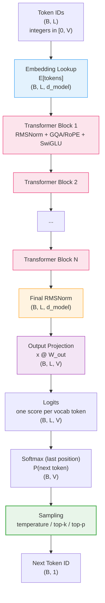
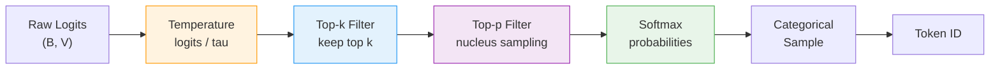
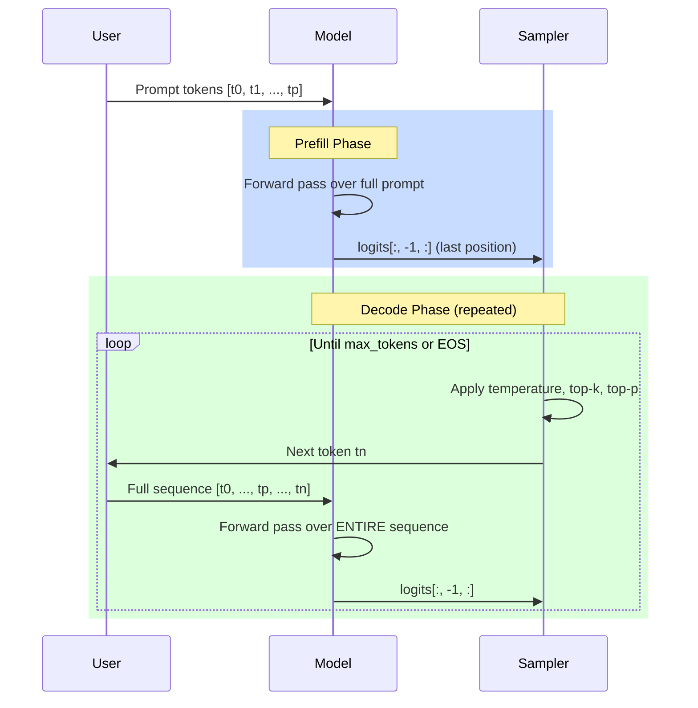
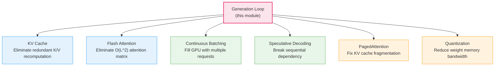

# Causal Decoding -- Deep Dive

## The Intuition

### What Problem Are We Solving?

You have spent all of Phase 3 building the internal machinery of a language model: RMSNorm to stabilize activations, rotary position embeddings to encode where tokens sit in a sequence, grouped-query attention to let tokens communicate, SwiGLU FFN to process information per-token, and the transformer block that wires all of these together. But none of these components can actually *do* anything on their own. Hand them a sentence, and they have no idea what to do with it. They operate on floating-point tensors of shape $(B, L, d_{model})$, not on words, not on token IDs, not on text.

Causal decoding is the missing piece that turns a stack of transformer blocks into a working language model. It answers three questions that the individual components cannot:

1. **How do we get from words to tensors?** A lookup table called the embedding matrix converts integer token IDs into dense vectors.
2. **How do we get from tensors back to words?** An output projection converts the transformer's hidden states into a probability distribution over the entire vocabulary.
3. **How do we generate text one token at a time?** An autoregressive loop takes the model's prediction, converts it into a token, appends it to the sequence, and repeats.

This is the complete system that every inference engine optimizes. When you hear about KV cache, Flash Attention, continuous batching, speculative decoding, PagedAttention, or quantization -- every single one of those optimizations targets the exact loop you will study here.

### The Key Insight

The "causal" property is the foundation of autoregressive generation: **the output at position $i$ depends only on tokens $0, 1, \ldots, i$, never on future tokens.** This is enforced by the causal attention mask inside every transformer block, which sets attention weights from position $i$ to any position $j > i$ to zero.

This seemingly simple constraint has a profound consequence: because the logits at position $i$ are independent of what comes after position $i$, we can generate text left-to-right. We compute the model's prediction for the next token, pick one, append it to the sequence, and the predictions for all previous positions remain valid. Without causality, generating one new token could change the model's opinion about every previous token, making sequential generation impossible.

### Real-World Analogy

Think of writing a mystery novel one sentence at a time. After writing chapter 1, you decide what happens in chapter 2. After writing chapter 2, you decide chapter 3. At no point do you go back and rewrite chapter 1 based on chapter 3 -- the story only flows forward. Each new sentence you write depends on everything that came before, but nothing that comes after.

A causal language model works the same way. The model "reads" the story so far (the prompt), then "writes" the next word based on everything it has read. It appends that word to the story, reads the whole thing again, and writes the next word. This is the autoregressive generation loop. The naive version we build here reads the *entire* story from scratch every time it writes one new word -- which is obviously wasteful. The KV cache (the next topic) fixes this by remembering what the model already read.

---

## Architecture: Everything Comes Together

### The Full Model



This is the entire model. Between the embedding at the top and the sampling at the bottom, every modern decoder-only LLM -- GPT, Llama, Mistral, Qwen -- follows this exact architecture. The differences between models are in the *configuration* (number of layers, hidden dimension, number of heads) and in the *component choices* (which norm, which FFN, which position encoding), not in the overall structure.

### Component Inventory

Here is every component and where it was built:

| Component | Purpose | Built In |
|-----------|---------|----------|
| Token embedding $E$ | Convert token IDs to dense vectors | This module (new) |
| Transformer blocks ($\times N$) | Process token representations | Topic 14 (transformer-block) |
| -- RMSNorm ($\times 2$ per block) | Stabilize activations | Topic 8 (normalization) |
| -- GQA with RoPE | Let tokens attend to each other | Topics 11, 13 (GQA, RoPE) |
| -- SwiGLU FFN | Per-token nonlinear processing | Topic 14 (transformer-block) |
| Final RMSNorm | Normalize before output projection | Topic 8 (normalization) |
| Output projection $W_{out}$ | Map hidden states to vocab logits | This module (new) |
| Sampling pipeline | Select next token from logits | This module (new) |
| Generation loop | Autoregressive token-by-token generation | This module (new) |

The only genuinely new components are the embedding, the output projection, the sampling functions, and the generation loop. Everything else is imported from previous modules.

---

## The Math, Step by Step

### Step 1: Token Embedding Lookup

Given a sequence of token IDs $t = [t_0, t_1, \ldots, t_{L-1}]$ where each $t_i \in \{0, 1, \ldots, V-1\}$:

$$x^{(0)} = E[t] \in \mathbb{R}^{B \times L \times d_{model}}$$

where $E \in \mathbb{R}^{V \times d_{model}}$ is the embedding matrix. This is a **table lookup**, not a matrix multiplication. Each token ID $t_i$ selects the $t_i$-th row from $E$. If token 42 maps to the vector $[0.3, -0.1, 0.7, \ldots]$, that is because row 42 of $E$ contains those values.

The embedding matrix is the model's entire "understanding" of individual tokens. Row 42 encodes everything the model knows about token 42 -- compressed into a vector of $d_{model}$ numbers. For Llama 2 7B, each token is represented by a vector of 4096 floats.

### Step 2: Pass Through $N$ Transformer Blocks

$$x^{(\ell)} = \text{TransformerBlock}_\ell(x^{(\ell-1)}) \quad \text{for } \ell = 1, \ldots, N$$

Each block applies the pre-norm decoder pattern:

$$h = x^{(\ell-1)} + \text{GQA}(\text{RMSNorm}_1(x^{(\ell-1)}))$$

$$x^{(\ell)} = h + \text{SwiGLU}(\text{RMSNorm}_2(h))$$

The causal mask is applied inside each block's attention computation. The same mask (a lower-triangular matrix of zeros with $-\infty$ above the diagonal) is shared across all blocks -- it depends only on the sequence length $L$.

### Step 3: Final Normalization

$$x_{norm} = \text{RMSNorm}_{final}(x^{(N)}) \in \mathbb{R}^{B \times L \times d_{model}}$$

After $N$ blocks, the residual stream has accumulated many additive contributions. The final RMSNorm brings the hidden states back to a consistent scale before the output projection. Without this, the logits would be unstable because the residual stream's magnitude grows with depth.

### Step 4: Output Projection

$$\text{logits} = x_{norm} \cdot W_{out} \in \mathbb{R}^{B \times L \times V}$$

This is the inverse of the embedding lookup. The embedding projects from a discrete token to a continuous vector. The output projection maps from a continuous vector back to a score for every token in the vocabulary. Each element $\text{logits}[b, i, v]$ is the model's "confidence" that token $v$ should come after position $i$ in batch element $b$.

### Step 5: Softmax to Probabilities

$$P(t_{next} \mid t_0, \ldots, t_{L-1}) = \text{softmax}(\text{logits}[:, -1, :]) \in \mathbb{R}^{B \times V}$$

Only the **last position's logits** are used for next-token prediction. Why? Because causality guarantees that position $L-1$'s output encodes information from the *entire* input sequence $[t_0, \ldots, t_{L-1}]$. The logits at earlier positions are useful during training (where we predict every next token simultaneously), but during generation we only need the final prediction.

### Complete Shape Table

| Step | Tensor | Shape |
|------|--------|-------|
| Token IDs | $t$ | $(B, L)$ |
| Embedding lookup | $x^{(0)} = E[t]$ | $(B, L, d_{model})$ |
| After block $\ell$ | $x^{(\ell)}$ | $(B, L, d_{model})$ |
| Final RMSNorm | $x_{norm}$ | $(B, L, d_{model})$ |
| Output logits | $\text{logits} = x_{norm} W_{out}$ | $(B, L, V)$ |
| Next-token probs | $P = \text{softmax}(\text{logits}[:, -1, :])$ | $(B, V)$ |

---

## Weight Tying: Why Share the Embedding and Output Projection?

### The Idea

Weight tying sets $W_{out} = E^\top$. Instead of learning a separate output projection matrix, the model reuses the transpose of the embedding matrix:

$$\text{logits} = x_{norm} \cdot E^\top$$

This means the output logit for token $v$ is:

$$\text{logit}_v = x_{norm} \cdot E[v]$$

The logit for token $v$ is the **dot product** between the model's hidden state and token $v$'s embedding vector. Tokens whose embeddings are "close" to the hidden state get high logits; tokens whose embeddings are "far" get low logits. The model predicts the next token by finding which embedding is most similar to the current hidden state.

### Why It Makes Sense

1. **Semantic consistency**: The embedding matrix learns a vector space where semantically similar tokens have similar embeddings. Weight tying forces the output projection to use the same space. If "dog" and "puppy" have similar embeddings, then whenever the model's hidden state points toward "dog," it also gives a reasonable score to "puppy." Without tying, the output projection could learn a completely different space, potentially losing this semantic structure.

2. **Parameter savings**: For Llama 2 scale ($V = 32000$, $d_{model} = 4096$), the output projection has $32000 \times 4096 = 131$M parameters. Weight tying eliminates these entirely. For a 7B model, that is ~2% fewer parameters -- modest, but it also reduces memory bandwidth during inference (the output projection must be loaded from memory at every generation step).

3. **Already loaded**: The embedding matrix must be loaded from GPU memory for the first operation (embedding lookup). With weight tying, the output projection reuses the same memory -- no additional memory access for the output projection's weights.

### In the Implementation

```python
if tie_weights:
    self.W_out = self.embedding.T  # NumPy view, not a copy
else:
    self.W_out = _xavier((d_model, vocab_size))
```

In NumPy, `.T` creates a **view** that shares memory with the original array. The test verifies this:

```python
def test_tied_shares_memory(self):
    model = _make_model(tie_weights=True)
    self.assertTrue(np.shares_memory(model.W_out, model.embedding))
```

### Which Models Use Weight Tying?

| Model | Weight Tying | Why |
|-------|-------------|-----|
| GPT-2 | Yes | Saves parameters in smaller models |
| Llama 2 7B | No (uses separate output projection) | Allows asymmetric capacity |
| Llama 3 8B | No | Same reasoning |
| Many smaller models | Yes | Memory savings more impactful at small scale |

Our implementation supports both via the `tie_weights` flag.

---

## The Causal Property: Why Each Token Can Only See the Past

### The Formal Definition

For any two sequences that share a prefix of length $k$:

$$t = [t_0, \ldots, t_{k-1}, a_k, \ldots] \quad \text{and} \quad t' = [t_0, \ldots, t_{k-1}, b_k, \ldots]$$

The outputs at positions $0$ through $k-1$ must be **identical**:

$$\text{logits}(t)[:, :k, :] = \text{logits}(t')[:, :k, :]$$

The model's prediction at position $i$ depends *only* on tokens $0$ through $i$. Changing token $k$ or later cannot affect the output at position $k-1$ or earlier.

### Why Causality Enables Generation

Suppose you have the prompt "The cat sat on the" and you want to generate the next token. The model computes logits for all 6 positions, but you only use the logits at position 5 (after "the"). Those logits give a probability distribution over the vocabulary.

Now suppose the model picks "mat." You form the new sequence "The cat sat on the mat" and run the model again. Because of causality, the logits at positions 0--5 are *identical* to what they were before -- adding "mat" at position 6 cannot change anything at positions 0--5. Only position 6's logits are "new."

This is why KV cache works: the computations at positions 0--5 are guaranteed to be unchanged, so there is no reason to redo them. The naive implementation here *does* redo them (that is the waste), but causality guarantees it would be safe to skip them.

### How It Is Enforced

The causal mask is an additive mask applied to the attention scores inside every transformer block:

$$\text{mask}[i, j] = \begin{cases} 0 & \text{if } j \leq i \\ -\infty & \text{if } j > i \end{cases}$$

After adding this mask, the softmax produces zero attention weight for all future positions ($e^{-\infty} = 0$). Position $i$ simply cannot "see" positions $i+1, i+2, \ldots$ -- they contribute nothing to the attention output.

### Verification in the Test Suite

The test directly checks the causal property:

```python
def test_future_token_independence(self):
    model = _make_model()
    seq1 = np.array([[1, 2, 3, 4]])
    seq2 = np.array([[1, 2, 3, 7]])   # Differs only at position 3
    logits1 = model.forward(seq1)
    logits2 = model.forward(seq2)
    # Positions 0, 1, 2 must match exactly
    np.testing.assert_allclose(logits1[0, :3, :], logits2[0, :3, :], atol=1e-10)
    # Position 3 must differ (different input)
    self.assertFalse(np.allclose(logits1[0, 3, :], logits2[0, 3, :]))
```

---

## Sampling Strategies Deep Dive

After the forward pass produces logits at the last position, we need to convert those logits into an actual token. This is where sampling strategies come in. They control the tradeoff between **diversity** (creative, varied text) and **quality** (coherent, likely text).

### Temperature Scaling

$$P_i = \frac{e^{\ell_i / \tau}}{\sum_j e^{\ell_j / \tau}}$$

Temperature $\tau$ scales the logits before softmax. This controls how "peaked" or "flat" the probability distribution is.

| Temperature | Effect | Use Case |
|------------|--------|----------|
| $\tau = 1.0$ | Original distribution | Balanced generation |
| $\tau < 1.0$ | Sharper (more deterministic) | Code generation, factual QA |
| $\tau > 1.0$ | Flatter (more random) | Creative writing, brainstorming |
| $\tau \to 0^+$ | Greedy (always pick argmax) | When you want the single most likely continuation |

#### Worked Example

Suppose the model outputs logits $\ell = [1.0, 2.0, 3.0]$ for a vocabulary of 3 tokens.

**At $\tau = 1.0$** (no scaling):

$$P = \text{softmax}([1.0, 2.0, 3.0]) = [0.090, 0.245, 0.665]$$

Token 2 is most likely at 66.5%, but tokens 0 and 1 still have meaningful probability.

**At $\tau = 0.5$** (sharper):

$$\ell / \tau = [2.0, 4.0, 6.0]$$

$$P = \text{softmax}([2.0, 4.0, 6.0]) = [0.009, 0.066, 0.925]$$

Token 2 now has 92.5% probability. The distribution is much more concentrated.

**At $\tau = 2.0$** (flatter):

$$\ell / \tau = [0.5, 1.0, 1.5]$$

$$P = \text{softmax}([0.5, 1.0, 1.5]) = [0.186, 0.307, 0.506]$$

Token 2 is still most likely, but the distribution is much more uniform. There is a real chance of sampling any token.

The implementation is minimal:

```python
def temperature_scale(logits, temperature):
    if temperature == 0.0:
        return logits       # Let argmax handle greedy
    return logits / temperature
```

### Top-k Filtering

Keep only the $k$ tokens with the highest logits; set the rest to $-\infty$ before softmax.

$$\text{top\_k}(\ell, k)_i = \begin{cases} \ell_i & \text{if } i \text{ is among the top } k \\ -\infty & \text{otherwise} \end{cases}$$

#### Worked Example

Logits: $\ell = [1.0, 5.0, 3.0, 2.0, 4.0]$ with $k = 3$.

The top 3 are indices 1 (5.0), 4 (4.0), and 2 (3.0). After filtering:

$$\ell_{filtered} = [-\infty, 5.0, 3.0, -\infty, 4.0]$$

$$P = \text{softmax}(\ell_{filtered}) = [0, 0.844, 0.042, 0, 0.114]$$

Tokens 0 and 3 are completely eliminated. The model can only pick from the top 3.

**Why top-k?** Without filtering, even very unlikely tokens have a tiny but nonzero probability. Over a long generation, the model will eventually sample one of these garbage tokens, causing the text to derail. Top-k prevents this by hard-cutting the tail.

**The limitation of top-k**: The value $k$ is fixed regardless of the distribution shape. If the model is very confident (one token has 99% probability), $k = 50$ still keeps 50 candidates -- 49 of which are noise. If the model is uncertain (10 tokens each with 10% probability), $k = 5$ cuts off half the viable options. This inflexibility is why top-p was invented.

### Top-p (Nucleus) Sampling

Keep the smallest set of tokens whose cumulative probability exceeds $p$:

1. Compute probabilities: $P = \text{softmax}(\ell / \tau)$
2. Sort descending: $P_{sorted}$
3. Cumulative sum: $C_i = \sum_{j=0}^{i} P_{sorted,j}$
4. Find cutoff: keep all tokens needed to reach cumulative probability $p$
5. Set masked logits to $-\infty$, renormalize, and sample

#### Worked Example

Logits after temperature scaling: $\ell = [0.0, 1.0, 2.0, 3.0, 4.0]$ with $p = 0.9$.

Probabilities: $P = \text{softmax}(\ell) = [0.012, 0.032, 0.087, 0.236, 0.633]$

Sorted descending (with original indices): $[0.633_{(4)}, 0.236_{(3)}, 0.087_{(2)}, 0.032_{(1)}, 0.012_{(0)}]$

Cumulative: $[0.633, 0.869, 0.956, 0.988, 1.0]$

With $p = 0.9$: the cumulative sum first reaches 0.9 at position 2 (value 0.956). But the *previous* cumulative (excluding token 2) was 0.869, which is below 0.9. So token 2 is included. The cutoff keeps tokens at indices 4, 3, and 2 (the top 3).

Now if the distribution were more peaked -- say $P = [0.001, 0.002, 0.007, 0.040, 0.950]$ -- the cumulative sum reaches $p = 0.9$ after just the first token (0.950 > 0.9). Top-p would keep only 1 token. This **adaptivity** is the advantage over top-k: peaked distributions keep few tokens, flat distributions keep many.

### The Combined Pipeline

The standard order for sampling in production systems:

$$\ell \xrightarrow{\div \tau} \ell_{scaled} \xrightarrow{\text{top-k}} \ell_{filtered} \xrightarrow{\text{top-p}} \ell_{nucleus} \xrightarrow{\text{softmax}} P \xrightarrow{\text{sample}} t_{next}$$



In the implementation, `sample_token` orchestrates this entire pipeline:

```python
def sample_token(logits, temperature=1.0, top_k=0, top_p=1.0, greedy=False, rng=None):
    if greedy:
        return np.argmax(logits, axis=-1)

    scaled = temperature_scale(logits, temperature)

    if top_k > 0:
        scaled = top_k_filter(scaled, top_k)

    if top_p < 1.0:
        scaled = top_p_filter(scaled, top_p)

    probs = softmax(scaled, axis=-1)

    # Sample from categorical distribution
    B = probs.shape[0]
    tokens = np.empty(B, dtype=np.int64)
    for i in range(B):
        tokens[i] = rng.choice(probs.shape[-1], p=probs[i])
    return tokens
```

---

## The Autoregressive Generation Loop

### Prefill and Decode

Generation has two distinct phases:



**Prefill phase:** Process the entire prompt in one forward pass. All prompt tokens are processed in parallel through all $N$ blocks. This is **compute-bound** -- the GPU is busy doing large matrix multiplications.

**Decode phase:** Generate one token at a time. In this naive implementation (no KV cache), each step recomputes the *entire* forward pass over the full sequence (prompt + all previously generated tokens). This is deliberately wasteful. The next topic (KV cache) eliminates this redundancy.

### The Implementation

```python
def generate(self, prompt_tokens, max_new_tokens, temperature=1.0,
             top_k=0, top_p=1.0, greedy=False, eos_token_id=None, seed=None):
    prompt_tokens = np.asarray(prompt_tokens)
    if prompt_tokens.ndim == 1:
        prompt_tokens = prompt_tokens[np.newaxis, :]

    rng = np.random.RandomState(seed) if seed is not None else np.random.RandomState()
    tokens = prompt_tokens.copy()

    for _ in range(max_new_tokens):
        if tokens.shape[1] >= self.max_seq_len:
            break

        logits = self.forward(tokens)          # Full forward pass every step!
        next_logits = logits[:, -1, :]         # Only use last position

        next_token = sample_token(
            next_logits, temperature=temperature,
            top_k=top_k, top_p=top_p, greedy=greedy, rng=rng,
        )

        next_token = next_token.reshape(-1, 1)
        tokens = np.concatenate([tokens, next_token], axis=1)

        if eos_token_id is not None and np.all(next_token == eos_token_id):
            break

    return tokens
```

**Line-by-line:**

- `tokens = prompt_tokens.copy()`: Start with the prompt. This array grows by one token each iteration.

- `logits = self.forward(tokens)`: The **entire** sequence is passed through the full model every step. For a 100-token prompt generating the 50th new token, this is a forward pass over 150 tokens through all $N$ blocks. This is the waste that KV cache eliminates.

- `next_logits = logits[:, -1, :]`: Extract only the last position's logits. All other positions' logits are thrown away. This is the core of the waste: we computed logits at 150 positions but use only 1.

- `tokens = np.concatenate([tokens, next_token], axis=1)`: Append the new token. The sequence grows from $(B, L)$ to $(B, L+1)$.

---

## From Math to Code: The Forward Pass

### The Data Structures

The `CausalLM` class maintains:

**Parameters:**
- `embedding`: $E \in \mathbb{R}^{V \times d_{model}}$ -- token embedding matrix (Xavier initialized)
- `blocks`: A list of $N$ `TransformerBlock` instances, each with its own weights
- `final_norm`: One `RMSNorm` instance with learnable scale $\gamma \in \mathbb{R}^{d_{model}}$
- `W_out`: Either $E^\top$ (weight tying) or independent $\mathbb{R}^{d_{model} \times V}$

**Configuration:**
- `vocab_size`, `d_model`, `num_layers`, `max_seq_len`, `tie_weights`

### Implementation Walkthrough

```python
def forward(self, token_ids):
    token_ids = np.asarray(token_ids)
    if token_ids.ndim == 1:
        token_ids = token_ids[np.newaxis, :]    # (L,) -> (1, L)

    B, L = token_ids.shape

    if L > self.max_seq_len:
        raise ValueError(f"Sequence length {L} exceeds max_seq_len {self.max_seq_len}")
    if np.any(token_ids < 0) or np.any(token_ids >= self.vocab_size):
        raise ValueError(f"Token IDs must be in [0, {self.vocab_size})")

    x = self.embedding[token_ids]               # (B, L, d_model)

    mask = create_causal_mask(L)                 # (1, 1, L, L)
    positions = np.arange(L)                     # [0, 1, ..., L-1]

    for block in self.blocks:
        x = block.forward(x, mask=mask, positions=positions)

    x = self.final_norm.forward(x)              # (B, L, d_model)

    logits = x @ self.W_out                     # (B, L, V)

    return logits
```

**Key details:**

- `self.embedding[token_ids]`: This is NumPy fancy indexing. For each integer in `token_ids`, it selects the corresponding row from the embedding matrix. Shape goes from $(B, L)$ integers to $(B, L, d_{model})$ floats.

- `create_causal_mask(L)`: Creates the $(1, 1, L, L)$ mask with $0$ on and below the diagonal, $-\infty$ above. The leading dimensions of size 1 allow broadcasting over batch and head dimensions inside the transformer blocks.

- `positions = np.arange(L)`: The position indices $[0, 1, \ldots, L-1]$ are passed to each block for RoPE. Each block applies rotary position encoding to its Q and K using these positions.

- The loop `for block in self.blocks` passes the tensor through all $N$ blocks sequentially. Each block takes $(B, L, d_{model})$ and returns $(B, L, d_{model})$, with the internal attention, FFN, and residual connections all happening inside.

- `x @ self.W_out`: The final projection. With weight tying, this is `x @ self.embedding.T`, a $(B, L, d_{model}) \times (d_{model}, V)$ matmul producing $(B, L, V)$ logits.

### The Tricky Parts

**Why Xavier initialization for the embedding?**

$$E \sim \mathcal{N}\left(0, \sqrt{\frac{2}{V + d_{model}}}\right)$$

Xavier initialization keeps the variance of activations stable across layers. With $V = 32000$ and $d_{model} = 4096$, the standard deviation is $\sqrt{2 / 36096} \approx 0.0074$. In practice, many production LLMs use simpler initialization (e.g., $\mathcal{N}(0, 0.02)$), but Xavier is consistent with the rest of our implementations.

**Why does `forward` handle 1D input?**

The `if token_ids.ndim == 1` check adds a batch dimension when the user passes a flat array like `[1, 2, 3]` instead of `[[1, 2, 3]]`. This convenience makes the API easier to use for single-sequence generation.

**Why validate token IDs?**

Token IDs outside $[0, V)$ would index out of bounds in the embedding matrix, potentially causing silent errors or crashes. The explicit check provides a clear error message.

---

## Complexity Analysis

### Per-Step Complexity (One Full Forward Pass)

For a sequence of length $L$ through a model with $N$ blocks:

| Operation | FLOPs | Why |
|-----------|-------|-----|
| Embedding lookup | $O(BLd_{model})$ | Simple indexing + memory copy |
| Per block: Attention projections | $O(BLd_{model}^2)$ | Four matmuls (Q, K, V, O) |
| Per block: Attention core | $O(BhL^2d_k)$ | $QK^\top$ and $AV$ are quadratic in $L$ |
| Per block: SwiGLU FFN | $O(BLd_{model} \cdot d_{ff})$ | Three matmuls (gate, up, down) |
| Per block: RMSNorm ($\times 2$) | $O(BLd_{model})$ | Negligible |
| Final RMSNorm | $O(BLd_{model})$ | Negligible |
| Output projection | $O(BLd_{model} \cdot V)$ | Maps to vocabulary |
| **Total per step** | $O(N \cdot (BLd_{model}^2 + BhL^2d_k + BLd_{model} \cdot d_{ff}) + BLd_{model}V)$ | |

The dominant terms are the attention projections ($\propto d_{model}^2$) and the FFN ($\propto d_{model} \cdot d_{ff}$) per block, scaled by $N$ blocks. The attention core ($\propto L^2$) only dominates for very long sequences.

### Generation Complexity Without KV Cache

Generating $n$ tokens from a prompt of length $p$:

$$\text{Total forward-pass tokens} = \sum_{i=1}^{n} (p + i) = np + \frac{n(n+1)}{2}$$

Each step processes the full sequence, and the sequence grows by 1 each step. The total grows **quadratically** in $n$.

**Concrete example**: $p = 100$, $n = 100$:

- Step 1: Forward pass over 101 tokens
- Step 2: Forward pass over 102 tokens
- ...
- Step 100: Forward pass over 200 tokens
- Total: $100 \times 100 + \frac{100 \times 101}{2} = 10000 + 5050 = 15050$ token-steps

With KV cache, the decode phase processes 1 token per step (just the new token), reducing the total to $p + n = 200$ token-steps for the projection operations. The naive version is **~75x more expensive** in this example.

### The Quadratic Wall

The attention core within each block is $O(L^2)$ per step, and the sequence length $L$ grows with each generation step. This means:

- Step $i$ has attention cost $\propto (p + i)^2$
- Total attention cost: $\sum_{i=1}^{n} (p + i)^2 = O(n \cdot p^2 + n^2 \cdot p + n^3)$

For long generations, this cubic growth in $n$ is devastating. The KV cache reduces each step to $O(p + i)$ attention cost (not squared), and Flash Attention reduces the memory from $O(L^2)$ to $O(L)$.

### Space Complexity

| Component | Memory | Notes |
|-----------|--------|-------|
| Model parameters | $O(Nd_{model}^2 + Nd_{model}d_{ff} + Vd_{model})$ | Fixed |
| Activation per block | $O(BhL^2 + BLd_{ff})$ | Attention matrix + FFN hidden |
| Token sequence | $O(B(p+n))$ | Grows during generation |

The attention matrix $O(BhL^2)$ is the memory bottleneck for long sequences. At $B=1$, $h=32$, $L=4096$, and float64, that is $32 \times 4096^2 \times 8 \approx 4.3$ GB per block. Flash Attention reduces this to $O(BhL)$.

---

## Real-World Model Configurations

### Parameter Count Breakdown

The `count_model_parameters` function computes the full breakdown:

$$\text{Params}_{total} = \underbrace{V \cdot d_{model}}_{\text{embedding}} + \underbrace{N \cdot \text{Params}_{block}}_{\text{transformer blocks}} + \underbrace{d_{model}}_{\text{final norm}} + \underbrace{d_{model} \cdot V}_{\text{output proj (if untied)}}$$

### Llama 2 7B

| Component | Config | Parameters | Share |
|-----------|--------|-----------|-------|
| Vocabulary | $V = 32000$ | | |
| Model dimension | $d_{model} = 4096$ | | |
| Layers | $N = 32$ | | |
| Attention | $h = 32$, $h_{kv} = 32$ (MHA) | | |
| FFN | $d_{ff} = 11008$ | | |
| RoPE | $\Theta = 10000$, $L_{max} = 4096$ | | |
| | | | |
| Token embedding | $32000 \times 4096$ | 131M | 2.0% |
| 32 transformer blocks | $32 \times \sim 202$M | 6,443M | 97.5% |
| Final RMSNorm | $\gamma \in \mathbb{R}^{4096}$ | 4K | ~0% |
| Output projection | Tied with embedding | 0 | 0% |
| **Total** | | **~6,607M** | **100%** |

The test verifies this:

```python
def test_llama2_7b_params(self):
    params = count_model_parameters(
        vocab_size=32000, d_model=4096, num_layers=32,
        num_heads=32, num_kv_heads=32, d_ff=11008, tie_weights=True,
    )
    total_b = params["total"] / 1e9
    self.assertAlmostEqual(total_b, 6.607, delta=0.1)
```

The transformer blocks account for **97.5%** of all parameters. The embedding is ~2%, and the final norm is negligible. This is why optimizing the transformer block (attention + FFN) matters so much.

### Llama 3 8B

| Component | Config | Parameters |
|-----------|--------|-----------|
| Vocabulary | $V = 128256$ (4x larger than Llama 2) | |
| Model dimension | $d_{model} = 4096$ | |
| Layers | $N = 32$ | |
| Attention | $h = 32$, $h_{kv} = 8$ (GQA, 4x reduction) | |
| FFN | $d_{ff} = 14336$ (larger than Llama 2) | |
| RoPE | $\Theta = 500000$, $L_{max} = 8192$ | |
| | | |
| Token embedding | $128256 \times 4096$ | 525M |
| 32 transformer blocks | $32 \times \sim 213$M | 6,816M |
| **Total (approx)** | | **~8B** |

Key differences from Llama 2 7B:

- **4x larger vocabulary** ($128256$ vs $32000$): Supports more languages and special tokens. The embedding matrix grows from 131M to 525M parameters.
- **GQA with $h_{kv} = 8$**: 4x fewer KV heads than query heads. This reduces the KV cache size by 4x during inference, enabling longer contexts and larger batches.
- **Larger FFN** ($14336$ vs $11008$): Compensates for the reduced attention parameters from GQA.
- **Higher RoPE theta** ($500000$ vs $10000$): Enables the 8192-token context window (vs 4096 for Llama 2).

---

## Computational Cost: Naive vs. KV Cache

The `generation_flops` and `generation_flops_with_cache` functions quantify the waste:

### Naive (No KV Cache)

```python
def generation_flops(prompt_len, num_new_tokens, ...):
    per_step_flops = []
    total = 0
    for i in range(num_new_tokens):
        seq_len = prompt_len + i + 1    # Grows each step!
        # Full forward pass at this sequence length
        block_flops = _block_count_flops(1, seq_len, ...)
        blocks_total = num_layers * block_flops["total"]
        output_proj = 2 * seq_len * d_model * vocab_size
        step_total = blocks_total + output_proj + ...
        per_step_flops.append(step_total)
        total += step_total
    return {"total": total, "per_step": per_step_flops, ...}
```

Each step computes a full forward pass at the current (growing) sequence length. The `per_step` list shows FLOPs increasing monotonically -- the test verifies this:

```python
def test_per_step_flop_growth(self):
    result = generation_flops(...)
    steps = result["per_step"]
    for i in range(1, len(steps)):
        self.assertGreater(steps[i], steps[i - 1])
```

### With KV Cache (Theoretical)

```python
def generation_flops_with_cache(prompt_len, num_new_tokens, ...):
    # Prefill: one forward pass over all prompt tokens
    prefill_total = full_forward_flops(prompt_len)

    # Decode: each step processes only 1 new token
    for i in range(num_new_tokens):
        cache_len = prompt_len + i
        # Only project 1 new token's Q, K, V
        proj_total = 2 * d_model * d_model * 4  # Q + K + V + O for 1 token
        # Attend over growing cache
        attn_total = 2 * num_heads * (cache_len + 1) * d_k * 2
        # FFN for 1 token
        ffn_total = 2 * d_model * d_ff * 3
        ...
```

With KV cache, the decode phase only projects 1 new token and attends over the growing cache. The projections are $O(d_{model}^2)$ per token (constant, not growing with $L$). Only the attention score computation grows with $L$ (attending to more cached K/V).

### The Numbers

For Llama 2 7B scale, generating 100 tokens from a 50-token prompt:

| Metric | Naive | With KV Cache | Ratio |
|--------|-------|--------------|-------|
| Total FLOPs | Very high | Much lower | Naive is orders of magnitude more expensive |
| Per-step growth | Quadratic in step number | Linear (attention) + constant (projections) | |
| Memory | Recompute everything | Store K/V cache (grows linearly) | Time-memory tradeoff |

The test confirms the naive version is more expensive:

```python
def test_naive_more_expensive_than_cached(self):
    naive = generation_flops(**kwargs)
    cached = generation_flops_with_cache(**kwargs)
    self.assertGreater(naive["total"], cached["total"])
```

---

## Common Pitfalls

### Pitfall 1: Using the Wrong Position Logits for Generation

**The mistake:**

```python
# Wrong: using logits at position 0 instead of the last position
next_logits = logits[:, 0, :]
next_token = sample_token(next_logits)
```

**Why it is wrong:** The logits at position 0 represent the model's prediction for the *second* token in the sequence (what should come after token 0). For next-token generation, we need the prediction for what comes after the *entire* sequence, which is at the last position.

**The fix:**

```python
# Correct: always use the last position
next_logits = logits[:, -1, :]
next_token = sample_token(next_logits)
```

### Pitfall 2: Forgetting to Rerun the Full Sequence (Naive Version)

**The mistake:**

```python
# Wrong: only running forward on the new token
for _ in range(max_new_tokens):
    logits = model.forward(next_token.reshape(1, 1))  # Only the new token!
    next_token = sample(logits[:, -1, :])
    tokens = np.concatenate([tokens, next_token], axis=1)
```

**Why it is wrong:** Without a KV cache, each forward pass must see the *entire* sequence to compute correct attention. A single-token forward pass has no context -- the model does not know what came before. This would work *with* a KV cache (which stores the previous context), but is incorrect in the naive implementation.

**The fix:**

```python
# Correct (naive): always pass the full sequence
for _ in range(max_new_tokens):
    logits = model.forward(tokens)                    # FULL sequence
    next_token = sample(logits[:, -1, :])
    tokens = np.concatenate([tokens, next_token], axis=1)
```

### Pitfall 3: Not Validating Sampling Parameters

**The mistake:**

```python
# Silently produces NaN or garbage
probs = softmax(logits / temperature)   # temperature could be 0 or negative!
```

**Why it is wrong:** Division by zero ($\tau = 0$) produces infinity/NaN. Negative temperature reverses the distribution (low-probability tokens become high-probability). Both are almost certainly bugs, not intended behavior.

**The fix:**

```python
# Correct: validate before computation
if temperature <= 0.0:
    raise ValueError(f"temperature must be > 0, got {temperature}")
```

### Pitfall 4: Using top_p on logits instead of probabilities

**The mistake:**

```python
# Wrong: sorting logits instead of probabilities
sorted_logits = np.sort(logits, axis=-1)[::-1]
cumsum = np.cumsum(sorted_logits, axis=-1)  # Cumulative sum of LOGITS?!
mask = cumsum > p
```

**Why it is wrong:** Top-p is defined over *probabilities*, not raw logits. The cumulative sum must be over the probability distribution (which sums to 1), not over logit values (which can be any real number). The correct implementation converts to probabilities first.

**The fix:**

```python
# Correct: convert to probabilities, then compute cumulative sum
probs = softmax(logits, axis=-1)
sorted_indices = np.argsort(-probs, axis=-1)
sorted_probs = np.take_along_axis(probs, sorted_indices, axis=-1)
cumulative = np.cumsum(sorted_probs, axis=-1)
sorted_mask = (cumulative - sorted_probs) >= p
```

The implementation correctly sorts by probability, computes the cumulative sum, and finds the cutoff where `cumulative - current_prob >= p` (meaning all previous tokens already sum to at least $p$, so the current token is excluded).

---

## Connection to Inference Optimization

### This Is the System That Gets Optimized

Every optimization in production LLM serving targets some part of the loop we just built:



| Optimization | What It Targets | What It Eliminates |
|-------------|----------------|-------------------|
| **KV Cache** (next topic) | The full-recompute forward pass in decode | Redundant K/V projections for all previous tokens |
| **Flash Attention** | The materialized $(B, h, L, L)$ attention matrix | $O(L^2)$ memory, replaced with tiled $O(L)$ |
| **Continuous Batching** | Idle GPU cycles between requests | Wasted compute when generating for one user at a time |
| **Speculative Decoding** | The sequential one-token-at-a-time bottleneck | Latency by drafting multiple tokens in parallel |
| **PagedAttention** | KV cache memory fragmentation | Wasted GPU memory from pre-allocated cache blocks |
| **Quantization** | Weight memory bandwidth during decode | Bytes read per token by using INT8/INT4 instead of FP16 |

### The Prefill vs. Decode Asymmetry

This is the single most important insight in inference optimization:

| Property | Prefill | Decode (without KV cache) | Decode (with KV cache) |
|----------|---------|--------------------------|----------------------|
| Tokens processed | All prompt tokens at once | Full sequence (prompt + generated) | 1 new token |
| Bottleneck | Compute-bound (large matmuls) | Compute-bound (redundant large matmuls) | Memory-bandwidth-bound |
| GPU utilization | High | Medium (wasteful) | Very low without batching |
| What limits speed | FLOP/s of the GPU | Redundant FLOPs | Bytes/s of GPU memory |

During decode with KV cache (production systems), the model loads **all** $N \times \text{Params}_{block}$ parameters from GPU memory to compute a single output token. For a 7B model in FP16:

$$\text{Weight reads per token} \approx 7 \times 10^9 \times 2 \text{ bytes} = 14 \text{ GB}$$

At 2 TB/s memory bandwidth (A100 GPU), that is:

$$\frac{14 \text{ GB}}{2000 \text{ GB/s}} = 7 \text{ ms per token} \approx 143 \text{ tokens/second}$$

This is why the decode phase is memory-bandwidth-bound. The GPU has the computational power to do far more arithmetic, but it spends most of its time waiting for weights to be loaded from memory. This is also why quantization (INT8/INT4 weights) is so impactful -- it directly reduces the bytes read per token.

### From Naive to Optimized

| Naive (what we implemented) | Optimized (production) |
|----------------------------|------------------------|
| Full forward pass every step | KV cache: project only 1 new token per step |
| Full $(B, h, L, L)$ attention matrix | Flash Attention: tiled, $O(L)$ memory |
| float64 for numerical precision | float16 / bfloat16 / INT8 for throughput |
| Single-sequence generation | Continuous batching across users |
| Sequential token-by-token | Speculative decoding drafts multiple tokens |
| Grow sequence array each step | Pre-allocated KV cache with PagedAttention |

Understanding the naive version is essential because:

1. **You can see the waste.** Every forward pass recomputes K/V projections for all previous tokens. The waste is measurable and specific.
2. **You can verify correctness.** The KV-cached version must produce *identical* outputs to the naive version. The naive version is the ground truth.
3. **You understand what "prefill" and "decode" mean.** The naive version has only "prefill" -- it does a full sequence forward pass every time. The optimized version separates these phases.

---

## Testing Your Understanding

### Quick Checks

1. **Why do we only use the last position's logits during generation, not all positions?** Because causality guarantees that position $L-1$'s output encodes information from the entire input sequence $[t_0, \ldots, t_{L-1}]$. Earlier positions' logits predict earlier next-tokens, which are not useful during generation (we already know those tokens -- they are in the prompt).

2. **What would happen if we used temperature $\tau = 0$ with sampling?** Division by zero in `logits / temperature`, producing infinity or NaN. The implementation handles this by returning logits unchanged at $\tau = 0$ (the caller uses argmax/greedy instead).

3. **If the model has `tie_weights=True`, how many parameter matrices are there for the embedding + output projection?** Just one -- the embedding matrix $E$. The output projection is $E^\top$, which is a view of the same memory, not a separate parameter.

4. **Why does generation time grow quadratically without KV cache?** Each step $i$ processes a sequence of length $p + i$ (growing). The total work is $\sum_{i=1}^{n}(p + i)$, which is $O(np + n^2)$. With KV cache, each decode step processes 1 token, so total work is $O(p + n)$.

5. **Can two different prompts produce the same logits at position 0?** Only if they share the same first token. The logit at position 0 depends only on token $t_0$ (by causality), so different first tokens produce different logits.

### Exercises

1. **Easy**: Using the `count_model_parameters` function, compute the parameter count for Llama 3 8B ($V = 128256$, $d_{model} = 4096$, $N = 32$, $h = 32$, $h_{kv} = 8$, $d_{ff} = 14336$, tied weights). What percentage of parameters are in the embedding? How does this compare to Llama 2 7B?

2. **Medium**: Modify the `generate` method to implement "truncated generation" -- instead of passing the full sequence to `self.forward()` each step, only pass the last `max_seq_len` tokens (a sliding window). This limits the effective context but prevents the sequence from growing indefinitely. How does this affect the causal property?

3. **Hard**: Implement a basic KV cache by modifying `forward` to accept and return cached K/V tensors per block. On each decode step, only project the new token's Q, K, V, and concatenate the new K, V with the cached values. Verify that the outputs match the naive version exactly (they must, by the causal property).

---

## Summary

### Key Takeaways

- Causal decoding is the complete system: embedding lookup, $N$ transformer blocks, final normalization, output projection to vocabulary logits, and autoregressive generation with sampling. This is what every inference engine optimizes.

- The **causal property** -- output at position $i$ depends only on tokens $0$ through $i$ -- is what makes autoregressive generation possible and is what makes KV cache correct. The causal mask in every attention layer enforces this.

- **Weight tying** ($W_{out} = E^\top$) saves $d_{model} \times V$ parameters by sharing the embedding and output projection matrices. The output logit for token $v$ becomes the dot product between the hidden state and token $v$'s embedding.

- **Sampling strategies** control the diversity-quality tradeoff: temperature scales the distribution's sharpness, top-k hard-limits the candidate set, and top-p (nucleus) adaptively sizes the candidate set based on the distribution shape.

- The **naive implementation** recomputes the full forward pass at every generation step, making the computational cost quadratic in the number of generated tokens. This waste is deliberate -- it makes the redundancy explicit and motivates the KV cache (the next topic), which is the single most impactful optimization in LLM inference.

### Quick Reference

```
Causal Decoding (Complete Decoder-Only LM)
|
|-- Architecture: Embedding -> N x TransformerBlock -> Final RMSNorm -> Output Projection -> Logits
|   |-- Embedding: E in R^{V x d_model}, table lookup
|   |-- Output projection: W_out = E^T (tied) or independent (d_model x V)
|   |-- Weight tying saves V * d_model parameters
|
|-- Forward pass shapes:
|   |-- Token IDs:       (B, L)              integers
|   |-- After embedding: (B, L, d_model)     floats
|   |-- After N blocks:  (B, L, d_model)     floats
|   |-- Final logits:    (B, L, V)           one score per vocab token
|
|-- Sampling pipeline: logits -> temperature -> top-k -> top-p -> softmax -> sample
|   |-- Temperature: controls sharpness (low = deterministic, high = random)
|   |-- Top-k: hard limit on candidate count
|   |-- Top-p: adaptive limit based on cumulative probability
|
|-- Generation loop (naive, no KV cache):
|   |-- Prefill: forward(prompt) -> extract last logits
|   |-- Decode: for each new token:
|   |   |-- sample from last logits
|   |   |-- append to sequence
|   |   |-- forward(FULL sequence) -> extract last logits   <-- THE WASTE
|   |-- Total work: O(n*p + n^2) token-steps
|
|-- Parameter distribution (Llama 2 7B):
|   |-- Embedding:          131M  (2.0%)
|   |-- 32 transformer blocks: 6,443M (97.5%)
|   |-- Final norm:         4K    (~0%)
|   |-- Total:              ~6.6B
|
|-- Why this matters for inference:
|   |-- KV cache eliminates redundant recomputation (next topic)
|   |-- Flash Attention eliminates O(L^2) memory
|   |-- Quantization reduces memory bandwidth (the decode bottleneck)
|   |-- Understanding the naive version = understanding what gets optimized
```
