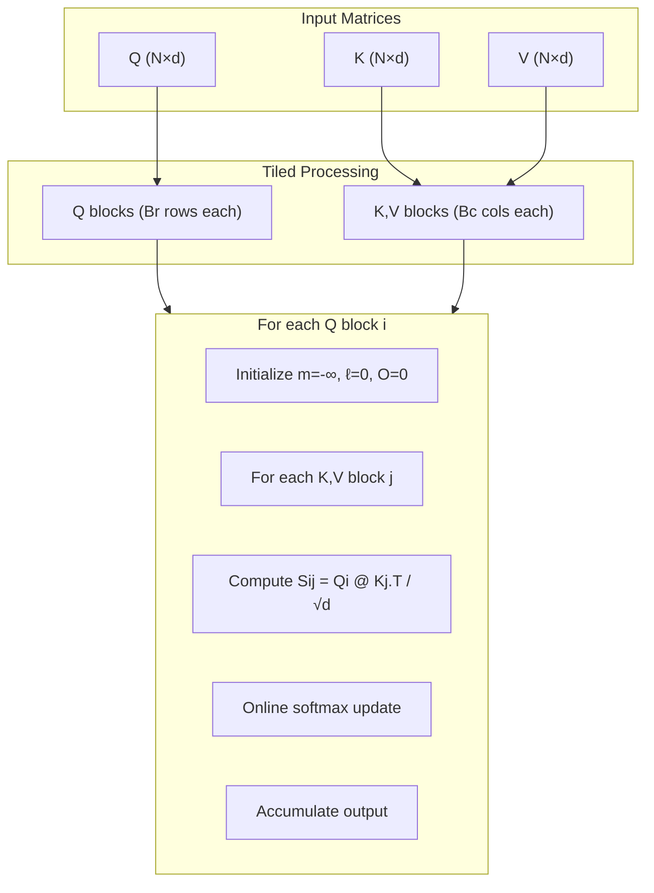

# Flash Attention Concept

**Phase 3 · Topic 17** — The algorithm that makes long-context attention tractable.

## What it is

Flash attention is an algorithmic reformulation of standard attention that avoids materializing the full $N \times N$ attention matrix in memory. Instead of computing all attention scores at once, it processes the attention computation in tiles (blocks), using an online algorithm to compute exact softmax incrementally.

The key insight is that softmax can be computed in a streaming fashion. You don't need to see all the values before computing the final result — you can process chunks of data, maintain running statistics, and combine them mathematically to get the exact same answer as naive attention. This changes attention from $O(N^2)$ memory to $O(N)$ memory while computing the identical output.

This README covers the **algorithm** — the mathematical trick that makes flash attention possible. The actual CUDA implementation (memory coalescing, shared memory usage, warp-level primitives) lives in `ml-systems/`. You must understand the algorithm first before the systems-level optimization makes sense.

## The math

### Standard attention (the problem)

Given:
- $Q \in \mathbb{R}^{N \times d}$ — queries
- $K \in \mathbb{R}^{N \times d}$ — keys
- $V \in \mathbb{R}^{N \times d}$ — values

Standard attention computes:

$$S = QK^\top \in \mathbb{R}^{N \times N}$$

$$P = \text{softmax}\left(\frac{S}{\sqrt{d}}\right) \in \mathbb{R}^{N \times N}$$

$$O = PV \in \mathbb{R}^{N \times d}$$

**The memory problem:** The attention matrix $S$ and $P$ are both $(N, N)$. For a sequence of $N=8192$ tokens with FP16, each matrix is $8192 \times 8192 \times 2$ bytes = 128 MB. Together that's 256 MB per head per layer. For a batch of 32 sequences, that's 8 GB just for attention matrices — per layer, per head.

### Online softmax (the key insight)

Standard softmax requires two passes:
1. Find $\max(x)$ for numerical stability
2. Compute $\exp(x_i - \max) / \sum_j \exp(x_j - \max)$

**Online softmax** computes softmax in a single streaming pass by maintaining running statistics that can be updated and corrected as new values arrive.

For a vector $x$ split into two chunks $x^{(1)}$ and $x^{(2)}$:

**Process first chunk:**

$$m^{(1)} = \max(x^{(1)})$$

$$\ell^{(1)} = \sum_i \exp(x^{(1)}_i - m^{(1)})$$

**Process second chunk:**

$$m^{(2)} = \max(x^{(2)})$$

$$\ell^{(2)} = \sum_i \exp(x^{(2)}_i - m^{(2)})$$

**Combine statistics:**

$$m = \max(m^{(1)}, m^{(2)})$$

$$\ell = \ell^{(1)} \cdot \exp(m^{(1)} - m) + \ell^{(2)} \cdot \exp(m^{(2)} - m)$$

**Final softmax:**

$$\text{softmax}(x)_i = \frac{\exp(x_i - m)}{\ell}$$

**Why this works:** When we discover a new maximum, we can rescale our previous running sum. The correction factor $\exp(m_{\text{old}} - m_{\text{new}})$ adjusts for the fact that all previous exponentials were computed with the wrong normalization constant.

### The online softmax algorithm

For computing $\text{softmax}(x)$ in a single pass over chunks:

**Initialize:**

$$m = -\infty \quad \text{(running maximum)}$$

$$\ell = 0 \quad \text{(running sum of } \exp(x - m) \text{)}$$

**For each chunk $x^{(j)}$:**

$$m_{\text{new}} = \max(m, \max(x^{(j)}))$$

$$\ell = \ell \cdot \exp(m - m_{\text{new}}) + \sum_i \exp(x^{(j)}_i - m_{\text{new}})$$

$$m = m_{\text{new}}$$

**Final:**

$$\text{softmax}(x)_i = \frac{\exp(x_i - m)}{\ell}$$

### Tiled attention (flash attention algorithm)

The full flash attention algorithm tiles both $Q$ and $K/V$:

**Input:** $Q, K, V \in \mathbb{R}^{N \times d}$, block sizes $B_r$ (rows of $Q$ to process), $B_c$ (cols of $K/V$ to process)

**Output:** $O \in \mathbb{R}^{N \times d}$

**Initialize per-row statistics:**

$$m_i = -\infty \quad \text{for } i = 1, \ldots, N \quad \text{(max score seen so far for each query)}$$

$$\ell_i = 0 \quad \text{for } i = 1, \ldots, N \quad \text{(sum of exponentials for each query)}$$

$$O = \mathbf{0}_{N \times d} \quad \text{(accumulated output)}$$

**Tile over $K/V$ (columns of attention matrix):**

For $j = 0$ to $\lceil N / B_c \rceil - 1$:

$$K_j = K[j \cdot B_c : (j+1) \cdot B_c] \in \mathbb{R}^{B_c \times d}$$

$$V_j = V[j \cdot B_c : (j+1) \cdot B_c] \in \mathbb{R}^{B_c \times d}$$

**Tile over $Q$ (rows of attention matrix):**

For $i = 0$ to $\lceil N / B_r \rceil - 1$:

$$Q_i = Q[i \cdot B_r : (i+1) \cdot B_r] \in \mathbb{R}^{B_r \times d}$$

**Compute block of attention scores:**

$$S_{ij} = \frac{Q_i K_j^\top}{\sqrt{d}} \in \mathbb{R}^{B_r \times B_c}$$

**Online softmax update for this block:**

$$\tilde{m}_{ij} = \text{rowmax}(S_{ij}) \in \mathbb{R}^{B_r}$$

$$\tilde{P}_{ij} = \exp(S_{ij} - \tilde{m}_{ij}) \in \mathbb{R}^{B_r \times B_c} \quad \text{(unnormalized)}$$

$$\tilde{\ell}_{ij} = \text{rowsum}(\tilde{P}_{ij}) \in \mathbb{R}^{B_r}$$

**Combine with running statistics:**

$$m_{\text{new}} = \max(m[i \cdot B_r : (i+1) \cdot B_r], \tilde{m}_{ij})$$

**Rescale previous accumulated output:**

$$\alpha = \exp(m[i \cdot B_r : (i+1) \cdot B_r] - m_{\text{new}})$$

$$\beta = \exp(\tilde{m}_{ij} - m_{\text{new}})$$

$$\ell_{\text{new}} = \ell[i \cdot B_r : (i+1) \cdot B_r] \cdot \alpha + \tilde{\ell}_{ij} \cdot \beta$$

**Update output with rescaling:**

$$O[i \cdot B_r : (i+1) \cdot B_r] = \frac{O[i \cdot B_r : (i+1) \cdot B_r] \cdot \alpha \cdot \ell[i \cdot B_r : (i+1) \cdot B_r] + (\tilde{P}_{ij} \cdot \beta) V_j}{\ell_{\text{new}}}$$

**Update statistics:**

$$m[i \cdot B_r : (i+1) \cdot B_r] = m_{\text{new}}$$

$$\ell[i \cdot B_r : (i+1) \cdot B_r] = \ell_{\text{new}}$$

**Return** $O$

### Memory analysis

**Standard attention:**

$$\text{Memory} = O(N^2) \quad \text{(must store full } N \times N \text{ attention matrix)}$$

**Flash attention:**

$$\text{Memory} = O(N) \quad \text{(only store per-row statistics } m, \ell \text{ and output } O \text{)}$$

Block matrices $S_{ij}, P_{ij}$ are $O(B_r \cdot B_c) = O(1)$ relative to $N$.

**The trade-off:** Flash attention does more FLOPs (recomputes $QK^\top$ blocks multiple times in backward pass), but the reduced memory access makes it faster overall because GPUs are memory-bandwidth bound for attention.

### Backward pass (recomputation)

Flash attention does NOT store the attention matrix $P$ for the backward pass. Instead, it recomputes the necessary blocks on-the-fly:

**Forward:** Compute $O$, store only $Q, K, V, O, m, \ell$

**Backward:** Recompute $S_{ij} = Q_i K_j^\top / \sqrt{d}$ when needed. Recompute $P_{ij}$ from $S_{ij}$ using stored $m, \ell$.

This is the **recomputation** strategy: trade compute for memory. The extra compute is worth it because:
1. Memory bandwidth is the bottleneck, not compute
2. Recomputation happens in fast SRAM (on-chip), not slow HBM (off-chip)

## Why it matters for inference

Flash attention is the single most important optimization for long-context inference:

**1. Memory bandwidth is the bottleneck:** Modern GPUs have 50x more compute than memory bandwidth (A100: 312 TFLOPS vs 2 TB/s). Standard attention reads/writes the full $N^2$ matrix from HBM, making it memory-bound. Flash attention keeps intermediate results in SRAM.

**2. Enables long contexts:** Without flash attention, a 32K context at FP16 requires 2 GB per head per layer just for the $S$ matrix (4 GB for $S$ and $P$ together). With 32 heads, that is 128 GB per layer. Flash attention makes 100K+ contexts practical.

**3. The algorithm is hardware-agnostic:** The online softmax trick works on any hardware. Understanding it here in NumPy means you understand what the CUDA kernel is doing — it's just doing it with explicit memory hierarchy management.

**4. Direct bridge to ml-systems/:** The actual flash attention CUDA implementation adds:
- Explicit tiling to fit in shared memory (48KB on most GPUs)
- Memory coalescing for efficient HBM access
- Warp-level primitives for fast reductions
- Fused operations to minimize kernel launches

But the core algorithm — online softmax with tiled accumulation — is exactly what you implement here.

**5. Foundation for further optimizations:**
- **Flash Attention 2:** Better work partitioning across warps
- **Flash Attention 3:** Asynchronous operations, FP8 support
- **FlashDecoding:** Specialized for inference (query length = 1)
- **Paged Attention:** Combines flash attention with non-contiguous KV cache

## What to implement

### Core components

- [ ] `online_softmax(x)` — Streaming softmax in a single pass
  - Input: vector $x$ of shape $(N,)$
  - Process in configurable chunk sizes
  - Return exact same result as `np.exp(x - x.max()) / np.exp(x - x.max()).sum()`
  - Track and return intermediate statistics $(m, \ell)$ for verification

- [ ] `online_softmax_2d(x, chunk_size)` — Row-wise online softmax
  - Input: matrix $x$ of shape $(N, M)$
  - Apply online softmax independently to each row
  - Return shape $(N, M)$ with each row summing to 1

- [ ] `standard_attention(Q, K, V)` — Baseline implementation
  - Full $N^2$ attention matrix materialization
  - Return output $O$ and attention weights $P$ (for comparison)
  - Track peak memory usage (count bytes allocated)

- [ ] `tiled_attention(Q, K, V, block_size_q, block_size_kv)` — Flash attention algorithm
  - Process attention in tiles without materializing full attention matrix
  - Use online softmax for incremental computation
  - Return output $O$ only (attention weights are never fully materialized)
  - Must produce numerically equivalent results to standard attention

### Analysis components

- [ ] `memory_analysis(N, d, dtype)` — Compare memory requirements
  - Calculate peak memory for standard attention
  - Calculate peak memory for tiled attention with given block sizes
  - Return dictionary with breakdown

- [ ] `verify_no_full_materialization(Q, K, V, block_size)` — Instrumented tiled attention
  - Wrapper that tracks maximum tensor size allocated during computation
  - Assert that no tensor larger than $O(\text{block\_size}^2)$ is created
  - Return (output, max_tensor_size)

### Optional extensions

- [ ] Causal masking in tiled attention (skip blocks entirely above diagonal)
- [ ] Backward pass with recomputation (compute $dQ$, $dK$, $dV$ without storing $P$)
- [ ] Block size tuning analysis (what block sizes minimize total operations?)

## Test cases to cover

### Numerical equivalence tests

- [ ] **Basic equivalence:** `tiled_attention(Q, K, V)` == `standard_attention(Q, K, V)` within tolerance $10^{-5}$
  - Test with $N = 64$, $d = 32$, block_size = 16
  - Test with $N = 128$, $d = 64$, block_size = 32
  - Test with $N = 256$, $d = 128$, block_size = 64

- [ ] **Non-divisible sizes:** $N$ not divisible by block_size
  - $N = 100$, block_size = 32 (last block is partial)
  - $N = 65$, block_size = 64 (just over one block)

- [ ] **Various block sizes:** Same $Q$, $K$, $V$ with different block sizes produce same output
  - block_sizes = [8, 16, 32, 64]
  - All should produce identical results

- [ ] **Single block:** When block_size $\geq N$, should exactly match standard attention
  - This is the degenerate case where tiled == standard

### Online softmax tests

- [ ] **Equivalence to standard softmax:** For random vectors of length 100, 1000, 10000
  - Chunk sizes: 1, 10, 100, full length
  - All should produce identical results within $10^{-6}$

- [ ] **Numerical stability:** Large values that would overflow naive softmax
  - $x = [1000, 1000, 1000]$ with chunk_size = 1
  - Should return $[0.333, 0.333, 0.333]$, not NaN/Inf

- [ ] **Incremental property:** Processing in chunks gives same result as all-at-once
  - Split vector into random chunk sizes
  - Final $(m, \ell)$ statistics should match single-pass computation

- [ ] **Edge cases:**
  - Single element: $\text{softmax}([5.0]) = [1.0]$
  - Two elements: $\text{softmax}([0, 0]) = [0.5, 0.5]$
  - Very negative values: $\text{softmax}([-1000, -1000, -999])$ should not underflow

### Memory verification tests

- [ ] **No full attention matrix:** For $N = 256$, block_size = 32
  - Maximum intermediate tensor should be $O(32 \times 32) = O(1024)$, not $O(256 \times 256) = O(65536)$
  - Use instrumented version to verify

- [ ] **Memory scales with block size, not $N$:**
  - Run with $N = 128, 256, 512$ with fixed block_size = 32
  - Peak memory should be approximately constant (not growing with $N^2$)

- [ ] **Memory analysis accuracy:**
  - Computed memory estimates match actual allocations
  - Standard attention: $\sim 2 \cdot N^2 \cdot \text{sizeof(dtype)}$ for $S$ and $P$ matrices
  - Tiled attention: $\sim 2 \cdot \text{block\_size}^2 \cdot \text{sizeof(dtype)}$ for block matrices

### Shape and dimension tests

- [ ] **Output shape:** tiled_attention output has shape $(N, d)$ matching standard attention
- [ ] **Batch dimension:** If implemented, $(B, N, d)$ input produces $(B, N, d)$ output
- [ ] **Head dimension:** If implemented, $(B, H, N, d)$ works correctly

### Stress tests

- [ ] **Large $N$:** $N = 2048$, $d = 64$, block_size = 64
  - Verify equivalence (may need looser tolerance due to accumulation errors)
  - Verify no memory explosion

- [ ] **Small block size:** block_size = 4 with $N = 64$
  - Many iterations of the tiling loop
  - Should still produce correct results

- [ ] **Determinism:** Same inputs produce same outputs across multiple runs
  - No uninitialized memory or order-dependent accumulation bugs

### Gradient tests (if backward pass implemented)

- [ ] **Gradient correctness:** Numerical gradient check for $dQ$, $dK$, $dV$
  - Compute $(L(x + \epsilon) - L(x - \epsilon)) / (2\epsilon)$ for each parameter
  - Compare to analytical gradient from backward pass

- [ ] **Recomputation equivalence:** Backward pass with recomputation matches backward pass that stores $P$
  - Both should produce identical gradients

## Implementation notes

### Floating point precision

Online softmax accumulates values across many chunks. Use float64 for intermediate statistics $(m, \ell)$ even if inputs are float32 to minimize accumulation errors. The final output can be cast back to the input dtype.

### Block size selection

In real CUDA implementations, block sizes are chosen to fit in shared memory (typically 48KB). For this NumPy simulation:
- Start with block_size = 32 or 64
- Verify correctness across multiple block sizes
- Analyze how block size affects the number of operations

### Debugging tips

1. Start with the online softmax for a 1D vector before tackling the full tiled attention
2. Print intermediate $(m, \ell)$ values to verify they match expected statistics
3. For tiled attention, test with block_size = $N$ first (should exactly match standard attention)
4. Add assertions for numerical stability: no NaN, no Inf, attention weights sum to 1

### Relation to actual flash attention

This implementation demonstrates the algorithm but omits hardware-specific optimizations:

| NumPy simulation | CUDA implementation |
|-----------------|---------------------|
| Python loops over tiles | Kernel launch with grid of thread blocks |
| NumPy arrays in RAM | Tiles loaded into shared memory (SRAM) |
| Sequential tile processing | Parallel processing across thread blocks |
| No explicit memory management | Explicit SRAM/HBM memory hierarchy |
| $O(N)$ memory in theory | $O(N)$ memory achieved in practice |

The algorithm is identical. The performance difference comes from hardware utilization.
