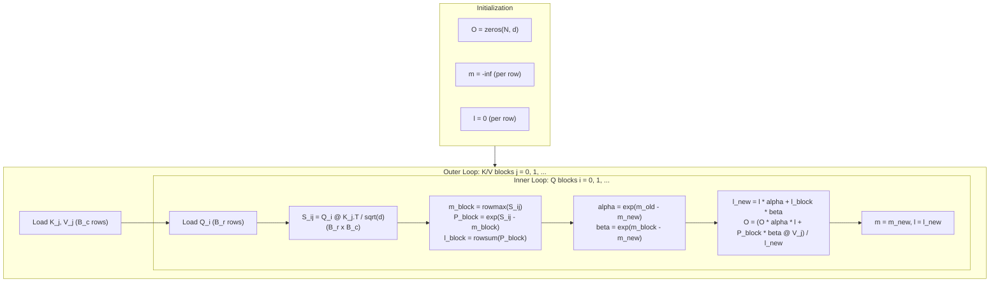
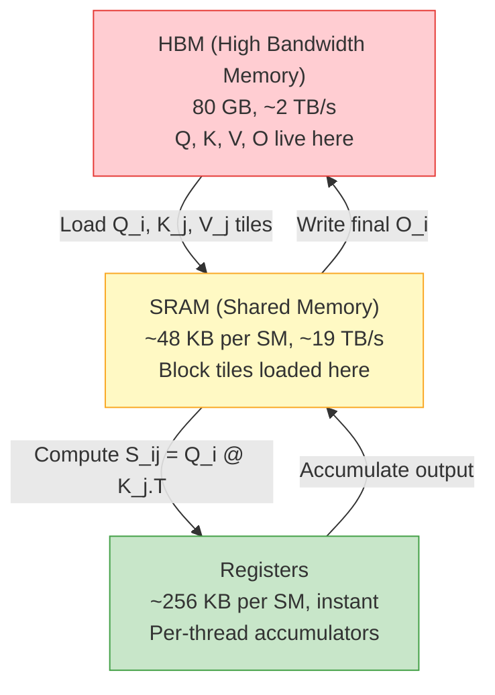
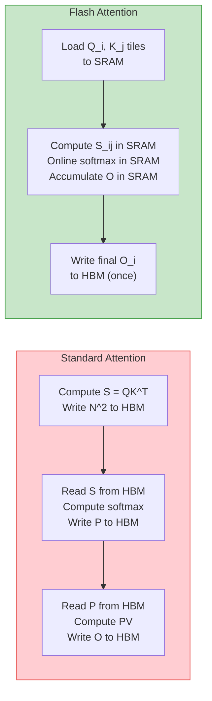

# Flash Attention Concept -- Deep Dive

## The Intuition

### What Problem Are We Solving?

Standard attention computes the full $N \times N$ attention matrix. For every query, we compute a score against every key, normalize with softmax, and produce a weighted sum of values. The attention weight matrix $P$ and the raw score matrix $S$ are both $(N, N)$.

Here is the pain, made concrete. Take a sequence of $N = 8192$ tokens (a modest context window by modern standards) with FP16 precision:

- The score matrix $S$: $8192 \times 8192 \times 2$ bytes = **128 MB**
- The probability matrix $P$: another **128 MB**
- Total per head per layer: **256 MB**

Now scale up. A model with 32 heads, 32 layers, and a batch of 32 sequences:

$$32 \times 32 \times 32 \times 256 \text{ MB} = 8{,}388{,}608 \text{ MB} \approx 8 \text{ TB}$$

That is absurd. Even a single attention head with a batch of 32 at 32K context requires $32 \times 32768^2 \times 2 \times 2 \approx 128$ GB just for $S$ and $P$. GPUs have 80 GB of HBM. The $O(N^2)$ memory wall is not theoretical -- it is the reason long-context models cannot exist without algorithmic innovation.

But here is the crucial observation: we never actually *need* the full attention matrix. We need the *output* $O = PV$, which is only $(N, d)$. The $(N, N)$ matrices are intermediates that we materialize, use once, and discard. Flash attention asks: what if we never materialized them at all?

### The Key Insight

Softmax looks like it requires seeing all values before producing any output. After all, you need $\max(x)$ for numerical stability, and you need $\sum \exp(x_i - \max)$ for normalization. Both require a full pass over the data.

The key insight is that softmax can be computed *incrementally*. You can process chunks of data one at a time, maintaining just two running statistics -- the current maximum $m$ and the current sum of exponentials $\ell$ -- and *correct* your previous work whenever a new chunk reveals a larger maximum. The correction factor is exact: multiplying by $\exp(m_{\text{old}} - m_{\text{new}})$ adjusts all previous exponentials as if they had been computed with the new maximum from the start.

This "online softmax" trick transforms attention from an operation that requires $O(N^2)$ memory (for the full score matrix) into one that requires only $O(N)$ memory (for per-row statistics and the output), while producing a numerically identical result.

### Real-World Analogy

Imagine you are computing the average height of people entering a stadium, but you want to weight each person by how tall they are relative to the tallest person seen so far (an exponential weighting, like softmax).

Without the online trick, you would need everyone to enter the stadium, stand in a line, find the tallest person, compute all the relative heights, then compute the weighted average. This requires seeing everyone at once -- $O(N)$ space to hold all the data.

With the online trick, you stand at the gate and process people in small groups. You keep a running tally: "the tallest person I have seen so far is 6'2", and my running weighted sum is X." When a new group arrives with someone 6'5", you realize your previous calculations used the wrong reference height. But you can fix it: multiply all your previous weights by $\exp(6'2" - 6'5")$ to adjust them downward, then add the new group's weights computed against 6'5". The running tally stays small and the final answer is identical to the "see everyone at once" approach.

---

## The Math, Step by Step

### Building Up: Why Standard Attention Is Wasteful

Given $Q, K, V \in \mathbb{R}^{N \times d}$, standard attention computes:

$$S = \frac{QK^\top}{\sqrt{d}} \in \mathbb{R}^{N \times N}$$

$$P = \text{softmax}(S) \in \mathbb{R}^{N \times N}$$

$$O = PV \in \mathbb{R}^{N \times d}$$

The problem: $S$ and $P$ are $(N, N)$. We create them, use them for one matmul, then throw them away. The output $O$ is only $(N, d)$ where $d \ll N$ (typically $d = 64$ or $128$ while $N$ can be $8192$ or more). We are paying $O(N^2)$ memory for an $O(N \cdot d)$ result.

### The Online Softmax Trick

Standard softmax of a vector $x = [x_1, \ldots, x_N]$ requires two passes:

**Pass 1:** Find $m = \max(x_i)$

**Pass 2:** Compute $\text{softmax}(x)_i = \frac{\exp(x_i - m)}{\sum_j \exp(x_j - m)}$

Online softmax does this in a single streaming pass over chunks. Split $x$ into chunks $x^{(1)}, x^{(2)}, \ldots$

**Initialize:**

$$m = -\infty, \quad \ell = 0$$

**For each chunk $x^{(j)}$:**

$$m_{\text{new}} = \max(m, \max(x^{(j)}))$$

$$\ell = \ell \cdot \exp(m - m_{\text{new}}) + \sum_i \exp(x^{(j)}_i - m_{\text{new}})$$

$$m = m_{\text{new}}$$

**After all chunks:**

$$\text{softmax}(x)_i = \frac{\exp(x_i - m)}{\ell}$$

**Why the correction works:** When we had maximum $m$ and discover a new maximum $m_{\text{new}} > m$, all our previous exponentials $\exp(x_i - m)$ are too large by a factor of $\exp(m - m_{\text{new}})$. Multiplying $\ell$ by this factor rescales the accumulated sum as if every previous element had been computed with $m_{\text{new}}$ from the start:

$$\ell \cdot \exp(m - m_{\text{new}}) = \sum_{i \in \text{prev}} \exp(x_i - m) \cdot \exp(m - m_{\text{new}}) = \sum_{i \in \text{prev}} \exp(x_i - m_{\text{new}})$$

This is exact, not approximate.

### From Online Softmax to Tiled Attention

Online softmax handles the normalization. But attention also involves a *weighted sum* of values: $O = PV$. We need to incrementally accumulate the output too, correcting it as the softmax statistics change.

Consider row $i$ of the output:

$$O_i = \sum_j P_{ij} V_j = \sum_j \frac{\exp(S_{ij} - m_i)}{\ell_i} V_j$$

If we process keys/values in blocks $j = 1, 2, \ldots$, after block $j$ we have a partial output:

$$O_i^{(j)} = \frac{\sum_{k \leq j} \sum_{c \in \text{block}_k} \exp(S_{ic} - m_i^{(j)}) \cdot V_c}{\ell_i^{(j)}}$$

When block $j+1$ arrives with a new maximum, we must rescale the *numerator* of $O_i^{(j)}$ before adding the new block's contribution. This is the rescaling trick at the heart of flash attention.

### The Full Tiled Attention Algorithm

**Input:** $Q, K, V \in \mathbb{R}^{N \times d}$, block sizes $B_r$ (query rows), $B_c$ (key/value rows)

**Initialize:**

$$O = \mathbf{0}_{N \times d}, \quad m = -\infty \cdot \mathbf{1}_N, \quad \ell = \mathbf{0}_N$$

**For each K/V block $j$** (outer loop over columns of the attention matrix):

$$K_j = K[j B_c : (j+1)B_c], \quad V_j = V[j B_c : (j+1)B_c]$$

**For each Q block $i$** (inner loop over rows):

$$Q_i = Q[i B_r : (i+1)B_r]$$

1. Compute block scores:

$$S_{ij} = \frac{Q_i K_j^\top}{\sqrt{d}} \in \mathbb{R}^{B_r \times B_c}$$

2. Compute block softmax statistics:

$$\tilde{m}_{ij} = \text{rowmax}(S_{ij}) \in \mathbb{R}^{B_r}$$

$$\tilde{P}_{ij} = \exp(S_{ij} - \tilde{m}_{ij}) \in \mathbb{R}^{B_r \times B_c}$$

$$\tilde{\ell}_{ij} = \text{rowsum}(\tilde{P}_{ij}) \in \mathbb{R}^{B_r}$$

3. Compute correction factors:

$$m_{\text{new}} = \max(m_i, \tilde{m}_{ij})$$

$$\alpha = \exp(m_i - m_{\text{new}}) \quad \text{(rescale previous accumulation)}$$

$$\beta = \exp(\tilde{m}_{ij} - m_{\text{new}}) \quad \text{(rescale current block)}$$

4. Update running sum and output:

$$\ell_{\text{new}} = \ell_i \cdot \alpha + \tilde{\ell}_{ij} \cdot \beta$$

$$O_i = \frac{O_i \cdot \alpha \cdot \ell_i + (\tilde{P}_{ij} \cdot \beta) V_j}{\ell_{\text{new}}}$$

5. Store updated statistics:

$$m_i = m_{\text{new}}, \quad \ell_i = \ell_{\text{new}}$$

**Return** $O$



---

## Worked Example: $N = 8$, $d = 4$, block_size $= 4$

Let us walk through a concrete example with actual numbers to see every step of the algorithm.

### Setup

We use $N = 8$ tokens with $d = 4$ dimensional embeddings and block_size $= 4$ for both $B_r$ and $B_c$. This means:
- 2 Q blocks (rows 0-3 and rows 4-7)
- 2 K/V blocks (rows 0-3 and rows 4-7)
- The full $(8 \times 8)$ attention matrix is never materialized; we only ever create $(4 \times 4)$ blocks

For simplicity, let us define small Q, K, V matrices (already scaled by $1/\sqrt{d} = 1/2$, so we can show the pre-scaled scores directly):

$$Q = \begin{bmatrix} 1.0 & 0.0 & 0.5 & -0.3 \\ 0.2 & 1.0 & -0.1 & 0.8 \\ -0.5 & 0.3 & 1.0 & 0.1 \\ 0.7 & -0.4 & 0.2 & 0.6 \\ 0.3 & 0.8 & -0.2 & 0.4 \\ -0.1 & 0.5 & 0.7 & -0.6 \\ 0.9 & -0.3 & 0.4 & 0.2 \\ 0.1 & 0.6 & -0.8 & 0.5 \end{bmatrix}$$

We will trace what happens for **query row 0** (the first row of $Q_0$) as it processes K/V block 0 and then K/V block 1.

### Iteration 1: K/V Block $j = 0$, Q Block $i = 0$

**Load blocks:**
- $Q_0 = Q[0\!:\!4]$ (4 rows), $K_0 = K[0\!:\!4]$ (4 rows), $V_0 = V[0\!:\!4]$ (4 rows)

**Compute scores (for row 0 only, to keep it simple):**

Suppose $S_{00}[\text{row 0}] = Q_0[0] \cdot K_0^\top / \sqrt{4} = [0.8, 0.3, -0.1, 0.5]$

**Block statistics for row 0:**

$$\tilde{m} = \max(0.8, 0.3, -0.1, 0.5) = 0.8$$

$$\tilde{P} = \exp([0.8, 0.3, -0.1, 0.5] - 0.8) = \exp([0.0, -0.5, -0.9, -0.3])$$

$$= [1.000, 0.607, 0.407, 0.741]$$

$$\tilde{\ell} = 1.000 + 0.607 + 0.407 + 0.741 = 2.755$$

**Previous statistics:**

$$m_{\text{old}} = -\infty, \quad \ell_{\text{old}} = 0$$

**Correction factors:**

$$m_{\text{new}} = \max(-\infty, 0.8) = 0.8$$

$$\alpha = \exp(-\infty - 0.8) = 0$$

$$\beta = \exp(0.8 - 0.8) = 1$$

**Update running statistics:**

$$\ell_{\text{new}} = 0 \cdot 0 + 2.755 \cdot 1 = 2.755$$

**Update output (for row 0):**

$$O_0 = \frac{O_{\text{old}} \cdot \alpha \cdot \ell_{\text{old}} + (\tilde{P} \cdot \beta) V_0}{\ell_{\text{new}}} = \frac{\mathbf{0} + [1.000, 0.607, 0.407, 0.741] \cdot V_0}{2.755}$$

The numerator is a weighted sum of $V_0$'s four rows. The output after this iteration is the correctly-normalized attention over just the first 4 keys.

**Store:** $m_0 = 0.8$, $\ell_0 = 2.755$

### Iteration 2: K/V Block $j = 1$, Q Block $i = 0$

**Load blocks:**
- Same $Q_0$ as before, but now $K_1 = K[4\!:\!8]$, $V_1 = V[4\!:\!8]$

**Compute scores (row 0):**

Suppose $S_{01}[\text{row 0}] = Q_0[0] \cdot K_1^\top / \sqrt{4} = [1.2, -0.4, 0.6, 0.1]$

**Block statistics:**

$$\tilde{m} = \max(1.2, -0.4, 0.6, 0.1) = 1.2$$

$$\tilde{P} = \exp([1.2, -0.4, 0.6, 0.1] - 1.2) = \exp([0.0, -1.6, -0.6, -1.1])$$

$$= [1.000, 0.202, 0.549, 0.333]$$

$$\tilde{\ell} = 1.000 + 0.202 + 0.549 + 0.333 = 2.084$$

**Previous statistics:**

$$m_{\text{old}} = 0.8, \quad \ell_{\text{old}} = 2.755$$

**Correction factors:**

$$m_{\text{new}} = \max(0.8, 1.2) = 1.2$$

$$\alpha = \exp(0.8 - 1.2) = \exp(-0.4) = 0.670$$

$$\beta = \exp(1.2 - 1.2) = 1.000$$

**This is the critical moment.** We discovered that the new block has a larger maximum ($1.2 > 0.8$). The factor $\alpha = 0.670$ will *rescale* all the work we did in iteration 1. Every exponential we previously computed was too large by this factor because we were subtracting $0.8$ instead of $1.2$.

**Update running statistics:**

$$\ell_{\text{new}} = 2.755 \cdot 0.670 + 2.084 \cdot 1.000 = 1.846 + 2.084 = 3.930$$

**Update output:**

$$O_0 = \frac{O_{\text{old}} \cdot \alpha \cdot \ell_{\text{old}} + (\tilde{P} \cdot \beta) V_1}{\ell_{\text{new}}}$$

$$= \frac{O_{\text{old}} \cdot 0.670 \cdot 2.755 + [1.000, 0.202, 0.549, 0.333] V_1}{3.930}$$

The term $O_{\text{old}} \cdot 0.670 \cdot 2.755$ effectively "un-normalizes" the previous output (multiplying by $\ell_{\text{old}}$), rescales it ($\alpha$), then the whole thing gets re-normalized by $\ell_{\text{new}}$.

**Store:** $m_0 = 1.2$, $\ell_0 = 3.930$

### Verification

After both iterations, row 0's statistics are:

$$m_0 = 1.2 = \max(\text{all 8 scores for row 0})$$

$$\ell_0 = 3.930 = \sum_{j=0}^{7} \exp(S_{0j} - 1.2)$$

These are *exactly* the values you would get from standard attention computing the full $(1 \times 8)$ score vector and taking $\max$ and $\sum\exp$. The output $O_0$ is numerically identical to standard attention's output for row 0.

---

## From Math to Code

### The Data Structures

The algorithm maintains three pieces of state, all of size $O(N)$:

| Variable | Shape | Purpose |
|----------|-------|---------|
| `O` | $(N, d)$ | Accumulated output, updated each block iteration |
| `m` | $(N,)$ | Per-row running maximum of attention scores |
| `ell` | $(N,)$ | Per-row running sum of $\exp(\text{scores} - m)$ |

The only block-level intermediates are:

| Variable | Shape | Purpose |
|----------|-------|---------|
| `S_ij` | $(B_r, B_c)$ | Block of attention scores |
| `P_block` | $(B_r, B_c)$ | Unnormalized exponentials for the block |

These are $O(B_r \cdot B_c)$, which is $O(1)$ relative to $N$.

### Online Softmax Implementation

```python
def online_softmax(x, chunk_size=0):
    x = np.asarray(x, dtype=np.float64)
    N = x.shape[0]
    if chunk_size <= 0:
        chunk_size = N

    m = -np.inf
    ell = 0.0

    for start in range(0, N, chunk_size):
        chunk = x[start:start + chunk_size]
        m_chunk = float(np.max(chunk))

        m_new = max(m, m_chunk)
        ell = ell * np.exp(m - m_new) + float(np.sum(np.exp(chunk - m_new)))
        m = m_new

    result = np.exp(x - m) / ell
    return result, m, ell
```

**Line-by-line mapping to the math:**

- **Line `m = -np.inf`**: Initialization $m = -\infty$. Before seeing any data, the maximum is negative infinity so that any real value will become the new maximum.

- **Line `ell = 0.0`**: Initialization $\ell = 0$. No exponentials accumulated yet.

- **Line `m_chunk = float(np.max(chunk))`**: Computes $\max(x^{(j)})$ for the current chunk.

- **Line `m_new = max(m, m_chunk)`**: Computes $m_{\text{new}} = \max(m, \max(x^{(j)}))$.

- **Line `ell = ell * np.exp(m - m_new) + ...`**: The online softmax update rule. The first term $\ell \cdot \exp(m - m_{\text{new}})$ rescales the previous running sum to account for the new maximum. The second term $\sum_i \exp(x^{(j)}_i - m_{\text{new}})$ adds the current chunk's contribution. This single line is the entire online softmax trick.

- **Line `result = np.exp(x - m) / ell`**: Final computation using the converged statistics. After all chunks, $m$ is the global maximum and $\ell$ is the global sum of exponentials, so this produces exact softmax.

Note that this final line requires a second pass over $x$. The *statistics* are computed in one pass, but producing the actual softmax vector requires re-reading $x$. In the tiled attention algorithm, we avoid this second pass by accumulating the output incrementally.

### Tiled Attention Implementation

```python
def tiled_attention(Q, K, V, block_size_q=32, block_size_kv=32, causal=False):
    Q = np.asarray(Q, dtype=np.float64)
    K = np.asarray(K, dtype=np.float64)
    V = np.asarray(V, dtype=np.float64)
    N, d = Q.shape
    scale = np.sqrt(d)

    O = np.zeros((N, d), dtype=np.float64)
    m = np.full(N, -np.inf, dtype=np.float64)
    ell = np.zeros(N, dtype=np.float64)
```

**Initialization** (lines 145-153 in `implementation.py`): The three state arrays are created. `m` starts at $-\infty$ and `ell` at $0$ for every row, matching the mathematical initialization. Using `float64` for all intermediates minimizes accumulation errors across many blocks.

```python
    for j_start in range(0, N, block_size_kv):        # outer: K/V blocks
        j_end = min(j_start + block_size_kv, N)
        K_j = K[j_start:j_end]                         # (Bc, d)
        V_j = V[j_start:j_end]                         # (Bc, d)

        for i_start in range(0, N, block_size_q):      # inner: Q blocks
            i_end = min(i_start + block_size_q, N)
```

**Loop structure** (lines 155-161): The outer loop iterates over K/V blocks (columns of the attention matrix), the inner loop over Q blocks (rows). The `min` calls handle the case where $N$ is not divisible by the block size, producing a smaller final block.

The loop order -- K/V outer, Q inner -- means each K/V block is loaded once and reused across all Q blocks. In the CUDA version, this maps to loading a K/V tile into shared memory once and having multiple thread blocks read from it.

```python
            if causal and j_start >= i_end:
                continue
```

**Causal skip** (line 163): If the entire K/V block is in the "future" relative to the entire Q block, we skip it entirely. This is a block-level optimization: when $j_{\text{start}} \geq i_{\text{end}}$, every key index $j$ in this block exceeds every query index $i$ in this Q block, so all attention scores would be masked to $-\infty$.

```python
            Q_i = Q[i_start:i_end]
            S_ij = Q_i @ K_j.T / scale                 # (Br, Bc)
```

**Score computation** (lines 166-169): This is the only matmul. It produces a small $(B_r \times B_c)$ block of scores, not the full $(N \times N)$ matrix. This corresponds to $S_{ij} = Q_i K_j^\top / \sqrt{d}$.

```python
            if causal:
                row_idx = np.arange(i_start, i_end)[:, None]
                col_idx = np.arange(j_start, j_end)[None, :]
                S_ij = np.where(col_idx <= row_idx, S_ij, -np.inf)
```

**Causal masking within a block** (lines 171-176): For blocks that straddle the causal boundary, individual scores are masked to $-\infty$. The `np.where` uses absolute position indices to determine which entries are valid.

```python
            m_slice = m[i_start:i_end]
            ell_slice = ell[i_start:i_end]
            O_slice = O[i_start:i_end]

            m_block = np.max(S_ij, axis=-1)             # (Br,)
```

**Read current statistics** (lines 178-182): Load the running $m$, $\ell$, and $O$ for the current Q block's rows. `m_block` is $\tilde{m}_{ij} = \text{rowmax}(S_{ij})$ -- the per-row maximum within this block.

```python
            valid_row = np.isfinite(m_block)
            m_block_safe = np.where(valid_row, m_block, -np.inf)
            m_new = np.maximum(m_slice, m_block_safe)
```

**Handle fully-masked rows** (lines 185-188): When causal masking causes an entire row to be $-\infty$ (all keys are in the future), `m_block` is $-\infty$. The `valid_row` flag prevents these rows from contributing nonsensical values.

```python
            alpha = np.exp(m_slice - m_new)
            beta = np.where(valid_row, np.exp(m_block_safe - m_new), 0.0)
```

**Correction factors** (lines 190-191): These are the rescaling terms from the math:
- $\alpha = \exp(m_{\text{old}} - m_{\text{new}})$: rescales the previous accumulation
- $\beta = \exp(\tilde{m}_{ij} - m_{\text{new}})$: rescales the current block

When $m_{\text{new}} = m_{\text{old}}$ (the new block did not change the maximum), $\alpha = 1$ and the previous work is unchanged. When $m_{\text{new}} > m_{\text{old}}$, $\alpha < 1$ and the previous work is scaled down.

```python
            P_block = np.where(
                valid_row[:, None],
                np.exp(S_ij - np.where(valid_row, m_block, 0.0)[:, None]),
                0.0,
            )
            ell_block = np.sum(P_block, axis=-1)
```

**Block probability and sum** (lines 192-197): Computes $\tilde{P}_{ij} = \exp(S_{ij} - \tilde{m}_{ij})$ and $\tilde{\ell}_{ij} = \text{rowsum}(\tilde{P}_{ij})$. Note that `P_block` is computed relative to the *block* maximum, not the global maximum. The `beta` factor will adjust it to the global maximum when we use it.

```python
            ell_new = ell_slice * alpha + ell_block * beta

            safe_ell = np.where(ell_new == 0.0, 1.0, ell_new)
```

**Running sum update** (lines 199-201): $\ell_{\text{new}} = \ell \cdot \alpha + \tilde{\ell} \cdot \beta$. The `safe_ell` prevents division by zero for rows that have not yet seen any valid scores (all $-\infty$ so far).

```python
            O[i_start:i_end] = (
                O_slice * (alpha * ell_slice)[:, None]
                + (P_block * beta[:, None]) @ V_j
            ) / safe_ell[:, None]
```

**Output update** (lines 204-207): This is the most mathematically dense line. Breaking it down:

1. `O_slice * (alpha * ell_slice)[:, None]`: "Un-normalize" the previous output (multiply by $\ell_{\text{old}}$ to get the unnormalized numerator), then rescale by $\alpha$ to adjust for the new maximum.

2. `(P_block * beta[:, None]) @ V_j`: The new block's contribution. `P_block * beta` adjusts the block probabilities from the block maximum to the global maximum. The matmul with $V_j$ computes the weighted value sum for this block.

3. `/ safe_ell[:, None]`: Re-normalize by the updated sum $\ell_{\text{new}}$.

The result is mathematically equivalent to:

$$O_i = \frac{\text{(previous unnormalized sum, rescaled)} + \text{(new block's contribution)}}{\text{new total sum}}$$

```python
            m[i_start:i_end] = m_new
            ell[i_start:i_end] = ell_new

    return O
```

**Store and return** (lines 209-212): Update the per-row statistics and continue to the next block. After all blocks are processed, $O$ contains the final output identical to standard attention.

### The Tricky Parts

**Why `alpha * ell_slice` and not just `alpha`?** The output $O$ is stored in *normalized* form (divided by $\ell$). To rescale it, we need to first "un-normalize" by multiplying by $\ell_{\text{old}}$, then apply the correction $\alpha$, then re-normalize by $\ell_{\text{new}}$. If we stored $O$ in unnormalized form, we would only need $\alpha$, but the values would grow large and risk overflow.

**Why `P_block * beta[:, None]` instead of `np.exp(S_ij - m_new[:, None])`?** Both produce the same result. The implementation computes `P_block = exp(S_ij - m_block)` and then multiplies by `beta = exp(m_block - m_new)`, so `P_block * beta = exp(S_ij - m_block) * exp(m_block - m_new) = exp(S_ij - m_new)`. The two-step approach is used because `P_block` and `ell_block` are needed together and share the same base (`m_block`).

**Why `axis=-1` in `np.max(S_ij, axis=-1)`?** Each row of $S_{ij}$ corresponds to one query. The maximum is taken along the key dimension (last axis) to get a per-query maximum. Shape goes from $(B_r, B_c) \to (B_r,)$.

---

## The Rescaling Trick: A Detailed Derivation

The rescaling trick is the mathematical core that makes everything work. Let us prove it rigorously.

### The Claim

After processing blocks $1$ through $j$, the stored output for row $i$ is:

$$O_i^{(j)} = \frac{\sum_{k=1}^{j} \sum_{c \in \text{block}_k} \exp(S_{ic} - m_i^{(j)}) \cdot V_c}{\ell_i^{(j)}}$$

where $m_i^{(j)}$ is the maximum over all scores seen in blocks $1$ through $j$, and $\ell_i^{(j)} = \sum_{k=1}^{j} \sum_{c \in \text{block}_k} \exp(S_{ic} - m_i^{(j)})$.

This is exactly what standard attention would compute if the key sequence were only blocks $1$ through $j$.

### The Proof (By Induction on $j$)

**Base case** ($j = 1$): We compute $S_{i1}$, find $m_i^{(1)} = \max(\text{row of } S_{i1})$, compute $P = \exp(S_{i1} - m_i^{(1)})$, $\ell_i^{(1)} = \text{sum}(P)$, and $O_i^{(1)} = P V_1 / \ell_i^{(1)}$. This is exactly standard softmax attention over just block 1.

**Inductive step**: Assume the claim holds after block $j$. When we process block $j+1$:

The new block has statistics $\tilde{m}$ and $\tilde{\ell}$ computed relative to $\tilde{m}$. The update computes:

$$m_i^{(j+1)} = \max(m_i^{(j)}, \tilde{m})$$

$$\alpha = \exp(m_i^{(j)} - m_i^{(j+1)}), \quad \beta = \exp(\tilde{m} - m_i^{(j+1)})$$

The numerator of the new output is:

$$O_i^{(j)} \cdot \alpha \cdot \ell_i^{(j)} + (\tilde{P} \cdot \beta) V_{j+1}$$

Expanding $O_i^{(j)} \cdot \ell_i^{(j)}$:

$$= \sum_{k=1}^{j} \sum_{c \in \text{block}_k} \exp(S_{ic} - m_i^{(j)}) \cdot V_c$$

Multiplying by $\alpha = \exp(m_i^{(j)} - m_i^{(j+1)})$:

$$= \sum_{k=1}^{j} \sum_{c \in \text{block}_k} \exp(S_{ic} - m_i^{(j+1)}) \cdot V_c$$

The new block's term, $\tilde{P} \cdot \beta \cdot V_{j+1}$:

$$= \sum_{c \in \text{block}_{j+1}} \exp(S_{ic} - \tilde{m}) \cdot \exp(\tilde{m} - m_i^{(j+1)}) \cdot V_c = \sum_{c \in \text{block}_{j+1}} \exp(S_{ic} - m_i^{(j+1)}) \cdot V_c$$

The sum of these two terms is $\sum_{k=1}^{j+1} \sum_c \exp(S_{ic} - m_i^{(j+1)}) \cdot V_c$, and dividing by $\ell_i^{(j+1)}$ gives the correct normalized output. This completes the induction.

### Why It Is Exact, Not Approximate

Every correction factor is an exact exponential ratio. There is no Taylor approximation, no truncation, no rounding (beyond floating-point precision). The only source of numerical difference between tiled and standard attention is the order of floating-point operations, which can cause differences at the level of machine epsilon. The test suite verifies this with a tolerance of $10^{-5}$, and the single-block degenerate case (where tiled reduces to standard) matches to $10^{-12}$.

---

## Complexity Analysis

### Time Complexity

| Operation | Standard Attention | Tiled Attention | Why |
|-----------|-------------------|-----------------|-----|
| Score computation | $O(N^2 d)$ | $O(N^2 d)$ | Same total FLOPs: $\frac{N}{B_r} \times \frac{N}{B_c} \times O(B_r \cdot B_c \cdot d) = O(N^2 d)$ |
| Softmax | $O(N^2)$ | $O(N^2)$ | Online softmax processes the same number of elements |
| Value accumulation | $O(N^2 d)$ | $O(N^2 d)$ | Same total weighted sum computation |
| Rescaling overhead | $0$ | $O(N^2 / B_c)$ | Each of $N/B_c$ blocks rescales $O(N)$ rows |
| **Total** | $O(N^2 d)$ | $O(N^2 d)$ | Asymptotically identical |

Flash attention does **not** reduce FLOPs. In fact, it does slightly *more* work due to the rescaling operations. The win is entirely in memory access patterns.

### Space Complexity

| Component | Standard Attention | Tiled Attention |
|-----------|-------------------|-----------------|
| Score matrix $S$ | $O(N^2)$ | $O(B_r \cdot B_c)$ |
| Probability matrix $P$ | $O(N^2)$ | $O(B_r \cdot B_c)$ |
| Output $O$ | $O(N \cdot d)$ | $O(N \cdot d)$ |
| Statistics $m$, $\ell$ | $0$ | $O(N)$ |
| **Peak total** | $O(N^2)$ | $O(N \cdot d + B_r \cdot B_c)$ |

Since $B_r$ and $B_c$ are constants (e.g., 32 or 64) independent of $N$, the tiled version uses $O(N)$ memory. The test suite verifies this directly:

```python
def test_max_tensor_scales_with_block_not_N(self):
    """Peak intermediate should stay constant as N grows."""
    block_size = 32
    max_elems_list = []
    for N in [128, 256, 512]:
        _, max_elems = verify_no_full_materialization(Q, K, V, block_size)
        max_elems_list.append(max_elems)
    # All three should be equal -- peak intermediate does not grow with N
    self.assertEqual(max_elems_list[0], max_elems_list[1])
    self.assertEqual(max_elems_list[1], max_elems_list[2])
```

### Concrete Memory Comparison

The `memory_analysis` function computes exact numbers. For $N = 1024$, $d = 64$, block_size $= 32$, float32:

| | Standard | Tiled | Ratio |
|---|---|---|---|
| Score matrix | $1024^2 \times 4 = 4$ MB | $32^2 \times 4 = 4$ KB | 1024x |
| Probability matrix | 4 MB | 4 KB | 1024x |
| Statistics $(m, \ell)$ | 0 | 16 KB | -- |
| Output | 256 KB | 256 KB | 1x |
| **Total** | ~8.25 MB | ~280 KB | ~30x |

The ratio grows with $N$. At $N = 4096$: standard uses ~130 MB; tiled uses ~1.1 MB (the block matrices stay at 8 KB but the output and statistics grow linearly with $N$).

### The Bottleneck: Memory Bandwidth, Not FLOPs

Modern GPUs have a massive imbalance between compute and memory bandwidth:

| GPU | Compute (TFLOPS) | Memory Bandwidth (TB/s) | Ratio |
|-----|------------------|-------------------------|-------|
| A100 | 312 | 2.0 | 156:1 |
| H100 | 990 | 3.35 | 296:1 |

Standard attention writes the full $(N, N)$ score matrix to HBM, reads it back for softmax, writes $P$ to HBM, reads it back for the value matmul. Each of these HBM round-trips is slow.

Flash attention keeps the $(B_r, B_c)$ blocks in SRAM (on-chip memory), which is orders of magnitude faster. The total FLOPs are the same or slightly higher, but the memory traffic is dramatically reduced. Since attention is memory-bandwidth bound (not compute bound), less memory traffic means faster execution.

---

## Connection to CUDA: From NumPy to GPU Kernels

### The Memory Hierarchy



### Mapping NumPy to CUDA Concepts

| NumPy Implementation | CUDA Implementation |
|---------------------|---------------------|
| `for j_start in range(0, N, block_size_kv)` | Grid of thread blocks, each handling one K/V tile |
| `for i_start in range(0, N, block_size_q)` | Within each thread block, loop over Q tiles |
| `K_j = K[j_start:j_end]` | Load K/V tile from HBM into shared memory (48 KB) |
| `Q_i = Q[i_start:i_end]` | Load Q tile from HBM into shared memory |
| `S_ij = Q_i @ K_j.T / scale` | Warp-level matrix multiply (tensor cores on A100+) |
| `np.max(S_ij, axis=-1)` | Warp-level reduction using shuffle instructions |
| `np.exp(...)` | Special function units (SFUs), very fast on GPU |
| `O[i_start:i_end] = ...` | Write back to HBM only after all K/V blocks processed |

### Why Block Sizes Are Tuned to Shared Memory

GPU shared memory (SRAM) is typically 48 KB per streaming multiprocessor. A tile of $Q_i$ with $B_r = 64$ rows, $d = 64$ dimensions, in FP16:

$$64 \times 64 \times 2 \text{ bytes} = 8 \text{ KB}$$

A tile of $K_j$ (same size): 8 KB. A tile of $V_j$: 8 KB. Running statistics, partial output: a few more KB.

Total: roughly 30--40 KB fits comfortably in 48 KB of shared memory. This is why typical flash attention block sizes are 64 or 128 -- they are chosen to maximize tile size while fitting in SRAM.

### Forward Pass vs. Backward Pass

The CUDA implementation makes a bold trade-off in the backward pass: it does **not** store the attention matrix $P$ (which would be $O(N^2)$ memory). Instead, it recomputes $S_{ij}$ and $P_{ij}$ blocks on the fly during backpropagation, using the stored $m$ and $\ell$ statistics.

This is the "recomputation" strategy: trade extra compute for memory savings. It works because:
1. The recomputation happens in fast SRAM, not slow HBM
2. Memory bandwidth is the bottleneck, so extra compute is "free"
3. The memory savings enable larger batch sizes and longer contexts

---

## Common Pitfalls

### Pitfall 1: Forgetting to Rescale the Previous Output

**The mistake:**

```python
# Wrong: adding new block contribution without rescaling old output
O[i_start:i_end] = O_slice + P_block @ V_j / ell_new[:, None]
```

**Why it is wrong:** The previous output `O_slice` was normalized with the old $\ell$ and computed with the old maximum $m$. When the new block reveals a larger maximum, all previous exponentials are relatively too large. Without multiplying by $\alpha \cdot \ell_{\text{old}}$ (to un-normalize and rescale), the previous contribution is weighted incorrectly. The result will be wrong whenever $m_{\text{new}} \neq m_{\text{old}}$, which happens frequently.

**The fix:**

```python
# Correct: un-normalize, rescale, add new contribution, re-normalize
O[i_start:i_end] = (
    O_slice * (alpha * ell_slice)[:, None]
    + (P_block * beta[:, None]) @ V_j
) / safe_ell[:, None]
```

### Pitfall 2: Computing P_block with the Global Maximum Instead of the Block Maximum

**The mistake:**

```python
# Wrong: using the global running maximum for P_block
P_block = np.exp(S_ij - m_new[:, None])  # m_new includes previous blocks
ell_block = np.sum(P_block, axis=-1)
# ... then no beta correction needed?
ell_new = ell_slice * alpha + ell_block    # missing beta!
```

**Why it is wrong:** If $m_{\text{new}} = m_{\text{old}}$ (the new block did not change the max), then $\alpha = 1$ and this seems to work. But when $m_{\text{new}} = \tilde{m}$ (new block has the new max), $\beta$ would be 1.0 and `ell_block` already uses $m_{\text{new}}$, so it also seems to work. The subtle bug is that `P_block` computed with `m_new` gives different intermediate values that can accumulate numerical errors differently, and the logic breaks down when you need to track `ell_block` and `beta` separately for the output update. The implementation correctly separates block-local statistics from global statistics.

**The fix:**

```python
# Correct: compute P_block with block-local maximum, apply beta separately
P_block = np.exp(S_ij - m_block[:, None])
ell_block = np.sum(P_block, axis=-1)
beta = np.exp(m_block - m_new)
ell_new = ell_slice * alpha + ell_block * beta
```

### Pitfall 3: Wrong Loop Order for CUDA Mapping

**The mistake:**

```python
# Wrong: Q outer, K/V inner -- loads each Q block once, K/V blocks many times
for i_start in range(0, N, block_size_q):
    Q_i = Q[i_start:i_end]
    for j_start in range(0, N, block_size_kv):
        K_j = K[j_start:j_end]
        V_j = V[j_start:j_end]
        # ... process block ...
```

**Why it matters:** Both loop orders produce correct results (the algorithm is commutative over blocks). But the loop order affects memory access patterns. The implementation uses K/V outer, Q inner -- which loads each K/V block once and iterates Q blocks against it. In the CUDA version, this maps to loading K/V into shared memory once and having it stay resident while multiple Q blocks stream through. Since K/V are shared across all Q blocks, this minimizes HBM reads.

However, Flash Attention 2 actually reverses this to Q outer, K/V inner because it improves parallelism across thread blocks (each thread block handles one Q tile completely, enabling independent work). The "right" loop order depends on the hardware constraints.

**The implementation's choice:**

```python
# Current implementation: K/V outer, Q inner
for j_start in range(0, N, block_size_kv):     # K/V blocks (outer)
    K_j = K[j_start:j_end]
    V_j = V[j_start:j_end]
    for i_start in range(0, N, block_size_q):   # Q blocks (inner)
        # ... process block ...
```

### Pitfall 4: Not Handling Fully-Masked Rows in Causal Attention

**The mistake:**

```python
# Wrong: no special handling for rows where all keys are masked
m_block = np.max(S_ij, axis=-1)           # -inf for fully masked rows
m_new = np.maximum(m_slice, m_block)       # still -inf
alpha = np.exp(m_slice - m_new)            # exp(-inf - (-inf)) = NaN!
```

**Why it is wrong:** When causal masking sets an entire row of $S_{ij}$ to $-\infty$, `np.max` returns $-\infty$. If the previous maximum is also $-\infty$ (first block, all masked), then $\alpha = \exp(-\infty - (-\infty)) = \exp(\text{NaN})$, which propagates NaN through the output.

**The fix (from the implementation):**

```python
# Correct: detect fully-masked rows and zero out their contributions
valid_row = np.isfinite(m_block)
m_block_safe = np.where(valid_row, m_block, -np.inf)
m_new = np.maximum(m_slice, m_block_safe)

alpha = np.exp(m_slice - m_new)
beta = np.where(valid_row, np.exp(m_block_safe - m_new), 0.0)
```

Setting $\beta = 0$ for invalid rows ensures they contribute nothing to either $\ell$ or $O$.

---

## Connection to Inference Optimization

### What Gets Optimized

Standard attention is **memory-bandwidth bound**: the bottleneck is reading and writing the $O(N^2)$ score and probability matrices to/from HBM. Flash attention eliminates this bottleneck by keeping all intermediates in SRAM.



Standard attention makes **4 HBM round-trips** for the intermediate matrices. Flash attention makes **1 read** (load tiles) and **1 write** (final output). For large $N$, this is the difference between being bottlenecked by memory bandwidth and being bottlenecked by compute.

### From Naive to Optimized: The Evolution

| Version | Memory | HBM Accesses | Key Innovation |
|---------|--------|-------------|----------------|
| Standard attention | $O(N^2)$ | $O(N^2)$ reads + writes | Baseline |
| Flash Attention 1 | $O(N)$ | $O(N^2 d / M)$ where $M$ = SRAM size | Online softmax + tiling |
| Flash Attention 2 | $O(N)$ | Same, fewer non-matmul FLOPs | Better work partitioning across warps |
| Flash Attention 3 | $O(N)$ | Overlapped with compute | Asynchronous HBM/SRAM transfers, FP8 |
| FlashDecoding | $O(N)$ | Parallelized over KV length | Specialized for decode ($L_Q = 1$) |

Understanding the naive NumPy version is essential because every version in this table uses the same online softmax algorithm. The differences are purely in how the tiling maps to hardware -- which warps handle which tiles, how memory transfers overlap with computation, and how reductions are parallelized.

### Flash Attention + KV Cache

Flash attention and KV cache solve different problems and compose naturally:

- **KV cache** eliminates redundant K/V *computation* during autoregressive decoding
- **Flash attention** eliminates $O(N^2)$ *memory* during the attention operation itself

During **prefill** (processing the prompt), flash attention is critical because $N$ is large and the full attention matrix would be enormous.

During **decode** (generating one token at a time), the attention is $q \times K_{\text{cache}}^\top$ where $q$ is a single query. The score vector is $(1, L)$ not $(L, L)$, so the memory is already $O(L)$. Flash attention's benefit during decode is smaller, which is why FlashDecoding focuses on parallelizing the reduction over the KV cache length rather than tiling.

---

## Testing Your Understanding

### Quick Checks

1. **What would happen if we removed the scaling factor $1/\sqrt{d}$?** The dot products $QK^\top$ would grow proportionally to $d$ (each is a sum of $d$ terms). For $d = 128$, scores would be roughly $\sqrt{128} \approx 11$ times larger than intended. Softmax of large values becomes nearly one-hot, and gradients vanish. The scaling keeps the scores in a range where softmax produces useful gradients.

2. **Why does flash attention not reduce the total number of FLOPs?** Every element of the $(N, N)$ attention matrix must still be computed -- we just compute it in blocks rather than all at once. The total multiply-add operations are the same. Flash attention even adds overhead from the rescaling operations ($\alpha$, $\beta$ corrections). The speedup comes entirely from reduced memory bandwidth usage.

3. **If block_size = N, does tiled attention reduce to standard attention?** Yes. With one Q block and one K/V block, there is a single iteration. $m$ starts at $-\infty$, so $\alpha = 0$ and $\beta = 1$. The output reduces to $P \cdot V / \ell$ with no rescaling. The test `test_single_block_degenerate` verifies this to $10^{-12}$ tolerance.

4. **Why do we need both $\alpha$ and $\beta$ if we could compute `P_block` directly with `m_new`?** Separating block-local statistics ($\tilde{m}$, $\tilde{\ell}$) from global statistics ($m$, $\ell$) keeps the logic clean and maps directly to the mathematical derivation. In the CUDA implementation, this separation also matters for warp-level reductions where the block maximum is computed first as a local reduction.

5. **What happens to numerical precision as the number of blocks increases?** Each rescaling multiplies by $\exp(m_{\text{old}} - m_{\text{new}})$, which is at most 1.0. Accumulated products of values $\leq 1$ tend toward zero, not infinity, so the computation is stable. The implementation uses float64 for statistics to minimize accumulation errors. The test `test_large_N` with $N = 2048$ passes at $10^{-4}$ tolerance.

### Exercises

1. **Easy**: Modify `online_softmax` to also return the number of chunks processed. Verify that `chunk_size=1` processes exactly $N$ chunks and `chunk_size=N` processes exactly 1.

2. **Medium**: Implement a `tiled_attention_backward` that computes $dQ$, $dK$, $dV$ given $dO$ (the gradient of the loss with respect to the output). Use the stored $m$ and $\ell$ to recompute $P_{ij}$ blocks on-the-fly rather than storing the full attention matrix. Verify against `np.gradient` numerical differentiation.

3. **Hard**: Modify `tiled_attention` to support the multi-head case with shape $(B, H, N, d)$. Ensure that each head's attention is computed independently with separate $m$ and $\ell$ statistics. Then add GQA support where $K$ and $V$ have fewer heads than $Q$.

---

## Summary

### Key Takeaways

- Flash attention is an **exact** reformulation of standard attention that reduces memory from $O(N^2)$ to $O(N)$ while computing the identical output. The total FLOPs are the same or slightly higher; the win is entirely in memory access patterns.

- The core trick is **online softmax**: maintaining running statistics ($m$, $\ell$) that can be corrected when a new block reveals a larger maximum. The correction factor $\exp(m_{\text{old}} - m_{\text{new}})$ is exact, not approximate.

- The output is accumulated incrementally using a **rescaling trick**: un-normalize the previous output (multiply by $\ell_{\text{old}}$), rescale by $\alpha$, add the new block's contribution, and re-normalize by $\ell_{\text{new}}$. This avoids ever materializing the full $(N, N)$ attention matrix.

- On GPUs, the tiled computation maps naturally to the **SRAM/HBM memory hierarchy**: block tiles fit in fast SRAM (48 KB), while only the final output is written to slow HBM. This transforms attention from memory-bandwidth bound to compute bound.

- Understanding this NumPy algorithm is the foundation for understanding Flash Attention 2, Flash Attention 3, FlashDecoding, and every other attention optimization. The hardware details change; the online softmax trick is universal.

### Quick Reference

```
Flash Attention (Tiled Attention with Online Softmax)
|
|-- Forward pass
|   |-- Time: O(N^2 * d) -- same as standard attention
|   |-- Memory: O(N * d) -- vs O(N^2) for standard
|   |-- Block intermediates: O(Br * Bc) per tile
|
|-- Per-row state: m (running max), ell (running exp sum)
|   |-- Updated each block iteration
|   |-- Enable exact softmax without full materialization
|
|-- Rescaling: alpha = exp(m_old - m_new), beta = exp(m_block - m_new)
|   |-- Corrects previous accumulation when new max discovered
|   |-- Exact -- no approximation
|
|-- Memory comparison (N=1024, d=64, block_size=32, float32):
|   |-- Standard: ~8.25 MB (dominated by N^2 matrices)
|   |-- Tiled: ~280 KB (dominated by output matrix)
|   |-- Ratio: ~30x, grows with N
|
|-- CUDA mapping:
|   |-- Tiles -> shared memory (SRAM, 48 KB)
|   |-- Loops -> thread block grid
|   |-- Reductions -> warp shuffle instructions
|   |-- Output write -> single HBM write per Q tile
|
|-- Optimized variants:
|   |-- Flash Attention 2: better warp partitioning
|   |-- Flash Attention 3: async transfers, FP8
|   |-- FlashDecoding: decode-phase specialization
|   |-- Paged Attention: non-contiguous KV cache + flash
```
