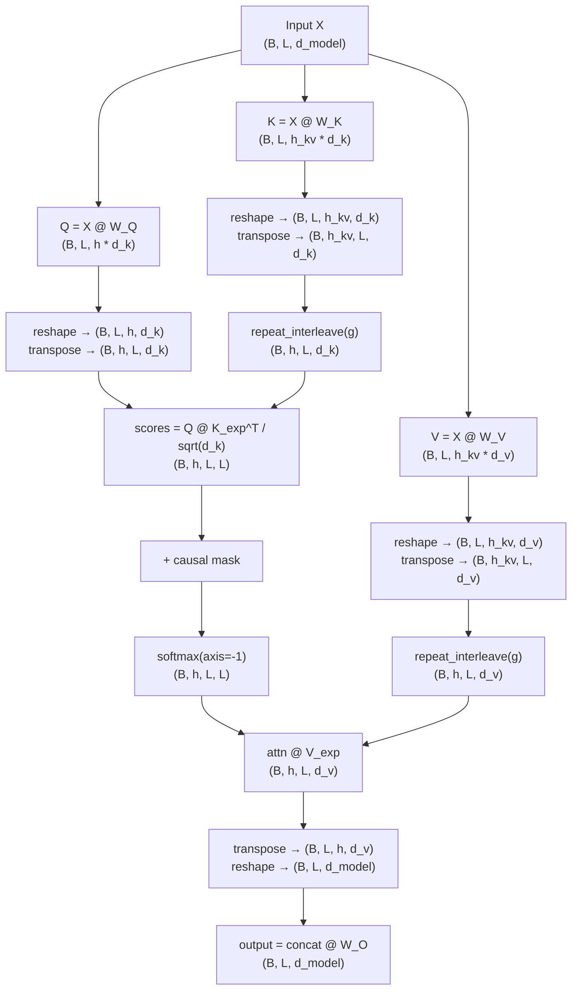

# Grouped-Query Attention

**Phase 3 · Topic 11** — How Llama 2, Mistral, and every production LLM reduce KV cache memory by sharing key/value heads across query head groups.

## What it is

Grouped-Query Attention (GQA) is a modification to Multi-Head Attention that reduces the number of key and value heads while keeping the full number of query heads. In standard MHA, every query head has its own dedicated key and value head -- $h$ query heads, $h$ key heads, $h$ value heads. GQA assigns multiple query heads to share a single key-value head, creating groups. With $h$ query heads and $h_{kv}$ key-value heads, each group of $h / h_{kv}$ query heads shares one KV pair. The attention computation within each group is identical to standard scaled dot-product attention; the only difference is that multiple query heads compute their scores against the same keys and weight the same values.

GQA is a generalization that unifies three attention variants along a single axis -- the number of KV heads:

- **Standard MHA** ($h_{kv} = h$): every query head has its own KV head. No sharing, no savings.
- **Grouped-Query Attention** ($1 < h_{kv} < h$): $h / h_{kv}$ query heads share each KV head. The sweet spot.
- **Multi-Query Attention** ($h_{kv} = 1$): all query heads share a single KV pair. Maximum compression.

Multi-Query Attention (MQA) was introduced first by Shazeer (2019) and adopted by PaLM and Falcon. It provided massive memory savings but caused quality degradation on some tasks because a single key-value representation must serve all query heads. GQA (Ainslie et al., 2023) recovered most of MQA's efficiency gains while preserving quality by allowing a small number of independent KV heads. Llama 2 70B uses 64 query heads with 8 KV heads (8x reduction). Mistral 7B uses 32 query heads with 8 KV heads (4x reduction). Llama 3 continues this pattern. GQA is now the default architecture for production LLMs because the KV cache memory savings translate directly to higher throughput, longer context windows, and more concurrent requests.

The implementation insight is that GQA does not require loops over groups. Instead, each KV head is repeated (or broadcast) to match the number of query heads in its group, and then standard MHA attention is computed. This repeat-interleave operation is the only difference from the MHA forward pass you already implemented. Understanding this operation -- and its implications for the backward pass, where gradients from multiple query heads must be accumulated back into shared KV head gradients -- is the core of this topic.

## The math

### Notation

- $d_{model}$ = model dimension (e.g., 4096)
- $h$ = number of query heads (e.g., 32, 64)
- $h_{kv}$ = number of key/value heads (e.g., 8). Must satisfy $h \bmod h_{kv} = 0$
- $g = h / h_{kv}$ = group size (number of query heads per KV head)
- $d_k = d_{model} / h$ = query/key head dimension
- $d_v = d_k$ = value head dimension (typically equal to $d_k$)
- $B$ = batch size
- $L$ = sequence length

### Projection weight shapes

The key difference from MHA is in the K and V projection matrices:

$$W_Q \in \mathbb{R}^{d_{model} \times (h \cdot d_k)} = \mathbb{R}^{d_{model} \times d_{model}}$$

$$W_K \in \mathbb{R}^{d_{model} \times (h_{kv} \cdot d_k)}$$

$$W_V \in \mathbb{R}^{d_{model} \times (h_{kv} \cdot d_v)}$$

$$W_O \in \mathbb{R}^{d_{model} \times d_{model}}$$

When $h_{kv} = h$, $W_K$ and $W_V$ are $d_{model} \times d_{model}$ -- standard MHA. When $h_{kv} < h$, they are smaller, reducing both parameter count and KV cache size.

### Forward pass



**Step by step with shapes:**

1. **Input:** $X \in \mathbb{R}^{B \times L \times d_{model}}$

2. **Project Q, K, V:**

$$Q = X W_Q \in \mathbb{R}^{B \times L \times (h \cdot d_k)}$$

$$K = X W_K \in \mathbb{R}^{B \times L \times (h_{kv} \cdot d_k)}$$

$$V = X W_V \in \mathbb{R}^{B \times L \times (h_{kv} \cdot d_v)}$$

Note: Q has $h \cdot d_k = d_{model}$ output features. K and V have only $h_{kv} \cdot d_k$ output features. This is where the parameter savings occur.

3. **Reshape to separate heads:**

$$Q \rightarrow (B, L, h, d_k) \xrightarrow{\text{transpose}(0,2,1,3)} (B, h, L, d_k)$$

$$K \rightarrow (B, L, h_{kv}, d_k) \xrightarrow{\text{transpose}(0,2,1,3)} (B, h_{kv}, L, d_k)$$

$$V \rightarrow (B, L, h_{kv}, d_v) \xrightarrow{\text{transpose}(0,2,1,3)} (B, h_{kv}, L, d_v)$$

4. **Expand KV heads to match query heads (the GQA-specific step):**

Each KV head is repeated $g = h / h_{kv}$ times along the head dimension:

$$K_{exp} = \text{repeat\_interleave}(K, g, \text{axis}=1) \in \mathbb{R}^{B \times h \times L \times d_k}$$

$$V_{exp} = \text{repeat\_interleave}(V, g, \text{axis}=1) \in \mathbb{R}^{B \times h \times L \times d_v}$$

Concretely, if $h_{kv} = 2$ and $g = 4$:

$$K = [K_0, K_1] \xrightarrow{\text{repeat}} K_{exp} = [K_0, K_0, K_0, K_0, K_1, K_1, K_1, K_1]$$

Query heads 0-3 attend against $K_0$, query heads 4-7 attend against $K_1$.

In NumPy, this is:

```python
K_exp = np.repeat(K, repeats=g, axis=1)  # (B, h_kv, L, d_k) -> (B, h, L, d_k)
```

5. **Compute attention (identical to standard MHA from here):**

$$\text{scores} = \frac{Q \cdot K_{exp}^\top}{\sqrt{d_k}} \in \mathbb{R}^{B \times h \times L \times L}$$

Apply causal mask if needed:

$$\text{scores} = \text{scores} + M \quad \text{where } M_{i,j} = \begin{cases} 0 & j \leq i \\ -\infty & j > i \end{cases}$$

$$A = \text{softmax}(\text{scores}, \text{axis}=-1) \in \mathbb{R}^{B \times h \times L \times L}$$

$$O = A \cdot V_{exp} \in \mathbb{R}^{B \times h \times L \times d_v}$$

6. **Merge heads and project output:**

$$O \xrightarrow{\text{transpose}(0,2,1,3)} (B, L, h, d_v) \xrightarrow{\text{reshape}} (B, L, d_{model})$$

$$\text{output} = O_{\text{merged}} \cdot W_O \in \mathbb{R}^{B \times L \times d_{model}}$$

### Complete forward pass shape table

| Step | Operation | Shape |
|------|-----------|-------|
| Input | $X$ | $(B, L, d_{model})$ |
| Q projection | $Q = X W_Q$ | $(B, L, h \cdot d_k)$ |
| K projection | $K = X W_K$ | $(B, L, h_{kv} \cdot d_k)$ |
| V projection | $V = X W_V$ | $(B, L, h_{kv} \cdot d_v)$ |
| Reshape Q | $.reshape(B, L, h, d_k)$ | $(B, L, h, d_k)$ |
| Transpose Q | $.transpose(0, 2, 1, 3)$ | $(B, h, L, d_k)$ |
| Reshape K | $.reshape(B, L, h_{kv}, d_k)$ | $(B, L, h_{kv}, d_k)$ |
| Transpose K | $.transpose(0, 2, 1, 3)$ | $(B, h_{kv}, L, d_k)$ |
| Expand K | $\text{repeat}(K, g, \text{axis}=1)$ | $(B, h, L, d_k)$ |
| Expand V | $\text{repeat}(V, g, \text{axis}=1)$ | $(B, h, L, d_v)$ |
| Attention scores | $Q K_{exp}^\top / \sqrt{d_k}$ | $(B, h, L, L)$ |
| Mask (optional) | $\text{scores} + M$ | $(B, h, L, L)$ |
| Softmax | $\text{softmax}(\text{scores})$ | $(B, h, L, L)$ |
| Value weighting | $A \cdot V_{exp}$ | $(B, h, L, d_v)$ |
| Transpose back | $.transpose(0, 2, 1, 3)$ | $(B, L, h, d_v)$ |
| Reshape (merge) | $.reshape(B, L, d_{model})$ | $(B, L, d_{model})$ |
| Output projection | $O_{\text{merged}} \cdot W_O$ | $(B, L, d_{model})$ |

### The three special cases

The entire spectrum is controlled by $h_{kv}$:

| Variant | $h_{kv}$ | $g$ | $W_K$ shape | KV cache per layer |
|---------|-----------|-----|-------------|-------------------|
| MHA | $h$ | $1$ | $(d_{model}, d_{model})$ | $2 \cdot h \cdot L \cdot d_k$ |
| GQA | $h / r$ for $r > 1$ | $r$ | $(d_{model}, h_{kv} \cdot d_k)$ | $2 \cdot h_{kv} \cdot L \cdot d_k$ |
| MQA | $1$ | $h$ | $(d_{model}, d_k)$ | $2 \cdot L \cdot d_k$ |

When $h_{kv} = h$, the repeat operation is a no-op ($g = 1$), and GQA reduces exactly to standard MHA. When $h_{kv} = 1$, all $h$ query heads share a single KV pair -- MQA.

### Backward pass

The backward pass follows the same chain rule as MHA, with one critical addition: the gradient through the repeat-interleave operation must accumulate gradients from all query heads in a group back to the shared KV head.

Let $g_{\text{out}} = \frac{\partial \mathcal{L}}{\partial \text{output}} \in \mathbb{R}^{B \times L \times d_{model}}$.

**Steps 1-5 are identical to MHA backward** (output projection, head merge, value weighting, softmax, scaling and $QK^\top$). The shapes of $\nabla Q$, $\nabla K_{exp}$, and $\nabla V_{exp}$ are all $(B, h, L, d_k)$ or $(B, h, L, d_v)$.

**Step 6: Gradient through repeat-interleave (GQA-specific)**

This is the key difference. During the forward pass, each KV head was repeated $g$ times:

$$K_{exp}[:, i, :, :] = K[:, \lfloor i/g \rfloor, :, :] \quad \text{for } i = 0, \ldots, h-1$$

The gradient reverses this by summing over the group:

$$\frac{\partial \mathcal{L}}{\partial K}[:, j, :, :] = \sum_{i=jg}^{(j+1)g - 1} \frac{\partial \mathcal{L}}{\partial K_{exp}}[:, i, :, :]$$

In other words, each KV head receives the sum of gradients from all $g$ query heads that used it. In NumPy:

```python
# grad_K_exp has shape (B, h, L, d_k)
# Reshape to (B, h_kv, g, L, d_k) and sum over the group dimension
grad_K = grad_K_exp.reshape(B, h_kv, g, L, d_k).sum(axis=2)  # (B, h_kv, L, d_k)
grad_V = grad_V_exp.reshape(B, h_kv, g, L, d_v).sum(axis=2)  # (B, h_kv, L, d_v)
```

**Step 7: Gradient through head split and projections**

After obtaining $\nabla K \in \mathbb{R}^{B \times h_{kv} \times L \times d_k}$ and $\nabla V \in \mathbb{R}^{B \times h_{kv} \times L \times d_v}$:

$$\nabla K_{\text{flat}} = \nabla K.\text{transpose}(0,2,1,3).\text{reshape}(B, L, h_{kv} \cdot d_k)$$

$$\nabla V_{\text{flat}} = \nabla V.\text{transpose}(0,2,1,3).\text{reshape}(B, L, h_{kv} \cdot d_v)$$

$$\frac{\partial \mathcal{L}}{\partial W_K} = \text{einsum}(\texttt{"blm,bld->md"}, X, \nabla K_{\text{flat}}) \in \mathbb{R}^{d_{model} \times (h_{kv} \cdot d_k)}$$

$$\frac{\partial \mathcal{L}}{\partial W_V} = \text{einsum}(\texttt{"blm,bld->md"}, X, \nabla V_{\text{flat}}) \in \mathbb{R}^{d_{model} \times (h_{kv} \cdot d_v)}$$

The input gradient accumulates from all three projection paths:

$$\frac{\partial \mathcal{L}}{\partial X} = \nabla Q_{\text{flat}} \cdot W_Q^\top + \nabla K_{\text{flat}} \cdot W_K^\top + \nabla V_{\text{flat}} \cdot W_V^\top$$

Note that $\nabla K_{\text{flat}} \cdot W_K^\top$ has shape $(B, L, h_{kv} \cdot d_k) \times (h_{kv} \cdot d_k, d_{model}) = (B, L, d_{model})$. The dimension reduction from $h$ to $h_{kv}$ has already been handled by the group summation.

#### Summary: what to cache during forward

| Cached value | Shape | Used in backward |
|-------------|-------|------------------|
| $X$ (input) | $(B, L, d_{model})$ | $\nabla W_Q$, $\nabla W_K$, $\nabla W_V$ |
| $Q$ (after transpose) | $(B, h, L, d_k)$ | $\nabla K_{exp}$ |
| $K_{exp}$ (expanded) | $(B, h, L, d_k)$ | $\nabla Q$ |
| $V_{exp}$ (expanded) | $(B, h, L, d_v)$ | $\nabla A$ |
| $A$ (attention weights) | $(B, h, L, L)$ | softmax backward, $\nabla V_{exp}$ |
| $O_{\text{merged}}$ (concat) | $(B, L, d_{model})$ | $\nabla W_O$ |

## Why it matters for inference

GQA is one of the most impactful architectural decisions for inference efficiency. Every production LLM serving system benefits from it.

### KV cache memory reduction

The KV cache stores $K$ and $V$ tensors for all previously generated tokens. Its size determines how many concurrent requests a server can handle and how long the context window can be.

**MHA KV cache per layer:**

$$\text{cache}_{MHA} = 2 \cdot h \cdot L \cdot d_k \cdot \text{bytes\_per\_element}$$

**GQA KV cache per layer:**

$$\text{cache}_{GQA} = 2 \cdot h_{kv} \cdot L \cdot d_k \cdot \text{bytes\_per\_element}$$

**Reduction factor:**

$$\frac{\text{cache}_{MHA}}{\text{cache}_{GQA}} = \frac{h}{h_{kv}} = g$$

#### Concrete example: Llama 2 70B

| Parameter | Value |
|-----------|-------|
| $n_{layers}$ | 80 |
| $h$ | 64 |
| $h_{kv}$ | 8 |
| $d_{model}$ | 8192 |
| $d_k$ | 128 |
| Precision | FP16 (2 bytes) |
| Context length | 4096 |

**MHA KV cache (hypothetical):**

$$80 \times 2 \times 64 \times 4096 \times 128 \times 2 = 107 \text{ GB}$$

**GQA KV cache (actual):**

$$80 \times 2 \times 8 \times 4096 \times 128 \times 2 = 13.4 \text{ GB}$$

8x reduction -- the difference between needing 2 GPUs just for KV cache versus fitting it on one.

### FLOPs analysis: what changes and what does not

GQA reduces projection parameters and KV cache, but the attention core computation is unchanged.

**Projection FLOPs (changes):**

$$\text{MHA projections} = 2BL \cdot d_{model} \cdot (3 \cdot d_{model} + d_{model}) = 8BL \cdot d_{model}^2$$

$$\text{GQA projections} = 2BL \cdot d_{model} \cdot (d_{model} + 2 \cdot h_{kv} \cdot d_k + d_{model})$$

$$= 2BL \cdot d_{model} \cdot (2 \cdot d_{model} + 2 \cdot h_{kv} \cdot d_k)$$

For Llama 2 70B ($h_{kv} \cdot d_k = 8 \times 128 = 1024$, $d_{model} = 8192$):

$$\text{GQA projections} = 2BL \cdot 8192 \cdot (2 \times 8192 + 2 \times 1024) = 2BL \cdot 8192 \cdot 18432$$

$$\text{MHA projections} = 2BL \cdot 8192 \cdot (4 \times 8192) = 2BL \cdot 8192 \cdot 32768$$

GQA saves $\sim 44\%$ of projection FLOPs. But projections are only part of the story.

**Attention core FLOPs (unchanged):**

The $QK^\top$ and $AV$ matmuls are computed with $h$ query heads regardless, because every query head still produces attention scores:

$$\text{attention FLOPs} = 2 \cdot B \cdot h \cdot L^2 \cdot d_k + 2 \cdot B \cdot h \cdot L^2 \cdot d_v = 4BhL^2 d_k$$

This is identical for MHA and GQA. The query heads still attend over the full sequence -- they just share keys and values.

**Repeat-interleave cost:**

The KV expansion is a memory copy, not a matmul. For long sequences, this cost is negligible compared to the $O(L^2)$ attention computation. In optimized implementations (PyTorch, CUDA), this can be done via broadcasting without materializing the expanded tensor.

### Compute-bound vs memory-bound regimes

| Phase | Bottleneck | GQA impact |
|-------|-----------|------------|
| Prefill (processing prompt) | Compute-bound (large batch matmuls) | Modest savings from smaller $W_K$, $W_V$ |
| Decode (generating tokens) | Memory-bound (reading KV cache) | Massive savings -- $g$x less KV data to read per step |

During decode, each token requires reading the entire KV cache. With GQA, reading $h_{kv}$ KV heads instead of $h$ directly reduces memory bandwidth by factor $g$. Since decode is memory-bandwidth bound, this translates almost linearly to throughput improvement.

### Connection to inference systems

| Optimization | GQA interaction |
|-------------|-----------------|
| **KV cache (Topic 16)** | GQA cache stores $(B, h_{kv}, L, d_k)$ instead of $(B, h, L, d_k)$ |
| **PagedAttention (vLLM)** | Smaller KV per token = more tokens per page = less fragmentation |
| **Tensor parallelism** | KV heads can be fewer than GPU count -- must handle non-uniform head distribution |
| **Speculative decoding** | Smaller KV cache = cheaper to verify draft tokens |
| **Flash Attention** | Unchanged -- operates on per-head attention, just with fewer unique KV heads |

### Why not always use MQA?

MQA ($h_{kv} = 1$) was introduced first and gives maximum memory savings. But empirical results show quality degradation, especially on tasks requiring diverse attention patterns. With a single KV head, all query heads are forced to attend over the same representation -- they can compute different attention weights (because $Q$ differs per head) but the information they can extract is constrained to one shared set of keys and values.

GQA with $h_{kv} = 8$ preserves 8 independent KV representations while still achieving large savings. The quality-efficiency tradeoff is empirically favorable: Llama 2 70B with GQA matches or exceeds the MHA baseline on benchmarks while using 8x less KV cache.

## Connection to multi-head attention (Topic 10)

The MHA implementation you built in the previous topic computes attention with $h$ query heads, $h$ key heads, and $h$ value heads, all using $(d_{model} \times d_{model})$ projection matrices. GQA modifies three things:

1. $W_K$ shrinks from $(d_{model}, d_{model})$ to $(d_{model}, h_{kv} \cdot d_k)$
2. $W_V$ shrinks from $(d_{model}, d_{model})$ to $(d_{model}, h_{kv} \cdot d_v)$
3. A repeat-interleave step is inserted after K/V head splitting, before computing attention scores

Everything else -- the Q projection, the softmax, the output projection, the head merge -- is identical. When $h_{kv} = h$ ($g = 1$), the repeat is a no-op and GQA reduces exactly to MHA. This is a key correctness test.

## What to implement

### Core class

- [ ] `GroupedQueryAttention` class with `__init__(self, d_model, num_heads, num_kv_heads)`
  - Validate: $d_{model} \bmod h = 0$ (raise `ValueError`)
  - Validate: $h \bmod h_{kv} = 0$ (raise `ValueError`)
  - Derive: $d_k = d_v = d_{model} / h$, $g = h / h_{kv}$
  - Initialize projection matrices:
    - $W_Q \in \mathbb{R}^{d_{model} \times d_{model}}$
    - $W_K \in \mathbb{R}^{d_{model} \times (h_{kv} \cdot d_k)}$
    - $W_V \in \mathbb{R}^{d_{model} \times (h_{kv} \cdot d_v)}$
    - $W_O \in \mathbb{R}^{d_{model} \times d_{model}}$
  - Xavier initialization: $W \sim \mathcal{N}(0, \sqrt{2 / (n_{in} + n_{out})})$

### Forward pass

- [ ] Q, K, V projections via fused GEMMs (no loops)
- [ ] Reshape and transpose Q to $(B, h, L, d_k)$
- [ ] Reshape and transpose K to $(B, h_{kv}, L, d_k)$
- [ ] Reshape and transpose V to $(B, h_{kv}, L, d_v)$
- [ ] Repeat-interleave K and V along head dimension: $(B, h_{kv}, L, d_k) \rightarrow (B, h, L, d_k)$
- [ ] Scaled dot-product attention batched over $B$ and $h$ (use `@` operator, no loops)
- [ ] Numerically stable softmax (subtract max before exp)
- [ ] Optional causal mask, shape $(1, 1, L, L)$, broadcast over $B$ and $h$
- [ ] Head merge via transpose and reshape to $(B, L, d_{model})$
- [ ] Output projection via $W_O$
- [ ] Cache all intermediates for backward pass

### Backward pass

- [ ] Gradient through output projection ($\nabla W_O$, $\nabla O_{\text{merged}}$)
- [ ] Gradient through head merge (reshape + transpose reversal)
- [ ] Gradient through value weighting ($\nabla A$, $\nabla V_{exp}$)
- [ ] Gradient through softmax (vectorized across all heads)
- [ ] Gradient through scaling and $QK^\top$ ($\nabla Q$, $\nabla K_{exp}$)
- [ ] **Gradient through repeat-interleave:** reshape $\nabla K_{exp}$ to $(B, h_{kv}, g, L, d_k)$ and sum over group axis. Same for $\nabla V_{exp}$.
- [ ] Gradient through head split (transpose + reshape reversal for Q, K, V)
- [ ] Gradient through Q, K, V projections ($\nabla W_Q$, $\nabla W_K$, $\nabla W_V$, $\nabla X$)
- [ ] All gradients stored as attributes
- [ ] Return $\frac{\partial \mathcal{L}}{\partial X} \in \mathbb{R}^{B \times L \times d_{model}}$

### Utility functions

- [ ] `repeat_kv(x, num_repeats)`: expand $(B, h_{kv}, L, d_k)$ to $(B, h, L, d_k)$ via `np.repeat`
- [ ] `create_causal_mask(seq_len)`: upper triangular $-\infty$ mask, shape $(1, 1, L, L)$

### Analysis functions

- [ ] `count_parameters(d_model, num_heads, num_kv_heads)`: return parameter counts for each projection matrix and total. Compare MHA vs GQA.
- [ ] `kv_cache_size(batch_size, seq_len, num_kv_heads, d_k, dtype='float16')`: return KV cache bytes for a single layer
- [ ] `kv_cache_size_model(batch_size, seq_len, num_layers, num_kv_heads, d_k, dtype='float16')`: return total KV cache bytes across all layers
- [ ] `count_flops(batch_size, seq_len, d_model, num_heads, num_kv_heads)`: return total forward FLOPs, broken down by projections vs attention core

## Test cases to cover

### Correctness tests

- [ ] **MHA equivalence**: GQA with $h_{kv} = h$ produces output identical to the MHA implementation from Topic 10 given the same weights. Set weights explicitly and compare with `np.allclose(atol=1e-6)`.

- [ ] **MQA special case**: GQA with $h_{kv} = 1$ works correctly. All query heads share a single KV pair. Verify by manually constructing the expected output.

- [ ] **Known input/output**: With $d_{model} = 8$, $h = 4$, $h_{kv} = 2$, $L = 3$, use fixed weights and input. Compute the expected output by hand (or with explicit per-group computation). Verify match.

- [ ] **Attention weights sum to 1**: For every query head and every position, `attn_weights.sum(axis=-1)` equals 1 within tolerance $10^{-6}$.

- [ ] **Batch independence**: Output for batch element $i$ does not depend on batch element $j$. Run with $B = 2$, verify outputs match individual runs.

### Gradient tests

- [ ] **Gradient check (central finite differences)**: Perturb each parameter by $\epsilon = 10^{-5}$, verify gradient matches:
  $$\frac{|\text{analytical} - \text{numerical}|}{|\text{analytical}| + |\text{numerical}| + 10^{-8}} < 10^{-5}$$
  Check $W_Q$, $W_K$, $W_V$, $W_O$, and input $X$. Test with and without causal mask.

- [ ] **Shared KV gradient accumulation**: Verify that the gradient for $W_K$ is the sum of contributions from all $g$ query heads in each group. Specifically: compute GQA backward, then manually compute per-query-head gradients for $K$, group them, sum, and verify they match.

- [ ] **Gradient shape correctness**: $\nabla W_K \in \mathbb{R}^{d_{model} \times (h_{kv} \cdot d_k)}$ (not $d_{model} \times d_{model}$).

### Masking tests

- [ ] **Causal mask correctness**: Position $i$ has zero attention weight to positions $j > i$ for every query head.

- [ ] **Causal mask broadcasts**: The same mask is applied to all $h$ query heads and all $B$ batch elements.

- [ ] **Single token with mask**: $L = 1$ produces attention weight $[[1.0]]$ for every head.

### Configuration validation tests

- [ ] **$h \bmod h_{kv} \neq 0$ raises ValueError**: e.g., $h = 7$, $h_{kv} = 3$.

- [ ] **$d_{model} \bmod h \neq 0$ raises ValueError**: e.g., $d_{model} = 100$, $h = 7$.

- [ ] **Various valid configs**: test $(h=8, h_{kv}=8)$, $(h=8, h_{kv}=4)$, $(h=8, h_{kv}=2)$, $(h=8, h_{kv}=1)$.

### Shape tests

- [ ] Output shape is always $(B, L, d_{model})$ regardless of $h_{kv}$.
- [ ] Internal K projection shape: $(B, L, h_{kv} \cdot d_k)$, not $(B, L, d_{model})$ when $h_{kv} < h$.
- [ ] Expanded K shape: $(B, h, L, d_k)$ after repeat-interleave.
- [ ] Attention scores shape: $(B, h, L, L)$ -- always $h$ query heads.
- [ ] Variable batch sizes: $B = 1, 4, 16$.
- [ ] Variable sequence lengths: $L = 1, 16, 128$.

### Numerical stability tests

- [ ] **Large scores without NaN**: Inputs in range $[-100, 100]$ produce finite outputs.

- [ ] **Softmax stability**: Logits that would overflow naive softmax (values > 700) are handled correctly via max subtraction.

- [ ] **Gradient stability**: Backward pass produces finite gradients even for near-saturated softmax.

### Memory analysis tests

- [ ] **KV cache reduction ratio**: For $(h=64, h_{kv}=8)$, verify `kv_cache_size` with $h_{kv}=8$ is exactly $8\times$ smaller than with $h_{kv}=64$.

- [ ] **Parameter count**: $W_K$ for GQA has $d_{model} \times h_{kv} \cdot d_k$ parameters, vs $d_{model}^2$ for MHA.

- [ ] **Llama 2 70B config**: Verify KV cache at 4096 context, FP16 = approximately 13.4 GB with 80 layers, 8 KV heads, $d_k = 128$.

- [ ] **Mistral 7B config**: Verify KV cache at 8192 context, FP16 with 32 layers, 8 KV heads, $d_k = 128$.

- [ ] **FLOPs breakdown**: Verify that attention core FLOPs are identical for MHA and GQA (only projection FLOPs differ).

### Integration tests

- [ ] **Repeat-interleave roundtrip**: `repeat_kv` followed by reshape-and-sum recovers the original tensor.

- [ ] **Forward determinism**: Same input and weights always produce the same output (no randomness in forward pass after initialization).

## Implementation notes

### Weight initialization

Xavier/Glorot initialization for all projection matrices:

$$W \sim \mathcal{N}\left(0, \sqrt{\frac{2}{n_{in} + n_{out}}}\right)$$

Note that $W_K$ and $W_V$ have smaller $n_{out}$ than $W_Q$, which affects the initialization scale.

### Repeat-interleave in NumPy

The KV head expansion is the only GQA-specific operation. In NumPy:

```python
def repeat_kv(x, num_repeats):
    """Expand KV heads: (B, h_kv, L, d) -> (B, h_kv * num_repeats, L, d)"""
    if num_repeats == 1:
        return x
    return np.repeat(x, repeats=num_repeats, axis=1)
```

The reverse (for the backward pass) sums over groups:

```python
def reduce_kv_grad(grad_expanded, num_kv_heads, group_size):
    """Sum gradients from query head groups: (B, h, L, d) -> (B, h_kv, L, d)"""
    B, h, L, d = grad_expanded.shape
    return grad_expanded.reshape(B, num_kv_heads, group_size, L, d).sum(axis=2)
```

### Numerical stability checklist

1. **Softmax**: subtract row-wise max before exponentiating
2. **Masking**: use $-10^9$ instead of `-np.inf` if inf causes NaN in softmax backward
3. **Gradient through softmax**: $A \odot (g - \text{rowsum}(g \odot A))$ is stable because $A \in [0, 1]$

### What NOT to implement here

- **KV cache management**: That is Topic 16. This module computes GQA for a given input, not incremental decoding.
- **Positional encoding / RoPE**: Topics 12-13. GQA is position-agnostic.
- **Flash attention**: Topic 17. This is the naive materialized-attention version.
- **Dropout on attention weights**: Irrelevant for inference focus.

## Reference dimensions

Use these for testing:

```python
# Small test config
d_model = 64
num_heads = 8
num_kv_heads = 2  # group_size = 4
batch_size = 2
seq_len = 16
d_k = d_model // num_heads  # 8

# Llama 2 7B-scale
d_model_7b = 4096
num_heads_7b = 32
num_kv_heads_7b = 32  # Llama 2 7B uses MHA
d_k_7b = 128

# Llama 2 70B-scale
d_model_70b = 8192
num_heads_70b = 64
num_kv_heads_70b = 8  # GQA: 8x reduction
d_k_70b = 128

# Mistral 7B-scale
d_model_mistral = 4096
num_heads_mistral = 32
num_kv_heads_mistral = 8  # GQA: 4x reduction
d_k_mistral = 128
```

## References

- "Fast Transformer Decoding: One Write-Head is All You Need" (Shazeer, 2019) -- introduced Multi-Query Attention
- "GQA: Training Generalized Multi-Query Transformer Models from Multi-Head Checkpoints" (Ainslie et al., 2023) -- introduced Grouped-Query Attention, showed uptraining from MHA to GQA
- "Llama 2: Open Foundation and Fine-Tuned Chat Models" (Touvron et al., 2023) -- adopted GQA for the 70B model
- "Attention Is All You Need" (Vaswani et al., 2017) -- original Multi-Head Attention
