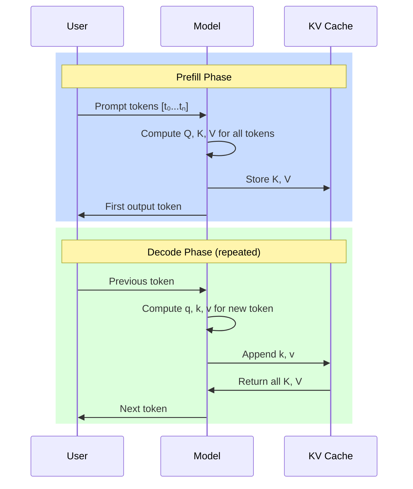

# KV Cache

**Phase 3 · Topic 16** — The memory bottleneck that defines inference optimization.

## What it is

KV caching stores the key and value tensors from previous token positions so they don't need to be recomputed during autoregressive generation. In the naive approach, generating $n$ tokens requires recomputing attention from scratch $n$ times, each time processing all previous tokens. This results in $O(n^2)$ total computation for the projection operations alone. With KV caching, each new token only computes its own single-token $Q$, $K$, and $V$ projections, then appends $K$ and $V$ to the cache and attends over the full cached history.

The insight is simple: in autoregressive generation, the $K$ and $V$ values for position $i$ don't depend on tokens at positions $> i$. Once computed, they never change. Only $Q$ needs the current token's embedding because $Q$ determines "what am I looking for?" while $K$ and $V$ answer "what information do I provide?" for each cached position.

KV caching transforms generation from compute-bound (recomputing projections) to memory-bound (reading/writing the cache). For long sequences, the cache itself becomes the dominant memory consumer, often exceeding the model weights. This makes KV cache management the central challenge in inference systems.

## The math

### Without KV cache (naive autoregressive generation)

At generation step $t$, we have tokens $[0, 1, \ldots, t]$ and must compute attention:

$$X = [x_0, x_1, \ldots, x_t] \in \mathbb{R}^{(t+1) \times d_{model}}$$

$$Q = X W_Q \in \mathbb{R}^{(t+1) \times d_k}$$

$$K = X W_K \in \mathbb{R}^{(t+1) \times d_k}$$

$$V = X W_V \in \mathbb{R}^{(t+1) \times d_v}$$

$$\text{scores} = \frac{Q K^\top}{\sqrt{d_k}} \in \mathbb{R}^{(t+1) \times (t+1)}$$

$$\text{attn\_weights} = \text{softmax}(\text{scores}, \text{axis}=-1)$$

$$\text{output} = \text{attn\_weights} \cdot V \in \mathbb{R}^{(t+1) \times d_v}$$

We only need $\text{output}[t]$ (the last position), but we computed everything.

**Total compute for generating $n$ tokens:**
- Step 1: project 1 token, attend over 1
- Step 2: project 2 tokens, attend over 2
- ...
- Step $n$: project $n$ tokens, attend over $n$

Projection FLOPs: $\sum_{i=1}^{n} i \cdot 3 \cdot d_{model} \cdot d_k = O(n^2 \cdot d)$

### With KV cache

At generation step $t$, only process the new token $x_t$:

$$q_t = x_t W_Q \in \mathbb{R}^{1 \times d_k}$$

$$k_t = x_t W_K \in \mathbb{R}^{1 \times d_k}$$

$$v_t = x_t W_V \in \mathbb{R}^{1 \times d_v}$$

$$K_{cache} = \text{concat}(K_{cache}, k_t) \in \mathbb{R}^{(t+1) \times d_k}$$

$$V_{cache} = \text{concat}(V_{cache}, v_t) \in \mathbb{R}^{(t+1) \times d_v}$$

$$\text{scores} = \frac{q_t K_{cache}^\top}{\sqrt{d_k}} \in \mathbb{R}^{1 \times (t+1)}$$

$$\text{attn\_weights} = \text{softmax}(\text{scores}, \text{axis}=-1)$$

$$\text{output} = \text{attn\_weights} \cdot V_{cache} \in \mathbb{R}^{1 \times d_v}$$

**Total compute for generating $n$ tokens:**
- Each step: project 1 token (constant), attend over growing cache
- Projection FLOPs: $n \cdot 3 \cdot d_{model} \cdot d_k = O(n \cdot d)$
- Attention FLOPs: $\sum_{i=1}^{n} i \cdot d_k = O(n^2 \cdot d_k)$

The projection cost drops from $O(n^2)$ to $O(n)$. Attention is still $O(n^2)$ total, but each step is $O(t)$ not $O(t^2)$.

### Memory analysis

**Per-layer KV cache size:**

$$\text{cache\_size\_per\_layer} = 2 \cdot \text{seq\_len} \cdot d_k \cdot \text{bytes\_per\_element}$$

$$= 2 \cdot \text{seq\_len} \cdot \frac{d_{model}}{n_{heads}} \cdot \text{bytes}$$

**Total KV cache for full model:**

$$\text{total\_cache} = n_{layers} \cdot n_{heads} \cdot 2 \cdot \text{seq\_len} \cdot d_k \cdot \text{bytes\_per\_element}$$

For a typical 7B model (32 layers, 32 heads, $d_{model}=4096$, $d_k=128$, FP16):

$$= 32 \cdot 32 \cdot 2 \cdot \text{seq\_len} \cdot 128 \cdot 2 \text{ bytes}$$

$$= 524{,}288 \cdot \text{seq\_len} \text{ bytes}$$

$$= 0.5 \text{ MB per token}$$

At $\text{seq\_len} = 4096$: **2 GB** just for KV cache.
At $\text{seq\_len} = 32768$ (extended context): **16 GB** for KV cache alone.

**Batch dimension:**

$$\text{total\_cache} = \text{batch\_size} \cdot n_{layers} \cdot n_{heads} \cdot 2 \cdot \text{seq\_len} \cdot d_k \cdot \text{bytes}$$

With $\text{batch\_size} = 32$ and $\text{seq\_len} = 4096$: **64 GB** for KV cache.

This is why KV cache is THE memory bottleneck in LLM inference.

### Why K and V don't change

In causal (decoder-only) attention, position $i$ can only attend to positions $\leq i$. The attention pattern is:

| Position | 0 | 1 | 2 | 3 | (query position) |
|----------|---|---|---|---|------------------|
| Can see  | 0 | 0,1 | 0,1,2 | 0,1,2,3 | |

When we compute $K_1 = x_1 W_K$, this value depends only on $x_1$ and the fixed weights $W_K$. Token $x_2$ arriving later doesn't change $x_1$ or $W_K$, so $K_1$ remains valid.

The same logic applies to $V$. Only $Q$ conceptually "changes" in that each new position has its own query asking "what should I attend to?" against the fixed $K$/$V$ history.

## Why it matters for inference

KV cache is the single most important concept connecting ML theory to inference systems engineering:



**Memory dominates:** For long sequences and large batches, KV cache exceeds model weight memory. A 7B model in FP16 is ~14 GB, but KV cache for a batch of 32 at 8K context is $32 \times 8192 \times 0.5 \text{ MB} = $ **128 GB**.

**This motivates all major inference optimizations:**

| Optimization | What it does | Why it helps |
|--------------|--------------|--------------|
| **PagedAttention** (vLLM) | Manages KV cache like virtual memory pages | Eliminates fragmentation, enables cache sharing |
| **GQA / MQA** | Share $K$/$V$ heads across query heads | Reduces cache size by $n_{heads} / n_{kv\_heads}$ |
| **KV cache quantization** | Store $K$/$V$ in FP8 or INT8 | 2x memory reduction |
| **Sliding window** (Mistral) | Only cache last $N$ positions | Bounds cache size at $O(N)$ |
| **Speculative decoding** | Batch verify draft tokens | Amortizes cache overhead |

**Understanding the naive version is prerequisite to optimizations:** You cannot reason about PagedAttention page sizes without understanding what's being paged. You cannot evaluate GQA memory savings without knowing the baseline. This implementation builds that foundation.

## What to implement

### Core components

- [ ] `KVCache` class that stores $K$ and $V$ tensors per layer
  - Initialize with max_seq_len, n_layers, n_heads, $d_k$
  - Track current sequence length
  - Support pre-allocation vs. dynamic growth

- [ ] `append(layer_idx, k, v)` operation
  - Append new $k$, $v$ tensors to the cache for given layer
  - Handle shape validation: $k$ and $v$ must be $(\text{batch}, n_{heads}, 1, d_k)$
  - Return updated cache views

- [ ] `get_kv(layer_idx)` operation
  - Return $(K_{cache}, V_{cache})$ for attention computation
  - Shape: $(\text{batch}, n_{heads}, \text{seq\_len}, d_k)$

### Autoregressive generation

- [ ] `generate_without_cache(model, prompt, n_tokens)` baseline
  - Full recomputation at each step
  - Return generated tokens and total FLOPs

- [ ] `generate_with_cache(model, prompt, n_tokens)`
  - Use KVCache for incremental generation
  - Return generated tokens and total FLOPs

- [ ] Verify both produce identical outputs

### Analysis utilities

- [ ] `memory_usage(cache)` - return bytes used
- [ ] `flops_comparison(seq_len)` - compare with/without cache
- [ ] Visualization of memory growth over sequence length

### Multi-layer support

- [ ] Cache management across all transformer layers
- [ ] Prefill phase: process full prompt, populate cache
- [ ] Decode phase: single-token generation using cache

## Test cases to cover

### Correctness tests

- [ ] **Output equivalence:** Generate 10 tokens with and without cache. Outputs must be identical (use `np.allclose` with tight tolerance).

- [ ] **Prefill equivalence:** For a prompt of length $L$, verify that running full attention on $[0:L]$ produces identical $K$, $V$ to incrementally building the cache token by token.

- [ ] **Incremental consistency:** After generating tokens $[0, 1, 2]$, the cache contains $K_0, K_1, K_2$. Verify these match what you'd get from batched projection of $[x_0, x_1, x_2]$.

- [ ] **Attention output correctness:** At step $t$, verify $q_t K_{cache}^\top V_{cache}$ equals the $t$-th row of full attention output.

### Shape validation tests

- [ ] Cache shape after 1 append: $(\text{batch}, n_{heads}, 1, d_k)$
- [ ] Cache shape after $N$ appends: $(\text{batch}, n_{heads}, N, d_k)$
- [ ] Batch dimension preserved correctly across appends
- [ ] Multi-layer cache maintains separate tensors per layer

### Memory tests

- [ ] **Size calculation:** For known dimensions, verify `cache.memory_bytes()` matches manual calculation: $2 \cdot n_{layers} \cdot \text{batch} \cdot n_{heads} \cdot \text{seq\_len} \cdot d_k \cdot \text{element\_size}$

- [ ] **Growth verification:** Memory grows linearly with sequence length. Plot or verify numerically.

- [ ] **Pre-allocation vs dynamic:** If supporting both modes, verify memory behavior differs appropriately.

### Edge cases

- [ ] **Empty cache:** Get from empty cache returns shape $(\text{batch}, n_{heads}, 0, d_k)$
- [ ] **Single token:** Cache with $\text{seq\_len}=1$ computes correctly
- [ ] **Batch size 1:** Single-sample batch works correctly
- [ ] **Max length reached:** Behavior when cache hits max_seq_len (error or sliding window)

### Numerical stability

- [ ] **FP16 accumulation:** If using FP16, verify no precision degradation over long sequences
- [ ] **Large values:** Cache handles large activation magnitudes without overflow

### Performance tests

- [ ] **FLOP comparison:** Verify theoretical speedup: without cache $O(n^2 \cdot d)$, with cache $O(n \cdot d)$ for projections
- [ ] **Timing comparison:** For $\text{seq\_len} \geq 100$, cached version should be measurably faster

## Reference dimensions

Use these for testing consistency:

```python
# Small test model
batch_size = 2
n_layers = 4
n_heads = 8
d_model = 256
d_k = d_model // n_heads  # 32
max_seq_len = 128

# 7B-scale dimensions (for memory analysis only)
batch_size_7b = 1
n_layers_7b = 32
n_heads_7b = 32
d_model_7b = 4096
d_k_7b = 128
```

## Files to create

```
machine-learning/03-transformers/kv-cache/
├── README.md              # This spec
├── implementation.py      # KVCache class + generation functions
├── test_kv_cache.py       # All test cases above
└── explanation.md         # Detailed walkthrough (created later)
```
