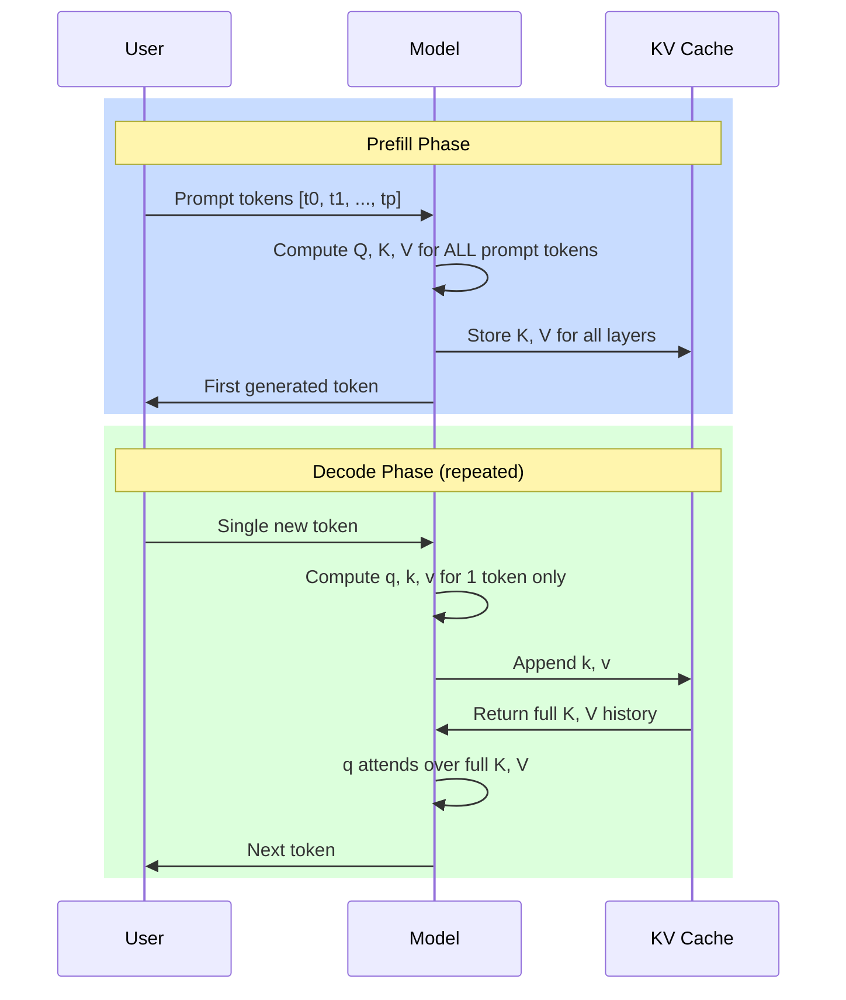
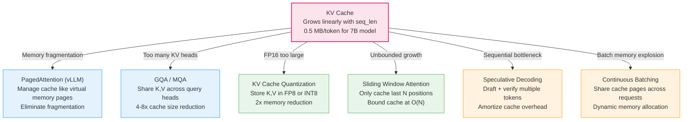

# KV Cache -- Deep Dive

## The Intuition

### What Problem Are We Solving?

In the previous topic (causal decoding), we built a complete language model that generates text one token at a time. The generation loop looks like this: process the full sequence through every transformer block, extract the last position's logits, sample a token, append it to the sequence, and repeat. Every iteration runs a full forward pass over the *entire* sequence -- prompt plus all previously generated tokens.

Here is the waste, made concrete. Suppose you have a 100-token prompt and want to generate 100 new tokens:

- Step 1: Forward pass over 101 tokens (100 prompt + 1 new). You use the last position's output and throw away the other 100.
- Step 2: Forward pass over 102 tokens. The first 101 positions produce the *exact same* outputs as step 1 (causality guarantees this). You throw them away again.
- Step 3: Forward pass over 103 tokens. The first 102 positions are identical to step 2. Thrown away again.
- ...
- Step 100: Forward pass over 200 tokens. 199 positions are wasted.

The total token-steps for projections alone: $\sum_{i=1}^{100}(100 + i) = 15{,}050$. With a cache, you process the 100 prompt tokens once during prefill, then 1 token per decode step: $100 + 100 = 200$ token-steps. The naive approach does **75x more projection work**.

This is not a theoretical concern. For a 7B-parameter model generating 1000 tokens, the naive approach recomputes billions of floating-point operations that produce results the model already computed and discarded moments ago.

### The Key Insight

In causal (decoder-only) attention, the key and value at position $i$ depend only on token $x_i$ and the fixed weight matrices $W_K$ and $W_V$. When a new token arrives at position $i+1$, it does not change $x_i$, $W_K$, or $W_V$. Therefore $K_i = x_i W_K$ and $V_i = x_i W_V$ are permanent once computed. We can store them and never recompute them.

Only the query $Q$ conceptually "changes" at each step because each new token asks its own question: "what in the context should I attend to?" But the answers ($K$ and $V$ from past tokens) are already known and frozen.

### Real-World Analogy

Imagine a librarian answering questions from a line of visitors. Each visitor asks a question, and the librarian must consult a shelf of reference books. Without caching, every time a new visitor arrives, the librarian puts *all* the books back on the shelf and pulls them all down again -- even though the same books were already on the desk from the previous visitor. With caching, the librarian keeps all previously consulted books on the desk and only fetches the one new book the new visitor needs. The desk grows larger (memory cost), but the fetching work per visitor drops from "all books" to "one book."

---

## The Math, Step by Step

### Building Up: Naive Autoregressive Attention

At generation step $t$, we have tokens $[x_0, x_1, \ldots, x_t]$. Without caching, we compute attention over the full sequence:

$$X = [x_0, x_1, \ldots, x_t] \in \mathbb{R}^{(t+1) \times d_{model}}$$

$$Q = X W_Q \in \mathbb{R}^{(t+1) \times d_k}, \quad K = X W_K \in \mathbb{R}^{(t+1) \times d_k}, \quad V = X W_V \in \mathbb{R}^{(t+1) \times d_v}$$

$$\text{output} = \text{softmax}\!\left(\frac{Q K^\top}{\sqrt{d_k}}\right) V \in \mathbb{R}^{(t+1) \times d_v}$$

We only need $\text{output}[t]$ (the last row), but we computed all $t+1$ rows. Every $K_i$ and $V_i$ for $i < t$ is identical to what we computed at the previous step.

**Total projection FLOPs across $n$ generation steps:**

$$\sum_{i=1}^{n} (p + i) \cdot 3 \cdot d_{model} \cdot d_k = O(n^2 \cdot d)$$

where $p$ is the prompt length. Each step re-projects all $p + i$ tokens through $W_Q$, $W_K$, and $W_V$.

### The Fix: Cache K and V

At generation step $t$, process only the new token $x_t$:

$$q_t = x_t W_Q \in \mathbb{R}^{1 \times d_k}$$

$$k_t = x_t W_K \in \mathbb{R}^{1 \times d_k}$$

$$v_t = x_t W_V \in \mathbb{R}^{1 \times d_v}$$

Append to the cache:

$$K_{\text{cache}} = \text{concat}(K_{\text{cache}},\; k_t) \in \mathbb{R}^{(t+1) \times d_k}$$

$$V_{\text{cache}} = \text{concat}(V_{\text{cache}},\; v_t) \in \mathbb{R}^{(t+1) \times d_v}$$

Compute attention using the single query against the full cache:

$$\text{scores} = \frac{q_t \, K_{\text{cache}}^\top}{\sqrt{d_k}} \in \mathbb{R}^{1 \times (t+1)}$$

$$\text{output} = \text{softmax}(\text{scores}) \cdot V_{\text{cache}} \in \mathbb{R}^{1 \times d_v}$$

**Total projection FLOPs with caching:**

$$\underbrace{p \cdot 3 \cdot d_{model} \cdot d_k}_{\text{prefill}} + \underbrace{n \cdot 3 \cdot d_{model} \cdot d_k}_{\text{decode}} = O((p + n) \cdot d)$$

The projection cost drops from $O(n^2 \cdot d)$ to $O(n \cdot d)$. Attention is still $O(n^2)$ total (each step attends over a growing cache of length $t$), but each step's attention is $O(t)$, not $O(t^2)$.

### Why K and V Never Change

The causal mask means position $i$ can only attend to positions $\leq i$:

| Query Position | Can Attend To |
|----------------|--------------|
| 0 | {0} |
| 1 | {0, 1} |
| 2 | {0, 1, 2} |
| 3 | {0, 1, 2, 3} |

When we compute $K_1 = x_1 W_K$, this depends only on $x_1$ and the fixed weights $W_K$. Token $x_2$ arriving later does not change $x_1$ or $W_K$, so $K_1$ remains valid forever. The same holds for $V_1 = x_1 W_V$. Only $Q$ is "new" at each step -- position $t$'s query asks "what should I attend to?" against the fixed K/V history.

### Memory Analysis

**Per-layer KV cache size:**

$$\text{cache\_per\_layer} = 2 \cdot \text{seq\_len} \cdot d_k \cdot \text{bytes\_per\_element}$$

The factor of 2 accounts for storing both $K$ and $V$.

**Total KV cache for a full model:**

$$\text{total\_cache} = n_{\text{layers}} \cdot n_{\text{heads}} \cdot 2 \cdot \text{seq\_len} \cdot d_k \cdot \text{bytes\_per\_element}$$

**7B model example** ($n_{\text{layers}} = 32$, $n_{\text{heads}} = 32$, $d_{model} = 4096$, $d_k = 128$, FP16):

$$32 \times 32 \times 2 \times \text{seq\_len} \times 128 \times 2 = 524{,}288 \times \text{seq\_len} \text{ bytes} \approx 0.5 \text{ MB per token}$$

| Sequence Length | KV Cache Size | Context |
|-----------------|---------------|---------|
| 4,096 tokens | 2 GB | Llama 2 default context |
| 32,768 tokens | 16 GB | Extended context |
| 4,096 tokens, batch=32 | 64 GB | Production batched serving |

The model weights for 7B in FP16 are ~14 GB. A batch of 32 at 8K context produces a KV cache of **128 GB** -- nearly 10x the model weight memory. This is why KV cache is THE memory bottleneck.

---

## Worked Example: 4-Token Generation

Let us walk through generating 4 tokens from a 3-token prompt, showing exactly what the cache stores at each step. We use a single-layer, single-head model with $d_{model} = 4$ and $d_k = 4$ for clarity.

Prompt tokens: $[t_0, t_1, t_2]$ with embeddings:

$$x_0 = [1.0, 0.5, -0.3, 0.8], \quad x_1 = [0.2, -0.7, 1.1, 0.4], \quad x_2 = [-0.5, 0.9, 0.6, -0.2]$$

### Step 0: Prefill (Process Entire Prompt)

**What happens:** All 3 prompt tokens are processed at once.

Project all tokens through $W_Q$, $W_K$, $W_V$:

$$Q = \begin{bmatrix} q_0 \\ q_1 \\ q_2 \end{bmatrix} \in \mathbb{R}^{3 \times 4}, \quad K = \begin{bmatrix} k_0 \\ k_1 \\ k_2 \end{bmatrix} \in \mathbb{R}^{3 \times 4}, \quad V = \begin{bmatrix} v_0 \\ v_1 \\ v_2 \end{bmatrix} \in \mathbb{R}^{3 \times 4}$$

**Stored in cache:** $K_{\text{cache}} = [k_0, k_1, k_2]$, $V_{\text{cache}} = [v_0, v_1, v_2]$

**Attention computed:** Full causal attention over all 3 tokens. Extract output at position 2, sample first generated token $t_3$.

**Projection FLOPs:** $3 \times 4 \times d_{model} \times d_k$ (3 tokens, 4 projection matrices: Q, K, V, O)

### Step 1: Decode Token $t_3$

**What happens:** Only the new token $t_3$ is processed.

Project 1 token:

$$q_3 = x_3 W_Q \in \mathbb{R}^{1 \times 4}, \quad k_3 = x_3 W_K \in \mathbb{R}^{1 \times 4}, \quad v_3 = x_3 W_V \in \mathbb{R}^{1 \times 4}$$

**Cache update:** $K_{\text{cache}} = [k_0, k_1, k_2, k_3]$, $V_{\text{cache}} = [v_0, v_1, v_2, v_3]$

**Attention computed:**

$$\text{scores} = \frac{q_3 \cdot [k_0, k_1, k_2, k_3]^\top}{\sqrt{4}} = \frac{1}{2}[q_3 \cdot k_0, \; q_3 \cdot k_1, \; q_3 \cdot k_2, \; q_3 \cdot k_3] \in \mathbb{R}^{1 \times 4}$$

No causal mask needed -- a single query at the latest position can attend to all cached positions.

$$\text{output} = \text{softmax}(\text{scores}) \cdot V_{\text{cache}} \in \mathbb{R}^{1 \times 4}$$

Sample token $t_4$.

**Projection FLOPs:** $1 \times 4 \times d_{model} \times d_k$ (only 1 token projected)

### Step 2: Decode Token $t_4$

**Cache before:** $K_{\text{cache}} = [k_0, k_1, k_2, k_3]$ (length 4)

Project 1 token: $q_4, k_4, v_4$

**Cache after:** $K_{\text{cache}} = [k_0, k_1, k_2, k_3, k_4]$ (length 5)

**Attention:** $q_4$ attends over 5 cached positions. Sample $t_5$.

### Step 3: Decode Token $t_5$

**Cache before:** length 5. Project 1 token. **Cache after:** length 6. Attend over 6 positions. Sample $t_6$.

### Summary Table

| Step | Phase | Tokens Projected | Cache Length After | Attention Shape |
|------|-------|------------------|--------------------|-----------------|
| 0 | Prefill | 3 (all prompt) | 3 | $(3 \times 3)$ |
| 1 | Decode | 1 | 4 | $(1 \times 4)$ |
| 2 | Decode | 1 | 5 | $(1 \times 5)$ |
| 3 | Decode | 1 | 6 | $(1 \times 6)$ |
| **Total** | | **6** | | |

**Without cache**, the total tokens projected would be: $3 + 4 + 5 + 6 = 18$. With cache: $3 + 1 + 1 + 1 = 6$. That is a **3x reduction** in projection work, and the savings grow with sequence length.

---

## From Math to Code

### The Data Structures

The `KVCache` class maintains:

- **Per-layer K and V tensors:** Lists of arrays, one entry per transformer layer. Each entry has shape $(B, n_{\text{kv\_heads}}, \text{seq\_len}, d_k)$.
- **Sequence length tracking:** `_seq_lens[i]` records how many tokens are cached for layer $i$.
- **Two storage modes:** Pre-allocated (fixed-size buffers, write into slices) or dynamic (grow via concatenation).

The shapes use $n_{\text{kv\_heads}}$ rather than $n_{\text{heads}}$ because in Grouped Query Attention (GQA), K and V have fewer heads than Q. This is exactly where GQA's memory savings manifest -- the cache stores fewer head dimensions.

### KVCache Class Walkthrough

```python
class KVCache:
    def __init__(self, n_layers, batch_size, n_kv_heads, d_k,
                 max_seq_len=0, dtype=np.float64):
        self.n_layers = n_layers
        self.batch_size = batch_size
        self.n_kv_heads = n_kv_heads
        self.d_k = d_k
        self.max_seq_len = max_seq_len
        self.dtype = dtype

        if max_seq_len > 0:
            self._k = [
                np.zeros((batch_size, n_kv_heads, max_seq_len, d_k), dtype=dtype)
                for _ in range(n_layers)
            ]
            self._v = [
                np.zeros((batch_size, n_kv_heads, max_seq_len, d_k), dtype=dtype)
                for _ in range(n_layers)
            ]
            self._seq_lens = [0] * n_layers
            self._preallocated = True
        else:
            self._k = [None] * n_layers
            self._v = [None] * n_layers
            self._seq_lens = [0] * n_layers
            self._preallocated = False
```

**Pre-allocated mode** (`max_seq_len > 0`): Creates zero-filled buffers of the maximum possible size upfront. New tokens are written into slices (`buffer[:, :, cur:cur+new, :] = k`). This avoids repeated memory allocation but wastes memory if the sequence is much shorter than `max_seq_len`. This mirrors how production systems like vLLM pre-allocate KV cache blocks.

**Dynamic mode** (`max_seq_len = 0`): Starts with `None` and grows via `np.concatenate`. Simpler, but each append allocates a new array and copies all existing data. For $n$ appends, this is $O(n^2)$ total copy cost.

### The `append` Method

```python
def append(self, layer_idx, k, v):
    new_tokens = k.shape[2]
    cur = self._seq_lens[layer_idx]

    if self._preallocated:
        if cur + new_tokens > self.max_seq_len:
            raise ValueError(
                f"Cache overflow: {cur} + {new_tokens} > {self.max_seq_len}"
            )
        self._k[layer_idx][:, :, cur:cur + new_tokens, :] = k
        self._v[layer_idx][:, :, cur:cur + new_tokens, :] = v
        self._seq_lens[layer_idx] = cur + new_tokens
        return (
            self._k[layer_idx][:, :, :cur + new_tokens, :],
            self._v[layer_idx][:, :, :cur + new_tokens, :],
        )
    else:
        if self._k[layer_idx] is None:
            self._k[layer_idx] = k.copy()
            self._v[layer_idx] = v.copy()
        else:
            self._k[layer_idx] = np.concatenate(
                [self._k[layer_idx], k], axis=2
            )
            self._v[layer_idx] = np.concatenate(
                [self._v[layer_idx], v], axis=2
            )
        self._seq_lens[layer_idx] = self._k[layer_idx].shape[2]
        return self._k[layer_idx], self._v[layer_idx]
```

**Line-by-line:**

- `new_tokens = k.shape[2]`: The sequence dimension is axis 2 in the $(B, n_{\text{kv\_heads}}, \text{seq\_len}, d_k)$ layout. During prefill, this could be the full prompt length; during decode, it is 1.

- `cur = self._seq_lens[layer_idx]`: How many tokens are already cached for this layer.

- **Pre-allocated path:** `self._k[layer_idx][:, :, cur:cur + new_tokens, :] = k` writes new tokens into the next available slice of the pre-allocated buffer. The return slices the buffer to `[:cur + new_tokens]` so the caller sees only the valid portion, not the trailing zeros.

- **Dynamic path:** `np.concatenate([self._k[layer_idx], k], axis=2)` creates a new array containing the old cache plus the new tokens along the sequence dimension (axis 2).

- The method returns the *full* cached K and V (old + new), ready for attention computation.

### The `get_kv` Method

```python
def get_kv(self, layer_idx):
    cur = self._seq_lens[layer_idx]
    if cur == 0:
        empty_shape = (self.batch_size, self.n_kv_heads, 0, self.d_k)
        return (
            np.zeros(empty_shape, dtype=self.dtype),
            np.zeros(empty_shape, dtype=self.dtype),
        )
    if self._preallocated:
        return (
            self._k[layer_idx][:, :, :cur, :],
            self._v[layer_idx][:, :, :cur, :],
        )
    return self._k[layer_idx], self._v[layer_idx]
```

**The empty-cache case** returns arrays with a zero-length sequence dimension: shape $(B, n_{\text{kv\_heads}}, 0, d_k)$. This is a valid NumPy array that works correctly in downstream computations (matmuls with a zero-length axis produce zero-shape results). The tests verify this:

```python
def test_empty_cache_shape(self):
    cache = KVCache(n_layers=2, batch_size=2, n_kv_heads=4, d_k=16)
    K, V = cache.get_kv(0)
    self.assertEqual(K.shape, (2, 4, 0, 16))
```

### The `memory_bytes` Method

```python
def memory_bytes(self):
    element_size = np.dtype(self.dtype).itemsize
    total_elements = 0
    for i in range(self.n_layers):
        sl = self._seq_lens[i]
        total_elements += 2 * self.batch_size * self.n_kv_heads * sl * self.d_k
    return total_elements * element_size
```

This counts the *used* elements, not the allocated size. The formula is:

$$\text{bytes} = \sum_{i=0}^{n_{\text{layers}}-1} 2 \cdot B \cdot n_{\text{kv\_heads}} \cdot \text{seq\_len}_i \cdot d_k \cdot \text{element\_size}$$

The factor of 2 accounts for both K and V. The test verifies this against a manual calculation:

```python
def test_known_size(self):
    n_layers, B, n_kv, d_k = 4, 2, 8, 32
    # ... fill cache with seq_len=10 per layer ...
    expected = 2 * n_layers * B * n_kv * seq_len * d_k * 8  # float64 = 8 bytes
    self.assertEqual(cache.memory_bytes(), expected)
```

---

## Cache-Aware Transformer Forward Pass

### `block_forward_with_cache`

This is the core function that makes a standard `TransformerBlock` work with the KV cache. It handles both the prefill phase (where $x$ has shape $(B, L, d_{model})$ with $L > 1$) and the decode phase (where $x$ has shape $(B, 1, d_{model})$).

```python
def block_forward_with_cache(block, x, positions, kv_cache=None,
                              layer_idx=0, mask=None):
    x = np.asarray(x, dtype=np.float64)
    B, L, _ = x.shape

    x_norm = block.norm1.forward(x)

    Q = (x_norm @ block.W_Q).reshape(B, L, block.num_heads, block.d_k).transpose(0, 2, 1, 3)
    K = (x_norm @ block.W_K).reshape(B, L, block.num_kv_heads, block.d_k).transpose(0, 2, 1, 3)
    V = (x_norm @ block.W_V).reshape(B, L, block.num_kv_heads, block.d_k).transpose(0, 2, 1, 3)
```

**Lines 1-6:** Standard projection, identical to the original `TransformerBlock.forward`. The input is normalized with RMSNorm, then projected through $W_Q$, $W_K$, $W_V$. The reshape + transpose converts from $(B, L, h \cdot d_k)$ to $(B, h, L, d_k)$.

```python
    cos_cache = block.rope.cos_cache
    sin_cache = block.rope.sin_cache

    Q_rot = apply_rope(Q, cos_cache, sin_cache, positions)
    K_rot = apply_rope(K, cos_cache, sin_cache, positions)
```

**RoPE application:** The `positions` argument is critical. During prefill, positions are $[0, 1, \ldots, L-1]$. During decode at step $t$, positions are $[t]$. RoPE encodes *absolute* position into each vector, so the new token's K gets the correct position encoding even though it is the only token being processed.

```python
    if kv_cache is not None:
        K_full, V_full = kv_cache.append(layer_idx, K_rot, V)
    else:
        K_full = K_rot
        V_full = V
```

**The cache branch:** If a cache is provided, append the new K (after RoPE) and V (before RoPE for V, since V is not position-encoded). The `append` call returns the full cached K and V including the newly appended tokens. If no cache, use the projections directly (standard behavior).

Note that **V is stored without RoPE**. This is correct because RoPE is only applied to Q and K to encode relative position information into the attention scores. V carries the actual content information and should not be position-encoded.

```python
    K_exp = repeat_kv(K_full, block.group_size)
    V_exp = repeat_kv(V_full, block.group_size)
```

**GQA head expansion:** If the model uses GQA (fewer KV heads than query heads), `repeat_kv` duplicates each KV head `group_size` times so the shapes match for the attention matmul. For standard MHA where `group_size = 1`, this is a no-op.

```python
    kv_len = K_exp.shape[2]

    scores = Q_rot @ K_exp.transpose(0, 1, 3, 2) / np.sqrt(block.d_k)
```

**Attention scores:** $Q_{\text{rot}}$ has shape $(B, h, L, d_k)$ and $K_{\text{exp}}^\top$ has shape $(B, h, d_k, \text{kv\_len})$. The result `scores` has shape $(B, h, L, \text{kv\_len})$.

During decode: $L = 1$ and $\text{kv\_len} = t + 1$ (all cached tokens), giving scores of shape $(B, h, 1, t+1)$ -- the new token's attention over all history.

During prefill: $L = \text{kv\_len}$ (processing all prompt tokens), giving scores of shape $(B, h, L, L)$ -- standard causal attention.

```python
    if mask is not None:
        scores = scores + mask
    else:
        if kv_cache is not None and L == 1:
            pass  # single query attending to full cache -- no masking needed
        else:
            causal = create_causal_mask(kv_len)
            if L < kv_len:
                causal = causal[:, :, -L:, :]
            scores = scores + causal
```

**Masking logic:** This is the most subtle part of the function.

- **Decode phase** ($L = 1$ with cache): No mask is needed. A single query token at the latest position can attend to all cached positions -- they are all in its causal past. This is a key simplification: the causal mask becomes trivial (all ones) for single-token decoding.

- **Prefill phase** (no cache or $L > 1$): A standard causal mask prevents tokens from attending to future positions.

```python
    A = softmax(scores, axis=-1)
    attn_output = A @ V_exp
    concat = attn_output.transpose(0, 2, 1, 3).reshape(B, L, block.d_model)
    attn_out = concat @ block.W_O

    h = x + attn_out
    h_norm = block.norm2.forward(h)
    ffn_out = block.ffn.forward(h_norm)
    output = h + ffn_out

    return output
```

**The rest is standard:** Softmax, weighted sum of values, reshape heads back, output projection, residual connection, FFN, second residual connection. The cache does not affect any of these operations.

---

## Generation Functions

### Prefill vs. Decode Phases



### `generate_with_cache` Walkthrough

```python
def generate_with_cache(model, prompt_tokens, n_tokens, greedy=True, seed=None):
    prompt_tokens = np.asarray(prompt_tokens)
    if prompt_tokens.ndim == 1:
        prompt_tokens = prompt_tokens[np.newaxis, :]

    B, P = prompt_tokens.shape
    d_model = model.d_model
    rng = np.random.RandomState(seed) if seed is not None else np.random.RandomState()

    d_k = model.d_model // model.num_heads
    cache = KVCache(
        n_layers=model.num_layers,
        batch_size=B,
        n_kv_heads=model.num_kv_heads,
        d_k=d_k,
        max_seq_len=model.max_seq_len,
        dtype=np.float64,
    )
```

**Cache initialization:** One cache for all layers, pre-allocated to `max_seq_len`. The cache dimensions use `n_kv_heads` (not `n_heads`), which is where GQA memory savings take effect.

```python
    # --- Prefill: process all prompt tokens at once ---
    x = model.embedding[prompt_tokens]  # (B, P, d_model)
    positions = np.arange(P)

    for layer_idx, block in enumerate(model.blocks):
        x = block_forward_with_cache(block, x, positions, cache, layer_idx)

    x = model.final_norm.forward(x)
    logits = x @ model.W_out  # (B, P, V)

    proj_flops += model.num_layers * 4 * 2 * P * d_model * d_model
```

**Prefill phase:** The full prompt is processed in one pass. Each `block_forward_with_cache` call processes all $P$ tokens and stores their K, V in the cache. After the loop, all layers' caches contain K and V for positions $[0, P-1]$.

The FLOP count: $\text{num\_layers} \times 4 \times 2 \times P \times d_{model}^2$. The 4 is for Q/K/V/O projections, the 2 converts multiply-adds to FLOPs.

```python
    # --- Decode: one token at a time ---
    for step in range(1, n_tokens):
        tok = tokens[:, -1:]  # (B, 1)
        pos = np.array([P + step - 1])

        x = model.embedding[tok]  # (B, 1, d_model)

        for layer_idx, block in enumerate(model.blocks):
            x = block_forward_with_cache(block, x, pos, cache, layer_idx)

        x = model.final_norm.forward(x)
        logits = x @ model.W_out  # (B, 1, V)

        proj_flops += model.num_layers * 4 * 2 * 1 * d_model * d_model
```

**Decode phase:** Each step processes exactly 1 token. The critical details:

- `tok = tokens[:, -1:]`: Shape $(B, 1)$, not $(B,)$. The sequence dimension must be preserved.
- `pos = np.array([P + step - 1])`: The absolute position of the new token. This is passed to RoPE so the new token gets the correct positional encoding even though it is processed in isolation.
- `x = model.embedding[tok]`: Shape $(B, 1, d_{model})$ -- only 1 token's embedding is looked up.
- The inner loop calls `block_forward_with_cache` for each layer with the single new token. Each call appends the token's K, V to that layer's cache and computes attention over the full history.
- FLOP count per decode step: $\text{num\_layers} \times 4 \times 2 \times 1 \times d_{model}^2$. The $1$ (instead of growing $L$) is the whole point of KV caching.

### `generate_without_cache` for Comparison

```python
def generate_without_cache(model, prompt_tokens, n_tokens, greedy=True, seed=None):
    # ...
    for _ in range(n_tokens):
        L = tokens.shape[1]
        proj_flops += model.num_layers * 4 * 2 * L * d_model * d_model
        logits = model.forward(tokens)       # Full forward pass over ALL tokens!
        next_logits = logits[:, -1, :]
        next_tok = sample_token(next_logits, greedy=greedy, rng=rng)
        tokens = np.concatenate([tokens, next_tok.reshape(-1, 1)], axis=1)
```

**The critical difference:** `model.forward(tokens)` processes the *entire* sequence at every step. The FLOP count scales with $L$ (the current sequence length), not 1. Over $n$ steps, total projection FLOPs are:

$$\sum_{i=1}^{n} \text{num\_layers} \times 4 \times 2 \times (P + i) \times d_{model}^2 = O(n^2 \cdot d_{model}^2)$$

The test suite verifies that both functions produce **identical outputs**:

```python
def test_greedy_equivalence(self):
    model = _make_model()
    prompt = np.array([[1, 2, 3, 4, 5]])
    tokens_no_cache, _ = generate_without_cache(model, prompt, n_tokens=10, greedy=True, seed=0)
    tokens_cached, _ = generate_with_cache(model, prompt, n_tokens=10, greedy=True, seed=0)
    np.testing.assert_array_equal(tokens_no_cache, tokens_cached)
```

This is tested across multiple configurations: different prompt lengths, single-token prompts, batched prompts, and deeper models. Output equivalence is the fundamental correctness guarantee of KV caching.

---

## Complexity Analysis

### Projection FLOPs: The Transformation from $O(n^2)$ to $O(n)$

The projection operations (Q, K, V, O matmuls) are where KV cache makes the biggest difference.

| | Without Cache | With Cache |
|---|---|---|
| **Per step at step $t$** | $(P + t) \times 4 \times 2 \times d_{model}^2$ | $1 \times 4 \times 2 \times d_{model}^2$ |
| **Total over $n$ steps** | $\sum_{t=1}^{n}(P+t) \times 8d_{model}^2 = O(n^2 d^2)$ | $P \times 8d_{model}^2 + n \times 8d_{model}^2 = O((P+n) d^2)$ |
| **Why** | Each step re-projects all tokens | Prefill projects $P$; each decode projects 1 |

### Attention FLOPs: Still $O(n^2)$ Total, but Better Per Step

| | Without Cache | With Cache |
|---|---|---|
| **Per step at step $t$** | $O((P+t)^2 \cdot d_k)$ -- full $L \times L$ attention | $O((P+t) \cdot d_k)$ -- $1 \times L$ attention |
| **Total over $n$ steps** | $O(n \cdot P^2 + n^2 P + n^3)$ | $O(n \cdot P + n^2)$ |
| **Why** | Computes the full $(L \times L)$ score matrix | Only computes 1 row of the score matrix |

With caching, total attention is still $O(n^2)$ because $\sum_{t=1}^{n}(P+t) = O(nP + n^2)$, but each step is $O(P + t)$ instead of $O((P+t)^2)$.

### Concrete FLOP Comparison

The `flops_comparison` function computes exact numbers. For $P = 10$, $n = 50$, $n_{\text{layers}} = 4$, $d_{model} = 256$:

```python
result = flops_comparison(
    prompt_len=10, n_tokens=50, n_layers=4, d_model=256,
    num_heads=8, num_kv_heads=4,
)
# result["without_cache"] >> result["with_cache"]
# result["speedup"] > 1.0 (tested)
```

The test also verifies that speedup **grows with sequence length**:

```python
def test_speedup_grows_with_sequence(self):
    r1 = flops_comparison(prompt_len=5, n_tokens=10, ...)   # short
    r2 = flops_comparison(prompt_len=5, n_tokens=100, ...)  # long
    self.assertGreater(r2["speedup"], r1["speedup"])
```

This confirms the theoretical result: the longer the generation, the more wasteful the naive approach becomes relative to cached generation.

### Time Complexity Summary

| Operation | Without Cache | With Cache | Why |
|-----------|---------------|------------|-----|
| Prefill | $O(P \cdot N \cdot d_{model}^2)$ | Same | Both process the full prompt once |
| Decode (total, $n$ steps) | $O(n^2 \cdot N \cdot d_{model}^2)$ | $O(n \cdot N \cdot d_{model}^2)$ | Cached version projects 1 token per step |
| Decode attention (total) | $O(n^3)$ (cubic!) | $O(n^2)$ | Cached version computes 1 row, not full matrix |

### Space Complexity

| Component | Memory | Notes |
|-----------|--------|-------|
| KV cache (all layers) | $O(n_{\text{layers}} \cdot B \cdot n_{\text{kv}} \cdot \text{seq\_len} \cdot d_k)$ | Grows linearly with sequence length |
| Cache per token | $2 \cdot n_{\text{layers}} \cdot n_{\text{kv}} \cdot d_k \cdot \text{bytes}$ | Fixed cost per generated token |
| Model weights | $O(N \cdot d_{model}^2)$ | Fixed, does not grow |

**The trade-off:** KV caching trades memory for compute. Without a cache, you need almost no extra memory beyond activations. With a cache, you store all past K and V tensors, which for long sequences can exceed the model weight memory.

The test verifies linear memory growth:

```python
def test_linear_growth(self):
    cache = KVCache(n_layers=2, batch_size=1, n_kv_heads=4, d_k=16)
    sizes = []
    for step in range(1, 11):
        cache.append(0, np.zeros((1, 4, 1, 16)), ...)
        cache.append(1, np.zeros((1, 4, 1, 16)), ...)
        sizes.append(cache.memory_bytes())
    diffs = [sizes[i+1] - sizes[i] for i in range(len(sizes)-1)]
    for d in diffs:
        self.assertEqual(d, diffs[0])  # constant increment = linear growth
```

### The Bottleneck

**Without KV cache:** The bottleneck is **redundant compute** -- re-projecting all previous tokens through $W_Q$, $W_K$, $W_V$, $W_O$ at every step.

**With KV cache:** The bottleneck shifts to **memory**. The cache grows linearly with sequence length, and reading/writing large K/V tensors dominates wall-clock time during decode. This is why the decode phase transitions from compute-bound to memory-bandwidth-bound.

---

## Common Pitfalls

### Pitfall 1: Forgetting to Pass the Correct Position to RoPE

**The mistake:**

```python
# Wrong: always using position 0 for each new decoded token
pos = np.array([0])
x = block_forward_with_cache(block, x_new, pos, cache, layer_idx)
```

**Why it is wrong:** RoPE encodes absolute position into Q and K. If every decoded token gets position 0, the model thinks every new token is the first token in the sequence. The attention scores will be completely wrong because the relative position information encoded in $q_t \cdot k_i$ depends on both tokens having their correct absolute positions.

**The fix:**

```python
# Correct: use the actual position in the sequence
pos = np.array([prompt_len + step - 1])
x = block_forward_with_cache(block, x_new, pos, cache, layer_idx)
```

The implementation does this correctly in `generate_with_cache`: `pos = np.array([P + step - 1])`.

### Pitfall 2: Applying a Causal Mask During Single-Token Decode

**The mistake:**

```python
# Wrong: creating and applying a causal mask during decode
causal = create_causal_mask(kv_len)
scores = scores + causal  # mask shape (1, 1, kv_len, kv_len) != scores shape (B, h, 1, kv_len)
```

**Why it is wrong:** During decode, $Q$ has sequence length 1 (the new token) and $K$ has sequence length $\text{kv\_len}$ (all cached tokens). The scores matrix has shape $(B, h, 1, \text{kv\_len})$. A causal mask of shape $(\text{kv\_len}, \text{kv\_len})$ has the wrong shape. More fundamentally, no mask is needed at all: the single query token at the latest position can legitimately attend to all cached positions -- they are all causally before it.

**The fix:**

```python
# Correct: skip masking when decoding a single token with cache
if kv_cache is not None and L == 1:
    pass  # no masking needed
```

### Pitfall 3: Storing V After RoPE

**The mistake:**

```python
# Wrong: applying RoPE to V and caching the result
V_rot = apply_rope(V, cos_cache, sin_cache, positions)
kv_cache.append(layer_idx, K_rot, V_rot)   # V should NOT have RoPE
```

**Why it is wrong:** RoPE is designed to encode relative position information into attention *scores* ($q_i \cdot k_j$). The value vectors carry content information, not positional information. Applying RoPE to V would corrupt the content by rotating it based on position, producing incorrect attention outputs.

**The fix:**

```python
# Correct: RoPE on K only (and Q), store V without RoPE
Q_rot = apply_rope(Q, cos_cache, sin_cache, positions)
K_rot = apply_rope(K, cos_cache, sin_cache, positions)
kv_cache.append(layer_idx, K_rot, V)  # V is unmodified
```

### Pitfall 4: Using Append but Ignoring the Return Value

**The mistake:**

```python
# Wrong: appending to cache but then reading stale K, V from a separate get_kv call
kv_cache.append(layer_idx, K_rot, V)
K_full, V_full = kv_cache.get_kv(layer_idx)  # Works, but wasteful
# OR worse:
K_full = K_rot  # Forgot to include cached history!
```

**Why the second version is wrong:** `K_rot` is only the *new* token's keys. You need the full history for attention. The `append` method conveniently returns the full cached K and V including the new tokens.

**The fix:**

```python
# Correct: use the return value from append directly
K_full, V_full = kv_cache.append(layer_idx, K_rot, V)
```

---

## Connection to Inference Optimization

### KV Cache is THE Bottleneck

Once you understand KV caching, you understand why every major inference optimization exists. The cache's linear memory growth creates a cascade of problems that the entire inference systems stack must address.



### From Naive to Optimized: The Full Stack

| Problem | Naive (what we implemented) | Production Solution | Impact |
|---------|---------------------------|--------------------|----|
| Redundant K/V recomputation | Full forward pass every step | **KV Cache** (this module) | $O(n^2) \to O(n)$ projections |
| Cache memory per head | Store $n_{\text{heads}} \times d_k$ per position | **GQA** (implemented in prior topic) | $4-8\times$ smaller cache |
| Cache memory precision | float64 / float32 | **KV quantization** (FP8/INT4) | $2-4\times$ smaller cache |
| Cache memory fragmentation | Pre-allocate max_seq_len | **PagedAttention** (vLLM) | Near-zero waste |
| Unbounded cache growth | Grows to max_seq_len | **Sliding window** (Mistral) | Fixed $O(W)$ cache |
| $O(L^2)$ attention memory | Full score matrix materialized | **Flash Attention** | $O(L)$ memory |
| One token per step | Sequential decode | **Speculative decoding** | $2-3\times$ throughput |

### Why Understanding the Naive Version Matters

1. **You can quantify the waste.** The `flops_comparison` function shows exact numbers: without caching, projection FLOPs grow quadratically. The test `test_cache_fewer_projection_flops` proves this directly.

2. **You can verify correctness.** The `test_greedy_equivalence` tests prove that the cached version produces *identical* token sequences to the naive version. This is the correctness invariant: any optimization of the generation loop must preserve this equivalence.

3. **You understand what gets cached and why.** K and V are cached because they depend only on past tokens and fixed weights. Q is not cached because each position asks a different question. RoPE is applied to K before caching because position encoding must be baked in. V is cached without RoPE because values carry content, not position.

4. **You can reason about the memory-compute tradeoff.** The naive version uses almost no extra memory but wastes enormous compute. The cached version uses significant memory (0.5 MB per token per 7B model) but eliminates all redundant compute. Every optimization in the table above addresses this memory cost.

### The Decode Phase Shift: From Compute-Bound to Memory-Bound

Without KV cache, decode is compute-bound: the GPU is busy re-computing projections for all previous tokens.

With KV cache, decode is memory-bandwidth-bound: each step only projects 1 token (tiny compute), but must read all model weights from memory to do so. For a 7B model in FP16 on an A100 (2 TB/s bandwidth):

$$\frac{14 \text{ GB (model weights)}}{2000 \text{ GB/s}} = 7 \text{ ms per token} \approx 143 \text{ tokens/s}$$

The GPU has vastly more compute than needed for 1-token projections -- the bottleneck is memory reads. This is why batching multiple requests together is critical: amortize the weight-loading cost across many sequences. And it is why the KV cache size per request is the binding constraint on batch size.

---

## Testing Your Understanding

### Quick Checks

1. **Why do we cache K and V but not Q?** Each new token needs its own query $q_t = x_t W_Q$ that asks "what in the context should I attend to?" This is unique to the current token. K and V represent the answers from past tokens, which do not change when a new token arrives.

2. **What would happen if we cached K *before* applying RoPE?** The cached K would lack position information. When the new query (with RoPE applied) computes $q_t \cdot k_i$, the dot product would not encode relative position, making the model unable to distinguish between tokens at different positions. Attention patterns would be position-blind.

3. **Why is no causal mask needed during single-token decode?** The new token at position $t$ can attend to all positions $\leq t$, and the cache contains exactly positions $0$ through $t-1$ (plus $t$ after appending). There are no "future" positions to mask out.

4. **If a 7B model uses GQA with $n_{\text{kv\_heads}} = 8$ instead of $n_{\text{heads}} = 32$, how much smaller is the KV cache?** The cache stores $n_{\text{kv\_heads}} \times d_k$ per position, so it is $\frac{8}{32} = \frac{1}{4}$ the size. The 0.5 MB per token drops to ~0.125 MB per token.

5. **Why does the pre-allocated cache raise an error on overflow instead of implementing a sliding window?** A sliding window would silently discard old tokens, changing the model's effective context and breaking the output equivalence guarantee with the naive approach. The error makes the limitation explicit.

### Exercises

1. **Easy**: Using `model_kv_cache_bytes`, compute the KV cache size for Llama 3 8B with $n_{\text{heads}} = 32$, $n_{\text{kv\_heads}} = 8$ (GQA), $d_{model} = 4096$, $n_{\text{layers}} = 32$, at sequence length 8192 in FP16. Compare to the non-GQA (MHA) version with $n_{\text{kv\_heads}} = 32$.

2. **Medium**: Modify the `KVCache` class to implement a sliding window of size $W$: when the cache exceeds $W$ tokens, discard the oldest tokens. How does this affect `memory_bytes`? What happens to the output equivalence guarantee?

3. **Hard**: Implement a `split_prefill` function that processes the prompt in chunks of size $C$ (instead of all at once), populating the cache incrementally. Verify that the final cache state matches single-pass prefill exactly. This mirrors how production systems handle prompts that exceed GPU memory.

---

## Summary

### Key Takeaways

- KV caching eliminates the $O(n^2)$ redundancy in autoregressive generation by storing each token's K and V projections once and reusing them. The projection cost drops from $O(n^2 \cdot d)$ to $O(n \cdot d)$.

- The correctness guarantee: cached and non-cached generation produce **identical** outputs. The causal property ensures that past tokens' K and V never change when new tokens arrive.

- Generation splits into two phases: **prefill** (process entire prompt, populate cache, compute-bound) and **decode** (process one new token per step, read from cache, memory-bandwidth-bound).

- KV cache memory grows linearly: ~0.5 MB per token for a 7B model in FP16. For long sequences and large batches, this exceeds model weight memory, making cache management the central challenge in inference systems.

- Every major inference optimization -- PagedAttention, GQA, KV quantization, sliding window attention, speculative decoding -- exists to manage the KV cache bottleneck. Understanding the naive cache is prerequisite to reasoning about any of them.

### Quick Reference

```
KV Cache
|
|-- Data structure: Per-layer K, V tensors of shape (B, n_kv_heads, seq_len, d_k)
|   |-- Pre-allocated mode: fixed buffers, write into slices, O(1) append
|   |-- Dynamic mode: np.concatenate, O(n) total copy cost
|
|-- Prefill phase: process all P prompt tokens at once
|   |-- All layers' K, V populated in one pass
|   |-- Compute: O(P * N * d_model^2) -- same as naive
|   |-- Bottleneck: compute-bound (large matmuls)
|
|-- Decode phase: process 1 new token per step
|   |-- Project: O(N * d_model^2) per step -- constant, not growing
|   |-- Attend: O(N * h * t * d_k) per step -- grows linearly with t
|   |-- Bottleneck: memory-bandwidth-bound (reading model weights)
|
|-- Projection FLOPs:
|   |-- Without cache: O(n^2 * d) total
|   |-- With cache:    O(n * d) total
|   |-- Speedup grows with sequence length
|
|-- Memory:
|   |-- Per token: 2 * n_layers * n_kv_heads * d_k * bytes_per_element
|   |-- 7B model FP16: ~0.5 MB per token
|   |-- 7B, 4K context: ~2 GB
|   |-- 7B, 4K context, batch=32: ~64 GB (exceeds model weights!)
|
|-- Optimized by:
|   |-- PagedAttention: eliminates memory fragmentation
|   |-- GQA/MQA: reduces n_kv_heads (4-8x smaller cache)
|   |-- KV quantization: FP8/INT8 storage (2-4x smaller)
|   |-- Sliding window: bounds cache size
|   |-- Speculative decoding: amortizes per-step overhead
```
