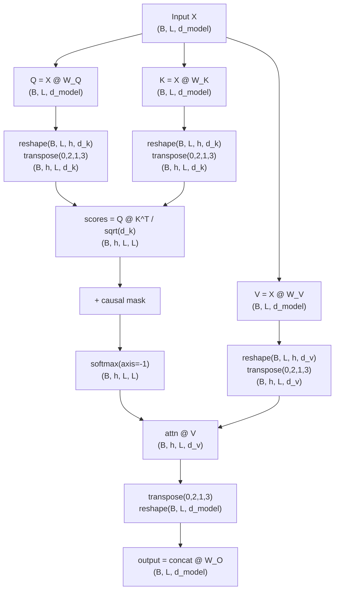
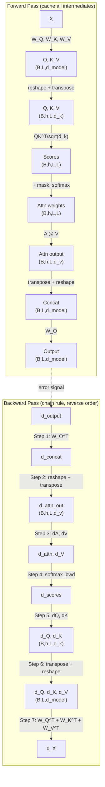

# Multi-Head Attention

**Phase 3 · Topic 10** — Parallel attention heads, memory layout, and the foundation for tensor parallelism.

## What it is

Multi-head attention runs multiple attention operations in parallel, each with different learned projections. Instead of computing a single attention function with $d_{model}$-dimensional keys, queries, and values, multi-head attention projects them $h$ times with different learned linear projections to $d_k$, $d_k$, and $d_v$ dimensions respectively. These $h$ attention outputs are concatenated and projected again.

The key insight: different heads can learn to attend to different types of relationships. One head might focus on syntactic dependencies (subject-verb agreement), another on semantic relationships (coreference), another on positional patterns (attending to the previous or next token). By splitting the representation space into multiple subspaces, the model gains representational power without increasing computational cost compared to single-head attention with the same total dimensions. A single head with $d_{model} = 512$ performs one attention operation in a 512-dimensional space. Eight heads each operating in a 64-dimensional space perform eight independent attention operations, enabling the model to simultaneously attend to information from different representation subspaces at different positions.

Crucially for inference, the heads are independent and can be computed in parallel. This property is what enables tensor parallelism -- distributing heads across multiple GPUs. Understanding the exact memory layout (how tensors are reshaped and transposed) is essential before you can reason about parallelization strategies. The efficient implementation does not loop over heads. Instead, it uses a single large weight matrix for each of $Q$, $K$, $V$, then reshapes and transposes the result to separate heads. This converts $h$ small matmuls into one large matmul, which is far more efficient on GPUs. You must understand both the conceptual per-head view (for reasoning) and the fused reshape view (for implementation).

## The math

### Notation

- $d_{model}$ = model dimension (e.g., 768, 1024, 4096)
- $h$ = number of heads (e.g., 8, 12, 32)
- $d_k = d_{model} / h$ (key/query dimension per head)
- $d_v = d_{model} / h$ (value dimension per head, typically $d_k = d_v$)
- $B$ = batch size
- $L$ = sequence length

### Conceptual view: separate projections per head

Each head has its own projection matrices:

$$W_Q^i \in \mathbb{R}^{d_{model} \times d_k} \quad \text{for } i = 1, \ldots, h$$

$$W_K^i \in \mathbb{R}^{d_{model} \times d_k}$$

$$W_V^i \in \mathbb{R}^{d_{model} \times d_v}$$

Per-head computation:

$$Q_i = X \cdot W_Q^i \quad \rightarrow \text{shape } (B, L, d_k)$$

$$K_i = X \cdot W_K^i \quad \rightarrow \text{shape } (B, L, d_k)$$

$$V_i = X \cdot W_V^i \quad \rightarrow \text{shape } (B, L, d_v)$$

$$\text{head}_i = \text{Attention}(Q_i, K_i, V_i) = \text{softmax}\left(\frac{Q_i \cdot K_i^\top}{\sqrt{d_k}}\right) \cdot V_i$$

Concatenate and project:

$$\text{MultiHead}(X) = \text{Concat}(\text{head}_1, \ldots, \text{head}_h) \cdot W^O$$

Where $W^O \in \mathbb{R}^{(h \cdot d_v) \times d_{model}} = \mathbb{R}^{d_{model} \times d_{model}}$.

This is the view you should use for reasoning about what multi-head attention does. The per-head matrices are conceptually $h$ slices of the full projection matrix.

### Efficient view: fused projections with reshape

Instead of $h$ separate small matrices, use one large projection:

$$W^Q \in \mathbb{R}^{d_{model} \times d_{model}} \quad \text{(contains all } h \text{ heads)}$$

$$W^K \in \mathbb{R}^{d_{model} \times d_{model}}$$

$$W^V \in \mathbb{R}^{d_{model} \times d_{model}}$$

$$W^O \in \mathbb{R}^{d_{model} \times d_{model}}$$

The relationship between the two views: the full $W^Q$ matrix is the horizontal concatenation of all per-head $W_Q^i$ matrices. Columns $[i \cdot d_k : (i+1) \cdot d_k]$ of $W^Q$ correspond to $W_Q^i$.

**Step by step with shapes:**

1. **Input:** $X \in \mathbb{R}^{B \times L \times d_{model}}$

2. **Project $Q$, $K$, $V$ (three large GEMMs):**

$$Q = X \cdot W^Q \quad \rightarrow (B, L, d_{model})$$

$$K = X \cdot W^K \quad \rightarrow (B, L, d_{model})$$

$$V = X \cdot W^V \quad \rightarrow (B, L, d_{model})$$

3. **Reshape to separate heads:**

$$Q = Q.\text{reshape}(B, L, h, d_k) \quad \rightarrow (B, L, h, d_k)$$

$$K = K.\text{reshape}(B, L, h, d_k) \quad \rightarrow (B, L, h, d_k)$$

$$V = V.\text{reshape}(B, L, h, d_v) \quad \rightarrow (B, L, h, d_v)$$

4. **Transpose to bring heads before sequence:**

$$Q = Q.\text{transpose}(0, 2, 1, 3) \quad \rightarrow (B, h, L, d_k)$$

$$K = K.\text{transpose}(0, 2, 1, 3) \quad \rightarrow (B, h, L, d_k)$$

$$V = V.\text{transpose}(0, 2, 1, 3) \quad \rightarrow (B, h, L, d_v)$$

5. **Compute attention (batched over $B$ and $h$ simultaneously):**

$$\text{scores} = Q \cdot K^\top \quad \rightarrow (B, h, L, L)$$

$$\text{scores} = \frac{\text{scores}}{\sqrt{d_k}}$$

If causal mask is applied:

$$\text{scores} = \text{scores} + M \quad \text{where } M_{i,j} = \begin{cases} 0 & j \leq i \\ -\infty & j > i \end{cases}$$

The mask has shape $(L, L)$ or $(1, 1, L, L)$ and broadcasts across $B$ and $h$ -- every head sees the same causal constraint.

$$\text{attn\_weights} = \text{softmax}(\text{scores}, \text{axis}=-1) \quad \rightarrow (B, h, L, L)$$

$$\text{attn\_output} = \text{attn\_weights} \cdot V \quad \rightarrow (B, h, L, d_v)$$

6. **Transpose back and reshape (merge heads):**

$$\text{attn\_output} = \text{attn\_output}.\text{transpose}(0, 2, 1, 3) \quad \rightarrow (B, L, h, d_v)$$

$$\text{concat} = \text{attn\_output}.\text{reshape}(B, L, d_{model}) \quad \rightarrow (B, L, d_{model})$$

7. **Output projection:**

$$\text{output} = \text{concat} \cdot W^O \quad \rightarrow (B, L, d_{model})$$

### Why reshape + transpose instead of separate matrices?

The fused approach:
- **Single large GEMM** instead of $h$ small GEMMs (better GPU utilization)
- **Contiguous memory** after projection (no fragmented allocations)
- **Mathematically equivalent** to the per-head approach

The reshape operation reinterprets memory without copying. The transpose creates a view with different strides. Understanding this is critical for reasoning about memory access patterns.

### Complete forward pass shape table

| Step | Operation | Shape |
|------|-----------|-------|
| Input | $X$ | $(B, L, d_{model})$ |
| Q projection | $Q = X W^Q$ | $(B, L, d_{model})$ |
| K projection | $K = X W^K$ | $(B, L, d_{model})$ |
| V projection | $V = X W^V$ | $(B, L, d_{model})$ |
| Reshape Q | $Q.\text{reshape}(B, L, h, d_k)$ | $(B, L, h, d_k)$ |
| Transpose Q | $Q.\text{transpose}(0, 2, 1, 3)$ | $(B, h, L, d_k)$ |
| Attention scores | $Q K^\top / \sqrt{d_k}$ | $(B, h, L, L)$ |
| Mask (optional) | $\text{scores} + M$ | $(B, h, L, L)$ |
| Softmax | $\text{softmax}(\text{scores})$ | $(B, h, L, L)$ |
| Value weighting | $\text{attn} \cdot V$ | $(B, h, L, d_v)$ |
| Transpose back | $.\text{transpose}(0, 2, 1, 3)$ | $(B, L, h, d_v)$ |
| Reshape (merge) | $.\text{reshape}(B, L, d_{model})$ | $(B, L, d_{model})$ |
| Output projection | $\text{concat} \cdot W^O$ | $(B, L, d_{model})$ |

### Backward pass -- full derivation

The backward pass must propagate gradients through every operation in the forward pass, in reverse order. The tricky parts are: (1) gradients through the reshape/transpose operations, and (2) batching the attention backward across both $B$ and $h$ dimensions simultaneously.

Let $g_{\text{out}} = \frac{\partial \mathcal{L}}{\partial \text{output}} \in \mathbb{R}^{B \times L \times d_{model}}$ be the upstream gradient.

#### Step 1: Gradient through output projection

Given $\text{output} = \text{concat} \cdot W^O$:

$$\frac{\partial \mathcal{L}}{\partial \text{concat}} = g_{\text{out}} \cdot W^{O\top} \quad \in \mathbb{R}^{B \times L \times d_{model}}$$

$$\frac{\partial \mathcal{L}}{\partial W^O} = \sum_{b} \text{concat}_b^\top \cdot g_{\text{out},b} \quad \in \mathbb{R}^{d_{model} \times d_{model}}$$

Using einsum notation: $\frac{\partial \mathcal{L}}{\partial W^O} = \text{einsum}(\texttt{"blm,bln->mn"}, \text{concat}, g_{\text{out}})$.

#### Step 2: Gradient through head merge (reshape + transpose)

The head merge performed two operations: transpose$(0, 2, 1, 3)$ then reshape$(B, L, d_{model})$. To reverse this:

$$g_{\text{concat}} \in \mathbb{R}^{B \times L \times d_{model}}$$

$$g_{\text{attn\_out}} = g_{\text{concat}}.\text{reshape}(B, L, h, d_v).\text{transpose}(0, 2, 1, 3) \quad \in \mathbb{R}^{B \times h \times L \times d_v}$$

Reshape and transpose are linear operations, so the gradient through them is just the inverse reshape and transpose. No Jacobian computation is needed -- the gradient tensor is simply reinterpreted with the pre-merge layout.

#### Step 3: Gradient through value weighting ($O = A \cdot V$)

This is a batched matmul over both $B$ and $h$ dimensions. The standard matmul backward rule applies:

$$\frac{\partial \mathcal{L}}{\partial A} = g_{\text{attn\_out}} \cdot V^\top \quad \in \mathbb{R}^{B \times h \times L \times L}$$

$$\frac{\partial \mathcal{L}}{\partial V} = A^\top \cdot g_{\text{attn\_out}} \quad \in \mathbb{R}^{B \times h \times L \times d_v}$$

Where the transposes are on the last two dimensions only (batch and head dimensions are preserved).

#### Step 4: Gradient through softmax

The softmax backward is applied independently for each $(b, h)$ pair. The formula is identical to single-head attention:

$$\frac{\partial \mathcal{L}}{\partial \text{scores}} = A \odot \left(\frac{\partial \mathcal{L}}{\partial A} - \text{rowsum}\left(\frac{\partial \mathcal{L}}{\partial A} \odot A\right)\right) \quad \in \mathbb{R}^{B \times h \times L \times L}$$

Where $\text{rowsum}$ sums along axis $-1$ with keepdims, producing $(B, h, L, 1)$.

The causal mask does not need special treatment -- positions that were masked to $-\infty$ have $A_{i,j} = 0$, so the gradient through those positions is naturally zero.

#### Step 5: Gradient through scaling and $QK^\top$

The scaling is elementwise, so:

$$g_{\text{raw}} = \frac{g_{\text{scores}}}{\sqrt{d_k}} \quad \in \mathbb{R}^{B \times h \times L \times L}$$

The $QK^\top$ matmul backward (over last two dims, batched over $B$ and $h$):

$$\frac{\partial \mathcal{L}}{\partial Q} = g_{\text{raw}} \cdot K \quad \in \mathbb{R}^{B \times h \times L \times d_k}$$

$$\frac{\partial \mathcal{L}}{\partial K} = g_{\text{raw}}^\top \cdot Q \quad \in \mathbb{R}^{B \times h \times L \times d_k}$$

Where the transpose in $g_{\text{raw}}^\top$ is on the last two dimensions: $(B, h, L, L) \to (B, h, L, L)$.

#### Step 6: Gradient through head split (transpose + reshape)

The head split performed reshape$(B, L, h, d_k)$ then transpose$(0, 2, 1, 3)$. To reverse this:

$$g_{Q_{\text{flat}}} = \frac{\partial \mathcal{L}}{\partial Q}.\text{transpose}(0, 2, 1, 3).\text{reshape}(B, L, d_{model}) \quad \in \mathbb{R}^{B \times L \times d_{model}}$$

$$g_{K_{\text{flat}}} = \frac{\partial \mathcal{L}}{\partial K}.\text{transpose}(0, 2, 1, 3).\text{reshape}(B, L, d_{model}) \quad \in \mathbb{R}^{B \times L \times d_{model}}$$

$$g_{V_{\text{flat}}} = \frac{\partial \mathcal{L}}{\partial V}.\text{transpose}(0, 2, 1, 3).\text{reshape}(B, L, d_{model}) \quad \in \mathbb{R}^{B \times L \times d_{model}}$$

#### Step 7: Gradient through Q/K/V projections

Since $Q_{\text{flat}} = X \cdot W^Q$, $K_{\text{flat}} = X \cdot W^K$, $V_{\text{flat}} = X \cdot W^V$:

$$\frac{\partial \mathcal{L}}{\partial W^Q} = \text{einsum}(\texttt{"blm,bld->md"}, X, g_{Q_{\text{flat}}}) \quad \in \mathbb{R}^{d_{model} \times d_{model}}$$

$$\frac{\partial \mathcal{L}}{\partial W^K} = \text{einsum}(\texttt{"blm,bld->md"}, X, g_{K_{\text{flat}}}) \quad \in \mathbb{R}^{d_{model} \times d_{model}}$$

$$\frac{\partial \mathcal{L}}{\partial W^V} = \text{einsum}(\texttt{"blm,bld->md"}, X, g_{V_{\text{flat}}}) \quad \in \mathbb{R}^{d_{model} \times d_{model}}$$

The input gradient accumulates from all three projection paths:

$$\frac{\partial \mathcal{L}}{\partial X} = g_{Q_{\text{flat}}} \cdot W^{Q\top} + g_{K_{\text{flat}}} \cdot W^{K\top} + g_{V_{\text{flat}}} \cdot W^{V\top} \quad \in \mathbb{R}^{B \times L \times d_{model}}$$

This three-way sum is the multivariate chain rule -- $X$ is used three times in the forward pass (once for each projection), so its gradient is the sum of the gradients from each use.

#### Summary: what to cache during forward

| Cached value | Shape | Used in backward step |
|-------------|-------|-----------------------|
| $X$ (input) | $(B, L, d_{model})$ | Step 7: $\nabla W^Q$, $\nabla W^K$, $\nabla W^V$ |
| $Q$ (after transpose) | $(B, h, L, d_k)$ | Step 5: $\nabla K$ |
| $K$ (after transpose) | $(B, h, L, d_k)$ | Step 5: $\nabla Q$ |
| $V$ (after transpose) | $(B, h, L, d_v)$ | Step 3: $\nabla A$ |
| $A$ (attention weights) | $(B, h, L, L)$ | Step 3: $\nabla V$, Step 4: softmax backward |
| concat (merged heads) | $(B, L, d_{model})$ | Step 1: $\nabla W^O$ |

The attention matrix $A$ at $(B, h, L, L)$ dominates cache memory for long sequences. With $h$ heads, this is $h \times$ the single-head memory. This is exactly what Flash Attention avoids materializing.

### Compute equivalence: multi-head vs single-head

An important result: multi-head attention with $h$ heads of dimension $d_k = d_{model}/h$ has the same total FLOPs as single-head attention with dimension $d_{model}$.

**Projection GEMMs** -- identical in both cases:

$$3 \times 2BLd_{model}^2 + 2BLd_{model}^2 = 8BLd_{model}^2$$

**Attention core** -- single-head: $4BL^2 d_{model}$ FLOPs. Multi-head: $h \times 4BL^2 d_k = h \times 4BL^2 \cdot (d_{model}/h) = 4BL^2 d_{model}$ FLOPs. Identical.

The FLOPs are the same, but the multi-head version enables richer representations because each head independently learns which positions to attend to.

## Why it matters for inference

### Memory layout implications

The reshape and transpose operations define the memory layout:

- After projection: $(B, L, d_{model})$ -- contiguous
- After reshape: $(B, L, h, d_k)$ -- still contiguous (reinterpretation)
- After transpose: $(B, h, L, d_k)$ -- **non-contiguous** (strided view)

The transposed tensor has strides $(L \cdot d_{model}, d_k, d_{model}, 1)$ instead of contiguous $(h \cdot L \cdot d_k, L \cdot d_k, d_k, 1)$. This affects memory access patterns during the batched matmul. Real implementations often call `.contiguous()` after transpose, which copies data but enables coalesced memory access on the GPU.

In NumPy this distinction is visible via `np.ascontiguousarray()`. The performance difference is real even in NumPy -- non-contiguous arrays cause cache misses during matrix multiplication.

### Tensor parallelism

Multi-head attention is embarrassingly parallel across heads:

- GPU 0: heads 0-3 (each computes $Q_i$, $K_i$, $V_i$, attention)
- GPU 1: heads 4-7
- GPU 2: heads 8-11
- GPU 3: heads 12-15

Each GPU:
1. Receives full input $X$
2. Has a column slice of $W^Q$, $W^K$, $W^V$ (columns for its heads)
3. Computes its heads independently
4. All-reduce for output projection (or each GPU holds a row slice of $W^O$)

This is the column-parallel strategy from Megatron-LM. Understanding the head dimension as the parallelization axis comes directly from understanding the multi-head structure.

### Compute vs. memory characteristics

For all $h$ heads combined:

- **Projection GEMMs:** $8BLd_{model}^2$ FLOPs (three input projections + one output projection)
- **$QK^\top$ matmul:** $2BhL^2d_k = 2BL^2d_{model}$ FLOPs
- **Attention $\times$ $V$:** $2BhL^2d_v = 2BL^2d_{model}$ FLOPs
- **Softmax:** $\sim 5BhL^2$ FLOPs
- **Attention matrix memory:** $BhL^2$ elements = $BL^2$ elements per head $\times$ $h$ heads

For long sequences ($L \gg d_{model}$), the $L^2$ terms dominate both compute and memory. For typical inference ($L$ moderate, $d_{model}$ large), the projection GEMMs dominate. This crossover determines which optimization matters more: Flash Attention (reduces attention memory) vs. tensor parallelism (distributes projection GEMMs).

### Connection to GQA/MQA

Grouped-Query Attention (GQA) uses fewer $K$/$V$ heads than $Q$ heads:
- **MHA:** $h$ query heads, $h$ key heads, $h$ value heads
- **GQA:** $h$ query heads, $g$ key heads, $g$ value heads ($g < h$, $h$ divisible by $g$)
- **MQA:** $h$ query heads, 1 key head, 1 value head

This reduces KV cache memory by factor $h/g$. Understanding the full multi-head layout makes the GQA modification obvious: multiple query heads share the same $K$/$V$ head. You will implement GQA in Topic 11.

## Connection to self-attention (Topic 9)

The self-attention implementation you built in the previous topic computes single-head scaled dot-product attention with shapes $(B, L, d_k)$. Multi-head attention reuses this exact computation but batches it over the head dimension.

Specifically, the `scaled_dot_product_attention(Q, K, V, mask)` function from the self-attention module operates on 3D tensors of shape $(B, L, d_k)$. In multi-head attention, after reshaping and transposing to $(B, h, L, d_k)$, the same matmul operations apply -- NumPy's `@` operator broadcasts over both the $B$ and $h$ dimensions.

When $h = 1$ and $d_k = d_{model}$, multi-head attention reduces exactly to single-head self-attention. This is a key test case.

## What to implement

### Core class

- [ ] `MultiHeadAttention` class with configurable $d_{model}$ and $n_{heads}$
- [ ] Derive $d_k = d_v = d_{model} / n_{heads}$ (assert divisibility)
- [ ] Weight initialization for $W^Q, W^K, W^V \in \mathbb{R}^{d_{model} \times d_{model}}$ and $W^O \in \mathbb{R}^{d_{model} \times d_{model}}$
- [ ] Single large matrices for $W^Q$, $W^K$, $W^V$ -- NOT separate per-head matrices
- [ ] Xavier initialization: $W \sim \mathcal{N}(0, \sqrt{2 / (d_{model} + d_{model})})$

### Forward pass

- [ ] $Q$, $K$, $V$ projections via single fused GEMM per projection
- [ ] Head splitting via `reshape(B, L, h, d_k)`
- [ ] Transpose to $(B, h, L, d_k)$ layout
- [ ] Scaled dot-product attention batched over $B$ and $h$ (use `@` operator, no loops)
- [ ] Softmax with numerical stability (subtract max before exp)
- [ ] Head merging via transpose$(0, 2, 1, 3)$ and `reshape(B, L, d_{model})`
- [ ] Output projection via $W^O$
- [ ] Cache all intermediates ($X$, $Q$, $K$, $V$, $A$, concat) for backward

### Masking support

- [ ] Causal mask: upper triangular $-\infty$ mask, shape $(L, L)$ or $(1, 1, L, L)$
- [ ] Same mask shared across all heads (broadcasts over $B$ and $h$)
- [ ] Applied as additive mask before softmax

### Backward pass

- [ ] Gradient through output projection ($\nabla W^O$, $\nabla \text{concat}$)
- [ ] Gradient through head merge (reshape + transpose reversal)
- [ ] Gradient through attention weights ($\nabla A$, $\nabla V$ from $O = AV$ backward)
- [ ] Gradient through softmax (vectorized softmax backward across all heads)
- [ ] Gradient through scaling and $QK^\top$ ($\nabla Q$, $\nabla K$)
- [ ] Gradient through head split (transpose + reshape reversal)
- [ ] Gradient through $Q$/$K$/$V$ projections ($\nabla W^Q$, $\nabla W^K$, $\nabla W^V$, $\nabla X$)
- [ ] All gradients stored as attributes (grad_W_Q, grad_W_K, grad_W_V, grad_W_O)
- [ ] Return $\frac{\partial \mathcal{L}}{\partial X} \in \mathbb{R}^{B \times L \times d_{model}}$

### Analysis functions

- [ ] `count_flops(batch_size, seq_len, d_model, n_heads)`: total forward FLOPs
- [ ] `count_memory_bytes(batch_size, seq_len, d_model, n_heads, dtype)`: peak memory for intermediates

## Test cases to cover

### Shape verification

- [ ] Output shape matches input shape: $(B, L, d_{model})$ in, $(B, L, d_{model})$ out
- [ ] Intermediate shapes are correct:
  - After projection: $(B, L, d_{model})$
  - After reshape: $(B, L, h, d_k)$
  - After transpose: $(B, h, L, d_k)$
  - Attention scores: $(B, h, L, L)$
  - Attention output: $(B, h, L, d_v)$
- [ ] Test with various batch sizes: $B=1$, $B=4$, $B=32$
- [ ] Test with various sequence lengths: $L=1$, $L=16$, $L=128$

### Numerical correctness

- [ ] Single head ($h=1$): verify equivalence to self-attention implementation from Topic 9
- [ ] Known input/output pair: use fixed weights and input, verify exact output by hand computation
- [ ] Attention weights sum to 1 along key dimension for every head
- [ ] Gradient check: numerical gradient vs. analytical gradient using central finite differences
  - Perturb each parameter by $\epsilon = 10^{-5}$
  - Relative error: $\frac{|\text{analytical} - \text{numerical}|}{|\text{analytical}| + |\text{numerical}| + 10^{-8}} < 10^{-5}$
  - Check $W^Q$, $W^K$, $W^V$, $W^O$, and input $X$
  - Test with and without causal mask

### Implementation equivalence

- [ ] Separate per-head projections vs. fused projection + reshape produce identical output (to machine precision)
- [ ] With $h=1$, $d_k=d_{model}$: output matches `SelfAttention` from Topic 9 given identical weights

### Edge cases

- [ ] Single token sequence ($L=1$): attention weights should be $[[1.0]]$ for every head
- [ ] Sequence length 2: manually verify attention pattern
- [ ] Batch size 1: verify no shape errors

### Masking correctness

- [ ] Causal mask: position $i$ attends only to positions $0 \ldots i$ in every head
- [ ] Verify masked positions get $-\infty$ before softmax, $0$ after softmax
- [ ] Mask broadcasts correctly over batch and head dimensions

### Numerical stability

- [ ] Large attention scores: subtract max before softmax to prevent exp overflow
- [ ] Very long sequences ($L=512$): attention weights do not underflow to all zeros
- [ ] Gradient stability: gradients remain finite for long sequences
- [ ] Large $d_{model}$ with many heads: no NaN in forward or backward

### Performance baseline

- [ ] FLOPs match theoretical calculation for known dimensions
- [ ] Verify $O(L^2)$ scaling of attention computation by timing at multiple $L$
- [ ] Memory usage matches theoretical analysis ($B h L^2$ attention matrix elements)

## References

- "Attention Is All You Need" (Vaswani et al., 2017) -- introduced multi-head attention
- "Megatron-LM: Training Multi-Billion Parameter Language Models Using Model Parallelism" (Shoeybi et al., 2019) -- tensor parallelism across attention heads
- "GQA: Training Generalized Multi-Query Transformer Models from Multi-Head Checkpoints" (Ainslie et al., 2023) -- the GQA variant you implement next
