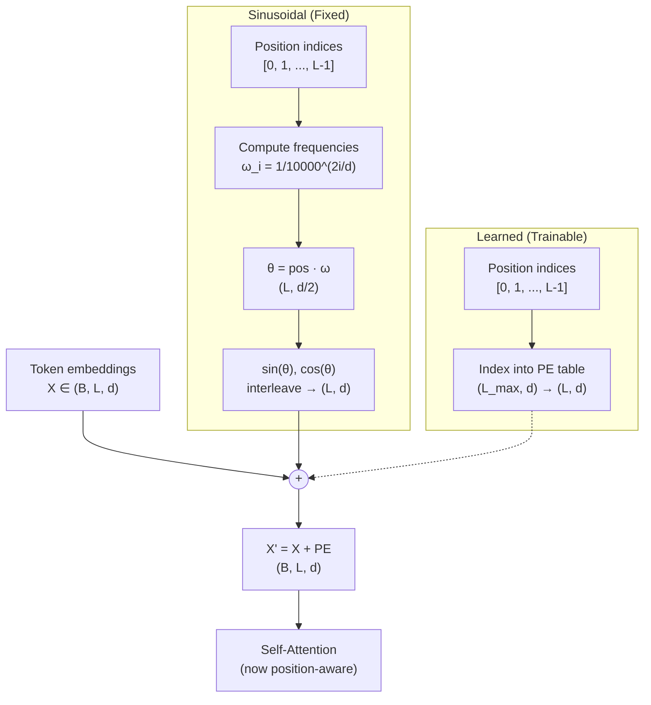

# Positional Encoding

**Phase 3 · Topic 12** — Why transformers need position information, and how sinusoidal and learned encodings inject it. The foundation for understanding RoPE.

## What it is

Self-attention is permutation-invariant. Given an input sequence $X \in \mathbb{R}^{B \times L \times d_{model}}$, attention computes pairwise similarity scores between all positions, but the operation itself has no notion of order. The sentences "the cat sat on the mat" and "mat the on sat cat the" produce identical attention patterns if the same token embeddings are used at each position. Without positional information, a transformer reduces to a set function -- it cannot distinguish sequences that differ only in token order. This is a fundamental architectural property, not a bug: the permutation invariance of attention is what makes it parallelizable. But language has order, so we must inject positional information externally.

Positional encodings solve this by adding position-dependent vectors to the input embeddings before they enter the attention layers. The original transformer (Vaswani et al., 2017) introduced sinusoidal positional encodings -- fixed, deterministic vectors computed from sine and cosine functions at geometrically spaced frequencies. The key mathematical property is that relative positional offsets can be expressed as linear transformations of the encoding vectors, giving the model a mechanism to learn relative position through its attention weights. An alternative approach is learned positional embeddings -- a trainable lookup table indexed by position -- adopted by BERT and GPT-2. Both are absolute positional encodings: they encode the position itself, not the distance between positions.

This topic covers both sinusoidal and learned absolute positional encodings. Understanding these schemes is essential context for the next topic (RoPE), which encodes relative position directly into the attention computation and has become the standard in modern LLMs (LLaMA, Mistral, Phi). You need to understand what absolute encoding does well, where it falls short, and why the field moved to rotary embeddings.

## The math

### Why attention needs positional information

Self-attention computes:

$$\text{Attention}(Q, K, V) = \text{softmax}\left(\frac{QK^\top}{\sqrt{d_k}}\right)V$$

where $Q = XW_Q$, $K = XW_K$, $V = XW_V$. If we permute the input sequence by applying a permutation matrix $P$:

$$Q' = PXW_Q = PQ, \quad K' = PK, \quad V' = PV$$

$$Q'K'^\top = PQ(PK)^\top = PQK^\top P^\top$$

The attention output is $P \cdot \text{Attention}(Q, K, V)$ -- the same computation, just permuted. The model cannot distinguish between different orderings of the same tokens. Positional encoding breaks this symmetry by adding position-dependent information to $X$ before projection:

$$X' = X + PE$$

Now $Q = (X + PE)W_Q$ depends on position, and different orderings produce different attention patterns.

### Sinusoidal positional encoding

For position $pos \in \{0, 1, \ldots, L-1\}$ and dimension index $i \in \{0, 1, \ldots, d_{model}/2 - 1\}$:

$$PE_{(pos, 2i)} = \sin\left(\frac{pos}{10000^{2i/d_{model}}}\right)$$

$$PE_{(pos, 2i+1)} = \cos\left(\frac{pos}{10000^{2i/d_{model}}}\right)$$

Equivalently, define the frequency for each dimension pair:

$$\omega_i = \frac{1}{10000^{2i/d_{model}}}$$

Then:

$$PE_{(pos, 2i)} = \sin(pos \cdot \omega_i)$$

$$PE_{(pos, 2i+1)} = \cos(pos \cdot \omega_i)$$

**Shapes:**
- Position indices: $pos \in \mathbb{R}^{L \times 1}$, values $[0, 1, \ldots, L-1]$
- Dimension indices: $i \in \mathbb{R}^{1 \times d_{model}/2}$, values $[0, 1, \ldots, d_{model}/2 - 1]$
- Frequencies: $\omega \in \mathbb{R}^{1 \times d_{model}/2}$
- Angles: $\theta = pos \cdot \omega \in \mathbb{R}^{L \times d_{model}/2}$
- Final encoding: $PE \in \mathbb{R}^{L \times d_{model}}$ (sin and cos interleaved)

**Step by step construction:**

1. Create position vector: $pos = [0, 1, \ldots, L-1]^\top \in \mathbb{R}^{L \times 1}$
2. Create dimension indices: $i = [0, 1, \ldots, d_{model}/2 - 1] \in \mathbb{R}^{1 \times d_{model}/2}$
3. Compute log-space frequencies: $\omega_i = \exp\left(-\frac{2i}{d_{model}} \ln(10000)\right)$
4. Compute angle matrix: $\theta = pos \cdot \omega \in \mathbb{R}^{L \times d_{model}/2}$
5. Apply sin to get even columns, cos to get odd columns
6. Interleave: $PE[:, 0::2] = \sin(\theta)$, $PE[:, 1::2] = \cos(\theta)$

The log-space computation in step 3 avoids numerical issues from computing $10000^{2i/d_{model}}$ directly for large $d_{model}$.

### Frequency structure: geometric progression of wavelengths

The frequencies $\omega_i$ form a geometric progression from $\omega_0 = 1$ (highest frequency) to $\omega_{d/2-1} = 1/10000$ (lowest frequency):

$$\omega_i = 10000^{-2i/d_{model}} \quad \Rightarrow \quad \text{wavelength}_i = \frac{2\pi}{\omega_i} = 2\pi \cdot 10000^{2i/d_{model}}$$

| Dimension pair | Frequency $\omega_i$ | Wavelength | Behavior |
|---------------|----------------------|------------|----------|
| $(0, 1)$ | $1.0$ | $2\pi \approx 6.3$ | Changes every position |
| $(d/4, d/4+1)$ | $0.01$ | $\approx 628$ | Changes slowly |
| $(d/2-2, d/2-1)$ | $0.0001$ | $\approx 62{,}832$ | Nearly constant |

Low dimensions encode fine-grained position (nearby tokens differ), while high dimensions encode coarse position (only distant tokens differ). This multi-scale representation gives the model access to both local and global positional information.

### The relative position property

The critical mathematical property of sinusoidal encodings: for any fixed offset $k$, there exists a linear transformation $M_k$ (independent of position) that maps $PE_{pos}$ to $PE_{pos+k}$.

For each dimension pair at frequency $\omega_i$, applying the angle addition identities:

$$
\begin{aligned}
\sin(\omega_i(pos + k)) &= \sin(\omega_i \cdot pos)\cos(\omega_i k) + \cos(\omega_i \cdot pos)\sin(\omega_i k) \\
\cos(\omega_i(pos + k)) &= \cos(\omega_i \cdot pos)\cos(\omega_i k) - \sin(\omega_i \cdot pos)\sin(\omega_i k)
\end{aligned}
$$

In matrix form for a single frequency pair:

$$\begin{bmatrix} PE_{(pos+k, 2i)} \\ PE_{(pos+k, 2i+1)} \end{bmatrix} = \underbrace{\begin{bmatrix} \cos(\omega_i k) & \sin(\omega_i k) \\ -\sin(\omega_i k) & \cos(\omega_i k) \end{bmatrix}}_{R_i(k)} \begin{bmatrix} PE_{(pos, 2i)} \\ PE_{(pos, 2i+1)} \end{bmatrix}$$

The matrix $R_i(k)$ is a 2D rotation matrix that depends only on the offset $k$ and frequency $\omega_i$, not on the absolute position $pos$. The full transformation $M_k$ is block-diagonal with $d_{model}/2$ such rotation blocks:

$$M_k = \text{diag}(R_0(k), R_1(k), \ldots, R_{d/2-1}(k))$$

This means $PE_{pos+k} = M_k \cdot PE_{pos}$ for all positions. The attention mechanism can learn to use $M_k$ (or approximations of it) to compute relative position from absolute encodings. This is the mathematical precursor to RoPE, which applies the rotation directly inside the attention computation rather than adding it to the input.

### Dot product distance properties

When sinusoidal encodings are added to token embeddings and projected into $Q$ and $K$, the attention scores contain terms of the form:

$$PE_{pos_1}^\top PE_{pos_2} = \sum_{i=0}^{d/2-1} \left[\sin(\omega_i p_1)\sin(\omega_i p_2) + \cos(\omega_i p_1)\cos(\omega_i p_2)\right]$$

Using the product-to-sum identity:

$$PE_{pos_1}^\top PE_{pos_2} = \sum_{i=0}^{d/2-1} \cos(\omega_i(p_1 - p_2))$$

This dot product depends only on the position difference $p_1 - p_2$, not the absolute positions. This is how sinusoidal encodings enable relative position sensitivity in attention: tokens at the same relative distance have the same positional dot product contribution, regardless of where they appear in the sequence.

### Learned positional embeddings

Instead of a fixed formula, learn a parameter matrix indexed by position:

$$PE \in \mathbb{R}^{L_{max} \times d_{model}} \quad \text{(trainable)}$$

**Forward pass:**

$$X' = X + PE[:L, :] \quad \text{where } L \leq L_{max}$$

The slice $PE[:L, :]$ selects the first $L$ rows of the embedding table, then broadcasts and adds across the batch dimension.

**Backward pass:**

Given upstream gradient $\frac{\partial \mathcal{L}}{\partial X'} \in \mathbb{R}^{B \times L \times d_{model}}$:

$$\frac{\partial \mathcal{L}}{\partial X} = \frac{\partial \mathcal{L}}{\partial X'} \quad \text{(pass-through, since addition)}$$

$$\frac{\partial \mathcal{L}}{\partial PE[:L, :]} = \sum_{b=0}^{B-1} \frac{\partial \mathcal{L}}{\partial X'_b} \quad \in \mathbb{R}^{L \times d_{model}}$$

The gradient for the embedding table is the sum of upstream gradients across the batch dimension. Positions beyond $L$ receive zero gradient. This is equivalent to the backward pass of an embedding lookup, but instead of selecting rows by token ID, we select by position index.

**Shapes:**
- Embedding table: $PE \in \mathbb{R}^{L_{max} \times d_{model}}$ (trainable parameter)
- Slice for current input: $PE[:L, :] \in \mathbb{R}^{L \times d_{model}}$
- After broadcast addition: $X + PE[:L, :] \in \mathbb{R}^{B \times L \times d_{model}}$
- Gradient for table: $\nabla PE \in \mathbb{R}^{L_{max} \times d_{model}}$ (nonzero only for positions $0$ to $L-1$)

### Comparison of approaches

| Property | Sinusoidal | Learned |
|----------|------------|---------|
| Parameters | $0$ (fixed, deterministic) | $L_{max} \times d_{model}$ |
| Extrapolation | Can produce encodings for $L > L_{train}$ | Cannot exceed $L_{max}$ |
| Relative position | Dot product depends on $p_1 - p_2$ | No inherent structure |
| Expressiveness | Fixed sinusoidal patterns | Can learn arbitrary position patterns |
| Computation | Compute or precompute $\sin$/$\cos$ | Table lookup (index select) |
| Used in | Original Transformer (2017) | BERT, GPT-2 |
| Backward pass | No gradients (frozen) | Gradient updates embedding rows |



## Why it matters for inference

### Computational cost at inference

Positional encoding is computationally negligible compared to attention and feed-forward layers:

**Sinusoidal:** Precompute the entire $PE$ matrix once during model initialization. At inference, it is a single elementwise addition of shape $(L, d_{model})$ broadcast over the batch. Zero trainable parameters, zero gradient computation.

**Learned:** A single index-select operation (equivalent to gathering $L$ rows from a table). Marginally faster than sinusoidal since no $\sin$/$\cos$ computation is needed, but the difference is irrelevant in practice.

Neither is a bottleneck. The real inference implications are about sequence length limits and architectural decisions.

### Sequence length extrapolation -- the critical limitation

**Learned embeddings cannot extrapolate.** If a model is trained with $L_{max} = 2048$, positions beyond 2048 have no embedding vectors. The model fails at longer sequences. Options:
1. Truncate input to $L_{max}$
2. Fine-tune with longer sequences (requires retraining)
3. Switch to a position scheme that supports extrapolation

**Sinusoidal encodings can generate vectors for arbitrary positions**, but whether the model generalizes to unseen positions is a separate question. The encoding formula produces valid vectors for any $pos$, but attention patterns trained only on positions 0--2048 may not transfer to position 5000. Empirically, sinusoidal encodings show modest extrapolation ability but degrade at significantly longer sequences.

This extrapolation limitation is one reason the field moved to RoPE and other relative position schemes, which encode position differences rather than absolute positions and demonstrate better length generalization (especially with techniques like NTK-aware scaling and YaRN).

### Memory layout and fusion opportunities

In optimized inference engines, positional encoding addition is typically fused with the embedding lookup:

```
token_ids → embedding_table[token_ids] + PE[:L]  →  X'
```

This is a single kernel that reads token embeddings and PE from memory, adds them, and writes the result. The memory traffic is:
- Read: $L \times d_{model}$ (token embeddings) + $L \times d_{model}$ (PE)
- Write: $L \times d_{model}$ (output)

Total: $3 \times L \times d_{model} \times \text{bytes\_per\_element}$. For $L = 4096$, $d_{model} = 4096$, FP16: $3 \times 4096 \times 4096 \times 2 = 96$ MB. This is dwarfed by the attention computation that follows.

### Why RoPE replaced absolute encoding

Both sinusoidal and learned encodings have a fundamental limitation: they encode absolute position. Position 5 always gets the same encoding regardless of context. The dot product $q_i^\top k_j$ between positions $i$ and $j$ contains terms involving absolute positions $i$ and $j$ separately, not just the distance $|i - j|$.

RoPE (next topic) solves this by rotating $Q$ and $K$ vectors by position-dependent angles, so that $q_i^\top k_j$ depends only on the relative distance $i - j$. This is a strictly stronger inductive bias for sequence modeling. The progression:

| Era | Approach | Limitation |
|-----|----------|------------|
| 2017 (original Transformer) | Sinusoidal absolute | Relative position only approximate via dot products |
| 2018--2019 (BERT, GPT-2) | Learned absolute | Cannot extrapolate beyond training length |
| 2023+ (LLaMA, Mistral) | RoPE (relative) | Direct relative position encoding, better extrapolation |

Understanding absolute encoding is essential context for understanding why RoPE exists and what improvement it provides.

## Connection to prior modules

### Self-attention (Topic 9) and multi-head attention (Topic 10)

Positional encoding is applied before the attention layers. Without it, the self-attention implementation from Topic 9 is permutation-invariant. Adding PE to the input embeddings is the standard way to break this symmetry:

$$X' = X + PE$$
$$Q = X' W_Q, \quad K = X' W_K, \quad V = X' W_V$$

The attention scores $QK^\top$ then contain cross-terms between content (from $X$) and position (from $PE$), enabling the model to attend based on both semantic similarity and positional proximity.

### Grouped-query attention (Topic 11)

GQA is orthogonal to positional encoding. The position information flows through the Q, K, V projections identically regardless of whether KV heads are shared. GQA reduces the number of KV heads; positional encoding modifies the input before projection. They compose without interaction.

## What to implement

### Standalone function

- [ ] `sinusoidal_positional_encoding(seq_len, d_model)`: generate the PE matrix
  - Input: $L$ (sequence length), $d_{model}$ (model dimension, must be even)
  - Output: $PE \in \mathbb{R}^{L \times d_{model}}$
  - Use log-space frequency computation to avoid numerical issues: $\omega_i = \exp(-2i \cdot \ln(10000) / d_{model})$
  - Interleave sin (even indices) and cos (odd indices)
  - Raise `ValueError` if $d_{model}$ is odd

### SinusoidalPositionalEncoding class

- [ ] `__init__(self, max_seq_len, d_model)`: precompute and cache the PE matrix
  - Store $PE \in \mathbb{R}^{L_{max} \times d_{model}}$ as a fixed (non-trainable) buffer
  - Validate $d_{model}$ is even

- [ ] `forward(self, X)`: add positional encoding to input embeddings
  - Input: $X \in \mathbb{R}^{B \times L \times d_{model}}$ where $L \leq L_{max}$
  - Output: $X + PE[:L, :] \in \mathbb{R}^{B \times L \times d_{model}}$
  - Slice PE to match input sequence length
  - Broadcast across batch dimension

- [ ] `get_encoding(self, seq_len)`: return the PE matrix for a given length
  - Returns: $PE[:L, :] \in \mathbb{R}^{L \times d_{model}}$
  - Useful for visualization and analysis

### LearnedPositionalEncoding class

- [ ] `__init__(self, max_seq_len, d_model)`: initialize trainable embedding table
  - Initialize $PE \in \mathbb{R}^{L_{max} \times d_{model}}$ with $\mathcal{N}(0, 0.02)$ (standard for transformer embeddings)
  - Store as a trainable parameter

- [ ] `forward(self, X)`: add learned positional embeddings to input
  - Input: $X \in \mathbb{R}^{B \times L \times d_{model}}$ where $L \leq L_{max}$
  - Output: $X + PE[:L, :] \in \mathbb{R}^{B \times L \times d_{model}}$
  - Raise `ValueError` if $L > L_{max}$
  - Cache $X$ and the position slice for backward

- [ ] `backward(self, grad_output)`: compute gradients
  - Input: $\frac{\partial \mathcal{L}}{\partial X'} \in \mathbb{R}^{B \times L \times d_{model}}$
  - Gradient for input: $\frac{\partial \mathcal{L}}{\partial X} = \frac{\partial \mathcal{L}}{\partial X'}$ (pass-through)
  - Gradient for embedding table: $\frac{\partial \mathcal{L}}{\partial PE[:L, :]} = \sum_{b=0}^{B-1} \frac{\partial \mathcal{L}}{\partial X'_b}$
  - Store gradient as `grad_embedding` attribute, shape $(L_{max}, d_{model})$ with zeros for positions $\geq L$
  - Return $\frac{\partial \mathcal{L}}{\partial X}$

### Analysis functions

- [ ] `relative_position_matrix(pe, offset)`: verify the linear transformation property
  - Given $PE \in \mathbb{R}^{L \times d_{model}}$ and offset $k$, compute the rotation matrix $M_k$
  - Verify $PE[pos + k] \approx M_k \cdot PE[pos]$ for all valid positions
  - Return the rotation matrix and the reconstruction error

- [ ] `dot_product_distance(pe)`: compute pairwise dot products of PE vectors
  - Input: $PE \in \mathbb{R}^{L \times d_{model}}$
  - Output: $D \in \mathbb{R}^{L \times L}$ where $D_{ij} = PE_i^\top PE_j$
  - Verify that $D_{ij}$ depends approximately on $|i - j|$ (Toeplitz-like structure)

- [ ] `encoding_statistics(pe)`: compute statistics of the encoding matrix
  - Per-position norm: $\|PE_{pos}\|_2$ for each position
  - Mean and variance across positions and dimensions
  - Verify values are bounded in $[-1, 1]$

## Test cases to cover

### Shape verification

- [ ] **Sinusoidal output shape**: `sinusoidal_positional_encoding(L, d)` returns $(L, d)$ for various $L$ and $d$
- [ ] **Batched forward shape**: SinusoidalPositionalEncoding forward with $(B, L, d)$ input returns $(B, L, d)$
- [ ] **Learned forward shape**: LearnedPositionalEncoding forward with $(B, L, d)$ input returns $(B, L, d)$
- [ ] **Variable batch sizes**: $B = 1, 4, 16$ all produce correct output shapes
- [ ] **Variable sequence lengths**: $L = 1, 16, 128, 512$ all work within $L_{max}$
- [ ] **Odd d_model raises error**: `sinusoidal_positional_encoding(10, 7)` raises `ValueError`

### Correctness: known reference values

- [ ] **Position 0**: $PE_{(0, :)} = [0, 1, 0, 1, \ldots, 0, 1]$ because $\sin(0) = 0$ and $\cos(0) = 1$
- [ ] **Small example**: For $d_{model} = 4$, $L = 3$:
  - $\omega_0 = 1.0$, $\omega_1 = 1/100 = 0.01$
  - $PE_{(0, :)} = [\sin(0), \cos(0), \sin(0), \cos(0)] = [0, 1, 0, 1]$
  - $PE_{(1, :)} = [\sin(1), \cos(1), \sin(0.01), \cos(0.01)] \approx [0.8415, 0.5403, 0.01, 0.99995]$
  - $PE_{(2, :)} = [\sin(2), \cos(2), \sin(0.02), \cos(0.02)] \approx [0.9093, -0.4161, 0.02, 0.9998]$

### Uniqueness and boundedness

- [ ] **Unique position vectors**: For $L = 1000$, no two rows of PE are identical (pairwise L2 distance $> 0$ for all $i \neq j$)
- [ ] **Values bounded in $[-1, 1]$**: All elements of PE satisfy $|PE_{ij}| \leq 1$
- [ ] **Deterministic**: Calling the function twice with the same arguments produces bit-identical results
- [ ] **Norms are consistent**: $\|PE_{pos}\|_2 = \sqrt{d_{model}/2}$ for all positions (each row has $d/2$ sin-cos pairs, each pair contributing $\sin^2 + \cos^2 = 1$)

### Relative position property

- [ ] **Linear transformation exists**: For offset $k = 1$, compute $M_1$ from one (sin, cos) pair, verify $M_1 \cdot PE_{pos} \approx PE_{pos+1}$ for all valid positions. Tolerance: $\|M_k \cdot PE_{pos} - PE_{pos+k}\|_2 < 10^{-10}$
- [ ] **Multiple offsets**: Verify for $k = 1, 5, 10, 50$ that the transformation matrix $M_k$ correctly maps $PE_{pos}$ to $PE_{pos+k}$
- [ ] **Offset-only dependence**: $M_k$ is the same regardless of which position pair $(pos, pos+k)$ is used to compute it

### Dot product distance structure

- [ ] **Dot product symmetry**: $PE_i^\top PE_j = PE_j^\top PE_i$ for all $i, j$
- [ ] **Self-dot product**: $PE_{pos}^\top PE_{pos} = d_{model}/2$ for all positions (since $\sin^2 + \cos^2 = 1$ for each pair)
- [ ] **Distance-dependent**: The dot product $PE_i^\top PE_j$ is approximately a function of $|i - j|$. Verify by checking that $PE_0^\top PE_k \approx PE_{10}^\top PE_{10+k}$ for various $k$

### Frequency structure

- [ ] **Low dimensions change fast**: The variance of $PE[:, 0]$ across positions is high (fast oscillation)
- [ ] **High dimensions change slow**: The variance of $PE[:, d-2]$ across positions is low (near-constant)
- [ ] **Dimension 0 wavelength**: The first sin column completes one full cycle in approximately $2\pi \approx 6.28$ positions
- [ ] **Last dimension wavelength**: The last sin column has wavelength approximately $2\pi \times 10000 \approx 62{,}832$ positions

### Learned embedding tests

- [ ] **Initialization**: Embedding values have approximately zero mean and standard deviation $\approx 0.02$
- [ ] **Sequence length validation**: Forward with $L > L_{max}$ raises `ValueError`
- [ ] **Backward correctness**: Gradient check with central finite differences ($\epsilon = 10^{-5}$, relative error $< 10^{-5}$)
  - Perturb each element of the embedding table
  - Verify gradient for the embedding table matches numerical gradient
  - Verify input gradient is the pass-through of upstream gradient
- [ ] **Gradient accumulation across batch**: The embedding gradient sums contributions from all batch elements. With $B = 4$, verify `grad_embedding` has magnitude $\approx 4\times$ that of a single-element batch
- [ ] **Zero gradient for unused positions**: Positions $L$ through $L_{max} - 1$ receive zero gradient when input has length $L$

### Numerical stability

- [ ] **Large sequence lengths**: $L = 10000$ produces no NaN or Inf
- [ ] **Large d_model**: $d_{model} = 4096$ produces no NaN or Inf
- [ ] **Log-space computation**: Frequencies computed via $\exp(-2i \ln(10000) / d)$ match $1/10000^{2i/d}$ to machine precision but avoid overflow for large $d$

### Integration tests

- [ ] **Permutation sensitivity with PE**: Given two sequences that are permutations of each other, adding PE makes the outputs of a self-attention layer different
- [ ] **Permutation insensitivity without PE**: Without PE, permuted inputs produce permuted outputs (attention is equivariant)
- [ ] **Additive composition**: $X + PE$ does not overflow or dramatically change the statistics of $X$ when $X$ has standard initialization (e.g., $\mathcal{N}(0, 1)$)
- [ ] **Forward pass with attention**: Wire SinusoidalPositionalEncoding into the self-attention module from Topic 9 and verify the output changes when token order changes

## Reference dimensions

Use these for testing:

```python
# Small test config
d_model = 64
max_seq_len = 128
seq_len = 32
batch_size = 2

# Medium config (GPT-2 scale)
d_model_gpt2 = 768
max_seq_len_gpt2 = 1024

# Large config (original Transformer)
d_model_transformer = 512
max_seq_len_transformer = 5000  # from the paper

# Tiny config for hand verification
d_model_tiny = 4
seq_len_tiny = 3
```

## Implementation notes

### Log-space frequency computation

Computing $10000^{2i/d_{model}}$ directly can produce very large numbers. Use the log-space equivalent:

$$\omega_i = \exp\left(-\frac{2i}{d_{model}} \cdot \ln(10000)\right)$$

In NumPy:

```python
i = np.arange(0, d_model // 2, dtype=np.float64)
omega = np.exp(-2.0 * i / d_model * np.log(10000.0))
```

### Interleaving sin and cos

Two approaches to construct the final PE matrix:

**Approach 1: Interleave (matches the paper)**
```python
pe = np.zeros((seq_len, d_model))
pe[:, 0::2] = np.sin(angles)  # even indices
pe[:, 1::2] = np.cos(angles)  # odd indices
```

**Approach 2: Concatenate**
```python
pe = np.concatenate([np.sin(angles), np.cos(angles)], axis=-1)
```

Use Approach 1 (interleaving) to match the original paper. The choice affects which dimensions form (sin, cos) pairs, which matters for the rotation matrix verification.

### What NOT to implement here

- **RoPE**: That is Topic 13. RoPE applies rotation during attention, not as an additive encoding.
- **ALiBi (Attention with Linear Biases)**: An alternative positional scheme that adds position-dependent bias to attention scores. Out of scope.
- **Relative position bias**: As used in T5. Different mechanism -- adds learned bias to attention scores based on position distance.
- **Position interpolation / NTK-aware scaling**: Extensions for RoPE length extrapolation. Covered in Topic 13 context.

## References

- "Attention Is All You Need" (Vaswani et al., 2017) -- introduced sinusoidal positional encoding
- "BERT: Pre-training of Deep Bidirectional Transformers" (Devlin et al., 2019) -- uses learned positional embeddings
- "Language Models are Unsupervised Multitask Learners" (Radford et al., 2019) -- GPT-2 uses learned positional embeddings
- "RoFormer: Enhanced Transformer with Rotary Position Embedding" (Su et al., 2021) -- RoPE, the modern replacement
- "A Length-Extrapolatable Transformer" (Sun et al., 2022) -- analysis of position encoding extrapolation
