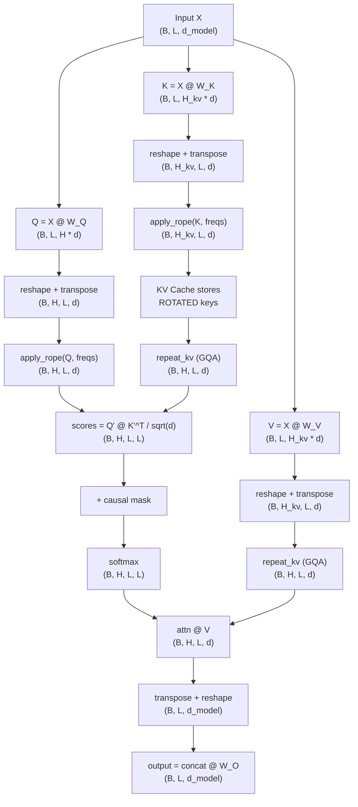

# Rotary Position Embeddings (RoPE)

**Phase 3 · Topic 13** — The position encoding used by every modern LLM. Encodes relative position directly into attention dot products through rotation, replacing additive positional encodings entirely.

## What it is

Rotary Position Embeddings (RoPE) encode position information by rotating query and key vectors in a position-dependent manner. Unlike additive positional encodings (sinusoidal or learned) that add a position vector to the input embeddings before projection, RoPE applies a rotation to Q and K *after* projection but *before* the attention score computation. The rotation angle depends on both the token's absolute position and the dimension index, but the critical property is that the dot product between a rotated query at position $m$ and a rotated key at position $n$ depends only on the relative distance $(m - n)$, not on the absolute positions individually. This is the mathematical property that makes RoPE a true relative position encoding despite using absolute position information in the rotation itself.

RoPE was introduced by Su et al. (2021) in the RoFormer paper and has since been adopted by virtually every modern open-weight LLM: LLaMA 1/2/3, Mistral, Mixtral, Qwen, Yi, Phi, Gemma, and DeepSeek. It replaced both sinusoidal and learned absolute positional encodings because it provides a stronger inductive bias -- the attention mechanism sees relative position natively rather than having to learn to extract it from absolute position vectors. Additionally, RoPE's frequency-based formulation enables principled sequence length extrapolation through techniques like NTK-aware scaling and YaRN, which modify the frequency base to extend the context window far beyond the training length.

Understanding RoPE is essential for inference work because position is baked into the key vectors at rotation time. When using a KV cache, the stored keys already contain position information -- you do not need to recompute or adjust them when generating new tokens. This is a fundamental difference from additive positional encodings, where position is part of the input embedding and changing the encoding scheme would invalidate cached values. RoPE also integrates cleanly with Grouped-Query Attention: it is applied to every query head and every KV head independently, and the subsequent repeat-interleave for GQA operates on already-rotated keys. The computational cost of RoPE is small (element-wise operations on Q and K), making it a candidate for kernel fusion with the Q/K projection in optimized inference engines.

## The math

### Notation

- $d$ = head dimension (e.g., 64, 128). Must be even.
- $B$ = batch size
- $L$ = sequence length
- $H$ = number of heads (query heads; applies equally to KV heads)
- $m$ = absolute position index ($0, 1, \ldots, L-1$)
- $\theta_i$ = frequency for dimension pair $i$
- $\Theta$ = base frequency (default 10000, Llama 3 uses 500000)

### Core idea: rotation in 2D subspaces

The head dimension $d$ is split into $d/2$ pairs of consecutive dimensions: $(0, 1)$, $(2, 3)$, ..., $(d-2, d-1)$. Each pair defines a 2D subspace, and RoPE applies a 2D rotation in each subspace independently. The rotation angle for pair $i$ at position $m$ is $m \cdot \theta_i$:

$$\begin{bmatrix} x'_{2i} \\ x'_{2i+1} \end{bmatrix} = \begin{bmatrix} \cos(m\theta_i) & -\sin(m\theta_i) \\ \sin(m\theta_i) & \cos(m\theta_i) \end{bmatrix} \begin{bmatrix} x_{2i} \\ x_{2i+1} \end{bmatrix}$$

Expanded:

$$x'_{2i} = x_{2i} \cos(m\theta_i) - x_{2i+1} \sin(m\theta_i)$$

$$x'_{2i+1} = x_{2i} \sin(m\theta_i) + x_{2i+1} \cos(m\theta_i)$$

This is applied to both Q and K after their respective linear projections.

### Frequency schedule

Each dimension pair $i \in \{0, 1, \ldots, d/2 - 1\}$ has a frequency:

$$\theta_i = \Theta^{-2i/d} = \frac{1}{\Theta^{2i/d}}$$

where $\Theta$ is the base frequency (typically 10000). This is the same geometric progression used in sinusoidal positional encoding. Low dimension indices have high frequencies (rotate fast), high dimension indices have low frequencies (rotate slowly).

| Dimension pair | Frequency $\theta_i$ ($\Theta = 10000$, $d = 128$) | Wavelength | Behavior |
|---------------|------------------------------------------------------|------------|----------|
| $(0, 1)$ | $1.0$ | $2\pi \approx 6.3$ positions | Changes every position |
| $(32, 33)$ | $0.01$ | $\approx 628$ positions | Slow rotation |
| $(126, 127)$ | $0.0001$ | $\approx 62{,}832$ positions | Nearly constant |

**Log-space computation** (for numerical stability):

$$\theta_i = \exp\left(-\frac{2i}{d} \ln \Theta\right)$$

### Full rotation matrix

The complete RoPE rotation for a $d$-dimensional vector at position $m$ is a block-diagonal matrix with $d/2$ rotation blocks:

$$R(m) = \begin{bmatrix} R_0(m) & & & \\ & R_1(m) & & \\ & & \ddots & \\ & & & R_{d/2-1}(m) \end{bmatrix}$$

where each $2 \times 2$ block is:

$$R_i(m) = \begin{bmatrix} \cos(m\theta_i) & -\sin(m\theta_i) \\ \sin(m\theta_i) & \cos(m\theta_i) \end{bmatrix}$$

The rotated query and key are:

$$q'_m = R(m) \cdot q_m, \qquad k'_n = R(n) \cdot k_n$$

This explicit matrix form is useful for reasoning but expensive to compute. The efficient implementation uses element-wise operations (see below).

### The relative position property (the key theorem)

The dot product between the rotated query at position $m$ and rotated key at position $n$:

$$
\begin{aligned}
\langle q'_m, k'_n \rangle &= (R(m) q_m)^\top (R(n) k_n) \\
&= q_m^\top R(m)^\top R(n) k_n \\
&= q_m^\top R(n - m) k_n
\end{aligned}
$$

The last step uses the property that rotation matrices compose: $R(m)^\top R(n) = R(-m) R(n) = R(n - m)$. This holds because $R(\alpha)^\top = R(-\alpha)$ (rotation matrices are orthogonal), and $R(\alpha)R(\beta) = R(\alpha + \beta)$.

Expanding for a single dimension pair $i$:

$$
\begin{aligned}
q'_{m,2i} k'_{n,2i} + q'_{m,2i+1} k'_{n,2i+1} &= (q_{2i}\cos m\theta_i - q_{2i+1}\sin m\theta_i)(k_{2i}\cos n\theta_i - k_{2i+1}\sin n\theta_i) \\
&\quad + (q_{2i}\sin m\theta_i + q_{2i+1}\cos m\theta_i)(k_{2i}\sin n\theta_i + k_{2i+1}\cos n\theta_i)
\end{aligned}
$$

Expanding and applying the cosine difference identity $\cos\alpha\cos\beta + \sin\alpha\sin\beta = \cos(\alpha - \beta)$:

$$= (q_{2i}k_{2i} + q_{2i+1}k_{2i+1})\cos((m-n)\theta_i) + (q_{2i}k_{2i+1} - q_{2i+1}k_{2i})\sin((m-n)\theta_i)$$

This depends only on the relative position $(m - n)$ and the content vectors $q$, $k$. The full dot product across all dimension pairs:

$$\langle q'_m, k'_n \rangle = \sum_{i=0}^{d/2-1} \left[ (q_{2i}k_{2i} + q_{2i+1}k_{2i+1})\cos((m-n)\theta_i) + (q_{2i}k_{2i+1} - q_{2i+1}k_{2i})\sin((m-n)\theta_i) \right]$$

This is the property that makes RoPE a relative position encoding. The attention score between any two positions depends only on their distance, not their absolute locations.

### Long-term decay property

The relative position encoding introduces a natural decay: as the relative distance $|m - n|$ increases, the cosine and sine terms at high frequencies oscillate rapidly and tend to cancel out. Only the low-frequency dimensions contribute coherently at large distances. This gives the model an inductive bias toward attending to nearby tokens -- a desirable property for language modeling.

### Complex number formulation

Each dimension pair can be treated as a complex number:

$$\tilde{q}_i = q_{2i} + j \cdot q_{2i+1} \quad \in \mathbb{C}$$

The rotation becomes complex multiplication by a unit complex number:

$$\tilde{q}'_i = \tilde{q}_i \cdot e^{j \cdot m \cdot \theta_i} = \tilde{q}_i \cdot (\cos(m\theta_i) + j\sin(m\theta_i))$$

Expanding:

$$\text{Re}(\tilde{q}'_i) = q_{2i}\cos(m\theta_i) - q_{2i+1}\sin(m\theta_i)$$

$$\text{Im}(\tilde{q}'_i) = q_{2i}\sin(m\theta_i) + q_{2i+1}\cos(m\theta_i)$$

This matches the rotation formula exactly. The complex formulation is elegant and maps directly to implementation: view the $d$-dimensional real vector as a $d/2$-dimensional complex vector and multiply element-wise by $e^{j m \theta}$.

The relative position property in complex form: the dot product $\langle \tilde{q}'_m, \tilde{k}'_n \rangle = \text{Re}\left(\sum_i \tilde{q}'_{m,i} \cdot \overline{\tilde{k}'_{n,i}}\right)$. Since $\tilde{q}'_i \overline{\tilde{k}'_i} = \tilde{q}_i e^{jm\theta_i} \overline{\tilde{k}_i e^{jn\theta_i}} = \tilde{q}_i \overline{\tilde{k}_i} e^{j(m-n)\theta_i}$, the result depends only on $(m - n)$.

### Efficient element-wise implementation (rotate_half)

The rotation can be computed without constructing any rotation matrix. Define the `rotate_half` operation:

$$\text{rotate\_half}(x) = [-x_1, x_0, -x_3, x_2, \ldots, -x_{d-1}, x_{d-2}]$$

In other words, for each pair $(x_{2i}, x_{2i+1})$, swap them and negate the first element: $(x_{2i}, x_{2i+1}) \rightarrow (-x_{2i+1}, x_{2i})$.

Then RoPE is:

$$x' = x \odot \cos(m\theta) + \text{rotate\_half}(x) \odot \sin(m\theta)$$

where $\odot$ denotes element-wise multiplication, and $\cos(m\theta)$, $\sin(m\theta)$ are broadcast to match the shape of $x$ by repeating each frequency value for both dimensions in the pair:

$$\cos(m\theta) = [\cos(m\theta_0), \cos(m\theta_0), \cos(m\theta_1), \cos(m\theta_1), \ldots, \cos(m\theta_{d/2-1}), \cos(m\theta_{d/2-1})]$$

**Verification of rotate_half equivalence:**

For pair $i$, `rotate_half` produces $(-x_{2i+1}, x_{2i})$. The formula gives:

$$x'_{2i} = x_{2i}\cos(m\theta_i) + (-x_{2i+1})\sin(m\theta_i) = x_{2i}\cos(m\theta_i) - x_{2i+1}\sin(m\theta_i) \quad \checkmark$$

$$x'_{2i+1} = x_{2i+1}\cos(m\theta_i) + x_{2i}\sin(m\theta_i) \quad \checkmark$$

### Step by step: precompute and apply

**Precomputation (once during initialization):**

1. Compute inverse frequencies: $\theta_i = \exp(-2i \ln\Theta / d)$ for $i \in \{0, 1, \ldots, d/2-1\}$, shape $(d/2,)$
2. Create position indices: $m = [0, 1, \ldots, L_{max}-1]$, shape $(L_{max},)$
3. Compute angle matrix: $\text{angles} = m \otimes \theta$ (outer product), shape $(L_{max}, d/2)$
4. Compute $\cos\_\text{cache} = \cos(\text{angles})$ and $\sin\_\text{cache} = \sin(\text{angles})$, each shape $(L_{max}, d/2)$
5. Repeat-interleave each value to match dimension pairs: expand to $(L_{max}, d)$

**Application (per forward pass):**

1. Slice cached cos/sin for current sequence length: $(L, d)$
2. Broadcast to match input shape $(B, L, H, d)$ or $(B, H, L, d)$ depending on layout
3. Compute `rotate_half(x)`: reshape $x$ as $(..., d/2, 2)$, swap and negate, reshape back
4. Apply: $x' = x \odot \cos\_\text{cache} + \text{rotate\_half}(x) \odot \sin\_\text{cache}$

### Shapes summary

| Tensor | Shape | Description |
|--------|-------|-------------|
| Inverse frequencies | $(d/2,)$ | $\theta_i = \Theta^{-2i/d}$ |
| Position indices | $(L,)$ | $[0, 1, \ldots, L-1]$ |
| Angle matrix | $(L, d/2)$ | $m \cdot \theta_i$ |
| cos/sin cache | $(L, d/2)$ or $(L, d)$ | Precomputed rotation components |
| Input Q or K | $(B, L, H, d)$ | After projection, before attention |
| Rotated Q or K | $(B, L, H, d)$ | After RoPE, ready for attention scores |

### Backward pass

RoPE is an element-wise linear operation (rotation), so the backward pass applies the inverse rotation $R(-m)$ -- equivalently, the transpose $R(m)^\top$ -- to the upstream gradient:

$$\frac{\partial \mathcal{L}}{\partial x} = R(m)^\top \frac{\partial \mathcal{L}}{\partial x'}$$

Since $R(m)^\top = R(-m)$, the backward rotation negates the sine term:

$$\frac{\partial \mathcal{L}}{\partial x_{2i}} = \frac{\partial \mathcal{L}}{\partial x'_{2i}} \cos(m\theta_i) + \frac{\partial \mathcal{L}}{\partial x'_{2i+1}} \sin(m\theta_i)$$

$$\frac{\partial \mathcal{L}}{\partial x_{2i+1}} = -\frac{\partial \mathcal{L}}{\partial x'_{2i}} \sin(m\theta_i) + \frac{\partial \mathcal{L}}{\partial x'_{2i+1}} \cos(m\theta_i)$$

In the efficient form using rotate_half:

$$\frac{\partial \mathcal{L}}{\partial x} = \frac{\partial \mathcal{L}}{\partial x'} \odot \cos(m\theta) + \text{rotate\_half\_backward}\left(\frac{\partial \mathcal{L}}{\partial x'}\right) \odot \sin(m\theta)$$

where `rotate_half_backward` produces $[x_1, -x_0, x_3, -x_2, \ldots]$ -- the transposed rotation, which swaps and negates the *second* element in each pair (opposite of the forward `rotate_half`).

Note: `rotate_half_backward` is simply the negative of `rotate_half` composed with negation, or equivalently: `rotate_half_backward(x) = -rotate_half(x)` for the swap-negate pattern. More precisely, if forward is $(-x_{2i+1}, x_{2i})$, backward is $(x_{2i+1}, -x_{2i})$.

### Integration with attention



RoPE is applied after Q/K projection and head splitting, but before computing attention scores. The value tensor V is not rotated -- RoPE only modifies Q and K because the relative position property is needed only in the dot product that produces attention scores. V carries the content that gets weighted and aggregated.

### Context length extension

The base frequency $\Theta$ controls the maximum effective context length. Increasing $\Theta$ stretches the wavelengths, allowing the model to represent positions over a larger range without the angles wrapping around too many times.

**Standard RoPE:** $\Theta = 10000$ (original RoFormer, Llama 1/2)

**Extended context via higher base:** $\Theta = 500000$ (Llama 3). This reduces all rotation angles by a factor of $\sqrt[d]{500000/10000} \approx 1.02\text{--}3.9\times$ per dimension pair, spreading out the encoding across more positions.

**NTK-aware scaling:** Instead of scaling positions (position interpolation), scale the base frequency:

$$\Theta' = \Theta \cdot \alpha^{d/(d-2)}$$

where $\alpha$ is the scaling factor. This preserves high-frequency components (important for local position resolution) while stretching low-frequency components (important for long-range dependencies).

**Position interpolation:** Divide all positions by the scaling factor:

$$m' = m / \alpha$$

Simpler but degrades local resolution because all frequencies are compressed uniformly.

## Why it matters for inference

### KV cache compatibility

With additive positional encodings, position is baked into the input embedding $X' = X + PE$, and then K is computed as $K = X'W_K$. If you cache K and later change the position encoding, every cached value is wrong. With RoPE, position is applied as a rotation *after* the linear projection:

$$K'_n = R(n) \cdot (X_n W_K)$$

The cached rotated key $K'_n$ at position $n$ is correct regardless of what future positions are generated. When the model generates token at position $m$, it computes $Q'_m = R(m) \cdot (X_m W_Q)$ and the dot product $Q'_m \cdot K'_n$ naturally encodes the relative distance $(m - n)$. No recomputation of cached keys is needed.

### Computational cost

RoPE is applied element-wise to Q and K tensors. Per attention head:

| Operation | Elements accessed | FLOPs |
|-----------|------------------|-------|
| Read Q, K | $2 \times L \times d$ | -- |
| Multiply by cos cache | $2 \times L \times d$ | $2Ld$ |
| Compute rotate_half | $2 \times L \times d$ | $Ld$ (swap + negate) |
| Multiply by sin cache | $2 \times L \times d$ | $2Ld$ |
| Add results | $2 \times L \times d$ | $2Ld$ |
| Write Q', K' | $2 \times L \times d$ | -- |

Total: $\sim 6Ld$ FLOPs per head, $6HLd = 6Ld_{model}$ FLOPs total. This is negligible compared to the Q/K projection ($2BLd_{model}^2$ FLOPs) and attention score computation ($2BHL^2d$ FLOPs).

RoPE is memory-bandwidth bound, not compute bound: it reads and writes each element with only a few arithmetic operations. This makes it a prime candidate for kernel fusion with the Q/K projection or the attention score computation.

### Memory layout considerations

The rotate_half operation requires accessing pairs of adjacent dimensions. If Q and K are stored with the head dimension contiguous (standard layout after reshape), this is efficient -- $(q_{2i}, q_{2i+1})$ are adjacent in memory. If they were stored in an interleaved head layout, gather/scatter operations would be needed.

In the standard transformer layout, after reshape from $(B, L, H \cdot d)$ to $(B, L, H, d)$ and transpose to $(B, H, L, d)$, the last dimension $d$ is contiguous. Rotate_half operates on this contiguous dimension, so it is cache-friendly.

### Why understanding vanilla RoPE comes first

All context extension techniques (NTK-aware scaling, YaRN, position interpolation, dynamic NTK) are modifications to the RoPE frequency schedule or position inputs. You cannot implement or debug these without understanding:
1. What the frequencies represent geometrically (rotation rates)
2. Why the dot product property holds (rotation composition)
3. How frequency changes affect the attention pattern (wavelength stretching)
4. Which dimensions are most sensitive to scaling (high-frequency vs low-frequency)

## Connection to prior modules

### Positional encoding (Topic 12)

Sinusoidal positional encoding uses the same frequency schedule ($\omega_i = 10000^{-2i/d}$) and the same trigonometric basis. The key differences:

| Property | Sinusoidal PE | RoPE |
|----------|--------------|------|
| Application | Added to input embeddings | Applied to Q and K after projection |
| Mechanism | Additive: $X' = X + PE$ | Multiplicative: $Q' = R(m) \cdot Q$ |
| Position encoding in attention | Indirect (via cross-terms in $Q = (X+PE)W_Q$) | Direct (rotation encodes position in dot product) |
| Relative position | Approximate (model must learn to extract it) | Exact (dot product depends only on $m - n$) |
| Affected by projection weights | Yes (position mixed with content by $W_Q$, $W_K$) | No (rotation applied after projection) |

The rotation matrix property from sinusoidal PE (Topic 12's $M_k$ matrix) is the mathematical precursor to RoPE. RoPE takes the observation that sinusoidal encodings can express relative offsets as rotations and makes it the *entire* position encoding mechanism.

### Multi-head attention (Topic 10) and GQA (Topic 11)

RoPE is applied independently to each attention head. In GQA:
- Q heads: each of the $H$ query heads gets its own rotation applied
- KV heads: each of the $H_{kv}$ key heads gets its own rotation applied
- The repeat-interleave step (GQA's key operation) happens *after* RoPE

The rotated keys are what get stored in the KV cache. Since each KV head is rotated independently, GQA's head sharing is fully compatible with RoPE.

## What to implement

### Standalone functions

- [ ] `precompute_freqs(d_head, max_seq_len, theta_base=10000)`: compute and cache cos/sin values
  - Compute inverse frequencies: $\theta_i = \exp(-2i \ln\Theta / d)$ for $i \in \{0, \ldots, d/2 - 1\}$
  - Compute angle matrix: outer product of positions and frequencies, shape $(L_{max}, d/2)$
  - Return $(\cos\_\text{cache}, \sin\_\text{cache})$, each shape $(L_{max}, d/2)$
  - Raise `ValueError` if $d$ is odd

- [ ] `rotate_half(x)`: the core helper that swaps and negates dimension pairs
  - Input: $x \in \mathbb{R}^{(\ldots, d)}$ where $d$ is even
  - Output: $[-x_1, x_0, -x_3, x_2, \ldots, -x_{d-1}, x_{d-2}]$
  - Implementation: reshape to $(\ldots, d/2, 2)$, swap along last axis, negate first element, reshape back
  - Must handle arbitrary leading dimensions (batch, seq, heads)

- [ ] `apply_rope(x, cos_cache, sin_cache)`: apply rotation using the efficient element-wise form
  - Input: $x \in \mathbb{R}^{B \times H \times L \times d}$ (or $B \times L \times H \times d$, must handle both)
  - Cos/sin caches: $(L, d/2)$, broadcast to match $x$ shape
  - Repeat-interleave cos/sin so each frequency covers both dimensions in the pair: $(L, d/2) \rightarrow (L, d)$
  - Compute: $x' = x \odot \cos + \text{rotate\_half}(x) \odot \sin$
  - Return rotated $x'$ with same shape as input

- [ ] `apply_rope_complex(x, freqs)`: alternative implementation using complex number view
  - View $x$ as complex: reshape $(\ldots, d) \rightarrow (\ldots, d/2, 2)$, then view as complex $(\ldots, d/2)$
  - Multiply by $e^{jm\theta}$: element-wise complex multiplication
  - Convert back to real: view as real $(\ldots, d/2, 2)$, reshape to $(\ldots, d)$
  - This serves as a correctness check against the rotate_half implementation

### RoPE class

- [ ] `__init__(self, d_head, max_seq_len, theta_base=10000)`: precompute and cache frequencies
  - Store inverse frequencies, cos_cache, sin_cache
  - Validate $d$ is even
  - Store theta_base for context extension

- [ ] `forward(self, q, k, positions=None)`: apply RoPE to Q and K
  - Input Q: $(B, H, L, d)$ or $(B, L, H, d)$
  - Input K: $(B, H_{kv}, L, d)$ or $(B, L, H_{kv}, d)$ (GQA-compatible)
  - Optional positions: $(L,)$ integer array, defaults to $[0, 1, \ldots, L-1]$
  - Positions parameter enables non-contiguous position indices (for KV cache append)
  - Apply rotation to both Q and K using cached cos/sin
  - Cache Q, K, cos, sin values for backward
  - Return $(Q', K')$ with same shapes as input

- [ ] `backward(self, grad_q_rotated, grad_k_rotated)`: compute gradients through rotation
  - Apply inverse rotation $R(-m)$ to upstream gradients
  - $\nabla q = g_q \odot \cos + \text{rotate\_half\_backward}(g_q) \odot \sin$
  - $\nabla k = g_k \odot \cos + \text{rotate\_half\_backward}(g_k) \odot \sin$
  - Return $(\nabla q, \nabla k)$

### Analysis functions

- [ ] `verify_relative_position_property(q, k, rope, positions_m, positions_n)`: empirically verify the key theorem
  - Rotate $q$ at position $m$ and $k$ at position $n$
  - Compute dot product
  - Shift both positions by constant $\delta$: rotate $q$ at $m + \delta$, $k$ at $n + \delta$
  - Verify dot products match (tolerance $< 10^{-10}$)
  - Test across multiple $(m, n)$ pairs with the same $(m - n)$

- [ ] `rotation_is_orthogonal(cos_cache, sin_cache, position)`: verify the rotation matrix at a given position is orthogonal
  - Construct the full $d \times d$ block-diagonal rotation matrix
  - Verify $R R^\top = I$ and $\det(R) = 1$

- [ ] `compare_with_sinusoidal(d, seq_len)`: show that RoPE frequencies match sinusoidal PE frequencies
  - Generate sinusoidal PE frequencies and RoPE frequencies
  - Verify they use the same $\theta_i = 10000^{-2i/d}$ schedule

## Test cases to cover

### Shape verification

- [ ] **Output shape matches input**: `apply_rope(x, cos, sin)` returns same shape as $x$ for shapes $(B, H, L, d)$ with various $B$, $H$, $L$, $d$
- [ ] **Frequency shape**: `precompute_freqs(d, L)` returns cos and sin each with shape $(L, d/2)$
- [ ] **Odd d_head raises error**: `precompute_freqs(63, 100)` raises `ValueError`
- [ ] **Variable dimensions**: test $d = 2, 4, 8, 64, 128$ all produce correct shapes
- [ ] **Variable sequence lengths**: test $L = 1, 16, 128, 4096$

### Correctness: position 0 is identity

- [ ] **Zero rotation**: Applying RoPE at position 0 returns the original vector unchanged, because $\cos(0) = 1$ and $\sin(0) = 0$, so $x' = x \cdot 1 + \text{rotate\_half}(x) \cdot 0 = x$

### Correctness: rotation matrix properties

- [ ] **Orthogonality**: $R(m)^\top R(m) = I$ for several positions $m$. Construct the full matrix and verify $\|RR^\top - I\|_F < 10^{-10}$
- [ ] **Determinant**: $\det(R(m)) = 1$ (proper rotation, not reflection)
- [ ] **Composition**: $R(m) R(n) = R(m + n)$. Apply RoPE at position $m$ then at position $n$, verify result equals RoPE at position $m + n$
- [ ] **Inverse**: $R(m) R(-m) = I$. Rotate forward then backward recovers original vector

### Correctness: known small example

- [ ] **Minimal example ($d = 2$, $L = 3$)**: with $\Theta = 10000$:
  - $\theta_0 = 1.0$
  - Position 0: $\cos(0) = 1$, $\sin(0) = 0$ -- identity
  - Position 1: $\cos(1) \approx 0.5403$, $\sin(1) \approx 0.8415$
  - For $x = [1, 0]$: $x' = [1 \cdot 0.5403 - 0 \cdot 0.8415, 1 \cdot 0.8415 + 0 \cdot 0.5403] = [0.5403, 0.8415]$
  - Verify norm is preserved: $\|x'\|_2 = \|x\|_2 = 1$

- [ ] **4D example ($d = 4$)**: compute by hand for position 2 with known Q vector, verify each dimension pair rotated independently

### The relative position property (critical)

- [ ] **Dot product invariance**: For random $q, k \in \mathbb{R}^d$:
  - $\text{dot}(\text{RoPE}(q, 5), \text{RoPE}(k, 3))$ should equal $\text{dot}(\text{RoPE}(q, 105), \text{RoPE}(k, 103))$ (both have relative position 2)
  - Test with multiple $(m, n)$ pairs having the same $(m - n)$: $(0,0)$ vs $(50,50)$, $(3,1)$ vs $(103,101)$, etc.
  - Tolerance: $< 10^{-10}$

- [ ] **Different relative positions give different dot products**: $\text{dot}(\text{RoPE}(q, 5), \text{RoPE}(k, 3)) \neq \text{dot}(\text{RoPE}(q, 5), \text{RoPE}(k, 4))$ in general (relative positions 2 vs 1)

- [ ] **Symmetry**: $\text{dot}(\text{RoPE}(q, m), \text{RoPE}(k, n)) = \text{dot}(\text{RoPE}(k, n), \text{RoPE}(q, m))$ (dot product commutativity preserved)

### Implementation equivalence

- [ ] **rotate_half vs complex**: `apply_rope(x, cos, sin)` matches `apply_rope_complex(x, freqs)` to machine precision ($< 10^{-12}$)
- [ ] **rotate_half vs explicit rotation matrix**: construct the full block-diagonal $R(m)$ and multiply vs element-wise computation, verify identical results
- [ ] **Precomputed vs on-the-fly**: using cached cos/sin matches computing them fresh each call

### Norm preservation

- [ ] **Rotation preserves norm**: $\|x'\|_2 = \|x\|_2$ for all positions and all input vectors. Test with random vectors at positions $0, 1, 100, 10000$

### Backward pass

- [ ] **Gradient shape**: Backward produces gradients with same shape as forward inputs
- [ ] **Gradient correctness via finite differences**: For random Q and K, perturb each element by $\epsilon = 10^{-5}$, compute numerical gradient via central differences:
  $$\frac{|\text{analytical} - \text{numerical}|}{|\text{analytical}| + |\text{numerical}| + 10^{-8}} < 10^{-5}$$
  Use a scalar loss $\mathcal{L} = \sum(Q'^2) + \sum(K'^2)$ for simplicity
- [ ] **Inverse rotation**: Applying forward then backward recovers the original vector (rotation then inverse rotation)
- [ ] **Gradient is zero-position pass-through**: At position 0, backward should return the upstream gradient unchanged (since forward is identity)

### Edge cases

- [ ] **Single token ($L = 1$)**: RoPE works correctly, producing a rotated vector at position 0
- [ ] **Single dimension pair ($d = 2$)**: minimal case, verify rotation formula directly
- [ ] **Large positions ($m = 100000$)**: no NaN or Inf, values remain bounded in $[-\|x\|, \|x\|]$
- [ ] **Very small frequencies**: the lowest frequency dimension at $d = 128$ has $\theta_{63} \approx 10^{-4}$; at position 100000, the angle is $\approx 10$, well within normal range. Verify no overflow.
- [ ] **Batch size 1**: no shape errors

### Frequency schedule verification

- [ ] **Geometric progression**: Frequencies form a geometric sequence with ratio $\Theta^{-2/d}$
- [ ] **Matches sinusoidal PE**: RoPE frequencies identical to sinusoidal PE frequencies for same $d$ and $\Theta$
- [ ] **Custom theta base**: $\Theta = 500000$ produces smaller rotation angles (lower frequencies) than $\Theta = 10000$

### Integration with attention

- [ ] **Full attention pipeline**: Wire RoPE into multi-head attention (Topic 10):
  1. Project Q, K, V
  2. Reshape and transpose to $(B, H, L, d)$
  3. Apply RoPE to Q and K
  4. Compute attention scores, softmax, output
  5. Verify output shape is $(B, L, d_{model})$

- [ ] **Causal attention with RoPE**: Apply RoPE before causal mask, verify masked positions still get zero attention weight

- [ ] **GQA compatibility**: Apply RoPE to Q $(B, H, L, d)$ and K $(B, H_{kv}, L, d)$ with $H_{kv} < H$, verify shapes are correct and attention computation works after repeat-interleave

- [ ] **KV cache simulation**: Compute K at positions $[0, 1, 2]$ with RoPE, cache them. Then compute Q at position 3 with RoPE. Verify the attention scores match what you would get from computing everything from scratch at positions $[0, 1, 2, 3]$

### Numerical stability

- [ ] **Large sequence lengths**: $L = 100000$ produces no NaN or Inf in cos/sin cache
- [ ] **Large d_head**: $d = 256$ produces no NaN or Inf
- [ ] **Log-space frequency computation**: Frequencies computed via $\exp(-2i \ln\Theta / d)$ match $\Theta^{-2i/d}$ to machine precision but avoid overflow

## Reference dimensions

Use these for testing:

```python
# Small test config
d_head = 8
max_seq_len = 128
num_heads = 4
batch_size = 2

# Llama 2 7B-scale
d_head_llama2 = 128
max_seq_len_llama2 = 4096
num_heads_llama2 = 32
theta_base_llama2 = 10000

# Llama 3 8B-scale
d_head_llama3 = 128
max_seq_len_llama3 = 8192
num_heads_llama3 = 32
num_kv_heads_llama3 = 8
theta_base_llama3 = 500000

# Tiny config for hand verification
d_head_tiny = 4
seq_len_tiny = 3
theta_base_tiny = 10000
```

## Implementation notes

### rotate_half in NumPy

```python
def rotate_half(x):
    """[-x1, x0, -x3, x2, ...] for each dimension pair."""
    d = x.shape[-1]
    x = x.reshape(*x.shape[:-1], d // 2, 2)     # (..., d/2, 2)
    x = np.stack([-x[..., 1], x[..., 0]], axis=-1)  # swap and negate
    return x.reshape(*x.shape[:-2], d)             # (..., d)
```

### Broadcasting cos/sin cache

The cos/sin cache has shape $(L, d/2)$ but the input Q/K has shape $(B, H, L, d)$. Two steps:

1. **Repeat-interleave** the cache to match dimension pairs: $(L, d/2) \rightarrow (L, d)$ by repeating each value twice: $[\theta_0, \theta_0, \theta_1, \theta_1, \ldots]$
2. **Broadcast** across batch and head dimensions by reshaping to $(1, 1, L, d)$

In NumPy:

```python
cos = np.repeat(cos_cache[:seq_len], 2, axis=-1)  # (L, d)
cos = cos[np.newaxis, np.newaxis, :, :]            # (1, 1, L, d)
```

### Complex number implementation in NumPy

```python
def apply_rope_complex(x, freqs):
    """Apply RoPE using complex number multiplication."""
    d = x.shape[-1]
    # View as complex: (..., d) -> (..., d/2) complex
    x_complex = x.reshape(*x.shape[:-1], d // 2, 2)
    x_complex = x_complex[..., 0] + 1j * x_complex[..., 1]
    # freqs should be complex exponentials: e^{j*m*theta}
    x_rotated = x_complex * freqs
    # Convert back: (..., d/2) complex -> (..., d) real
    result = np.stack([x_rotated.real, x_rotated.imag], axis=-1)
    return result.reshape(*x.shape)
```

### What NOT to implement here

- **NTK-aware scaling or YaRN**: Mention the concept but do not implement. The base implementation should use standard $\Theta = 10000$. The `theta_base` parameter enables experimentation but full context extension is out of scope.
- **ALiBi (Attention with Linear Biases)**: A different positional scheme entirely. Out of scope.
- **Relative position bias (T5-style)**: Learned additive bias to attention scores. Different mechanism.
- **KV cache management**: Topic 16. This module applies RoPE to given positions; it does not manage incremental decoding state.
- **Flash attention integration**: Topic 17. RoPE is applied before the attention kernel.

## References

- "RoFormer: Enhanced Transformer with Rotary Position Embedding" (Su et al., 2021) -- introduced RoPE
- "Attention Is All You Need" (Vaswani et al., 2017) -- sinusoidal PE that inspired RoPE's frequency schedule
- "LLaMA: Open and Efficient Foundation Language Models" (Touvron et al., 2023) -- adopted RoPE for all model sizes
- "Llama 2: Open Foundation and Fine-Tuned Chat Models" (Touvron et al., 2023) -- continued RoPE with GQA
- "The Llama 3 Herd of Models" (Meta, 2024) -- increased theta base to 500000 for longer context
- "YaRN: Efficient Context Window Extension of Large Language Models" (Peng et al., 2023) -- advanced RoPE context extension
- "NTK-Aware Scaled RoPE" (bloc97, 2023) -- frequency-domain scaling for context extension
- "Rotary Embeddings: A Relative Revolution" (EleutherAI, 2021) -- excellent exposition of the mathematical properties
