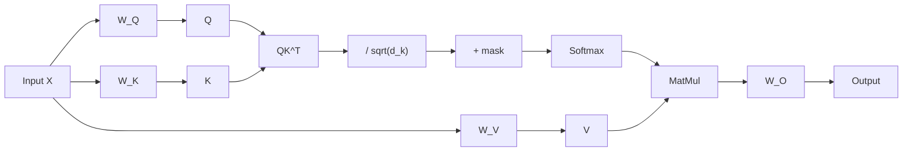
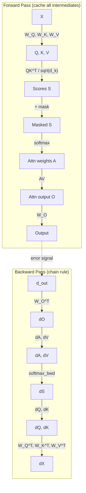

# Self-Attention

**Phase 3 · Topic 9** — THE operation you will be optimizing. Every inference technique you study later exists to make this faster.

## What it is

Self-attention is the mechanism that allows each position in a sequence to attend to all other positions, computing a weighted sum where the weights are determined by content similarity. Introduced in "Attention Is All You Need" (Vaswani et al., 2017), it replaced recurrence entirely and enabled massive parallelization during training. The core insight is that relevance between positions should be learned from the data, not hard-coded by position. A token at position 50 might be highly relevant to a token at position 3 if they share semantic meaning, even though they are far apart. Self-attention computes these relevance scores dynamically for every pair of positions.

The architecture decomposes into three learned projections -- queries, keys, and values -- that transform the input into different representation spaces before computing attention. This decomposition is not arbitrary: queries encode "what am I looking for?", keys encode "what do I contain?", and values encode "what information do I provide if selected?". The attention weights emerge from the dot product between queries and keys, creating a soft selection over values. This is analogous to a differentiable dictionary lookup -- but unlike a hash table, every entry contributes to the output, weighted by relevance.

This is the single most important operation to understand for inference optimization. Every technique you will study later -- Flash Attention, Paged Attention, GQA, MQA, KV caching -- exists to make self-attention faster or more memory-efficient. You cannot understand those optimizations without first understanding the naive version completely. The softmax function you implemented in the activations module is a direct prerequisite: it appears in the inner loop of attention and its numerical stability properties directly affect attention's stability.

## The math



### Q/K/V projections

The input sequence $X \in \mathbb{R}^{B \times n \times d_{model}}$ is projected into three different representation spaces:

$$Q = XW_Q + b_Q \quad \text{(queries)} \quad Q \in \mathbb{R}^{B \times n \times d_k}$$

$$K = XW_K + b_K \quad \text{(keys)} \quad K \in \mathbb{R}^{B \times n \times d_k}$$

$$V = XW_V + b_V \quad \text{(values)} \quad V \in \mathbb{R}^{B \times n \times d_v}$$

Where:
- $W_Q \in \mathbb{R}^{d_{model} \times d_k}$ -- query projection matrix
- $W_K \in \mathbb{R}^{d_{model} \times d_k}$ -- key projection matrix
- $W_V \in \mathbb{R}^{d_{model} \times d_v}$ -- value projection matrix
- $b_Q \in \mathbb{R}^{d_k}$, $b_K \in \mathbb{R}^{d_k}$, $b_V \in \mathbb{R}^{d_v}$ -- optional bias vectors
- $d_k$, $d_v$: head dimensions (typically $d_k = d_v = d_{model} / n_{heads}$)
- $B$: batch size, $n$: sequence length

The intuition:
- **Queries** represent "what am I looking for?"
- **Keys** represent "what do I contain?"
- **Values** represent "what information do I provide if attended to?"

### Scaled dot-product attention

$$\text{Attention}(Q, K, V) = \text{softmax}\left(\frac{QK^\top}{\sqrt{d_k}}\right)V$$

**Step by step:**

1. **Compute attention scores**: $S = QK^\top$
   - Shape: $(B, n, d_k) \times (B, d_k, n) = (B, n, n)$
   - Each element $S_{b,i,j}$ measures how much position $i$ should attend to position $j$
   - This is a dot product between query $i$ and key $j$

2. **Scale by $\sqrt{d_k}$**: $S = S / \sqrt{d_k}$
   - Prevents softmax saturation for large $d_k$ (see derivation below)
   - Shape unchanged: $(B, n, n)$

3. **Apply mask (optional)**: $S = S + M$
   - Causal mask: set future positions to $-\infty$ (i.e., $M_{i,j} = -\infty$ for $j > i$, else $0$)
   - Padding mask: set padding positions to $-\infty$
   - Shape unchanged: $(B, n, n)$

4. **Apply softmax row-wise**: $A = \text{softmax}(S, \text{axis}=-1)$
   - Each row sums to 1 (probability distribution over keys)
   - Shape: $(B, n, n)$
   - $A_{b,i,j}$ = attention weight from position $i$ to position $j$
   - Use the numerically stable softmax from the activations module: subtract $\max_j S_{b,i,j}$ before exponentiating

5. **Weighted sum of values**: $O = AV$
   - Shape: $(B, n, n) \times (B, n, d_v) = (B, n, d_v)$
   - Each output row is a weighted combination of all value vectors

### Output projection

The attention output is projected back to the model dimension:

$$\text{output} = OW_O + b_O$$

Where $W_O \in \mathbb{R}^{d_v \times d_{model}}$ and $b_O \in \mathbb{R}^{d_{model}}$.

Final output shape: $(B, n, d_{model})$.

The output projection serves two purposes: (1) it mixes information from the value subspace back into the full model space, and (2) in multi-head attention, it combines the outputs of all heads into a single representation. For single-head self-attention with $d_v = d_{model}$, this is a learned linear transformation of the attention-weighted values.

### Complete forward pass with shapes

| Step | Operation | Shape |
|------|-----------|-------|
| Input | $X$ | $(B, n, d_{model})$ |
| Query projection | $Q = XW_Q + b_Q$ | $(B, n, d_{model}) \times (d_{model}, d_k) = (B, n, d_k)$ |
| Key projection | $K = XW_K + b_K$ | $(B, n, d_{model}) \times (d_{model}, d_k) = (B, n, d_k)$ |
| Value projection | $V = XW_V + b_V$ | $(B, n, d_{model}) \times (d_{model}, d_v) = (B, n, d_v)$ |
| Attention scores | $S = QK^\top$ | $(B, n, d_k) \times (B, d_k, n) = (B, n, n)$ |
| Scale | $S = S / \sqrt{d_k}$ | $(B, n, n)$ |
| Mask (optional) | $S = S + M$ | $(B, n, n)$ |
| Softmax | $A = \text{softmax}(S)$ | $(B, n, n)$ |
| Value weighting | $O = AV$ | $(B, n, n) \times (B, n, d_v) = (B, n, d_v)$ |
| Output projection | $\text{out} = OW_O + b_O$ | $(B, n, d_v) \times (d_v, d_{model}) = (B, n, d_{model})$ |

### Why we scale by $\sqrt{d_k}$

This is crucial to understand. Consider what happens without scaling.

When $d_k$ is large, the dot products $QK^\top$ tend to have large magnitudes. Assume $Q$ and $K$ have elements drawn from a distribution with mean 0 and variance 1. The dot product of two $d_k$-dimensional vectors is:

$$q \cdot k = \sum_{i=1}^{d_k} q_i k_i$$

Each term $q_i k_i$ has:
- Mean: $\mathbb{E}[q_i k_i] = \mathbb{E}[q_i] \cdot \mathbb{E}[k_i] = 0 \cdot 0 = 0$
- Variance: $\text{Var}[q_i k_i] = \mathbb{E}[q_i^2] \cdot \mathbb{E}[k_i^2] = 1 \cdot 1 = 1$

The sum of $d_k$ independent terms with variance 1 has variance $d_k$:

$$\text{Var}[q \cdot k] = d_k$$

So the standard deviation of dot products is $\sqrt{d_k}$.

**The problem**: Softmax saturates for large inputs. If softmax input values differ by more than roughly 10, the output becomes essentially one-hot. Large $d_k$ means large variance in scores, which pushes softmax into saturation, producing near-binary attention weights with near-zero gradients.

**The solution**: Divide by $\sqrt{d_k}$ to normalize variance back to 1:

$$\text{Var}\left[\frac{q \cdot k}{\sqrt{d_k}}\right] = \frac{\text{Var}[q \cdot k]}{d_k} = \frac{d_k}{d_k} = 1$$

Now the attention scores have consistent variance regardless of $d_k$, keeping softmax in a useful regime with meaningful gradients.

### Causal masking

For autoregressive models (GPT, LLaMA, Mistral), position $i$ must not attend to any position $j > i$. The causal mask enforces this:

$$M_{i,j} = \begin{cases} 0 & \text{if } j \leq i \\ -\infty & \text{if } j > i \end{cases}$$

After adding this mask and applying softmax, positions $j > i$ receive zero attention weight because $e^{-\infty} = 0$. The resulting attention pattern is lower-triangular:

$$A = \begin{bmatrix} a_{1,1} & 0 & 0 & 0 \\ a_{2,1} & a_{2,2} & 0 & 0 \\ a_{3,1} & a_{3,2} & a_{3,3} & 0 \\ a_{4,1} & a_{4,2} & a_{4,3} & a_{4,4} \end{bmatrix}$$

Where each row still sums to 1. This mask is generated as:

$$M = \text{upper\_triangular}(\mathbf{1}_{n \times n}, k=1) \cdot (-\infty)$$

The mask is added to scores *before* softmax, not multiplied with attention weights after softmax, because multiplying after would break the normalization (rows would no longer sum to 1).

### Backward pass -- full derivation

The backward pass computes gradients through the entire self-attention computation graph. Let $\frac{\partial \mathcal{L}}{\partial \text{out}}$ be the upstream gradient from the layer above. We propagate gradients in reverse order through each operation.



#### Step 1: Gradient through output projection

Given $\text{out} = OW_O + b_O$:

$$\frac{\partial \mathcal{L}}{\partial O} = \frac{\partial \mathcal{L}}{\partial \text{out}} \cdot W_O^\top$$

$$\frac{\partial \mathcal{L}}{\partial W_O} = O^\top \cdot \frac{\partial \mathcal{L}}{\partial \text{out}}$$

$$\frac{\partial \mathcal{L}}{\partial b_O} = \sum_{b,i} \frac{\partial \mathcal{L}}{\partial \text{out}}$$

Shapes:
- $\frac{\partial \mathcal{L}}{\partial O} \in \mathbb{R}^{B \times n \times d_v}$ (same shape as $O$)
- $\frac{\partial \mathcal{L}}{\partial W_O} \in \mathbb{R}^{d_v \times d_{model}}$ (same shape as $W_O$)
- $\frac{\partial \mathcal{L}}{\partial b_O} \in \mathbb{R}^{d_{model}}$ (same shape as $b_O$)

#### Step 2: Gradient through value weighting ($O = AV$)

This is a matrix multiplication, so the gradients follow the standard matmul backward rule:

$$\frac{\partial \mathcal{L}}{\partial A} = \frac{\partial \mathcal{L}}{\partial O} \cdot V^\top$$

$$\frac{\partial \mathcal{L}}{\partial V} = A^\top \cdot \frac{\partial \mathcal{L}}{\partial O}$$

Shapes:
- $\frac{\partial \mathcal{L}}{\partial A} \in \mathbb{R}^{B \times n \times n}$ (same shape as $A$)
- $\frac{\partial \mathcal{L}}{\partial V} \in \mathbb{R}^{B \times n \times d_v}$ (same shape as $V$)

#### Step 3: Gradient through softmax

The softmax backward pass is the trickiest part. Given the upstream gradient $\frac{\partial \mathcal{L}}{\partial A}$ and the cached softmax output $A$:

For each row $i$ of the attention matrix, softmax is applied independently. The Jacobian of softmax with respect to its input $s_i$ (the $i$-th row of $S$) is:

$$\frac{\partial A_{i,j}}{\partial S_{i,k}} = A_{i,j}(\delta_{jk} - A_{i,k})$$

where $\delta_{jk}$ is the Kronecker delta.

The full vector-Jacobian product (what we actually compute) is:

$$\frac{\partial \mathcal{L}}{\partial S_i} = A_i \odot \left(\frac{\partial \mathcal{L}}{\partial A_i} - \sum_{j} \frac{\partial \mathcal{L}}{\partial A_{i,j}} \cdot A_{i,j}\right)$$

Or in matrix form for all rows simultaneously:

$$\frac{\partial \mathcal{L}}{\partial S} = A \odot \left(\frac{\partial \mathcal{L}}{\partial A} - \text{rowsum}\left(\frac{\partial \mathcal{L}}{\partial A} \odot A\right)\right)$$

Where $\text{rowsum}$ sums along the last axis with keepdims, producing shape $(B, n, 1)$.

**Derivation:** Let $g = \frac{\partial \mathcal{L}}{\partial A}$ (upstream gradient). For each row:

$$
\begin{aligned}
\frac{\partial \mathcal{L}}{\partial S_{i,k}} &= \sum_j g_{i,j} \frac{\partial A_{i,j}}{\partial S_{i,k}} \\
&= \sum_j g_{i,j} A_{i,j} (\delta_{jk} - A_{i,k}) \\
&= g_{i,k} A_{i,k} - A_{i,k} \sum_j g_{i,j} A_{i,j} \\
&= A_{i,k} \left(g_{i,k} - \sum_j g_{i,j} A_{i,j}\right)
\end{aligned}
$$

This is the same softmax backward formula you would have encountered in softmax regression. The key computational insight: you need the cached softmax output $A$ but not the input $S$.

Shape: $\frac{\partial \mathcal{L}}{\partial S} \in \mathbb{R}^{B \times n \times n}$ (same shape as $S$).

#### Step 4: Gradient through masking and scaling

The mask is additive ($S_{\text{masked}} = S_{\text{scaled}} + M$), so gradients pass through unchanged for unmasked positions and are zeroed for masked positions (since those entries do not affect the loss -- they are forced to $-\infty$ before softmax):

$$\frac{\partial \mathcal{L}}{\partial S_{\text{scaled}}} = \frac{\partial \mathcal{L}}{\partial S}$$

The scaling $S_{\text{scaled}} = S_{\text{raw}} / \sqrt{d_k}$ is elementwise, so:

$$\frac{\partial \mathcal{L}}{\partial S_{\text{raw}}} = \frac{1}{\sqrt{d_k}} \frac{\partial \mathcal{L}}{\partial S_{\text{scaled}}}$$

#### Step 5: Gradient through $QK^\top$ matmul

Given $S_{\text{raw}} = QK^\top$:

$$\frac{\partial \mathcal{L}}{\partial Q} = \frac{\partial \mathcal{L}}{\partial S_{\text{raw}}} \cdot K$$

$$\frac{\partial \mathcal{L}}{\partial K} = \frac{\partial \mathcal{L}}{\partial S_{\text{raw}}}^\top \cdot Q$$

Shapes:
- $\frac{\partial \mathcal{L}}{\partial Q} \in \mathbb{R}^{B \times n \times d_k}$ (same shape as $Q$)
- $\frac{\partial \mathcal{L}}{\partial K} \in \mathbb{R}^{B \times n \times d_k}$ (same shape as $K$)

#### Step 6: Gradient through Q/K/V projections

Since $Q = XW_Q + b_Q$, $K = XW_K + b_K$, $V = XW_V + b_V$:

$$\frac{\partial \mathcal{L}}{\partial W_Q} = X^\top \cdot \frac{\partial \mathcal{L}}{\partial Q}$$

$$\frac{\partial \mathcal{L}}{\partial W_K} = X^\top \cdot \frac{\partial \mathcal{L}}{\partial K}$$

$$\frac{\partial \mathcal{L}}{\partial W_V} = X^\top \cdot \frac{\partial \mathcal{L}}{\partial V}$$

$$\frac{\partial \mathcal{L}}{\partial b_Q} = \sum_{b,i} \frac{\partial \mathcal{L}}{\partial Q}, \quad \frac{\partial \mathcal{L}}{\partial b_K} = \sum_{b,i} \frac{\partial \mathcal{L}}{\partial K}, \quad \frac{\partial \mathcal{L}}{\partial b_V} = \sum_{b,i} \frac{\partial \mathcal{L}}{\partial V}$$

$$\frac{\partial \mathcal{L}}{\partial X} = \frac{\partial \mathcal{L}}{\partial Q} \cdot W_Q^\top + \frac{\partial \mathcal{L}}{\partial K} \cdot W_K^\top + \frac{\partial \mathcal{L}}{\partial V} \cdot W_V^\top$$

The input gradient accumulates contributions from all three projection paths because $X$ is used three times (once for each of $Q$, $K$, $V$). This is the multivariate chain rule: when a variable appears in multiple branches of the computation graph, its gradient is the sum of gradients from each branch.

Shapes:
- $\frac{\partial \mathcal{L}}{\partial W_Q} \in \mathbb{R}^{d_{model} \times d_k}$ (same shape as $W_Q$)
- $\frac{\partial \mathcal{L}}{\partial X} \in \mathbb{R}^{B \times n \times d_{model}}$ (same shape as $X$)

#### Summary: what to cache during forward

For the backward pass to work without recomputing the forward pass, cache these values:

| Cached value | Shape | Used in |
|-------------|-------|---------|
| $X$ (input) | $(B, n, d_{model})$ | $\nabla W_Q$, $\nabla W_K$, $\nabla W_V$ |
| $Q$ | $(B, n, d_k)$ | $\nabla K$ |
| $K$ | $(B, n, d_k)$ | $\nabla Q$ |
| $V$ | $(B, n, d_v)$ | $\nabla A$ |
| $A$ (attention weights) | $(B, n, n)$ | softmax backward, $\nabla V$ |
| $O$ (attention output) | $(B, n, d_v)$ | $\nabla W_O$ |
| Mask | $(n, n)$ or $(B, n, n)$ | gradient masking |

The attention matrix $A$ at $(B, n, n)$ dominates cache memory for long sequences. This is exactly what Flash Attention avoids materializing.

## Why it matters for inference

Self-attention is the computational bottleneck of transformer inference. Understanding its memory access pattern is essential before studying any optimization.

### Compute vs memory bound

The attention computation shifts between regimes depending on sequence length:

**Short sequences (compute-bound):**
- The $QK^\top$ and $AV$ operations are dense matrix multiplications (GEMMs)
- GPU compute units are fully utilized
- Performance scales with FLOPS

**Long sequences (memory-bound):**
- The attention matrix $A$ has shape $(n, n)$
- For $n = 4096$, this is 16M elements per head per batch
- Must be materialized (written to HBM), then read back for $AV$
- Memory bandwidth becomes the bottleneck

### Memory access pattern (the problem Flash Attention solves)

Naive attention algorithm:

```python
S = Q @ K.T           # Write (B, n, n) to HBM
S = S / sqrt(d_k)     # Read and write (B, n, n)
S = S + mask          # Read and write (B, n, n)
A = softmax(S)        # Read and write (B, n, n)
output = A @ V        # Read A from HBM
```

The attention matrix is read/written multiple times. For long sequences, this memory traffic dominates runtime.

**Memory complexity**: $O(n^2)$ just to store the attention matrix.

**Flash Attention insight**: Never materialize the full attention matrix. Compute attention in tiles, keeping everything in fast SRAM. Uses online softmax to accumulate results without needing the full matrix. You will implement the concept in NumPy later in this phase (Topic 17).

You must implement and profile the naive version to truly understand what Flash Attention optimizes away.

### FLOPs analysis

For a single self-attention layer with sequence length $n$, head dimension $d_k = d_v = d$, and model dimension $d_{model}$:

**Projection GEMMs ($Q$, $K$, $V$, output):**

$$4 \times 2 \cdot B \cdot n \cdot d_{model} \cdot d = 8Bnd_{model}d \text{ FLOPs}$$

**Attention score computation ($QK^\top$):**

$$2 \cdot B \cdot n \cdot d \cdot n = 2Bn^2d \text{ FLOPs}$$

**Softmax:**

$$\sim 5Bn^2 \text{ FLOPs (exp, sum, div per element)}$$

**Value weighting ($AV$):**

$$2 \cdot B \cdot n \cdot n \cdot d = 2Bn^2d \text{ FLOPs}$$

Total attention core: approximately $4Bn^2d + 5Bn^2$ FLOPs, which is $O(n^2 d)$.

For $n = 4096$, $d = 64$, $B = 1$: approximately 4 billion FLOPs per head.

### Memory analysis

Bytes read/written for naive implementation (FP32):

- $Q$, $K$, $V$ inputs: $3 \cdot B \cdot n \cdot d \cdot 4$ bytes
- Attention matrix: $B \cdot n \cdot n \cdot 4$ bytes (written, then read multiple times)
- Output: $B \cdot n \cdot d \cdot 4$ bytes

For $n = 4096$, $d = 64$, $B = 1$ (FP32):
- Inputs: $3 \times 4096 \times 64 \times 4 = 3$ MB
- Attention matrix: $4096 \times 4096 \times 4 = 64$ MB (per head!)
- Output: $4096 \times 64 \times 4 = 1$ MB

The attention matrix dominates memory usage. With 32 heads: $32 \times 64$ MB $= 2$ GB just for attention matrices.

### Arithmetic intensity

$$\text{Arithmetic intensity} = \frac{4n^2d + 5n^2}{(3nd + n^2 + nd) \times 4 \text{ bytes}} = \frac{n(4d + 5)}{4(4d + n)}$$

For $n = 4096$, $d = 64$: arithmetic intensity $\approx 63$ FLOPs/byte. An A100 has a ridge point at $\sim 156$ FLOPs/byte. Self-attention at this sequence length is memory-bound -- below the ridge point. This is why Flash Attention's memory traffic reduction (not FLOPs reduction) provides the speedup.

### Connection to later topics

Self-attention is the foundation for everything in Phase 3:

| This topic | Leads to | Optimization |
|-----------|----------|-------------|
| Single-head attention | Multi-head attention (Topic 10) | Parallel heads via reshape, not separate matmuls |
| $O(n^2)$ attention matrix | Flash attention (Topic 17) | Tiled computation, never materialize full matrix |
| Full K/V per head | GQA/MQA (Topic 11) | Share K/V heads to reduce KV cache memory |
| Softmax over all keys | Causal decoding (Topic 15) | Causal mask restricts to past tokens |
| Recomputing K/V each step | KV cache (Topic 16) | Cache K/V from previous tokens |

## Connection to prior modules

### Softmax (from activations and softmax regression)

The softmax function computed in `machine-learning/02-neural-networks/activations/implementation.py` is used directly in attention. The numerically stable version (subtract max before exp) is essential here:

```python
# Row-wise softmax for attention scores
def softmax(x):
    x_max = np.max(x, axis=-1, keepdims=True)
    exp_x = np.exp(x - x_max)
    return exp_x / np.sum(exp_x, axis=-1, keepdims=True)
```

The softmax backward formula derived in Step 3 above is identical to what you would compute for softmax regression, applied independently to each row of the attention score matrix.

### Normalization (from normalization module)

In a full transformer block (Topic 14), self-attention is always preceded by LayerNorm or RMSNorm:

$$x_1 = x + \text{SelfAttention}(\text{RMSNorm}(x))$$

The normalization classes from `machine-learning/02-neural-networks/normalization/implementation.py` use the same `forward(x)` / `backward(grad_output)` interface as this self-attention module. They will be composed together in the transformer block topic.

## What to implement

### Core function

- [ ] `scaled_dot_product_attention(Q, K, V, mask=None)` standalone function
  - Input shapes: $Q \in \mathbb{R}^{B \times n \times d_k}$, $K \in \mathbb{R}^{B \times n \times d_k}$, $V \in \mathbb{R}^{B \times n \times d_v}$
  - Returns: output $\in \mathbb{R}^{B \times n \times d_v}$, attention_weights $\in \mathbb{R}^{B \times n \times n}$
  - Must handle optional mask (additive, applied before softmax)
  - Numerically stable softmax (subtract row-wise max before exp)

### SelfAttention class

- [ ] `__init__(self, d_model, d_k, d_v, use_bias=True)`: initialize $W_Q$, $W_K$, $W_V$, $W_O$ projection matrices and optional biases
  - $W_Q \in \mathbb{R}^{d_{model} \times d_k}$, $W_K \in \mathbb{R}^{d_{model} \times d_k}$, $W_V \in \mathbb{R}^{d_{model} \times d_v}$, $W_O \in \mathbb{R}^{d_v \times d_{model}}$
  - Use Xavier initialization: $W \sim \mathcal{N}(0, \sqrt{2 / (n_{in} + n_{out})})$

- [ ] `forward(self, X, mask=None)`: compute full self-attention with output projection
  - Project $X$ to $Q$, $K$, $V$
  - Call `scaled_dot_product_attention`
  - Apply output projection $W_O$
  - Cache all intermediates ($X$, $Q$, $K$, $V$, $A$, $O$) for backward
  - Return output $\in \mathbb{R}^{B \times n \times d_{model}}$

- [ ] `backward(self, grad_output)`: compute gradients for all parameters and return input gradient
  - Follow the 6-step derivation from the math section
  - Store gradients: `grad_W_Q`, `grad_W_K`, `grad_W_V`, `grad_W_O`, `grad_b_Q`, `grad_b_K`, `grad_b_V`, `grad_b_O`
  - Return $\frac{\partial \mathcal{L}}{\partial X} \in \mathbb{R}^{B \times n \times d_{model}}$

### Masking support

- [ ] `create_causal_mask(seq_len)`: generate causal mask
  - Returns: $(n, n)$ matrix with $0$ on/below diagonal, $-\infty$ above diagonal
  - Uses `np.triu(np.ones((n, n)), k=1) * (-np.inf)`

- [ ] Padding mask support in `scaled_dot_product_attention`
  - Given padding positions, set corresponding columns in attention scores to $-\infty$
  - Ensures padded positions receive zero attention weight after softmax

### Softmax backward

- [ ] `softmax_backward(grad_output, softmax_output)`: compute gradient through softmax
  - Implements: $\frac{\partial \mathcal{L}}{\partial S} = A \odot (g - \text{rowsum}(g \odot A))$
  - Applied row-wise to each row of the attention score matrix
  - This is a standalone utility function, reusable in multi-head attention

### Analysis functions

- [ ] `count_flops(batch_size, seq_len, d_model, d_k, d_v)`: return total FLOPs for forward pass
- [ ] `count_memory_bytes(batch_size, seq_len, d_k, d_v, dtype='float32')`: return bytes for attention matrix and intermediates
- [ ] Attention weight visualization: return attention weights matrix for inspection

## Test cases to cover

### Correctness tests

- [ ] **Attention weights sum to 1**: For any input, `attention_weights.sum(axis=-1)` equals 1 for all positions (within tolerance $10^{-6}$)

- [ ] **Known input/output**: Construct a simple case with seq_len=2, $d_k = 2$, identity projection matrices, and verify exact output by hand computation

- [ ] **Gradient check**: Use central finite differences to verify backward pass
  - Perturb each parameter by $\epsilon = 10^{-5}$, verify gradient matches: $\frac{\partial \mathcal{L}}{\partial W} \approx \frac{\mathcal{L}(W+\epsilon) - \mathcal{L}(W-\epsilon)}{2\epsilon}$
  - Relative error criterion: $\frac{|\text{analytical} - \text{numerical}|}{|\text{analytical}| + |\text{numerical}| + 10^{-8}} < 10^{-5}$
  - Check gradients for $W_Q$, $W_K$, $W_V$, $W_O$, all biases, and input $X$
  - Test with and without causal mask

- [ ] **Batch independence**: Output for batch[i] should not depend on batch[j]
  - Run with batch_size=2, verify outputs match when run individually

- [ ] **Softmax backward correctness**: Test `softmax_backward` against numerical gradient independently

### Masking tests

- [ ] **Causal mask correctness**: Position $i$ should have zero attention weight to positions $j > i$
  - Verify $A_{b,i,j} = 0$ for all $j > i$

- [ ] **Causal mask gradient flow**: Gradients should not flow through masked positions
  - Verify gradient contribution from masked connections is zero

- [ ] **Padding mask correctness**: Padded positions should receive zero attention weight
  - For a sequence with positions [real, real, pad, pad], verify attention to pad positions is zero

- [ ] **Causal mask on seq_len=1**: Single token should attend only to itself with weight 1.0

### Numerical stability tests

- [ ] **Large $d_k$ without scaling**: Demonstrate that removing $\sqrt{d_k}$ scaling causes softmax saturation
  - With $d_k = 512$, show attention weights become near-binary (close to 0 or 1)
  - With scaling, show weights maintain a meaningful distribution

- [ ] **Large input values**: Verify numerical stability with inputs in range $[-100, 100]$
  - Should not produce NaN or inf in forward or backward

- [ ] **Softmax stability**: Verify the max-subtraction trick prevents overflow
  - Test with logits that would overflow naive softmax (e.g., values > 700)

- [ ] **Gradient stability**: Backward pass should produce finite gradients even for near-saturated softmax

### Shape tests

- [ ] **Single element sequence**: seq_len=1 should work (attention to self only, weight = 1.0)
- [ ] **Non-square $d_k \neq d_v$**: Verify shapes propagate correctly when $d_k$ differs from $d_v$
- [ ] **Variable batch sizes**: Verify batch dimension is handled correctly ($B = 1, 4, 16$)
- [ ] **Output shape**: Always $(B, n, d_{model})$ regardless of $d_k$, $d_v$ choices

### Memory analysis tests

- [ ] **FLOP count verification**: Compare `count_flops` against manual calculation for known dimensions
- [ ] **Memory scaling**: Verify memory grows as $O(n^2)$ by measuring at multiple sequence lengths ($n = 16, 32, 64, 128$)
- [ ] **Attention matrix size**: Verify attention matrix has exactly $B \times n \times n$ elements

### Integration tests

- [ ] **Consistent with multi-head attention**: When used as a single head inside multi-head attention (Topic 10), outputs should match
- [ ] **Softmax from activations module**: Verify that the standalone softmax here matches the softmax from the activations module for 2D input (row-wise application)

## Implementation notes

### Weight initialization

Use Xavier/Glorot initialization for all projection matrices, matching the convention used in the original transformer paper:

$$W \sim \mathcal{N}\left(0, \sqrt{\frac{2}{n_{in} + n_{out}}}\right)$$

Biases initialized to zero.

### Numerical stability checklist

1. **Softmax**: Always subtract row-wise max before exponentiating
2. **Masking**: Use $-10^9$ instead of `-np.inf` if inf causes NaN in softmax backward (some implementations use a large finite number)
3. **Gradient through softmax**: The formula $A \odot (g - \text{rowsum}(g \odot A))$ is numerically stable because it only involves the softmax output $A$ (which is in $[0, 1]$) and upstream gradients

### What NOT to implement here

- **Multiple heads**: That is Topic 10 (multi-head attention). This module handles a single attention head.
- **Dropout on attention weights**: Trivial for inference (disabled). Not relevant for this curriculum's focus.
- **Positional encoding**: That is Topics 12-13. Self-attention is position-agnostic by design.

## References

- "Attention Is All You Need" (Vaswani et al., 2017) -- the original transformer paper
- "FlashAttention: Fast and Memory-Efficient Exact Attention with IO-Awareness" (Dao et al., 2022) -- the optimization you are building toward
- "Online normalizer calculation for softmax" (Milakov & Gimelshein, 2018) -- the online softmax trick used in Flash Attention
