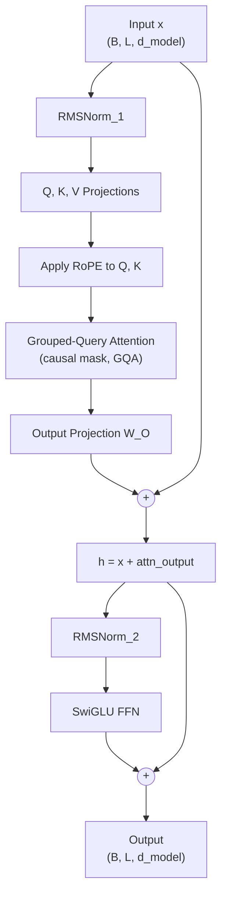

# Transformer Block

**Phase 3 · Topic 14** — The repeated unit in every LLM. A single decoder block wires together RMSNorm, grouped-query attention with RoPE, and SwiGLU FFN into the pre-norm architecture used by Llama, Mistral, and every modern open-weight model.

## What it is

A transformer block is the fundamental building unit that gets stacked $N$ times to form a complete transformer model. GPT-3 has 96 blocks, Llama 2 70B has 80 blocks, Llama 3 8B has 32 blocks. Every modern LLM is a sequence of these identical blocks preceded by an embedding layer and followed by an output projection. Understanding the data flow through a single block -- every matrix multiply, every residual add, every normalization -- is essential because optimizing inference means optimizing this repeated computation. If you can make one block faster, the entire model gets faster by that same factor times $N$.

This topic is an integration exercise. You have already implemented every component individually: RMSNorm (Topic 8), Grouped-Query Attention with KV head sharing (Topic 11), and Rotary Position Embeddings (Topic 13). The transformer block wires these together with residual connections and introduces the only new component: the SwiGLU feed-forward network, which is the standard FFN in modern LLMs. SwiGLU replaces the original transformer's two-matrix FFN with a three-matrix gated architecture where one pathway controls the information flow through the other. The gating mechanism and the SiLU activation function make it more expressive than ReLU or GELU FFNs at comparable parameter counts.

The architecture you will implement is the **pre-norm decoder block**, which is the modern standard (Llama, GPT-NeoX, Mistral, Qwen, Gemma). Pre-norm means normalization is applied *before* each sublayer, not after. The original transformer (Vaswani et al., 2017) used post-norm ($\text{LayerNorm}(x + \text{sublayer}(x))$), but pre-norm ($x + \text{sublayer}(\text{Norm}(x))$) is now universal because it provides more stable gradients during training. The residual connections form a "gradient highway" where information flows directly from output to input without passing through any nonlinearity or normalization, preventing gradient vanishing even at 100+ layers of depth.

## The math

### Notation

- $d_{model}$ = model dimension (e.g., 4096)
- $h$ = number of query heads (e.g., 32)
- $h_{kv}$ = number of key/value heads (e.g., 8)
- $d_k = d_{model} / h$ = head dimension (e.g., 128)
- $d_{ff}$ = FFN intermediate dimension (e.g., 11008 for Llama 7B)
- $B$ = batch size
- $L$ = sequence length
- $\Theta$ = RoPE base frequency (e.g., 10000)

### Pre-norm decoder block architecture



### Forward pass equations

**Sub-layer 1: Attention with residual**

$$x_{norm} = \text{RMSNorm}_1(x)$$

$$Q = x_{norm} W_Q, \quad K = x_{norm} W_K, \quad V = x_{norm} W_V$$

$$Q', K' = \text{RoPE}(Q, K)$$

$$\text{attn\_out} = \text{GQA}(Q', K', V, \text{mask})$$

$$h = x + \text{attn\_out}$$

**Sub-layer 2: FFN with residual**

$$h_{norm} = \text{RMSNorm}_2(h)$$

$$\text{ffn\_out} = \text{SwiGLU}(h_{norm})$$

$$\text{output} = h + \text{ffn\_out}$$

### SwiGLU feed-forward network

The standard FFN in modern LLMs. Uses three weight matrices instead of two, with element-wise gating:

$$\text{SwiGLU}(x) = \left(\text{SiLU}(x W_{gate}) \odot (x W_{up})\right) W_{down}$$

where $\odot$ denotes element-wise multiplication and $\text{SiLU}(z) = z \cdot \sigma(z) = z / (1 + e^{-z})$.

Expanding step by step:

$$\text{gate} = x W_{gate} \in \mathbb{R}^{B \times L \times d_{ff}}$$

$$\text{up} = x W_{up} \in \mathbb{R}^{B \times L \times d_{ff}}$$

$$\text{hidden} = \text{SiLU}(\text{gate}) \odot \text{up} \in \mathbb{R}^{B \times L \times d_{ff}}$$

$$\text{output} = \text{hidden} \cdot W_{down} \in \mathbb{R}^{B \times L \times d_{model}}$$

**Weight shapes:**

$$W_{gate} \in \mathbb{R}^{d_{model} \times d_{ff}}, \quad W_{up} \in \mathbb{R}^{d_{model} \times d_{ff}}, \quad W_{down} \in \mathbb{R}^{d_{ff} \times d_{model}}$$

**Why three matrices instead of two?** The original FFN uses $W_1 \in \mathbb{R}^{d_{model} \times d_{ff}}$ and $W_2 \in \mathbb{R}^{d_{ff} \times d_{model}}$ with an activation in between. SwiGLU adds a gating pathway ($W_{gate}$) that controls element-wise which features pass through. To keep the total parameter count comparable to a standard FFN with $d_{ff} = 4 \cdot d_{model}$, Llama uses $d_{ff} \approx \frac{8}{3} \cdot d_{model}$ (rounded to a multiple of 256 for hardware alignment). For Llama 7B: $d_{ff} = 11008$ with $d_{model} = 4096$ (ratio $\approx 2.69$).

### SwiGLU backward pass

Let $g_{out} = \frac{\partial \mathcal{L}}{\partial \text{output}} \in \mathbb{R}^{B \times L \times d_{model}}$.

**Step 1: Gradient through $W_{down}$ projection**

$$\nabla \text{hidden} = g_{out} \cdot W_{down}^\top \in \mathbb{R}^{B \times L \times d_{ff}}$$

$$\nabla W_{down} = \text{hidden}^\top \cdot g_{out} \in \mathbb{R}^{d_{ff} \times d_{model}}$$

(Accumulated over batch and sequence: $\nabla W_{down} = \text{einsum}(\texttt{"bld,blm->dm"}, \text{hidden}, g_{out})$)

**Step 2: Gradient through element-wise gating**

$$\nabla (\text{SiLU}(\text{gate})) = \nabla \text{hidden} \odot \text{up}$$

$$\nabla \text{up} = \nabla \text{hidden} \odot \text{SiLU}(\text{gate})$$

**Step 3: Gradient through SiLU activation**

The SiLU derivative is:

$$\frac{d}{dz} \text{SiLU}(z) = \sigma(z)(1 + z(1 - \sigma(z)))$$

where $\sigma(z) = 1 / (1 + e^{-z})$ is the sigmoid function.

$$\nabla \text{gate} = \nabla (\text{SiLU}(\text{gate})) \odot \sigma(\text{gate})(1 + \text{gate} \cdot (1 - \sigma(\text{gate})))$$

**Step 4: Gradient through projections**

$$\nabla W_{gate} = \text{einsum}(\texttt{"blm,bld->md"}, x, \nabla \text{gate}) \in \mathbb{R}^{d_{model} \times d_{ff}}$$

$$\nabla W_{up} = \text{einsum}(\texttt{"blm,bld->md"}, x, \nabla \text{up}) \in \mathbb{R}^{d_{model} \times d_{ff}}$$

$$\nabla x_{ffn} = \nabla \text{gate} \cdot W_{gate}^\top + \nabla \text{up} \cdot W_{up}^\top \in \mathbb{R}^{B \times L \times d_{model}}$$

### Full block backward pass

```mermaid
flowchart TB
    subgraph "Backward Flow"
        dOut["d_output<br/>(B, L, d_model)"] --> dAdd2["Residual split"]
        dAdd2 --> dFFN["d_ffn = d_output"]
        dAdd2 --> dH1_res2["d_h (residual path)"]

        dFFN --> dSwiGLU["SwiGLU backward"]
        dSwiGLU --> dLN2["RMSNorm_2 backward"]
        dLN2 --> dH1_ffn["d_h (FFN path)"]

        dH1_res2 --> dH1_merge["d_h = d_h_res + d_h_ffn"]
        dH1_ffn --> dH1_merge

        dH1_merge --> dAdd1["Residual split"]
        dAdd1 --> dAttn["d_attn = d_h"]
        dAdd1 --> dX_res1["d_x (residual path)"]

        dAttn --> dOutProj["Output proj backward"]
        dOutProj --> dGQA["GQA backward<br/>(softmax, Q/K/V)"]
        dGQA --> dRoPE["RoPE backward"]
        dRoPE --> dProj["Q/K/V proj backward"]
        dProj --> dLN1["RMSNorm_1 backward"]
        dLN1 --> dX_attn["d_x (attention path)"]

        dX_res1 --> dX_merge["d_x = d_x_res + d_x_attn"]
        dX_attn --> dX_merge
        dX_merge --> dX_final["d_input<br/>(B, L, d_model)"]
    end
```



The gradient through the full block follows the chain rule. The critical insight is that residual connections create two gradient paths at each sub-layer:

**Residual 2 (FFN):** Given $\text{output} = h + \text{ffn\_out}$:

$$\frac{\partial \mathcal{L}}{\partial h} = \frac{\partial \mathcal{L}}{\partial \text{output}} + \frac{\partial \mathcal{L}}{\partial \text{output}} \cdot \frac{\partial \text{ffn\_out}}{\partial h}$$

The first term is the direct residual gradient. The second flows through the FFN sublayer (RMSNorm$_2$ $\rightarrow$ SwiGLU).

**Residual 1 (Attention):** Given $h = x + \text{attn\_out}$:

$$\frac{\partial \mathcal{L}}{\partial x} = \frac{\partial \mathcal{L}}{\partial h} + \frac{\partial \mathcal{L}}{\partial h} \cdot \frac{\partial \text{attn\_out}}{\partial x}$$

Again, the direct residual gradient plus the gradient through the attention sublayer (RMSNorm$_1$ $\rightarrow$ QKV projections $\rightarrow$ RoPE $\rightarrow$ GQA $\rightarrow$ output projection).

### Complete shape table

| Step | Tensor | Shape |
|------|--------|-------|
| Input | $x$ | $(B, L, d_{model})$ |
| RMSNorm$_1$ | $x_{norm}$ | $(B, L, d_{model})$ |
| Q projection | $Q = x_{norm} W_Q$ | $(B, L, h \cdot d_k)$ |
| K projection | $K = x_{norm} W_K$ | $(B, L, h_{kv} \cdot d_k)$ |
| V projection | $V = x_{norm} W_V$ | $(B, L, h_{kv} \cdot d_k)$ |
| Q reshape + transpose | $Q$ | $(B, h, L, d_k)$ |
| K reshape + transpose | $K$ | $(B, h_{kv}, L, d_k)$ |
| V reshape + transpose | $V$ | $(B, h_{kv}, L, d_k)$ |
| RoPE(Q) | $Q'$ | $(B, h, L, d_k)$ |
| RoPE(K) | $K'$ | $(B, h_{kv}, L, d_k)$ |
| KV repeat-interleave | $K'_{exp}, V_{exp}$ | $(B, h, L, d_k)$ |
| Attention scores | $QK^\top / \sqrt{d_k}$ | $(B, h, L, L)$ |
| Causal mask + softmax | $A$ | $(B, h, L, L)$ |
| Value weighting | $A \cdot V_{exp}$ | $(B, h, L, d_k)$ |
| Head merge + output proj | attn\_out | $(B, L, d_{model})$ |
| Residual 1 | $h = x + \text{attn\_out}$ | $(B, L, d_{model})$ |
| RMSNorm$_2$ | $h_{norm}$ | $(B, L, d_{model})$ |
| Gate projection | $h_{norm} W_{gate}$ | $(B, L, d_{ff})$ |
| Up projection | $h_{norm} W_{up}$ | $(B, L, d_{ff})$ |
| SiLU + gating | $\text{SiLU}(\text{gate}) \odot \text{up}$ | $(B, L, d_{ff})$ |
| Down projection | $\text{hidden} \cdot W_{down}$ | $(B, L, d_{model})$ |
| Residual 2 | $\text{output} = h + \text{ffn\_out}$ | $(B, L, d_{model})$ |

### Parameter count per block

**Attention (GQA):**

$$W_Q: d_{model}^2, \quad W_K: d_{model} \cdot h_{kv} \cdot d_k, \quad W_V: d_{model} \cdot h_{kv} \cdot d_k, \quad W_O: d_{model}^2$$

$$\text{Total}_{attn} = 2 \cdot d_{model}^2 + 2 \cdot d_{model} \cdot h_{kv} \cdot d_k$$

When $h_{kv} = h$ (MHA): $\text{Total}_{attn} = 4 \cdot d_{model}^2$

**SwiGLU FFN:**

$$W_{gate}: d_{model} \cdot d_{ff}, \quad W_{up}: d_{model} \cdot d_{ff}, \quad W_{down}: d_{ff} \cdot d_{model}$$

$$\text{Total}_{ffn} = 3 \cdot d_{model} \cdot d_{ff}$$

**RMSNorm ($\times 2$):**

$$\gamma_1, \gamma_2: 2 \cdot d_{model} \quad \text{(negligible)}$$

**Total per block:**

$$\text{Total} = 2 \cdot d_{model}^2 + 2 \cdot d_{model} \cdot h_{kv} \cdot d_k + 3 \cdot d_{model} \cdot d_{ff} + 2 \cdot d_{model}$$

#### Concrete example: Llama 2 7B

| Component | Parameters | Share |
|-----------|-----------|-------|
| $W_Q$ ($4096 \times 4096$) | 16.8M | 8.3% |
| $W_K$ ($4096 \times 4096$) | 16.8M | 8.3% |
| $W_V$ ($4096 \times 4096$) | 16.8M | 8.3% |
| $W_O$ ($4096 \times 4096$) | 16.8M | 8.3% |
| $W_{gate}$ ($4096 \times 11008$) | 45.1M | 22.3% |
| $W_{up}$ ($4096 \times 11008$) | 45.1M | 22.3% |
| $W_{down}$ ($11008 \times 4096$) | 45.1M | 22.3% |
| RMSNorm $\gamma \times 2$ | 8.2K | ~0% |
| **Total per block** | **~202M** | **100%** |
| **32 blocks** | **~6.4B** | |

The FFN dominates: $\sim67\%$ of parameters per block are in SwiGLU.

## Why it matters for inference

### Compute distribution within a block

| Component | FLOPs (per token) | Share |
|-----------|-------------------|-------|
| Attention projections ($W_Q, W_K, W_V, W_O$) | $2 \cdot (2d_{model}^2 + 2 \cdot d_{model} \cdot h_{kv} \cdot d_k)$ | ~33% |
| Attention core ($QK^\top$, softmax, $AV$) | $4 \cdot h \cdot L \cdot d_k$ | Variable with $L$ |
| SwiGLU FFN ($W_{gate}, W_{up}, W_{down}$) | $6 \cdot d_{model} \cdot d_{ff}$ | ~67% |
| RMSNorm ($\times 2$) | $\sim 4 \cdot d_{model}$ | <0.1% |

The FFN accounts for roughly two-thirds of the compute per block. For short sequences, the FFN dominates entirely. For long sequences, the $O(L^2)$ attention core grows to dominate. This crossover point determines which optimizations matter most at a given context length.

### Memory access patterns and fusion opportunities

Without kernel fusion, a single block forward pass performs these global memory reads/writes:

```
Read x (d_model) --> RMSNorm_1 --> Write x_norm (d_model)
Read x_norm --> Q,K,V projections --> Write Q,K,V
Read Q,K --> RoPE --> Write Q',K' (could fuse with projections)
Read Q',K',V --> Attention --> Write attn_out
Read x, attn_out --> Residual add --> Write h (could fuse with attention output)
Read h --> RMSNorm_2 --> Write h_norm (could fuse with residual add)
Read h_norm --> Gate,Up projections --> Write gate,up (two d_ff tensors!)
SiLU + element-wise multiply --> Write hidden (d_ff -- LARGEST intermediate tensor)
Read hidden --> Down projection --> Write ffn_out
Read h, ffn_out --> Residual add --> Write output
```

Common fusion patterns in production inference engines:

| Fusion | Operations combined | Memory round-trips saved |
|--------|-------------------|-------------------------|
| Residual + RMSNorm | $h = x + \text{attn}$; $h_{norm} = \text{RMSNorm}(h)$ | 1 (avoids writing $h$) |
| QKV projection | $Q, K, V$ as single matmul + split | 2 (avoids reading $x_{norm}$ 3 times) |
| RoPE + QK projection | Apply rotation during the projection kernel | 1 (avoids writing/reading Q, K twice) |
| SwiGLU gate+up+activation | Gate and up projections, SiLU, element-wise multiply | 2 (avoids writing gate and up separately) |

The naive implementation you build first makes every intermediate tensor explicit. This is essential for understanding *why* each fusion helps: you see the data flow, you see the redundant reads/writes, and you can quantify the bandwidth savings.

### Residual connections as gradient highways

The residual $x + \text{sublayer}(x)$ creates a direct gradient path:

$$\frac{\partial}{\partial x}(x + f(x)) = I + \frac{\partial f}{\partial x}$$

Even if $\frac{\partial f}{\partial x}$ vanishes, the gradient is at least $I$. Through $N$ stacked blocks, the gradient includes a term $I^N = I$ -- the identity contribution never degrades regardless of depth. This is why transformers can be stacked 100+ layers deep where earlier architectures (RNNs, vanilla deep networks) could not.

### Pre-norm vs post-norm

| Property | Post-LN (original) | Pre-LN (modern) |
|----------|-------------------|------------------|
| Formula | $\text{LN}(x + f(x))$ | $x + f(\text{LN}(x))$ |
| Residual stream | Normalized at each step | Unnormalized (grows unboundedly) |
| Gradient through residual | Must pass through LN backward | Direct identity path |
| Training stability | Requires warmup, careful LR | Stable from start |
| Used by | Original transformer, BERT | GPT-2+, Llama, Mistral, all modern LLMs |

Pre-norm is standard. The implementation should support both for educational comparison, but default to pre-norm.

### Peak activation memory

The largest intermediate tensor in a block is the SwiGLU hidden state:

$$\text{hidden} \in \mathbb{R}^{B \times L \times d_{ff}}$$

For Llama 7B with $B = 1$, $L = 4096$, $d_{ff} = 11008$: $\text{hidden}$ is $4096 \times 11008 \times 4 \approx 172$ MB (float32). The attention score matrix $A \in \mathbb{R}^{B \times h \times L \times L}$ is $1 \times 32 \times 4096 \times 4096 \times 4 \approx 2$ GB. At long sequences, the attention scores dominate; at short sequences, the FFN hidden state dominates.

## Connection to prior modules

### RMSNorm (Topic 8)

Import `RMSNorm` from `02-neural-networks/normalization/`. The class provides `.forward(x)` returning normalized output and `.backward(grad)` returning $\nabla x$. It stores `grad_gamma` as an attribute. Two instances are needed per block: one before attention, one before FFN.

### Grouped-Query Attention (Topic 11)

Import `GroupedQueryAttention` from `03-transformers/grouped-query-attention/`. The class handles Q/K/V projections, head splitting, repeat-interleave, scaled dot-product attention, causal masking, head merge, and output projection. It provides `.forward(X, mask)` and `.backward(grad)`.

**Important integration detail:** For the transformer block, we need to insert RoPE between the Q/K projection and the attention score computation. The existing `GroupedQueryAttention.forward()` does everything internally. You have two options:

1. **Decompose the GQA forward pass** into explicit steps within the transformer block, inserting RoPE at the right point. This means using the GQA weight matrices but managing the computation flow yourself.
2. **Modify the GQA class to accept a RoPE callback** that gets applied after Q/K projection and head splitting.

Option 1 is recommended for clarity: it makes the full data flow visible in one place. Import the utility functions (`repeat_kv`, `reduce_kv_grad`, `create_causal_mask`, `softmax`, `softmax_backward`) from the GQA module and use the GQA weight initialization pattern, but write the integrated forward pass explicitly.

### RoPE (Topic 13)

Import `RoPE` from `03-transformers/rope/`. The class provides `.forward(q, k, positions)` returning $(Q', K')$ and `.backward(grad_q, grad_k)$ returning gradients through the rotation. RoPE is applied after Q/K head splitting (shapes $(B, h, L, d_k)$ and $(B, h_{kv}, L, d_k)$) but before the attention score computation.

### SiLU activation (Topic 6)

Import `SiLU` from `02-neural-networks/activations/` or reimplement inline. The existing `SiLU` class provides `.forward(x)` and `.backward(grad)` with caching.

## What to implement

### SwiGLU FFN class (new -- implement within this module)

- [ ] `SwiGLUFFN.__init__(self, d_model, d_ff)`: initialize three weight matrices
  - $W_{gate} \in \mathbb{R}^{d_{model} \times d_{ff}}$ (Xavier init)
  - $W_{up} \in \mathbb{R}^{d_{model} \times d_{ff}}$ (Xavier init)
  - $W_{down} \in \mathbb{R}^{d_{ff} \times d_{model}}$ (Xavier init)
  - No biases (following Llama convention)

- [ ] `SwiGLUFFN.forward(self, x)`: compute $(\text{SiLU}(x W_{gate}) \odot (x W_{up})) W_{down}$
  - Input: $x \in \mathbb{R}^{B \times L \times d_{model}}$
  - Output: $\mathbb{R}^{B \times L \times d_{model}}$
  - Cache: $x$, gate, up, sigmoid(gate), SiLU(gate), hidden for backward

- [ ] `SwiGLUFFN.backward(self, grad_output)`: full gradient computation
  - Compute $\nabla W_{gate}$, $\nabla W_{up}$, $\nabla W_{down}$
  - Return $\nabla x \in \mathbb{R}^{B \times L \times d_{model}}$

### TransformerBlock class (integration)

- [ ] `TransformerBlock.__init__(self, d_model, num_heads, num_kv_heads, d_ff, max_seq_len, rope_theta=10000.0)`: wire all components
  - Instantiate `RMSNorm(d_model)` $\times 2$ (from normalization module)
  - Instantiate `RoPE(d_k, max_seq_len, rope_theta)` (from RoPE module)
  - Instantiate `SwiGLUFFN(d_model, d_ff)` (new class)
  - Initialize attention projection matrices: $W_Q$, $W_K$, $W_V$, $W_O$ following GQA shapes
  - Validate: $d_{model} \bmod h = 0$, $h \bmod h_{kv} = 0$

- [ ] `TransformerBlock.forward(self, x, mask=None, positions=None)`: full pre-norm decoder block
  - Step 1: $x_{norm} = \text{RMSNorm}_1(x)$
  - Step 2: Project Q, K, V from $x_{norm}$
  - Step 3: Reshape and transpose to head layout
  - Step 4: Apply RoPE to Q and K
  - Step 5: Expand KV heads (repeat-interleave)
  - Step 6: Compute attention scores, apply causal mask, softmax
  - Step 7: Compute attention output, merge heads, output projection
  - Step 8: $h = x + \text{attn\_out}$ (residual connection 1)
  - Step 9: $h_{norm} = \text{RMSNorm}_2(h)$
  - Step 10: $\text{ffn\_out} = \text{SwiGLU}(h_{norm})$
  - Step 11: $\text{output} = h + \text{ffn\_out}$ (residual connection 2)
  - Return output, optionally attention weights for visualization
  - Cache all intermediates for backward

- [ ] `TransformerBlock.backward(self, grad_output)`: full backward pass
  - Gradient through residual 2: split into FFN path and direct path
  - Backward through SwiGLU FFN
  - Backward through RMSNorm$_2$
  - Accumulate gradients from both paths into $\nabla h$
  - Gradient through residual 1: split into attention path and direct path
  - Backward through output projection
  - Backward through head merge
  - Backward through attention (softmax, $QK^\top$, value weighting)
  - Backward through KV repeat-interleave (group gradient summation)
  - Backward through RoPE
  - Backward through head split
  - Backward through Q/K/V projections
  - Backward through RMSNorm$_1$
  - Accumulate gradients from both paths into $\nabla x$
  - Store all parameter gradients as attributes
  - Return $\nabla x \in \mathbb{R}^{B \times L \times d_{model}}$

### Analysis functions

- [ ] `count_parameters(d_model, num_heads, num_kv_heads, d_ff)`: parameter breakdown
  - Return dict with counts for attention ($W_Q$, $W_K$, $W_V$, $W_O$), FFN ($W_{gate}$, $W_{up}$, $W_{down}$), norms ($\gamma_1$, $\gamma_2$), and total
  - Include percentages for attention vs FFN vs norms

- [ ] `count_flops(batch_size, seq_len, d_model, num_heads, num_kv_heads, d_ff)`: FLOPs per forward pass
  - Attention projections: $2B L (2 d_{model}^2 + 2 \cdot d_{model} \cdot h_{kv} \cdot d_k)$
  - Attention core: $4BhL^2 d_k + 5BhL^2$ (QK, softmax, AV)
  - RoPE: $6 B h L d_k$ (negligible)
  - SwiGLU FFN: $6 B L \cdot d_{model} \cdot d_{ff}$ (three matmuls)
  - RMSNorm: $\sim 4 B L d_{model}$ (negligible)
  - Return breakdown dict and total

- [ ] `memory_footprint(batch_size, seq_len, d_model, num_heads, num_kv_heads, d_ff)`: peak activation memory
  - Parameter memory (all weight matrices)
  - Activation memory (all intermediate tensors for backward)
  - Identify the single largest intermediate tensor
  - Return breakdown dict with bytes

## Test cases to cover

### Shape correctness

- [ ] **Output shape matches input**: $(B, L, d_{model})$ in, $(B, L, d_{model})$ out for various $B$, $L$, $d_{model}$
- [ ] **Single token**: $L = 1$ works correctly (inference decode step)
- [ ] **Variable batch sizes**: $B = 1, 2, 8$
- [ ] **Variable sequence lengths**: $L = 1, 16, 64, 128$
- [ ] **SwiGLU shapes**: Input $(B, L, d_{model})$ produces output $(B, L, d_{model})$, hidden $(B, L, d_{ff})$

### SwiGLU FFN correctness

- [ ] **Known input/output**: With $d_{model} = 4$, $d_{ff} = 6$, use fixed weights and input. Compute SwiGLU output by hand (gate path, up path, SiLU, element-wise multiply, down projection). Verify match.
- [ ] **Zero input**: SiLU(0) = 0, so SwiGLU(0) = 0 regardless of weights (because $\text{SiLU}(0 \cdot W_{gate}) = 0$).
- [ ] **Gating effect**: Verify that $W_{gate}$ controls information flow. Set $W_{gate}$ to produce large negative values (gate $\approx 0$ after SiLU) -- output should be near zero regardless of $W_{up}$.
- [ ] **Gradient check (SwiGLU)**: Finite differences for $W_{gate}$, $W_{up}$, $W_{down}$, and input $x$. Relative error $< 10^{-5}$.
- [ ] **SiLU activation correctness**: Verify SiLU values at known points: SiLU(0) = 0, SiLU(1) $\approx$ 0.7311, SiLU(-1) $\approx$ -0.2689.

### Residual connection tests

- [ ] **Identity passthrough**: With all sublayer weights zero-initialized, output equals input. Both residual paths pass through identity.
- [ ] **Residual gradient**: $\nabla x$ includes a direct component equal to $\nabla \text{output}$ (from the residual path, before any sublayer gradients are added).
- [ ] **Gradient magnitude preservation**: $\|\nabla x\| \geq \|\nabla \text{output}\|$ (residual ensures gradient does not shrink below the direct path contribution).

### Pre-norm behavior

- [ ] **Attention receives normalized input**: The input to the attention sub-layer (after RMSNorm$_1$) has approximately unit RMS along the last dimension.
- [ ] **FFN receives normalized input**: The input to the FFN (after RMSNorm$_2$) has approximately unit RMS.
- [ ] **Output is not normalized**: The block output does not have unit variance -- it is the sum of the residual stream and the sublayer output.

### RoPE integration

- [ ] **Position-dependent output**: The same input at different positions (via the `positions` argument) produces different outputs due to RoPE.
- [ ] **Position 0 with RoPE**: At position 0, RoPE is identity. Output should match a block without RoPE.
- [ ] **Causal mask + RoPE**: Masked positions still receive zero attention weight after RoPE rotation.

### Numerical correctness

- [ ] **Gradient check (full block)**: Finite differences for all parameters: $W_Q$, $W_K$, $W_V$, $W_O$, $W_{gate}$, $W_{up}$, $W_{down}$, $\gamma_1$, $\gamma_2$, and input $x$. Use small dimensions ($d_{model} = 8$, $h = 2$, $h_{kv} = 1$, $d_{ff} = 16$, $L = 4$) for tractability. Relative error $< 10^{-4}$ (relaxed tolerance due to deep composition).
- [ ] **No NaN/Inf**: Random inputs in $[-2, 2]$ produce finite outputs and finite gradients.
- [ ] **Forward determinism**: Same input and weights always produce same output.
- [ ] **Backward determinism**: Same forward + backward always produce same gradients.

### Integration tests

- [ ] **Stacked blocks**: Pass output of block 1 as input to block 2. Verify output shape is still $(B, L, d_{model})$.
- [ ] **Forward-backward roundtrip**: Forward pass followed by backward pass produces gradients for all parameters. No parameters have `None` gradients.
- [ ] **GQA configurations**: Test with $(h=8, h_{kv}=8)$ (MHA), $(h=8, h_{kv}=4)$ (GQA), $(h=8, h_{kv}=1)$ (MQA). All produce valid output.
- [ ] **Causal masking**: Position $i$ in the output is identical whether the sequence has $L = i+1$ or $L > i+1$ tokens (future tokens do not affect past outputs). Compare outputs at position 0 between $L=1$ and $L=4$.

### Configuration validation

- [ ] **$d_{model} \bmod h \neq 0$ raises ValueError**
- [ ] **$h \bmod h_{kv} \neq 0$ raises ValueError**
- [ ] **$d_k$ is odd raises ValueError** (RoPE requires even $d_k$)

### Parameter count and FLOP tests

- [ ] **Llama 7B config**: $d_{model} = 4096$, $h = 32$, $h_{kv} = 32$, $d_{ff} = 11008$. Verify parameter count $\approx$ 202M per block.
- [ ] **Llama 2 70B config**: $d_{model} = 8192$, $h = 64$, $h_{kv} = 8$, $d_{ff} = 28672$. Verify total parameters per block and GQA savings vs MHA.
- [ ] **FFN dominates**: For all configs, FFN parameters > 60% of total.
- [ ] **FLOPs breakdown**: Attention projection + attention core + FFN FLOPs sum to total.

## Reference configurations

```python
# Minimal debug config
d_model = 64
num_heads = 4
num_kv_heads = 2
d_ff = 128          # ~2 * d_model for testing
max_seq_len = 128
rope_theta = 10000.0

# Llama 2 7B
d_model_7b = 4096
num_heads_7b = 32
num_kv_heads_7b = 32   # Llama 2 7B uses MHA
d_ff_7b = 11008        # ~2.69 * d_model (SwiGLU)
max_seq_len_7b = 4096
rope_theta_7b = 10000.0
num_layers_7b = 32

# Llama 2 70B
d_model_70b = 8192
num_heads_70b = 64
num_kv_heads_70b = 8   # GQA: 8x reduction
d_ff_70b = 28672       # ~3.5 * d_model
max_seq_len_70b = 4096
rope_theta_70b = 10000.0
num_layers_70b = 80

# Llama 3 8B
d_model_llama3 = 4096
num_heads_llama3 = 32
num_kv_heads_llama3 = 8   # GQA: 4x reduction
d_ff_llama3 = 14336        # ~3.5 * d_model
max_seq_len_llama3 = 8192
rope_theta_llama3 = 500000.0
num_layers_llama3 = 32

# Mistral 7B
d_model_mistral = 4096
num_heads_mistral = 32
num_kv_heads_mistral = 8  # GQA: 4x reduction
d_ff_mistral = 14336
max_seq_len_mistral = 8192  # sliding window variant
rope_theta_mistral = 10000.0
num_layers_mistral = 32

# Tiny config for gradient checking
d_model_tiny = 8
num_heads_tiny = 2
num_kv_heads_tiny = 1
d_ff_tiny = 16
max_seq_len_tiny = 8
```

## Implementation notes

### Importing existing modules

```python
import sys
sys.path.insert(0, str(Path(__file__).resolve().parents[2]))

from machine_learning.normalization import RMSNorm
from machine_learning.grouped_query_attention import (
    repeat_kv, reduce_kv_grad, create_causal_mask, softmax, softmax_backward,
)
from machine_learning.rope import RoPE, apply_rope, rotate_half, rotate_half_backward
from machine_learning.activations import SiLU
```

Adjust import paths based on the actual project structure. The key point is to *reuse* existing implementations, not reimplement them.

### SwiGLU numerical stability

The SiLU function $z \cdot \sigma(z)$ is numerically stable because $\sigma(z) \in (0, 1)$ and the product $z \cdot \sigma(z)$ is bounded. However, the sigmoid computation should use the stable form:

$$\sigma(z) = \begin{cases} \frac{1}{1 + e^{-z}} & z \geq 0 \\ \frac{e^z}{1 + e^z} & z < 0 \end{cases}$$

This avoids overflow from $e^{|z|}$ for large $|z|$.

### Xavier initialization for SwiGLU

Xavier/Glorot normal for each weight matrix:

$$W \sim \mathcal{N}\left(0, \sqrt{\frac{2}{n_{in} + n_{out}}}\right)$$

For $W_{gate}$ and $W_{up}$: $n_{in} = d_{model}$, $n_{out} = d_{ff}$. For $W_{down}$: $n_{in} = d_{ff}$, $n_{out} = d_{model}$.

### No biases

Following the Llama convention, the transformer block uses no bias terms in any linear projection (attention or FFN). RMSNorm has a learnable scale $\gamma$ but no shift $\beta$ (unlike LayerNorm).

### No dropout

Modern LLMs do not use dropout. The implementation should not include dropout. At inference time, dropout is disabled anyway, so it is irrelevant for the inference-focused curriculum.

### What NOT to implement here

- **KV cache management**: Topic 16. This module computes the full forward pass over the entire sequence each time.
- **Token embedding or output head**: This is a single block, not a full model. Input and output are both $(B, L, d_{model})$.
- **Post-norm variant**: Mention for comparison but implement only pre-norm.
- **GELU/ReLU FFN**: SwiGLU only. The standard FFN is simpler but not what production LLMs use.
- **Flash attention**: Topic 17. This uses the naive materialized-attention approach.
- **Dropout**: Not used in modern LLMs.

## References

- "Attention Is All You Need" (Vaswani et al., 2017) -- original transformer block with post-norm
- "Language Models are Unsupervised Multitask Learners" (Radford et al., 2019) -- GPT-2, introduced pre-norm
- "GLU Variants Improve Transformer" (Shazeer, 2020) -- introduced SwiGLU and analyzed gated FFN variants
- "LLaMA: Open and Efficient Foundation Language Models" (Touvron et al., 2023) -- pre-norm + RMSNorm + SwiGLU + RoPE
- "Llama 2: Open Foundation and Fine-Tuned Chat Models" (Touvron et al., 2023) -- added GQA at 70B scale
- "Root Mean Square Layer Normalization" (Zhang & Sennrich, 2019) -- RMSNorm
- "RoFormer: Enhanced Transformer with Rotary Position Embedding" (Su et al., 2021) -- RoPE
