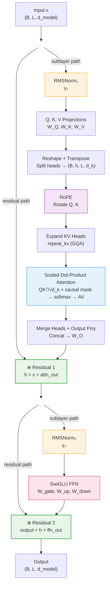
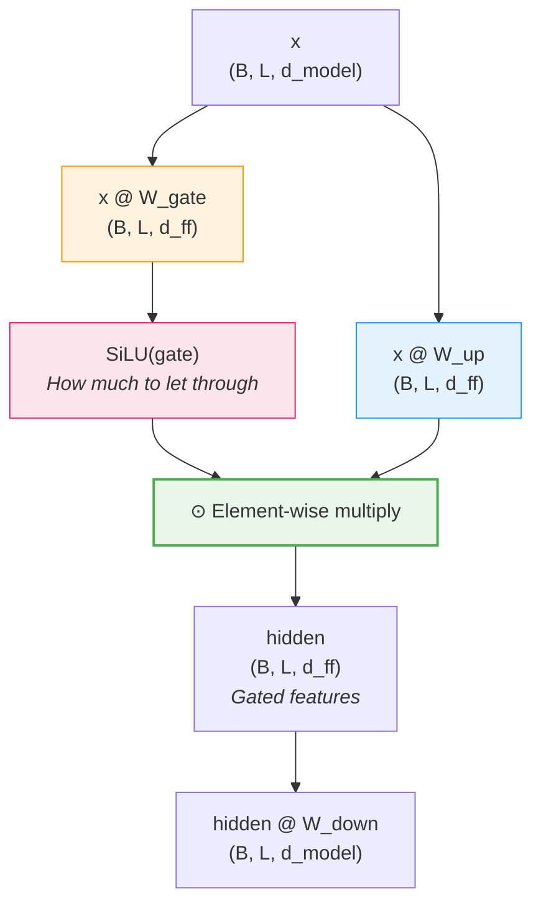
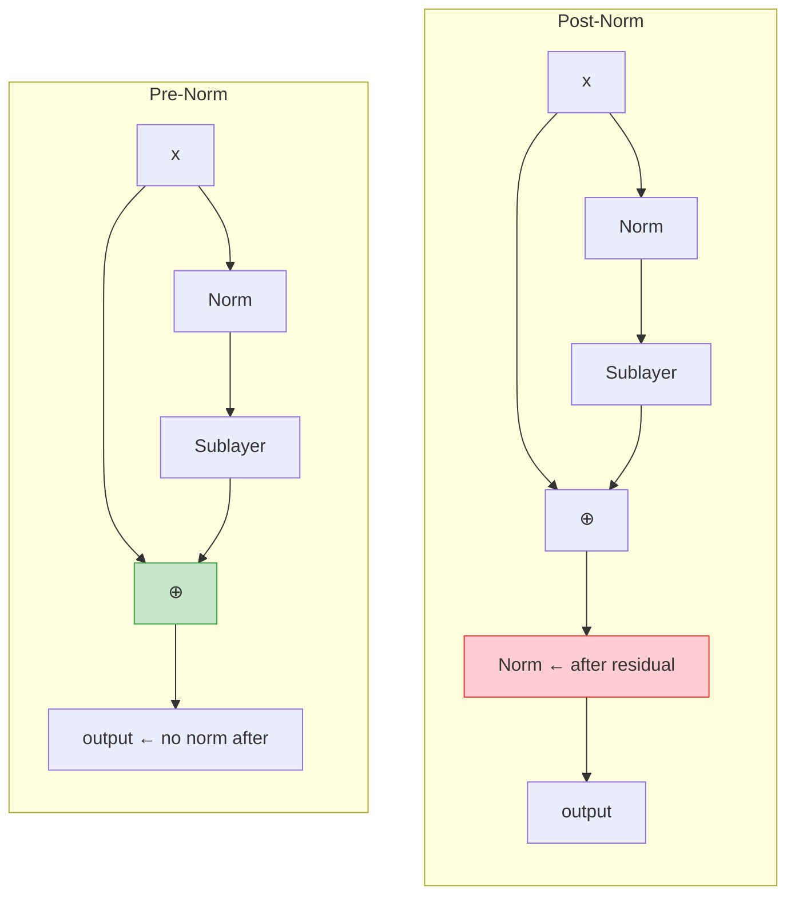
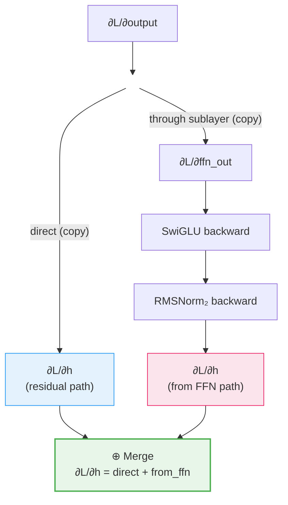

# Transformer Block -- Deep Dive

## The Intuition

### What Problem Are We Solving?

You have built every component of a modern LLM individually: RMSNorm to stabilize activations, multi-head attention with grouped queries and rotary position embeddings to let tokens communicate, and activation functions to introduce nonlinearity. But these components are useless in isolation. A neural network is not a bag of parts -- it is a carefully orchestrated pipeline where the output of each operation flows into the next, with specific wiring patterns that make training stable and inference efficient.

The transformer block is that wiring pattern. It is the fundamental repeated unit of every LLM. GPT-3 stacks 96 of them. Llama 2 70B stacks 80 of them. Llama 3 8B stacks 32 of them. Between the embedding layer at the bottom and the output projection at the top, the entire model is just this one block, repeated. If you understand one block completely -- every matrix multiply, every residual add, every normalization -- you understand the computational core of every modern language model.

This topic is an integration exercise. The only genuinely new component is the **SwiGLU feed-forward network**, a gated FFN that replaces the original transformer's two-matrix FFN with a three-matrix architecture where one pathway controls the information flow through the other. Everything else -- RMSNorm, grouped-query attention, RoPE -- is imported from previous modules and wired together with residual connections in the pre-norm pattern used by Llama, Mistral, and all modern open-weight models.

### The Key Insight

The transformer block has two sublayers -- attention and FFN -- connected by **residual connections** with **pre-normalization**. The residual connections create a "gradient highway" where information flows directly from output to input without passing through any nonlinearity. The pre-norm pattern normalizes the input to each sublayer, not the output. Together, these two design choices enable stable training at 100+ layers of depth, which is something earlier architectures like RNNs and vanilla deep networks could never achieve.

The formula is deceptively simple:

$$h = x + \text{Attention}(\text{RMSNorm}_1(x))$$

$$\text{output} = h + \text{SwiGLU}(\text{RMSNorm}_2(h))$$

Two normalizations, two sublayer computations, two additions. That is the entire block. But inside those sublayers, there are Q/K/V projections, rotary embeddings, grouped-query expansion, causal masking, softmax, gated activations, and multiple matrix multiplications -- all orchestrated in a specific order that matters.

### Real-World Analogy

Think of a transformer block like one floor of a building with a central elevator shaft. The elevator shaft is the residual connection -- anything that enters on floor $N$ arrives at floor $N+1$ without modification. On each floor, there are two processing rooms: an attention room (where tokens look at each other and exchange information) and an FFN room (where each token individually processes what it learned). The normalizer at each room's entrance is like a calibration step that adjusts the signal before processing, ensuring each room receives input at a consistent scale.

If the attention room or the FFN room produces garbage, no problem -- the elevator shaft still carries the original signal upward. The processing rooms can only *add* to the signal, never destroy it. This is why transformers can be stacked 80 or 100 layers deep: the gradient flowing backward always has a direct path through the elevator shaft, so it never vanishes.

---

## Architecture Diagram



Notice the two residual "highways" that run straight through. The sublayer outputs (attention and FFN) are *added* to the residual stream, never replacing it. Normalization happens *before* each sublayer (pre-norm), not after.

---

## The Math, Step by Step

### The Full Forward Pass

The pre-norm decoder block computes:

**Sub-layer 1: Attention with residual**

$$x_{norm} = \text{RMSNorm}_1(x)$$

$$Q = x_{norm} W_Q, \quad K = x_{norm} W_K, \quad V = x_{norm} W_V$$

$$Q', K' = \text{RoPE}(Q, K)$$

$$\text{attn\_out} = \text{GQA}(Q', K', V, \text{mask})$$

$$h = x + \text{attn\_out}$$

**Sub-layer 2: FFN with residual**

$$h_{norm} = \text{RMSNorm}_2(h)$$

$$\text{ffn\_out} = \text{SwiGLU}(h_{norm})$$

$$\text{output} = h + \text{ffn\_out}$$

Where:
- $x \in \mathbb{R}^{B \times L \times d_{model}}$: input tensor
- $W_Q \in \mathbb{R}^{d_{model} \times d_{model}}$, $W_K, W_V \in \mathbb{R}^{d_{model} \times (h_{kv} \cdot d_k)}$: projection matrices
- $W_O \in \mathbb{R}^{d_{model} \times d_{model}}$: output projection
- $h_{kv}$: number of KV heads (may be less than $h$ for GQA)
- $d_k = d_{model} / h$: per-head dimension

### Complete Shape Table

| Step | Tensor | Shape |
|------|--------|-------|
| Input | $x$ | $(B, L, d_{model})$ |
| RMSNorm$_1$ | $x_{norm}$ | $(B, L, d_{model})$ |
| Q projection | $Q = x_{norm} W_Q$ | $(B, L, h \cdot d_k)$ |
| K projection | $K = x_{norm} W_K$ | $(B, L, h_{kv} \cdot d_k)$ |
| V projection | $V = x_{norm} W_V$ | $(B, L, h_{kv} \cdot d_k)$ |
| Q reshape + transpose | $Q$ | $(B, h, L, d_k)$ |
| K reshape + transpose | $K$ | $(B, h_{kv}, L, d_k)$ |
| V reshape + transpose | $V$ | $(B, h_{kv}, L, d_k)$ |
| RoPE(Q) | $Q'$ | $(B, h, L, d_k)$ |
| RoPE(K) | $K'$ | $(B, h_{kv}, L, d_k)$ |
| KV expand | $K'_{exp}, V_{exp}$ | $(B, h, L, d_k)$ |
| Attention scores | $Q' {K'}_{exp}^\top / \sqrt{d_k}$ | $(B, h, L, L)$ |
| Causal mask + softmax | $A$ | $(B, h, L, L)$ |
| Value weighting | $A \cdot V_{exp}$ | $(B, h, L, d_k)$ |
| Head merge + output proj | attn\_out | $(B, L, d_{model})$ |
| Residual 1 | $h = x + \text{attn\_out}$ | $(B, L, d_{model})$ |
| RMSNorm$_2$ | $h_{norm}$ | $(B, L, d_{model})$ |
| Gate projection | $h_{norm} W_{gate}$ | $(B, L, d_{ff})$ |
| Up projection | $h_{norm} W_{up}$ | $(B, L, d_{ff})$ |
| SiLU + gating | $\text{SiLU}(\text{gate}) \odot \text{up}$ | $(B, L, d_{ff})$ |
| Down projection | $\text{hidden} \cdot W_{down}$ | $(B, L, d_{model})$ |
| Residual 2 | $\text{output} = h + \text{ffn\_out}$ | $(B, L, d_{model})$ |

---

## SwiGLU FFN Deep Dive

### What is a Gated Linear Unit?

The original transformer FFN is straightforward: two matrix multiplications with an activation in between.

$$\text{FFN}(x) = \text{ReLU}(x W_1) W_2$$

This projects from $d_{model}$ up to a wider intermediate dimension $d_{ff}$ (typically $4 \times d_{model}$), applies a nonlinearity, then projects back down. Simple and effective -- but not optimal.

A **Gated Linear Unit (GLU)** adds a second pathway that controls the information flow through the first:

$$\text{GLU}(x) = (\sigma(x W_{gate}) \odot (x W_{up})) W_{down}$$

Here $\sigma$ is the sigmoid function and $\odot$ is element-wise multiplication. The key idea is that $\sigma(x W_{gate})$ produces values between 0 and 1, acting as a learned gate that decides *how much* of each feature from the $x W_{up}$ pathway should pass through. Some features get amplified (gate close to 1), others get suppressed (gate close to 0). The network learns which features matter based on the input, giving it finer-grained control than a simple activation function.

### From GLU to SwiGLU: Why SiLU?

SwiGLU replaces the sigmoid gate with the **SiLU** (Sigmoid Linear Unit) activation, also called Swish:

$$\text{SiLU}(z) = z \cdot \sigma(z) = \frac{z}{1 + e^{-z}}$$

$$\text{SwiGLU}(x) = (\text{SiLU}(x W_{gate}) \odot (x W_{up})) W_{down}$$

Why SiLU instead of sigmoid? Three reasons:

1. **Non-monotonic**: SiLU dips slightly below zero near $z \approx -1.28$ (its minimum is $\approx -0.278$). This allows the gate to produce slightly negative values, which empirically helps optimization. Sigmoid is strictly between 0 and 1 -- it can only scale features, never flip their sign.

2. **Smooth everywhere**: Unlike ReLU (which has a kink at zero) or sigmoid (which saturates for large $|z|$), SiLU is smooth and non-saturating for positive inputs. Gradients flow cleanly.

3. **Self-gating**: The $z \cdot \sigma(z)$ form means the activation is controlled by the input itself -- large positive inputs pass through nearly unchanged ($\sigma(z) \approx 1$, so $\text{SiLU}(z) \approx z$), while negative inputs are suppressed ($\sigma(z) \approx 0$). This makes SiLU inherently a gating function.

Let us verify SiLU at some known points:

$$\text{SiLU}(0) = 0 \cdot \sigma(0) = 0 \cdot 0.5 = 0$$

$$\text{SiLU}(1) = 1 \cdot \sigma(1) = 1 \cdot 0.7311 = 0.7311$$

$$\text{SiLU}(-1) = -1 \cdot \sigma(-1) = -1 \cdot 0.2689 = -0.2689$$

### The Gating Mechanism in Detail

Let us trace through SwiGLU with a concrete picture of what the two pathways do:



The gate pathway decides the *magnitude* (and slight sign flip) of each feature. The up pathway provides the *content*. Their element-wise product is a learned, input-dependent filtering of the features. This is more expressive than simply applying an activation function: the gate and the content see the same input through different weight matrices, so the network can learn "when feature $j$ in the content is large, suppress it" or "when feature $j$ is small, amplify it."

### Why Three Matrices Instead of Two?

The standard FFN has two weight matrices: $W_1 \in \mathbb{R}^{d_{model} \times d_{ff}}$ and $W_2 \in \mathbb{R}^{d_{ff} \times d_{model}}$, for a total of $2 \cdot d_{model} \cdot d_{ff}$ parameters.

SwiGLU has three: $W_{gate}$, $W_{up}$ (both $d_{model} \times d_{ff}$) and $W_{down}$ ($d_{ff} \times d_{model}$), for $3 \cdot d_{model} \cdot d_{ff}$ parameters. That is 50% more parameters at the same $d_{ff}$.

To keep the total parameter count comparable, Llama uses a reduced intermediate dimension:

$$d_{ff} \approx \frac{8}{3} \cdot d_{model}$$

instead of the standard $4 \cdot d_{model}$. For Llama 7B: $d_{ff} = 11008$ with $d_{model} = 4096$ (ratio $\approx 2.69$). This keeps $3 \cdot d_{model} \cdot d_{ff} \approx 3 \cdot 4096 \cdot 11008 \approx 135$M, comparable to $2 \cdot 4096 \cdot 16384 \approx 134$M for a standard FFN with $d_{ff} = 4 \cdot d_{model}$.

### SwiGLU Weight Shapes

$$W_{gate} \in \mathbb{R}^{d_{model} \times d_{ff}}, \quad W_{up} \in \mathbb{R}^{d_{model} \times d_{ff}}, \quad W_{down} \in \mathbb{R}^{d_{ff} \times d_{model}}$$

Note the asymmetry: $W_{gate}$ and $W_{up}$ expand from $d_{model}$ to $d_{ff}$, while $W_{down}$ compresses back from $d_{ff}$ to $d_{model}$. No bias terms are used (following the Llama convention).

---

## SwiGLU Worked Example

Let $d_{model} = 4$, $d_{ff} = 3$, and $x = [1.0, -0.5, 0.2, 0.8]$ (shape $(1, 1, 4)$).

Suppose (with simplified weights for clarity):

$$W_{gate} = \begin{bmatrix} 0.5 & -0.3 & 0.1 \\ 0.2 & 0.4 & -0.2 \\ -0.1 & 0.3 & 0.5 \\ 0.3 & -0.1 & 0.2 \end{bmatrix}, \quad W_{up} = \begin{bmatrix} 0.4 & 0.2 & -0.1 \\ -0.3 & 0.5 & 0.3 \\ 0.1 & -0.2 & 0.4 \\ 0.2 & 0.1 & -0.3 \end{bmatrix}$$

### Step 1: Gate projection

$$\text{gate} = x W_{gate} = [1.0(0.5) + (-0.5)(0.2) + 0.2(-0.1) + 0.8(0.3), \ldots]$$

$$= [0.5 - 0.1 - 0.02 + 0.24, \; -0.3 - 0.2 + 0.06 - 0.08, \; 0.1 + 0.1 + 0.1 + 0.16]$$

$$= [0.62, \; -0.52, \; 0.46]$$

### Step 2: Up projection

$$\text{up} = x W_{up} = [0.4 + 0.15 + 0.02 + 0.16, \; 0.2 - 0.25 - 0.04 + 0.08, \; -0.1 - 0.15 + 0.08 - 0.24]$$

$$= [0.73, \; -0.01, \; -0.41]$$

### Step 3: SiLU of gate

$$\sigma(\text{gate}) = [\sigma(0.62), \; \sigma(-0.52), \; \sigma(0.46)]$$

$$= [0.6504, \; 0.3729, \; 0.6130]$$

$$\text{SiLU}(\text{gate}) = \text{gate} \odot \sigma(\text{gate}) = [0.62 \times 0.6504, \; -0.52 \times 0.3729, \; 0.46 \times 0.6130]$$

$$= [0.4033, \; -0.1939, \; 0.2820]$$

### Step 4: Gated multiplication

$$\text{hidden} = \text{SiLU}(\text{gate}) \odot \text{up} = [0.4033 \times 0.73, \; -0.1939 \times (-0.01), \; 0.2820 \times (-0.41)]$$

$$= [0.2944, \; 0.0019, \; -0.1156]$$

### Step 5: Down projection

$$\text{output} = \text{hidden} \cdot W_{down} \in \mathbb{R}^{1 \times 1 \times 4}$$

Notice how the gating works: the first gate value (0.4033) is positive and sizable, letting the first feature of the up pathway (0.73) pass through strongly. The second gate value (-0.1939) is small and negative, nearly zeroing out the second feature. The gate *controls* which features reach the output.

### A Special Case: Zero Input

When $x = 0$, both $\text{gate} = 0 W_{gate} = 0$ and $\text{up} = 0 W_{up} = 0$. Since $\text{SiLU}(0) = 0$, the hidden state is $0 \odot 0 = 0$, and the output is $0$. This holds regardless of the weight values. The test verifies this:

```python
def test_zero_input(self):
    x = np.zeros((1, 4, 8))
    out = ffn.forward(x)
    np.testing.assert_allclose(out, 0.0, atol=1e-15)
```

---

## Pre-Norm vs. Post-Norm

### The Two Architectures

**Post-norm** (original transformer, 2017):

$$\text{output} = \text{LayerNorm}(x + \text{sublayer}(x))$$

Normalization is applied *after* the residual addition.

**Pre-norm** (GPT-2+, Llama, Mistral, all modern LLMs):

$$\text{output} = x + \text{sublayer}(\text{RMSNorm}(x))$$

Normalization is applied *before* the sublayer, and the residual addition is the very last step.



### Why Modern LLMs Switched to Pre-Norm

The critical difference is where the gradient flows.

**Post-norm gradient path**: To reach the input $x$, the gradient must pass through the LayerNorm backward. LayerNorm involves a division by the standard deviation and a centering operation, both of which modify gradient magnitudes. After 80+ layers, these modifications compound and can cause instability.

**Pre-norm gradient path**: The residual add is the *last* operation. Since $\frac{\partial}{\partial h}(h + f(h)) = I + \frac{\partial f}{\partial h}$, there is always a direct identity path for the gradient. The normalization is inside the sublayer branch, so it only affects the "processed" path, not the "highway" path.

| Property | Post-LN (original) | Pre-LN (modern) |
|----------|-------------------|------------------|
| Formula | $\text{LN}(x + f(x))$ | $x + f(\text{LN}(x))$ |
| Residual stream | Normalized at each step | Unnormalized (grows) |
| Gradient through residual | Must pass through LN backward | Direct identity path |
| Training stability | Requires warmup, careful LR | Stable from start |
| Used by | Original transformer, BERT | GPT-2+, Llama, Mistral |

Pre-norm is the standard. Our implementation uses pre-norm exclusively.

---

## Residual Connections: The Gradient Highway

### Why They Prevent Vanishing Gradients

Consider what happens without residual connections. If we have $N$ stacked sublayers:

$$y = f_N(f_{N-1}(\ldots f_1(x) \ldots))$$

The gradient through this chain is:

$$\frac{\partial y}{\partial x} = \prod_{i=1}^{N} \frac{\partial f_i}{\partial f_{i-1}}$$

If each Jacobian $\frac{\partial f_i}{\partial f_{i-1}}$ has spectral norm less than 1 (which commonly happens with normalizations and activations), the product shrinks exponentially with $N$. At $N = 80$, even $0.99^{80} \approx 0.45$ -- and in practice the shrinkage is much worse.

Now add residual connections: $f_i(x) = x + g_i(x)$. The derivative becomes:

$$\frac{\partial f_i}{\partial x} = I + \frac{\partial g_i}{\partial x}$$

Through $N$ blocks:

$$\frac{\partial y}{\partial x} = \prod_{i=1}^{N} \left(I + \frac{\partial g_i}{\partial x}\right)$$

Expanding this product, the leading term is $I^N = I$ -- the identity. Even if every $\frac{\partial g_i}{\partial x}$ is tiny, the gradient includes a component that passes straight through all $N$ layers without attenuation. This is the "gradient highway."

### Verification in Code

The test suite directly verifies this property:

```python
def test_identity_passthrough(self):
    block = _make_block()
    # Zero all sublayer weights
    block.W_Q[:] = 0; block.W_K[:] = 0; block.W_V[:] = 0; block.W_O[:] = 0
    block.ffn.W_gate[:] = 0; block.ffn.W_up[:] = 0; block.ffn.W_down[:] = 0
    x = np.random.randn(1, 8, 64)
    out = block.forward(x)
    np.testing.assert_allclose(out, x, atol=1e-10)  # Output equals input!
```

When all sublayer weights are zero, $\text{attn\_out} = 0$ and $\text{ffn\_out} = 0$, so:

$$h = x + 0 = x, \quad \text{output} = h + 0 = x$$

The block is a perfect identity. The gradient test verifies the complementary property: with small sublayer weights, $\nabla x \approx \nabla \text{output}$ because the residual path dominates.

---

## From Math to Code

### The Data Structures

Before diving into the code, let us understand what the `TransformerBlock` class maintains:

**State (weights):**
- `norm1`, `norm2`: Two `RMSNorm` instances, each with a learnable scale $\gamma \in \mathbb{R}^{d_{model}}$
- `W_Q`, `W_K`, `W_V`, `W_O`: Attention projection matrices
- `rope`: A `RoPE` instance with precomputed cos/sin caches
- `ffn`: A `SwiGLUFFN` instance with $W_{gate}$, $W_{up}$, $W_{down}$

**Cache (for backward pass):**
- All intermediate tensors: `x`, `x_norm`, `Q`, `K`, `V`, rotated tensors, expanded tensors, attention weights, attention output, `concat`, `attn_out`, `h`, `h_norm`, `mask`

**Gradient attributes:**
- `grad_W_Q`, `grad_W_K`, `grad_W_V`, `grad_W_O` (set during backward)
- Gradients for FFN weights and norms are stored on their respective objects

### Implementation Walkthrough: SwiGLU Forward

```python
def forward(self, x: np.ndarray) -> np.ndarray:
    gate = x @ self.W_gate                  # (B, L, d_model) @ (d_model, d_ff) -> (B, L, d_ff)
    up = x @ self.W_up                      # (B, L, d_model) @ (d_model, d_ff) -> (B, L, d_ff)
    sig_gate = _stable_sigmoid(gate)         # Element-wise sigmoid
    silu_gate = gate * sig_gate              # SiLU(gate) = gate * sigmoid(gate)
    hidden = silu_gate * up                  # Gated multiplication
    output = hidden @ self.W_down            # (B, L, d_ff) @ (d_ff, d_model) -> (B, L, d_model)

    self._cache = {
        "x": x, "gate": gate, "up": up,
        "sig_gate": sig_gate, "silu_gate": silu_gate, "hidden": hidden,
    }
    return output
```

**Line-by-line:**

- `gate = x @ self.W_gate`: Projects input to the intermediate dimension. This is the "gate pathway" -- its job is to decide which features pass through.

- `up = x @ self.W_up`: Projects input to the same intermediate dimension. This is the "content pathway" -- it provides the actual feature values.

- `sig_gate = _stable_sigmoid(gate)`: Computes $\sigma(\text{gate})$ using the numerically stable form that avoids overflow for large $|z|$.

- `silu_gate = gate * sig_gate`: Computes $\text{SiLU}(\text{gate}) = \text{gate} \cdot \sigma(\text{gate})$. This is computed in two steps (not calling a separate SiLU function) because the backward pass needs both `sig_gate` and `silu_gate` separately.

- `hidden = silu_gate * up`: The gating step. Element-wise multiplication of the gated activation with the content. This is where features get selectively passed or blocked.

- `output = hidden @ self.W_down`: Projects back down from $d_{ff}$ to $d_{model}$.

### Implementation Walkthrough: SwiGLU Backward

```python
def backward(self, grad_output: np.ndarray) -> np.ndarray:
    x = self._cache["x"]
    gate = self._cache["gate"]
    up = self._cache["up"]
    sig_gate = self._cache["sig_gate"]
    silu_gate = self._cache["silu_gate"]
    hidden = self._cache["hidden"]

    grad_hidden = grad_output @ self.W_down.T
    self.grad_W_down = np.einsum("bld,blm->dm", hidden, grad_output)

    grad_silu_gate = grad_hidden * up
    grad_up = grad_hidden * silu_gate

    silu_deriv = sig_gate * (1.0 + gate * (1.0 - sig_gate))
    grad_gate = grad_silu_gate * silu_deriv

    self.grad_W_gate = np.einsum("blm,bld->md", x, grad_gate)
    self.grad_W_up = np.einsum("blm,bld->md", x, grad_up)

    grad_x = grad_gate @ self.W_gate.T + grad_up @ self.W_up.T
    return grad_x
```

**The SiLU derivative** deserves special attention. Since $\text{SiLU}(z) = z \cdot \sigma(z)$:

$$\frac{d}{dz}\text{SiLU}(z) = \sigma(z) + z \cdot \sigma'(z) = \sigma(z) + z \cdot \sigma(z)(1 - \sigma(z))$$

$$= \sigma(z)(1 + z(1 - \sigma(z)))$$

This is computed as `sig_gate * (1.0 + gate * (1.0 - sig_gate))` using the cached sigmoid values. No recomputation needed.

**The gradient through the gating multiplication** ($\text{hidden} = \text{silu\_gate} \odot \text{up}$) splits into two branches:

$$\nabla \text{silu\_gate} = \nabla \text{hidden} \odot \text{up}$$

$$\nabla \text{up} = \nabla \text{hidden} \odot \text{silu\_gate}$$

This is the standard product rule for element-wise multiplication: the gradient with respect to each factor is the upstream gradient times the other factor.

**The input gradient** accumulates from both pathways:

$$\nabla x = \nabla \text{gate} \cdot W_{gate}^\top + \nabla \text{up} \cdot W_{up}^\top$$

Because $x$ feeds into both the gate and up projections, the multivariate chain rule requires summing both contributions.

### Implementation Walkthrough: TransformerBlock Forward

```python
def forward(self, x, mask=None, positions=None):
    x = np.asarray(x, dtype=np.float64)
    B, L, _ = x.shape

    # Step 1: Pre-norm for attention
    x_norm = self.norm1.forward(x)

    # Step 2: Q/K/V projections
    Q = x_norm @ self.W_Q       # (B, L, d_model) -> (B, L, h*d_k)
    K = x_norm @ self.W_K       # (B, L, d_model) -> (B, L, h_kv*d_k)
    V = x_norm @ self.W_V

    # Step 3: Reshape to head layout
    Q = Q.reshape(B, L, self.num_heads, self.d_k).transpose(0, 2, 1, 3)
    K = K.reshape(B, L, self.num_kv_heads, self.d_k).transpose(0, 2, 1, 3)
    V = V.reshape(B, L, self.num_kv_heads, self.d_k).transpose(0, 2, 1, 3)

    # Step 4: Apply RoPE to Q and K
    Q_rot, K_rot = self.rope.forward(Q, K, positions)

    # Step 5: Expand KV heads
    K_exp = repeat_kv(K_rot, self.group_size)
    V_exp = repeat_kv(V, self.group_size)

    # Step 6: Attention scores with causal mask
    scores = Q_rot @ K_exp.transpose(0, 1, 3, 2) / np.sqrt(self.d_k)
    if mask is None:
        mask = create_causal_mask(L)
    scores = scores + mask
    A = softmax(scores, axis=-1)

    # Step 7: Value weighting, merge heads, output projection
    attn_output = A @ V_exp
    concat = attn_output.transpose(0, 2, 1, 3).reshape(B, L, self.d_model)
    attn_out = concat @ self.W_O

    # Step 8: First residual connection
    h = x + attn_out

    # Step 9: Pre-norm for FFN
    h_norm = self.norm2.forward(h)

    # Step 10: SwiGLU FFN
    ffn_out = self.ffn.forward(h_norm)

    # Step 11: Second residual connection
    output = h + ffn_out

    # Cache all intermediates
    self._cache = { ... }
    return output
```

**Key integration details:**

- **Step 3 -- Asymmetric reshape**: Q is reshaped using `num_heads` while K and V use `num_kv_heads`. This is the GQA distinction: there are fewer KV heads than query heads.

- **Step 4 -- RoPE placement**: RoPE is applied *after* the Q/K projection and head splitting, but *before* the attention score computation. This is exactly where it belongs: it rotates the per-head Q and K vectors by position-dependent angles, encoding relative position into the dot product.

- **Step 5 -- KV expansion**: `repeat_kv` duplicates each KV head `group_size` times so that every query head has a corresponding key and value head. When `group_size == 1` (MHA), this is a no-op.

- **Step 5 -- V is not rotated**: Notice that only `K_rot` (the rotated keys) gets expanded, while `V` (unrotated values) gets expanded directly. RoPE only applies to Q and K because it encodes position in the attention scores, not in the value content.

- **Step 8 and 11 -- Residual additions**: These are simple element-wise additions. The residual stream $x$ flows through unchanged, with the sublayer output added on top.

### The Tricky Parts

**Why does the implementation decompose the GQA forward pass rather than calling `GroupedQueryAttention.forward()`?**

The existing GQA class performs Q/K/V projections, head splitting, GQA expansion, attention, and output projection as one monolithic forward pass. But the transformer block needs to insert RoPE between the head split (Step 3) and the attention computation (Step 6). Rather than modifying the GQA class, the implementation imports the utility functions (`repeat_kv`, `reduce_kv_grad`, `create_causal_mask`, `softmax`, `softmax_backward`) and orchestrates the data flow explicitly. This makes the full pipeline visible in one place -- you can see exactly where each operation happens.

**Why is `mask` set to `create_causal_mask(L)` when not provided?**

The block defaults to causal (autoregressive) attention. In a decoder-only model (GPT, Llama), every position can only attend to itself and previous positions. The causal mask is a $(1, 1, L, L)$ additive mask with $-\infty$ above the diagonal.

**Why `K_exp.transpose(0, 1, 3, 2)` instead of `K_exp.T`?**

The tensor has four dimensions $(B, h, L, d_k)$. We need to transpose only the last two dimensions (to get $d_k \times L$ for the dot product), keeping $B$ and $h$ as batch dimensions. `.T` would reverse all axes, which is wrong. `.transpose(0, 1, 3, 2)` swaps only axes 2 and 3.

---

## The Backward Pass

### How Gradients Split and Merge at Residual Connections

The backward pass is the reverse of the forward pass, but with a crucial pattern at each residual connection: the gradient **splits** into two paths (sublayer and residual), flows through each independently, and then **merges** by addition at the input.



At `output = h + ffn_out`, the gradient of a sum distributes to both operands:

$$\frac{\partial \mathcal{L}}{\partial h} = \frac{\partial \mathcal{L}}{\partial \text{output}} + \frac{\partial \mathcal{L}}{\partial \text{output}} \cdot \frac{\partial \text{ffn\_out}}{\partial h}$$

The first term is the direct residual gradient (identity -- just a copy). The second term flows through the FFN sublayer backward. They merge by addition.

The same pattern repeats at the first residual connection:

$$\frac{\partial \mathcal{L}}{\partial x} = \frac{\partial \mathcal{L}}{\partial h} + \frac{\partial \mathcal{L}}{\partial h} \cdot \frac{\partial \text{attn\_out}}{\partial x}$$

### Implementation Walkthrough: TransformerBlock Backward

```python
def backward(self, grad_output):
    c = self._cache
    B, L, _ = c["x"].shape

    # === Residual 2: output = h + ffn_out ===
    grad_h_res2 = grad_output.copy()        # Direct path
    grad_ffn_out = grad_output.copy()        # Through FFN

    # Backward through SwiGLU FFN
    grad_h_norm = self.ffn.backward(grad_ffn_out)

    # Backward through RMSNorm_2
    grad_h_from_ffn = self.norm2.backward(grad_h_norm)

    # Merge: d_h = direct + from_ffn
    grad_h = grad_h_res2 + grad_h_from_ffn

    # === Residual 1: h = x + attn_out ===
    grad_x_res1 = grad_h.copy()              # Direct path
    grad_attn_out = grad_h.copy()            # Through attention

    # Backward through output projection
    grad_concat = grad_attn_out @ self.W_O.T
    self.grad_W_O = np.einsum("blm,bln->mn", c["concat"], grad_attn_out)

    # Backward through head merge
    grad_attn_output = grad_concat.reshape(B, L, self.num_heads, self.d_k).transpose(0, 2, 1, 3)

    # Backward through value weighting: attn_output = A @ V_exp
    grad_A = grad_attn_output @ c["V_exp"].transpose(0, 1, 3, 2)
    grad_V_exp = c["A"].transpose(0, 1, 3, 2) @ grad_attn_output

    # Backward through softmax
    grad_scores = softmax_backward(grad_A, c["A"])

    # Backward through scaled dot-product
    scale = np.sqrt(self.d_k)
    grad_raw = grad_scores / scale
    grad_Q_rot = grad_raw @ c["K_exp"]
    grad_K_exp = grad_raw.transpose(0, 1, 3, 2) @ c["Q_rot"]

    # Backward through KV repeat-interleave (sum across groups)
    grad_K_rot = reduce_kv_grad(grad_K_exp, self.num_kv_heads, self.group_size)
    grad_V = reduce_kv_grad(grad_V_exp, self.num_kv_heads, self.group_size)

    # Backward through RoPE (inverse rotation)
    grad_Q, grad_K = self.rope.backward(grad_Q_rot, grad_K_rot)

    # Backward through head split (reverse transpose + reshape)
    grad_Q_flat = grad_Q.transpose(0, 2, 1, 3).reshape(B, L, self.d_model)
    grad_K_flat = grad_K.transpose(0, 2, 1, 3).reshape(B, L, self.num_kv_heads * self.d_k)
    grad_V_flat = grad_V.transpose(0, 2, 1, 3).reshape(B, L, self.num_kv_heads * self.d_k)

    # Backward through Q/K/V projections
    x_norm = c["x_norm"]
    self.grad_W_Q = np.einsum("blm,bld->md", x_norm, grad_Q_flat)
    self.grad_W_K = np.einsum("blm,bld->md", x_norm, grad_K_flat)
    self.grad_W_V = np.einsum("blm,bld->md", x_norm, grad_V_flat)

    grad_x_norm = (grad_Q_flat @ self.W_Q.T
                   + grad_K_flat @ self.W_K.T
                   + grad_V_flat @ self.W_V.T)

    # Backward through RMSNorm_1
    grad_x_from_attn = self.norm1.backward(grad_x_norm)

    # Merge: d_x = direct + from_attention
    grad_x = grad_x_res1 + grad_x_from_attn

    return grad_x
```

**Key backward details:**

- **`grad_output.copy()`**: The gradient is copied (not shared) for the two branches at each residual split. Both branches get the full gradient.

- **`reduce_kv_grad`**: The reverse of `repeat_kv`. During forward, each KV head was duplicated `group_size` times. During backward, the gradients from all copies must be summed back to the original KV head. This is the chain rule for a "one-to-many" mapping.

- **Three-way accumulation for `grad_x_norm`**: The normalized input `x_norm` feeds into three projections (Q, K, V). The gradient with respect to `x_norm` is the sum of gradients flowing back through all three. This mirrors the MHA backward pass.

- **`grad_K_flat` reshape size**: Note the reshape target is `self.num_kv_heads * self.d_k`, not `self.d_model`. When $h_{kv} < h$, these are different. This is easy to get wrong when adapting MHA code to GQA.

---

## Complexity Analysis

### Time Complexity

| Operation | FLOPs (forward) | Why |
|-----------|-----------------|-----|
| RMSNorm ($\times 2$) | $\sim 4BLd_{model}$ | Mean-square + scale, negligible |
| Q projection | $2BLd_{model}^2$ | $(B,L,d_m) \times (d_m,d_m)$ |
| K projection | $2BLd_{model} \cdot h_{kv} d_k$ | Smaller when $h_{kv} < h$ |
| V projection | $2BLd_{model} \cdot h_{kv} d_k$ | Same as K |
| RoPE | $6BhLd_k$ | Element-wise rotation, negligible |
| $QK^\top$ | $2BhL^2 d_k$ | Quadratic in $L$ |
| Softmax | $5BhL^2$ | Exp, sum, div per row |
| $AV$ | $2BhL^2 d_k$ | Quadratic in $L$ |
| Output projection | $2BLd_{model}^2$ | $(B,L,d_m) \times (d_m,d_m)$ |
| SwiGLU gate | $2BLd_{model} \cdot d_{ff}$ | First matmul |
| SwiGLU up | $2BLd_{model} \cdot d_{ff}$ | Second matmul |
| SiLU + gating | $\sim 3BLd_{ff}$ | Element-wise, negligible |
| SwiGLU down | $2BLd_{ff} \cdot d_{model}$ | Third matmul |

The backward pass is approximately $2\text{--}3\times$ the forward FLOPs (each matmul produces two gradient terms).

### Space Complexity

- **Parameters**: $2d_{model}^2 + 2d_{model} \cdot h_{kv} d_k + 3d_{model} \cdot d_{ff} + 2d_{model}$
- **Activations** (cached for backward): Dominated by the attention matrix $(B \cdot h \cdot L^2)$ for long sequences, or the FFN hidden state $(B \cdot L \cdot d_{ff})$ for short sequences
- **Peak intermediate**: The single largest tensor is either:
  - Attention scores: $B \times h \times L \times L$ (dominates when $L$ is large)
  - FFN hidden: $B \times L \times d_{ff}$ (dominates when $L$ is small)

### The Bottleneck

For typical inference dimensions (Llama 7B, $B = 1$, $L = 2048$):

- Attention projections: $\sim 2 \times 2 \times 2048 \times 4096^2 = 137$B FLOPs
- Attention core: $\sim 4 \times 32 \times 2048^2 \times 128 = 69$B FLOPs
- SwiGLU FFN: $\sim 6 \times 2048 \times 4096 \times 11008 = 555$B FLOPs

The FFN dominates both parameters (~67%) and compute (~67%). For short sequences the FFN dominates entirely. For very long sequences ($L \gg d_{model}$), the $O(L^2)$ attention core grows to dominate -- this is the crossover point where Flash Attention becomes critical.

---

## Parameter Distribution: Why FFN Dominates

### The Numbers

For any transformer block, the parameter distribution breaks down as:

**Attention parameters:**

$$\text{Total}_{attn} = d_{model}^2 + d_{model} \cdot h_{kv} \cdot d_k + d_{model} \cdot h_{kv} \cdot d_k + d_{model}^2$$

$$= 2d_{model}^2 + 2d_{model} \cdot h_{kv} \cdot d_k$$

When $h_{kv} = h$ (MHA): $\text{Total}_{attn} = 4d_{model}^2$.

**FFN parameters:**

$$\text{Total}_{ffn} = d_{model} \cdot d_{ff} + d_{model} \cdot d_{ff} + d_{ff} \cdot d_{model} = 3 \cdot d_{model} \cdot d_{ff}$$

Since $d_{ff} \approx \frac{8}{3} d_{model}$:

$$\text{Total}_{ffn} \approx 3 \cdot d_{model} \cdot \frac{8}{3} d_{model} = 8 d_{model}^2$$

So the ratio is approximately $\frac{8 d_{model}^2}{4 d_{model}^2 + 8 d_{model}^2} = \frac{8}{12} \approx 67\%$ for the FFN.

### Concrete: Llama 2 7B (MHA, $h_{kv} = 32$)

| Component | Parameters | Share |
|-----------|-----------|-------|
| $W_Q$ ($4096 \times 4096$) | 16.8M | 8.3% |
| $W_K$ ($4096 \times 4096$) | 16.8M | 8.3% |
| $W_V$ ($4096 \times 4096$) | 16.8M | 8.3% |
| $W_O$ ($4096 \times 4096$) | 16.8M | 8.3% |
| $W_{gate}$ ($4096 \times 11008$) | 45.1M | 22.3% |
| $W_{up}$ ($4096 \times 11008$) | 45.1M | 22.3% |
| $W_{down}$ ($11008 \times 4096$) | 45.1M | 22.3% |
| RMSNorm $\gamma \times 2$ | 8.2K | ~0% |
| **Total per block** | **~202M** | **100%** |
| **32 blocks** | **~6.4B** | |

The FFN accounts for $\sim 67\%$ of parameters per block. The attention accounts for $\sim 33\%$. The norms are negligible.

### Concrete: Llama 2 70B (GQA, $h_{kv} = 8$)

With GQA, $W_K$ and $W_V$ shrink from $d_{model}^2$ to $d_{model} \cdot h_{kv} \cdot d_k = 8192 \times 8 \times 128 = 8.4$M each (8x smaller than MHA). The FFN share grows even larger because the attention parameters decrease while the FFN stays the same.

The implementation's `count_parameters` function computes these breakdowns:

```python
params = count_parameters(4096, 32, 32, 11008)
# params["ffn_pct"]  -> ~66.8%
# params["attn_pct"] -> ~33.2%
# params["total"]    -> ~202M
```

The test suite verifies these numbers against the known Llama 2 7B configuration.

---

## Real-World Configurations

| Config | $d_{model}$ | $h$ | $h_{kv}$ | $d_{ff}$ | Layers | Params/block | Total |
|--------|-------------|-----|-----------|-----------|--------|-------------|-------|
| **Llama 2 7B** | 4096 | 32 | 32 (MHA) | 11008 | 32 | ~202M | ~6.5B |
| **Llama 2 70B** | 8192 | 64 | 8 (GQA) | 28672 | 80 | ~822M | ~65.7B |
| **Llama 3 8B** | 4096 | 32 | 8 (GQA) | 14336 | 32 | ~213M | ~6.8B |
| **Mistral 7B** | 4096 | 32 | 8 (GQA) | 14336 | 32 | ~213M | ~6.8B |

Key observations:

- **Llama 2 7B** uses standard MHA ($h_{kv} = h = 32$) because at 7B scale, the KV cache is manageable. GQA was applied only to the 70B variant.

- **Llama 3 8B and Mistral 7B** both use GQA with $h_{kv} = 8$ and a larger $d_{ff} = 14336$ ($\approx 3.5 \times d_{model}$). The slightly larger FFN compensates for the parameter reduction in attention from GQA.

- **Llama 2 70B** uses aggressive GQA ($h_{kv} = 8$, giving $8\times$ KV cache reduction) because at 70B scale, the KV cache with MHA would require $\sim 107$ GB -- exceeding even an 80 GB A100.

- All models use $\Theta = 10000$ for RoPE, except Llama 3 which uses $\Theta = 500000$ for extended context.

---

## Common Pitfalls

### Pitfall 1: Post-Norm Instead of Pre-Norm

**The mistake:**

```python
# Wrong: normalize AFTER the residual add
x_norm = self.norm1.forward(x + attn_out)   # Post-norm!
h = x_norm
```

**Why it is wrong:** In post-norm, the normalization sits on the residual path. The gradient must pass through the normalization backward to reach the input. This breaks the "gradient highway" property: after many layers, the accumulated normalization backward passes can cause gradient instability. Pre-norm puts the normalization inside the sublayer branch, leaving the residual path clean.

**The fix:**

```python
# Correct: normalize BEFORE the sublayer, add residual AFTER
x_norm = self.norm1.forward(x)       # Pre-norm
attn_out = attention(x_norm)
h = x + attn_out                     # Clean residual
```

### Pitfall 2: Applying RoPE Before Head Split

**The mistake:**

```python
# Wrong: applying RoPE to the flat projection output
Q = x_norm @ self.W_Q                          # (B, L, d_model)
Q_rot = apply_rope(Q, cos_cache, sin_cache)     # Wrong shape!
Q = Q_rot.reshape(B, L, h, d_k).transpose(0, 2, 1, 3)
```

**Why it is wrong:** RoPE rotates pairs of dimensions within each head independently. The rotation assumes the last dimension is the head dimension $d_k$. If you apply RoPE to the flat $(B, L, d_{model})$ tensor, dimension pairs will span across heads, producing incorrect rotations. RoPE must be applied after the head split, when the tensor has shape $(B, h, L, d_k)$.

**The fix:**

```python
# Correct: split heads FIRST, then apply RoPE
Q = x_norm @ self.W_Q
Q = Q.reshape(B, L, h, d_k).transpose(0, 2, 1, 3)
Q_rot, K_rot = self.rope.forward(Q, K, positions)     # Shape (B, h, L, d_k)
```

### Pitfall 3: Forgetting to Sum Gradients at Residual Merges

**The mistake:**

```python
# Wrong: only taking the sublayer gradient, ignoring the direct path
grad_h = grad_h_from_ffn     # Missing grad_h_res2!
```

**Why it is wrong:** At `output = h + ffn_out`, the gradient with respect to $h$ has two contributions: the direct residual path (identity) and the path through the FFN sublayer. Missing the direct path loses the residual gradient entirely, defeating the purpose of the residual connection.

**The fix:**

```python
# Correct: sum both paths
grad_h_res2 = grad_output.copy()         # Direct residual path
grad_ffn_out = grad_output.copy()        # Through FFN sublayer
# ... backward through FFN and norm2 ...
grad_h = grad_h_res2 + grad_h_from_ffn   # Merge
```

### Pitfall 4: Using Wrong Reshape Size for KV Gradients

**The mistake:**

```python
# Wrong: using d_model for K gradient reshape (assumes MHA)
grad_K_flat = grad_K.transpose(0, 2, 1, 3).reshape(B, L, self.d_model)
```

**Why it is wrong:** When $h_{kv} < h$ (GQA), the K tensor after head split has shape $(B, h_{kv}, L, d_k)$, not $(B, h, L, d_k)$. The flatten dimension is $h_{kv} \cdot d_k$, which equals $d_{model}$ only when $h_{kv} = h$. For GQA, this reshape silently produces wrong results or fails.

**The fix:**

```python
# Correct: use the actual KV dimension
grad_K_flat = grad_K.transpose(0, 2, 1, 3).reshape(
    B, L, self.num_kv_heads * self.d_k
)
```

---

## Connection to Inference Optimization

### Compute Distribution Within a Block

| Component | FLOPs (per token) | Approx. Share | Bound |
|-----------|-------------------|---------------|-------|
| Attention projections ($W_Q, W_K, W_V, W_O$) | $\sim 4 \cdot d_{model}^2$ | ~33% | Compute |
| Attention core ($QK^\top$, softmax, $AV$) | $\sim 4hLd_k$ | Variable with $L$ | Memory bandwidth (decode) |
| SwiGLU FFN ($W_{gate}, W_{up}, W_{down}$) | $\sim 6 \cdot d_{model} \cdot d_{ff}$ | ~67% | Compute |
| RMSNorm ($\times 2$) | $\sim 4 \cdot d_{model}$ | <0.1% | Memory bandwidth |

During prefill (processing a prompt), the large matrix multiplications keep the GPU busy -- the operation is compute-bound. During decode (generating one token at a time), the batch size for each matmul is essentially 1, so the operation becomes memory-bandwidth-bound (reading weights from memory dominates over the actual arithmetic).

### Memory Access Patterns and Fusion Opportunities

Without kernel fusion, the forward pass reads and writes every intermediate tensor to global GPU memory:

```
Read x (d_model) --> RMSNorm_1 --> Write x_norm (d_model)
Read x_norm --> Q,K,V projections --> Write Q,K,V
Read Q,K --> RoPE --> Write Q',K' (could fuse with projections)
Read Q',K',V --> Attention --> Write attn_out
Read x, attn_out --> Residual add --> Write h (could fuse with attention output)
Read h --> RMSNorm_2 --> Write h_norm (could fuse with residual add)
Read h_norm --> Gate,Up projections --> Write gate,up (two d_ff tensors!)
SiLU + element-wise multiply --> Write hidden (d_ff -- LARGEST intermediate)
Read hidden --> Down projection --> Write ffn_out
Read h, ffn_out --> Residual add --> Write output
```

Each "Read... Write..." is a global memory round-trip. At 1-2 TB/s memory bandwidth on an A100, these round-trips are the bottleneck for small batch sizes.

### Common Fusion Patterns in Production

| Fusion | Operations Combined | Memory Saved |
|--------|-------------------|--------------|
| Residual + RMSNorm | $h = x + \text{attn}$; $h_{norm} = \text{RMSNorm}(h)$ | Avoids writing and re-reading $h$ |
| QKV projection | Single matmul producing $[Q; K; V]$ | Reads $x_{norm}$ once instead of 3 times |
| RoPE + Q/K projection | Rotation applied inside projection kernel | Avoids materializing pre-rotation Q, K |
| SwiGLU gate+up+activation | Gate and up projections, SiLU, element-wise multiply in one kernel | Avoids writing gate and up separately |
| Flash Attention | Tiled QKV attention without materializing $(B, h, L, L)$ | $O(L)$ memory instead of $O(L^2)$ |

The naive implementation makes every intermediate tensor explicit. This is essential for understanding *why* each fusion helps: you see the data flow, you see the redundant reads and writes, and you can quantify the bandwidth savings.

### From Naive to Optimized

| Naive (what we implemented) | Optimized (production) |
|----------------------------|------------------------|
| Full $(B, h, L, L)$ attention matrix | Flash Attention: tiled, $O(L)$ memory |
| `np.repeat` for KV expansion | Broadcasting / stride tricks (no copy) |
| All intermediates materialized | Fused kernels eliminate intermediate tensors |
| float64 for gradient checking | float16 / bfloat16 / int8 for throughput |
| No KV cache | KV cache reuses K, V from previous tokens |
| Single-device | Tensor parallelism splits heads across GPUs |

Understanding the naive version is essential because every production optimization is a targeted modification to one specific part of this pipeline. You cannot reason about Flash Attention without understanding what the $(B, h, L, L)$ attention matrix is and why it is expensive. You cannot reason about kernel fusion without seeing where the redundant memory operations are.

---

## Testing Your Understanding

### Quick Checks

1. **What would happen if we removed the scaling factor $1/\sqrt{d_k}$ from the attention scores?** The dot products grow with $d_k$, making softmax inputs too large. The softmax outputs would become extremely peaked (nearly one-hot), meaning each token attends to essentially one other token instead of a soft mixture. Training gradients through the saturated softmax would nearly vanish.

2. **Why does the block output not have unit RMS, even though both sublayer inputs are normalized?** Because the output is $h + \text{ffn\_out}$, a residual addition. The normalization happens *before* each sublayer (pre-norm), not after. The residual stream accumulates unnormalized sublayer outputs across all layers.

3. **If all sublayer weights are zero, what is the block's output?** The input $x$ itself. Both residual paths pass through identity ($0 + 0 = 0$ from each sublayer), so `output = x + 0 + 0 = x`.

4. **Why are there two separate RMSNorm instances, not one shared instance?** Each norm has its own learnable scale $\gamma$ and, critically, its own cache of the forward-pass input and statistics. Sharing a single instance would overwrite the cache from norm1 when norm2 runs, breaking the backward pass for norm1.

5. **Why does V not get rotated by RoPE?** RoPE encodes position into the attention *scores* via the dot product $Q^\top K$. The value tensor carries content that gets weighted and aggregated -- it does not participate in computing which tokens to attend to. Rotating V would corrupt the content without providing positional benefit.

### Exercises

1. **Easy**: Verify that for the Llama 2 7B config ($d_{model} = 4096$, $h = 32$, $h_{kv} = 32$, $d_{ff} = 11008$), the FFN accounts for more than 60% of parameters. Use the `count_parameters` function.

2. **Medium**: Implement a post-norm variant of the transformer block (normalize after the residual add instead of before the sublayer). Compare the gradient magnitudes after 3 stacked blocks with pre-norm vs. post-norm. Use random inputs and measure $\|\nabla x\| / \|\nabla \text{output}\|$.

3. **Hard**: Implement a "fused residual + RMSNorm" function that computes $h = x + \text{attn\_out}$ and $h_{norm} = \text{RMSNorm}(h)$ in a single pass (one loop over the data, no intermediate $h$ tensor). Implement the backward pass for this fused operation. Verify with finite differences.

---

## Summary

### Key Takeaways

- The transformer block is two sublayers -- attention and SwiGLU FFN -- connected by pre-norm residual connections. The formula is $h = x + \text{Attn}(\text{Norm}_1(x))$, $\text{out} = h + \text{FFN}(\text{Norm}_2(h))$. This pattern is universal across Llama, Mistral, GPT, and all modern LLMs.

- **SwiGLU** is a gated FFN with three weight matrices where one pathway (gate) controls information flow through the other (up). The SiLU activation provides smooth, non-monotonic self-gating. SwiGLU uses $\sim 67\%$ of per-block parameters and compute.

- **Residual connections** create a gradient highway where the identity component $I$ never degrades, enabling 80-100+ layer stacking. **Pre-norm** keeps the normalization inside the sublayer branch, preserving the clean gradient path through the residual.

- This module is an **integration** exercise: RMSNorm, GQA, RoPE, and SwiGLU are wired together with careful attention to ordering (RoPE after head split, expansion after RoPE, residual after sublayer) and to the backward pass (gradient splitting at residuals, gradient summation at multi-use inputs).

### Quick Reference

```
Transformer Block (Pre-Norm Decoder)
|
|-- Sub-layer 1: Attention
|   |-- RMSNorm_1 -> Q/K/V proj -> Head split -> RoPE -> GQA expand
|   |-- Scaled dot-product attention (causal) -> Head merge -> W_O
|   |-- Residual: h = x + attn_out
|
|-- Sub-layer 2: SwiGLU FFN
|   |-- RMSNorm_2 -> Gate proj + Up proj -> SiLU(gate) * up -> Down proj
|   |-- Residual: output = h + ffn_out
|
|-- Parameters per block:
|   |-- Attention: 2*d_model^2 + 2*d_model*h_kv*d_k  (~33%)
|   |-- SwiGLU:    3*d_model*d_ff                     (~67%)
|   |-- Norms:     2*d_model                           (~0%)
|
|-- Complexity:
|   |-- Forward:  O(BL*d^2 + BhL^2*d_k + BL*d*d_ff)
|   |-- Backward: ~2-3x forward
|   |-- Memory:   O(BhL^2) attention + O(BL*d_ff) FFN hidden
|
|-- Optimized by:
    |-- Flash Attention: O(L) memory for attention core
    |-- Kernel fusion: residual+norm, QKV proj, SwiGLU gate+up+act
    |-- KV cache: avoid recomputing K, V for past tokens
    |-- Tensor parallelism: split heads across GPUs
    |-- Quantization: INT8/INT4 weights and activations
```
